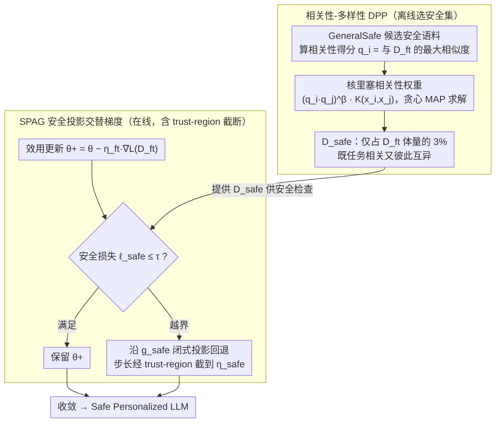

# SPARD: Defending Harmful Fine-Tuning Attack via Safety Projection with Relevance-Diversity Data Selection

**会议**: ICML 2026  
**arXiv**: [2605.28030](https://arxiv.org/abs/2605.28030)  
**代码**: https://github.com/shuhao02/SPARD (有)  
**领域**: LLM安全 / 对齐RLHF / 有害微调防御  
**关键词**: 有害微调攻击, 安全投影, 行列式点过程, 安全约束优化, LoRA

## 一句话总结
SPARD 用"安全投影交替优化（SPAG）+ 相关性-多样性 DPP 安全样本选择"两件套，把"微调后模型必须满足安全损失约束"显式写成约束优化问题，每步先做效用更新，再用闭式投影把参数拉回安全半空间，同时只用 3% 任务相关且彼此互异的安全样本，就把四种有害微调攻击的平均 ASR 从 SFT 的 87.93% 砍到 9.45%，几乎不掉下游精度。

## 研究背景与动机

**领域现状**：Fine-tuning-as-a-service 已成为 LLM 落地主流，但下游微调会快速侵蚀预训练阶段的安全对齐。攻击者只要在用户上传的数据里掺入少量恶意样本（harmful fine-tuning attack），就能把 RLHF/DPO 辛苦烤进去的安全护栏一夜抹掉。

**现有痛点**：现有防御大致分两派。一派是提示/结构约束派（PTST、SafeLoRA），靠推理时回灌安全 prompt 或限制 LoRA 子空间，对模板和层选择敏感、通用性差；另一派是安全数据正则派（SafeInstr、Lisa、SafeGrad），把一小撮安全样本以 penalty / 近端项形式塞进 loss。后者的两个硬伤是：(i) 安全约束只是软惩罚，penalty 系数 $\lambda$ 难调，效用-安全的权衡缺乏显式控制；(ii) 安全样本通常随机抽，忽略了"任务相关的安全样本能提供更强纠正信号"这一事实。

**核心矛盾**：本质上是"效用方向梯度"与"安全方向梯度"的几何冲突——penalty 把两者线性混合，既无法保证可行性，也无法在不同任务/攻击下自适应纠正力度；而安全样本的"质量"维度（与 $D_{ft}$ 的相关性 + 子集多样性）从未被同时优化过。

**本文目标**：(a) 把安全微调显式写成 $\min_\theta L(D_{ft},\theta)$ s.t. $L(D_{safe},\theta)\le\tau$ 的约束问题，并给一个免调参的闭式解；(b) 设计一个能同时建模相关性和多样性的安全数据选择器，让小规模 $D_{safe}$ 也能覆盖广泛风险。

**切入角度**：作者在 Figure 2 做了一组关键实验——把安全样本按与 $D_{ft}$ 的 cosine 相似度分桶，发现 ASR 随相似度上升先单调下降（68.8% → 11.4%），但相似度过高（≈0.94）时反弹到 16.6%。这说明相关性和多样性都不可偏废，单峰的相似度选择会让安全集塌缩到狭窄风险区。

**核心 idea**：把"安全软惩罚 + 随机选数据"两个弱环节同时升级——用投影法把安全约束写成几何上的可行性条件，用 Relevance-Diversity DPP 在 kernel 里联合编码相关性权重 $(q_iq_j)^\beta$ 与样本互异性。

## 方法详解

### 整体框架
SPARD 把"微调后模型必须满足安全损失约束"写成约束优化问题 $\min_\theta L(D_{ft},\theta)$ s.t. $L(D_{safe},\theta)\le\tau$，并拆成两阶段落地。离线阶段先用**相关性-多样性 DPP**从安全语料 GeneralSafe 里挑出一个只占 $D_{ft}$ 体量 3% 的小安全集 $D_{safe}$，要求它既和下游任务相关、彼此又足够互异；在线阶段则用 **SPAG（Safety-Projected Alternating Gradient，安全投影交替梯度）**，每步先在 $D_{ft}$ 上做一次正常的 LoRA 效用更新得到 $\theta^+$，再用 $D_{safe}$ 检查安全损失是否越界，越界就沿安全梯度做闭式投影、把参数拉回安全半空间（步长再经 trust-region 截断稳住）。最终交付一个 LoRA 适配后的 "Safe Personalized LLM"，下游精度接近 SFT，但安全护栏几乎不被攻击数据撼动。

### 关键设计

**1. 相关性-多样性 DPP：在核里同时编码"任务相关"和"彼此互异"**

安全集 $D_{safe}$ 选得好不好直接决定纠正信号打不打得准，所以离线阶段先把它选好。作者在 Figure 2 把安全样本按与 $D_{ft}$ 的 cosine 相似度分桶后发现一条 U 型曲线：ASR 随相似度上升先单调下降（68.8% → 11.4%），但相似度过高（≈0.94）时反弹到 16.6%——只追相关性会让安全集塌缩到狭窄风险区而过拟合，只追多样性又给不了任务相关的纠正信号，两者必须兼顾。

传统 DPP 用选择概率 $P(C)\propto\det(L_C)$ 只奖励多样性，无视任务相关。SPARD 先给每个候选样本算一个相关性得分 $q_i=\max_{x_z\in D_{ft}}\text{sim}(x_i,x_z)$（与下游集的最大相似度），再把它以乘性权重塞进核 $\widehat{K}_{ij}=(q_iq_j)^\beta K(x_i,x_j)$，于是选择概率优雅地分解成 $P(C)\propto\prod_{x_i\in C}q_i^{2\beta}\cdot\det(L_C)$——前一项推高相关样本权重，后一项靠行列式体积鼓励互异性，$\beta$ 一个超参就控制两者比重（$\beta=0$ 退化为纯多样 DPP，实验中 $\beta\in[2,4]$ 时 ASR 最低）。嵌入用预训练 LLM 最后一层的均值 hidden state，求解用贪心 MAP：每步挑边际行列式增益 $\widehat{L}_{ii}-\|w_i\|^2$ 最大的样本，其中 $w_i$ 由 Cholesky 因子的三角系统 $Cw_i=v_i$ 增量解出，把单步复杂度降到 $O(m)$。相比"先按相似度排序再去重"的两步法，把 $q_i$ 直接写进 kernel 让相关性和多样性在同一个目标里联合最大化，更干净也更可控。

**2. SPAG 安全投影交替梯度：把软惩罚换成几何上的"按需投影"，再用 trust-region 截断稳住步长**

选好 $D_{safe}$ 后，在线阶段每步如何用它来约束训练就靠 SPAG。现有安全正则派（SafeInstr、Lisa、SafeGrad）都把安全约束写成 loss 里的 penalty 项，硬伤是系数 $\lambda$ 是个全局常数，对所有 batch、所有训练阶段一视同仁，既保证不了可行性，也没法随不同攻击自适应纠正力度。SPAG 干脆把约束当成几何条件来满足：每步先在 $D_{ft}$ 上做一次效用更新得到 $\theta^+$，再把安全约束 $L(D_{safe},\theta)\le\tau$ 在 $\theta^+$ 处做一阶 Taylor 展开，得到一个半空间 $C^+=\{\theta:L(D_{safe},\theta^+)+\langle g_{safe},\theta-\theta^+\rangle\le\tau\}$，然后求 $\theta^+$ 到这个半空间的欧氏投影。由 KKT 条件，投影有干净的闭式解——约束已满足时直接保留 $\theta^+$，违反时则沿安全梯度 $g_{safe}=\nabla L(D_{safe},\theta^+)$ 回退一步 $\theta_{new}=\theta^+ - \frac{L(D_{safe},\theta^+)-\tau}{\|g_{safe}\|^2}g_{safe}$。

关键在于这一步的步长不是手调的：它由当前违约量 $\ell_{safe}-\tau$ 和梯度范数共同决定，已经安全时步长自动归零、违约越严重纠正越狠，本质上是"按需投影"，既省掉了调 $\lambda$ 的痛苦，又能给出首阶可行性的理论保证。工程上 Algorithm 1 只比 SFT 多约 5 行代码。

不过上面的闭式步长 $\frac{\ell_{safe}-\tau}{\|g_{safe}\|^2}$ 有个隐患——当安全梯度范数 $\|g_{safe}\|$ 极小时分母趋零，步长会爆炸，一步就能把 LoRA 参数推到远点，跳出 Taylor 一阶展开成立的局部区域，既破坏可行性又损害已经收敛的下游知识。SPAG 因此借鉴 TRPO 的 trust-region 思路把实际步长截到一个信赖域半径 $\eta_{safe}$ 内，即 $\alpha=\min(\frac{\ell_{safe}-\tau}{\|g_{safe}\|^2},\eta_{safe})$，实验里直接把 $\eta_{safe}$ 设成与效用学习率 $\eta_{ft}$ 相同的 $5\times10^{-5}$。这个截断其实是"安全-效用"权衡的旋钮：Table 4 的消融显示去掉 trust-region 后 ASR 能进一步压到 5.03%（更安全），但下游精度从 85.77% 跌到 81.92%（更伤效用）——步长截得越短越偏向保住效用，放得越开越偏向安全，部署时无需重训就能调。

### 损失函数 / 训练策略
不引入新的 loss，效用步用标准任务 CE loss $L(D_{ft},\theta)$，安全步用 $D_{safe}$ 上的 CE loss $L(D_{safe},\theta)$。LoRA 秩 $r=32$、alpha $=4$，AdamW，学习率 $5\times10^{-5}$，GSM8K 训 10 epoch、OpenBookQA 训 3 epoch。安全阈值 $\tau=0.2$（实际即预训练 LLM 在 $D_{safe}$ 上的平均损失），$D_{safe}$ 比例 $p=0.03$，DPP 相关性指数 $\beta=4$，安全 mini-batch 大小为 1。

## 实验关键数据

### 主实验

| 数据集 / 模型 | 攻击设置 | 指标 | SFT | Lisa | SafeGrad | **SPARD** |
|--------|------|------|----------|-----|------|-----|
| GSM8K / Qwen-2.5-7B | 4 攻击平均 | ASR ↓ | 87.93 | 19.12 | 30.18 | **9.45** |
| GSM8K / Qwen-2.5-7B | 4 攻击平均 | HS ↓ | 4.28 | 1.56 | 1.93 | **1.32** |
| GSM8K / Qwen-2.5-7B | 4 攻击平均 | GSM8K Acc ↑ | **86.77** | 78.45 | 85.71 | 85.77 |
| GSM8K / LLaMA-3.2-3B | 4 攻击平均 | ASR ↓ | 91.36 | 24.19 | 71.77 | **12.09** |
| GSM8K / LLaMA-3.2-3B | 4 攻击平均 | Acc ↑ | **72.27** | 65.03 | 64.29 | 71.23 |
| OpenBookQA / Qwen-2.5-7B | 4 攻击平均 | ASR ↓ | 40.29 | 18.80 | 20.63 | **14.54** |
| OpenBookQA / Qwen-2.5-7B | 4 攻击平均 | Acc ↑ | **83.70** | 78.90 | 83.30 | 83.25 |

SPARD 在三套（模型 × 任务）组合的所有四种攻击（BeaverTails / I-BeaverTails / LatHarmful / Q-LatHarmful）下都拿到最低 ASR/HS，下游精度比 SFT 最多只掉 1 个点，远好于唯一在精度上接近 SFT 的 SafeGrad（ASR 高出 20%+）。

### 消融实验

| 配置 | Avg ASR | GSM8K Acc | 说明 |
|------|---------|-----------|------|
| Full SPARD | 9.45 | 85.77 | SPAG + Relevance-Diversity DPP + trust-region |
| SPARD w/o trust-region | 5.03 | 81.92 | 投影不截断，更安全但掉精度 3.85% |
| SPARD w/ 随机选数据 | 升高 | 接近 | Relevance-Diversity DPP 对压低 ASR 至关重要（Table 5 显示去掉 DPP 选择后所有攻击 ASR 全面恶化） |
| $\beta=0$ (纯多样 DPP) | 较高 | — | Figure 5 显示 $\beta\in[2,4]$ 时 ASR 最低，$\beta$ 过小（只多样）或过大（只相关）都会回弹 |
| $p=0$ (无安全数据) | >80 | — | 退化为 SFT 等价情形 |
| $p\in[0.03,0.05]$ | 最低 | — | Figure 3 显示 3-5% 是甜点，再大也不再降反而轻微回弹 |

### 关键发现
- **相关性 ≠ 越高越好**：Figure 2 揭示了相关性-ASR 的 U 型曲线（高相关 0.94 时 ASR 反而回弹到 16.6%），首次实证了"安全数据要相关也要互异"，直接为 DPP kernel 中的 $(q_iq_j)^\beta$ 设计提供观察依据。
- **trust-region 是效用旋钮**：去掉它能把 ASR 进一步压到 5.03%（最强安全），但代价是下游精度从 85.77% 跌到 81.92%——投影步长越大越偏向安全，越短越偏向效用，提供了一个无需重训的部署后调节点。
- **小样本即可见效**：仅用 $p=3\%$ 的安全样本就把 SFT 的 87.93% ASR 砍到 9.45%，每步还只采 1 个安全样本，开销远低于 Lisa 的 bi-state 优化。
- **跨架构稳定**：LLaMA-3.2-3B 在 LatHarmful 下 SFT 的 ASR 高达 98.99%，SPARD 仍能压到 11.31%，说明投影机制不依赖特定 backbone 的脆弱性结构。

## 亮点与洞察
- **把"安全约束"从 loss 项升级到几何投影**：penalty 法本质上把约束转成软目标，可行性无保证；SPAG 用 Taylor 展开 + KKT 闭式解得到"按需投影"的步长，省掉 $\lambda$ 调参的同时获得首阶可行性证明，工程上极简（Algorithm 1 只比 SFT 多 5 行代码），思想上把约束优化的几何视角带进了 LLM 安全微调。
- **DPP kernel 里塞相关性权重的小手术**：传统 DPP 是无监督多样性工具，作者只在 kernel 上加一个 $(q_iq_j)^\beta$ 乘性因子，就让概率分解出 $\prod q_i^{2\beta}\cdot\det(L_C)$ 的优雅形式，相关性和多样性各管各的项，$\beta$ 一个超参就能扫遍整个权衡谱。这个 trick 完全可以平移到 instruction tuning 数据选择、RLHF preference pair 选择等任何"想要相关但又怕冗余"的子集选择问题。
- **Figure 2 的 U 型曲线是真正的洞察起点**：很多"相关性数据选择"工作只跑单调递增/递减实验就收手，本文坚持把相似度推到极端（0.94）才发现回弹现象，正是这个观察让"必须显式建模多样性"有了实证基础——一个值得借鉴的实验设计习惯。

## 局限与展望
- **作者承认的局限**：相关性得分 $q_i$ 依赖固定的预训练嵌入空间，未与 LoRA 适配过程联动更新；当下游任务与所有候选安全样本都低相似时（OOD 任务），DPP 选出的子集质量会退化。
- **自己发现的局限**：(i) 实验只在 7B/3B 规模和 LoRA 上验证，全参微调下 $g_{safe}$ 的高维投影是否仍能保持几何意义需要更多证据；(ii) 攻击集只覆盖 BeaverTails 系两个家族，对 prompt-injection、weight-tampering 等非数据投毒攻击未覆盖；(iii) trust-region $\eta_{safe}$ 直接设成 $\eta_{ft}$ 缺乏理论指导，效用-安全权衡仍是经验调参；(iv) Algorithm 1 每步都要做两次前/反向（效用 + 安全），训练成本约为 SFT 两倍。
- **具体的改进思路**：把嵌入空间换成 LoRA 适配后的隐藏态、做在线 DPP 重选；把 SPAG 推广到多约束（毒性 + 偏见 + 隐私）的联合投影；研究 $\eta_{safe}$ 的自适应 scheduler（按训练进度从大到小）。

## 相关工作与启发
- **vs SafeInstr (Bianchi et al., 2024)**: 他们把 3% 安全样本随机掺进微调集靠语言模型自我正则；本文同样用 3% 但通过 DPP 选 + 显式投影，在 Qwen-GSM8K 上 ASR 从 73.59% 降到 9.45%，证明"怎么用安全样本"比"用多少"更关键。
- **vs Lisa (Huang et al., 2024c)**: Lisa 用 bi-state 优化 + 近端项约束两个状态的漂移，本质仍是 penalty；SPARD 用闭式投影一步到位，免去 $\lambda$ 调参，且在 LLaMA 上 ASR 再压一半（24.19% → 12.09%），精度还高 6.2%。
- **vs SafeGrad (Yi et al., 2025)**: SafeGrad 检测效用-安全梯度冲突并投出有害分量，是梯度空间的"减法"；SPARD 是参数空间的"投影回退"，几何视角不同。结果显示 SPAG 在 ASR 上完胜（9.45 vs 30.18），说明在参数空间投影比在梯度空间过滤更稳定。
- **vs SafeLoRA / PTST**: 这两者依赖结构约束或推理时 prompt，限制 LoRA 子空间或加载安全模板；SPARD 不约束 LoRA 结构、不依赖推理时模板，适用范围更广。

## 评分
- 新颖性: ⭐⭐⭐⭐ 投影法本身在 RL 安全（CPO/TRPO）和 fairness 优化里很经典，但首次干净地搬进 LLM 有害微调防御，并配上 DPP kernel 改造的安全数据选择，组合点新颖、解法优雅
- 实验充分度: ⭐⭐⭐⭐ 两个模型 × 两个任务 × 四种攻击 = 16 组主实验 + 5 个超参敏感性分析 + trust-region/DPP 消融，覆盖到位；但缺少对 13B+ 规模、全参微调、prompt-injection 攻击的验证
- 写作质量: ⭐⭐⭐⭐ 动机的 U 型曲线观察讲得清楚，方法部分的 Taylor 展开+KKT 推导给到 Appendix，符号自洽易读；缺一个 SPAG vs Penalty 的几何示意图会更直观
- 价值: ⭐⭐⭐⭐⭐ 完全免调参、闭式投影、与 LoRA 即插即用、3% 安全数据即可把 ASR 从 88% 砍到 9%，对 fine-tuning-as-a-service 平台是可直接落地的防御范式

<!-- RELATED:START -->

## 相关论文

- [\[ICML 2026\] Safety Anchor: Defending Harmful Fine-tuning via Geometric Bottlenecks](safety_anchor_defending_harmful_fine-tuning_via_geometric_bottlenecks.md)
- [\[ICML 2026\] GIST: 用梯度子空间投影做 instruction tuning 的 targeted 数据选择](gist_targeted_data_selection_for_instruction_tuning_via_coupled_optimization_geo.md)
- [\[ICML 2026\] Efficient Preference Poisoning Attack on Offline RLHF](efficient_preference_poisoning_attack_on_offline_rlhf.md)
- [\[AAAI 2026\] Importance-Aware Data Selection for Efficient LLM Instruction Tuning](../../AAAI2026/llm_alignment/importance-aware_data_selection_for_efficient_llm_instruction_tuning.md)
- [\[ICML 2026\] Curriculum Learning for Safety Alignment](curriculum_learning_for_safety_alignment.md)

<!-- RELATED:END -->
