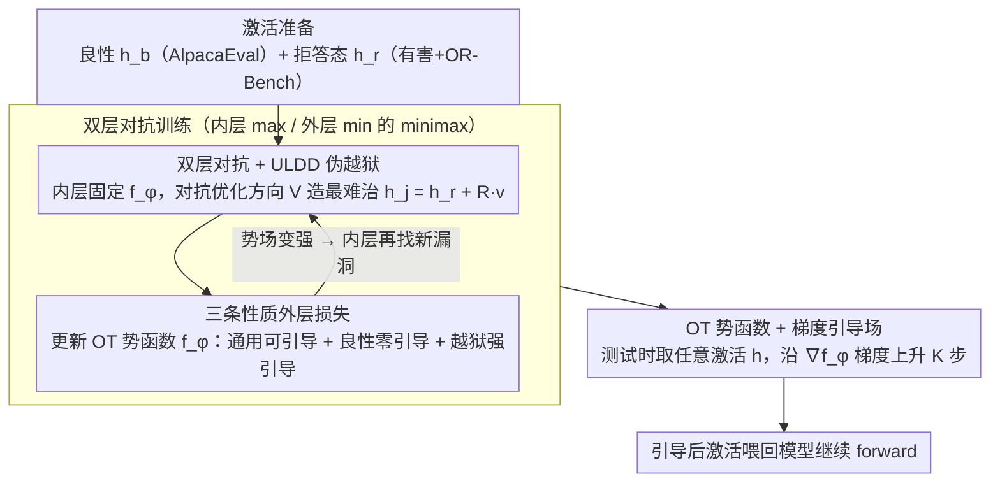

# Steering Beyond the Support: Adversarial Training on Unsupervised Jailbroken Activation Simulation

**会议**: ICML 2026  
**arXiv**: [2605.24535](https://arxiv.org/abs/2605.24535)  
**代码**: 无  
**领域**: LLM 安全 / 越狱防御 / 激活引导 / 对抗训练  
**关键词**: safety steering, jailbreak defense, unsupervised latent direction, bi-level adversarial training, optimal transport

## 一句话总结
论文针对监督式 safety steering 在未见越狱攻击上失效的问题，提出用"无监督潜在方向发现 + 双层对抗训练"在激活空间里凭空模拟出新型 jailbroken 状态，并把这些模拟状态当作对抗样本来训练一个 OT 势函数（其梯度构成空间变化的引导场），在三个 LLM × 六类经典越狱上把攻击成功率压到大多数 <5% 且基本不伤害良性效用。

## 研究背景与动机

**领域现状**：safety steering 是当前 LLM 防越狱的主流轻量方案——不重训模型，只在隐藏激活上做测试时干预（线性加 refusal 方向、条件化 steering、null-space 约束等），把会触发有害回答的激活推回拒答区域，同时尽量保留良性输入的功能。

**现有痛点**：所有这类方法都是**监督的**——必须事先收集"良性 / 已知越狱"的配对激活作为训练支撑。可是真实越狱不停演化（GCG 后缀、AutoDAN、PAIR、TAP、FewShot…），训练时见过的只是冰山一角。论文用 AlphaSteer 在 Mistral-v2-7B 上做实证（Tab. 1）：仅用部分越狱家族训练时，对 in-distribution 攻击 SR 可以压到 1.8–8.4，但一换到未见家族 SR 立刻反弹到 30%+，监督 steering 本质上是在记忆已见越狱周围的局部修正。

**核心矛盾**：训练支撑是**静态、有限**的，而真实 jailbroken 激活分布是**开放、OOD** 的。要么做全局干预（伤害良性效用），要么做条件干预（泛化失败），鱼和熊掌不可兼得。

**本文目标**：(1) 不依赖任何越狱标签，零样本扩展训练支撑；(2) 让 steering 在良性激活上接近零干预、在 jailbroken 激活上有强干预；(3) 让这个 steering 持续进化以追赶未见攻击。

**切入角度**：作者注意到 *无监督潜在方向发现*（unsupervised latent direction discovery, ULDD; Mack & Turner 2024）——只用无标签 prompt 就能在浅层找到一组方向 $V \in \mathbb{R}^{d\times K}$，注入后可以**因果地**改变深层激活并诱发各种行为（换语言、换语气，甚至凑巧触发越狱）。Tab. 2 显示这些方向能让 LLaMA-3-8B / Mistral-v2-7B / Qwen-2.5-7B 各自跑出几十到几百个成功的"模拟越狱"，且彼此余弦相似度 <0.11，多样性极强。

**核心 idea**：用 ULDD 从拒答态激活里**外推**出 OOD 的"伪 jailbroken 激活"，再把这个外推过程嵌进双层对抗训练——内层不断生成对当前 steering 最难治的伪越狱，外层把 steering 训得能把这些伪越狱也压回拒答区，从而**让模拟支撑逐步逼近真实越狱子空间**。

## 方法详解

### 整体框架

论文要解决的是监督 steering 泛化不到未见越狱的问题，整套框架把三件事拧在一起：把固定 refusal 向量升级成一个势函数的梯度场，用 ULDD 从拒答激活外推出 OOD 的伪越狱激活，再用双层对抗让"造伪越狱"和"治伪越狱"互相逼迫、共同进化。设对齐 LLM $F$ 在层 $\ell$ 的隐状态为 $h_\ell(x) \in \mathbb{R}^d$，训练时维护四样东西：良性激活 $h_b$（500 条 AlpacaEval）、拒答态激活 $h_r$（1500 条直接有害请求 + OR-Bench 边界）、一个小 MLP 势函数 $f_\phi: \mathbb{R}^d \to \mathbb{R}$，以及 $K$ 个 ULDD 潜在方向 $V \in \mathbb{R}^{d \times K}$。每个外层步先做内层——固定 $\phi$，对抗地优化 $V$ 让伪越狱 $h_j^{\text{adv}} = h_r + R v$（$v$ 从 $V$ 的列采样、$R$ 是预设外推幅度）在当前势函数下"最难被引导回去"；再做外层——拿这批新的 $h_j^{\text{adv}}$ 更新 $\phi$，逼势函数同时满足通用可引导、良性零引导、jailbroken 强引导三条性质。测试阶段完全不需要越狱标签：给任意输入 $x$ 在层 $\ell$ 取激活 $h$，沿 $\nabla_h f_\phi(h)$ 走 $K$ 步梯度上升 $h^{(k+1)} = h^{(k)} + \eta \nabla_h f_\phi(h^{(k)})$，把引导后的激活喂回模型继续 forward。

### 关键设计

**1. OT 势函数 + 梯度引导场：把固定向量换成输入相关的非线性场**

监督 steering 的第一个软肋是它只会"全局加一个固定 refusal 向量"，良性和 jailbroken 激活吃的是同一剂干预，没法局部差异化。本文把"jailbroken 分布 $\mu \to$ 拒答分布 $\nu$"建模成最小代价的 Wasserstein-1 输运，用 Kantorovich-Rubinstein 对偶 $W_1(\mu,\nu) = \sup_{\|f\|_L \le 1}(\mathbb{E}_\mu[f] - \mathbb{E}_\nu[f])$ 训出一个 1-Lipschitz 势函数 $f_\phi$，让它在拒答激活上取大值、其他激活上取小值——这样它的梯度 $v_\phi(h) = \nabla_h f_\phi(h)$ 天然就是一张"把 $h$ 往拒答区推"的方向场。Lipschitz 约束沿用 WGAN-GP 的梯度惩罚，在插值点 $\hat h = \epsilon h_r + (1-\epsilon) h_-$ 上施加 $L_{\text{GP}} = \mathbb{E}[\text{ReLU}(\|\nabla_{\hat h} f_\phi\|_2 - 1)]$。固定向量 steering 其实只是 $f$ 取二次型时的特例，表达力被钉死；而"良性零干预 + jailbroken 强干预"这对矛盾目标本质上要求引导随空间位置变化，所以非用 MLP 这类势函数不可，Appendix G 的消融也证实 MLP 势函数稳压一阶 / 多阶线性 steering。

**2. 三条性质共同约束的外层损失：用势差和梯度范数当两个旋钮**

光有"全局往拒答方向流"还不够，势场必须能分辨良性和 jailbroken 并区别对待。外层损失把这点拆成三项叠加。通用可引导性 $L_g = L_{\text{OT}} + \lambda_{\text{GP}} L_{\text{GP}}$，其中 $L_{\text{OT}} = -(\mathbb{E}_{h_r}[f_\phi(h_r)] - \mathbb{E}_{h_-}[f_\phi(h_-)])$ 推大"拒答激活"与"其它激活"的势差（$h_-$ 同时含良性与对抗 jailbroken）。良性零引导性靠梯度范数惩罚 $L_b = \mathbb{E}_{h_b}[\|\nabla_h f_\phi(h_b)\|_2^2]$ 实现，配一个很大的权重把良性处的梯度逼近 0，于是良性输入梯度上升几乎不动、效用不受损。jailbroken 强引导性反过来用 $L_j = -\mathbb{E}_{h_j}[\|\nabla_h f_\phi(h_j)\|_2^2]$ 鼓励势函数在伪越狱激活附近梯度尽量大，好让梯度上升一把就把它们拽回拒答区。把"势差"管"往哪流"、把"梯度范数"当一个抑制一个增强的局部强度旋钮，就在同一张场上对不同语义的激活做了空间差异化的强弱控制——这正是固定向量 steering 缺的那块能力。

**3. 双层对抗：用 ULDD 在线生成对当前 $f_\phi$ 最难治的伪越狱**

监督 steering 失败的真正根因是训练支撑是静态有限的、盖不住开放的真实越狱子空间。本文让训练支撑跟着 $f_\phi$ 一起进化——哪儿势场弱，下一批伪越狱就往哪儿挤。内层固定 $\phi$、更新 $V$ 去最大化 $L_j(h_j^{\text{adv}}; f_\phi) + \gamma L_{\text{ULDD}}(h_r)$，其中 ULDD 损失 $L_{\text{ULDD}} = \mathbb{E}_{u\in U, v\in V}[\langle u, \Delta h_t(v)\rangle] - \lambda(\|U^\top U - I\|^2 + \|V^\top V - I\|^2)$ 保证每个方向都能在深层诱发显著且彼此独立的语义变化（$U$ 是预期语义变化方向，正交惩罚强制 $V$ 的列互不重合）。注意 $L_j$ 在内层是 max（造更难治的伪越狱）、在外层是 min（把它们治服），符号相反构成一个 minimax 对抗。衡量进展的代理量是 subspace coverage（Eq. 18-19）：用 PCA 投影能量比 $\text{Cov}_t^a(h) = \|P_a h\|^2 / \|h\|^2$ 度量伪越狱激活落在真实攻击家族 $a$ 子空间里的能量占比，越高说明模拟支撑越逼近真实越狱。训练中 coverage 单调上升、Avg. SR 同步单调下降（Fig. 6-7），机制上把"覆盖增长"和"防御增强"显式钉在一起。

### 损失函数 / 训练策略

完整的双层 minimax 写出来就是：内层 $V \in \arg\max_V [L_j(h_j^{\text{adv}}; f_\phi) + \gamma L_{\text{ULDD}}(h_r)]$，其中 $h_j^{\text{adv}} = h_r + R v,\ v \sim V$；外层 $\phi \in \arg\min_\phi L_g(h_b, h_r, h_j^{\text{adv}}; f_\phi) + \lambda_1 L_b(h_b; f_\phi) + \lambda_2 L_j(h_j^{\text{adv}}; f_\phi)$。数据用 500 AlpacaEval（良性）+ 500 OR-Bench（边界）+ 1000 AdvBench∪OR-Bench-toxic（去重 Harmbench），三个模型各训一份独立的 $f_\phi$。

## 实验关键数据

### 主实验

在 Harmbench 六类越狱（GCG / AutoDAN / GPTFuzz / PAIR / TAP / FewShot）上用 StrongReject（SR ↓）衡量防御强度（Tab. 3 部分摘录，越低越好）：

| 模型 | 基线 | + CB | + LAT | + ROSI | + AlphaSteer | + 本文 |
|------|------|------|-------|--------|--------------|--------|
| LLaMA-3-8B Safety Avg | 14.93 | **3.85** | 5.05 | 6.04 | 5.38 | 4.01 |
| Mistral-v2-7B Safety Avg | 59.72 | 5.42 | 6.70 | 8.47 | 5.86 | **5.26** |
| Qwen-2.5-7B Safety Avg | 33.27 | 5.70 | 5.82 | 7.80 | 4.48 | **4.46** |

效用保留（Tab. 4，Utility = (ARC + TruthfulQA + GSM8K)/3 − OR-FPR，越高越好）：

| 模型 | 基线 | + CB | + LAT | + ROSI | + AlphaSteer | + 本文 |
|------|------|------|-------|--------|--------------|--------|
| LLaMA-3-8B Utility | 56.5 | 14.0 | 23.5 | 30.1 | 37.9 | **46.5** |
| Mistral-v2-7B Utility | 56.4 | −26.0 | 24.5 | 20.7 | 31.4 | **36.6** |
| Qwen-2.5-7B Utility | 74.8 | 40.3 | 46.8 | 42.2 | 49.8 | **53.5** |

CB / LAT 防御强但严重过度拒答（Mistral 上 OR-FPR 83.3%，Utility 直接负数），本文在保留几乎全部基础能力的同时把 OR-FPR 控制到 16–23%，整体效用领先所有 baseline。

### 消融 / 对抗与机制分析

| 配置 | Mistral SR ↓ | 说明 |
|------|--------------|------|
| 基线模型 | 63.34 | 无防御 |
| 本文（非自适应攻击） | 7.10 | 标准 GCG 等 |
| 自适应 GCG | 12.55 | 攻击者拿到带防御的模型再优化 suffix |
| Steering-aware GCG | 15.54 | 攻击者额外最小化 $\|\nabla f_\phi\|$ 试图绕过梯度场 |

| 训练策略 | 趋势 | 说明 |
|----------|------|------|
| Targeted AT（让伪越狱以"sure, here is..."开头） | coverage 早期 plateau，Avg. SR 高位停滞 | 目标前缀限制了对抗激活多样性 |
| Unsupervised AT（本文） | coverage 在 6 个攻击家族上稳步上升，Avg. SR 单调下降 | ULDD 多样性带来广覆盖 |
| 去掉 AT（每步用非对抗方向） | coverage 几乎不动，Avg. SR 改善有限 | 双层对抗是性能主驱动 |

### 关键发现

- **subspace coverage ↔ 防御强度强耦合**（Fig. 6-7）：Coverage 上升曲线和 Avg. SR 下降曲线几乎镜像对称，作者把"模拟激活子空间能多大程度盖住真实越狱子空间"作为训练进程的可解释代理量，从机制层面解释了为什么对抗训练有效。
- **去掉双层对抗后性能崩盘**：仅靠外层目标本身效果有限，说明真正起作用的是内层不断"找漏洞"的过程，而非势函数本身的容量。
- **自适应攻击下仍稳健**：即使攻击者拿到 $f_\phi$ 并显式优化让势场梯度变小（steering-aware GCG），SR 也只升到 15.54（基线 63.34），梯度场远比固定向量 steering 难绕过。
- **OR-Bench 友好**：CB/LAT 之所以效用差是因为它们"一律打压"，本文在良性梯度上加超大权重 $\lambda_1$ 显式逼成 0，所以 OR-FPR 远低于其他强防御。

## 亮点与洞察

- 把 *无监督潜在方向发现* 这种偏可解释性 / 行为引导的工具，重新当成"零成本越狱模拟器"使用——不需要任何越狱标签就能在激活空间凭空造出 OOD 攻击样本，这一视角的迁移是论文最巧妙的地方。
- 用势函数的梯度场而非固定向量做 steering，把"是否引导"和"引导多强"解耦成"势差"和"梯度范数"两个旋钮，让良性零引导和 jailbroken 强引导这两个看似冲突的目标可以在同一个 $f_\phi$ 上空间共存。
- subspace coverage 这个度量很值得复用：以后做任何"训练支撑 vs 真实分布"的对抗工作，都可以拿"PCA 投影能量比"画 coverage-vs-性能曲线，把"机制解释"做得很硬。
- 写完后回头看，这套框架本质上是把 WGAN 的对偶视角搬到激活空间，把对抗样本生成器从"加噪扰动输入"换成"线性外推潜方向"，是一个比像素级对抗训练更适合 LLM 内部表征的对抗范式。

## 局限与展望

- 模拟能力受限于"线性潜方向外推"：作者自己承认 base64、密文这类非自然语言越狱可能落在线性 ULDD 触达不到的激活区，linear extrapolation 是 jailbreak 模拟器的天花板，未来可以尝试非线性变换、梯度搜索或多方向线性组合。
- 只在 LLaMA-3-8B / Mistral-v2-7B / Qwen-2.5-7B 三个 7-8B 模型上验证，70B+ 大模型上势函数容量是否够、训练成本如何尚不清楚。
- 测试时要做 $K$ 步梯度上升（论文未详述 $K$），多步迭代相比一次性线性 steering 增加了 forward 延迟，工程落地需要权衡。
- 三条性质权重 $\lambda_1, \lambda_2, \lambda_{\text{GP}}$、ULDD 维度 $K$、外推幅度 $R$ 等超参数对最终 SR / FPR 的影响在正文没充分扫描，可能存在调参敏感。
- 评分用 StrongReject（一个 fine-tune 的 Gemma-2B）和 GPT-4 判断 OR-FPR，评估器本身的偏差未深入讨论。

## 相关工作与启发

- **vs Refusal Direction (Arditi et al., 2024) / AlphaSteer (Sheng et al., 2025)**：都属于线性 refusal 方向 steering 家族，AlphaSteer 加 null-space 约束保效用，但仍是**全局单一方向 + 监督训练**。本文把它升级成 MLP 势函数的梯度场 + 无监督对抗训练，在 Mistral 上 SR 5.26 vs AlphaSteer 5.86、Utility 36.6 vs 31.4 双双更优。
- **vs Conditional Activation Steering (Lee et al., 2024) / JBShield (Zhang et al., 2025)**：这些做"按输入分类再选择性 steering"，仍然需要标注哪些是越狱。本文用 ULDD 在激活空间直接造伪越狱，根本绕过了标注问题。
- **vs Circuit Breaker (Zou et al., 2024) / LAT (Sheshadri et al., 2024)**：都属于表征层安全工程，CB 把有害激活打成无意义，LAT 在拒答激活附近做局部对抗鲁棒。CB/LAT 防御强但过度拒答严重（OR-FPR 30–80%），本文显式优化良性零引导把 OR-FPR 压到 16–23%，是过度拒答-鲁棒性 trade-off 上的明显进步。
- **vs Mack & Turner (2024) 的 unsupervised steering**：他们用 ULDD 做行为引导 / 能力探针；本文反着用来生成对抗样本驱动安全训练，是 ULDD 的一个新应用方向，值得在 hallucination、unlearning 等其他安全任务上类比复用。

<!-- RELATED:START -->

## 相关论文

- [\[ICML 2026\] Adaptive Probe-based Steering for Robust LLM Jailbreaking](adaptive_probe-based_steering_for_robust_llm_jailbreaking.md)
- [\[NeurIPS 2025\] Short-length Adversarial Training Helps LLMs Defend Long-length Jailbreak Attacks](../../NeurIPS2025/llm_alignment/short-length_adversarial_training_helps_llms_defend_long-length_jailbreak_attack.md)
- [\[ICLR 2026\] AlphaSteer: Learning Refusal Steering with Principled Null-Space Constraint](../../ICLR2026/llm_alignment/alphasteer_learning_refusal_steering_with_principled_null-space_constraint.md)
- [\[CVPR 2026\] Principled Steering via Null-space Projection for Jailbreak Defense in Vision-Language Models](../../CVPR2026/llm_alignment/principled_steering_via_null-space_projection_for_jailbreak_defense_in_vision-la.md)
- [\[ICLR 2026\] Beyond Pairwise: Empowering LLM Alignment With Ranked Choice Modeling](../../ICLR2026/llm_alignment/beyond_pairwise_empowering_llm_alignment_with_ranked_choice_modeling.md)

<!-- RELATED:END -->
