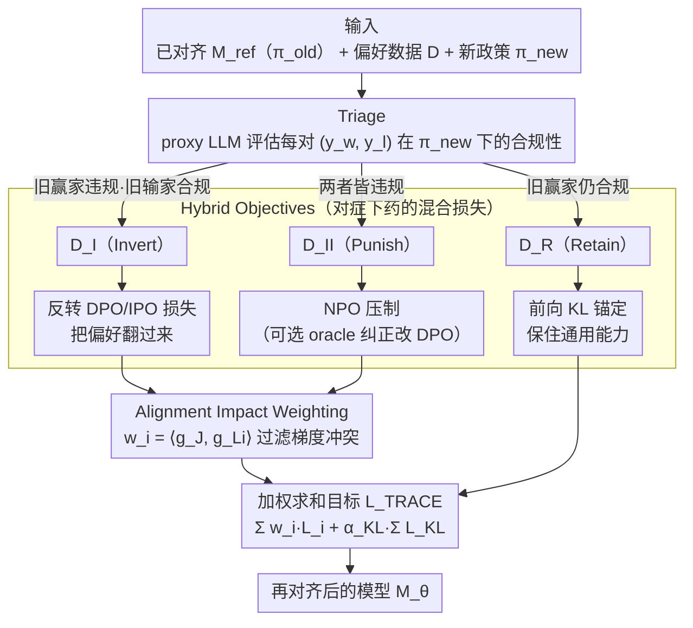

# The Realignment Problem: When Right becomes Wrong in LLMs

**会议**: ICML 2026  
**arXiv**: [2511.02623](https://arxiv.org/abs/2511.02623)  
**代码**: 有 (论文中提到 release)  
**领域**: LLM对齐 / 偏好学习 / 政策再对齐  
**关键词**: realignment, alignment-reality gap, triage, IPO, NPO, 双层优化

## 一句话总结
本文把"模型部署后政策变了怎么办"形式化为 Realignment 问题,提出 TRACE 框架:用更强的 proxy 模型把已有 preference pair 三分类 (Invert / Punish / Retain) 后用混合 IPO+NPO+KL 目标做手术式再对齐,无需新一轮人工标注就能跟上政策漂移。

## 研究背景与动机

**领域现状**:工业 LLM 部署后,对齐方式主流是 RLHF / DPO —— 拿一个 BPO 标注 pipeline 出来的 binary preference dataset $\mathcal{D}=\{(x, y_w, y_l)\}$ 训出模型 $\mathcal{M}_\theta$。这种对齐是 guideline-dependent 的:一旦数据进了参数,原始 policy guideline 就不可见也不可改。

**现有痛点**:监管 (EU AI Act、NIST RMF)、文化、组织风险偏好都在变,昨天合规的行为今天可能违规。重做全量人工标注成本爆炸;machine unlearning 只能删,不能"把规则改一改";单纯用 NPO 惩罚旧行为会让模型变得过度保守,出现 over-refusal;influence function 类方法又对 minor policy 变化过敏且实现闭源。

**核心矛盾**:政策是 dynamic 的,但参数化对齐是 immutable 的 —— 二者之间形成了一个**Alignment-Reality Gap**,而现有方法要么"代价太高 (重标)"要么"工具不对 (unlearning / NPO 没有 positive signal)"。

**本文目标**:在不重新人工标注的前提下,把"政策更新"做成一个**数据集再解读**问题 —— 给定新政策 $\pi_{\text{new}}$ 和已有 preference dataset,自动决定每条数据该怎么用 (反转 / 抑制 / 保留),再用 surgical 的优化把模型推向新政策,同时不毁掉通用能力。

**切入角度**:作者引入了一个简化但实际的"non-blind"假设 —— 我们有访问原 preference dataset 的权限 (虽然不知道 $\pi_{\text{old}}$ 本身),这样就避免了 blind 设定下需要 sampling 上千次响应来推 implicit policy 的不稳定操作。

**核心 idea**:用一个更强的 proxy LLM 当 $\pi_{\text{new}}$ 的 oracle,把每对 $(y_w, y_l)$ 三分类,然后用"反转用 IPO + 抑制用 NPO + 保留用 KL"的混合损失加双层优化的 impact weighting 做精细对齐。

## 方法详解

### 整体框架
起点是已对齐到 $\pi_{\text{old}}$ 的模型 $\mathcal{M}_{\text{ref}}$ 和原 preference 数据 $\mathcal{D}$。给定新政策 $\pi_{\text{new}}$ (一个返回 compliant/non-compliant 的函数),TRACE 走三阶段:**Stage 1 Triage** 用 proxy LLM 评估每条 $(x, y_w, y_l)$ 在 $\pi_{\text{new}}$ 下的合规性,划入 $\mathcal{D}_I$ (Invert)、$\mathcal{D}_{II}$ (Punish)、$\mathcal{D}_R$ (Retain);**Stage 2 Hybrid Objectives**对每类用不同 loss;**Stage 3 Alignment Impact Weighting** 通过双层优化推出每条样本的权重 $w_i$,再加权求和优化模型 $\mathcal{M}_\theta$。

### 关键设计

1. **Triage:用新政策当 oracle 把数据三分**:

    - 功能:解决"naive realignment"会犯的 False Dichotomy 错误 —— 不能假设"$y_w$ 违规就一定 $y_l$ 合规",因为 $\pi_{\text{new}}$ 完全可能让两者都违规
    - 核心思路:用 proxy LLM 同时评估 $\pi_{\text{new}}(y_w|x)$ 和 $\pi_{\text{new}}(y_l|x)$,根据组合落入三个桶:$\mathcal{D}_I$ (旧 winner 违规、旧 loser 合规,需反转),$\mathcal{D}_{II}$ (两者皆违规,需抑制),$\mathcal{D}_R$ (旧 winner 仍合规,保留)。第四种"两者皆合规"的理论情形并入 $\mathcal{D}_R$ 因为它对优化无判别信号
    - 设计动机:作者明确指出 Triage 阶段贡献了大部分对齐增益 —— 消融里去掉 Triage 用统一 punitive 跑全数据,Target Policy Agreement 从 70.7% 掉到 58.1%,差 12.6 个百分点

2. **Hybrid Objectives:对症下药的混合损失**:

    - 功能:不同冲突类型用不同的优化信号,既不浪费数据也不诱发 over-refusal
    - 核心思路:对 $\mathcal{D}_I$ 用反转后的 DPO/IPO 损失 $\mathcal{L}_I=-\log\sigma\big(\beta(\log\frac{p_\theta(y_l|x)}{p_{\text{ref}}(y_l|x)} - \log\frac{p_\theta(y_w|x)}{p_{\text{ref}}(y_w|x)})\big)$;对 $\mathcal{D}_{II}$ 默认用 NPO 同时压制 $y_w$ 和 $y_l$,可选用 oracle-LLM 生成纠正回复 $y_c$ 后改用 DPO loss on $(y_c, y_w)$;对 $\mathcal{D}_R$ 用前向 KL 散度 $\mathcal{L}_{KL}=D_{KL}(\text{Logits}_{\mathcal{M}_{\text{ref}}} \| \text{Logits}_{\mathcal{M}_\theta})$ 锚定通用能力
    - 设计动机:NPO 只给 negative 信号容易让模型变成"什么都不答的安全机器";给 $\mathcal{D}_{II}$ 加 oracle 纠正能让模型学到"在这种情况下该说什么"而不只是"不该说什么";KL 项保留 retain set 上的原始分布,防止灾难性遗忘

3. **Alignment Impact Weighting:双层优化的权重**:

    - 功能:让稀缺的梯度预算花在真正能推动政策合规的样本上,过滤掉与全局目标正交甚至冲突的局部更新
    - 核心思路:基于 U2A 的思想,把全局目标 $\mathcal{J}$ (例如 $\pi_{\text{new}}$ 合规度) 的梯度 $g_\mathcal{J}=\nabla_\theta \mathcal{J}(\theta_{\text{ref}})$ 当作"金标准方向",对每条冲突样本算它自己的任务梯度 $g_{\mathcal{L}_i}=\nabla_\theta \mathcal{L}_i(\theta_{\text{ref}})$,定义权重 $w_i=\langle g_\mathcal{J}, g_{\mathcal{L}_i}\rangle$;最终目标 $\mathcal{L}_{\text{TRACE}}(\theta)=\sum_{i\in\mathcal{D}_I\cup\mathcal{D}_{II}} w_i \mathcal{L}_i(\theta) + \alpha_{KL}\sum_{j\in\mathcal{D}_R}\mathcal{L}_{KL}(\theta;j)$
    - 设计动机:这是 implicit function theorem 推导的 marginal gain 近似 ($H_{\mathcal{L}_i}\approx \gamma I$ 后简化为点积),起到"梯度滤波器"作用 —— 正交样本权重 ~0,反向样本权重为负,自动避免有害更新;消融显示去掉 impact weighting,Target Policy Agreement 掉 7.4 个点,还伴随 GPQA、HellaSwag 退化

### 损失函数 / 训练策略
最终目标 $\mathcal{L}_{\text{TRACE}}$ 上面已给。$\beta$ 是 DPO 温度,$\alpha_{KL}$ 是 retain set 上 KL 项的固定系数。训练在 Qwen2.5-7B / Gemma-2-9B / Llama-3.1-8B 三个 backbone 上验证。

## 实验关键数据

### 主实验 (Pairwise Win Rate %,三 backbone 平均)

| 对比 | PKU-SafeRLHF | SynthValueBench | 标注一致性 α |
|------|--------------|-----------------|--------------|
| DPO-Gold vs TRACE | 68.2 | 74.6 | 0.80-0.82 |
| **TRACE vs U2A** | **81.8** | **85.3** | 0.75-0.79 |
| U2A vs TRACE | 18.2 | 14.7 | — |

TRACE 显著超过 U2A 基线 (~82-85% 的胜率),同时跟"完全重标的 gold standard" DPO-Gold 之间差距合理 (DPO-Gold 反过来胜 TRACE 仅 68-75%,说明 TRACE 已经把 NPO 类方法和全重标之间的鸿沟堵了一大半)。

### 消融 & 通用能力 (PKU-SafeRLHF)

| 模型 | GPQA | MMLU | HellaSwag | GSM8K |
|------|------|------|-----------|-------|
| Base (对齐前) | 31.6 | 70.6 | 81.4 | 70.4 |
| DPO-Gold (全重标) | 32.1 | 70.5 | 81.3 | 70.8 |
| **TRACE (Ours)** | 30.1 | 70.2 | 78.2 | 70.6 |
| U2A (Baseline) | 29.5 | 70.2 | 80.8 | 69.9 |

| 消融 (Llama-3.1-8B) | Target Policy Agree. | ASR | MMLU |
|----------------------|----------------------|-----|------|
| Full TRACE | 70.7 | 27.3 | ~70 |
| – Triage (统一 punitive) | 58.1 (-12.6) | — | — |
| – Impact Weighting | 62.8 (-7.9) | 32.1 (+4.8) | — |
| – KL on Retain | ~70 | — | ~64 (-6.1) |

### 关键发现
- **Triage 是最大头**:去掉它 -12.6 点,说明"把数据按新政策三分"本身就贡献了主要信号 —— 这其实在告诉社区,realignment 的瓶颈不在 loss 设计,在数据再解读
- **Impact weighting 既提性能又防退化**:去掉它不仅 alignment 掉,还会让 ASR 升、HellaSwag/GPQA 退化,印证它确实在过滤梯度冲突
- **KL 项是 utility anchor**:去掉它 alignment 不变但 MMLU 掉 6 点,说明它的作用纯粹是"防止学新忘旧"
- **Helpfulness 有代价**:TRACE 在 HellaSwag 上比 base 掉 3 点,作者坦诚地把这描述为"Helpfulness-Utility trade-off",而不是包装成无损 —— 在 alignment 是首要目标的部署场景下这个代价能接受

## 亮点与洞察
- **把 realignment 跟 unlearning 明确切开**:U2A 这类方法假设已有 forget set,TRACE 给的是"如何从政策变化推出 forget set"的上游解 —— 这个 reframe 看起来简单但非常本质,是这篇真正的核心贡献
- **三类损失 + 加权的混合设计是可复用 trick**:在任何"政策驱动的行为修改"场景里都能套 —— safety 重定向、品牌口径切换、地域合规适配都适用,不一定只是 RLHF
- **non-blind 假设的工程务实**:不假装去解 blind realignment (需要 sample 几千 response 估 implicit policy,实际不稳),而是直接说"我们有原 preference 数据" —— 这个设定在工业 BPO pipeline 下完全合理,作者愿意正面承认"data-reuse realignment 有信息论意义上的天花板",而不是吹成万能

## 局限与展望
- 作者承认与 DPO-Gold 之间仍有 robustness gap (对抗 ASR、win rate),反映了 data-reuse 方法的信息上限 —— 当 $\pi_{\text{new}}$ 引入了原数据完全没覆盖的新维度时,没新数据就是没办法
- 依赖 proxy LLM 的 judgement 质量,proxy 本身的偏见会传到下游;在某些价值判断 (如文化、政治) 上 proxy 的中立性可疑
- Impact weighting 用 isotropic Hessian 近似,在 loss landscape 强各向异性时可能失真
- Helpfulness 下降在 HellaSwag 上是真实的;在 helpfulness-critical 场景 (创意写作、客服) 部署时需要重新权衡
- 未来方向:把 Triage 做成连续 / 模糊三分,适配非 binary preference;在"新政策 vs 老数据"的信息缺口上引入小规模 active labeling

## 相关工作与启发
- **vs DPO (Rafailov et al. 2023)**:DPO 处理初次对齐,假设有新的全量人工偏好数据;TRACE 处理 post-deployment 政策更新,把旧数据 recycle
- **vs NPO (Zhang et al. 2024)**:NPO 只压制 bad response,容易 collapse 成 over-conservative;TRACE 的 Invert 类用 IPO 给 positive signal,Punish 类用 oracle correction 增强,避免了这个失败模式
- **vs U2A (Feng et al. 2025)**:U2A 提出 forget set 加权但假设 forget set 已知,TRACE 把"如何识别 forget set"补上了,是 U2A 的上游
- **vs value evaluation benchmarks (ValueBench, WorldValuesBench)**:这些只 diagnose 价值漂移,TRACE 给出 therapeutic intervention

## 评分
- 新颖性: ⭐⭐⭐⭐ Triage 阶段是干净的新贡献,混合 loss 和 impact weighting 是已有组件的精巧组合
- 实验充分度: ⭐⭐⭐⭐⭐ 三 backbone × 两数据集 × 人评 + 对抗测 + 通用能力 + 三种消融,做得很扎实
- 写作质量: ⭐⭐⭐⭐⭐ Realignment、Alignment-Reality Gap、False Dichotomy 这些 framing 概念清晰,假设 (non-blind) 和代价 (HellaSwag drop) 都明示
- 价值: ⭐⭐⭐⭐⭐ 直接对应工业部署痛点,代码开源,可落地性强,LLM 服务方就能直接拿来用

<!-- RELATED:START -->

## 相关论文

- [\[AAAI 2026\] When Human Preferences Flip: An Instance-Dependent Robust Loss for RLHF](../../AAAI2026/llm_alignment/when_human_preferences_flip_an_instance-dependent_robust_loss_for_rlhf.md)
- [\[ICML 2026\] PICACO: Pluralistic In-Context Value Alignment of LLMs via Total Correlation Optimization](picaco_pluralistic_in-context_value_alignment_of_llms_via_total_correlation_opti.md)
- [\[ICML 2025\] Diverging Preferences: When do Annotators Disagree and do Models Know?](../../ICML2025/llm_alignment/diverging_preferences_when_do_annotators_disagree_and_do_models_know.md)
- [\[NeurIPS 2025\] Ask a Strong LLM Judge when Your Reward Model is Uncertain](../../NeurIPS2025/llm_alignment/ask_a_strong_llm_judge_when_your_reward_model_is_uncertain.md)
- [\[ACL 2026\] WildFeedback: Aligning LLMs With In-situ User Interactions And Feedback](../../ACL2026/llm_alignment/wildfeedback_aligning_llms_with_in-situ_user_interactions_and_feedback.md)

<!-- RELATED:END -->
