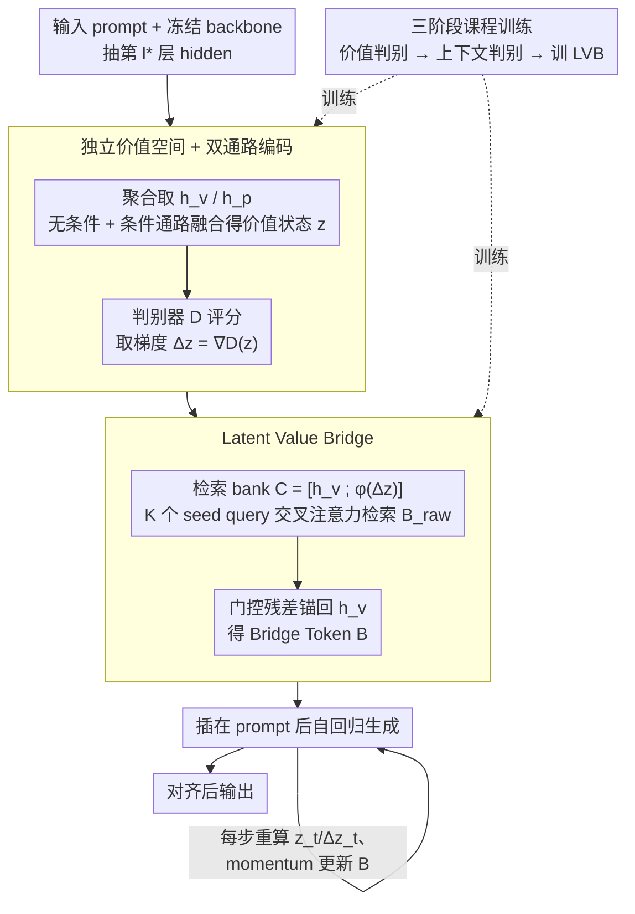

# Toward Stable Value Alignment: Introducing Independent Modules for Consistent Value Guidance

**会议**: ICML 2026 Spotlight  
**arXiv**: [2605.11712](https://arxiv.org/abs/2605.11712)  
**代码**: https://github.com/Clervils/SVGT.git (有)  
**领域**: LLM对齐 / RLHF替代 / 推理时引导  
**关键词**: 价值对齐, 推理时引导, Bridge Tokens, 独立价值模块, 安全

## 一句话总结
本文提出 SVGT，把价值对齐从"嵌入 backbone 参数/激活"改为"挂一个独立的价值模块"，先在隔离的 value space 里持续判断当前 hidden state 的安全方向，再用一组可学习的 Bridge Token 作为注意力锚点显式引导生成轨迹，在四种 backbone 上把有害分数普遍降低 70% 以上且几乎不损失流畅度。

## 研究背景与动机

**领域现状**：LLM 对齐主流方法可以按介入时机分成两大类：训练时（RLHF/PPO、DPO、IPO、KTO、Constitutional AI）把价值偏好优化进权重；推理时（System Prompt、输出层的 reward-guided decoding、激活层的 Representation Engineering 如 ITI/CAA/RE-Control）通过提示或 hidden state 干预去引导生成。

**现有痛点**：训练时方法把价值"摊"到几十亿参数里，安全往往退化成浅层输出模式而非深层不变表征，容易被 jailbreak；推理时方法虽然不动权重，但 ITI/CAA 这类直接往 residual stream 注入 steering vector 的做法在实验中常出现 inconsistent or inverse steering，且会推高 perplexity 影响流畅度。

**核心矛盾**：作者识别出一个结构性矛盾——稳定价值表征需要"在所有上下文里持续可激活、可耦合到生成"，而 residual stream 本质上高度动态，价值方向会被任务信号迭代地重塑、压缩、漂移；当 backbone 内部的 task-driven dynamics 和 value signal 同处一个空间时，前者会系统性"挤掉"后者。

**本文目标**：把对齐重新刻画为"生成时优化（generation-time optimization）"，让一个独立模块在推理时主动感知、判断、引导，而不是被动地从权重里读出对齐先验。

**切入角度**：从人类道德/价值判断的认知科学（Haidt、Cushman）出发：价值推理依赖跨上下文稳定的规范性机制，与具体任务表征解耦；据此，把 value processing 整体拎出到一个独立的 value space 里做，再以一种"显式接口"作用回 backbone。

**核心 idea**：用"独立价值空间 + Bridge Token"两段式结构——前者给出 context-invariant 的稳定价值方向 $\Delta\mathbf{z}$，后者把抽象修正翻译成一组可学习的 latent token，作为注意力锚点在前缀处插入，借助 frozen backbone 的 attention 机制自然影响生成轨迹。

## 方法详解

### 整体框架
SVGT 把对齐从"写进 backbone 权重"改成"挂一个外置价值模块"：backbone $\theta_{\mathrm{LLM}}$ 全程冻结，旁边外挂一个独立价值策略 $\pi_\phi$。它从指定的中-后期层 $l^*$ 抽 hidden states，先在一个与任务空间隔离的价值空间里判断"当前生成方向安不安全"、给出一个修正方向 $\Delta\mathbf{z}=\nabla_\mathbf{z}\mathcal{D}(\mathbf{z})$，再把这个抽象修正翻译成 $K$ 个 Bridge Token $\mathbf{B}\in\mathbb{R}^{K\times d}$ 插在 prompt 后面，让自回归生成在 frozen attention 的作用下被它们牵引。整套结构相当于把普通解码 $P(y_t|y_{<t},x)$ 扩展成带显式价值上下文的 $P(y_t|y_{<t},x,\mathbf{c}_v)$，其中 $\mathbf{c}_v=\pi_\phi(\mathcal{E}(\mathbf{h}))$。

### 关键设计

**1. 独立价值空间 + 双通路编码：把价值方向从动态的 residual stream 里隔离出来**

针对的痛点是 residual stream 高度动态、价值信号会被任务信号反复挤压漂移。SVGT 不在原空间里硬注入 steering vector，而是先用聚合算子 $\mathcal{A}$（last-token 或 attention pooling）从 hidden 序列 $\mathbf{H}^{(l^*)}$ 里抽出当前状态 $\mathbf{h}_v$ 和 prompt 上下文 $\mathbf{h}_p$，再走两条互补通路融合成一个隔离的价值状态 $\mathbf{z}$：无条件通路 $f_u(\mathbf{h}_v)$ 负责学"与上下文无关的全局价值先验"，条件通路 $\mathrm{CrossAttn}(f_c(\mathbf{h}_v),f_c(\mathbf{h}_p))$ 用交叉注意力把当前 prompt 的特异性揉进来，最后加权得到 $\mathbf{z}=\mathcal{R}\big(f_u(\mathbf{h}_v)+\lambda\cdot\mathrm{CrossAttn}(\cdots)\big)$。判别器 $\mathcal{D}$ 在 $\mathbf{z}$ 上打一个对齐性分数，沿其梯度方向 $\Delta\mathbf{z}=\nabla_\mathbf{z}\mathcal{D}(\mathbf{z})$ 就是要施加的修正（这一步沿用 PPLM 的梯度引导思想，但 PPLM 在 residual 上直接做、SVGT 把它关在隔离空间里算）。拆双通路是因为"同一句回答在不同 prompt 下安全性可能相反"——靠单一无条件编码判不出来，两条通路分工后无条件支路保持稳定先验、条件支路只学 prompt 特异修正，避免一个网络既背普遍规则又做具体判断。

**2. Latent Value Bridge：把抽象修正翻译成 backbone 能"看见"的注意力锚点**

价值空间里的 $\Delta\mathbf{z}$ 是个抽象方向，backbone 并不直接读它——LVB 负责把它落成 $K$ 个真正进入注意力的 token。做法是先拼一个检索 bank $\mathbf{C}=[\mathbf{h}_v;\phi(\Delta\mathbf{z})]^\top$，把 prompt 终态和价值修正都投影到 backbone 维度 $d$；再让 $K$ 个可学的 seed query $\mathbf{Q}$ 通过 cross-attention 检索出 $\mathbf{B}_{\mathrm{raw}}=\mathrm{softmax}(\mathbf{Q}\mathbf{C}^\top/\sqrt{d})\mathbf{C}$，最后用门控残差 $\mathbf{B}=\mathrm{LayerNorm}(\mathbf{1}_K\mathbf{h}_v+\alpha\cdot\mathbf{B}_{\mathrm{raw}})$ 把它锚在合法的 $\mathbf{h}_v$ 上，门控 $\alpha$ 初始化接近零。这样构造的 Bridge Token 是"已有合法 hidden 的加权组合"而非凭空生成的离群向量，落在 backbone 学到的流形上，因此引导生成时几乎不推高 perplexity。它还是 late-binding 的——插在 prompt 处理完之后，保证引导建立在完整语义之上而不污染上下文表征；生成时 LVB 动态运行，每解码一个 token 都重新算 $\mathbf{z}_t、\Delta\mathbf{z}_t$ 并用 momentum 更新 Bridge Token，于是模型快偏离时引导自动加强、安全时放松，实现 token-level 自适应纠偏。

**3. 三阶段课程训练：把"会判断 → 会动态判断 → 会引导生成"拆成三级台阶**

价值判断和语言生成两个任务难度悬殊，端到端直训会互相拖累，所以用课程学习逐级解锁能力。Stage 1 用标准 BCE 在独立文本样本上单训 unconditional encoder + discriminator，建立 toxicity / unsafe instruction 的通用先验；Stage 2 在 prompt-response 配对数据上训 conditional pathway，并用非对称学习率（无条件支路低 lr 微调、条件支路高 lr 从头训）强制两条通路保持分工、不学成同一个函数；Stage 3 冻结 backbone、encoder、discriminator，只训 projector，用三项加权损失收尾——CE 做 teacher-forcing 的行为模仿，safety loss $\mathcal{L}_{\mathrm{safe}}=\mathrm{mean}(\mathrm{softplus}(s)+\alpha\,\mathrm{ReLU}(s))$ 提供密集的 token-level 安全监督，manifold 正则 $\mathcal{L}_{\mathrm{reg}}=\max\big(\big|\,\|\mathbf{B}\|/\|\mathbf{h}_{M-1}\|-1\,\big|-\tau,\,0\big)$ 限制 Bridge 输出的能量贴近 prompt 终态、防止它飞出合法流形。

### 损失函数 / 训练策略
Stage 3 的总目标是 $\mathcal{L}_{\mathrm{total}}=\lambda_{\mathrm{ce}}\mathcal{L}_{\mathrm{ce}}+\lambda_{\mathrm{safe}}\mathcal{L}_{\mathrm{safe}}+\lambda_{\mathrm{reg}}\mathcal{L}_{\mathrm{reg}}$。关键超参：Bridge Token 数 $K=5\text{-}10$，价值空间维 $d_v=128\text{-}256$，hidden 抽取层取中-后期（Llama-3.2-3B 选第 20 层）。零初始化门控 $\alpha$ 与 manifold 正则双重控制，保证早期训练不会扰动生成质量。

## 实验关键数据

### 主实验
四种 backbone（GPT-2 124M / Qwen2-1.5B / Llama-3.2-3B / Mistral-7B），三类对齐基线（System Prompt、DPO+LoRA、ITI/RE-Control），SVGT 全面领先。在 Llama-3.2-3B 上：

| 方法 | WildGuard 有害分↓ | BeaverTails↓ | HarmBench ASR↓ | HarmBench 拒绝率↑ | PPL（流畅度） |
|------|------------------|--------------|----------------|-------------------|---------------|
| 无引导 | 29.69 | 58.95 | 67.00 | 27.5 | 6.71 |
| System Prompt | 13.73 | 42.04 | 37.00 | 70.5 | 6.92 |
| DPO (LoRA) | 8.28 | 34.71 | 25.50 | 69.2 | 9.21 |
| ITI | 12.97 | 40.63 | 28.70 | 65.0 | 11.01 |
| RE-Control | 12.22 | 39.27 | 30.50 | 70.5 | 9.54 |
| **SVGT** | **7.84** | **28.58** | **18.50** | **75.5** | **7.34** |

在 Mistral-7B 上更夸张：BeaverTails 从 50.90 降到 13.40（−73.7%），拒绝率从 18.4% 提到 92%，PPL 从 5.60 反而降到 5.52；对比 ITI 把 PPL 推到 10.31，差距非常明显。

### 消融实验

| 配置 | WildGuard↓ | BeaverTails↓ | PPL |
|------|-----------|--------------|-----|
| 无引导 | 29.69 | 58.95 | 6.71 |
| SVGT-Inject（把修正直接注入 residual） | 13.29 | 37.33 | — |
| SVGT-Bridge（完整版，Bridge Token 机制） | 7.84 | 28.58 | 7.34 |

| Stage 1 → Stage 2 价值判别精度（Llama-3.2-3B BeaverTails） | Acc | F1 | AUROC |
|---|---|---|---|
| Unconditional only | 68.55 | 68.42 | 78.45 |
| + Conditional | 83.48 (+14.9) | 83.06 (+14.6) | 90.91 (+12.5) |

条件编码在 BeaverTails 这类强上下文依赖数据上提升尤其大，验证了双通路设计的必要性。

### 关键发现
- Bridge Token 比直接注入 residual（SVGT-Inject）有害分再降低 ~40%，证明"显式注意力锚点 + late-binding"远好于"硬塞 steering vector"。
- 跨规模一致：从 GPT-2 (124M) 到 Mistral-7B 都能把 ASR 降低 70%-80% 并把拒绝率推到 75%+，说明对齐效果不依赖 backbone 规模或预对齐质量。
- PPL 与流畅度：ITI/RE-Control 都把 PPL 推高 60%-80%，SVGT 几乎贴近基线（Llama-3.2-3B 仅 +9%、GPT-2 甚至降低），原因是 Bridge Token 被约束在 backbone 学到的合法表征流形上。
- 动态对抗实验：在 5 条对抗 prompt 下，无引导轨迹一直停留在 high-risk 区域，SVGT 的有害分则随解码进程持续下降，证明"按 token 重新算 $\Delta\mathbf{z}_t$"的动态机制能实时纠偏。
- 计算开销可接受：显存 +3%、延迟 +52%-65%，且对 Bridge 刷新间隔 $r\in[1,10]$ 鲁棒，可灵活权衡。

## 亮点与洞察
- **结构性 vs 参数性对齐**：把价值处理拎出 backbone 是一个范式转换——既保留了原模型能力（backbone frozen），又避免了 RLHF "把价值摊到权重里"导致的浅层模式问题，对齐能力随模块演化而非随训练版本固化。
- **Bridge Token 作为"价值的注意力接口"**：用一组可学 token 作为引导锚点的设计很优雅——既复用了 backbone 现成的 attention 机制（不引入新参数到主网络）、又避免了直接污染 residual。这个 trick 完全可以迁移到其他需要外部信号引导的场景（多模态对齐、角色扮演、指令跟随）。
- **梯度型修正信号的复用**：把 $\Delta\mathbf{z}=\nabla\mathcal{D}$ 当作 steering direction 沿用了 PPLM 思路，但 PPLM 直接改 hidden 太粗暴；SVGT 把它隔离在 value space 后再通过 Bridge 投影回去，相当于"先在 quotient space 算梯度，再 lifted 回原空间"，几何上更干净。
- 课程训练 + 非对称学习率是个易被忽视的细节——它强制 unconditional 通路保持稳定先验、conditional 通路只学修正，避免了两通路学到相似函数的冗余。

## 局限与展望
- 价值空间只用安全相关的二值标签数据（WildGuardMix、BeaverTails）训过，对多元价值（公平、隐私、文化敏感性、长期效用）的可扩展性未验证。
- 判别器 $\mathcal{D}$ 仍是显式监督学的，质量受标注数据偏差影响；若把 SVGT 部署到无人工标签的新领域（如金融合规、医疗伦理）需要重新训判别器，并非真正的零样本对齐。
- 动态 LVB 每个 token 都要重算 $\mathbf{z}_t、\Delta\mathbf{z}_t$，延迟 +50%-65% 在交互式场景（chatbot）勉强可接受，但在高吞吐 batch 推理（生成评分/批量翻译）会成为瓶颈；Bridge refresh interval $r$ 上界由谁决定缺乏理论。
- 对 Bridge Token 数量 $K$、价值空间维 $d_v$、抽取层 $l^*$ 的选择目前是经验性的，缺少自动化或可解释的设计指导。
- 长程一致性未充分检验——只在 HarmBench 这种相对短的对抗 prompt 上做了 trajectory 可视化，几千 token 长生成下 Bridge Token 是否会被新内容稀释还需要验证。

## 相关工作与启发
- **vs DPO/RLHF**：DPO 把价值偏好压进权重，需要重新训整个模型且没有 plug-and-play；SVGT 完全冻结 backbone，可以挂载到任意已发布模型上，并能不影响通用能力的前提下做局部安全加固。
- **vs ITI/CAA/RE-Control（Representation Engineering）**：这些方法在 residual stream 注入 steering vector，会破坏 backbone 内部表征 → PPL 飙升；SVGT 用 Bridge Token 走 attention 接口，既保流畅度又能动态调整强度。
- **vs Prompt Engineering / System Prompt**：System Prompt 只在输入端给指令，缺少深层引导，且容易被对抗 prompt 覆盖；SVGT 在 hidden 层级持续追踪和修正，对 jailbreak 鲁棒得多（HarmBench ASR 18.5% vs System Prompt 37%）。
- **vs PPLM**：PPLM 同样用 $\nabla\mathcal{D}$ 引导生成，但在 residual stream 上直接做梯度上升，效率与稳定性都差；SVGT 把梯度算在隔离价值空间、再通过 Bridge 翻译，相当于把 PPLM 工程化、模块化、稳定化。

## 评分
- 新颖性: ⭐⭐⭐⭐ "独立价值模块 + Bridge Token 注意力锚点"是个清晰且有原创性的对齐范式；个别组件（梯度引导、cross-attention 检索）有先例但组合方式有创意。
- 实验充分度: ⭐⭐⭐⭐ 四个 backbone 跨规模 + 三类基线 + 三个 benchmark + 消融 + 动态 trajectory + 开销分析，比较完备；多元价值场景缺失略遗憾。
- 写作质量: ⭐⭐⭐⭐ 动机推导紧凑（认知科学→结构矛盾→设计动机一线串通）、方法图解清晰、损失公式与训练阶段分得很清。
- 价值: ⭐⭐⭐⭐ 给"对已发布大模型做 plug-and-play 安全加固"提供了一个工业可部署的方案，且 PPL 几乎不掉，对 LLM 安全社区有直接实用价值。

<!-- RELATED:START -->

## 相关论文

- [\[ACL 2025\] Internal Value Alignment in Large Language Models through Controlled Value Vector Activation](../../ACL2025/llm_alignment/internal_value_alignment_in_large_language_models_through_controlled_value_vecto.md)
- [\[ICML 2026\] PICACO: Pluralistic In-Context Value Alignment of LLMs via Total Correlation Optimization](picaco_pluralistic_in-context_value_alignment_of_llms_via_total_correlation_opti.md)
- [\[ACL 2026\] How Value Induction Reshapes LLM Behaviour](../../ACL2026/llm_alignment/how_value_induction_reshapes_llm_behaviour.md)
- [\[ICLR 2026\] Unifying Stable Optimization and Reference Regularization in RLHF (DAR)](../../ICLR2026/llm_alignment/unifying_stable_optimization_and_reference_regularization_in_rlhf.md)
- [\[CVPR 2026\] DRM: Diffusion-based Reward Model With Step-wise Guidance](../../CVPR2026/llm_alignment/drm_diffusion-based_reward_model_with_step-wise_guidance.md)

<!-- RELATED:END -->
