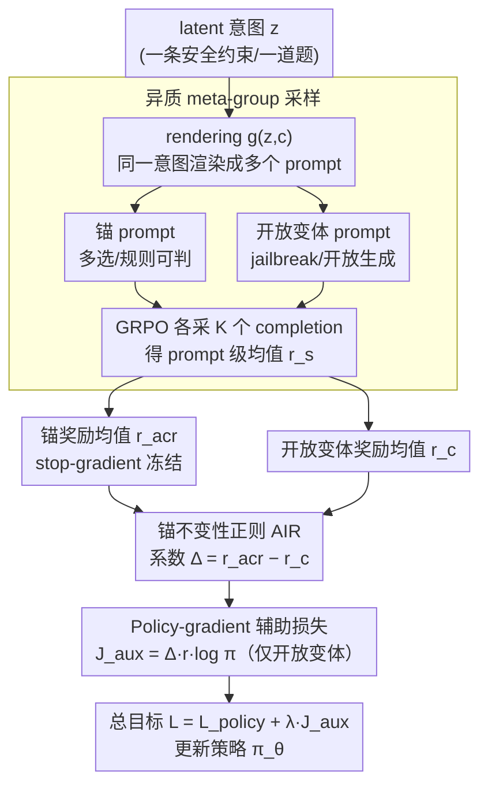

# Towards Context-Invariant Safety Alignment for Large Language Models

**会议**: ICML 2026  
**arXiv**: [2605.20994](https://arxiv.org/abs/2605.20994)  
**代码**: 未公开  
**领域**: 对齐RLHF  
**关键词**: 上下文不变性、安全对齐、GRPO、不变风险最小化、奖励黑客

## 一句话总结
作者提出 AIR（Anchor Invariance Regularization），把可验证 prompt 当作"锚"、用 stop-gradient 只把开放式变体往锚的表现上拉，作为辅助损失插入 GRPO，在安全/道德/数学三域把 OOD 组级一致性平均提升 33.49%、ID 提升 12.71%。

## 研究背景与动机
**领域现状**：基于偏好的后训练（RLHF / DPO / GRPO 等）已是 LLM 对齐的标准范式。RLHF 用奖励模型把人类偏好编进策略；GRPO 用 group-relative advantage 省掉了 value network，是当下 reasoning 训练的事实选择。

**现有痛点**：安全对齐"脆"。同一个有害意图换一种 jailbreak 包装，模型可能在标准 prompt 下拒答、在改写 prompt 下立刻顺从。这种"换皮就破"反映出模型学到的是表面线索而不是底层意图，是奖励 hacking 和 alignment faking 的直接后果。

**核心矛盾**：要让行为只依赖意图而不依赖表面形式，自然想到搬域泛化里的"不变风险最小化"（IRM / V-REx）。但安全对齐里**监督质量是非对称的**——可验证 prompt（多选、规则可判）有 ground truth，开放式生成只能用噪声大、易被 hack 的 LLM judge。对称的 variance 惩罚（V-REx）只是在拉平 context 间的差距，它**既可以把差的拉上来，也可以把好的拉下去**。作者形式化地证明：当锚的风险 $R_a$ 显著低于开放式风险 $R_o$ 时，对称惩罚会产生一个"降级锚"的下降方向，反而把可信的能力打掉来对齐噪声 proxy。

**本文目标**：设计一个非对称的不变性正则，让锚的能力被"冻结保留"，所有的拉齐力量只作用在开放式变体上。

**切入角度**：观察"安全对齐里至少存在一种 reliable supervision（多选/规则可判）"，所以可以把它当 IRM 里的"特权环境"，用 stop-gradient 把它转成单向锚点。

**核心 idea**：用 $\Omega_{\text{AIR}} = \sum_{c \neq c_{\text{acr}}} (R_c - \text{sg}[R_{c_{\text{acr}}}])^2$ 替换 V-REx 的对称方差项；并把它写成 policy-gradient 辅助损失，可即插即用挂在 GRPO/GSPO 上。

## 方法详解

### 整体框架
这篇论文要解决的是"同一个有害意图换个 jailbreak 包装就破"的脆弱安全对齐，做法是把"可自动验证的那个 prompt"当成锚、用 stop-gradient 把开放式变体单向往锚的表现上拉。具体地，一个 latent 意图 $z$（某条安全约束、某道数学题）经 rendering function $g(z,c)$ 在不同 context $c$ 下被表达成两类 prompt：一类是 **anchor**（多选/True-False/规则可判），一类是 **open variant**（jailbreak 包装、开放生成）。训练时 data loader 不再独立采样 prompt，而是按 $z$ 构造 **meta-group** $\mathcal{S}_z = \mathcal{A}_z \cup \mathcal{O}_z$ 一起喂给策略 $\pi_\theta$，对组里每个 prompt $s$ 照 GRPO 采 $K$ 个 completion 得 prompt 级均值 $\bar r_s$ 和方差 $\sigma_s$。于是在**同一参数 $\theta$ 下**就能同步算出锚奖励 $\bar r_{\text{acr}} = \frac{1}{|\mathcal{A}_z|}\sum_{s \in \mathcal{A}_z}\bar r_s$ 和每个开放变体的 $\bar r_c$，二者之差作为非对称系数打回 policy gradient。

### 关键设计

**1. 异质 meta-group 采样：让锚和开放变体在同一参数状态下被估计**

整条 pipeline 的起点是数据组织方式，它决定了后面那个非对称系数能不能算准。AIR 系数靠 $\bar r_{\text{acr}} - \bar r_c$ 算，如果锚和开放变体分属不同 step、不同 $\theta$ 估出来，系数就会被异步更新的方差污染。作者让 data loader 不再独立采样 prompt，而是按 latent $z$ 构 meta-group $\mathcal{S}_z = \mathcal{A}_z \cup \mathcal{O}_z$，每个 batch 同时塞 $m$ 个锚 prompt（多选/规则可判）和 $n$ 个开放变体（jailbreak 包装/开放生成），复用 GRPO 内部的 $K$-rollout 拿到每个 prompt 的均值 $\bar r_s$ 和方差 $\sigma_s$；GRPO 的组内相对优势 $\hat A_{s,k} = (r_{s,k} - \bar r_s)/(\sigma_s + \epsilon)$ 照常算、驱动主 policy loss，AIR 项则用同一批 rollout 里的 $\bar r_{\text{acr}} - \bar r_c$ 近似 $R_c - \tau_{\text{acr}}$。锚和开放变体在同一参数状态下被同步估计，把系数的方差压到最小（分布式训练里 $\bar r_{\text{acr}}$ 在 worker 间同步）。

**2. 锚不变性正则 AIR：把对称方差换成对锚的单向 stop-gradient**

拿到同组里锚和开放变体的奖励后，核心一步是怎么用它们拉齐。安全对齐的"换皮就破"反映模型学的是表面线索，自然想搬域泛化里的不变风险最小化（IRM/V-REx）来逼行为只依赖意图。但安全场景的监督是**非对称**的——锚有 ground truth，开放生成只能用噪声大、易被 hack 的 LLM judge，而 V-REx 的对称方差项 $\text{Var}_c[R_c(\theta)]$ 只管拉平 context 间差距，既能把差的拉上来、也能把好的拉下去。作者把它换成单向形式 $\Omega_{\text{AIR}} = \sum_{c \in \mathcal{C} \setminus \{c_{\text{acr}}\}} (R_c(\theta) - \text{sg}[R_{c_{\text{acr}}}(\theta)])^2$：因为 $\nabla_\theta \text{sg}[R_{c_{\text{acr}}}] = 0$，正则梯度里**结构性地不含 $\nabla_\theta R_{\text{acr}}$**，所以根本没法靠"降级锚"来缩小差距。两种情形都自动正确——开放风险高于锚（$R_c > \tau_{\text{acr}}$）时系数为正、加强那类生成里更接近锚的样本；开放风险被 reward hacking 拉得虚低（$R_c < \tau_{\text{acr}}$）时系数为负、压制该方向的 likelihood。之所以非这样不可，是因为作者在附录 A.3 形式化证明了：当 $R_o > R_a$ 时对称 V-REx 在 $\lambda > -1/\Delta$ 处会冒出一个"降锚下降方向"，把可信能力打掉去匹配噪声 proxy；AIR 经引理 A.4 与推论 A.5 正好把这个方向从 regularizer 梯度中切掉。

**3. Policy-gradient 辅助损失：写成一项可微 surrogate，挂在 GRPO 后面即插即用**

有了非对称系数还差最后一步——它得能反传、能挂进现成训练栈。$\Omega_{\text{AIR}}$ 里的 $R_c$ 是采样期望，没法直接反传。作者对它用 log-derivative trick，得 $\nabla_\theta \Omega_{\text{AIR},c} = -\mathbb{E}_y[2(R_c-\tau_{\text{acr}}) \cdot r(s,y) \cdot \nabla_\theta \log \pi_\theta(y|s)]$，对应一个可微 surrogate $\mathcal{J}_{\text{aux}} = -\frac{1}{N}\sum_i (R_c - \tau_{\text{acr}}) \cdot r_i \cdot \log \pi_\theta(y_i|s_i)$，最终训练目标只是在原 policy loss 上加一项：$\mathcal{L}_{\text{total}} = \mathcal{L}_{\text{policy}} + \lambda \mathcal{J}_{\text{aux}}$。这里系数 $(R_c - \tau_{\text{acr}})$ 是个动态权重，正就当 reinforcement、负就当 penalty，方向自动切换。这样既绕开了对 $R_c$ 本身反传，又让 AIR 和现成 GRPO/GSPO 代码栈完全兼容，不需要额外 value network 或人工标注。

### 损失函数 / 训练策略
总目标见 Algorithm 1：GRPO 的 clipped surrogate 加上 $\lambda \Delta_s r_{s,k} \log \pi_\theta(y_{s,k}|s)$（仅对开放 prompt $s \in \mathcal{O}_z$ 生效），其中 $\Delta_s = \bar r_{\text{acr}} - \bar r_s$ 取 detach。Backbone 用 Qwen-2.5-14B，三域混训 3000 step，$K=3$，lr $5\times 10^{-7}$，$\lambda = 8\times 10^{-4}$。复合奖励 $r = r_{\text{task}} + r_{\text{fmt}}$：格式奖励要求 `<think>…</think><answer>…</answer>`（Math 还要 `\boxed{}`），格式正确 +1.25 错 −1.0；任务奖励对锚走规则验证、对开放变体走 LLM-as-a-judge（安全在 10 个 facet 上算 Safe vs Unsafe 的 log-odds，道德对 YES/NO token log-prob 做阈值切分，数学用 `math_verify` 符号比对）。

## 实验关键数据

### 主实验
三域（Safety / Moral / Math）上同时报 prompt 级 Acc 和 group 级 $\text{Acc}_{\text{group}}$（一个 meta-group 内**所有变体都答对**才算对，直接量化"换皮不变性"）。开放变体的最终分都用 GPT-4.1 重新打分。

| 设定 | 配置 | Safety Acc / Group | Moral Acc / Group | Math Acc / Group |
|------|------|--------------------|-------------------|------------------|
| ID | GRPO | 96.92% / 71.15% | 75.39% / 34.31% | 93.81% / 64.60% |
| ID | GRPO + V-REx | 82.15% / 35.40% | 58.20% / 7.15% | 93.02% / 60.71% |
| ID | **GRPO + AIR** | **98.46% / 84.62%** | **85.51% / 59.85%** | 93.64% / 63.72% |
| ID | GSPO + AIR | **99.81% / 98.08%** | 84.57% / 65.69% | **94.93% / 68.14%** |
| OOD | GRPO | 73.04% / 13.73% | 62.68% / 14.71% | 82.30% / 40.71% |
| OOD | GRPO + V-REx | 62.25% / 8.82% | 53.12% / 3.68% | 83.19% / 42.48% |
| OOD | **GRPO + AIR** | **88.24% / 60.78%** | **80.70% / 47.79%** | 88.49% / 61.06% |
| OOD | GSPO + AIR | **93.14% / 63.73%** | 81.07% / 49.26% | 86.28% / 51.33% |

平均下 GRPO+AIR 把 OOD $\text{Acc}_{\text{group}}$ 从 23.05% 提到 56.54%（+33.49pp），OOD Acc 从 72.67% 提到 85.81%（+13.14pp）；同样 trick 套在 GSPO 上也复现。

### 对照与失败模式
| 配置 | 关键现象 | 说明 |
|------|---------|------|
| GRPO（无不变性） | OOD group 一致性低（Safety 13.73%、Moral 14.71%） | 表面线索过拟合，jailbreak 即破 |
| GRPO + V-REx（对称） | ID Safety group 从 71.15 → 35.40，Moral 从 34.31 → 7.15 | 锚被惩罚拉低来匹配噪声变体（Sec 3.2 失败模式） |
| GRPO + V-REx 在 Math | 仅从 64.60 → 60.71 掉得轻 | 数学几乎全可验证，监督非对称很小，所以 V-REx 副作用弱 |
| GRPO + AIR | 锚不掉、开放变体大涨 | 非对称 stop-gradient 把"降锚"方向切除 |
| 极端 reward hacking 压力测试 | open 端只奖励"I am sorry"正则匹配，GRPO 完全被 hack（Oracle judge 上崩盘），AIR 仍能保住 oracle 安全分 | AIR 用锚把可信信号传到噪声 context |

### 关键发现
- **失败模式可形式化**：附录 A.3 给出"$R_o > R_a$ 时对称 V-REx 在 $\lambda > -1/\Delta$ 后存在降锚下降方向"的两情形证明，把"为什么对称会塌"讲到了梯度几何层面。
- **监督非对称越强，AIR 收益越大**：Safety/Moral 监督最不可靠，AIR 提升最猛；Math 几乎全可验证、reliability gap 小，AIR 与 baseline 接近。
- **$\lambda$ 有甜区**：$\lambda \approx 8\times 10^{-4}\!\sim\!10^{-3}$ 时 Avg Acc 和 Avg $\text{Acc}_{\text{group}}$ 同步最高；过大会过度约束、抑制 task-specific 信号。
- **latent 几何被压紧**：GRPO 的 intra-group 表征 dispersion 均值 86.47，加 AIR 降到 71.54，说明模型把"同意图不同表面"映到更一致的内部表征。

## 亮点与洞察
- **stop-gradient 当"特权环境"开关**：IRM 系列长期争论"哪些环境是真的"，AIR 给出一个工程化答案——把可自动验证的那个 context 直接 detach 当 reference，结构上禁止 regularizer 退化。这个 trick 可以迁到任何"部分监督可信、部分监督是 proxy"的 RL 场景。
- **辅助损失而非新优化器**：AIR 只是 $\lambda \mathcal{J}_{\text{aux}}$ 一项，GRPO/GSPO 代码完全不动，落地成本低；这也意味着别人换 RL backbone（DPO/SimPO）想复刻只需要构 meta-group 加一项 loss。
- **group-level accuracy 这个指标值得抄**：它把"同一意图全对才算对"作为单一标量，比 prompt 级 Acc 更难被表面伎俩刷分，未来安全/鲁棒性 benchmark 都可以加这一列。
- **对 jailbreak 的解释从"模型表达力"转到"监督几何"**：以前讲 jailbreak 多归因到数据/模型，本文给出"对称 regularizer 在非对称监督下结构性会降锚"这一新角度。

## 局限与展望
- **依赖"存在 reliable anchor"假设**：对很多真实开放任务（创作、长 horizon agent），构造可验证 anchor 本身就是难题；当 anchor 也带噪时 stop-gradient 的"特权"地位就不再成立。
- **没有人写真实人偏好实验**：奖励都是 rule-based 或 LLM-as-judge，没有跟真实 RLHF（人标 pairwise）的对照，AIR 在真人偏好下的稳定性还是开放问题。
- **只在 14B 上验证**：缺更大模型或更小模型的 scaling 实验，AIR 系数 $\lambda$ 的甜区是否随规模迁移、是否需要 schedule，未知。
- **meta-group 构造开销**：每个 $z$ 都需要预先备好可验证版本+开放版本，数据工程量大；自动生成 anchor 的方法（如自动改写成多选题）值得后续工作。
- **形式分析停在两 context**：Theorem A.3 给的是 $|\mathcal{C}|=2$ 的退化方向证明，多 context 时降锚方向是否仍恒存在没正面给出。

## 相关工作与启发
- **vs V-REx / IRM (Krueger 2021, Arjovsky 2019)**: 同样想在 environment 间求不变性，AIR 区别在于把"环境监督可靠性非对称"做进 regularizer——指定一个 detach 的 anchor，结构上不允许对称塌缩。本文用形式分析+实验同时说明对称版在安全对齐里**主动有害**而不是仅次优。
- **vs Rule-based Rewards (Mu 2024)**: 都用"规则可判"信号来约束安全，但 Mu 直接把规则当奖励项；AIR 进一步用它作为**不变性参考点**去管开放生成，把可信信号"传染"到不可信 context。
- **vs Constrained RLHF (Moskovitz 2023) / 反 reward hacking 系列**: 后者多在外部加约束/重 KL 惩罚抑制 overoptimization；AIR 不显式造约束，而是用 anchor 的真实表现做参考，从而**自适应**地推或压开放生成。
- **vs Weak-to-Strong (Burns 2023)**: 思路相通——用小而可靠的监督引导大而难验证的能力；AIR 在 RL 阶段而非 SFT 阶段做这件事，并给出梯度层面的非对称机制。

## 评分
- 新颖性: ⭐⭐⭐⭐ 用 stop-gradient 改造 V-REx 看似只换一行，但配上失败模式的形式证明和 GRPO 落地，构成完整且独立的贡献。
- 实验充分度: ⭐⭐⭐⭐ 三域 × 两种 group 优化器 × ID/OOD 都覆盖，附 reward-hacking 压力测试和 latent 几何可视化；缺真实人偏好与多 scale 对照。
- 写作质量: ⭐⭐⭐⭐ 动机—问题—失败模式—修正一路顺，附录 A 形式化清晰；个别符号（$R_o$ vs $R_c$）跨节切换略乱。
- 价值: ⭐⭐⭐⭐ 对"安全对齐脆"给出可执行、可即插即用的 RL 侧解法，对后续 RLHF / agent safety 都有迁移价值。

<!-- RELATED:START -->

## 相关论文

- [\[ICML 2026\] Curriculum Learning for Safety Alignment](curriculum_learning_for_safety_alignment.md)
- [\[ICLR 2026\] GuardAlign: Test-time Safety Alignment in Multimodal Large Language Models](../../ICLR2026/llm_alignment/guardalign_test-time_safety_alignment_in_multimodal_large_language_models.md)
- [\[AAAI 2026\] EASE: Practical and Efficient Safety Alignment for Small Language Models](../../AAAI2026/llm_alignment/ease_practical_and_efficient_safety_alignment_for_small_language_models.md)
- [\[ICML 2026\] PICACO: Pluralistic In-Context Value Alignment of LLMs via Total Correlation Optimization](picaco_pluralistic_in-context_value_alignment_of_llms_via_total_correlation_opti.md)
- [\[ICML 2026\] Implicit Safety Alignment from Crowd Preferences](implicit_safety_alignment_from_crowd_preferences.md)

<!-- RELATED:END -->
