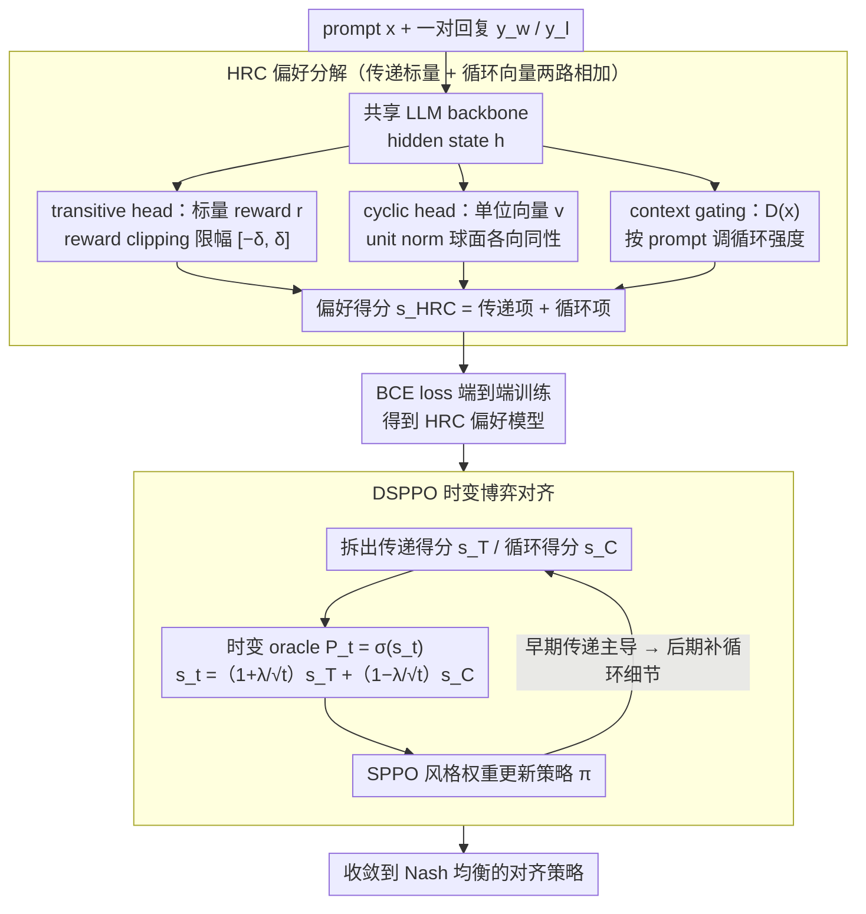

# HRC + DSPPO: 用博弈论分解把传递偏好和循环偏好分开学

**会议**: ICML 2026  
**arXiv**: [2605.17342](https://arxiv.org/abs/2605.17342)  
**代码**: https://github.com/lab-klc/Hybrid-Reward-Cyclic  
**领域**: LLM 对齐 / 偏好建模 / RLHF  
**关键词**: 偏好建模, Bradley-Terry, GPM, 循环偏好, 时变博弈, 自博弈

## 一句话总结
HRC 把人类偏好显式拆成正交的「传递标量分量」（BT 模型）+「循环向量分量」（GPM），用博弈论分解定理证明这种 hybrid 形式既能保 dominant 候选又能建模 RPS 式循环，再配套时变博弈 DSPPO 让对齐过程从「先稳住传递骨架，再学循环细节」走到 Nash 均衡——在 RewardBench 2 上 Gemma-2B-it 平均涨 1.23%、AlpacaEval 2.0 LC win-rate 拉到 44.75%。

## 研究背景与动机

**领域现状**：RLHF 默认用 Bradley-Terry 模型把偏好建成标量 reward 差，$\mathbb{P}_{\mathrm{BT}}(\mathbf{y} \succ \mathbf{y}') = \sigma(r(\mathbf{y}) - r(\mathbf{y}'))$，前提是偏好满足传递性 $A \succ B \land B \succ C \Rightarrow A \succ C$。但 Tversky 1969、Munos et al. 2024 等都指出人类偏好普遍存在循环模式（如 Rock-Paper-Scissors 动态）。PairRM/PairPM 直接学 pairwise 函数能表达循环但推理是 $O(K^2)$；General Preference Model（GPM）用 skew-symmetric 双线性形式 $s_{\mathrm{GPM}} = \mathbf{v}_y^\top \mathbf{W} \mathbf{v}_{y'}$ 把复杂度降到 $O(2dK)$ 并能建模循环。

**现有痛点**：GPM 把传递性和循环性纠缠在一个 skew-symmetric 形式里。论文证明（Theorem 4.7）GPM 在 $d=1$ 时根本无法表达「dominant 候选 + 内部循环」的混合结构；即使 $d > 1$，对任意复杂循环也无法保证存在能容纳 dominant 候选的 embedding。换句话说，GPM 在表达局部循环时会「挤掉」全局 dominant 的几何容量——这是结构性缺陷。

**核心矛盾**：现实偏好同时存在两层结构——全局上有清晰排序（如「helpful + harmless」是普世优先级），局部上又有循环（如三个 helpfulness 相当但风格不同的回复无 strict winner）。把这两件事用同一个 skew-symmetric 矩阵建模，相当于强行让一个模型既学层级又学旋转，几何上不兼容。

**本文目标**：找一个偏好模型，既能保证「dominant 候选可表示且不被循环挤掉」，又能保留 GPM 的循环建模能力和 $O(K)$ 推理复杂度。

**切入角度**：Balduzzi et al. 2019 关于 Symmetric Zero-Sum Functional-Form Game 的分解定理告诉我们：任何 zero-sum 游戏都能唯一分解为「传递分量 + 循环分量」之和。把偏好建模视作 zero-sum FFG，这个定理直接给了「应该用 hybrid 形式」的理论合法性。

**核心 idea**：HRC = BT（传递）+ GPM（循环）显式相加，$s_{\mathrm{HRC}} = (r(\mathbf{y}_i) - r(\mathbf{y}_j)) + (\mathbf{v}_i^\top \mathbf{W} \mathbf{v}_j)$。再配 DSPPO——把对齐看作时变博弈，让 $\mathbb{P}_t$ 从「以传递为主」逐步过渡到「传递+循环对等」，先建立全局质量基线再学局部细节，curriculum-style 收敛到 Nash 均衡。

## 方法详解

### 整体框架

整套方法要做的事是：把人类偏好里「谁更好」的全局排序和「三者互克」的局部循环分开来学，再用一个时变的自博弈对齐流程把策略推到均衡。它分两阶段——先在 Skywork-Reward-Preference-80K-v0.2 上训一个 HRC 偏好模型，三个 projection head 共享同一个 LLM backbone（Gemma-2B-it 或 Llama-3.1-8B-Instruct）；再在 UltraFeedback 的 prompt 上跑 DSPPO 时变自博弈对齐，每一步都用当前的 HRC 模型出 preference signal 做 SPPO 风格的 multiplicative weight update，区别在于 HRC 内部传递得分 $s_T$ 和循环得分 $s_C$ 的权重会随训练步数按 $1 \pm \lambda/\sqrt{t}$ 动态调度。

HRC 模型本身的结构是：共享的 LLM hidden state $\mathbf{h}_{\mathbf{y}|\mathbf{x}}$ 经过三个 head——transitive head 给出标量 reward $r_\phi(\mathbf{y}|\mathbf{x}) = \mathrm{clip}(\mathbf{w}_r^\top \mathbf{h}, -\delta, \delta)$，cyclic head 给出单位向量 $\mathbf{v}(\mathbf{y}|\mathbf{x}) = \mathbf{W}_c \mathbf{h} / \|\mathbf{W}_c \mathbf{h}\|_2$，context gating 给出 $\mathbf{D}(\mathbf{x}) = \mathrm{diag}(\lambda(\mathbf{x})) \otimes \mathbf{I}_2$。最终偏好得分 $s_{\mathrm{HRC}} = C_1(r(\mathbf{y}_w) - r(\mathbf{y}_l)) + C_2(\mathbf{v}_w^\top \mathbf{D}(\mathbf{x}) \mathbf{R}^{\succ} \mathbf{D}(\mathbf{x}) \mathbf{v}_l)$ 用 BCE loss 端到端训练。

### 关键设计

**1. HRC 偏好分解：把传递和循环显式拆成两路相加**

GPM 的结构缺陷在于它用一个 skew-symmetric 形式既建层级又建旋转，几何上不兼容——论文的 Theorem 4.7 证明 GPM 单独无法保证「dominant 候选可表示且不被局部循环挤掉」。HRC 的做法是把这两件事拆开并行学：偏好得分写成传递项加循环项 $s_{\mathrm{HRC}} = (r(\mathbf{y}_i) - r(\mathbf{y}_j)) + \mathbf{v}_i^\top \mathbf{W} \mathbf{v}_j$，前一项是标准 BT 的标量 reward 差、负责全局排序，后一项是 GPM 的 skew-symmetric 双线性形式、负责局部循环。这个 hybrid 形式不是拍脑袋拼出来的：借 Balduzzi et al. 2019 关于 Symmetric Zero-Sum FFG 的分解定理，任何 zero-sum 游戏都能唯一分解成传递分量 $\phi_T(\mathbf{v}, \mathbf{w}) = f(\mathbf{v}) - f(\mathbf{w})$ 加循环分量 $\phi_C(\mathbf{v}, \mathbf{w})$，且循环分量满足零积分条件 $\int \phi_C(\mathbf{v}, \mathbf{w}) d\mathbf{w} = 0$；Theorem 4.6 进一步证明在零均值 embedding 条件下 BT 恰好对应 $\phi_T$、GPM 恰好对应 $\phi_C$，于是 HRC 正是这个分解定理的标准实例化。

之所以这样能绕开 Theorem 4.7 的限制，关键在于 HRC 把 dominant 信号路由到了一条独立的 BT 标量 head 上，不再和循环建模争抢同一块 embedding 球面的几何容量。形式上 HRC 可以看成一个 dim=$2d+1$ 的 constrained GPM（在 $2d$ 维 GPM embedding 上额外加一维 reward 作为「短路」直达全局排序），所以推理复杂度 $O((2d+1)K)$ 和 GPM 同阶，没有牺牲 scalability。

**2. Context gating + reward clipping + unit norm：三个让分解站得住的几何约束**

光把两项加起来还不够，得让每一路各自的数值和几何条件成立。reward clipping 把 $r_\phi$ 限制在 $[-\delta, \delta]$，防止 reward 数值爆掉破坏 sigmoid 的数值稳定；unit norm 强制 cyclic head 输出单位向量，让 embedding 在球面上各向同性从而 $\mathbb{E}[\mathbf{v}] = \mathbf{0}$，这正是 Theorem 4.6「GPM 对应 $\phi_C$」所要求的零均值前提；context gating $\lambda(\mathbf{x}) \ge 0$ 则让模型按 prompt 动态调节循环强度——问「哪个 RPS 招法最好」时把循环打开，问「哪个回答更安全」时基本把循环关掉。

这套约束里 context gating 是最关键的。原 GPM 没有 context 维度，所有 prompt 共享同一个 skew-symmetric 矩阵，结果被「问什么都套一个循环」的噪声拖累；HRC 用 gating 让模型学会「这个 prompt 本就没循环就别硬给循环信号」，本质是把 prompt 异质性工程化。消融（Table 2）里它单独就贡献约 1% 的平均 accuracy，是三件套里最重要的一个。

**3. DSPPO 时变博弈：先稳传递骨架再补循环细节的 curriculum 对齐**

如果直接拿 HRC 的完整信号去对齐，早期 reward 信号和 cyclic 信号同时震荡，策略根本不知道该往哪走。DSPPO 的做法是把 SPPO 里那个固定的 oracle $\mathbb{P}$ 换成时变 oracle $\mathbb{P}_t = \sigma(s_t)$，其中 $s_t = (1 + \lambda/\sqrt{t}) s_T + (1 - \lambda/\sqrt{t}) s_C$。训练早期 $1+\lambda/\sqrt{t}$ 大、$1-\lambda/\sqrt{t}$ 小，传递分量主导，策略先在「这个 prompt 大方向往哪走」的全局共识上稳住；随着 $t$ 增大两个系数趋同，逐步恢复 HRC 的完整信号去学局部循环细节——这正是一种课程学习。理论上 Theorem 5.3 保证在学习率 $\eta = \Theta(1/\sqrt{T})$ 下，mixture policy $\bar{\pi}_T$ 与 Nash 均衡的 duality gap 收敛到 $O(1/\sqrt{T})$。$\lambda$ 还可以取负值得到「先循环后传递」的反向调度用作诊断，作者在附录里有讨论。

### 损失函数 / 训练策略

HRC 模型用 BCE 损失 $\mathcal{L}(\theta) = -\mathbb{E}[\log \sigma(C_1(r(\mathbf{y}_w) - r(\mathbf{y}_l)) + C_2 \mathbf{v}_w^\top \mathbf{D}(\mathbf{x}) \mathbf{R}^{\succ} \mathbf{D}(\mathbf{x}) \mathbf{v}_l)]$ 端到端训练，$C_1, C_2$ 是 hyperparameter。DSPPO 沿用 SPPO 的 MSE loss 形式但 $\mathbb{P}_t$ 按 $s_t$ 计算，$\eta = \Theta(1/\sqrt{T})$，KL 正则项在 ratio 部分自动消失（行为策略均匀假设下）。

## 实验关键数据

### 偏好建模能力：RewardBench 2

| Base + 方法 | Factuality | Precise IF | Math | Safety | Focus | Ties | 平均 |
|------|---|---|---|---|---|---|---|
| Gemma-2B-it + BT (d=1) | 45.68 | 32.50 | 62.30 | 80.67 | 77.17 | 37.25 | 55.93 |
| Gemma-2B-it + GPM (d=2) | 47.16 | 33.75 | 62.84 | 78.00 | 71.92 | 38.24 | 55.32 |
| Gemma-2B-it + GPM (d=4) | 43.16 | **36.25** | **64.48** | 81.11 | 76.16 | 37.25 | 56.40 |
| **Gemma-2B-it + HRC (2+1)** | **47.58** | 35.63 | 61.75 | 82.00 | **79.60** | **39.22** | **57.63 (+1.23)** |
| **Gemma-2B-it + HRC (4+1)** | 45.89 | 33.75 | 62.30 | **83.78** | 77.78 | 39.22 | 57.12 |
| Llama-3.1-8B + BT (d=1) | 64.63 | 34.38 | **64.48** | 92.67 | 90.91 | 73.53 | 70.10 |
| Llama-3.1-8B + GPM (d=4) | 67.58 | 33.12 | 57.92 | 92.22 | 93.74 | 73.53 | 69.69 |
| **Llama-3.1-8B + HRC (2+1)** | **68.42** | **35.00** | 60.11 | **92.89** | 94.75 | **74.51** | **70.95 (+0.85)** |

HRC 在 Ties 域上始终领先（39.22 vs GPM 38.24、BT 37.25），印证了它在「非 strict 偏好」上的鲁棒性；Safety 和 Focus 等「需要 dominant 信号」的域上也涨，跟 Theorem 4.7 的预言一致——GPM 在这些域容量被局部循环挤掉。

### 下游对齐：AlpacaEval 2.0 LC win-rate（Gemma-2B-it base）

| 偏好模型 | 对齐算法 | LC win-rate (%) |
|---|---|---|
| BT | SPPO | ~35 |
| GPM | SPPO | ~38 |
| HRC | SPPO | ~42 |
| **HRC** | **DSPPO** | **44.75** |

Arena-Hard-v0.1 上 HRC+DSPPO 达到 46.8%，全面超越 SPPO+BT/SPPO+GPM 基线。

### 关键消融（Gemma-2B-it + HRC dim 2+1）

| 配置 | Factuality | Safety | Focus | Ties | 平均 | $\Delta$ |
|------|------------|--------|-------|------|------|----------|
| HRC (Full) | 47.58 | 82.00 | 79.60 | 39.22 | 57.63 | — |
| w/o Context Gating | 45.89 | 83.11 | 74.95 | 38.24 | 56.49 | -1.14 |
| w/o Reward Clipping | 47.79 | 81.33 | 75.96 | 40.20 | 57.11 | -0.52 |
| w/o Unit Norm | 46.95 | 81.11 | 76.97 | 38.24 | 56.84 | -0.79 |

Context Gating 是最重要的稳定化技巧，与「prompt 异质性」假设一致。

### 关键发现

- **Ties 域是 HRC 的主战场**：Ties 设计上有多个等价正确答案 + 不正确干扰项，是 cyclic 偏好最典型场景，HRC 在两个 base model 上都拿到第一。
- **GPM 在某些域反而退步**：如 Llama-3.1-8B 上 GPM (d=4) 比 BT (d=1) 平均还低（69.69 vs 70.10），呼应 Theorem 4.7——纯循环建模在 dominant 主导的域反而有害。
- **HRC dim 2+1 vs 4+1**：dim 2+1 在 Gemma 上比 4+1 略高（57.63 vs 57.12），说明对小模型 cyclic 容量不要太大，避免 over-fit。
- **DSPPO 比 SPPO 涨 ~3 个点**：从 42 → 44.75，证明时变 oracle 调度有效，curriculum 化学习有意义。

## 亮点与洞察

- **理论分解定理 → 模型形式的直通车**：Balduzzi 等的 FFG 分解定理本身已发表多年，但直到本文才被用在偏好建模上，把「GPM 为什么不够」从经验观察上升到 Theorem 4.7 的严格证明，再给出对应的 hybrid 修复——这是「理论先行 → 模型设计」的典范。
- **dominant 候选的几何分析很清晰**：Theorem 4.7 把 GPM 的失败描述成「embedding 球面容量被局部循环挤掉」的几何问题，直观且可复现。
- **DSPPO 把对齐看作时变博弈**：以前 SPPO/INPO 都假设固定 oracle，本文打开了「让 oracle 也演化」的新设计空间，对未来 multi-stage / curriculum 对齐有方法论意义。
- **Context Gating 显式建模 prompt 异质性**：「不是所有 prompt 都需要 cyclic」是直观但常被忽略的事实，HRC 通过 $\lambda(\mathbf{x}) \ge 0$ 把这件事工程化。
- **算法-评测匹配**：用 RewardBench 2 的 Ties 域专门验证 cyclic 建模能力、用 Safety/Focus 验证 dominant 信号，评测设计跟方法 motivation 高度对应，说服力强。

## 局限与展望

- **理论假设的实践偏差**：Theorem 4.6 要求 embedding 满足 $\mathbb{E}[\mathbf{v}] = \mathbf{0}$，论文用 unit norm + 球面各向同性假设近似，但训练后实际分布是否各向同性没验证。
- **循环偏好的真实存在性**：合成实验确实有循环，但真实人类偏好里的循环比例多大？是否真的是「难以靠传递补救」？论文没量化。如果真实循环比例 <5%，HRC 的实际收益可能边际。
- **DSPPO 的 schedule 选择**：只验证了 $\lambda > 0$ 的一种 schedule（$\lambda/\sqrt{t}$），其他 schedule（指数、阶梯）的对比不充分。
- **Math 域表现混合**：GPM (d=4) 在 Math 上 64.48 vs HRC (2+1) 61.75，HRC 在需要长链推理的 prompt 上还有 gap。
- **base model 都是 \<10B**：在 70B+ 模型上的可扩展性、context gating 是否还有效，未验证。

## 相关工作与启发

- **vs BT (Bradley & Terry 1952)**：本文的传递分量就是 BT，但加上 cyclic 后能突破 BT 的 transitivity 假设；HRC 在 BT 完全失效的 RPS 类 prompt 上仍能学。
- **vs GPM (Zhang et al. 2025c)**：本文证明 GPM 的结构缺陷（Theorem 4.7）并给出 hybrid 修复；HRC 是 GPM 的严格扩展（GPM 是 HRC 的 $C_1 = 0$ 特例）。
- **vs PairRM/PairPM**：他们用 $O(K^2)$ pairwise 函数能表达任意循环；HRC 用 $O((2d+1)K)$ 复杂度，舍弃部分表达力换 scalability。
- **vs SPPO / INPO / NLHF / GPO**：HRC 是偏好模型层，这些是对齐算法层；DSPPO 是 SPPO 的时变扩展，跟其他对齐算法可正交叠加。
- **vs 多维 reward（ArmoRM）**：ArmoRM 把 reward 拆成多维但仍标量聚合，本文证明这种「线性聚合」仍隐含传递性，HRC 用 cyclic 分量逃出去。
- **启发**：「显式分解出对抗结构」的思路可推广到其他建模场景——比如视觉相似度（局部冲突）、推荐系统（用户群偏好循环），都可以用 hybrid scalar + vector 形式重做。

## 评分

- 新颖性: ⭐⭐⭐⭐⭐ 第一次用博弈论分解定理严格证明 GPM 的结构缺陷并给出 hybrid 修复，DSPPO 时变博弈也是新设计。
- 实验充分度: ⭐⭐⭐⭐ 合成数据 + RewardBench 2 + AlpacaEval/Arena-Hard/MT-Bench + 完整消融 + 两个 base model；缺 70B+ 规模验证。
- 写作质量: ⭐⭐⭐⭐⭐ 理论分解 → 模型形式 → 算法 → 实验的逻辑链非常清晰，Theorem 4.5–4.7 严格但易读。
- 价值: ⭐⭐⭐⭐ 对偏好建模社区有理论 + 实证双贡献，对实际 RLHF pipeline 可直接替换 BT/GPM；开源代码降低门槛。

<!-- RELATED:START -->

## 相关论文

- [\[ICML 2026\] F-TIS: Harnessing Diverse Models in Collaborative GRPO](f-tis_harnessing_diverse_models_in_collaborative_grpo.md)
- [\[ICML 2026\] PICACO: Pluralistic In-Context Value Alignment of LLMs via Total Correlation Optimization](picaco_pluralistic_in-context_value_alignment_of_llms_via_total_correlation_opti.md)
- [\[ICML 2026\] Efficient Preference Poisoning Attack on Offline RLHF](efficient_preference_poisoning_attack_on_offline_rlhf.md)
- [\[ICML 2026\] Decoupling Reasoning and Confidence: Resurrecting Calibration in Reinforcement Learning from Verifiable Rewards](decoupling_reasoning_and_confidence_resurrecting_calibration_in_reinforcement_le.md)
- [\[ICML 2026\] Curriculum Learning for Safety Alignment](curriculum_learning_for_safety_alignment.md)

<!-- RELATED:END -->
