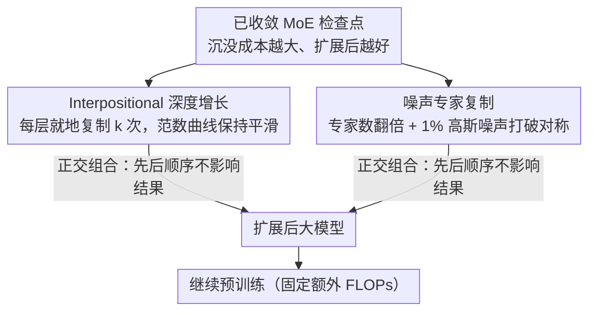

# Beyond Sunk Costs: Boosting LLM Pre-training Efficiency via Orthogonal Growth of Mixture-of-Experts

**会议**: ICML 2026  
**arXiv**: [2510.08008](https://arxiv.org/abs/2510.08008)  
**代码**: 无  
**领域**: LLM预训练  
**关键词**: MoE模型增长, 检查点回收, 高效预训练, 正交扩展, 沉没成本  

## 一句话总结

提出对已收敛 MoE 模型的"正交增长"策略——深度方向用 interpositional 层复制、宽度方向用噪声专家复制——将 17B 模型扩展到 70B，在相同额外算力下比从头训练准确率提升 10.6%。

## 研究背景与动机

**领域现状**：LLM 预训练遵循 scaling laws，不断增大模型规模和数据量以提升性能，但从头训练的算力开销极其巨大。业界在训练过程中会产生大量中间检查点和较小模型，这些通常在训练结束后被丢弃。

**现有痛点**：已有的模型增长（model growth）研究大多只在训练早期短暂训练后就进行扩展，无法充分利用模型已积累的"沉没成本"。此外，随着 Mixture-of-Experts（MoE）架构的普及，目前没有系统性地研究 MoE 模型的增长策略。

**核心矛盾**：预训练检查点蕴含大量计算投资，但因架构限制无法直接复用于更大模型。已有的 stacking 层复制方法在模型充分收敛后会破坏已学到的层间结构，导致性能损失。

**本文目标**：设计适用于充分收敛 MoE 模型的参数扩展框架，在深度和宽度两个维度上高效扩展模型，最大化回收沉没成本。

**切入角度**：作者发现充分收敛的 LLM 呈现特征性的逐层权重范数分布——前几层小且波动、中间层单调递增、末端轻微下降。Stacking 方法会在拼接处产生范数断崖，而 interpositional 方法保持了这种平滑结构。

**核心 idea**：用 interpositional 层复制增加深度（保持权重范数连续性）+ 噪声专家复制增加宽度（打破对称性促进专家分化），两个维度正交且可自由组合。

## 方法详解

### 整体框架

输入一个已充分收敛的 MoE 模型检查点，沿两个正交维度把它"长大"：深度方向把每层原地复制 $k$ 次，宽度方向把每个 MoE 层的专家翻倍并掺入微量噪声。两个操作互不干扰、先后顺序不影响最终结果，扩展完的大模型继续训练即可。

### 关键设计

**1. Interpositional 深度增长：把每层就地复制，而不是首尾拼接**

要把 $n$ 层加深到 $kn$ 层，最直觉的做法是 stacking——把整个层序列首尾接 $k$ 次（$l_1,...,l_n, l_1,...,l_n$）。但本文发现这在充分收敛的模型上会出事：收敛后的 LLM 逐层权重范数呈单调递增分布，stacking 在第 $n$ 层接回第 1 层的拼接处会撞出一道范数断崖（如 0.0356 骤降到 0.0323，约为平均层间差异的 $10\times$），相当于在网络中间凭空插了一个结构裂缝，模型得额外烧算力去修复这种不连续。Interpositional 改成把每层原地复制（$l_1,l_1,..., l_2,l_2,..., l_n,l_n$），相邻的复制层范数几乎一样，整条递增曲线保持平滑过渡，于是没有需要修复的断崖。这个优势有明确的触发条件：当训练 FLOPs 超过 Chinchilla 最优值 $F_c \approx 6 \cdot N_a \cdot 20N_a$ 后，逐层范数才稳定成递增模式，interpositional 也正是从这个点开始显著甩开 stacking——对早期未收敛模型两者差别不大，但本文针对的恰恰是"沉没成本很高"的收敛检查点。

**2. 噪声专家复制：复制专家再掺 1% 噪声打破对称**

宽度方向把 MoE 层的专家数从 $E$ 翻到 $2E$、激活数从 $k$ 翻到 $2k$，做法是复制已有专家（连同路由器权重）再叠加一层微量高斯噪声 $\epsilon \sim \mathcal{N}(0, (\alpha \sigma_{\text{orig}})^2)$，$\alpha = 0.01$。噪声大小是关键：若直接照抄（$\alpha=0$），副本与原专家完全对称，训练时收到一模一样的梯度，永远学不出分化；若像 dense-to-MoE upcycling 那样灌入 $\geq 50\%$ 的大噪声，又会把已学到的知识冲毁。1% 这个量级刚好——表示几乎原封不动保留，却足以让两个副本走上不同轨迹，路由器随训练逐步把它们区分开。之所以只需这么小的噪声，是因为本文是 MoE-to-MoE 扩展而非 dense-to-MoE：原模型已经有训练好的路由器可以直接复用，不必像从 dense 起步那样靠大噪声硬造专家差异。

**3. 正交组合与增长时机：两维可任意先后，沉没成本越大越赚**

深度和宽度增长在优化空间里近乎正交——depth-then-width 与 width-then-depth 的最终性能一致，且两条路径上 Adam 一阶矩的余弦相似度 $|\cos| < 0.04$，说明它们更新的是几乎不重叠的方向，因此可以拆成两阶段灵活安排、按算力预算自由组合。增长时机上规律也很清晰：起始检查点的沉没成本越大，扩展后的最终模型越好（正相关），唯一例外是进入学习率退火阶段之后边际收益开始递减。在固定总 FLOPs 的公平对比下，这套增长方法能追平甚至略胜从头训练——意味着回收检查点几乎是"白赚"的。

## 实验关键数据

### 主实验（17B → 70B 扩展，1T tokens）

| 模型 | 参数量 | 额外 FLOPs | 平均准确率 | 相对提升 |
|------|--------|-----------|-----------|---------|
| 17B 基线（充分训练） | 17B | — | 58.55 | — |
| 70B 从头训练（相同额外算力） | 70B | 同等 | 57.99 | -0.96% |
| 70B 正交增长（本文） | 70B | 同等 | 64.17 | **+10.6%** |
| 35B 中间模型（深度增长后） | 35B | — | 61.96 | +5.8% |

### 深度增长策略对比（3B → 6B）

| 增长方法 | 收敛后训练损失 | 下游平均准确率 | 范数连续性 |
|---------|--------------|--------------|-----------|
| Stacking | 较高 | 较低 | L19→L20 断崖（0.0356→0.0323） |
| Interpositional（本文） | **更低** | **更高** | 平滑过渡 |
| 从头训练 6B | 参考线 | 参考线 | — |

### 宽度增长噪声尺度消融

| 噪声尺度 $\alpha$ | 训练损失 | 下游准确率 | 说明 |
|-------------------|---------|-----------|------|
| 0（直接复制） | 相当 | 基线 | 对称性无法打破 |
| 0.01（本文） | 相当 | **+1%** | 最优平衡点 |
| 较大值 | 更高 | 下降 | 破坏已学知识 |
| 随机初始化新专家 | 显著更高 | 显著下降 | 失去知识继承 |

### 沉没成本与最终性能关系

| 增长起始步数 | 起始准确率 | 最终准确率 | 趋势 |
|------------|-----------|-----------|------|
| 0k（从头） | 30.59 | 38.79 | 基线 |
| 16k | 37.66 | 44.65 | ↑ |
| 48k | 42.26 | 47.20 | ↑ |
| 88k | 46.43 | 48.99 | ↑ 最优区间 |
| 96k（退火阶段） | 46.19 | 48.52 | 边际递减 |

## 亮点与洞察

- 首次系统研究充分收敛 MoE 模型的增长策略，揭示了 stacking 在收敛模型上失效的根本原因——权重范数断崖
- 提出的 Chinchilla FLOPs 边界条件（$F_c$）为选择增长策略提供了实用判据：超过 $1 \times F_c$ 时应使用 interpositional
- 正交性验证不仅是顺序无关，还通过 Adam 动量余弦相似度和累积权重更新分析从优化动力学层面给出了证据
- 沉没成本正相关性的发现对业界"丢弃检查点"的做法提出挑战，为可持续 LLM 开发提供了蓝图

## 局限性 / 可改进方向

- 增长因子固定为 $k=2$，未探索更灵活的非均匀增长比例
- 宽度增长在短期内不如深度增长效果显著，需更多训练步数才能充分发挥
- 从学习率退火阶段检查点增长时，继续训练的学习率需要额外调优
- 仅在语言模型上验证，未扩展到多模态或其他模态

## 相关工作与启发

- **Stacking Your Transformers**（Du et al., 2024）：提出 stacking 方法但主要在训练早期使用，本文揭示其在收敛模型上的局限
- **LLaMA Pro**（Wu et al., 2024）：通过添加新层扩展 LLaMA，但缺乏系统分析
- **MoE Upcycling**（Komatsuzaki et al., 2023）：dense → MoE 转换需 50%+ 噪声，本文 MoE → MoE 仅需 1%

## 评分

- 新颖性: ⭐⭐⭐⭐ — 首次系统研究收敛 MoE 模型增长，权重范数分析和正交性验证有原创价值
- 实验充分度: ⭐⭐⭐⭐⭐ — 从 3B 到 70B 的多尺度验证，含 scaling law 分析和大量消融实验
- 写作质量: ⭐⭐⭐⭐ — 逻辑清晰，图表丰富
- 价值: ⭐⭐⭐⭐ — 为 LLM 预训练的可持续发展提供实用方法论

<!-- RELATED:START -->

## 相关论文

- [\[ICML 2026\] Hyperparameter Transfer with Mixture-of-Experts Layers](hyperparameter_transfer_with_mixture-of-expert_layers.md)
- [\[ICML 2026\] ProbMoE: Differentiable Probabilistic Routing for Mixture-of-Experts](probmoe_differentiable_probabilistic_routing_for_mixture-of-experts.md)
- [\[ICML 2026\] ReMoE: Boosting Expert Reuse through Router Fine-Tuning in Memory-Constrained MoE LLM Inference](remoe_boosting_expert_reuse_through_router_fine-tuning_in_memory-constrained_moe.md)
- [\[ICML 2026\] SiameseNorm: Breaking the Barrier to Reconciling Pre/Post-Norm](siamesenorm_breaking_the_barrier_to_reconciling_prepost-norm.md)
- [\[ACL 2025\] Decoding Knowledge Attribution in Mixture-of-Experts: A Framework of Basic-Refinement Collaboration and Efficiency Analysis](../../ACL2025/llm_efficiency/decoding_knowledge_attribution_in_mixture-of-experts_a_framework_of_basic-refine.md)

<!-- RELATED:END -->
