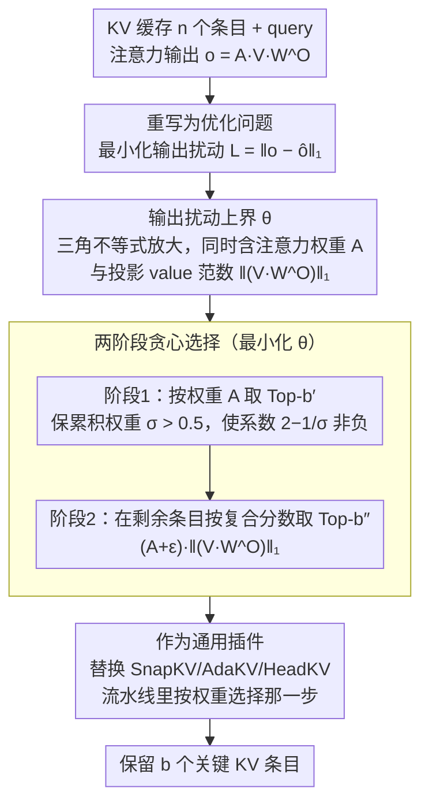

# CriticalKV: Optimizing KV Cache Eviction from an Output Perturbation Perspective

**会议**: ICML 2026  
**arXiv**: [2502.03805](https://arxiv.org/abs/2502.03805)  
**代码**: https://github.com/FFY0/DefensiveKV (有)  
**领域**: LLM 效率 / KV 缓存压缩 / 模型推理优化  
**关键词**: KV cache eviction, 输出扰动上界, 长序列推理, 注意力权重, 投影值范数  

## 一句话总结
作者把"哪些 KV 缓存条目算关键"这个一直靠经验拍脑袋的问题，重新写成"最小化注意力输出扰动"的优化问题，推导出扰动的可解析上界（同时涉及注意力权重和经 $W^O$ 投影后的 value 范数），并由此设计了一个即插即用的两阶段贪心选择算法，把 SnapKV/AdaKV/HeadKV 三种 SOTA 驱逐方法在 29 个长上下文数据集上的压缩损失平均砍掉一半以上。

## 研究背景与动机

**领域现状**：随着上下文长度增长，Transformer 自注意力对应的 KV 缓存会线性膨胀，成为长序列推理的显存和 I/O 瓶颈。主流缓解思路叫 KV cache eviction（缓存驱逐）：在固定预算 $b$ 下挑出"关键"的 $b$ 个 KV 条目保留，其余直接丢弃。H2O、Scissorhands 观察到注意力权重存在幂律分布，SnapKV 进一步引入"观察窗 + max pooling"稳定地积累权重，AdaKV/HeadKV 则在不同 head 之间动态分配预算。

**现有痛点**：所有这些方法本质上都默认"注意力权重高的条目就是关键条目"，但"什么叫关键"从来没有被形式化定义过，全靠 power-law 这种经验观察来支撑。这导致两件事都说不清：判定准则是什么？只看注意力权重够不够？

**核心矛盾**：作者从最朴素的目标——驱逐后注意力输出的扰动越小越好——出发，发现这个扰动并不只由注意力权重决定。从输出 $o = AVW^O$ 的结构看，被丢弃的条目对最终输出的影响同时取决于该位置的注意力权重 $A_i$ 和投影后 value 的范数 $\lVert (VW^O)_i \rVert$。只看权重等于忽略了一半信号。

**本文目标**：先把"关键条目识别"定义成一个最小化输出扰动的优化问题，再为这个问题导出一个可计算的上界，最后给出一个不增加额外计算开销、可以塞进现有驱逐流水线的选择算法。

**切入角度**：剪枝领域 Wanda 已经用类似的"删谁对输出冲击最小"思路成功指导权重剪枝；本文是首次把这种"扰动分析 → 选择度量"的范式搬到 KV 缓存上。

**核心 idea**：通过最小化输出扰动的最坏情况上界来挑选关键条目，把"注意力权重 × 投影 value 范数"作为新的重要性度量，全面取代纯注意力权重打分。

## 方法详解

### 整体框架
单头自注意力输出可写成 $o = AVW^O$（$A = \mathrm{softmax}(qK^\top/\sqrt{d})$）。CriticalKV 把"在预算 $b$ 下从 $n$ 个 KV 条目里挑哪 $b$ 个保留"重写成一个优化问题：让近似输出 $\hat o$ 与原输出 $o$ 的 $L_1$ 距离 $\mathcal{L} = \lVert o - \hat o \rVert_1$ 最小。它先把"丢弃哪些条目"编码成乘法掩码 $\mathcal{N} \in \{0,1\}^n$、推出一个对 $\mathcal{N}$ 解析的扰动上界 $\theta$，再用两阶段贪心在每个 head 内最小化 $\theta$，最后把这套选择逻辑当成现有 SnapKV/AdaKV/HeadKV 流水线里"按权重 Top-K"那一步的 drop-in 替换。

### 关键设计

**1. 输出扰动的可解析上界 $\theta$：把"丢谁"翻译成一个能直接优化的标量**

直接优化 $\mathcal{L} = \lVert o - \hat o \rVert_1$ 很难，因为它是两个矩阵乘积之差的范数。作者先注意到：丢掉部分条目后 softmax 要重归一化，剩余权重变成 $A' = (\mathcal{N} \odot A) / \sum_i \mathcal{N}_i A_i$；再借三角不等式把 $\mathcal{L}$ 放大成一个只依赖掩码 $\mathcal{N}$、注意力权重 $A$、以及投影 value 范数 $\lVert \bm{\mathcal{V}}_{i,:} \rVert_1$ 的闭式上界

$$\mathcal{L} \leq \theta = C - \Big(2 - \frac{1}{\sum_i \mathcal{N}_i A_i}\Big)\sum_i \mathcal{N}_i A_i \lVert \bm{\mathcal{V}}_{i,:} \rVert_1,$$

其中 $\bm{\mathcal{V}} = V W^O$，$C$ 是与 $\mathcal{N}$ 无关的常数。这个上界关键在于它第一次把"注意力权重"和"经输出投影 $W^O$ 后的 value 范数"同时摆进同一个度量里——理论上直接说明：光看 $A_i$ 不够，必须乘上 $\lVert (VW^O)_i \rVert_1$ 才能反映一个条目被丢弃后对最终输出的真实冲击。

**2. 两阶段贪心选择：先保权重过半，再按"权重×投影范数"打分**

最小化 $\theta$ 若做全局组合搜索是指数级的，作者用贪心近似，但分两阶段是有讲究的。把预算切成 $b' = \alpha b$ 和 $b'' = (1-\alpha)b$（典型 $\alpha = 0.5$）：第 1 阶段先按纯注意力权重 $A$ 取 Top-$b'$，目的不是选最终条目，而是先让被选集合的累积权重 $\sigma = \sum_{\text{selected}} A_i > 0.5$；第 2 阶段才在剩下条目里按复合分数 $\mathcal{A}_i = (A_i + \epsilon)\cdot \lVert \bm{\mathcal{V}}_{i,:} \rVert_1$ 取 Top-$b''$。之所以要第 1 阶段先把权重顶过半，是因为只有 $\sigma > 0.5$ 时上界里的系数 $2 - 1/\sigma$ 才保持非负，第 2 阶段沿复合分数贪心的方向才是真正在降 $\theta$；否则系数变号、贪心会朝错误方向走。$\alpha = 0.5$ 这个固定值在 99% 以上的 head 上都能满足 $\sigma > 0.5$，于是省掉了逐模型搜超参的部署麻烦。

**3. 作为通用插件融入现有驱逐流水线：只换"选择"一行**

作者把 SnapKV/AdaKV/HeadKV 抽象成同一个"预算分配 + 观察窗权重累积 + 选择"的统一模板（论文 Algorithm 2），CriticalKV 只替换其中"按累积权重 Top-K"那一行选择逻辑，预算分配和权重累积全部原样保留。这样设计带来三重好处：一是与 AdaKV、HeadKV 这些主攻"head 间预算分配"的工作严格正交，增益可叠加；二是额外计算只是把本就要算的 $VW^O$ 各行范数取一遍，开销可忽略；三是推理时即插即用，不需要重训也不需要离线 profile。

### 损失函数 / 训练策略
方法完全发生在推理时，对模型本身无需任何训练或微调；唯一新增的运行时计算是 $\bm{\mathcal{V}} = V W^O$ 各行的 $L_1$ 范数。超参 $\alpha$ 固定为 0.5。

## 实验关键数据

### 主实验
在 Ruler（13 任务）和 LongBench（16 任务）共 29 个数据集上，分别与 SnapKV / AdaKV / HeadKV 集成测试，覆盖 Llama-3.1-8B、Mistral-7B、Qwen2.5-32B 三种 LLM，固定 40% 缓存预算。下面取最具代表性的 Ruler 平均分（满分以 Full Cache 为 100% 基准，箭头是相对 Full Cache 的掉点幅度）：

| 模型 | 方法 | Ruler Avg ↑ | 相对 Full Cache 掉点 ↓ |
|------|------|------|------|
| Llama-3.1-8B | Full Cache | 91.05 | 0% |
| Llama-3.1-8B | SnapKV | 67.93 | 25.4% |
| Llama-3.1-8B | SnapKV + 本文 | **76.89** | **15.6%** |
| Llama-3.1-8B | AdaKV | 78.38 | 13.9% |
| Llama-3.1-8B | AdaKV + 本文 | **86.28** | **5.2%** |
| Llama-3.1-8B | HeadKV | 79.98 | 12.2% |
| Llama-3.1-8B | HeadKV + 本文 | **89.29** | **1.9%** |
| Mistral-7B | AdaKV | 34.88 | 55.4% |
| Mistral-7B | AdaKV + 本文 | **69.17** | **11.6%** |

三个发现：(1) 集成本文方法后掉点幅度普遍砍掉一半以上，HeadKV + 本文已经把 Llama 上的损失压到 1.9%，几乎逼近 Full Cache；(2) Mistral 这类原本被 SnapKV/AdaKV 压崩（掉点 55%+）的模型受益最明显，AdaKV 集成后从 34.88 直接拉回 69.17；(3) 增益随基方法越强反而越明显，说明扰动视角与预算分配视角真正正交。

### 消融与分析

| 配置 | 关键观察 | 说明 |
|------|---------|------|
| 仅看注意力权重（原 SnapKV） | 基线掉点 | 验证"只看 $A_i$"在第二阶段不够 |
| 第 1 阶段 $\alpha=0.5$ + 第 2 阶段权重×范数 | 一致最优 | 完整两阶段 |
| 改 $\alpha \in \{0.25, 0.5, 0.75\}$ | 性能稳定 | 对 $\alpha$ 不敏感（附录 C.1） |
| head 级扰动统计 | 超过 92% 的 Llama 注意力头扰动下降 | 与理论吻合 |
| 层级扰动累积 | 最终层 hidden state 扰动显著降低 | 优势能跨层叠加 |
| 不同缓存预算 | 各预算下都稳定胜 | 实际部署在不同显存约束下都受益 |
| $L_2$ 距离替换 $L_1$ | 增益类似 | 框架对距离度量鲁棒（附录 C.3） |

### 关键发现
- 第 2 阶段的复合分数 $A_i \cdot \lVert (VW^O)_i \rVert_1$ 是性能拉升的核心，证实了"投影 value 范数"是被现有方法漏掉的关键信号
- 假设 $\sigma > 0.5$ 在实际 LLM 上 99% 以上的 head 都满足，是个非常松的条件
- 改进在头级和层级都能量化：92% 的 head 扰动下降、最终隐藏态扰动持续走低，说明这是真正在沿着理论目标降扰动而不是在数据集上过拟合

## 亮点与洞察
- **第一性原理重写 KV eviction**：把"哪些条目算关键"从经验观察 power-law 提升到"最小化输出扰动"的优化命题，给整条 cache eviction 路线提供了一个新的理论起点
- **被忽视的 $W^O$ 投影**：之前所有方法只用 $K, V$ 直接打分，本文指出 value 经过输出投影 $W^O$ 后的范数才是真正决定输出冲击的量。这个洞察可以直接迁移到 quantization 时为不同 token 的 KV 分配比特宽度、或者为 prefill 阶段做条目预筛
- **正交插件的姿态**：通过抽象出"预算分配 + 权重累积 + 选择"三段式模板，新方法只动"选择"一段，使它与 AdaKV/HeadKV 这类主攻分配的方法天然叠加，证明了"压缩损失主要来自选择策略而非分配策略"

## 局限与展望
- 上界 $\theta$ 是逐 head 推导和优化的，跨 head 的耦合（例如某些 head 的扰动可以被其他 head 补偿）没有进入目标，理论上还有进一步收紧的空间
- 第 1 阶段 $\alpha$ 用了固定的 0.5，作者承认按模型/预算/head 自适应调 $\alpha$ 可能拿到更好结果，但搜索代价大，留给未来
- 当前实验集中在 ≥ 7B 的英文 long-context 模型上，对更小模型、多语种或 vision-language 长上下文的扰动假设是否一样成立仍待验证
- 方法假设解码阶段一次性看到完整 KV，对纯流式 / chunked prefill 场景下"动态加入新条目时如何重新选择"还没给出方案

## 相关工作与启发
- **vs SnapKV/AdaKV/HeadKV**：它们各自只优化了"分配 + 权重累积"，选择仍是纯 Top-K(A)；本文用同一份观察窗权重产出更优的选择，三者集成都拿到 5–40 个点的提升，且彼此正交
- **vs H2O / Scissorhands**：H2O 用累积注意力权重选 heavy-hitters，纯经验；本文是首个为"关键条目"给出形式化定义（输出扰动最小化）并导出可优化上界的工作
- **vs Wanda 等权重剪枝**：思想同源——"删谁对输出冲击最小"，本文把这种扰动度量从静态权重剪枝迁移到动态 KV 缓存选择，且引入投影 value 范数作为新度量

<!-- RELATED:START -->

## 相关论文

- [\[AAAI 2026\] Judge Q: Trainable Queries for Optimized Information Retention in KV Cache Eviction](../../AAAI2026/llm_efficiency/judge_q_trainable_queries_for_optimized_information_retention_in_kv_cache_evicti.md)
- [\[ICML 2026\] OBCache: Optimal Brain KV Cache Pruning for Efficient Long-Context LLM Inference](obcache_optimal_brain_kv_cache_pruning_for_efficient_long-context_llm_inference.md)
- [\[ICLR 2026\] Randomization Boosts KV Caching, Learning Balances Query Load: A Joint Perspective](../../ICLR2026/llm_efficiency/randomization_boosts_kv_caching_learning_balances_query_load_a_joint_perspective.md)
- [\[ACL 2025\] KV-Latent: Dimensional-level KV Cache Reduction with Frequency-aware Rotary Positional Embedding](../../ACL2025/llm_efficiency/kv_latent_cache_reduction.md)
- [\[ACL 2025\] RefreshKV: Updating Small KV Cache During Long-form Generation](../../ACL2025/llm_efficiency/refreshkv_updating_small_kv_cache_during_long-form_generation.md)

<!-- RELATED:END -->
