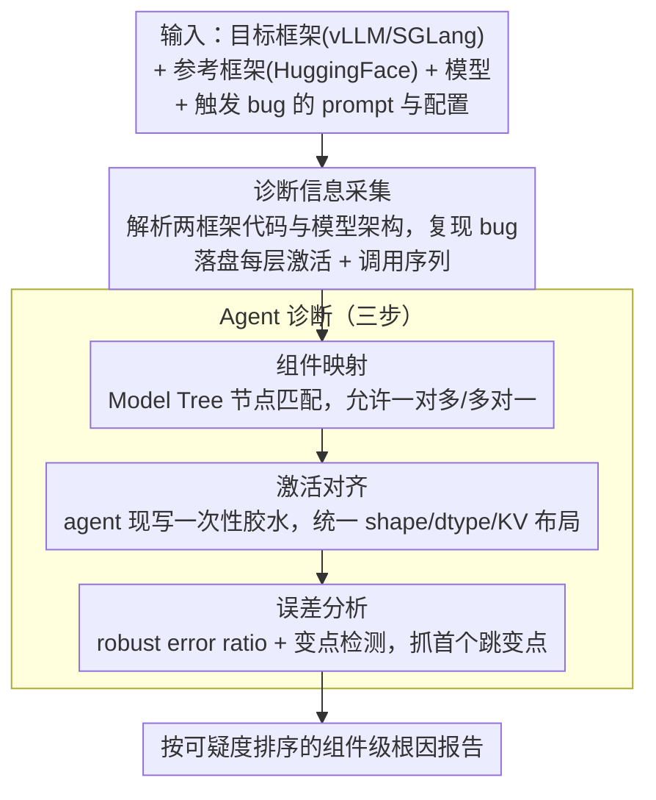

# Ekka: Automated Diagnosis of Silent Errors in LLM Inference

**会议**: ICML 2026  
**arXiv**: [2606.04594](https://arxiv.org/abs/2606.04594)  
**代码**: 待确认  
**领域**: LLM 效率 / LLM 服务系统 / 自动化调试  
**关键词**: 静默错误, 差分调试, LLM 推理框架, Agent 调试, 激活对齐

## 一句话总结
Ekka 把 LLM 服务框架里"输出悄悄变烂、却没有报错"的静默错误诊断问题，建模为以 HuggingFace 这类参考实现为 oracle 的差分调试任务，用一套"组件映射 → 激活对齐 → 变点分析"的 agentic 流水线自动定位到出问题的具体模块，在 17 个真实 vLLM/SGLang issue 上取得 80% pass@1 / 88% pass@5 的诊断准确率，并新发现 4 个被开发者确认的隐藏 bug。

## 研究背景与动机

**领域现状**：vLLM、SGLang、NanoFlow、KTransformers 等专用 LLM 服务框架已经成为生产环境的标配，里面塞满了 paged attention、radix attention、自定义 CUDA kernel、CUDA graph 编译等深度优化。框架代码量大、迭代快，平均几天就一次 release。

**现有痛点**：这种"高度优化 + 高速迭代"会孕育一种特别讨厌的 bug —— **静默错误（silent error）**：框架不崩、不报警、不丢请求，但输出质量悄悄掉了。论文给的代表案例是 vLLM Gemma 3 在 HellaSwag 上突然掉了近 30 分，开发者花了几个月才查出来是滑动窗口注意力被错误使用。这类问题在作者收集的 90 个真实 issue 里，43.8% 表现为"准确率回归"，输出读起来都像样、只是答案不对。

**核心矛盾**：症状（end-to-end benchmark 掉点）和根因（某个 kernel/某个模块实现细节）之间隔着整个 serving stack，语义鸿沟巨大。已有手段都不顶用：

- 传统 fault localization 依赖 pass/fail 信号，静默错误没有；
- 深度学习测试工具要么把模型当黑盒，要么只比较 API 层，钻不进优化后的 serving engine；
- 通用 agentic debugger 缺少 LLM 推理这个领域的脚手架，乱试一通效率低。

开发者的经验做法是拿 HuggingFace Transformers 当参考实现做 **差分调试**（约 50% 的 issue 都用了这条路），但跨框架手动对齐中间张量极其费力 —— vLLM 把 Q/K/V projection 融成 `QKVProjection` 一个类，HF 是三个独立模块，光是把它们对上就要写一堆胶水。

**本文目标**：在不需要 oracle 给 pass/fail 标签的前提下，自动给一份"哪个组件最可能出 bug"的排序报告，让人工只需要复核 top-K，而不是从头逐层 dump 张量。

**切入角度**：作者押注的核心观察是 —— 几乎所有主流模型都还能在 HuggingFace 上找到一份"慢但对"的参考实现，所以差分调试这条路在 LLM serving 场景天然可行；缺的只是让 LLM agent 来代替人做"找对应模块 + 写对齐代码 + 判断哪一步开始炸"这三件事。

**核心 idea**：把静默错误诊断重新表述成"两份实现之间的差分调试"，用 agent 自动完成组件映射 + 激活对齐，最后用对数值噪声鲁棒的 error ratio + 变点检测来定位发散点。

## 方法详解

### 整体框架
Ekka 喂进去的是"一个被怀疑出 bug 的目标框架（vLLM 或 SGLang）+ 一个慢但对的参考框架（HuggingFace Transformers）+ 模型 + 能触发 bug 的 prompt 与配置"，吐出来的是一份按可疑度排序的组件级 root-cause 报告。它先做**诊断信息采集**——解析两个框架的代码与模型架构，复现 bug 的同时把执行轨迹（每层激活、调用序列）全部落盘，给后续 agent 准备好"可逐一比对的事实"；再做**三步 agent 诊断**：组件映射 → 激活对齐 → 误差分析。这条链路本质上是把人工差分调试里最累的三件事（找对应模块、写对齐胶水、看哪一层先炸）全交给 agent 自动完成，替掉了开发者那套 ad-hoc 的手动 tensor dumping。

值得注意的是，Ekka 刻意把诊断范围圈在**模型栈层（model implementation + kernel backend）**，不碰调度器、async engine 这类高层 orchestration——后者的静默错误更适合传统 logging/trace 工具，硬塞进激活对齐反而是杀鸡用牛刀。

### 关键设计

**1. 组件映射：用 Model Tree 把两个长得完全不一样的框架对上号**

差分调试第一步就卡在"哪个模块对哪个模块"上——各框架为了性能各自融合/拆分模块，vLLM 把 Q/K/V projection 揉成一个 `QKVProjection`，HF 那边却是三个独立 Linear，直接按类名匹配几乎必然失败。Ekka 的做法是先用静态分析把每个框架的 `nn.Module` 结构压缩成一棵简洁的 **Model Tree**（保留层级与命名、剥掉冗余 wrapper），再让 agent 在两棵树上做节点匹配，输出允许一对多或多对一，正好覆盖 QKV 融合这种情形。碰到命名歧义时 agent 会调 `get_class_definition` 工具回去读源码再判断；只在单边存在的模块（如 SGLang 的 logit processor）则显式标成 unmapped 并附理由，让映射同时满足正确性和完备性。把代码结构抽象成树再交给 LLM，恰好踩中 LLM 识别"同名变体 + 组合逻辑"的强项，又避开了它直面整个代码库容易迷路的短板。

**2. 激活对齐：让 agent 给每对模块现写一段一次性翻译器**

模块对上了，dump 出来的张量却还对不齐——shape、dtype、内存布局全不一样，没法逐元素比。跨框架的布局差异本身是组合爆炸的（attention backend × dtype × KV layout × tensor parallel × …），任何手写规则集都覆盖不全。Ekka 干脆不预设规则，而是让 agent 针对每个 mapping 对**现场生成一段一次性 Python 胶水代码**，处理 paged KV-cache 重排成 dense 张量、BF16 还原到 FP32、batch 维切片、连续 token 拼回 prompt 顺序等差异；同时还写一段自检代码，确认对齐后 shape 一致才进入比较。这样既能按需扩展，又把对齐失败的 case 变成显式异常抛出，而不是悄悄给出一份错误的对比结果误导后续定位。

**3. 误差分析：robust error ratio + 变点检测，专抓"第一个炸开的地方"**

最后要回答两件事：这对组件是不是真有 bug、bug 最早出现在序列/层的哪个位置。难点在于约 19.4% 的"症状级 bug"其实只是浮点不稳定的噪声而非逻辑缺陷，直接看绝对差或 cosine 相似度配固定阈值会大量误报。Ekka 改用一个对数值噪声鲁棒的 **error ratio** 指标——它衡量的是异常程度的相对量，能容忍 BF16 累积带来的小漂移，只在真正的逻辑偏差出现时才显著抬升；随后沿层、沿 token 序列把这条 error ratio 曲线当时间序列做 **change-point analysis（变点检测）**，定位第一个显著跳变点，对应的组件即输出为根因，并按发散强度对所有 mapping 对排序得到 ranked report。这一步把"判断有没有 bug"和"判断 bug 在哪层"统一到同一个统计量上：真正的 bug 在跨层传播时必然有一个"突然爆开"的位置，而误差此后会一路累积扩散，所以单看最大误差点几乎一定指错，只有抓住首个跳变才是真正的发生点。

### 损失函数 / 训练策略
Ekka 是基于 LLM agent 的诊断系统，不训练新模型；底层用通用闭源 LLM 当 agent，每个 case 平均成本约 \$30（主要是 token 费用 + 复现执行）。

## 实验关键数据

### 主实验

数据集：作者自建 silent-error benchmark，从 vLLM + SGLang 收集 90 个真实静默错误，其中 70 个已修复（用于实证研究）、20 个开放（用作评测）；额外用 4 个尚未公开的真实新 bug 做发现能力测试。参考框架统一为 HuggingFace Transformers。

| 数据集 | 指标 | Ekka | 最强 baseline | 提升 |
|--------|------|------|---------------|------|
| 17 个真实 vLLM/SGLang silent errors | pass@1 诊断准确率 | 80% | ~46-56%（SOTA agentic debug 系统） | +24%~+34% |
| 同上 | pass@5 诊断准确率 | 88% | 低于 Ekka | 显著领先 |
| 野外新 bug 发现 | 被开发者确认的新 silent error 数 | 4 | — | 全部新增 |
| 单 case 诊断成本 | 平均 USD | ~\$30 | — | 用 LLM agent 跑得起的量级 |

主结论：在拥有 oracle reference 的前提下，差分调试 + agent 自动化能在真实 issue 上把诊断准确率从 SOTA 的 ~50% 拉到 80%（pass@1），并能主动发现连开发者也没察觉的新 bug。

### 消融实验

论文按"逐步去掉 Ekka 的关键能力"做消融，下表是定性归纳的趋势（具体数值见原文）：

| 配置 | 关键指标趋势 | 说明 |
|------|---------------|------|
| Full Ekka | 80% pass@1 | 完整三步流水线 |
| w/o Model Tree 映射，直接按类名匹配 | 大幅下降 | QKV 融合等场景找不到对应模块，后续对齐失败 |
| w/o agent 生成的激活对齐 | 大幅下降 | shape/dtype/KV 布局不一致直接报错或给出错误差异 |
| w/o robust error ratio，用绝对差 + 固定阈值 | 显著下降 | BF16 噪声大量误报为 bug，定位不到真正变点 |
| w/o change-point analysis，按最大误差点定位 | 下降 | 误差在后续层会累积扩散，最大值点≠首发散点 |

### 关键发现
- **静默错误的根因分布很"下沉"**：作者实证研究里只有 30.6% 来自框架编排逻辑，~50% 来自模型实现 + kernel backend，19.4% 是纯数值不稳定。这直接论证了"必须打开 model stack 看激活，不能黑盒"。
- **差分调试是开发者最自然的范式**：约 50% 的真实 issue 中开发者本来就是手动跟 HF 对比，Ekka 只是把这条人类既有路径自动化，而不是另起炉灶 —— 这种"沿用专家工作流"是它能跑赢通用 agent debugger 的关键。
- **change-point analysis 才是真正定位的"那一刀"**：因为误差会沿层向后扩散，单看最大误差点几乎一定指错；只有把整条 error ratio 曲线当时间序列做变点检测，才能抓到第一次显著跳变 = bug 真正发生的位置。
- **\$30/case 是可接受的工程门槛**：和开发者花数周/数月手动 diagnosis 比，是数量级的成本节省。

## 亮点与洞察
- **问题表述本身就是最大的贡献**：把"LLM serving 框架的静默错误"这种之前完全靠手工 + 经验的事，重新表述成"对着 reference 做差分调试"这种有 oracle、可自动化的形式，整个系统的 design space 一下被打开。后续凡是"有一个慢但对的参考实现"的系统（编译器优化、量化推理、分布式训练改写）都可以套这个范式。
- **Model Tree 是一种"为 LLM agent 设计的中间表示"**：直接把代码或完整 module graph 塞给 agent 会信息过载，作者用结构化压缩 + 树形对齐让 agent 干自己擅长的事（语义匹配），同时保留 escape hatch（`get_class_definition` 查源码），这种设计 pattern 值得在所有 codebase-aware agent 工具里复用。
- **robust error ratio + change-point 是个聪明的两段式处理**：先用容噪指标判断"是不是真有 bug"，再用变点检测判断"在哪一层"，把"判定 + 定位"解耦后各自用上对应领域的成熟统计技术，比堆 LLM prompt 让模型自己判断稳得多。
- **新 bug 发现 = 真正的落地价值**：4 个被开发者确认的新 silent error 说明这不只是 benchmark game，而是确实能在工业级 serving 框架里"挖矿"。

## 局限与展望
- **强依赖 reference 实现存在**：对于真正的新架构（HF 还没支持的全新模型）或自定义 fused kernel 没有等价 HF 实现的，Ekka 整条链路失效。
- **诊断范围限定在 model stack**：对调度器、async engine、KV-cache 管理等高层 orchestration 引入的静默错误，Ekka 显式不处理 —— 而作者自己的统计里这类占了 30.6%，差不多三分之一的 bug 它原则上覆盖不到。
- **成本随模型 / case 复杂度可能放大**：\$30/case 是当前 benchmark 上的均值，模型越大、张量越多、agent 来回越多，token 费用基本线性放大；对长上下文 / MoE 模型可能成本上升明显。
- **只在 vLLM + SGLang 上验证**：泛化到 TensorRT-LLM、Mooncake 这类闭源/不同语言栈框架是否还能跑通组件映射，论文未给数据。
- **可能的改进方向**：让 Ekka 与版本 bisect 联动（自动定位是哪个 commit 引入了 bug）、用 trace 缓存让多个 issue 共享激活快照降低重复成本、引入更细粒度的 kernel-level oracle（如 PyTorch eager mode）当 HF 也不够用时的兜底参考。

## 相关工作与启发
- **vs 传统 fault localization（如 Tarantula / SBFL）**：他们需要 pass/fail 测试用例做 spectrum 分析，静默错误天生没有这种信号；Ekka 用 reference 实现替代了"有没有错"的判定，绕过对显式失败信号的依赖。
- **vs 深度学习测试工具（如 CRADLE / LEMON / Audee）**：这些工具要么把模型当黑盒做 API 级 cross-framework 比较，要么只测推理库的算子层；Ekka 直接钻进 serving engine 的内部模块，定位粒度从"算子等价"提升到"组件级根因"。
- **vs 通用 agentic debugging（如 SWE-agent / AutoCodeRover）**：通用 agent 缺乏 LLM 推理这种特定栈的脚手架，面对 KV-cache、attention backend 这些不熟概念容易瞎试；Ekka 用 Model Tree + 激活对齐 + error ratio 三件套提供领域专属脚手架，是"通用 agent + domain scaffolding"的范例。
- **vs HuggingFace 自家的 numerical-comparison 脚本**：HF 经常发布 modeling 文件的数值比对脚本，但这是 per-model、per-PR 的一次性工具；Ekka 把这种比对过程系统化、可复用，且自动找映射、自动写对齐。

## 评分
- 新颖性: ⭐⭐⭐⭐⭐ 第一次把"LLM serving 静默错误"作为独立问题正式立项，并给出可自动化的差分调试范式；Model Tree + error ratio + change-point 的组合在这个领域是新的。
- 实验充分度: ⭐⭐⭐⭐ 自建了 90 issue 的真实 benchmark，做了实证 + 系统评测 + 新 bug 发现三类实验，但仅限两个开源框架。
- 写作质量: ⭐⭐⭐⭐⭐ 结构清晰，Bug Study 部分的数据（43.8% / 30.6% / 19.4%）直接撑起整个 motivation，方法部分把"为什么需要这一步"讲得很到位。
- 价值: ⭐⭐⭐⭐⭐ 直接落地到 vLLM/SGLang，发现了 4 个被开发者确认的新 bug，是少有的"既有学术贡献也立刻有产业价值"的系统工作。

<!-- RELATED:START -->

## 相关论文

- [\[ICML 2026\] Optimal Bayesian Stopping for Efficient Inference of Consistent LLM Answers](optimal_bayesian_stopping_for_efficient_inference_of_consistent_llm_answers.md)
- [\[ICML 2026\] ReMoE: Boosting Expert Reuse through Router Fine-Tuning in Memory-Constrained MoE LLM Inference](remoe_boosting_expert_reuse_through_router_fine-tuning_in_memory-constrained_moe.md)
- [\[ICML 2026\] Fast-dLLM++: Fréchet Profile Decoding for Faster Diffusion LLM Inference](fast-dllm_fréchet_profile_decoding_for_faster_diffusion_llm_inference.md)
- [\[ICML 2026\] OBCache: Optimal Brain KV Cache Pruning for Efficient Long-Context LLM Inference](obcache_optimal_brain_kv_cache_pruning_for_efficient_long-context_llm_inference.md)
- [\[NeurIPS 2025\] Silent Tokens, Loud Effects: Padding in LLMs](../../NeurIPS2025/llm_efficiency/silent_tokens_loud_effects_padding_in_llms.md)

<!-- RELATED:END -->
