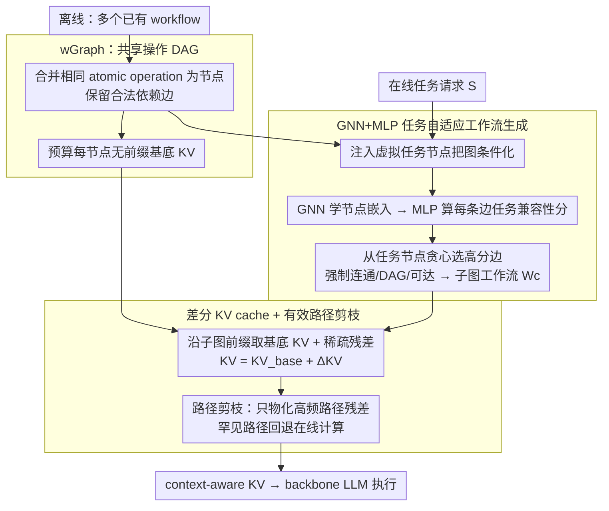

# GraphFlow: A Graph-Based Workflow Management for Efficient LLM-Agent Serving

**会议**: ICML 2026  
**arXiv**: [2605.22566](https://arxiv.org/abs/2605.22566)  
**代码**: 待确认  
**领域**: LLM 效率 / Agent  
**关键词**: LLM Agent 服务、工作流图、KV cache 复用、GNN 子图生成、拓扑感知状态管理

## 一句话总结
GraphFlow 把多个 agent 工作流统一到一张全局操作 DAG（wGraph）上，用 GNN+MLP 按任务在线生成子图工作流，并通过"基底 KV + 稀疏前缀残差 + 路径剪枝"的差分缓存替代传统按工作流独立缓存，在 5 个推理/代码/QA benchmark 上平均提升 4.95pp 的同时把 KV 内存压到约 1/4。

## 研究背景与动机

**领域现状**：LLM agent 在长链多步任务上越来越依赖"workflow"——把若干 atomic operation（工具调用、思考步骤、校验模块）按预定义顺序与控制规则组合，代表系统如 MetaGPT、TaskWeaver、AFlow、AgentKB 通常维护一个 workflow 仓库，按任务描述检索一个最相似模板再执行。

**现有痛点**：作者指出两条工程上很硬的瓶颈。其一，模板/检索型构造太"粗粒度"——把整个 workflow 当成一个不可拆的单位选出来，无法捕获任务需求与流程内部结构之间的细粒度对应，对没见过的、需要重新组合的任务泛化很差；其二，serving 时 KV cache 按"每个 workflow 独立"管理，而不同 workflow 大量复用同一批 atomic operation（同一个工具调用、同一段验证 prompt），导致同一操作的 KV 状态在多个 workflow 副本里被重复存好几份，内存随 workflow 数量线性甚至超线性增长。

**核心矛盾**：操作的 KV 状态依赖前缀（stateful）才能保证 attention 上下文正确，但若对每个 (操作, 前缀) 都存一份就会"前缀组合爆炸"；若像无状态那样只按操作单独存，又会破坏跨步推理依赖、显著掉点。也就是说，**正确性（stateful）和可扩展性（共享）之间存在 trade-off**，单纯模板拼装也无法在 wGraph 这种共享结构上分摊掉重复存储。

**本文目标**：(1) 让 workflow 构造从"模板检索"升级为"在共享操作图上按任务做子图选择"；(2) 在共享操作图上设计一套既保正确性又能高复用的 KV cache 策略。

**切入角度**：作者的关键观察是，多个 workflow 在 atomic operation 层面有大量重叠，且经验上同一操作在不同前缀下计算出的 KV 矩阵高度相似——>75% 的 K 项和 >70% 的 V 项的差异都落在很小的阈值内（Figure 3）。这意味着 KV 完全可以"基底一份 + 稀疏残差"的方式表达。

**核心 idea**：把工作流的"构造"和"状态管理"都抬到同一张全局操作图（wGraph）上——构造侧用 GNN 在 wGraph 上做条件化子图生成，状态侧用"基底 KV + 前缀差分 KV + 高频路径剪枝"消除冗余存储。

## 方法详解

### 整体框架
GraphFlow 把"工作流怎么构造"和"KV 状态怎么管"两件事统一抬到同一张全局操作图上。离线阶段它把所有已有 workflow 合并成一张有向无环图 $\mathcal{G}_{\text{op}}=(\mathcal{V}_{\text{op}},\mathcal{E}_{\text{op}})$（称 **wGraph**），节点是 atomic operation、边是合法依赖，同时为每个节点预算好"无前缀基底 KV"并训好生成模型。在线收到请求 $S$ 时，先往 wGraph 注入一个虚拟任务节点把图条件化，用 GNN+MLP 在线挑出一个任务专属子图当 workflow；执行时再沿子图前缀取基底 KV、补上稀疏残差拼出正确的 context-aware KV 喂给 backbone LLM。

### 关键设计

**1. wGraph：把零散 workflow 压成一张共享操作 DAG，让"操作级复用"变成可计算对象**

模板/检索型系统把每个 workflow 当成不可拆的整体选出来，既丢掉了任务与流程内部结构的细粒度对应、又让同一个操作的状态在多个 workflow 副本里被重复存。GraphFlow 的破法是合并各 workflow 中相同的 atomic operation 为同一节点 $v_i$、保留它们之间的合法依赖边，构成全局 wGraph $\mathcal{G}_{\text{op}}$；节点特征 $\mathbf{x}_i\in\mathbb{R}^D$ 同时编码功能语义、语言触发模式与内部执行 schema。对每个新任务，再构造 task-conditioned graph $\mathcal{G}=(\mathcal{V}_{\text{op}}\cup\{v_{\text{task}}\},\,\mathcal{E}_{\text{op}}\cup\{(v_{\text{task}},v_i),(v_i,v_{\text{task}})\})$，把任务节点用双向边连到所有操作节点，任务语义（$\mathbf{x}_{\text{task}}\in\mathbb{R}^D$ 来自输入查询）就能通过 message passing 注入每个候选操作。这一步把"workflow 是检索单元"升级成"workflow 是 wGraph 上的子图"——跨 workflow 的共享被显式表达出来，后续的子图生成和 KV 共享都落在同一个数据结构上，是整个框架的核心抽象。

**2. GNN+MLP 任务自适应工作流生成：按边粒度在图上重新拼操作，而不是取 top-1 整条模板**

检索式构造对没见过、需要重新组合的任务泛化很差，因为它只能整条模板照搬。GraphFlow 把构造改写成条件化子图选择，目标是 $\mathcal{W}^*=\arg\max_{\mathcal{W}\subseteq\mathcal{G}_{\text{op}}}\mathbb{E}[f(S,\mathcal{W})]$。具体先用一层 GNN 学到融合任务上下文与结构依赖的节点嵌入 $\mathbf{H}=\mathrm{GNN}(\mathbf{X},\mathbf{A}|\Theta_{\text{GNN}})$，再对每条候选边 $(v_i,v_j)$ 用 MLP 算任务感知兼容性分 $s_{i,j}=\mathrm{MLP}(\mathrm{Concat}[\mathbf{h}_i,\mathbf{h}_j,\mathbf{h}_{\text{task}}]|\Theta_{\text{MLP}})\in[0,1]$，表示这条依赖在当前任务里被采用的可能性；然后从 $v_{\text{task}}$ 出发贪心选高分边、并强制结构合法性（连通、DAG、可达执行），直到拼出一条可执行子图 $\mathcal{W}_c$。按边而非按整图组合，让模型能根据任务在 wGraph 上重新分支重组，把"做哪些操作、按什么顺序做"统一成一个生成问题；实验上这也让生成的工作流既更准又更精简（HumanEval +8.1pp 的同时延迟反而下降）。

**3. 差分 KV cache + 有效路径剪枝：在保正确性的前提下消掉按前缀独立存 KV 的指数级冗余**

操作的 KV 必须 stateful 才能保证 attention 上下文正确，但若对每个 (操作, 前缀) 都存一份就会前缀组合爆炸，若像无状态那样只按操作存又会破坏跨步推理、显著掉点。GraphFlow 的关键依据是一条实证观察：同一操作在不同前缀下算出的 KV 高度相似，>75% 的 K 项和 >70% 的 V 项差异都落在很小阈值内（Figure 3）。于是它对每个操作 $v$ 预算无前缀的 $\mathbf{KV}_{\text{base}}(v)$，对实际出现的前缀路径 $\mathcal{P}$ 只存稀疏残差 $\Delta\mathbf{KV}(\mathcal{P},v)$，执行时按 $\mathbf{KV}(\mathcal{P},v)=\mathbf{KV}_{\text{base}}(v)+\Delta\mathbf{KV}(\mathcal{P},v)$ 在线重建——因为残差极稀疏，这个压缩几乎无损。在此之上再叠 **effective path pruning**：用执行统计找出 wGraph 中高频转移、只为它们物化残差，罕见/不可达路径不存、触发到再回退 on-the-fly 计算。前者把"前缀依赖"和"内存重复"解耦，后者把存储规模从"全部潜在路径"收敛到"实际工作集"，最终 KV 内存随有效执行轨迹而非组合复杂度增长，把内存压到约 stateful 的 1/4。

### 损失函数 / 训练策略
论文正文给出的是推理侧的形式化目标 $\mathcal{W}^*=\arg\max_{\mathcal{W}}\mathbb{E}[f(S,\mathcal{W})]$，其中 $f$ 是下游 agent 的任务级指标（成功率 / 准确率）；具体的训练目标、子图采样（Gumbel-softmax 等）与 GNN 结构细节放在 Appendix B（正文未展开）。基底 KV 在离线阶段一次性算好；前缀残差则由执行轨迹统计驱动，物化哪些路径由路径剪枝策略决定。

## 实验关键数据

### 主实验

设置：三种 backbone（Qwen-2.5-7B、Llama-3.1-8B、Gemma-2-9B）× 五个 benchmark（GSM8K、MATH、HotpotQA、HumanEval、MBPP），与 7 个 baseline 比较（Vanilla / MetaGPT / LLMCompiler / TaskWeaver / AgentKB / AutoFlow / AFlow）；任务指标用 Acc / F1 / pass@1，效率指标用 P90 延迟。

| Backbone | 数据集 | 指标 | AFlow（SOTA baseline） | GraphFlow | 提升 |
|----------|--------|------|------------------------|-----------|------|
| Qwen-2.5-7B | GSM8K | Acc | 89.2 | **92.1** | +2.9 |
| Qwen-2.5-7B | MATH | Acc | 72.1 | **76.4** | +4.3 |
| Qwen-2.5-7B | HumanEval | pass@1 | 78.1 | **86.2** | +8.1 |
| Qwen-2.5-7B | MBPP | pass@1 | 68.4 | **74.7** | +6.3 |
| Qwen-2.5-7B | HotpotQA | F1 | 67.5 | **70.4** | +2.9 |
| Llama-3.1-8B | HumanEval | pass@1 | 72.2 | **76.6** | +4.4 |
| Llama-3.1-8B | MATH | Acc | 47.5 | **52.6** | +5.1 |
| Gemma-2-9B | HumanEval | pass@1 | 75.4 | **82.5** | +7.1 |
| Gemma-2-9B | MBPP | pass@1 | 66.1 | **72.8** | +6.7 |

P90 延迟方面，作者报告 Qwen-2.5-7B 上 5 个 benchmark 聚合的 P90 由 AFlow 的 14.06s 降到 12.25s，说明生成的工作流既更准也更精简。

### 消融实验

| 配置 | 关键指标 | 说明 |
|------|---------|------|
| Stateful KV（上限） | MATH Acc 53.8；GSM8K KV ≈ 50 GB；HotpotQA KV ≈ 85 GB | 每个 workflow 独立缓存 KV，正确性最强但内存爆炸 |
| **GraphFlow（差分 + 路径剪枝）** | MATH Acc 52.6（仅掉 1.2pp）；GSM8K KV ≈ 11 GB；HotpotQA KV ≈ 25 GB | 内存约 1/4，性能基本对齐 stateful |
| Stateless KV | MATH Acc 39.4；HotpotQA F1 ≈ 58.6；KV 8–17 GB | 完全丢掉前缀，长链推理大幅掉点 |
| GraphFlow w/o path pruning | GSM8K KV 15.0 → **11.5** GB；MBPP 9.9 → **7.2** GB；MATH/HotpotQA 各再降 ≈ 5.3/4.2 GB | 仅差分不够，路径剪枝把"潜在但不被走"的边过滤掉 |
| 并发扩展（batch size 10→50） | Stateful：0.8 GB → > 2.4 GB；GraphFlow：始终 < 0.5 GB | 基底 KV 在并发请求间共享，残差极轻，使内存几乎不随并发涨 |

### 关键发现
- **差分 KV 的可行性来自结构性观察**：作者实证 >75% 的 K 项和 >70% 的 V 项的前缀差异都接近零（Figure 3），这把"前缀依赖"和"内存重复"解耦——前缀只影响极少 KV 项，因此可以用稀疏残差精确补偿，几乎不掉点。
- **路径剪枝带来的不是小修小补**：HotpotQA 这种高分支、长执行路径的任务，剪枝就能再省 ≈4.2 GB，说明 wGraph 上确实存在大量"语义上可达但实际从不被采用"的转移，剪掉后 KV 内存才会随有效工作集线性增长，而不是组合爆炸。
- **结构化生成 + 复用同时拿好处**：在代码任务 HumanEval 上，从 78.1% 提到 86.2%（+8.1pp）的同时延迟也下降，说明 task-adaptive 子图生成不是"为了准更费"，而是把不必要的操作裁掉了，验证了"更小更准的工作流"假设。

## 亮点与洞察
- **把"工作流"从模板抬到图上**：相比于把每个 workflow 当独立的检索单元（MetaGPT/TaskWeaver），把所有 workflow 合并到一张操作 DAG 上，让"workflow = wGraph 子图"——这一抽象同时打开了两扇门：构造侧可以做 GNN 条件化子图生成，状态侧可以做跨 workflow 的 KV 共享。一个抽象同时解决两个问题，是这篇最巧的地方。
- **差分 KV 的命中点选得很准**：很多 LLM serving 工作（PagedAttention、prefix caching）都在做"减少 KV 冗余"，但 GraphFlow 不在 token 级而在 operation 级做差分，并通过实证证明这一层的差分极其稀疏——这把"理论上可以差分"变成了"工程上不掉点"。
- **可迁移的设计思路**：把"共享基底 + 稀疏差分 + 路径剪枝"这一组合迁移到 RAG pipeline、prompt 模板池、tool-use 序列等任何"高度重叠的多阶段 LLM 调用场景"都很自然——只要把单元抽象成节点、把组合抽象成图，差分 KV 几乎可以直接复用。

## 局限与展望
- **wGraph 的来源与维护成本**：论文假设有一个现成的 atomic operation 集合与依赖关系，但实际系统中这套"原语"如何从历史 workflow 中自动抽取、节点粒度多粗多细才合适、新场景上线后 wGraph 如何在线扩展，正文没展开。粒度过粗会丢复用收益，过细则 wGraph 极大、生成模型难训练。
- **GNN 生成器的训练信号没在正文交代**：$\arg\max\mathbb{E}[f]$ 这种任务级 reward 反传到子图选择天然 non-differentiable，正文把训练细节甩给 Appendix B，是否是 RL / 反事实监督 / 模仿学习读者无法直接判断，复现门槛偏高。
- **差分 KV 的小损耗在长链推理上会不会累积**：MATH 上 stateful 53.8 → GraphFlow 52.6 已经掉 1.2pp，若任务再长（多 hop 工具链），残差稀疏度的微小误差会不会逐步放大值得验证；当前 5 个 benchmark 中真正属于"很长 horizon"的不多。
- **路径剪枝依赖执行统计**：若上线初期统计数据稀疏，剪枝会过于激进或过于保守；冷启动期、分布漂移期的稳健性正文未讨论。

## 相关工作与启发
- **vs MetaGPT / TaskWeaver / AFlow**：这些方法各自把 workflow 表达为 SOP / 检索 + 改写 / 计算图搜索，但都把单个 workflow 看作独立单位；GraphFlow 把多个 workflow 合并到 wGraph 上做子图生成，结构上的"共享"变成可计算可优化的一等对象，并由此衍生出跨 workflow KV 共享。
- **vs LLMCompiler**：LLMCompiler 也用 DAG 表达 tool 依赖，但 DAG 是 per-task 即时构造、不跨任务共享；GraphFlow 的 wGraph 是 global、跨任务的，复用空间从"同一请求内"扩到"所有请求间"。
- **vs PagedAttention / prompt cache / prefix caching**：经典 KV 复用工作在 token / page 层切缓存，假设是文本前缀完全相同；GraphFlow 在 operation 层切缓存并显式建模"前缀对 KV 的小扰动"，把"前缀相同"这个强假设放宽成"前缀近似 ⇒ 差分稀疏"，更贴合 agentic workflow 的实际复用模式。
- **vs AutoFlow / AgentKB**：它们都属于"从历史经验中归纳结构化指导"，但仍以模板/知识条目为单位；GraphFlow 把这种结构化指导编码成图，并配套图上 serving 优化，把"懂结构"和"用结构提速"打通。

## 评分
- 新颖性: ⭐⭐⭐⭐ 把 workflow 抬到全局操作图、再用差分 KV 在图上做 serving 优化，是相对干净且少见的组合
- 实验充分度: ⭐⭐⭐⭐ 三个 backbone × 五个 benchmark，并配差分 / 剪枝 / 并发的三组消融，覆盖正确性和系统两侧
- 写作质量: ⭐⭐⭐⭐ 动机、抽象、两个组件的衔接讲得清楚，公式与图配合得当；Appendix 依赖偏重
- 价值: ⭐⭐⭐⭐ 对工业 agent serving 直接有用：4× KV 内存压缩 + 平均 +4.95pp，且并发场景内存几乎不涨

<!-- RELATED:START -->

## 相关论文

- [\[ICML 2026\] Theoretically Optimal Attention/FFN Ratios in Disaggregated LLM Serving](theoretically_optimal_attentionffn_ratios_in_disaggregated_llm_serving.md)
- [\[ICML 2026\] OServe: Accelerating LLM Serving via Spatial-Temporal Workload Orchestration](oserve_accelerating_llm_serving_via_spatial-temporal_workload_orchestration.md)
- [\[ICML 2026\] Optimal Bayesian Stopping for Efficient Inference of Consistent LLM Answers](optimal_bayesian_stopping_for_efficient_inference_of_consistent_llm_answers.md)
- [\[NeurIPS 2025\] Efficient Training-Free Online Routing for High-Volume Multi-LLM Serving](../../NeurIPS2025/llm_efficiency/efficient_training-free_online_routing_for_high-volume_multi-llm_serving.md)
- [\[ICML 2026\] OBCache: Optimal Brain KV Cache Pruning for Efficient Long-Context LLM Inference](obcache_optimal_brain_kv_cache_pruning_for_efficient_long-context_llm_inference.md)

<!-- RELATED:END -->
