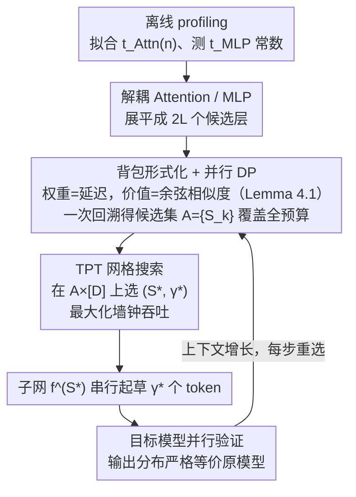

# KnapSpec: Self-Speculative Decoding via Adaptive Layer Selection as a Knapsack Problem

**会议**: ICML 2026  
**arXiv**: [2602.20217](https://arxiv.org/abs/2602.20217)  
**代码**: https://github.com/kaist-flexml-lab/knapspec (有)  
**领域**: LLM效率  
**关键词**: 自推测解码, 层选择, 背包问题, 长上下文推理, 动态规划

## 一句话总结
KnapSpec 把自推测解码（SSD）的草稿层选择重新建模为 0/1 背包问题，把 Attention 与 MLP 解耦、用上下文长度依赖的硬件延迟作为"重量"、用 hidden state 余弦相似度（首次给出严格证明）作为"价值"，通过并行 DP 在每一步自适应找出最大化 Tokens-per-Time 的子网络，在 Qwen3 / Llama3 上长上下文场景拿到最高 1.47× 的真实墙钟加速且无需额外训练。

## 研究背景与动机

**领域现状**：LLM 推理瓶颈日益严重，推测解码（Speculative Decoding, SD）通过"小草稿模型先猜、大目标模型并行验"成为主流加速范式。自推测解码（SSD）进一步抛弃独立草稿模型，直接从目标模型选一个子网络做草稿，省去训练/对齐两套权重的麻烦；代表方法包括 LayerSkip 的早退、Draft&Verify / SWIFT 的贝叶斯搜索、CLaSp 的余弦 DP 等。

**现有痛点**：现有 SSD 都把 Transformer 层当作"不可分原子"或"等延迟黑盒"。在短上下文下这套静态启发式还能凑合；一旦上下文拉长，Attention 的延迟随序列长度线性增长（$t_{\mathtt{Attn}}=\Theta(n)$），MLP 却保持常数（$t_{\mathtt{MLP}}=\Theta(1)$）。原本针对 prefill 阶段优化的"跳层方案"，在 decode 阶段 Attention 主导时就变成低效配置，加速比迅速塌陷。

**核心矛盾**：草稿延迟与接受率之间的最优 trade-off 是**随上下文长度动态漂移**的，但已有方法搜出来的是一个静态、全局的层子集，且把 Attention/MLP 绑成一对，导致搜索空间被人为限制、目标函数（TPL、cosine）也和真实墙钟速度脱节。同时，CLaSp 等用余弦相似度作代理至今没有严格理论支撑，只是"经验上 work"。

**本文目标**：(i) 设计一个真正以墙钟吞吐为目标的、能感知上下文长度和硬件延迟的层选择框架；(ii) 把 Attention 和 MLP 解耦以扩大搜索空间；(iii) 给"余弦相似度 → 接受率"的代理关系补上数学基础。

**切入角度**：作者观察到——既然每个 Attention/MLP 层都有自己的"延迟成本"和"对最终输出的贡献价值"，那么"在总延迟预算下选一组层使总价值最大"天然就是 **0/1 背包问题**；而背包问题恰好有标准 DP 解法，且 DP 的中间表能一次性给出所有预算下的最优解，省得反复搜索。

**核心 idea**：把 SSD 的层选择写成"以硬件延迟为重量、以余弦相似度为价值的 0/1 背包"，每个 decoding step 用并行 DP 即时重算最优草稿子网，再在 DP 候选集合上做 TPT 网格搜索选最终配置。

## 方法详解

### 整体框架

KnapSpec 把目标模型每层拆成 Attention、MLP 两个独立"物品"，展平成 $2L$ 个候选层（$f^{(2i-1)}:=f^{(i)}_{\mathtt{Attn}}$、$f^{(2i)}:=f^{(i)}_{\mathtt{MLP}}$），草稿网络就是子集 $S\subseteq[2L]$ 按原序复合而成。它先一次性 profiling 硬件，把 Attention 延迟拟合成上下文长度的函数 $t_{\mathtt{Attn}}(n)$、MLP 延迟测成常数 $t_{\mathtt{MLP}}$；推理时每个 speculation 步都用并行 DP 即时解一个"以延迟为重量、以余弦相似度为价值"的背包问题，在所有延迟预算下的候选层集合里网格搜索出吞吐最大的 $(S^*,\gamma^*)$，用 $f^{(S^*)}$ 串行起草 $\gamma^*$ 个 token 再由目标模型并行验证。整个过程无需任何额外训练或参数，输出分布严格等价于原目标模型。

### 关键设计

**1. TPT（Tokens-per-Time）：把目标函数对齐到墙钟吞吐**

以往 SSD 用 DEL 的 Tokens-per-Layer（TPL）或接受率当目标，隐含假设"每层延迟相等"，但长上下文下 Attention 延迟随序列线性涨、MLP 恒定，两者差距越拉越大，按层计费的指标就和真实墙钟脱钩了。KnapSpec 改用按实际延迟计费的吞吐：单步期望吐出的 token 数是截断几何分布均值 $\frac{1-\alpha_S^{\gamma+1}}{1-\alpha_S}$（$\alpha_S$ 是子网 $S$ 的接受率），分母是单步总延迟 $\gamma\,t_{\mathtt{Draft}}(S)+t_{\mathtt{Target}}$，其中草稿延迟 $t_{\mathtt{Draft}}(S)=n_{\mathtt{Attn}}(S)\cdot t_{\mathtt{Attn}}+n_{\mathtt{MLP}}(S)\cdot t_{\mathtt{MLP}}$、验证延迟 $t_{\mathtt{Target}}=L(t_{\mathtt{Attn}}+t_{\mathtt{MLP}})$，于是 $\text{TPT}(S,\gamma)=\frac{1-\alpha_S^{\gamma+1}}{1-\alpha_S}\cdot\frac{1}{\gamma\,t_{\mathtt{Draft}}(S)+t_{\mathtt{Target}}}$。当 $t_{\mathtt{Attn}}=t_{\mathtt{MLP}}$ 时它退化回 TPL，可见 TPT 是 TPL 的硬件感知泛化；论文图 2 进一步显示 best-TPT 与真实 throughput 的 Pearson 相关系数和 $R^2$ 都显著高于接受率，证明"以时间计费"比"以层/接受率计费"更能预测真实加速比。

**2. Knapsack 形式化 + 并行 DP：把指数搜索压到 $O(nL)$**

原始层选择空间是 $2^{2L}D$，指数级不可行。KnapSpec 注意到"在总延迟预算下选一组层使价值最大"正是 0/1 背包：先做整数权重归一化，取 $\Delta=\min(t_{\mathtt{Attn}}(n),t_{\mathtt{MLP}})$、$w_{\mathtt{Attn}}=\lfloor t_{\mathtt{Attn}}(n)/\Delta\rceil$、$w_{\mathtt{MLP}}=\lfloor t_{\mathtt{MLP}}/\Delta\rceil$，把延迟写成离散权重和；再用可计算的 $\cos(f(X),f^{(S)}(X))$ 替代不可微的 $\alpha_S$ 当价值，得到 $\max_{S\subseteq[2L]}\cos(f(X),f^{(S)}(X))$ s.t. $n_{\mathtt{Attn}}(S)w_{\mathtt{Attn}}+n_{\mathtt{MLP}}(S)w_{\mathtt{MLP}}=k$。DP 表 $g[i,j]\in\mathbb{R}^{r\times d}$ 记"前 $i$ 层、跳掉权重 $j$"时的最优 hidden state，转移时比较"执行第 $i$ 层"$h_{\mathtt{e}}=f^{(i)}(g[i-1,j])$ 与"跳过第 $i$ 层"$h_{\mathtt{s}}=g[i-1,j-w_i]$ 的余弦得分取大者，并把所有预算维度 $j$ 放到 GPU 上批并行算 $f^{(i)}$ 和 cosine，最后回溯 $g[2L,\cdot]$ 一次拿到所有预算下的候选集 $\mathcal{A}=\{S_k\}$。把 Attention/MLP 解耦不仅让物品数翻倍到 $2L$，更打开了"只留某层 Attention、丢掉其 MLP"这类新自由度；DP"一次执行覆盖全预算"让候选生成几乎免费，再叠加 $\tau=0.5$ 余弦下界和 $K/2$ 上界两条剪枝砍掉无望路径，整体搜索开销被压到与一次标准 AR decode 同量级。

**3. 余弦相似度作为接受率的严格代理（Lemma 4.1）**

CLaSp 等用 cosine 当价值一直只有经验、没有理论。KnapSpec 补上证明：记 LM head 词向量 $w_1,\dots,w_V$，目标 hidden $x$ 的贪心预测为 $i^*=\arg\max_i\langle w_i,x\rangle$，定义 margin $\xi(x)=\langle w_{i^*},x\rangle-\max_{j\neq i^*}\langle w_j,x\rangle$。Lemma 4.1 表明，只要 $\|x'\|_2=\|x\|_2$ 且 $\cos(x,x')\geq 1-\frac{\xi(x)^2}{2\|x\|_2^2\max_{j\neq i^*}\|w_{i^*}-w_j\|_2^2}$，就有 $\arg\max_i\langle w_i,x\rangle=\arg\max_i\langle w_i,x'\rangle$，即草稿与目标的贪心 token 严格一致。等范数假设由现代 LLM 的 RMSNorm 天然近似满足，于是 cosine 足够高就**充分**保证两者选同一个 token，$\arg\max_S\alpha_S\approx\arg\max_S\cos(f(X),f^{(S)}(X))$ 不再是拍脑袋。这一步既把 KnapSpec 从工程 trick 升级为有可证保证的方法，也回头解释了 CLaSp 为何 work。

### 损失函数 / 训练策略

完全 training-free，不引入任何额外参数。运行时只有几个超参：剪枝阈值 $\tau=0.5$（cosine 下界）、动态提前退出阈值 $\tau_{\text{conf}}=0.7$（草稿 top-1 概率下界）、最大草稿长度 $D=10$、参考历史窗口 $m=5$ speculation 步；预处理阶段一次性测出硬件延迟系数 $(t_{\mathtt{Attn}}(n),t_{\mathtt{MLP}})$。

## 实验关键数据

### 主实验

在 Qwen3 (4B/8B/14B/32B) 和 Llama3 (1B/3B/8B/70B) 上测**长上下文生成**（AIME24/25、MMLU-Pro 推理）与**长上下文输入**（GovReport、PG19、BookSum 摘要），与 SOTA SSD baseline（DEL、SWIFT、CLaSp）对比 TPT、墙钟 speedup 和接受率 $\alpha$。

| 模型 | 任务 | 指标 | AR | SWIFT | CLaSp | KnapSpec |
|------|------|------|----|----|----|----|
| Qwen3-32B | AIME24 | Speedup | 1.00× | 1.23× | 1.30× | **1.43×** |
| Qwen3-32B | MMLU-Pro | TPT | 23.15 | 21.75 | 23.90 | **34.62** |
| Llama3.1-70B | GovReport | Speedup | 1.00× | 1.33× | 1.22× | **1.47×** |
| Llama3.1-8B | AIME24 | Speedup | 1.00× | 1.05× | 1.11× | **1.28×** |
| Llama3.1-8B | AIME24 | $\alpha$ | — | 62.1% | 91.7% | 97.0% |
| Qwen3-4B | MMLU-Pro | TPT | 30.93 | 23.74 | 25.68 | **45.25** |

KnapSpec 在**所有 6×8=48 个配置**上 TPT 和 speedup 都最高，最高 1.47× 墙钟加速；接受率与 CLaSp 同级或略低（85%–97%），但因为草稿子网更便宜，吞吐显著反超。

### 消融与分析

| 配置 | 关键观察 | 说明 |
|------|---------|------|
| TPT vs TPL/acc-rate | TPT 与真实 throughput 的 PCC、$R^2$ 都最高（图 2） | 验证"以时间计费"比"以层计费/接受率"更对齐墙钟 |
| Attn/MLP 解耦 vs 绑定 | 解耦后 speedup 平均 +0.1–0.2× | 在长上下文下 Attention 单独跳掉的价值更大 |
| 剪枝阈值 $\tau=0.5$ | 节省大量 DP 时间且不掉点 | 低相似度路径几乎都是次优 |
| Nucleus 采样 $T=0.7$ | 速度优势依然稳定保持 | 不是只在 greedy 下 work，sampling 同样有效 |

### 关键发现

- **真正的瓶颈是"长上下文下 Attention 主导"**：SWIFT 等不感知上下文长度的方法在 PG19/BookSum 等长输入摘要任务上甚至比 AR 还慢（speedup < 1×），而 KnapSpec 仍稳定 1.1–1.5×。
- **草稿子网必须每步重选**：固定一次搜出来的全局最优子集随上下文增长会迅速变差；动态背包决策是必要的。
- **解耦 Attention/MLP 不仅扩搜索空间，还匹配硬件物理**：在长上下文阶段 DP 倾向于多跳 Attention 保留 MLP，短上下文阶段则相反。
- **接受率不是越高越好**：CLaSp 接受率经常更高，但因为子网更重，TPT 反而被 KnapSpec 反超——再次印证 TPT 才是正确的目标。

## 亮点与洞察

- **把 SSD 写成背包问题是一步非常干净的形式化**：物品=层、重量=硬件延迟、价值=cosine，原本"启发式搜索"瞬间获得最优结构与 $O(nL)$ DP 算法两个好处，是这类工程优化里少见的"问题—算法"恰好对位的例子。
- **Lemma 4.1 给整条 cosine SSD 系列论文补了数学**：它不只服务于 KnapSpec，而是回头给 CLaSp / ASD / DEL 都补上"为什么 cosine 是合理代理"的证明，方法论价值超出单篇范围。
- **"指标—硬件—搜索"三位一体**：TPT 直接对齐墙钟、延迟系数来自硬件 profiling、搜索算法在硬件感知的权重上做。整个 pipeline 没有"凭感觉调参"的环节，是真正 deployment-ready 的设计。
- **可迁移 trick**：解耦 Attention/MLP 的思路可以直接套到其他需要"按层选子模型"的场景（如条件早退、混合精度选层、KV cache 选择性保留）；用 DP 表"一次扫所有预算"的技巧对任何带预算的子网络搜索都有用。

## 局限与展望

- **依赖目标硬件的离线 profiling**：换 GPU、换 batch、换 KV cache 实现都要重测 $(t_{\mathtt{Attn}}(n), t_{\mathtt{MLP}})$，部署到异构集群时较繁琐；可考虑在线轻量自校准。
- **每步重跑 DP 的开销虽降到 $O(nL)$，但仍非零**：对极小模型（如 Llama3.2-1B）相对开销变大，speedup 优势收窄到 1.06–1.13×；说明该方法更适合中大模型 + 长上下文场景。
- **Lemma 4.1 只覆盖 greedy 情形**：sampling 的接受准则更复杂，论文虽实验上 work，但理论保证只是 greedy 的充分条件，nucleus 下没有严格证明。
- **代理仍是 cosine，不是直接 $\alpha$**：Lemma 给的是充分而非充要，存在"cosine 高但被拒"或反之的边角情况；未来可探索更紧的代理或直接用接受率小批量蒙特卡洛估计。

## 相关工作与启发

- **vs CLaSp (Chen et al., 2025)**：CLaSp 也用 cosine + DP，但 (i) 把 Attention/MLP 绑定为一对、(ii) 用固定层数预算 $|S|=B$、(iii) 不感知上下文长度、(iv) cosine 代理无理论支撑。KnapSpec 在四点上都做了升级；同时论文用 Lemma 4.1 回头给 CLaSp 补了数学。
- **vs SWIFT (Xia et al., 2025) / Draft&Verify**：它们用贝叶斯优化在层子集上搜，搜索过程慢、需要多次试错且对上下文长度变化不敏感；KnapSpec 用 DP 一次解出全预算最优，且每步 online 重算。
- **vs DEL (Zarch et al., 2025)**：DEL 是动态早退、优化 TPL，结构上比 layer-skip 受限（只能取前缀）；KnapSpec 的 TPT 是 TPL 在 $t_{\mathtt{Attn}}\neq t_{\mathtt{MLP}}$ 时的真正泛化，搜索空间也更大。
- **vs LayerSkip / Kangaroo**：这两者需要训练或 adapter 微调；KnapSpec 完全 training-free、plug-and-play，对部署侧友好得多。

## 评分

- 新颖性: ⭐⭐⭐⭐⭐ 背包形式化 + Attn/MLP 解耦 + 上下文感知三件事都是该方向第一次系统组合，且配有 cosine→接受率的首个严格证明。
- 实验充分度: ⭐⭐⭐⭐⭐ 覆盖 8 个模型尺度 × 6 个任务 × 4 个 baseline，greedy 与 nucleus 双采样模式都测，TPT 相关性分析、消融与剪枝阈值扫描齐全。
- 写作质量: ⭐⭐⭐⭐ 问题—方法—理论—实验脉络清晰，表 1 的 baseline 特性对比一目了然；个别符号（如 $X^{(i)}$ 的递归定义）需要回头看几遍。
- 价值: ⭐⭐⭐⭐⭐ Training-free、即插即用、长上下文场景最高 1.47× 墙钟加速，对工业部署有直接价值，且方法论框架可被后续 SSD 工作复用。

<!-- RELATED:START -->

## 相关论文

- [\[ACL 2025\] CLaSp: In-Context Layer Skip for Self-Speculative Decoding](../../ACL2025/llm_efficiency/clasp_self_speculative_decoding.md)
- [\[ACL 2026\] SpecBound: Adaptive Bounded Self-Speculation with Layer-wise Confidence Calibration](../../ACL2026/llm_efficiency/specbound_adaptive_bounded_self-speculation_with_layer-wise_confidence_calibrati.md)
- [\[ICML 2026\] dLLM-Cache: Accelerating Diffusion Large Language Models with Adaptive Caching](dllm-cache_accelerating_diffusion_large_language_models_with_adaptive_caching.md)
- [\[ICML 2026\] MineDraft: A Framework for Batch Parallel Speculative Decoding](minedraft_a_framework_for_batch_parallel_speculative_decoding.md)
- [\[ACL 2025\] Tetris: Optimal Draft Token Selection for Batch Speculative Decoding](../../ACL2025/llm_efficiency/tetris_optimal_draft_token_selection_for_batch_speculative_decoding.md)

<!-- RELATED:END -->
