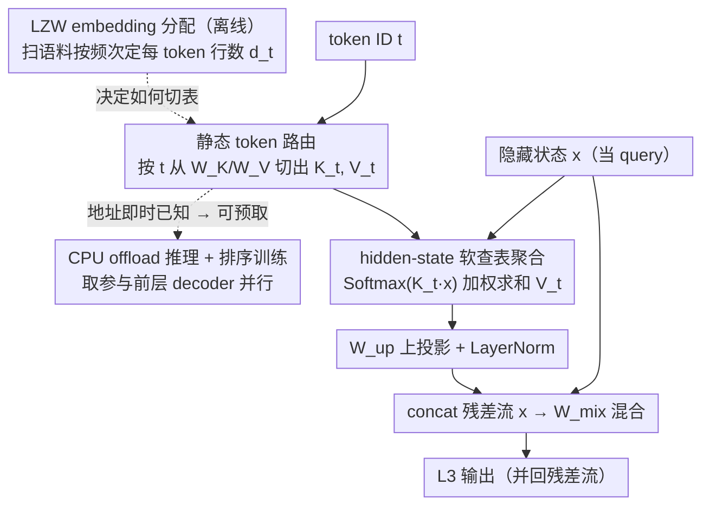

# L$^3$: Large Lookup Layers

**会议**: ICML 2026  
**arXiv**: [2601.21461](https://arxiv.org/abs/2601.21461)  
**代码**: 待确认  
**领域**: LLM 效率 / 稀疏架构  
**关键词**: 稀疏模型, 静态路由, 嵌入查表, LZW 分配, CPU offload

## 一句话总结
本文提出 L$^3$（Large Lookup Layer），把 tokenizer embedding table 推广为可插入到 decoder 中的"大查表层"——按 token ID 做**静态路由**取出一组学习好的 key/value embeddings，再让当前隐藏状态对其做 attention 聚合，从而在不引入 MoE 那套动态路由+辅助损失+难以 offload 的痛点下，把模型稀疏度再上一个量级；在 800M–2.6B 激活参数上击败同算力的 dense 模型与同稀疏率的 MoE。

## 研究背景与动机

**领域现状**：当前主流的"参数稀疏"做法是 Mixture-of-Experts（MoE）：每个 decoder 层把 MLP 替换成 router + 多个 dense expert，router 根据 token 当前隐藏状态把 token 路由到 top-k 个 expert。这一族方法（GShard / Switch / DeepSeek-MoE / OLMoE 等）确实能在等算力下显著提高质量。

**现有痛点**：MoE 的动态路由带来一连串系统层面的麻烦——必须靠 load-balancing loss、router z-loss 防止 router 坍塌；token 真正去哪个 expert 要走到 router 那一刻才知道，因此 expert 参数**无法被预取/offload**，必须全量留在 GPU 显存里；大 batch 下几乎一定会命中所有 expert，使得 offload 完全失效；超大 MoE 还要做精细 sharding 才能跑起来。

**核心矛盾**：研究者真正想要的是"参数稀疏 + 上下文相关聚合"，但目前能给"上下文相关"的只有动态路由，而动态路由天然不 system-friendly。论文注意到 tokenizer embedding table 其实就是一种极端稀疏层（每个 token 只激活一行），它对系统极其友好（静态查表、可预取），唯一缺的就是**上下文信息**。

**本文目标**：把 embedding table 这种"系统友好的静态稀疏结构"推广到 decoder 中部，让它既能保留静态路由的所有系统优势，又能基于当前 token 的隐藏状态做"上下文相关聚合"；同时回答两个子问题——（a）这种结构能否在 iso-FLOP 下打败 dense 和 MoE？（b）embedding 怎么按 token 分配才好？

**切入角度**：作者把"按 token 做静态路由 + 用 hidden state 做 attention 聚合"看成一种"软 lookup"——router 不变（token ID → embedding 集合），但聚合方式是上下文相关的。这样 L3 拿到的依旧是已知 token ID，可以在 token 一生成的瞬间就开始把对应参数从 CPU 预取上来。

**核心 idea**：用 **token ID 静态路由 + hidden-state attention 聚合**替代 MoE 的 hidden-state 路由 + dense expert，从架构上把"路由依赖"从 hidden state 改回 token ID，再用 LZW 风格的信息论分配算法决定每个 token 该分到多少 embedding。

## 方法详解

### 整体框架
L$^3$ 是一种新的 decoder sublayer，插在原 dense Llama 架构的某两层 decoder 之间，不替换 MLP，**与 MoE 正交**。它对单个 token 做的事可以一句话概括：先用 token ID $t$ 从一张超大查表里取出该 token 专属的一组 key/value embedding，再用当前隐藏状态 $x$ 当 query 对这组 key 做 attention，把对应的 value 加权聚合成一个"上下文相关的查表结果"，最后并回残差流。

更具体地：输入是隐藏状态 $x \in \mathbb{R}^{d_\text{in}}$ 和 token ID $t \in \{1, \dots, |\tau|\}$；静态路由用 $t$ 从全局表 $W_K \in \mathbb{R}^{v \times d_\text{in}}$、$W_V \in \mathbb{R}^{v \times d_\text{emb}}$ 中切出该 token 专属的 $K_t \in \mathbb{R}^{d_t \times d_\text{in}}$、$V_t \in \mathbb{R}^{d_t \times d_\text{emb}}$；上下文聚合用 $x$ 对 $K_t$ 算 softmax 得到 $d_t$ 个分数后加权求和 $V_t$；最后经 $W_\text{up}$ 上投影、LayerNorm，与残差流 concat 再过 mixing 矩阵 $W_\text{mix}$，整层写成

$$L^3(x,t) = W_\text{mix}\big[\text{LN}(W_\text{up}(V_t^\top \text{Softmax}(K_t x)))\,;\,x\big].$$

整个层只在 channel 维做混合、**没有跨 token 通信**，这是后面所有系统优化的根本；而每个 token 分到多少行 $d_t$，则由专门的 embedding 分配算法决定，是 L3 的核心超参。

### 关键设计

**1. 静态 token 路由 + hidden-state 软查表：把"路由"和"聚合"彻底解耦**

MoE 所有的系统麻烦——必须挂 auxiliary loss、参数不能 offload、大 batch 几乎命中所有 expert——本质都来自一件事：router 依赖 hidden state（形式是 $r(x,e)$），到底取哪些参数要算到 router 那一刻才知道。L3 直接把 router 换成 $t \mapsto \{K_t, V_t\}$，**只依赖 token ID**，于是 token 一被生成，要取的参数地址就已经确定。上下文相关性则完全外包给后面的 attention：$\text{Softmax}(K_t x)$ 用当前隐藏状态给 $d_t$ 个 embedding 打分，再对 $V_t$ 做加权和，所以模型仍能"看情况"取舍，不会退化成普通 tokenizer embedding。这一步看似"开倒车"地把路由依赖从 hidden state 退回 token ID，却同时消掉了 MoE 的全部系统痛点——因为地址提前已知，前几层 decoder 还在算时就能用 CPU→GPU 异步预取，把参数搬运完全藏在 compute 后面（图 4）。

**2. LZW 信息论 embedding 分配算法：把容量按"该不该被上下文区分"非均匀地分给 token**

总预算 $v = \sum_i d_i$ 是固定的，关键问题是每个 token 该分到几行 embedding。作者发现"用静态 router 去模拟一个 context router"等价于"找一组能覆盖语料常见后缀的码字"，而这恰好是 LZW 无损压缩的对偶问题——"最长后缀路由"和"最长前缀码匹配"在信息论上互为对偶，频次最高的后缀正对应最需要被区分的上下文。于是算法 1 用 LZW 扫一遍语料构造 (codeword, 频次) 字典，按频次降序遍历，每个 codeword 把一个 embedding 配给它的末位 token，同时强制每个 token 至少 1 个、最多 $k$ 个（如 $k=512$），最终得到一个近 Zipf 的分配（如 "then" 拿 512 行、"orm" 只有 1 行）。这套分配不是锦上添花：均匀分配在消融里几乎吃掉 L3 的全部增益（图 7C），说明分配方式才是 L3 质量的核心 knob。$k$ 上限还顺带给出一个硬保证——$k=512$ 时单 token 最多触发 $O(1\text{M})$ 参数，CPU→GPU 搬运量被钉死在 $O(1\text{MB})$ 量级，预取一定来得及。

**3. block-diagonal 排序训练 + CPU offload 推理：把不规则查表变成硬件友好的访问**

"按 token 取不同行"天生是不规则访问，对 GPU 不友好；但因为 L3 只在 channel 维混合、token 之间互不通信，训练时可以把整个 batch 的 token 按 ID 排序，相同 token 的隐藏状态自然聚成一段，于是 batch 的 attention mask 就变成一个块对角阵（图 3）——既能直接调 FlexAttention/MegaBlocks 等现成 kernel，也能朴素地循环对角块，额外开销只有一次排序加一次逆排序。推理时（图 4）真正的杀手锏是把 L3 参数全放 CPU：token 一被采样出来，对应 $\{K_t, V_t\}$ 立刻从 CPU 异步 prefetch，与 pre-L3 那几层 decoder 的计算并行。静态路由提供的这个"采样瞬间就知道要取什么"的时间窗，正是 MoE 拿不到、因而被卡死在显存里的东西；L3 拿得到，于是 2.6B 模型在 B200 上即便把 L3 完全 offload，BS=1/8/300 的吞吐相对 dense 也只掉几个百分点（表 2），只要第一个 L3 层别放在第 4 层之前，PCIe 延迟就被前面的 decoder 完全吸收，等于用接近 2.6B dense 的速度跑出 7B 总参的模型。

### 损失函数 / 训练策略
训练目标就是标准的语言建模交叉熵，**没有任何辅助损失**——这是相对 MoE 的额外好处（MoE 必须靠 load-balancing + router z-loss 才能稳）。架构基于 Llama，在 800M（400M decoder）/ 1.5B（1B）/ 2.6B（1.9B）三档激活参数上分别预训练约 10B / 20B / 30B token 的 FineWeb-Edu，序列长度 2048，BPE 词表 180K。每层 L3 默认 $v = 710\text{K}$、$k = 512$，目标稀疏率 2–4×，通常 1–2 层 L3 即可达到。

## 实验关键数据

### 主实验

| 激活参数 | L3 层数 | 总参数 | Wiki2 PPL ↓ | 0-shot 平均 ↑ |
|---|---|---|---|---|
| 809M | 0 (dense) | 809M | 22.02 | 48.28 |
| 803M | 2 | 3.1B | 20.23 | 49.45 |
| 818M | 3 (wider) | 5.2B | **19.59** | **50.25** |
| 1.5B | 0 (dense) | 1.5B | 18.83 | 51.93 |
| 1.5B | 2 | 4.6B | **16.72** | **53.84** |
| 2.6B | 0 (dense) | 2.6B | 15.43 | 55.59 |
| 2.6B | 2 | 7B | **14.51** | **56.98** |

在所有规模下加 L3 都同时压低 perplexity、提升下游平均分（ARC-c/e、HellaSwag、PIQA、Winogrande），且增益从训练起点就显现，不像 MoE 早期还可能因 router 难学而比 dense 差。同 FLOP / 同深度 / 同稀疏率下，L3 也稳定打过 MoE 基线（图 8）：1.5B 下"相当于 1 个 L3 的 MoE"甚至不如 dense。

### 消融实验

| 配置 | 现象 | 说明 |
|---|---|---|
| 2 层 × 710K vs 4 层 × 355K vs 1 层 × 1420K | 三者质量相近 | 单大层会压缩预取时间窗；多小层限制放置自由度 |
| LZW 分配 vs 均匀分配 | LZW 大幅领先 | 均匀分配几乎吃掉 L3 全部增益，证明分配是核心 knob |
| LZW $k=\infty$ vs $k=512$ vs $k=256$ | $\infty$ 略好但最坏单 token 吃 20K+ embedding（50M 参数）| $k=512$ 把最坏激活钉在 $O(1\text{M})$，质量几乎不掉 |
| $W_K$ 与 $W_V$ 权重 tying | 质量基本不变 | 稀疏率与数据搬运量直接砍半 |
| L3 放在 decoder 第 2/4/.../16 层之后 | 中间层最优 | 太早缺上下文，太晚来不及影响输出 |

### 关键发现
- **L3 真的在"缓存信息"**：tuned lens 显示 2.6B + L3 模型在第 4、16 层（恰好是两个 L3 的位置）出现 KL 急剧下降的"台阶"，dense 模型则是平滑下降——说明 L3 把原本要靠多层 decoder 重算的信息直接缓存掉了（图 10）。
- **早层更像查表，深层更像聚合**：第 1 个 L3 层的 softmax 分布与均匀分布的 KL 普遍高于第 2 个 L3 层，说明早层倾向"一锤定音"地选 1–2 个 embedding（接近 lookup），深层倾向"摊薄"地聚合多个 embedding。
- **CPU offload 几乎零代价**：2.6B / 7B 总参模型把两个 L3 全部 offload 到 CPU，BS=1 仅从 776 降到约 692 toks/s，BS=300 仅从 487 降到约 421 toks/s；只要第一个 L3 不放在第 1 层，PCIe 延迟就被前面 decoder 完全吸收。
- **训练吞吐 87%**：8×A100 上 800M dense 155K toks/s，加 L3 后 135K toks/s，作者认为这是上界（用专用 kernel 还能继续优化）。

## 亮点与洞察
- **把 router 形式从 hidden-state 改回 token ID**：一个看似"开倒车"的设计选择，却把 MoE 几乎所有系统痛点（aux loss、不能 offload、大 batch 命中所有 expert）一次性消掉，同时把上下文相关性外包给后面的 attention——这是非常优雅的"职责拆分"思路，值得在所有"动态路由"场景借鉴。
- **用无损压缩做容量分配**：把"找一组覆盖语料的后缀"和"找一组覆盖语料的码字"看成对偶，从而合法地拿来 LZW，这种"分配问题 ↔ 编码问题"的等价是个非常漂亮的角度，可以迁移到任何需要给离散单元（token / class / 子图）非均匀分配模型容量的场景。
- **$k$ 上限既是质量参数也是系统参数**：单一超参同时控制"最坏单 token 激活参数量"和"PCIe 数据搬运量"，从架构层面保证了系统延迟可预测，这种 quality knob 与 system knob 对齐的设计非常工程化。
- **与 MoE 正交、可叠加**：作者明确把 L3 定位为"在 MoE 之外再多一个稀疏维度"，给后续研究留出了"MoE + L3"的天然组合空间。

## 局限与展望
- **当前实验最大到 2.6B 激活 / 7B 总参，30B token**，相对 frontier MoE（百 B 级总参、T 级 token）规模仍小，scaling law 在更大规模是否依旧成立未验证。
- **未与 MoE 联用**：作者承认 MoE + L3 在同一模型里没做，留给未来工作；实际部署最有价值的对比应是"现有大 MoE + L3"。
- **依赖固定 BPE 词表**：embedding 分配在训练前一次性确定，词表换了就要重跑 LZW 重训 L3，对持续学习/跨语言扩展不友好。
- **与并发工作 Engrams 的细致对比缺失**：作者自承 Engrams 是 concurrent，只做了粗略 scaling 对比，缺少同等设置下的胜负判定。
- **训练吞吐 87% 来自朴素 PyTorch 实现**：是否上专用 kernel 后仍保持稳定，需要更工业化的验证。

## 相关工作与启发
- **vs MoE（Shazeer / DeepSeek-MoE / OLMoE）**: 同样追求"参数 ≫ 激活"，但 MoE 用 hidden-state 路由 + dense expert，L3 用 token-ID 路由 + 查表+attention 聚合；L3 在 iso-FLOP/iso-sparse 下质量更好、系统更友好（可 offload、无 aux loss）；MoE 则单层稀疏率更高、表达能力更强（dense expert vs 查表聚合），二者实质互补。
- **vs Product Key Networks（Lample 2019）**: PKN 也是大 embedding 查表 + 聚合，但 query 来自 hidden state，因此路由本质仍是上下文相关，丢掉了 offload 这个最大卖点；L3 的关键正是把"路由"换成 token ID 静态查询。
- **vs SCONE（Yu et al. 2025）**: SCONE 在模型**起点**扩展 tokenizer embedding 表（用最长后缀 f-gram 做静态查找），L3 把同一思想**搬到 decoder 中部**并加 attention 聚合，能进一步缓存中间表征而非只缓存初始 embedding。
- **vs Engrams（Cheng et al. 2026, 并发）**: 二者都在 decoder 里放学习好的 embedding 表 + hidden-state 聚合，但 Engrams 多了 n-gram hashing、tokenizer 压缩、pooling 等环节；L3 用最小骨架就拿到了同级别 scaling，说明"大 embedding 表 + 上下文聚合"才是真正的核心。
- **vs Cartridges（Eyuboglu 2025）**: Cartridges 学的是任务级 KV cache，L3 学的是 token 级的全局 cache，但二者都暗示"把信息塞进可学的 KV 表"是 attention 模型的天然扩展方向，未来或可"按任务切换 L3 层"。

## 评分
- 新颖性: ⭐⭐⭐⭐☆ 把"静态路由 + 上下文聚合"作为新稀疏轴，并用 LZW 解决分配问题，思路清晰且少见。
- 实验充分度: ⭐⭐⭐⭐☆ 三档规模 × dense/MoE/L3 对照 + 消融充足，但最大规模仅 2.6B 激活、未与大 MoE 真正联用。
- 写作质量: ⭐⭐⭐⭐⭐ 动机—架构—算法—系统—实验—分析的链条非常顺，图 4/5/10 把关键直觉讲得很透。
- 价值: ⭐⭐⭐⭐⭐ 给"稀疏模型"开了一条与 MoE 正交且对系统极其友好的新轴，工程上立刻可用（CPU offload 大模型推理），后续 MoE + L3 组合潜力巨大。

<!-- RELATED:START -->

## 相关论文

- [\[ICML 2026\] Hyperparameter Transfer with Mixture-of-Experts Layers](hyperparameter_transfer_with_mixture-of-expert_layers.md)
- [\[ICML 2025\] Mixture of Lookup Experts](../../ICML2025/llm_efficiency/mixture_of_lookup_experts.md)
- [\[ICML 2026\] ProactiveLLM: Learning Active Interaction for Streaming Large Language Models](proactivellm_learning_active_interaction_for_streaming_large_language_models.md)
- [\[ICML 2026\] dLLM-Cache: Accelerating Diffusion Large Language Models with Adaptive Caching](dllm-cache_accelerating_diffusion_large_language_models_with_adaptive_caching.md)
- [\[ACL 2025\] SpindleKV: A Novel KV Cache Reduction Method Balancing Both Shallow and Deep Layers](../../ACL2025/llm_efficiency/spindlekv_layered_kv_cache.md)

<!-- RELATED:END -->
