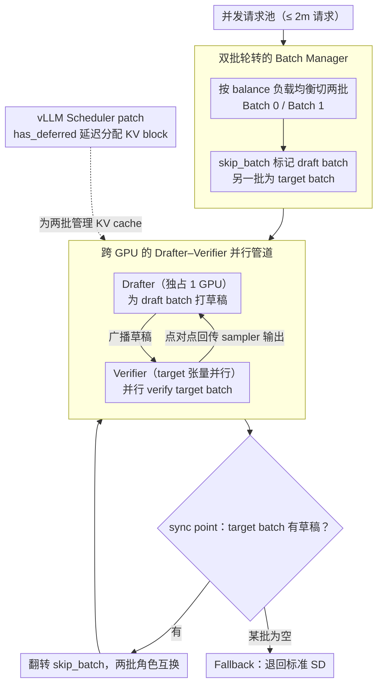

# MineDraft: A Framework for Batch Parallel Speculative Decoding

**会议**: ICML2026  
**arXiv**: [2603.18016](https://arxiv.org/abs/2603.18016)  
**代码**: 有 (MineDraft GitHub repository,论文未给具体URL,以vLLM plugin形式发布)  
**领域**: LLM效率 / 推理加速  
**关键词**: 投机解码, 并行投机解码, 批并行, vLLM, GPU重叠

## 一句话总结
MineDraft 通过维护两批请求并让一批的 drafting 与另一批的 verification 在两组独立 GPU 上**重叠执行**,把投机解码中原本串行的"草稿—验证"流水线变成批并行 PSD,在仅多用 1 张 GPU 的代价下相对标准 SD 把吞吐拉高最多 75%、端到端延迟降低最多 39%,并已实现为可即插即用的 vLLM 插件。

## 研究背景与动机

**领域现状**:投机解码 (Speculative Decoding, SD) 是当前加速 LLM 推理的主流方案——用一个小 draft 模型自回归地生成 $k$ 个草稿 token,再让大 target 模型一次性并行 verify。当多数草稿被接受时,SD 比朴素自回归解码快得多。

**现有痛点**:SD 的有效性高度依赖 draft 的 verification success rate (VSR),并且 drafting 与 verification **严格串行**——draft 完才能 verify,verify 完才能进入下一步 draft。已有工作(Medusa、EAGLE、TETRIS 等)把精力放在"提升 VSR"或"做树形/多分支 drafting"上,但这些方法往往让 drafting 阶段更慢(更复杂的 drafter 或更大的采样开销),反而把 drafting 进一步钉死在关键路径上,使得加速比触到天花板。

**核心矛盾**:由于 verification 在数据上依赖 drafting 的输出,直接并行化是非平凡的。已有的并行尝试要么需要成倍的 GPU/显存(Wang 2024、Timor 2025),要么要重新训练 draft 模型(Xiao 2024),要么只能处理单请求(PEARL/Liu 2025a)。在 batched 多请求场景下,如何用**有限的额外资源**真正把 drafting 隐藏在 verification 背后,仍是开放问题。

**本文目标**:(i) 从理论上量化"PSD 相对 SD 究竟能省多少时间";(ii) 给出一套可直接接入 production 推理栈(vLLM + PagedAttention + continuous batching)的批并行 PSD 框架;(iii) 与现有 drafting 策略(EAGLE、TETRIS、PEARL)正交,可叠加使用。

**切入角度**:作者观察到——既然 verification 要等当前批的 draft,那么**让 drafter 同时为"下一批"打草稿**,就能把 drafter 的工作完全藏到 verifier 的工作时间里。只要请求池被一分为二、两批交替进入 verifier,drafter 就永远不会闲。

**核心 idea**:用"双批轮转 + 两侧独立 GPU"把 drafting 隐藏到 verification 的影子下——一批在 verify 时,另一批就在 draft,二者通过 GPU-to-GPU 直接通信交换 token,verifier 始终满载。

## 方法详解

### 整体框架

MineDraft 的部署形态是:**target 模型用张量并行跑在 $N$ 张 GPU 上(论文中 $N=4$),drafter 单独占用 1 张 GPU**,总成本仅比标准 SD 多 1 卡。框架由 4 个组件构成:

- **Batch Manager**:把至多 $2m$ 个并发请求切成 Batch 0 / Batch 1 两批,维护 `balance` 与 `skip_batch` 状态,负责新请求的批 ID 分配与终止请求的批 ID 回收。
- **Scheduler**:管请求生命周期与 KV block 分配,并打了 vLLM 的 patch 解决"被 draft 但未 verify"的过度分配问题。
- **Drafter**:在 draft GPU 上为 *draft batch* 生成草稿 token,并把草稿广播给 verifier。
- **Verifier**:在 target GPU 上对 *target batch*(即上一步的 draft batch)做并行 verification,把采样结果点对点回传给 drafter。

执行时序如 Fig.2(右):第一个 SD step 之前,drafter 先串行地为 Batch 0 打草稿并广播给 verifier,再为 Batch 1 打草稿;此后每个 SD step,verifier 在 verify 上一步的 draft batch 时,drafter 已经在为新的 draft batch 打下一轮草稿,**两侧的工作时间在时间轴上几乎完全重叠**。每个 SD step 末尾 drafter 把输出回传给 Scheduler 的瞬间称为 sync point,此时 `skip_batch` 翻转,两批角色互换。

### 关键设计

1. **双批轮转的 Batch Manager(balance + skip_batch 状态机)**:

    - 功能:在 $2m$ 个并发请求上维持两批近似等大的请求池,保证 verifier 每步都能拿到上一步 draft 好的 target batch、drafter 每步都能立刻为另一批工作,从而让"隐藏 drafting"成立。
    - 核心思路:用 `balance = |Batch 1| - |Batch 0|` 跟踪两批大小差。第一个 SD step 中,新请求按 `balance` 的符号被分到较小的一批做**负载均衡**(`balance >= 0` 则入 Batch 0 并 `balance--`,反之入 Batch 1 并 `balance++`);第一步之后新请求统一分配给当前 `skip_batch`(即正在 draft 但还没 verify 的那一批),这样既不打扰 verifier 的节奏,又能在请求完成时自然维持平衡。请求终止时 `recycle` 做反向 `balance` 更新,保持一致性。
    - 设计动机:PSD 的核心收益来自两侧持续重叠,而**任何一侧的空批都会让整个流水线退化为标准 SD**(论文称为 Fallback)。`balance/skip_batch` 是为了在 preempt、abort、chunked prefill 等真实场景下尽量避免不可恢复的失衡,这是把理论 37% 收益落到工程现场的必要状态机。

2. **跨 GPU 的 Drafter–Verifier 并行管道(独立 GPU + 直连通信)**:

    - 功能:让 drafter 和 verifier 的算力、显存、KV cache 完全解耦,使二者的执行时间真正并行而非争抢同一张卡的资源。
    - 核心思路:drafter 独占 1 张 GPU,target 用 tensor parallel 占其余 GPU;drafter→verifier 用**广播**送草稿 token(magenta 箭头),verifier→drafter 用**点对点 dispatch**回传 target sampler 的输出(dark green 箭头);每步末尾在 sync point 翻转 `skip_batch`,下一步的 draft batch 与 target batch 自动互换。理论分析(Theorem 1)显示,假设 $f(t) = 1 - e^{-\alpha t}$ 描述 drafter 的 Pareto 前沿(drafting 时间换 VSR),当 $\alpha V \approx 1.68$ 时 $T_{\text{SD}} \gtrsim 1.59 \, T_{\text{PSD}}$,即 PSD 至少省 37% 时间;理想极限是 50%(drafting 完全藏在 verification 内)。
    - 设计动机:已有并行方案要么把两个模型塞在同一卡上(引发显存争抢,Fig.5 显示 SD 用 Qwen3-8B 当 drafter 就直接 OOM),要么需要倍增的 GPU。MineDraft 把"draft 单独 1 卡"作为最小代价的硬件投入,换来 drafter 完全消失在 verifier 时间线背后的工程效果,且与 EAGLE/TETRIS/PEARL 等已有 drafting 策略正交可叠加。

3. **vLLM Scheduler patch:KV block 的延迟分配(`has_deferred`)**:

    - 功能:在 PagedAttention 框架下,避免给"只被 draft、还没轮到 verify"的请求过度分配 KV blocks,既保持与 PagedAttention 的兼容性,又防止内存浪费。
    - 核心思路:观察到 drafter 只读不写新分配的 KV blocks,verifier 才真正写入。默认 vLLM scheduler 假设每步所有 running request 都会被生成,会同时为两批都分配 KV blocks,造成 draft batch 的 KV block 被"碰过但没写过"。Patch 引入集合 `has_deferred` 跟踪"已经被推迟过分配的请求 ID":当两批都非空时,prefill 请求照常分配,decoding 请求只在"ID 不在 `has_deferred` 中或属于当前 draft batch"时才分配,然后把该请求 ID 加入 `has_deferred`;若任一批为空(除第一次外)则退回为所有 running 请求分配。这套规则保证第一个 SD step target batch 不会被错误地跳过分配。
    - 设计动机:让 MineDraft 不只是理论上能并行,而是真的能作为**plug-and-play vLLM plugin** 上线,与 continuous batching (Yu 2022) 和 PagedAttention 完全兼容。这是把 PSD 从论文搬进 production stack 的"最后一公里"。

### 损失函数 / 训练策略
MineDraft 是**无训练**的推理加速框架——不修改 draft 模型也不修改 target 模型,只调度执行流水线与 KV cache 分配,因此可即插即用地搭在任意现有 SD/EAGLE/TETRIS 之上。

## 实验关键数据

### 主实验

**七组 target–draft 配置**,target 用 tensor parallel = 4,drafter 独占 1 卡;数据集:Arena、ShareGPT、Spec-Bench、Tough。

| 配置 (Target–Draft) | 数据集示例 | MineDraft vs 最佳 baseline | MineDraft vs 标准 SD (Δ) |
|---|---|---|---|
| Qwen3 32B–0.6B | Arena | +42.36% 吞吐 | +70.32% |
| Qwen3 32B–1.7B | Tough | +48.47% 吞吐 | +75.68%(全场最高) |
| Qwen3 32B–4B | ShareGPT | +65.02% 吞吐 | +65.64% |
| Llama-3 70B–8B | ShareGPT | +30.81% 吞吐 | +37.06% |
| Vicuna 33B–EAGLE | ShareGPT | +3.95% 吞吐 | +22.09% |
| Qwen3 32B–1.7B(E2EL) | Tough | -28.97% 延迟 | -39.51% 延迟 |
| Qwen3 32B–8B | Arena | 标准 SD 直接 OOM | MineDraft 仍可跑 |

**归一化(按 GPU 数 5 vs 4 折算)** 在 Setting 2 上,MineDraft 仍把 per-GPU 归一化吞吐相对标准 SD 拉高最多 40.55%、归一化延迟降低最多 24.38%,只在 $k=2$ 的 Spec-Bench 上归一化延迟略输 2.08%。

### 消融实验

Arena 数据集上的 4 组 ablation(对应论文 Fig.8):

| 配置 | 关键发现 | 说明 |
|---|---|---|
| 不同 draft 模型 | drafter 选择显著影响并行收益 | 当 drafter 算力接近 verifier 时,$\max(V, t)$ 项中 $t$ 项主导,收益缩小 |
| 不同 extra tokens(TETRIS 叠加) | 各 $k$ 下 MineDraft 都稳定优于标准 SD | 与 TETRIS 的"多采样 + 精选"正交叠加 |
| 不同 #sequences 每请求 $n$ | 随 $n$ 增大仍持续受益 | PSD 在批内多采样下保持鲁棒 |
| 不同 batch size $m$ | 随 $m$ 增大收益稳定 | 双批轮转的批并行设计可良好扩展 |

### 关键发现
- **draft 模型大小是把双刃剑**:更大的 drafter 提升 VSR 但拉长 $t$,当 $t > V$ 时 PSD 的 $\max(V, t)$ 项被 $t$ 主导,加速比迅速下降(Section C.6 详细分析)。论文给的最佳点在 Qwen3-32B 配 1.7B/4B drafter。
- **过长的 $k$(draft 步数)会反噬**:草稿过多 → verify 压力剧增 → drafting 反而成为关键路径。这与 adaptive drafting 工作的观察一致,也解释了为什么必须配合 TETRIS 这类自适应 $k$ 选择。
- **显存解耦是隐性收益**:Fig.5 中标准 SD 在 Qwen3-8B 当 drafter 时直接 OOM,而 MineDraft 因 drafter 在独立 GPU 上,根本不和 target 抢 KV cache;同样的解耦让 MineDraft 能服务 Qwen3-235B 这类 SD 跑不动的超大 target。
- **EAGLE 的退化**:EAGLE 在 vLLM 当前实现下随 $k$ 增大性能下降(vLLM 团队正在排查),MineDraft 与 EAGLE 叠加的收益因此被部分抵消,论文给出的 Vicuna+EAGLE 上 +3.95%~7.51% 的吞吐增益,远不如配普通 SD drafter 时的 30%+。

## 亮点与洞察
- **"Minecraft chunk 加载"的工程类比**:把"在玩家与当前 chunk 交互时后台预加载下一 chunk"映射到"在 verifier 验上一批时 drafter 预生成下一批"。这种 OS/游戏引擎里反复出现的 double-buffering 思想被干净地搬到 SD 流水线,直觉一旦说出来就让人觉得"理应如此"。
- **理论极限的清晰刻画**:$\max(V, t)$ 这一项简洁地解释了 PSD 的所有行为——理想 $t \le V$ 时 drafting 完全免费,加速比逼近 50% 上界;一旦 $t > V$ 收益立刻退化。所有实验现象(drafter 选大或 $k$ 选大就会掉点)都能用这个一行公式预测。
- **"加 1 张卡换 +75% 吞吐"是工程上很有说服力的 ROI**:相比"双倍 GPU 才能并行"的方案,MineDraft 把 PSD 的边际硬件成本压到了最低。
- **可迁移设计**:`balance + skip_batch + 双批轮转` 状态机几乎可以原样套用到任何"两阶段流水线 + 多请求"的推理系统(如 retrieve-then-rerank、prefill-vs-decode 分离),思想可复用到 SD 之外。

## 局限与展望
- **作者承认的失衡退化**:当 chunked prefill 让第一个 SD step 收到少于 $2m$ 请求,或 preempt/abort 把某一批清空时,后续新请求都被分到同一批,可能陷入"另一批长期为空 → 退回标准 SD"的不可恢复状态(论文 Appendix A 讨论了潜在缓解但未根治)。
- **draft 模型选择缺乏自适应**:实验显示 drafter 大小对收益影响巨大,但 MineDraft 本身不提供"在线选择最优 drafter"的机制,需要离线调优或叠加 AdaSpec 类方法。
- **EAGLE 上的提升微弱**:与 EAGLE 叠加只拿到个位数吞吐增益,部分归因于 vLLM EAGLE 实现的已知问题,但这也暴露了"MineDraft 的并行收益依赖 drafting 阶段本身比较朴素"——drafter 越复杂越难被完全藏到 verifier 背后。
- **改进思路**:(i) 让 Batch Manager 在失衡时主动从 waiting queue 中调度而不是只等新请求;(ii) 把 $k_i$ 的自适应选择(类似 TETRIS/AdaSpec)整合进 Scheduler,根据当前 $V$ 与 $t$ 的实时比值动态调整;(iii) 探索 $\ge 3$ 批轮转,在 drafter 远小于 verifier 的极端配置下进一步榨干 verifier 的空闲。

## 相关工作与启发
- **vs PEARL (Liu 2025a)**:PEARL 用 pre-verify / post-verify 在**单请求**上并行 drafting 与 verification;MineDraft 在**多请求 batched** 场景下用"双批轮转"做并行,实验中 PEARL 因后期表现明显弱被作者从对比中剔除。优势在于天然适配 LLM serving 的高并发场景。
- **vs Wang 2024 / Timor 2025 的并行 SD**:它们靠成倍的 GPU/VRAM 打破 draft–verify 依赖;MineDraft 只多 1 张卡(5 vs 4),并通过 KV cache 解耦避免显存争抢,资源效率显著更高。
- **vs Xiao 2024**:Xiao 2024 需要专门训练 drafter 才能解耦;MineDraft 完全 training-free,可即插即用任何 off-the-shelf drafter。
- **vs EAGLE/TETRIS/Medusa (drafting 端创新)**:这些方法改进 drafting 质量与采样策略,而 MineDraft 改造 drafting 与 verification 之间的**时序关系**,二者正交,论文也验证了 MineDraft + TETRIS 的叠加增益。
- **启发**:推理加速研究的视角可以从"压榨单阶段(drafter 或 verifier)"切换到"重排两阶段的时序",在 prefill/decode 分离、RAG retrieve/rerank 等同样存在阶段依赖的系统里,这种 double-buffer 思想都值得复用。

## 评分
- 新颖性: ⭐⭐⭐⭐ 把双 buffer 思想搬进 batched SD 并配以理论分析,概念不全新但场景与落地工程都到位
- 实验充分度: ⭐⭐⭐⭐⭐ 7 组模型配置 × 4 个数据集,涵盖与 SD/PEARL/EAGLE/TETRIS 的对比、归一化 per-GPU 公平对比、4 组消融,且端到端跑通了 vLLM plugin
- 写作质量: ⭐⭐⭐⭐ Minecraft 类比传神,理论与系统两条线讲得清楚;少量细节(失衡缓解)只放进 Appendix 稍显隐藏
- 价值: ⭐⭐⭐⭐⭐ 加 1 张卡换 75% 吞吐/39% 延迟,已实现为生产级 vLLM 插件,LLM serving 工程团队可直接受益

<!-- RELATED:START -->

## 相关论文

- [\[ACL 2025\] Tetris: Optimal Draft Token Selection for Batch Speculative Decoding](../../ACL2025/llm_efficiency/tetris_optimal_draft_token_selection_for_batch_speculative_decoding.md)
- [\[ACL 2026\] CreditDecoding: Accelerating Parallel Decoding in Diffusion Large Language Models with Trace Credit](../../ACL2026/llm_efficiency/creditdecoding_accelerating_parallel_decoding_in_diffusion_large_language_models.md)
- [\[ACL 2026\] Speculative Verification: Exploiting Information Gain to Refine Speculative Decoding](../../ACL2026/llm_efficiency/speculative_verification_exploiting_information_gain_to_refine_speculative_decod.md)
- [\[ICML 2026\] KnapSpec: Self-Speculative Decoding via Adaptive Layer Selection as a Knapsack Problem](knapspec_self-speculative_decoding_via_adaptive_layer_selection_as_a_knapsack_pr.md)
- [\[ACL 2026\] TokenTiming: A Dynamic Alignment Method for Universal Speculative Decoding Model Pairs](../../ACL2026/llm_efficiency/tokentiming_a_dynamic_alignment_method_for_universal_speculative_decoding_model_.md)

<!-- RELATED:END -->
