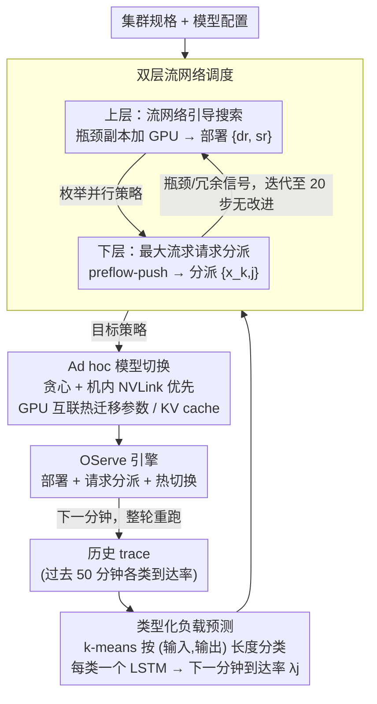

# OServe: Accelerating LLM Serving via Spatial-Temporal Workload Orchestration

**会议**: ICML 2026  
**arXiv**: [2602.12151](https://arxiv.org/abs/2602.12151)  
**代码**: 无  
**领域**: LLM 效率 / 推理服务系统  
**关键词**: LLM 推理服务, 异构部署, 流网络调度, 工作负载预测, 在线模型切换  

## 一句话总结
OServe 把 LLM 服务的「资源分配 + 并行策略 + 请求路由」联合建模为流网络上的双层最大流问题，配合 LSTM 工作负载预测和基于 GPU 互联的 ad hoc 模型切换，应对真实流量在空间（不同请求类型）和时间（成分随时刻变化）两个维度的异质性，端到端 P99 延迟和吞吐相比 vLLM 平均提升 1.5×、最大 2×。

## 研究背景与动机

**领域现状**：现有 LLM 推理系统（vLLM、Llumnix、Dynamo+vLLM 等）大多假设工作负载在空间上同质、在时间上静态，因此用单一并行策略和均匀资源分配把同一模型副本复制 N 份就上线。

**现有痛点**：真实流量同时呈现两种异质性——(i) **空间异质**：同时刻并发请求里有些是短输入短输出（聊天、摘要），计算密集；有些是长输入长输出（生成、代码），显存带宽密集；(ii) **时间异质**：流量成分按小时甚至按分钟变化，业务时段以短输出为主、夜间长输出占比上升。在 Azure 公开 trace 上，作者测得输入长度 1–7999、输出长度 1–5000 的极端分布。

**核心矛盾**：计算密集型负载希望多副本（数据并行 DP）以做满算力；显存密集型负载希望大并行度（张量并行 TP / 流水线并行 PP）以摊开 KV cache。同一套静态部署不可能在所有负载下都最优，但传统系统连「按时段切换部署」的能力都没有，因为重新加载 70B 模型要分钟级。

**本文目标**：(a) 给定流量画像，找到**异构部署**——不同副本可以用不同 DP/TP/PP 配置；(b) 同时给出最优的「请求→副本」分派；(c) 当流量变化时，**快速切换**部署而不是冷启动重新加载。

**切入角度**：把异构部署 + 请求分派同时建模成一个有向流网络上的最大流问题，把「分配几张 GPU、用什么并行」当成上层离散搜索、把「请求分到哪个副本」当成下层最大流；同时用 LSTM 预测下一分钟的请求成分；切换时利用 NVLink/InfiniBand 在 GPU 间直接迁移参数分片，而不是从磁盘加载。

**核心 idea**：用「流网络驱动的双层调度 + 基于 GPU 互联的热切换」联合解决空间和时间异质性。

## 方法详解

### 整体框架
OServe 的核心思路是把「该用什么部署、该怎么分派请求、该何时切换」打包成一个每分钟运行一次的闭环，让集群配置始终追着下一分钟的流量画像走。一轮循环里，**Workload Predictor** 先读历史 trace、预测下一分钟各类请求的到达率；**OServe Scheduler** 拿预测流量 + 集群规格搜出最优 serving strategy，既决定每个副本分几张 GPU、用什么并行策略（部署 $\{d_r, s_r\}$），也决定每类请求路到哪个副本（分派 $\{x_{k,j}\}$）；**Switch Planner** 再把「当前策略 → 目标策略」翻译成一份参数迁移计划，交给引擎在 GPU 互联上热切换、而非冷重启。三者串成一条「预测 → 调度 → 切换」的流水线，把空间异质（请求类型不同）和时间异质（成分随时刻变化）分别交给调度和切换处理。

### 关键设计

**1. LSTM 类型化负载预测：只预测类别到达率，不预测请求级长度**

时间异质性要求系统提前知道下一分钟流量长什么样，但请求级的输入/输出长度是 1–7999 的极端高方差信号，LSTM 根本学不动。OServe 的取巧之处是先用 k-means 把历史请求按 (输入长度, 输出长度) 聚成几类（典型 4 类），把高维高方差的预测任务降成几条稳定的低维序列，再对**每一类**单独训一个 LSTM（序列长度 50，用过去 50 分钟预测下一分钟的该类到达率）。消融把这一选择讲得很直白：直接用 LSTM 预测聚合到达率、不做类型分解，RRMSE 会飙到约 40% 且训练不收敛；而分类型后 RRMSE 降到 5.045%、单次预测只要 30ms，刚好能跟上 1 分钟一次的切换节奏。「不预测每条请求、只预测类别速率」也因此成了一个可迁移到其他系统类预测任务的通用降难度技巧。

**2. 双层流网络调度：用最大流把异构部署 + 请求分派一起解出来**

静态系统给所有副本同一种并行配置、再均匀复制，对付不了「计算密集和显存密集请求同时来」的空间异质性。OServe 把这件事拆成上下两层，下层是一个有向流网络：源点 $\mathcal{S}$ 引出的每条 workload 边 $w_j$，容量取该类请求的到达率 $\lambda_j$；每个副本 $k$ 拆成入节点 $c_k^{in}$ 和出节点 $c_k^{out}$，中间用一个最小公倍数 $M_k = \mathrm{lcm}\{n_{k,j}\}$ 当「能容纳混合负载的归一化容量」，一条类型-$j$ 请求经过它就消耗 $M_k/n_{k,j}$ 单位流量（$n_{k,j}$ 是副本 $k$ 对类型 $j$ 的处理速率）。对这张图跑 preflow-push 求最大流，得到的就是给定部署下的最优「请求→副本」分派（即下层）。上层则用流网络的结果反过来指导离散搜索：下层算完会暴露哪些副本「流满」是瓶颈、哪些「流不满」是冗余，于是把 GPU 从冗余副本挪给瓶颈副本，再枚举新配置下的并行策略组合，迭代到 20 步无改进为止。这样做的好处是离散的 $\{d_r, s_r\}$ 搜索从指数级塌缩成几十轮启发式，而且 bottleneck 信号比盲枚举有方向得多——16-GPU 上暴搜要 50s，这套方法只要 12s，P99 仅差 6%。

**3. Ad hoc 模型切换：贪心 + 机内优先，把 50s 冷加载压到 10s 内**

调度器每分钟可能换一套部署，但 70B 模型从磁盘冷加载要分钟级，trace 2 上最小切换间隔才 5 分钟——硬切会额外加 ~17% 平均延迟，等于把调度收益吃光。OServe 改用 GPU 互联做参数热迁移：源策略和目标策略的分片方式不同，每片目标参数都对应一组源 GPU 和一组目标 GPU，算法对每个目标分片迭代所有可行源 GPU、挑通信负载最低的那个加入计划，并且**机内优先**——先在 NVLink（400GB/s）上找源，机内没有再走机间 InfiniBand/RoCE（10–200GB/s）。KV cache 同步搬迁：短序列 KV 在源端 drain 完，长序列 KV 用同样的贪心挪到目标 GPU，并预留带 10–20% headroom 的 buffer 防止 OOM 抖动。最终把切换开销压到 10s 以内，P99 平均降 12%、最高降 17%，而且这种增益正好集中在高频波动场景，平稳负载下几乎不触发切换。

### 损失函数 / 训练策略
纯系统工作，无训练损失。LSTM 用两周 Azure 真实 trace、9:1 训练/测试切分进行训练；调度算法是确定性最大流 + 启发式搜索；切换算法是贪心 + 启发式剪枝。

## 实验关键数据

### 主实验
实验平台 4 台 8×H100-80GB 服务器，机内 NVLink 400GB/s，机间 InfiniBand 200GB/s。模型覆盖 OPT-30B/66B、LLaMA-30B、LLaMA2-70B，trace 取自 Azure Public Dataset 的两段（800 分钟和 50 分钟），按 P1–P6 切片对比。

| 对比基线 | P99 延迟 / 吞吐相对提升 | 平均提升 |
|---|---|---|
| vLLM (static) | 最高 2.0× | 1.5× |
| vLLM (reload) | 最高 1.5× | 1.3× |
| Llumnix | 最高 1.51× | 1.32–1.51× |
| Dynamo+vLLM | -- | 12–20% |
| 32-GPU 集群（LLaMA2-70B） | 最高 1.9× | -- |

空间敏感度上，作者按工作负载分布的变异系数 CV 构造 S1–S5，OServe 相对 vLLM(static) 的加速从 CV=0.112 的 1.14× 单调上升到 CV=0.688 的 2.66×；时间敏感度上 T1→T4 从 1.23× 升到 1.98×。

### 消融实验

| 配置 | LLaMA2-70B/OPT-66B P99 改善 | 说明 |
|---|---|---|
| vLLM (reload) baseline | -- | 起点 |
| + 异构部署 | 平均 34% / 最大 52% | 不同副本用不同并行配置 |
| + 最优请求分派 | 平均 64% / 最大 109% | 把负载路到最匹配副本 |
| + ad hoc 切换 | 再降 P99 平均 12% / 最大 17% | 节省冷加载 |
| LSTM 预测（按类型） | RRMSE 5.045% | -- |
| Moving Average | RRMSE 43.375%, 吞吐 -41% | 简单基线 |
| LSTM 不分类型 | RRMSE 约 40%, 不收敛 | 证明分类型必要 |

### 关键发现
- 异构部署的收益与流量异质程度正相关：流量越偏斜，OServe 优势越大，最多到 2.66×。
- 启发式搜索在 16-GPU 上比暴搜快 4× 以上，但 P99 损失只有 6%，说明 flow-network-guided 信号足够准确。
- ad hoc 切换的相对增益在**高频波动场景**最显著，平稳负载下几乎不需切换，正好契合系统设计哲学：「该切才切」。

## 亮点与洞察
- 把异构资源分配 + 请求分派统一到最大流框架，是把一个看起来 NP-hard 的联合调度问题压成了「双层 LP/最大流」可解的形式，结构上极优雅。
- 「不预测请求级长度，只预测类别到达率」的思想是降低预测难度的通用 trick，可直接搬到其他系统类预测任务（如 GPU 调度、storage scheduling）。
- ad hoc 切换利用 GPU 互联做参数迁移的思路，在多租户 GPU 集群、Mixture-of-Experts 路由切换、LoRA 热替换等场景都值得借鉴。

## 局限与展望
- 双层调度需要离线 profiling 出每个 (副本, 负载类型) 的处理速率 $n_{k,j}$ 和边容量 $e_{k,j}$，对新模型/新硬件首次部署成本高。
- 预测误差不可避免，论文用 1 分钟细粒度 + 快切换来兜底，但极端突发流量（秒级 spike）仍会落入下一周期才被纠正。
- 当前只考虑稠密 dense decoder LLM，对 MoE 路由型模型、speculative decoding、disaggregated prefill/decode 等新范式适配度未给出。

## 相关工作与启发
- **vs vLLM**：vLLM 强在 paged KV cache 和 continuous batching，但部署是静态单策略；OServe 把 vLLM 当 backend 引擎，自己在「策略层」做调度。
- **vs Llumnix**：Llumnix 做的是请求级动态迁移，但所有实例配置同质；OServe 同时调副本配置和分派，因此 P99 优 1.32–1.51×。
- **vs Dynamo**：Dynamo 做 prefill/decode 解耦的 autoscaling，但每 worker 并行度固定；OServe 让并行度随负载变化，端到端再优 12–20%。

## 评分
- 新颖性: ⭐⭐⭐⭐ 流网络 + 双层启发式 + ad hoc 切换的组合是 LLM serving 里少见的整套方案
- 实验充分度: ⭐⭐⭐⭐⭐ 覆盖 4 大基线 / 4 个模型 / 2 段 trace / 8-32 GPU / 空间&时间敏感度，体量扎实
- 写作质量: ⭐⭐⭐⭐ 系统图清晰、算法描述具体，但数学符号略碎，初读门槛偏高
- 价值: ⭐⭐⭐⭐⭐ 工业级 serving 系统，1.5× 平均加速直接可落地

<!-- RELATED:START -->

## 相关论文

- [\[ICML 2026\] Theoretically Optimal Attention/FFN Ratios in Disaggregated LLM Serving](theoretically_optimal_attentionffn_ratios_in_disaggregated_llm_serving.md)
- [\[ICML 2026\] GraphFlow: A Graph-Based Workflow Management for Efficient LLM-Agent Serving](graphflow_a_graph-based_workflow_management_for_efficient_llm-agent_serving.md)
- [\[ICML 2026\] TEAM: Temporal-Spatial Consistency Guided Expert Activation for MoE Diffusion Language Model Acceleration](team_temporal-spatial_consistency_guided_expert_activation_for_moe_diffusion_lan.md)
- [\[ICML 2026\] dLLM-Cache: Accelerating Diffusion Large Language Models with Adaptive Caching](dllm-cache_accelerating_diffusion_large_language_models_with_adaptive_caching.md)
- [\[ICLR 2026\] LycheeDecode: Accelerating Long-Context LLM Inference via Hybrid-Head Sparse Decoding](../../ICLR2026/llm_efficiency/lycheedecode_accelerating_long-context_llm_inference_via_hybrid-head_sparse_deco.md)

<!-- RELATED:END -->
