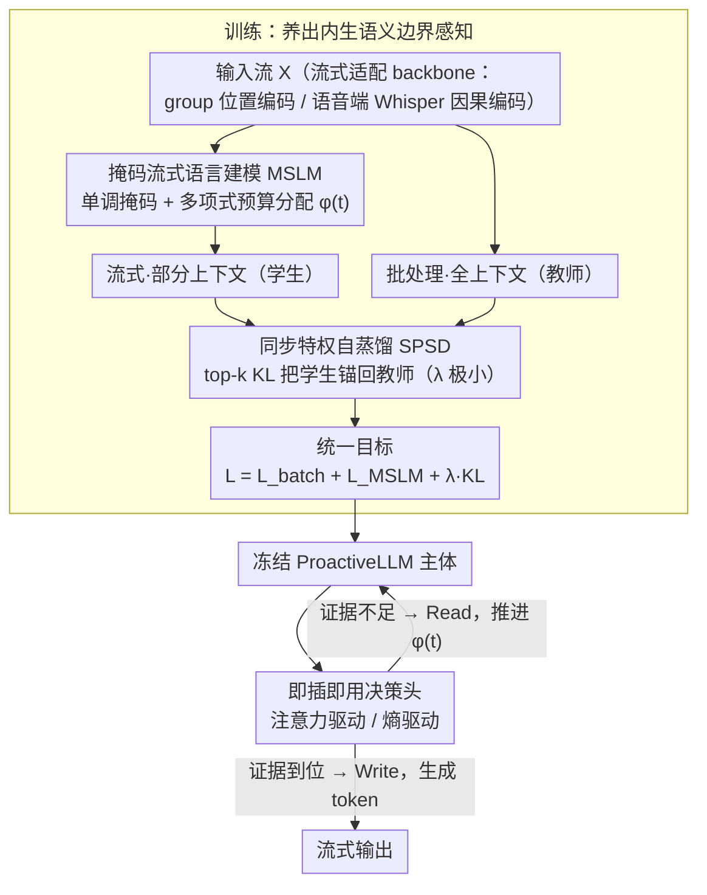

# ProactiveLLM: Learning Active Interaction for Streaming Large Language Models

**会议**: ICML 2026  
**arXiv**: [2606.00523](https://arxiv.org/abs/2606.00523)  
**代码**: 论文声明开源,仓库链接见正文末尾  
**领域**: LLM效率 / 流式生成  
**关键词**: 流式LLM, 主动交互, 掩码流式建模, 自蒸馏, 内生信号  

## 一句话总结
ProactiveLLM 让流式 LLM 用自己的内部状态（注意力或预测熵）来决定"什么时候该开口"，靠掩码流式建模 + 同步特权自蒸馏在不依赖任何外部对齐标注的前提下学会感知"语义已经够了没"，把交互延迟显著压下去的同时几乎不掉点。

## 研究背景与动机
**领域现状**：主流 LLM 沿用"read-then-generate"批处理范式，必须等输入流完整收齐才开始生成；新兴的流式 LLM 则希望边读边写,把音频/视频/同传等场景的响应时延打下去。

**现有痛点**：要让模型边读边写,核心是回答"什么时候触发生成"。已有做法分两类——一类用硬编码调度（wait-$k$、固定 chunk 解码），无视上下文密度的波动，在非单调对齐任务（如 QA、摘要）上要么过早开口胡说，要么和批处理一样滞后；另一类用外部对齐标注（时间戳、分段标签、强教师的推理轨迹）训练决策头,但每换一个任务/模态/延迟档位就要重新标注、重新训。

**核心矛盾**：两类方案本质上都把生成器当成被动追随者——要么追随死规则，要么追随外部对齐信号——模型从来没机会用自己的"语义足够性判断"来主导何时该 write。

**本文目标**：把交互调度函数 $\phi(t)$ 从静态规则升级成内容相关的策略 $\phi(t;\theta)$，并且彻底摆脱对外部对齐标注的依赖。

**切入角度**：作者赌一件事——一个本来就在批处理上训练得很好的 LLM，其隐藏状态已经隐含"当前部分上下文是否足够预测下一个 token"的信息；只是没人显式教过它在"看不全"的情况下表现这种判断。那就用掩码模拟流式可见性、用同模型的"看全版本"作为隐式教师,把这种感知能力激活出来。

**核心 idea**：把"流式生成能力学习"和"交互决策"解耦——先用掩码流式建模 + 同步特权自蒸馏培养内生的语义边界感知,再挂一个即插即用的决策头（注意力驱动或熵驱动）把内生信号翻译成 read/write 决策。

## 方法详解

### 整体框架
ProactiveLLM 要解决的是"流式 LLM 什么时候该开口"这件事,做法是把它拆成两段：先在训练里悄悄把"语义够了没"的感知能力养出来,再在推理时挂个轻量决策头把这种感知读出来变成 read/write 信号。整体建在一个流式适配过的 LLM backbone 上（沿用 group positional encoding 解耦输入/输出位置索引,语音端用 Whisper 编码器并强制因果掩码）：训练阶段联合优化三个目标——标准批处理 NLL 保住预训练知识、掩码流式语言建模 MSLM 学会在不完整输入下生成、同步特权自蒸馏 KL 用同模型的批处理 logits 当软教师把流式分布锚回去；推理阶段则冻住 LLM 主体,挂一个 plug-and-play 决策头实时监听内部状态,据此动态推进可见边界 $\phi(t)$。

形式化层面,流式生成被写成 $P(\mathbf{Y}|\mathbf{X})=\prod_{t=1}^{L}P(y_t\mid \mathbf{y}_{<t},\mathbf{X}_{1:\phi(t)};\theta)$,并强制单调约束 $\phi(t+1)\geq \phi(t)$（已经读进来的输入不会再吐回去）。评估上引入两个非传统指标:读覆盖率 $\text{RCO}=\frac{1}{L}\sum_t \phi(t)/M$ 度量认知冗余（开口前平均读了多少比例的输入,越低越省）,平均交互滞后 $\text{AIL}=\frac{1}{L}\sum_t (\phi(t)-\phi_{\text{ideal}}(t))$ 度量相对理想调度的延迟。

### 关键设计

**1. 掩码流式语言建模 (MSLM) + 多项式预算分配：用单调掩码逼模型在"看一半"时也能生成**

流式的核心难点是模型从没在"输入还没收齐"的视图下被训练过,直接上线就会乱写。MSLM 的做法是在训练时对每条样本采一个单调可见边界 $\phi$,把输出 token 对超出 $\phi(t)$ 的输入 token 的注意力全部掩掉,只用可见前缀去预测下一 token,优化 $\mathcal{L}_{\text{MSLM}}=-\sum_t \log P(y_t\mid \mathbf{y}_{<t}, \mathbf{x}_{1:\phi(t)};\theta)$。这相当于把 BERT 的掩码语言建模思想搬到自回归流式,只是双向掩码被改造成单调因果掩码以匹配"边读边写"的语义。

但纯均匀随机采 $\phi$ 会大量采到"几乎没上下文还硬要生"的退化样本,把模型逼成幻觉机器。为此作者不直接随机切边界,而是把总读取预算 $\mathcal{B}=M$ 用多项式分布 $\boldsymbol{\Delta}\sim\text{Multinomial}(\mathcal{B}, \mathbf{w})$ 分摊到 $L$ 个解码步上,再累加成轨迹 $\phi(t)=\Delta_0+\sum_{k=1}^t\Delta_k$。这样决策轨迹被约束在一个合理的"读速率"附近,既避免退化又保留足够随机性；而权重 $\mathbf{w}$ 设成均匀还是多项式偏置,直接对应不同的延迟偏好——同一份训练目标因此能让一个模型覆盖多种延迟档位。

**2. 同步特权自蒸馏 (SPSD)：用"看全版的自己"当软教师防止流式分布漂移**

只在残缺上下文上训练有个隐患:流式分布会慢慢偏离预训练流形,模型变得"看一点就乱写",丢掉原本的语义能力。SPSD 给流式视图提供一个稳定的优化锚,而且锚不来自任何外部教师——同一份参数同时跑两个 forward,批模式拿到完整 $\mathbf{x}$ 当 teacher、流式模式拿到 $\mathbf{x}_{1:\phi(t)}$ 当 student,用 top-$k$ 截断的 KL 把流式分布往批分布拉:

$$\mathcal{L}_{\text{distill}}=\lambda\cdot\sum_{t=1}^{L} D_{\text{KL}}\big(P_{\text{batch}}(\cdot\mid \mathbf{x})\,\|\,P_{\text{stream}}(\cdot\mid \mathbf{x}_{1:\phi(t)})\big)$$

关键是系数 $\lambda$ 极小,加上 top-$k$ 只锚最自信的几个 token。这两个旋钮把蒸馏控制在甜区:完全不蒸馏分布会漂走,过强蒸馏又会扼杀流式本该有的预期能力（学生在不完整证据下本就该和看全的老师表现不同,而不是被强行抹平）。因为是同一份参数同步自蒸馏,teacher 信号会随训练一起进化,既不像用历史 checkpoint / EMA 那样引入额外存储和滞后,也不需要任何外部强教师。

**3. 即插即用决策头（注意力 / 熵驱动）：把内生感知翻译成在线 read/write**

前两步只是在训练里养出了"语义边界感知",推理时还得有人把它读出来。ProactiveLLM 把 LLM 主体冻住,只挂一个轻量"网关控制器",而且提供两种互补的读法。注意力驱动头监控输出 token 对输入流的累计注意力分布——注意力分散意味着 grounding 不足、还得继续 read,聚焦到具体输入位置则说明证据到位、可以 write。熵驱动头则探测下一潜在 token 预测分布的 Shannon 熵 $H(P_t)=-\sum_{v\in\mathcal{V}} P(\hat{y}_t\mid C_t)\log P(\hat{y}_t\mid C_t)$,高熵代表预测还在发散需要继续 read,低熵代表模型已收敛到自信状态可以 write。

之所以能这么轻,是因为"能力学习"和"决策学习"被彻底解耦了:同一份训练好的 ProactiveLLM 可以挂上任何决策头、调任何阈值来切延迟档位,完全不用重训主体。这正是它相对学习型对齐基线（每换一种延迟/任务就得重新标注、重新训决策头）最大的实用优势。

### 损失函数 / 训练策略
统一目标 $\mathcal{L}=\mathcal{L}_{\text{batch}}+\mathcal{L}_{\text{MSLM}}+\lambda \mathcal{D}_{\text{KL}}$ 联合优化:批项防灾难性遗忘,MSLM 项是流式核心目标,KL 项当稳定锚。骨干用 Qwen2.5-3B-Instruct / Qwen3-4B（文本）和 Qwen2-Audio-7B-Instruct（语音）跑 SFT。

## 实验关键数据

### 主实验
覆盖文本和语音两个模态,文本端测单调对齐（IWSLT-17 翻译）和非单调对齐（对话摘要、SQuAD QA、MCTest 选择题）,语音端测 ASR（LibriSpeech）和 Spoken-SQuAD。下表挑了 Qwen2.5-3B 上几个有代表性的对比:

| 任务 | 方法 | 质量 ↑ | AIL ↓ | RCO ↓ |
|------|------|--------|-------|-------|
| MT En→De | Batch (Full) | 27.34 BLEU | 8.71 | 1.00 |
| MT En→De | Wait-9 | 21.47 | 6.87 | 0.88 |
| MT En→De | Proactive-Entr | 23.62 | 8.36 | 0.88 |
| Short QA | Batch (Full) | 74.79 F1 | 77.55 | 1.00 |
| Short QA | Wait-9 | 15.14 | -21.32 | 0.19 |
| Short QA | Proactive-Attn | 71.69 | 59.17 | 0.89 |
| Choice QA | Batch (Full) | 88.33 Acc | 204.87 | 1.00 |
| Choice QA | Proactive-Attn | 83.15 | 151.62 | 0.74 |

最亮的数字是非单调对齐 QA：用 78% 上下文保留 97.16% 的离线上界，而 wait-$k$ 系列在 Short QA 上 F1 直接掉到 8-15 区间——这就是"硬编码调度无法处理证据位置任意"的暴击。

### 与学习型基线的对比
论文还在 Table 2 用 Qwen3-32B 和 GPT-5.4 生成的对齐标注训练 learning-based 基线,对比在低/高两档延迟下的表现:

| 延迟档 | 方法 | MT En→Fr BLEU ↑ | Short QA F1 ↑ |
|--------|------|-----------------|---------------|
| 低延迟 | Qwen3-32B 标注 | 24.12 | 29.84 |
| 低延迟 | GPT-5.4 标注 | 27.18 | 38.12 |
| 低延迟 | ProactiveLLM | 26.56 | **48.74** |
| 高延迟 | Qwen3-32B 标注 | 27.62 | 42.88 |
| 高延迟 | GPT-5.4 标注 | 30.74 | 50.21 |
| 高延迟 | ProactiveLLM | 30.38 | **58.36** |

翻译任务上 ProactiveLLM 与强教师标注训出来的基线打平,QA 任务上反而显著超出——说明内生信号在非单调任务上比"外部对齐标注"更靠谱,毕竟 QA 的证据位置本来就难标注。

### 关键发现
- 决策头选择上：注意力驱动在非单调对齐任务（QA、摘要）上更稳，熵驱动在单调对齐任务（翻译）上略占优——因为翻译里"预测发散度"和"该读多少词"的关联更直接,QA 里"注意力聚焦在具体证据片段"才是 ready-to-write 的信号。
- 跨骨干（Qwen2.5-3B → Qwen3-4B）和跨模态（文本 → 语音）迁移稳定,验证了"内生信号"不依赖特定模型规模。
- 多项式预算分配 vs 朴素均匀采样：前者把训练分布约束在合理读速率附近,显著缓解了短上下文下的幻觉。

## 亮点与洞察
- **"endogenous cues"这一招的工程价值很高**：把"决定何时开口"从需要外部标注的监督任务,降级成了"用模型自己的注意力/熵就能读出来"的副产品。这意味着部署侧换延迟档位不用重新训模型,只换决策头阈值即可。
- **同模型同步自蒸馏比常规自蒸馏更聪明**：传统自蒸馏要么用过去 checkpoint、要么用 EMA,都引入额外开销和滞后；这里直接让同一份参数跑两次前向（批 + 流），teacher 永远是"当前自己看全了的样子"，节省存储且 teacher 信号随训练一起进化。
- **MSLM 把 BERT 思想搬到自回归流式**是个值得记的范式：BERT 的双向掩码学表示,这里的单调掩码学"在不完整证据下如何生成"，本质上是用掩码模拟部署时的分布。这个思路应该可以迁移到任何需要在受限观测下做预测的任务（流式 ASR、在线决策等）。

## 局限与展望
- 决策头还是基于人工设计的内部状态（attention/entropy），更通用的做法应该是让模型自己学一个轻量分类头从隐藏状态投影 read/write 概率。
- 多项式预算分布 $\mathbf{w}$ 的选择本质上还是个超参,真正的"自适应延迟"应该让模型自己根据任务难度调整预算。
- 实验骨干仍局限在 Qwen 系列 3B-7B,对超大模型（32B+）以及多轮交互流式场景缺验证。
- KL 锚的 $\lambda$ 和 top-$k$ 截断的选择敏感性、SPSD 在长上下文下的算力开销（每步要跑两个 forward）都需要更深入的分析。

## 相关工作与启发
- **vs Wait-$k$ (Ma et al., 2019)**：硬编码调度的代表,固定读 $k$ 个再 write 一个；ProactiveLLM 用内生信号替代固定步长,在证据位置不规律的非单调任务上优势最明显。
- **vs 学习型对齐基线 (Fu et al., 2025 等)**：靠强教师生成时间戳/分段标注训练决策策略；ProactiveLLM 完全不需要外部标注,在 QA 上甚至超过 GPT-5.4 标注训出来的基线。
- **vs 流式同传/翻译方向 (Tong et al., 2025a/b; Arora et al., 2025)**：这些工作主要解决"如何在流式 setting 下保证翻译质量",但调度策略仍是外生的；本文把调度策略也内化进模型,扩大了流式 LLM 的能力边界。
- **vs BERT 风格掩码建模**：思想同源（用掩码模拟受限观测下的预测），但目标从"学双向表示"转为"学单调流式生成",并配上多项式预算约束,适合自回归场景。

## 评分
- 新颖性: ⭐⭐⭐⭐ 把"何时交互"从静态规则/外部监督彻底升级成模型内生决策,这个 reframing 在流式 LLM 这一年发展中算是有分量的概念跳跃。
- 实验充分度: ⭐⭐⭐⭐ 文本 + 语音双模态,单调 + 非单调双类型任务,还和强教师标注的 learning-based 基线对比,覆盖面合格,但缺超大模型和长上下文验证。
- 写作质量: ⭐⭐⭐⭐ Preliminary 把 $\phi(t)$、RCO、AIL 定义清晰,方法图配合掩码示意图直观；但 SPSD 部分的"为何只用 top-$k$ KL"展开稍快。
- 价值: ⭐⭐⭐⭐ 对实时语音助手、同声传译、流式 video QA 等场景有直接落地价值,plug-and-play 决策头让延迟调档成本极低。

<!-- RELATED:START -->

## 相关论文

- [\[ICLR 2026\] Deep Hierarchical Learning with Nested Subspace Networks for Large Language Models](../../ICLR2026/llm_efficiency/deep_hierarchical_learning_with_nested_subspace_networks_for_large_language_mode.md)
- [\[ICLR 2026\] Expert Divergence Learning for MoE-based Language Models](../../ICLR2026/llm_efficiency/expert_divergence_learning_for_moe-based_language_models.md)
- [\[ICML 2026\] Scout: Active Information Foraging for Long-Text Understanding with Decoupled Epistemic States](scout_active_information_foraging_for_long-text_understanding_with_decoupled_epi.md)
- [\[ACL 2026\] Lizard: An Efficient Linearization Framework for Large Language Models](../../ACL2026/llm_efficiency/lizard_an_efficient_linearization_framework_for_large_language_models.md)
- [\[ACL 2026\] Are Large Language Models Economically Viable for Industry Deployment?](../../ACL2026/llm_efficiency/are_large_language_models_economically_viable_for_industry_deployment.md)

<!-- RELATED:END -->
