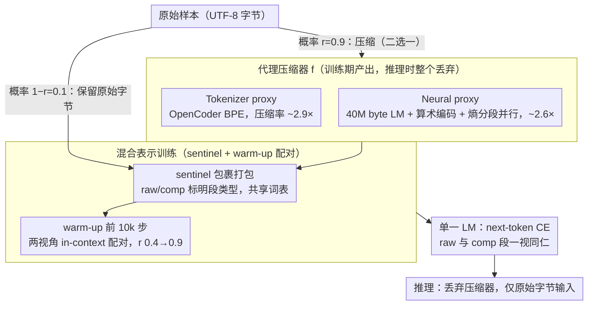

# Proxy Compression for Language Modeling

**会议**: ICML 2026  
**arXiv**: [2602.04289](https://arxiv.org/abs/2602.04289)  
**代码**: https://github.com/LZhengisme/proxy-compression (有)  
**领域**: LLM 效率 / 字节级建模 / 分词替代  
**关键词**: byte-level LM, tokenizer-free inference, mixed-representation training, arithmetic coding, neural compressor

## 一句话总结
作者提出「proxy compression」——训练时把 90% 数据喂成 tokenizer / 神经压缩器产出的短序列、10% 喂原始 UTF-8 字节，配合 sentinel token 与短暂的 in-context translation warm-up；推理时丢掉所有压缩器，模型只看原始字节，却能在固定 compute 下显著超过纯字节模型，且在大规模下追平甚至超过 tokenizer baseline。

## 研究背景与动机
**领域现状**：现代 LM 几乎全部建立在「外部固定 tokenizer」之上 —— BPE / SentencePiece 把 UTF-8 字节压缩成 token，让训练长度可控；arithmetic coding 配合小型 byte LM 也属于同类压缩。Tokenizer 把训练效率拉满，但 token 永久焊死在 model interface 里。

**现有痛点**：硬连 tokenizer 带来大量已被详细记录的副作用 —— prompt-boundary 问题、retokenization drift、glitch token（"SolidGoldMagikarp"）、低资源语言偏置、对抗鲁棒性差等等；更根本的是模型只学到 token 空间的统计，并非真正端到端的字节建模器。纯字节训练能解决所有这些问题，但 sequence 长度被拉到几倍，同样 compute 预算下数据量大减、收敛远不如 tokenizer 模型。

**核心矛盾**：训练效率（短序列）↔ 推理灵活性（字节级接口）↔ 鲁棒性 —— 现有方案只能三选二。Tokenizer 模型拿前两者，纯字节模型拿后两者，没有一种方案能三者全要。

**本文目标**：保留训练侧的"压缩短序列"效率优势，同时让推理侧完全运行在 raw UTF-8 上，不引入任何架构修改（不变体不变 tokenizer 不变 attention 不变），并希望随着模型增大效益放大。

**切入角度**：把外部压缩器视为「训练期 proxy」而非永久接口 —— 训练时同一个模型同时学习两种表示并自动建立内部映射；推理时丢掉压缩器只剩字节。关键观察是大模型有能力把这种 cross-representation 对齐塞进 weights 里。

**核心 idea**：用一个共享词表、加 `<comp>/<raw>` sentinel、做 mixed-representation next-token prediction，并在前 10k 步做 in-context translation 配对 warm-up；推理纯字节。

## 方法详解

### 整体框架
核心想法是让同一个模型在训练期同时吃「压缩短序列」和「原始字节」两种表示，并在权重里建立两者的内部映射，这样推理时就能把压缩器整个扔掉、只在原始 UTF-8 上运行。具体管线是：对每条样本 $x_{\text{raw}}$ 以概率 $r$（默认 0.9）替换成压缩流 $x_{\text{comp}}=f(x_{\text{raw}})$、否则保留原始字节，每段都用 `<raw>/<comp>` sentinel 包裹标明表示类型；训练前 10k 步是 warm-up，把同一样本的两种视角串进同一上下文做 in-context pairing 并把 $r$ 从 0.4 线性升到 0.9，warm-up 后关掉 pairing、固定 $r=0.9$ 跑到底；推理只喂 raw 字节。三者共享一张词表：前 64 索引留给 sentinel、接着 256 给 UTF-8 字节、剩余给压缩符号（tokenizer 用 OpenCoder 96,640 词表，neural 用 16-bit pack 共 65,536 符号，gzip 用 256 字节）。下图把这条管线画出来：上半部「代理压缩器」对应设计 1、2 的两种实例化，下半部「混合表示训练」对应设计 3，最后两步（损失与推理）是脚手架。

### 关键设计

**1. Tokenizer-based proxy：把现成 BPE 当成最简单的训练期压缩器**

要兑现「训练享 tokenizer 效率、推理丢 tokenizer」，最直接的实例化就是拿一个现成 tokenizer 把原始字节离线压成 token 索引序列当作 $x_{\text{comp}}$。这里直接调用 OpenCoder BPE，平均压缩率约 $2.9\times$，token 仍按词表索引喂进模型，与普通 tokenizer 模型唯一的区别是它出现在带 `<comp>` 标签的序列里、且训练时有 10% 概率被换成原始字节。之所以选 tokenizer 打头阵，是因为它输出极其稳定——对 10% 字符删除这种扰动，Levenshtein 距离几乎不动，这种稳定性让 LM 最容易学到 "comp ↔ raw" 的映射；同时它可以全离线预处理，没有任何额外训练成本。论文也试过把 token id 重新编码成定长字节序列，但效果不如直接用 id 表示好。

**2. Neural proxy + 熵分段并行：用神经压缩器换更优的熵编码，靠熵分段让它工程可行**

tokenizer 终究是手工 BPE 的产物，理论上神经压缩器能做得更优，于是第二种 proxy 改用一个 40M byte-level LM 配 arithmetic coding 给字节流做近最优熵编码，压缩率约 $2.6\times$。做法是先训小 byte LM 给出每个位置的 $p(\cdot|\text{ctx})$，再以 equal-information windows 做 arithmetic coding，每 16 bits pack 成一个符号。逐字节串行编码会慢到跑不动 3.3 TB 语料，所以引入「熵分段」——用 LM 算出 per-byte entropy，把高熵位置当作切片边界，每段独立并行压缩，这是让整套方案落地的关键。值得注意的是这个映射对 raw 是确定性单射、但反向并非单射：不同的原始字节可能映到同一 comp 段（即所谓 "fuzzy"），不过发生碰撞的 raw chunk 里 90%+ 都共享 $\text{LCP}\geq 0.8$，差异只落在 whitespace / newline / indent 这类低熵尾部。这种「结构化模糊」反而成了好事——它帮模型把格式噪声抽象掉，鲁棒性不降反升。

**3. In-context pairing + sentinel + 高 $r$ warm-up：让对齐进权重，却不让推理依赖压缩器**

前两个设计提供了压缩表示，但真正的难点是怎么让模型把 comp ↔ raw 的对齐内化到权重里、又不至于推理时非看到 comp 才能工作。三件事配合解决：一是用 `<raw>/<comp>` sentinel 显式告诉模型当前段的表示类型，让 next-token prediction 能条件于表示类型；二是 warm-up 阶段把 $[\langle\text{raw}\rangle x_{\text{raw}}\langle/\text{raw}\rangle\langle\text{comp}\rangle x_{\text{comp}}\langle/\text{comp}\rangle]$（顺序随机）拼进同一上下文，强迫模型同时看到两种视角；三是 warm-up 一结束就立刻关掉 pairing，避免模型养成「推理时必须有 comp 在前」的依赖。$r$ 从 0.4 渐升到 0.9 同样是为了防止训练早期 raw 见得太少、对齐学不起来。这个折中是被消融逼出来的：no-pairs 训练时 oracle-translation pass@1 只能到 30–46%，always-on pairing 能冲到 95%+ 但模型变得依赖 pairing、下游 raw-byte pass@1 反而略降；只有 warm-up-only 既保证了早期对齐、又不养出依赖（Table 3 验证），是经验上的最优解。

### 损失函数 / 训练策略
唯一损失就是普通的 next-token CE，对 raw 与 comp 两种 segment 一视同仁。架构用 EvaByte（高效字节级 multi-byte prediction），训练 50K 步 / batch 2M symbols，覆盖 0.5B / 1.5B / 4B / 7B / 14B 五个尺寸。

## 实验关键数据

### 主实验
固定 100B symbols 训练预算（compute 大致匹配），在 HumanEval-Plus / MBPP-Plus 上 pass@1：

| 任务 | 模型 | 0.5B | 1.5B | 4B | 7B | 14B |
|------|------|------|------|----|----|-----|
| HumanEval-Plus | Tokenizer | 17.7 | 18.3 | 28.0 | 28.7 | 29.3 |
|  | Byte-level | 15.9 | 18.3 | 22.0 | 23.8 | 24.4 |
|  | Proxy (Neural) | 13.4 | 18.3 | 22.6 | 26.8 | 29.9 |
|  | Proxy (Tokenizer) | 12.2 | 20.7 | 24.4 | 26.2 | **30.5** |
| MBPP-Plus | Tokenizer | 29.4 | 41.0 | 46.3 | 45.2 | 48.1 |
|  | Byte-level | 25.9 | 33.6 | 41.8 | 41.3 | 42.1 |
|  | Proxy (Neural) | 22.0 | 29.6 | 41.8 | 41.8 | **49.2** |
|  | Proxy (Tokenizer) | 25.4 | 38.4 | 44.4 | 45.5 | **49.5** |

Proxy 在 ≥1.5B 反超纯字节，在 14B 反超 tokenizer 基线 —— transfer 随规模放大。

### 消融实验

| 配置 | HumanEval-Plus pass@1 (1.5B) | 备注 |
|------|-------------------------------|------|
| Always-on pairing | 17.0 | oracle-translation 96%，但 ordinary 反而低 |
| Warmup-only (默认) | **20.7** | 既保对齐又不养依赖 |
| No pairs | 17.0 | 无显式 cross-rep 信号 |
| Gzip proxy（任意比例） | < 纯字节 | unstable 流，无法 transfer |
| Tokenizer / Neural proxy | 显著超字节 | 稳定 + 结构化 |

### 关键发现
- Proxy gain 与 model size 强正相关：0.5B 时弱甚至负迁移，14B 时同时碾压字节和 tokenizer 基线。
- 「压缩器稳定性」是 transfer 关键：tokenizer Levenshtein 距离最低、neural 居中、gzip 最大；前两者 transfer 成功，gzip 完全失败。
- 鲁棒性继承字节模型优势：在 ReCode 扰动（function rewrite / format / syntax / docstring）上，7B proxy 模型 Robust Pass@1 19.1（neural）vs tokenizer baseline 14.9 vs byte baseline 18.7，在 format / docstring 上几乎无衰减。
- Always-on pairing 把 oracle-translation 拉到 95%+ 但 ordinary pass@1 反而略降 —— 说明模型「在 context 翻译」与「在 weights 内化」是两条不同路径，后者才决定纯字节下游表现。

## 亮点与洞察
- 「外部压缩器只是训练 proxy，推理时全部丢掉」是一个极漂亮的解耦思路 —— 同一招可推广到 latent diffusion 的 VAE、音频领域的 codec 等所有「外部编码器 + 内部建模」结构。
- 用 sentinel token 把不同 representation 显式标记给模型，让单一模型在多 representation 上做 next-token，比设计多分支 / 多 decoder 简洁太多，对未来 multi-modal 训练有方法学借鉴。
- 「结构化模糊」是个反直觉发现：neural compressor 不可逆反而成了正则化，把格式噪声抹掉，鲁棒性甚至超过 lossless tokenizer。

## 局限与展望
- 实验主要在代码语料上（RefineCode），自然语言只在 1.5B 上做了补充验证；多语言、低资源语言下的 transfer 是否仍随尺度放大值得追问。
- 总 vocabulary 包含 byte（256）+ tokenizer（96K）+ sentinel，对 embedding 表的内存开销略大；neural proxy 还要额外训练并维护一个 40M byte LM。
- 没有给出推理速度对比：纯字节推理虽然丢了 tokenizer，但序列长度变长（$\sim 2.9\times$），EvaByte 的 multi-byte prediction 抵消多少需要更细的量化。
- 训练时模型见到的总字节数其实比纯字节模型少 —— 文章用 fixed FLOPs 比较是公允的，但实际部署里数据量与 FLOPs 都受限时是否仍领先，值得做。

## 相关工作与启发
- **vs Lester 2024（neural arithmetic coding LM）**：他们把 neural compressed stream 作为最终训练 + 推理表示；本文反过来，仅用作训练 proxy，推理仍走原始字节。
- **vs EvaByte / ByT5 / MegaByte**：纯字节方向的延伸；本文同享字节级推理但训练效率与之相比有数量级提升。
- **vs Tokenizer + 偶尔 mix raw**：表面像 token-byte 混合训练，但 sentinel + warm-up pairing + 高 $r$ 是关键差异，缺一会显著掉点。

## 评分
- 新颖性: ⭐⭐⭐⭐ "压缩器只做训练 proxy" 这一视角清新且实际可用
- 实验充分度: ⭐⭐⭐⭐ 横跨 5 个 scale + 3 类 proxy + 多个 robust / in-context probe
- 写作质量: ⭐⭐⭐⭐ 故事线清楚，scaling 曲线讲得直观
- 价值: ⭐⭐⭐⭐ 给「字节级推理」这条长期被效率压制的方向打开实际可行路径

<!-- RELATED:START -->

## 相关论文

- [\[ACL 2025\] GigaChat Family: Efficient Russian Language Modeling Through Mixture of Experts Architecture](../../ACL2025/llm_efficiency/gigachat_family_efficient_russian_language_modeling_through_mixture_of_experts_a.md)
- [\[ICML 2025\] Efficient Length-Generalizable Attention via Causal Retrieval for Long-Context Language Modeling](../../ICML2025/llm_efficiency/efficient_length-generalizable_attention_via_causal_retrieval_for_long-context_l.md)
- [\[ACL 2026\] Native Hybrid Attention for Efficient Sequence Modeling](../../ACL2026/llm_efficiency/native_hybrid_attention_for_efficient_sequence_modeling.md)
- [\[ACL 2026\] CoMeT: Collaborative Memory Transformer for Efficient Long Context Modeling](../../ACL2026/llm_efficiency/comet_collaborative_memory_transformer_for_efficient_long_context_modeling.md)
- [\[ICML 2026\] ProactiveLLM: Learning Active Interaction for Streaming Large Language Models](proactivellm_learning_active_interaction_for_streaming_large_language_models.md)

<!-- RELATED:END -->
