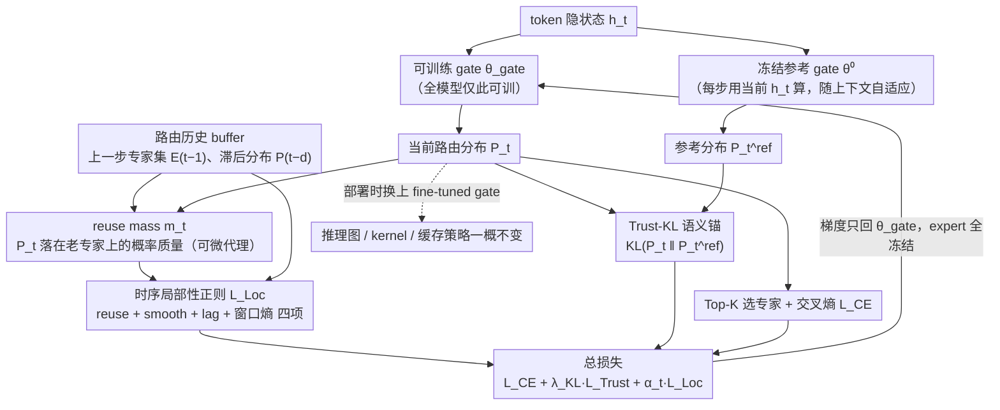

# ReMoE: Boosting Expert Reuse through Router Fine-Tuning in Memory-Constrained MoE LLM Inference

**会议**: ICML 2026  
**arXiv**: [2605.27081](https://arxiv.org/abs/2605.27081)  
**代码**: https://github.com/BUAA-OSCAR/ReMoE (有)  
**领域**: LLM效率 / MoE 推理 / 边端部署  
**关键词**: 细粒度 MoE、专家卸载、时序局部性、Router 微调、缓存命中

## 一句话总结
ReMoE 冻结所有非 router 参数、仅微调 gate，用一个"时序局部性正则 + Trust-KL 语义锚"的复合损失把 router 出来的路由轨迹整形得更"缓存友好"，在不改架构、不加运行时开销的前提下把相邻 token 的专家重用率提升约 26%，并在 Jetson Orin NX 上把 TPOT 降低 43.6–49.8%（解码加速 1.77–1.99×）。

## 研究背景与动机

**领域现状**：DeepSeek-V2/V3、Qwen-MoE 这类细粒度 MoE 把每层的专家数推到几十上百个，每个 token 只激活 Top-$K$ 个，参数量大但激活量小，非常适合在 UFS / SSD 充裕但 DRAM 紧张的边端设备上跑（Samsung UFS 4.0 已经能给出 4 GB/s 的读带宽 + 1 TB 容量）。运行时一般用 MoE-Infinity、HOBBIT、Fiddler、KTransformers 这类系统在 CPU/GPU 之间做专家缓存 + 预取。

**现有痛点**：解码阶段每个 token 都可能命中一组完全不同的专家，导致缓存频繁失效、I/O 抖动严重；尤其在 $B{=}1$ 的交互式推理下，没有 batch 平摊 I/O 的机会，专家搬移直接决定端到端时延。

**核心矛盾**：训练阶段为了 expert parallelism 加的 load-balancing loss $L_{\text{aux}}$ 强行把 token 均匀打散到所有专家，这与单请求推理时"少数缓存槽 + 期望相邻 token 复用同一专家工作集"的需求方向完全相反——这是一个 *training–deployment mismatch*。

**本文目标**：在不动 expert 权重、不改推理图、不引入新运行时策略的前提下，把 router 的输出轨迹 $\{E_t\}$ 整形得更"短窗口可复用"，从而上游侧（trace 层）就降低 distinct expert load 的数量。

**切入角度**：观察 Figure 2 中 DeepSeek-V2-Lite 第 21 层的路由轨迹——baseline router 其实已经有短的复用 streak，只是被频繁的"小幅切换"打断；这意味着自然局部性是存在的、只需要轻量整形即可放大，没必要像 Oracle-MoE 那样重新设计架构再从头预训练。

**核心 idea**：把"缓存命中"翻译成 router 层的一个可微优化目标——freeze 全模型只 fine-tune gate 参数 $\theta_{\text{gate}}$，让 router 倾向于复用最近选过的专家；同时挂一个 KL 锚把分布拉回预训练 router，避免语义漂移。

## 方法详解

### 整体框架
ReMoE 是一个 post-training 的 router 微调框架，推理 pipeline 与 baseline 完全一致：输入 token → 隐状态 $h_t$ → router 算 $P_t = \mathrm{Softmax}(h_t^\top \theta_{\text{gate}})$ → Top-$K$ 选专家 → 专家前向。改动只在训练侧——每层 MoE 内并行跑两个 gate：一个冻结的预训练快照 $\theta_{\text{gate}}^0$ 负责产出参考分布 $P_t^{\text{ref}}$，一个可训练 gate 产出 $P_t$，梯度只回到 $\theta_{\text{gate}}$，expert FFN / attention / embedding 全部冻结。训练时维护一个小的路由历史 buffer 喂给时序正则，部署时把 fine-tuned gate 权重一换即可，推理图、kernel、缓存策略一概不动。总损失 $\mathcal{L}=L_{\text{CE}}+\lambda_{\text{KL}}\,L_{\text{Trust}}+\alpha_t\,L_{\text{Loc}}$，其中 $\alpha_t = \min(1, t/T_{\text{warm}})$ 给局部性正则做线性 warmup，微调时还显式关掉了训练阶段那个鼓励"分散"的 $L_{\text{aux}}$。

### 关键设计

**1. Gate-only 微调 + reuse mass 可微代理：把"缓存命中"翻译成 router 能优化的连续目标**

痛点很直接——"step $t$ 与 step $t-1$ 选中的专家集合重叠几个"是一个离散、不可导的量，SGD 根本无从下手，所有 hardware-aware 训练目标都卡在"硬件指标不可导"这一步。ReMoE 的做法是定义 $\tilde{E}_{t-1} = \texttt{stop\_gradient}(E_{t-1})$，把上一步选中的专家 index 当成常数，再取当前步的 reuse mass $m_t = \frac{1}{K}\sum_{k\in\tilde{E}_{t-1}} P_t^{(k)}$——也就是当前 router 分布在"上一步刚用过的那 $K$ 个专家上"压了多少概率质量。stop_gradient 让梯度只往当前 $P_t$ 流，形成一个"单向追赶上一步"的信号：$m_t$ 越大，Top-$K$ 落回老专家的概率越高，相邻步重叠率 $\mathrm{IR}_t = |E_t \cap E_{t-1}|/K$ 的期望也随之抬升。论文用 Proposition 3.1 把这条信号锚到真实 I/O 上——在 LRU + 请求隔离的标准缓存语义下，平均 fetch 次数满足 $\bar{N}_{\text{fetch}} \le K(1 - \mathrm{EOR})$，于是 reuse mass 成了 Top-$K$ overlap 的光滑下界，"缓存命中"第一次能直接进入梯度回传。又因为只动 router 参数，整个微调极其轻量（OpenHermes-2.5 上 100k 样本、2000 steps）。

**2. 时序局部性正则 $L_{\text{Loc}}$：用四个不同时间尺度的子项一起整形路由轨迹**

单靠 reuse mass 只能压"相邻一步"，会留下两类残余 miss：连续小幅但累积的慢漂移，以及局部窗口内专家集合的扩散。$L_{\text{Loc}}$ 因此拆成四项分时尺度协同：$L_{\text{Loc}} = \lambda_{\text{Reuse}} L_{\text{Reuse}} + \lambda_{\text{Smooth}} L_{\text{Smooth}} + \lambda_{\text{Lag}} L_{\text{Lag}} + \lambda_{\text{WS}} L_{\text{WS}}$。$L_{\text{Reuse}} = -\log(\rho + 10^{-8})$ 直接拉高序列平均 reuse mass $\rho$，负责短窗重叠；$L_{\text{Smooth}} = \frac{1}{T-1}\sum \text{SymKL}(P_t, P_{t-1})$ 用对称 KL 压相邻步的分布抖动（这里**不**加 stop_gradient，因为要让两步互相靠拢、双向耦合）；$L_{\text{Lag}}$ 在 lag 集 $\mathcal{D} = \{1,2,4,8,16\}$ 上做 SymKL，专抓跨多步的慢漂移；$L_{\text{WS}}$ 把每 $W$ 步的分布求平均后算熵 $H(\bar{P}_b)$ 再最小化，鼓励每个局部窗口里只活跃少数专家，正好对齐小缓存容量。这样 short-horizon / multi-step / windowed 三种 locality 各有一项盯着，比单一正则鲁棒得多。

**3. Trust-KL 语义锚：给激进的局部性优化套一道"别把模型推崩"的护栏**

只压局部性很容易把 router 推到一个"缓存友好但 perplexity 崩了"的退化解——ReMoE 想做的是轻量 post-training，既不依赖 teacher、也不改 inference graph，就必须有个安全边界。它用一份 FP32 冻结的 gate 快照 $\theta_{\text{gate}}^0$ 在**当前** $h_t$ 上算 $P_t^{\text{ref}}$（关键细节：每步都用当前隐状态，所以参考分布会随上下文自适应），再以 $L_{\text{Trust}} = \frac{1}{T}\sum_t D_{\text{KL}}(P_t \,\|\, \texttt{stop\_gradient}(P_t^{\text{ref}}))$ 把 fine-tuned 分布拉回预训练 router。选 KL 而非 L2 / cosine 是因为路由本就是概率分布，KL 天然在高概率专家上加更大权重，恰好覆盖 Top-$K$ 决策的支配区域，这跟 PPO / distillation 里拿它当软信任域用的语义一致。"用当前 $h_t$ 算参考"这一点尤其重要：遇到语义急转弯时，locality bias 不会强行压住必要的专家切换，从而保证 OOD 域上最差也只是退化到 baseline 加速、不会掉点。

### 损失函数 / 训练策略
DeepSeek-V2-Lite (15.7B/2.4B，27 层，每层 64 routed + 2 shared，Top-$K{=}6$) 上微调 2000 steps，AdamW，lr $5\times 10^{-5}$，200 步 linear warmup，BF16，梯度裁剪 1.0，序列长 2048，micro-batch=1，grad-accum=8。数据用 OpenHermes-2.5 取 100k 训 / 1k eval。locality 项用 $\alpha_t = \min(1, t/T_{\text{warm}})$ warmup。所有 $\lambda$、$\mathcal{D}$、$W$ 详见 Appendix E。

## 实验关键数据

### 主实验

| 数据集 / 平台 | 指标 | Baseline | ReMoE | 提升 |
|--------|------|------|----------|------|
| DeepSeek-V2-Lite, $B{=}1$ | EOR ↑ | 27.3% | 34.5% | +7.2 pp (+26.4%) |
| 同上 | 路由熵 ↓ | 0.9998 | 0.9971 | −0.27% |
| 同上 | Load-balance CV ↑ | 0.0409 | 0.1608 | +293% |
| 缓存 $C{=}6$, LRU | uHR ↑ | 0.3187 | 0.3687 | +0.0500 |
| 同上 | #uMiss (M) ↓ | 0.8707 | 0.8068 | −0.0639 |
| vLLM, RTX 3090, ShareGPT | 输出吞吐 (tok/s) | 3.58 | 3.88 | +8.4% |
| 同上 | TPOT (ms) ↓ | 254.31 | 242.99 | −4.5% |
| Jetson Orin NX, ShareGPT | TPOT (ms) ↓ | 554.69 | 306.27 | −44.8% (1.81×) |
| Jetson, GSM8K | TPOT (ms) ↓ | 613.73 | 346.04 | −43.6% (1.77×) |
| Jetson, HumanEval | TPOT (ms) ↓ | 672.68 | 337.61 | −49.8% (1.99×) |

CE-only（只用 $L_{\text{CE}}$ 微调 router）作为对照，EOR 反而掉到 22.9%、vLLM 吞吐降到 2.95 tok/s——直接排除了"任何 router 继续微调都行"这种替代解释。

### 消融实验 & 能力保持

| 配置 / Benchmark | 关键指标 | 说明 |
|------|---------|------|
| Full ReMoE | EOR 34.5% / uHR@6 0.369 | 完整模型 |
| w/o Trust ($\lambda_{\text{KL}}{=}0$) | EOR 更高、PPL 退化 | 去掉语义锚后路由更激进但语言模型质量下降 |
| w/o Reuse | EOR 显著回落 | 主要重叠信号来自 reuse 项 |
| w/o Consistency (smooth/lag/ws=0) | EOR 回落 | smooth/lag/ws 共同压制慢漂移与窗口扩散 |
| GSM8K (EM, strict) | 38.89 → 38.13 | −0.76 pp，在波动范围内 |
| HumanEval (pass@1) | 26.83 → 29.27 | +2.44 pp，反而涨 |
| MMLU (acc) | 57.72 → 57.81 | +0.09 pp，基本持平 |
| IFEval (prompt loose) | 17.93 → 17.93 | 0 |

### 关键发现
- **CV 涨 3 倍但全局多样性几乎没变**：序列里访问过的不同专家数从 64.000 → 63.997——说明 ReMoE 制造的是 step-level 集中（短窗口里反复用同几个），而不是 global 路由坍缩，这正是缓存最喜欢的形态。
- **vLLM 加速远小于 Jetson**：PCIe Gen3 ×16 的 host-device 路径本来就能部分隐藏 miss，所以 8.4% 是"保守上界"；Jetson 上 SSD-backed 路径下 miss 代价高，cache 命中改进直接转成 1.77–1.99× 解码加速——说明 ReMoE 的收益与硬件 miss penalty 成正比，越是边端越香。
- **CE-only 是有效的负对照**：它训练条件与 ReMoE 完全一致，但 EOR 反而比 baseline 还低，吞吐下降 18%——证明加速来自局部性目标本身，不是"router 多见了点数据"。

## 亮点与洞察
- **把"硬件指标"翻译成"router 可微目标"的范式很干净**：Proposition 3.1 给了 EOR↔fetch 次数的上界，reuse mass 是 EOR 的光滑下界——一条"硬件 KPI → 离散 routing 指标 → 可微代理"的清晰链路，可直接套用到任何 dispatch-style 模块（不止 MoE）。
- **gate-only fine-tuning + 冻结 expert 这个分工很值**：参数空间优化（量化 / 低比特）减少"单次 fetch 的代价"，ReMoE 减少"fetch 的频次"，两者正交可叠加；同时只动 router 意味着 fine-tuning 算力可以忽略不计，对 community-release checkpoint 很友好。
- **Trust-KL 用 current $h_t$ 算参考分布**这个细节很关键——参考分布会随上下文自适应，所以遇到语义急转弯时 locality bias 不会强行压住必要的专家切换，这就是为什么 OOD 域上"最差也只是退化到 baseline 加速"。
- **四项 locality 项的"分时尺度分工"**可以迁移到任何带历史 buffer 的稀疏激活模块：高频抖动用相邻 SymKL，中频漂移用 lag-SymKL，窗口扩散用窗口熵——这套配方比单一正则鲁棒得多。

## 局限与展望
- 论文承认 locality 正则会提高 inference-time CV，目标场景明确锁定 $B{=}1$ 的单请求边端推理；在 datacenter 多请求 expert parallelism 下 CV 上升可能反噬负载均衡，这条线没有给出适配方案。
- 实验只在 DeepSeek-V2-Lite 上做完整 pipeline（Qwen1.5-MoE-A2.7B 只给了 EOR 提升 +27.2%），缺乏对更大规模 MoE（DeepSeek-V3、Mixtral 8×22B）以及不同 Top-$K$ 的系统扫描。
- "请求隔离的冷启动 cache" 假设在真实 serving 里偏理想化——多会话共享缓存时，跨请求的专家命中会进一步放大或稀释 ReMoE 的收益，论文没给出这种 setting 下的端到端测试。
- IFEval prompt strict 掉 1.11 pp，虽然作者没强调，但暗示 locality 微调对"严格指令遵循"这类长尾任务有轻微伤害；超参 $\lambda_{\text{KL}}$ / locality 权重的 task-aware 调度是个自然的下一步。
- 改进思路：把 reuse mass 推广到 prefetch-aware 目标（不仅奖励"上一步用过"，也奖励"窗口内 prefetch 已就绪"），就能跟 runtime cache 策略联合优化；以及探索基于 RL 的 router policy 微调，把真实 cache state 作为 observation。

## 相关工作与启发
- **vs Oracle-MoE (Zhou et al., 2025)**：Oracle-MoE 同样针对 locality 瓶颈，但选择重新设计 routing 架构并从头预训练；ReMoE 只 fine-tune gate、保留架构与 expert 权重，post-training 成本低几个数量级，但天花板可能不如重训。
- **vs Mixture of Cache-Conditional Experts (Skliar et al., 2025)**：后者在 *推理时* 直接用 cache residency 偏置专家选择，trade off 是会改 inference 图、且每步要查缓存状态；ReMoE 是离线把轨迹整形好，部署时与标准 cache 策略正交叠加。
- **vs MoE-Infinity / HOBBIT / Fiddler / KTransformers 等系统侧方法**：这些是 runtime cache + 调度优化，处理"miss 已经发生时怎么搬"；ReMoE 处理"上游 miss 请求怎么少发"——上下游互补，可同时部署。
- **vs 量化 / 低比特 fine-tuning (GPTQ / AWQ / QLoRA)**：参数空间优化降低"每次 fetch 的字节数"，ReMoE 降低"fetch 的频次"，两者正交。
- **vs load-balancing loss / router z-loss / expert-choice routing**：这些训练目标全都鼓励 dispersion（适合 expert parallelism）；ReMoE 在边端推理场景反过来——这给"训练目标必须区分 training-time vs deployment-time"提供了一个有力的案例。

## 评分
- 新颖性: ⭐⭐⭐⭐ 把缓存局部性形式化成可微 router 目标的角度新；但 reuse mass + KL anchor 这套组合在 RL / distillation 里都有同构原型
- 实验充分度: ⭐⭐⭐⭐ Trace-driven 模拟 + vLLM 真机 + Jetson 边端三层验证，CE-only 负对照尤其干净；只在 DeepSeek-V2-Lite 上跑完整 pipeline 略单薄
- 写作质量: ⭐⭐⭐⭐ 动机—代理—正则—锚—评估的结构非常工整，Proposition + Appendix 把"为什么是 reuse mass"讲透了
- 价值: ⭐⭐⭐⭐⭐ 直接给出 1.77–1.99× 边端解码加速、零运行时改动、与量化/缓存系统正交可叠，对 on-device MoE 工程落地极有用

<!-- RELATED:START -->

## 相关论文

- [\[ICLR 2026\] TokenSeek: Memory Efficient Fine Tuning via Instance-Aware Token Selection](../../ICLR2026/llm_efficiency/tokenseek_memory_efficient_fine_tuning_via_instance-aware_token_selection.md)
- [\[ICML 2026\] DOT-MoE: 用可微 optimal transport 把 dense LLM 转成 MoE](dot-moe_differentiable_optimal_transport_for_moefication.md)
- [\[ICML 2026\] Stochastic Sparse Attention for Memory-Bound Inference](stochastic_sparse_attention_for_memory-bound_inference.md)
- [\[ICML 2026\] Ekka: Automated Diagnosis of Silent Errors in LLM Inference](ekka_automated_diagnosis_of_silent_errors_in_llm_inference.md)
- [\[ICML 2026\] Beyond Sunk Costs: Boosting LLM Pre-training Efficiency via Orthogonal Growth of Mixture-of-Experts](beyond_sunk_costs_boosting_llm_pre-training_efficiency_via_orthogonal_growth_of_.md)

<!-- RELATED:END -->
