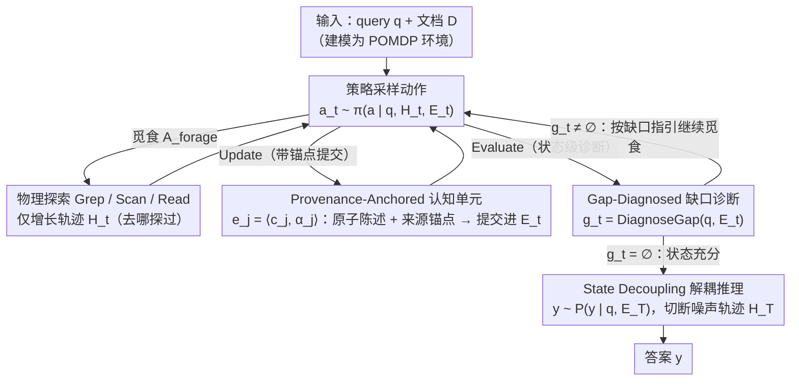

# Scout: Active Information Foraging for Long-Text Understanding with Decoupled Epistemic States

**会议**: ICML 2026  
**arXiv**: [2605.04496](https://arxiv.org/abs/2605.04496)  
**代码**: 项目页公开（论文 Project Page）  
**领域**: LLM 效率 / 长文本理解 / Agent  
**关键词**: 长文本理解、信息觅食、Agent、Epistemic State、ReAct 解耦

## 一句话总结
Scout 把百万级 token 的长文本理解重新建模为"主动信息觅食"过程，引入与交互轨迹解耦的、带来源锚点的 epistemic state $\mathcal{E}_t$ 作为唯一推理底座，并通过 gap-diagnosed 自评估迭代收缩到查询充分子集，在 LooGLE-v2 和 $\infty$Bench 上既追平甚至超过 Gemini-3-Pro 等前沿模型，又把 token 成本降低到约 $1/8$。

## 研究背景与动机

**领域现状**：当前长文本理解 (LTU) 大致分三派：原生长上下文 LLM（Gemini-3-Pro、GPT-5 等）一口气吃完整个文档；RAG 类方法把文档切块然后检索若干片段；专门的 LTU agent（ReadAgent、GraphReader、MemAgent 等）则通过图/索引/分页摘要做导航。它们在 NIAH 类任务上都还行，但都没真正解决百万 token 量级的复杂推理。

**现有痛点**：原生长上下文成本爆炸且存在注意力稀释，10 个数量级以上的上下文里关键信息会被淹没；RAG 切块后丢失全局依赖，多跳聚合任务效果差；agent 类方法通常依赖任务无关的预处理（建图、建索引、压缩 gist），一旦预处理时丢掉的细节就再也找不回来，并且 ReAct 式的"history-as-state"会让交互历史本身越长越脏，作为推理底座反而成了噪声。

**核心矛盾**：作者把这归纳为"LTU Trilemma"——可扩展性、信息保真度、推理效率三者难以同时满足，根因则是"Task-Agnostic Processing Trap"：在见到 query 之前就对整个文档做了固定抽象，导致预算花在大量与查询无关的区域，而真正需要的位置锚定线索又被压扁丢失。

**本文目标**：(R1) 始终能从噪声观察中过滤出与 $\mathcal{F}^{\star}_q$（oracle 充分集合）一致的信息并以稳定形式保留；(R2) 显式追踪"已掌握的"与"还缺什么"以引导后续探索；(R3) 把"是否已经够回答了"变成可判定的状态属性。

**切入角度**：作者基于一个"信息稀疏假设"：对任意 query $q$，$|\mathcal{F}^{\star}_q| \ll |\mathcal{F}(\mathcal{D})|$。因此把 LTU 建模为 POMDP，把文档当作可探索的环境而非被动序列，按需"觅食"而非穷举。

**核心 idea**：用一个带来源锚点的、与交互历史 $\mathcal{H}_t$ 完全解耦的 epistemic state $\mathcal{E}_t$ 来承载所有用于最终推理的知识；通过对 $\mathcal{E}_t$ 的状态级 gap 诊断驱动下一轮觅食与提交，直到 $\mathcal{E}_t \approx \mathcal{F}^{\star}_q$ 才停。

## 方法详解

### 整体框架
Scout 把长文本理解建模成一个 POMDP，让 agent 像觅食一样在文档里循环搜证而不是一口气读完。每一步它根据 query $q$、交互轨迹 $\mathcal{H}_t$ 和 epistemic state $\mathcal{E}_t$ 采样动作 $a_t \sim \pi(a \mid q, \mathcal{H}_t, \mathcal{E}_t)$，动作分两类：$\mathcal{A}_{\text{forage}}$ 是物理探索（Grep / Scan / Read 三种粒度，从词法跳读到密集逐字阅读），$\mathcal{A}_{\text{state}}$ 是状态操作（Update 把新单元提交进 $\mathcal{E}_t$，Evaluate 对 $\mathcal{E}_t$ 做缺口诊断）。轨迹 $\mathcal{H}_t$ 一直增长记录"去哪探过"，但 $\mathcal{E}_t$ 只在 Update 时变、只装"已确认的与查询相关的事实"。一旦诊断判定状态充分就终止，最后做"解耦推理" $y \sim P(y \mid q, \mathcal{E}_T)$——故意切断对 $\mathcal{H}_T$ 的访问，让噪声轨迹进不了答案。

> 双状态 $\mathcal{H}_t$（探索控制）与 $\mathcal{E}_t$（推理底座）贯穿整个循环：觅食只动 $\mathcal{H}_t$、Update 只往 $\mathcal{E}_t$ 写带锚点的事实、Evaluate 只读 $\mathcal{E}_t$ 判停，最终答题切到只看 $\mathcal{E}_T$——下面三个关键设计正是这条数据通路上的三处分离。

### 关键设计

**1. State Decoupling：把"在哪探过"和"确认了什么"拆成两个状态**

传统 ReAct 的痛点是同一份 history 既当探索控制又当推理底座，而长文本里绝大多数观察都是噪声，只要它们还留在推理上下文里，LTU 就一定脆。Scout 把统一 history 拆成两个角色：$\mathcal{H}_t$ 记录"在哪里探索过"，$\mathcal{E}_t$ 记录"已经确认的与 query 相关的知识"。策略仍可同时读 $(\mathcal{H}_t, \mathcal{E}_t)$ 来避免重复动作，但答题阶段强制从 $P(y \mid q, \mathcal{H}_T)$ 切换到 $P(y \mid q, \mathcal{E}_T)$，于是认知负载随 $|\mathcal{E}_T|$ 而非原文档长度 $|\mathcal{D}|$ 增长。把"探索"和"推理"在数据通路上彻底切开，正是直击需求 (R1)（从噪声里稳定保留充分信息）最干净的做法。

**2. Provenance-Anchored Epistemic Units：每条事实都带回原文的锚点**

光把状态解耦还不够——如果 $\mathcal{E}_t$ 是自由形式 free text，它照样会漂移、会被脑补污染。Scout 让状态由带来源锚点的认知单元组成：$\mathcal{E}_t = \{e_1, \dots, e_{M_t}\}$，每个 $e_j = \langle c_j, \alpha_j\rangle$，其中 $c_j$ 是从观察中蒸馏出的原子陈述，$\alpha_j$ 是指向原文 $\mathcal{D}$ 中唯一 span 的来源锚点。只有 agent 主动选择 Update 时才会向 $\mathcal{E}_t$ commit 新单元，纯探索动作不改变状态，因此任何用进答案的陈述都能沿 $\alpha_j$ 回溯到源文本、整条推理可审计。锚点强制 $\mathcal{E}_t$ "言之有据"，既压住幻觉，也让下面的自评估有了具体对象——不会出现"给自己想象的内容打勾"。

**3. Gap-Diagnosed Epistemic Convergence：用状态级缺口诊断决定何时停**

剩下的问题是"什么时候算够了"。ReAct 靠观察行为轨迹判断"看起来快完了"，但轨迹越长越脏，这个信号不可靠。Scout 引入一个状态级算子 Evaluate，对当前状态算缺口 $g_{t+1} = \text{DiagnoseGap}(q, \mathcal{E}_t)$，显式回答"相对 oracle 充分集 $\mathcal{F}^{\star}_q$ 还缺哪类信息"。若 $g_t = \emptyset$ 就停止，否则下一轮的觅食与提交都被这个缺口指引，迭代到状态级判定"充分"为止。因为监控的是"已蒸馏的状态"而非"行为轨迹"，判停标准跟轨迹长度脱钩，从机制上同时满足需求 (R2)（追踪已掌握/还缺什么）和 (R3)（把"够不够"变成可判定属性），避免长 horizon 下"越走越糊"。

### 损失函数 / 训练策略
推理阶段不需要训练，可直接用现成 backbone（论文以 Claude-Sonnet-4.5 为统一后端做公平比较），其中 Evaluate 就是让同一 backbone 在受约束的 prompt 模板 + 固定输出 schema 下被调用，吐出机器可解析的 gap 报告。对开源模型作者额外做了一组 post-training 实验：在 Qwen2.5-72B-Instruct、Qwen3-32B 等上分别尝试 LLM-only SFT 与 Scout 范式下的 SFT/DAPO，结果显示 Scout 范式下的 post-training 收益显著大于 plain LLM SFT——说明范式本身把训练信号变得更密集、更可学习。

## 实验关键数据

### 主实验
统一后端协议下与前沿长上下文 LLM 与近期 agent 框架对比，准确率 (%) 与 token 成本 (k) 双指标。

| Benchmark | 方法 | 准确率 | Token 成本 (k) | Token Eff. |
|-----------|------|--------|---------------|------------|
| LooGLE-v2 | Gemini-3-Pro | 68.5 | 273.9 | 0.25 |
| LooGLE-v2 | GPT-5.1-chat | 58.6 | 135.9 | 0.43 |
| LooGLE-v2 | MemAgent | 46.0 | 302.2 | 0.15 |
| LooGLE-v2 | **Scout** | **78.7** | **29.7** | **2.63** |
| $\infty$Bench | Gemini-3-Pro | 83.9 | 259.1 | 0.32 |
| $\infty$Bench | GraphReader | 43.1 | 327.4 | 0.13 |
| $\infty$Bench | **Scout** | **85.6** | **21.4** | **4.01** |

Scout 在两个 benchmark 上都拿到最高准确率，同时把 token 成本压到对手的约 $1/8$，Token Eff. 比最好的对手高一个数量级。

### 消融实验
LooGLE-v2 上对范式核心组件做拆解。

| 配置 | Acc (%) | $\Delta$ | Cost (k) |
|------|---------|----------|----------|
| Scout (Full) | 78.2 | – | 29.7 |
| w/o $\mathcal{E}_t$（退化为 ReAct） | 70.5 | $-7.7$ | 28.3 |
| w/o $\mathcal{A}_{\text{forage}}$（无法访问 $\mathcal{D}$） | 17.7 | $-60.5$ | 27.4 |
| w/o File Tools | 74.2 | $-4.0$ | 31.4 |
| w/o Grounding（去掉 $\alpha$ 锚点） | 75.5 | $-2.7$ | 29.7 |

### 关键发现
- 去掉 epistemic state 直接回到 ReAct，准确率掉 7.7 个点而 token 成本基本不变——证明性能的提升不是来自"更多 token"，而是来自"更干净的推理底座"。
- 当 context 从 64K 一路扩到 1M+ 时，Scout 的准确率几乎平直、token 成本也几乎不变；而原生长上下文模型在 256K 之后开始明显下滑、token 成本则按数量级增长。这印证了"信息稀疏假设"在实践中真的成立：增长的不是答题所需的信息，而是噪声。
- 去掉锚点 $\alpha$ 只掉 2.7 个点，看似温和，但作者指出在多跳聚合任务上的差距更大，说明锚点的价值主要在抑制长程推理中的幻觉漂移。

## 亮点与洞察
- 真正把"信息稀疏假设"做成了系统设计原则。多数 LTU 工作都默认稀疏，但只用稀疏来证明"RAG 也行"；Scout 把它升格为强约束——既然稀疏，那干脆让推理上下文等比稀疏，反向施压让 agent 只保留"必要且可溯源"的内容。
- ReAct 范式的"history-as-state"在短 horizon 工具调用里非常成功，但 Scout 揭示了它在长 horizon 下的根本病灶：信号/噪声比随 $|\mathcal{H}_t|$ 单调下降。把"探索"和"反思/答题"在数据通路上分开，几乎是对所有长 horizon agent 的可迁移建议。
- gap 诊断把 self-evaluation 从行为级（"我下一步该干啥"）升级到状态级（"我还缺什么类别的事实"），把"什么时候停"变成可判定问题，这一抽象对 deep research、agentic RAG 等场景都值得借鉴。

## 局限与展望
- 论文坦言"效率"主要指 token 成本，并不等于墙钟时间——多轮交互的网络与调度开销在某些部署中可能反超原生模型，Appendix E.4 给了 latency 分析但仍是限制。
- Evaluate 把诊断当成一次约束 prompt 调用，质量受 backbone 的元认知能力影响，弱 backbone 可能给出过于乐观的 gap 报告，从而过早终止。
- 当前动作空间是手工划分的 Grep/Scan/Read + Update/Evaluate，对结构化文档（PDF 表格、代码 AST）等场景或许需要更专门的 forage 原语。
- 锚点 $\alpha_j$ 假定原文有稳定 span 标识，对实时流、动态网页、流式 audio 这种"位置不稳"的输入还不直接适用。

## 相关工作与启发
- **vs ReAct**：保留了 ReAct 的"思考–行动–观察"循环用来驱动探索，但答题阶段强行切断对 $\mathcal{H}_T$ 的访问，从根上避免了"history 长就脏"的退化。
- **vs MemAgent / ReSum**：它们用 lossy compression 缩短上下文，但压缩本身可能丢掉位置锚定线索；Scout 不压缩 $\mathcal{H}_t$，而是另外维护一个干净的 $\mathcal{E}_t$ 作答。
- **vs GraphReader / ReadAgent**：这些方法在 query 到来之前就建了索引/gist，本质是"任务无关预处理"，Scout 则坚持"按 query 觅食"，避免预处理时已丢失关键细节。

## 评分
- 新颖性: ⭐⭐⭐⭐⭐ 把信息稀疏假设升级为强约束并设计出 epistemic state + gap 诊断的解耦范式
- 实验充分度: ⭐⭐⭐⭐⭐ LooGLE-v2 / $\infty$Bench 双 benchmark + 上下文扫描 + post-training，覆盖完整
- 写作质量: ⭐⭐⭐⭐⭐ 概念层次清晰，POMDP 形式化与 R1-R3 三要求把动机讲透
- 价值: ⭐⭐⭐⭐⭐ 在百万 token 场景取得 SOTA 同时把成本压一个数量级，对长文本 agent 有范式指导意义

<!-- RELATED:START -->

## 相关论文

- [\[ICML 2026\] ProactiveLLM: Learning Active Interaction for Streaming Large Language Models](proactivellm_learning_active_interaction_for_streaming_large_language_models.md)
- [\[ACL 2025\] FocusLLM: Precise Understanding of Long Context by Dynamic Condensing](../../ACL2025/llm_efficiency/focusllm_precise_understanding_of_long_context_by_dynamic_condensing.md)
- [\[ICML 2026\] RepetitionCurse: Measuring and Understanding Router Imbalance in Mixture-of-Experts LLMs under DoS Stress](repetitioncurse_measuring_and_understanding_router_imbalance_in_mixture-of-exper.md)
- [\[ICLR 2026\] Universe Routing: Why Self-Evolving Agents Need Epistemic Control](../../ICLR2026/llm_efficiency/universe_routing_why_self-evolving_agents_need_epistemic_control.md)
- [\[ACL 2025\] LongBench v2: Towards Deeper Understanding and Reasoning on Realistic Long-context Multitasks](../../ACL2025/llm_efficiency/longbench_v2_towards_deeper_understanding_and_reasoning_on_realistic_long-contex.md)

<!-- RELATED:END -->
