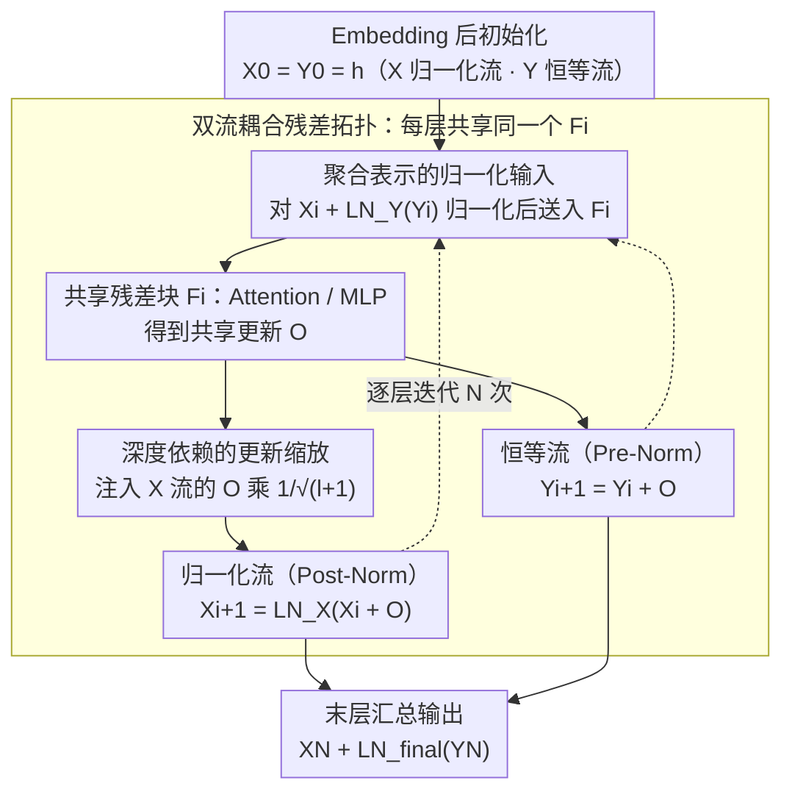

# SiameseNorm: Breaking the Barrier to Reconciling Pre/Post-Norm

**会议**: ICML 2026  
**arXiv**: [2602.08064](https://arxiv.org/abs/2602.08064)  
**代码**: https://github.com/Qwen-Applications/SiameseNorm  
**领域**: LLM效率 / Transformer架构 / 归一化  
**关键词**: SiameseNorm, Pre-Norm, Post-Norm, 双流残差, 训练稳定性

## 一句话总结
针对 Pre-Norm 与 Post-Norm 在单流架构内无法共存的结构性矛盾，作者提出双流残差架构 SiameseNorm，让一条未归一化流保留 Pre-Norm 的恒等梯度高速路、一条归一化流保留 Post-Norm 的主路径表征控制，通过共享残差块耦合两条流，在 400M~15B 稠密/MoE 语言模型、ViT、DiT 上均稳定优于 Pre-Norm 基线，开销可忽略。

## 研究背景与动机

**领域现状**：现代 Transformer（GPT-3、LLaMA、DeepSeek-V3、Qwen3、ViT）几乎清一色采用 Pre-Norm，因为它把 LayerNorm 放在残差分支内部、主路径保留干净的恒等连接，从而天然提供"梯度高速路"，让上百层的网络也能稳定训练。Post-Norm 把 LN 放在残差加法之后，主路径表征被周期性地归一化，单层表达力更强、最终性能往往更高，但训练极不稳定。

**现有痛点**：Pre-Norm 虽然能稳定训练，但近期研究发现它存在"深层失效"问题——把深层的若干层剪掉，性能几乎不掉。这反映 Pre-Norm 的主路径表征 $\|X_i\|_2$ 随层数近指数增长（论文 Fig.2(a) 显示 1.3B 模型最深层可达 $\sim 10^3$ 量级），而每层 $F_i$ 接收的是归一化后的输入（恒定量级），深层残差更新相对于巨大的主路径而言越来越小，"被稀释"导致深层利用率低、有效深度受限。Post-Norm 则因每层都要乘 LN 的 Jacobian $\mathbf{J}_{\mathrm{LN}}$，反向传播时被多次相乘后极易梯度爆炸或消失，导致大学习率下直接 diverge。

**核心矛盾**：两种范式在**同一条残差主路径**上要求互相冲突的属性——Pre-Norm 要"未归一化恒等路径以稳定梯度"，Post-Norm 要"归一化主路径以控制表征尺度"。已有混合方案（HybridNorm、Mix-LN、SpanNorm）把不同层指派给不同范式，但所有更新仍累加在同一条主路径上，因此天生无法同时满足两个要求；在高学习率（$\eta=10^{-3}$ 或 $2\times 10^{-3}$）下 HybridNorm 和 SpanNorm 都会 diverge。

**本文目标**：设计一种架构，能同时享有 Pre-Norm 的优化稳定性和 Post-Norm 的表征控制力，且与现有 Pre-Norm 训练 recipe（学习率、warm-up、初始化）完全兼容，不需要重新调参。

**切入角度**：既然两种要求在单流里不可调和，那就把它们**结构性解耦到两条流**上——保留两条独立演化的残差状态 $X_i$ 与 $Y_i$，让其中一条做 Post-Norm 化主路径、另一条做 Pre-Norm 化恒等路径，但让它们共享同一个残差块 $F_i$，从而在零参数开销下让 $F_i$ 同时收到两路梯度信号。

**核心 idea**：用"孪生双流"代替"单流归一化位置之争"——两条流共享计算模块，各自承担一种归一化语义。

## 方法详解

### 整体框架
SiameseNorm 不再纠结"LN 放残差前还是残差后"，而是让网络同时维护两条独立演化的残差流：一条 Post-Norm 化的归一化主路径 $X$，一条 Pre-Norm 化的恒等高速路 $Y$。输入经 Embedding 后两条流初始化为同一值 $X_0=Y_0=h$，此后每层只共享同一个残差块 $F_i$（即 Attention 或 MLP），各自按自己的归一化语义更新。具体到第 $i$ 层（见论文 Algorithm 1）：先把两条流在归一化空间对齐相加，作为共享块的输入算出 $O = F_i(X_i + \mathrm{LN}_i^Y(Y_i))$；再用 $O$ 分别更新归一化流 $X_{i+1} = \mathrm{LN}_i^X(X_i + O)$ 和恒等流 $Y_{i+1} = Y_i + O$。网络末端把两条流汇总输出 $X_N + \mathrm{LN}_{\mathrm{final}}(Y_N)$。整套结构只比 Pre-Norm 多了 $\mathrm{LN}_i^X$、$\mathrm{LN}_i^Y$ 两个轻量归一化算子，参数与 FLOPs 增加均 $<0.1\%$，在 15B MoE 上实测训练速度仅降 0.5%、激活内存仅增 2%。

### 关键设计

**1. 双流耦合残差拓扑：把"归一化位置之争"拆成两条物理路径**

Pre-Norm 与 Post-Norm 之所以不可调和，是因为它们对**同一条主路径**提出了互斥要求——一个要未归一化的恒等路径来稳梯度，一个要归一化的主路径来控表征。SiameseNorm 干脆把这两种语义分到两条流 $X$、$Y$ 上各管一摊，再用一个共享的 $F_i$ 把它们重新缝起来。妙处在梯度：把两条流叠成状态 $S_i=[X_i,Y_i]^\top$，写出双流转移 Jacobian $\partial S_{j+1}/\partial S_j$ 后会发现它的两个对角块**恰好**就是纯 Pre-Norm 的转移 $\mathbf{I}+\mathbf{J}_{F_j}\mathbf{J}_{\mathrm{LN}_j^Y}$ 和纯 Post-Norm 的转移 $\mathbf{J}_{\mathrm{LN}_j^X}(\mathbf{I}+\mathbf{J}_{F_j})$。也就是说，$F_i$ 在反传时同时收到 $Y$ 流送来的"恒等高速路"梯度和 $X$ 流送来的"归一化主路径"梯度，两套优化信号在 $F_i$ 的参数处汇合——既保住了 Pre-Norm 那条不被反复相乘的稳定梯度通道，又拿到了 Post-Norm 对表征尺度的周期性约束。这个拓扑还自带退化能力：令 $\mathrm{LN}^X=0$ 就回到 Pre-Norm，令 $\mathrm{LN}^Y=0$ 就回到 Post-Norm，介于其间则覆盖 Mix-LN 式的层级混合，等于把整个混合归一化设计空间收进一个参数化框架。

**2. 聚合表示的归一化输入（Normalized Input）：保证共享块永远收到分布稳定的输入**

虽然 $X_i$（已是 Post-Norm 后的结果）和 $\mathrm{LN}_i^Y(Y_i)$ 各自都归一化过，但两者相加后的融合表征会重新漂移，若直接喂给 $F_i$，Attention/MLP 收到的输入分布就不稳定。因此送入共享块前，对聚合表示 $X_i + \mathrm{LN}_i^Y(Y_i)$ 整体在归一化空间相加（$X_i$ 本身即归一化态），让模块输入始终对齐标准 Transformer 的训练习惯。这一步不是创新点，而是兼容现代 Transformer 的必要"粘合剂"，但去掉它代价不小：消融表（Table 3 行 4 vs 5、行 6 vs 7）显示移除后 PPL 从 10.43 涨到 10.51~10.88。

**3. 深度依赖的更新缩放（Depth-wise Scaling）：让深层两条流的尺度不打架**

两条流各跑各的，深层会出现尺度失衡：Pre-Norm 流 $\|Y_i\|_2$ 随层数自然增长，Post-Norm 流 $\|X_i\|_2$ 被 LN 约束始终有界，于是同一份共享更新 $O$ 对 $Y$ 流显得太小、对 $X$ 流显得太大，深层的 $X$ 流会过度敏感。借鉴 DeepNorm 的思路，作者只给注入 $X$ 流的那份更新乘上 $1/\sqrt{l+1}$（$l$ 为层索引）的衰减，越深衰减越多，把深层 Post-Norm 流的优化敏感度压下来。这样做的直接收益是与现有 Pre-Norm recipe 的学习率/warm-up 完全兼容——可以原封不动套用 $\eta=2\times 10^{-3}$ 这种激进设置而不发散，真正做到 drop-in 替换 Pre-Norm、不引入任何新的超参调优负担，这也是所有实验都能直接复用 Pre-Norm recipe 的原因。

### 损失函数 / 训练策略
完全沿用 Pre-Norm 训练 recipe：标准 AdamW、cosine 学习率、2K-step warm-up，无任何额外超参。所有 $\mathrm{LN}$ 的 scale 初始化为 1.0（不像 Hyper-Connections 依赖 Pre-Norm 偏置的初始化），直接测试架构本身的内在稳定性。语言建模基于 OLMo + FineWeb-Edu 从零训练，MoE 实验基于 OLMoE，总算力 60,000+ A100 小时。

## 实验关键数据

### 主实验：1.3B 稠密模型，不同学习率下与 8 种归一化方案对比

| 学习率 $\eta$ | 训练 token | Pre-Norm PPL | HybridNorm PPL | SpanNorm PPL | SiameseNorm PPL | 平均下游分数 |
|---------------|------------|--------------|----------------|--------------|-----------------|--------------|
| $4\times 10^{-4}$ 保守 | 100B | 11.21 | 10.91 | 11.00 | **10.57** | 52.26 |
| $1\times 10^{-3}$ 高 | 100B | 10.84 | **diverge** | 10.86 | **10.43** | 53.53 |
| $2\times 10^{-3}$ 激进 | 100B | 10.89 | **diverge** | **diverge** | **10.48** | 55.63 |
| $2\times 10^{-3}$ 激进 | 350B | 9.67 | — | — | **9.42** | 58.70 |
| MoE 15A2B $\eta=10^{-3}$ | 100B | 7.92 | — | — | **7.76** | 63.07 |

关键观察：HybridNorm 与 SpanNorm 在保守学习率下与 SiameseNorm 接近，但学习率一旦拉高就直接 diverge；SiameseNorm 是唯一在所有学习率下都稳定收敛、且 PPL 持续最低的方法。在激进学习率 100B 设置下，SiameseNorm 的 Arithmetic 准确率 39.6%，相比 Pre-Norm 27.0% 提升 41% 相对增益，体现 Post-Norm 表征控制带来的序列推理能力红利。

### 跨深度与跨模态泛化（390M 参数固定，12B token，$\eta=10^{-3}$）

| 配置 | Pre-Norm | SiameseNorm | 提升 |
|------|----------|-------------|------|
| 10 层 / d=1280 | 17.47 PPL | 16.15 | -1.32 |
| 17 层 / d=1024 | 17.23 | 15.69 | -1.54 |
| 33 层 / d=768 | 17.29 | **15.64** | -1.65 |
| 80 层 / d=512 | 18.02 | 15.98 | **-2.04** |
| DeiT-S (ImageNet) | 79.8 Acc | **81.3** | +1.5 |
| DiT-L/4 (FID) | 45.21 | **41.34** | -3.87 |

Pre-Norm 在 33 层时就开始退化，而 SiameseNorm 在 33 层取得最佳 PPL；深度越大、增益越大，直接验证了 SiameseNorm 缓解了 Pre-Norm 的"深层稀释"问题。

### 消融实验（Table 3，$\eta=10^{-3}$）

| Normalized Input | Depth-Scaling | Topology | Avg. PPL |
|------------------|---------------|----------|----------|
| ✓ | × | Original (HybridNorm) | **diverge** |
| ✓ | ✓ | Original | 10.65 |
| ✓ | × | ResiDual | 11.68* |
| × | × | Siamese | 10.88 |
| ✓ | × | Siamese | 10.68 |
| × | ✓ | Siamese | 10.51 |
| ✓ | ✓ | Siamese | **10.43** |

### 关键发现
- **Siamese 拓扑是稳定性核心**：HybridNorm 不加 Depth-Scaling 就 diverge，而 Siamese 拓扑即便不加 Depth-Scaling 也能跑到 10.68 PPL，且能 0 warm-up 训练（HybridNorm 在 warm-up 缩短到 300 步时已经 diverge）。
- **Depth-wise Scaling 与 Siamese 协同**：单独看是已有技巧，但在 SiameseNorm 框架下从 10.68 进一步降到 10.43。
- **梯度统计直接验证机制**：高学习率下 HybridNorm 梯度范数尖峰可超 100，而 SiameseNorm 与 Pre-Norm 都稳定在 0.5 以下——SiameseNorm 真正继承了 Pre-Norm 的优化稳定性。
- **深层利用率改善**：剪枝深层时 Pre-Norm 几乎不掉点（说明深层无用），而 SiameseNorm 剪深层会显著掉点，说明深层确实参与了表征。

## 亮点与洞察
- **"结构性解耦"的方法论价值**：当一个长期开放问题（Pre vs Post-Norm）在单流框架内无法调和时，与其继续优化单流的归一化位置，不如直接把冲突的要求拆到两条物理路径上——这种"双流耦合"的思路可迁移到其他存在 trade-off 的设计（如 BatchNorm vs LayerNorm、稀疏 vs 稠密路由）。
- **梯度 Jacobian 推导既是"证明"也是"指南针"**：作者写出 $\partial S_{j+1}/\partial S_j$ 的块矩阵，对角块直接对应 Pre/Post-Norm 转移，整个架构因此可以"按需配置"——零化 $\mathrm{LN}^X$ 退化为 Pre-Norm、零化 $\mathrm{LN}^Y$ 退化为 Post-Norm，覆盖整个混合归一化设计空间。
- **drop-in 兼容性是产品价值**：在 Qwen3 这种工业规模模型中，"不需要重调超参就能换架构"几乎是采用与否的硬门槛。Depth-wise Scaling 的 $1/\sqrt{l+1}$ 缩放是兑现这一承诺的关键，否则深层流尺度失衡会迫使重新搜 LR。

## 局限与展望
- 作者承认 SiameseNorm 把激活内存增加约 2%（保留两份流状态），在已经被显存卡得很死的超大模型上可能成为瓶颈，需要 activation checkpointing 缓解。
- 实验最大规模为 15B MoE / 100B token，尚未验证在 70B+ 稠密或万亿 token 长训练上的表现；长时训练下两条流的相对尺度是否会再次失衡有待观察。
- Depth-wise Scaling 的 $1/\sqrt{l+1}$ 是经验式衰减，没有给出最优缩放因子的理论分析；可能存在更优的层依赖缩放策略。
- 在 ViT/DiT 上的实验规模偏小（DeiT-S、DiT-L/4），未验证在 SD3-级别 DiT 或 ViT-22B 上的可扩展性。

## 相关工作与启发
- **vs HybridNorm / SpanNorm / Mix-LN（单流混合归一化）**：它们仍把不同归一化语义堆在同一条主路径上，因此在高学习率下复现 Post-Norm 的不稳定；SiameseNorm 通过物理分离两条流彻底回避这一矛盾，在 $\eta=10^{-3}$ 时 HybridNorm diverge 而 SiameseNorm 稳定。
- **vs ResiDual**：ResiDual 也采用双残差分支，但融合方式是末端相加；SiameseNorm 在每层都通过共享 $F_i$ 耦合两条流，且配合 Normalized Input 与 Depth-wise Scaling，在 ablation 中 ResiDual 仍出现 loss spike 而 Siamese 稳定。
- **vs Hyper-Connections（多路残差）**：Hyper-Connections 依赖 Pre-Norm-biased 初始化才能稳定，本文坚持把 LN scale 全部初始化为 1.0，证明 SiameseNorm 的稳定性来自拓扑本身而非初始化技巧。
- **vs DeepNorm**：DeepNorm 用残差缩放让 Post-Norm 能训深网络，但仍是单流；SiameseNorm 把 DeepNorm 的 $1/\sqrt{l+1}$ 思想搬到双流中作为辅助机制，让 Post-Norm 风格的流在 Pre-Norm recipe 下可用。

## 评分
- 新颖性: ⭐⭐⭐⭐⭐ 把"归一化位置之争"重构为"双流拓扑设计"，是范式级而非局部改进。
- 实验充分度: ⭐⭐⭐⭐⭐ 覆盖 400M / 1.3B / 15B MoE、ViT、DiT、4 种学习率、5 种深度配置，60K A100 小时。
- 写作质量: ⭐⭐⭐⭐ 梯度 Jacobian 推导清晰、Algorithm 1 简洁；但某些图（Fig.2、Fig.4）的描述较散。
- 价值: ⭐⭐⭐⭐⭐ 与 Pre-Norm recipe 完全兼容、开销 <2%、已在 Qwen 应用团队工程化，工业落地门槛极低。

<!-- RELATED:START -->

## 相关论文

- [\[ICML 2026\] Beyond Sunk Costs: Boosting LLM Pre-training Efficiency via Orthogonal Growth of Mixture-of-Experts](beyond_sunk_costs_boosting_llm_pre-training_efficiency_via_orthogonal_growth_of_.md)
- [\[ACL 2026\] Breaking Block Boundaries: Anchor-based History-stable Decoding for Diffusion Large Language Models](../../ACL2026/llm_efficiency/breaking_block_boundaries_anchor-based_history-stable_decoding_for_diffusion_lar.md)
- [\[NeurIPS 2025\] Jet-Nemotron: Efficient Language Model with Post Neural Architecture Search](../../NeurIPS2025/llm_efficiency/jet-nemotron_efficient_language_model_with_post_neural_architecture_search.md)
- [\[ICML 2026\] Efficient Training-Free Multi-Token Prediction via Embedding-Space Probing](efficient_training-free_multi-token_prediction_via_embedding-space_probing.md)
- [\[ICML 2026\] L$^3$: Large Lookup Layers](l3_large_lookup_layers.md)

<!-- RELATED:END -->
