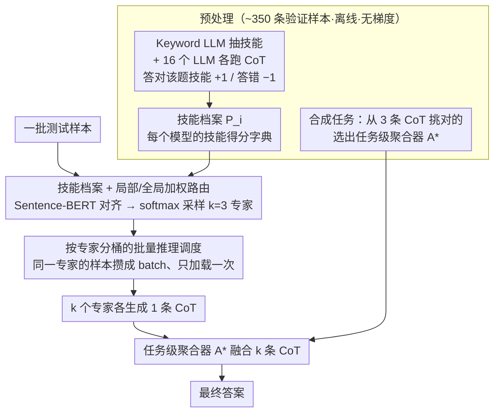

# Skill-Based Mixture-of-Experts: Adaptive Routing for Heterogeneous Reasoning via Inferred Skills

**会议**: ICML2026  
**arXiv**: [2503.05641](https://arxiv.org/abs/2503.05641)  
**代码**: https://github.com/dinobby/Skill-MoE (有)  
**领域**: LLM效率 / Mixture-of-Experts / 多智能体推理  
**关键词**: 符号化 MoE、技能路由、实例级专家选择、聚合器选择、批量推理

## 一句话总结
SKILL-MOE 提出一个无需训练、以"技能"为路由信号的符号化 MoE 框架：从每个问题里抽取所需技能、按技能-模型档案在 16 个预训练 LLM 中为每条样本动态招募 k 个专家、再用任务级最优聚合器把多条 CoT 融成最终答案；配合按专家分桶的批量推理，单卡就能跑 16 个 7-8B 模型，平均比最强多智能体基线高 8.15%。

## 研究背景与动机

**领域现状**：当前用多个预训练 LLM 协同求解推理题主要走两条路：一是多智能体讨论（Debate / ReConcile / MoA / Self-MoA），用固定的几个模型多轮辩论；二是把 MoE 训进单一大模型，专家是参数子集，需要端到端联合训练。前者把"用哪些模型"绑死在任务级，后者无法直接复用已有的 LLM 池。

**现有痛点**：任务级选模型粒度太粗——同样是数学题，一道考代数、一道考概率，所需专家其实不同；多轮讨论又非常贵：每条样本要做 6-9 次 LLM 调用，而且一旦想把候选池扩到 16 个 7-8B 模型，每个都要一张 GPU，根本部署不起。

**核心矛盾**：要在"实例级动态招专家以获得更细粒度的能力匹配"和"单卡扛得住一个大型异构模型池"之间取得平衡。固定专家集牺牲细粒度，朴素动态调度则因频繁加载-卸载模型而高延迟。

**本文目标**：
(1) 设计一个无需梯度训练、能在实例级根据技能挑选专家的路由机制；
(2) 设计一个能让 16 个 7-8B 模型在单卡上跑出与 4 卡 MoA 相当吞吐的推理调度策略；
(3) 同时回答聚合器该怎么选，以及讨论轮数能否被省掉。

**切入角度**：与其在参数空间里训路由器，不如让所有 LLM 通过"自然语言"这个共同协议交换信息，然后用一个轻量的"技能向量"——每个模型在每种技能上的累计得分——作为符号化路由器。技能描述既可以从问题里被关键词 LLM 推理出来，也能用 Sentence-BERT 在测试样本与档案之间对齐。

**核心 idea**：把 MoE 的路由从"hidden state"搬到"离散技能"，把专家从"参数子集"换成"完整预训练 LLM"，靠按专家分桶的批量推理让动态招募在一张卡上跑起来。

## 方法详解

### 整体框架
SKILL-MOE 想做的事是：手上有 16 个独立训练的 7-8B 异构 LLM，怎么对每道推理题动态挑出最合适的几个去解、再把它们的解法融成一个答案，而且整套流程不训练任何参数、还能塞进单张 GPU。它分两个阶段。预处理阶段在 ~350 条验证样本上离线统计：用 Qwen2.5-7B-Instruct 当 "Keyword LLM" 给每道题抽出所需技能，让 16 个模型各自 CoT 解题，答对就给该题涉及的每个技能 +1、答错 −1，攒出每个模型 $M_i$ 的技能档案 $P_i$（形如 $\{\text{Algebra}: 10, \text{Biology}: 3, \text{Chemistry}: -6, \dots\}$），同时另用一个"从三条 CoT 里挑出正确那条"的合成任务，选出每个数据集上最会聚合的模型作为任务级聚合器 $A^*$。推理阶段对每条测试样本同样抽技能、用 Sentence-BERT 把它和档案技能做余弦对齐，按匹配度采样 $k=3$ 个专家各生成一条 CoT，最后由 $A^*$ 把这 $k$ 条拼起来输出最终答案——而"按专家分桶的批量推理"则是让这套动态招专家能在单卡上跑起来的系统支撑。

### 关键设计

**1. 技能档案 + 局部/全局加权的实例级路由：让代数题派代数强的模型、概率题派概率强的模型**

任务级选模型粒度太粗——同样是数学题，一道考代数一道考概率，该请的专家其实不同。SKILL-MOE 把路由下放到每条样本：对样本 $q$ 先抽出所需技能集合 $K_q$，模型 $M_i$ 在这道题上的"局部适配分"就是它在这些技能上的累计得分之和 $S(M_i, q) = \sum_{k_j \in K_q} s^{(i)}_{k_j}$。但光看局部分会让某个偏门技能上侥幸刷高分的弱模型混进来，于是再乘一个"全局胜任度" $\gamma_i$——模型在整个档案上的总分占池子总分的比例，反映它在该任务上的整体可靠性。最终相关性分 $w^{(i)}_q = \gamma_i \cdot S(M_i, q)$ 过 softmax（温度 0.5）后有放回采样 $k$ 个专家，并剔除在全测试集出现频率 <5% 的低频专家以防噪声。两个分相乘相当于在"该样本上的相对优势"和"该任务上的整体强度"之间做平衡：纯局部分混进弱模型，纯全局分又退化成任务级 top-k 丢了细粒度。消融印证了这一点——GPQA 上 Top-3 / Top-5 / 随机固定专家只有 52.86% / 47.68% / 42.61%，实例级路由拿到 57.78%（表 5）。

**2. 任务级聚合器选择：用一个对整个任务固定的"最会判断"模型来融合 CoT，而不是实例级换、也不是多数投票**

挑好专家后还要把 $k$ 条异构 CoT 融成一条高质量答案。SKILL-MOE 在验证集上为每条问题造 1 条正确 CoT + 2 条错误 CoT，让每个候选模型扮演聚合器去挑出正确答案，按命中率排名，选出每个数据集上最强的聚合器 $A^*$；推理时 $y = A^*(\bigoplus_{i=1}^k y_0^{(i)})$，$\oplus$ 表示拼接。这里的反直觉发现是"会推理的模型不一定会聚合"——Random 聚合器在 MMLU-Pro 只有 52.29%、实例级 Adaptive 聚合器 57.12%，而任务级 Task-specific 聚合器达到 63.71%（表 3），所以聚合器不该每条样本临时换，而该对整个任务挑一个最善判断的。更关键的是表 7 显示聚合器一旦选对，再叠 3 轮讨论收益几乎为零（63.83 vs. 63.71），于是昂贵的多轮交互可以直接砍掉。

**3. 按专家分桶的批量推理调度：把"动态招专家"摊回成"静态加载"，让 16 个模型在单卡上跑得起来**

动态招专家有个致命的系统代价：相邻两条样本要的模型集合可能完全不同，朴素逐样本调度要反复 load/offload 模型，在 GPQA 上高达 196.92 s/样本。SKILL-MOE 的工程支撑是先用路由把"每条样本请哪些专家"全算好，再把"同一个专家要处理的所有样本"打成一个 batch、按专家轮转加载——每个被激活的专家在整个 batch 里只加载一次。这样单卡延迟降到 25.76 s/样本，比 1 卡 MoA 的 45.98 s 还低 44%、与 4 卡 MoA 的 21.66 s 持平，扩到 4 卡时进一步降到 10.85 s（近 2× 加速，表 6）。代价是它假设测试样本成批到达，好在这与 vLLM / ChatGPT / Gemini 等主流推理服务的批量接口天然兼容。

### 一个完整示例
拿一道 GPQA 物理题走一遍：Keyword LLM 先抽出技能 $K_q=\{\text{Physics}, \text{Calculus}\}$；路由对池中每个模型算 $S(M_i,q)$（如某模型 Physics +8、Calculus +5，局部分 13），乘上它的全局胜任度 $\gamma_i$ 得相关性分，过 softmax 后采样出 3 个专家，比如 $\{$Qwen2.5-7B, Mathstral-7B, Phi-3$\}$。这 3 个专家各跑一条 CoT 得到 3 个候选答案（可能两对一错）。它们被丢进该数据集预选好的聚合器 $A^*$，$A^*$ 读完拼接的 3 条 CoT 判断出正确那条作为最终答案——全程没有多轮辩论，4 次 LLM 调用（3 专家 + 1 聚合器）出结果。同时在 batch 层面，凡是这一批里也路由到 Qwen2.5-7B 的样本会被攒到一起，等加载它时一次性解完，避免重复换模型。

### 损失函数 / 训练策略
完全无梯度。所有专家、聚合器、Keyword LLM 都是冻结的预训练 LLM，"训练"就是在 ~350 条验证样本上统计技能得分和聚合命中率。每条测试样本招 $k=3$ 个专家 + 1 个聚合器，共 4 次 LLM 调用，与 Self-Consistency $\times 5$ 同量级，比 MoA 的 6 次和 ReConcile 的 9 次更省。

## 实验关键数据

### 主实验
评测在 4 个异构推理数据集上做：MMLU-Pro（14 个学科 2100 题）、AIME 2024（数学奥赛）、GPQA Diamond（科学）、MedMCQA（医学考试）。模型池 16 个 3.5B–12B 的 LLM，主体在 7-8B。

| 数据集 | 指标 | SKILL-MOE | 最强多智能体基线 | 提升 |
|--------|------|-----------|------------------|------|
| AIME 2024 | Acc. | 68.88 | 55.56 (Self-MoA) | +13.32 |
| MMLU-Pro | Acc. | 63.71 | 61.78 (MoA) | +1.93 |
| MedMCQA | Acc. | 59.35 | 60.74 (ReConcile) | −1.39 |
| GPQA Diamond | Acc. | 57.78 | 52.86 (MoA / Self-MoA) | +4.92 |
| **平均** | Acc. | **62.43** | 54.28 (最强 baseline 平均) | **+8.15** |

跨数据集稳健：没有任何 baseline 能稳定拿第二，而 SKILL-MOE 平均分超过 Qwen2.5-72B（54.28）和 Llama3.3-70B（53.18），与 QwenR1-32B（56.94）相比也更稳——QwenR1-32B 在 AIME 上 76.67%，但 MedMCQA 只有 24.70%。

### 消融实验
| 配置 | 关键指标 (GPQA) | 说明 |
|------|----------------|------|
| Full SKILL-MOE | 57.78 | 模型档案路由 + 任务级聚合器 |
| Random 聚合器 + Recruited 专家 | 51.52 | 聚合器质量至关重要 |
| Task-specific 聚合器 + Random 专家 | 31.82 | 弱专家拖垮再强的聚合器（表 4） |
| Majority Vote + Recruited 专家 | 53.54 | 没有聚合器时多数投票可作 fallback |
| Top-3 固定专家 | 52.86 | 任务级粗粒度选 vs. 实例级 −4.92 |
| Top-5 固定专家 | 47.68 | 池子越大越易混进弱模型 |
| Adaptive 聚合器（MMLU-Pro） | 57.12 | 实例级换聚合器反而 −6.59 |
| Task-specific 聚合器 + 3 轮讨论 | 63.83 (MMLU-Pro) / 57.72 (GPQA) | 加讨论几乎不涨甚至略降（表 7） |

### 关键发现
- **专家选择和聚合器选择互相增益**：随机专家+强聚合器只有 31.82%，强专家+随机聚合器 51.52%，两者都用对才有 57.78%；缺一个都打不满。
- **任务级聚合器优于实例级**："会推理"≠"会判断哪条 CoT 对"，实例级动态选聚合器反而不如对整个任务挑一个"最善判断"的模型。
- **跨域泛化强**：用 MMLU-Pro 的模型档案直接迁到 OmniMATH（数学奥赛），SKILL-MOE 49.32%，比最强 baseline Debate 高 14.81%；用 AIME 档案迁过去仍比 Self-MoA 高 3.28%（表 2）——技能比"任务-模型"绑定更迁移友好。
- **效率换性能不掉点**：单卡 25.76 s/样本，比同样单卡的 MoA 快 44% 且准确率更高；4 卡时近 2× 加速。

## 亮点与洞察
- **符号化路由替代隐状态路由**：把 MoE 的 router 从神经网络换成"技能字典加权采样"，让 16 个独立预训练的 LLM 直接装进一个 MoE 框架，无需任何联合训练，模型升级时只要重跑一遍验证集就能更新档案。
- **批量推理是让"动态招专家"变可行的关键工程支撑**：纯算法层面动态招专家早就有人尝试，但真正卡死大家的是"每条样本换模型导致显存爆炸/反复加载"，按专家分桶把"动态"摊回成"静态"，让一张卡装得下 16 个 7-8B 模型，这种把算法假设和系统约束打通的思路值得复用到任何"按需调用大模型集群"的场景。
- **聚合器选择的反直觉**：作者用对照实验证明 reasoning capability 与 aggregation capability 不一致，且一旦聚合器选对，再叠多轮讨论收益接近零——这意味着大量多智能体讨论框架的"性能提升"其实更多来自一个隐式好聚合器，而非讨论本身。

## 局限与展望
- **依赖验证集且对验证集分布敏感**：模型档案、聚合器排名都是在 ~350 条验证样本上算出来的，验证集偏置会直接传染到路由策略；尽管作者展示了 MMLU-Pro 档案能泛化到 OmniMATH，但当目标任务的技能空间与所有训练-验证数据都偏差很大时，档案可能整个失效。
- **要求样本成批到达**：分桶批量推理依赖能预先拿到一批测试样本提前算路由，对单条流式 / 实时低延迟场景（如对话）不直接适用，需要退化为前端先做技能聚合再下发。
- **关键词 LLM 的偏差未充分隔离**：虽然附录里换 Keyword LLM 影响不大，但论文使用的都是 Qwen 系，对完全不同领域（如法律、金融）的技能抽取鲁棒性还需要更多验证。
- **MedMCQA 上略输 ReConcile**（59.35 vs. 60.74）：4 个数据集里只有这一项被压下来，作者归因于医学题更窄、ReConcile 的多轮讨论能补足专家不确定性，提示对"高度专业且专家覆盖稀疏"的领域，单轮+聚合器还不够。

## 相关工作与启发
- **vs MoA / Self-MoA (Wang 2024a / Li 2025)**：MoA 用任务级固定的 top-k 模型 + 2 轮讨论；Self-MoA 反复调用单一最强模型。SKILL-MOE 在每条样本上换专家集合，且把讨论砍到 0 轮、把 4-9 次 LLM 调用降到 4 次，平均高 8.15% 且单卡快 44%。
- **vs ReConcile / Multi-Agent Debate (Chen 2024b / Du 2023)**：他们靠多轮辩论收敛共识，对固定的 3 个模型反复跑 6-9 次调用，效率差且依赖人工挑模型。SKILL-MOE 用符号路由自动挑模型，不靠辩论靠聚合器。
- **vs LLM-Blender / Router-R1 / DER**：同样关注"挑模型/排序输出"，但 LLM-Blender 训了一个排序+融合模型、Router-R1 与 DER 把路由建成 RL/MDP 需要梯度训练。SKILL-MOE 走 gradient-free 符号路径，新模型加进来只需要几次前向就能上线。
- **vs 传统 Sparse MoE (Shazeer 2017)**：传统 MoE 专家是参数子集、需要端到端训、规模固定。SKILL-MOE 专家是整模型、靠语言通信、规模可热插拔——本质上是把 MoE 的"专家"概念升级到"完整 agent"的尺度。

## 评分
- 新颖性: ⭐⭐⭐⭐ 把 MoE 的路由从 hidden state 搬到符号化技能空间、专家从参数子集换成完整 LLM 的思路很清晰，但单点技术（技能抽取、聚合器选择、批量推理）都有先例。
- 实验充分度: ⭐⭐⭐⭐⭐ 4 个异构数据集 + 8 个 baseline + 多组消融（聚合器、专家、讨论轮数、跨域泛化、效率对比），还测了 OmniMATH 的零样本迁移。
- 写作质量: ⭐⭐⭐⭐ 框架图清晰、动机叙事完整，公式与算法描述精确；少量符号在不同段落表述略不一致。
- 价值: ⭐⭐⭐⭐⭐ "单卡跑 16 个 7-8B 异构模型且超过 70B 单模型"对学术界资源有限的多智能体研究极具实用价值，工程方案（按专家分桶批推）可以直接复用。

<!-- RELATED:START -->

## 相关论文

- [\[ICML 2026\] ProbMoE: Differentiable Probabilistic Routing for Mixture-of-Experts](probmoe_differentiable_probabilistic_routing_for_mixture-of-experts.md)
- [\[ICML 2026\] Hyperparameter Transfer with Mixture-of-Experts Layers](hyperparameter_transfer_with_mixture-of-expert_layers.md)
- [\[AAAI 2026\] How Many Experts Are Enough? Towards Optimal Semantic Specialization for Mixture-of-Experts](../../AAAI2026/llm_efficiency/how_many_experts_are_enough_towards_optimal_semantic_specialization_for_mixture-.md)
- [\[ICML 2026\] RepetitionCurse: Measuring and Understanding Router Imbalance in Mixture-of-Experts LLMs under DoS Stress](repetitioncurse_measuring_and_understanding_router_imbalance_in_mixture-of-exper.md)
- [\[ICML 2025\] Mixture of Lookup Experts](../../ICML2025/llm_efficiency/mixture_of_lookup_experts.md)

<!-- RELATED:END -->
