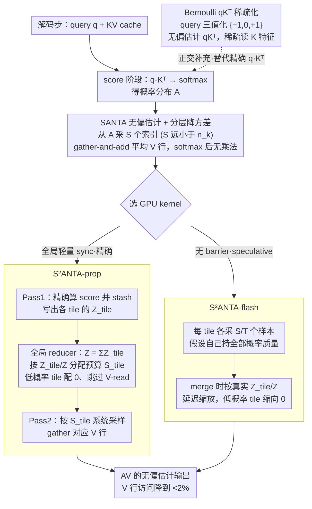

# Stochastic Sparse Attention for Memory-Bound Inference

**会议**: ICML 2026  
**arXiv**: [2605.01910](https://arxiv.org/abs/2605.01910)  
**代码**: <https://github.com/OPUSLab/SANTA.git>  
**领域**: 模型压缩 / LLM 推理加速 / 注意力优化  
**关键词**: 稀疏注意力, 随机采样, KV-cache, Stratified Sampling, GPU kernel

## 一句话总结
SANTA 把 attention 的 value 聚合 $AV$ 看作 "按 softmax 概率 $A$ 对值行 $V$ 做加权求和", 改成 "从 $A$ 中无放回采样 $S\ll n_k$ 个索引、直接平均对应 $V$ 行"的无偏估计, 用 stratified / systematic 采样降方差, 再写成 GPU kernel 与 FlashDecoding 对齐——在 32k context 下端到端比 FlashInfer / FlashDecoding 快 1.5× 且精度不掉。

## 研究背景与动机

**领域现状**: 长上下文自回归解码是 LLM 部署的痛, 每生成一个 token 都要把整个 KV cache 流过一遍, 带宽成为瓶颈 (Llama-3.1-8B 32k context 每层每 token 要传 ~128 MB)。现有缓解手段分四类: KV 量化压缩 (KIVI 等)、cache 管理 (Quest, H2O)、结构化稀疏注意力 (Longformer, BigBird)、内核优化 (FlashAttention, FlashDecoding)——再叠 GQA。但即使最优 exact kernel, 每步仍要碰整个 KV state, 带宽墙仍在。

**现有痛点**: top-$k$ / threshold-based 稀疏方法**是有偏估计**, 且通常需要排序; 量化/压缩破坏 KV 数值精度; 结构化稀疏 (sliding window 等) 牺牲表达力; FlashDecoding 已经几乎榨干 IO 局部性, 进一步加速需要直接**减少要读的 V 行数**, 而不是优化怎么读。

**核心矛盾**: attention 输出 $AV$ 是一个**期望**——$A$ 本身就是概率分布, 那为什么要把它当确定性权重和值矩阵乘? 完全可以用蒙特卡洛只算样本和。但 GPU 上随机采样会破坏并行性 (需要全局 CDF), 这正是工程难点。

**本文目标**: (a) 把 $AV$ 改写成无偏蒙特卡洛估计, 把 V 行访问从 $n_k$ 降到 $S\ll n_k$, 顺带消掉 softmax 后的所有乘法; (b) 降方差到能匹配 SDPA 精度; (c) 写一个 GPU kernel 让它真正跑出 wall-clock 加速; (d) 顺便给 score 阶段也提供一个稀疏化方案 (Bernoulli $qK^T$)。

**切入角度**: 从概率视角看 attention——把 $A$ 看成 categorical 分布, 用采样替代矩阵乘; 把 "每个 head 一个独立 CDF"和 FlashDecoding 的 tile 化策略结合, 用两种方案 (proportional / flash) 解决 "全局 CDF vs 全局同步"矛盾。

**核心 idea**: $\widehat{AV}=\frac1S\sum_{s=1}^S V_{i_s}$, $i_s\sim A$ i.i.d., 这是 $AV$ 的无偏估计, 方差为 $O(1/S)$; 配合 stratified / systematic sampling 进一步降方差; GPU 上用 "全局轻量 sync + 按 tile 概率质量分配采样预算"避免 CDF 串行依赖。

## 方法详解

### 整体框架
SANTA 是一个**解码阶段**的注意力替换方案（prefill 也能用但收益小）。把一次 attention 拆成两个阶段看：score 阶段算 $qK^T$ 再 softmax 得到概率分布 $A$，value 阶段算 $AV$ 把值聚合出来。本文对两个阶段分别做随机稀疏化，但**重头在 value 阶段**——长上下文 decode 的带宽墙就压在每步反复读整个 $V$ 上。value 阶段的主线是：先用 **SANTA 无偏估计 + 分层降方差**把 $AV$ 从"满 $n_k$ 行加权乘加"改成"采 $S\ll n_k$ 行直接平均"，再把这个采样器落成两种 GPU kernel——**S²ANTA-prop**（全局轻量 sync、精确分配采样预算）和 **S²ANTA-flash**（无 barrier、speculative 局部采样）——让它在 GPU 上真正跑出 wall-clock 加速。score 阶段则作为正交补充，用 **Bernoulli $qK^T$** 把 query 三值化、稀疏读 $K$。prefill 仍用 SDPA，仅 decode-step 替换，且与 GQA / FlashInfer / 量化 / cache 压缩等正交、可叠加。

### 关键设计

**1. SANTA 无偏估计 + Stratified/Systematic 降方差：把 $AV$ 当期望去采样**

value 阶段的 $AV$ 本质是"按 softmax 概率 $A$ 对 $V$ 行做加权求和"，也就是一个期望。既然 $A$ 已经是概率分布，就没必要老老实实做满 $n_k$ 行的乘加。SANTA 把它改成蒙特卡洛估计：从 categorical 分布 $A$ 独立采 $S\ll n_k$ 个索引 $i_s$，输出 $\widehat{AV}=\frac1S\sum_{s=1}^S V_{i_s}$。这是 $AV$ 的无偏估计（$\mathbb E[\widehat{AV}]=AV$，方差 $\propto 1/S$，附录 A.1/A.2），一举两得地把 $V$ 行读取从 $n_k$ 砍到 $S$、又让 softmax 之后只剩 gather-and-add、彻底消掉乘法。但朴素 i.i.d. 采样方差太大——$S=16$ 时 GSM8K 直接崩到 5.5%、根本不能用。于是 S²ANTA 引入分层采样：把 CDF 等概率切成 $S$ 段、每段只采一个，让样本更均匀地覆盖分布。**S²ANTA-strat** 为每段独立抽一个偏移 $T_m\sim\mathrm{Unif}(I_m)$、取 $J_m=F_q^{-1}(T_m)$，有方差下降的理论保证；**S²ANTA-sys** 更激进，只抽一个全局偏移 $U\sim\mathrm{Unif}[0,1/S)$、用阈值 $T_m=U+m/S$ 一次生成全部 $S$ 个样本——没有理论保证，但实测降方差效果与 strat 相当，且只要 1 个随机数、对硬件极友好（$S$ 取 2 的幂时归一化退化成 bit-shift）。这一步是后面所有 kernel 的数学地基：它定义了"采什么"。

**2. S²ANTA-prop：全局轻量 sync 的精确预算分配**

把上面的采样器搬上 GPU 有个硬骨头——决定采哪些 $V$ 行需要一个全局 CDF，这是串行依赖，会破坏 FlashDecoding 那套 split-KV 的并行性。prop 的破法是把全局归一化"轻量化"成只同步 $T$ 个标量。它把 attention 切成 $T$ 个 tile，跑两遍 kernel：**Pass 1** 精确算 score、把 exponentiated scores（$1\times n_k$ 的标量，只占 $1/d_k$ 带宽，远小于读一遍 $V$）连同各 tile 的局部配分函数 $Z_{tile}$ 写回 global memory；中间一个**全局 reducer** 把 $Z=\sum Z_{tile}$ 加总，再按概率质量精确分配预算 $S_{tile}\propto S\cdot(Z_{tile}/Z)$，低概率 tile 直接拿 $S_{tile}=0$、跳过最贵的 V-read；**Pass 2** 用 stash 的 score 和分到的 $S_{tile}$ 系统采样、gather $V$ 行。关键在于这个 barrier 只同步 $T$ 个 scalar、而非整个 score 矩阵，同步成本可忽略，却换来精确的负载均衡——32k context 下 $S=128$（仅 KV 的 0.39%）就对齐 SDPA 精度、$V$ 行访问降到 <1.56%，kernel 比 FlashInfer 快 1.50×。

**3. S²ANTA-flash：speculative 采样 + 延迟归一化**

有些场景连一个全局 barrier 都不能忍。flash 干脆去掉 sync，照搬 FlashDecoding 的哲学：每个 tile 假定自己持有全部概率质量、各采 $S/T$ 个样本得到本地部分和；事后 reducer 才算出真实的 $Z$ 与每个 $Z_{tile}/Z$，把低概率 tile 的部分和**延迟缩放**到接近 0。代价是低概率 tile 上的采样和 $V$ 读其实是被浪费的（sample waste），所以要对齐 SDPA 精度得用更大的总预算（$S=2048$ vs prop 的 $S=128$，足足 16×）。但因为彻底去掉了 barrier，wall-clock 仍能拿到 1.51× 加速。这组对比给出一个有意思的结论：在 attention 这种概率分布极不均匀的场景，**花点小钱做全局 sync 反而比 speculative 更经济**。

**4. Bernoulli $qK^T$：score 阶段的正交稀疏化**

前三个设计稀疏的都是 value 阶段（$AV$），但 score 阶段（$qK^T$）每步同样要把整个 $K$ 流过。Bernoulli $qK^T$ 是对这条支路的正交补充：把 query 元素归一到 $[-1,1]$ 当作 Bernoulli 概率，采成三值 $\{-1,0,+1\}$ 的 sparse ternary query，得到 $qK^T$ 的无偏估计，于是只需 feature-wise 稀疏地访问 $K$。它让随机稀疏化覆盖到注意力的两条支路——BitNet-2B 上 $B=4$ 时只读 67.5% 的 $K$ 特征、精度 64.5%（SDPA 65.7%），且与 SANTA 正交可叠加。需要注意论文的主加速来自 value 阶段，Bernoulli 主要作为机制补充提出、在 BitNet 类模型上验证；普通 fp16 模型对 query 三值化的容忍度尚未知（见局限）。

### 损失函数 / 训练策略
本文是**纯推理时方法**，不改训练、不引损失，所有方法（含上面 score 阶段的 Bernoulli $qK^T$）都是 plug-and-play 替换 attention 算子，与量化 / GQA / cache 压缩等正交、可叠加。

## 实验关键数据

### 主实验

**32k 长上下文 RULER (Llama-3.1-8B-Instruct)** Table 1: SDPA 用于 prefill, 仅 decode 替换。

| Kernel | $S$ | FWE | NIAH | QA1 | QA2 |
|---|---|---|---|---|---|
| SDPA (baseline) | – | 95.60 | 98.35 | 64.00 | 58.80 |
| **S²ANTA-prop** | **128** | **95.40** | **98.25** | **64.40** | **60.20** |
| S²ANTA-prop | 256 | 95.47 | 98.50 | 63.40 | 60.60 |
| **S²ANTA-flash** | **2048** | **94.13** | **98.25** | **64.60** | **60.00** |
| S²ANTA-flash | 256 | 66.20 | 88.95 | 63.00 | 57.20 |

prop 在 $S=128$ (= $n_k$ 的 0.39%) 就拿到 SDPA 同档精度, flash 需要 $S=2048$ (= 6.25%)。 Kernel 延迟 (Fig 4): prop 1.50× / flash 1.51× speedup vs FlashInfer。

**GSM8K (Llama 8B)** Table 2 (节选): 比较 SANTA / S²ANTA-strat / S²ANTA-sys 在不同 $S$ 下的精度。

| $S$ | S²ANTA-sys | S²ANTA-strat | SANTA |
|---|---|---|---|
| 16 | 44.63 | 39.12 | 5.51 |
| 32 | 68.59 | 67.00 | 38.26 |
| 64 | 76.42 | 74.43 | 63.63 |
| 128 | **77.33** | 75.64 | 70.23 |
| 256 | 77.56 | **78.17** | 75.61 |
| SDPA | – | – | 78.06 |

方差降低带来巨大差距: $S=16$ 时 sys 比基础 SANTA 高 39 个点。

**MMLU** Table 3: 同样 stratified 系列在小 $S$ 下显著优于 SANTA, $S=256$ 时三者均回到 SDPA ±1% 内 (49.86 baseline)。

### 消融实验

| 配置 | 关键发现 | 说明 |
|------|---------|------|
| SANTA vs S²ANTA-strat vs S²ANTA-sys | $S\le 64$ 时 stratified 系列大幅领先 | 验证降方差关键 |
| prop vs flash kernel | 同 wall-clock speedup, prop 用 1/16 的 $S$ | sync 成本可忽略, 显著省样本浪费 |
| Bernoulli $qK^T$ on BitNet 2B (GSM8K) | $B=4$ 时只读 67.5% K 特征, 精度 64.5% (SDPA 65.7%) | score 阶段也能稀疏化, 与 SANTA 正交 |
| Mean group query | $B=4$ K 访问 84.7% (单独时 97.9%) | 缓解 GQA 共享带来的 union 爆炸 |

### 关键发现
- **采样不仅消乘法**: 在 long context decode 阶段, 真正赚的是 V 读带宽下降 (32k 上 < 2%); 而消乘法 (1.1 pJ → 0.4 pJ per op) 是 "等加法器优化的未来硬件"才能完全兑现的红利。
- **stratified 降方差是必须项**: 不带降方差的 SANTA 在 $S=16$ 时 GSM8K 只有 5.5%, 完全不能用; 加 stratified/systematic 后立刻可用——说明朴素蒙特卡洛在 attention 上方差爆炸。
- **systematic vs stratified**: 实测精度几乎一样, 但 systematic 只要 1 个随机数, 极其硬件友好——这是非常 production-friendly 的设计。
- **flash kernel 的 "sample waste"是真实存在的**: 同 wall-clock speedup 下 flash 需要 16× 更多样本, 说明在 attention 这种概率分布极不均匀的场景, 全局 sync 反而更经济。

## 亮点与洞察
- **概率视角看 attention**这一动作非常简洁——既然 softmax 已经给了一个概率分布, 那直接采样就好。这一思想可推广到所有 softmax-based 操作 (mixture-of-experts gating, retrieval ranking)。
- **"消乘法"对应未来硬件**: 加法器和乘法器的能耗比悬殊 (~0.36×), 论文明确指向 sparse, adder-centric accelerator——这与近年 BitNet / 1-bit LLM 的硬件趋势完美对接。
- **systematic sampling 用 1 个随机数生成 $S$ 个样本**, 在嵌入式或定制 silicon 场景里把 "采样"做成 cheap operation 是巨大优势。
- **prop kernel 用 "轻量 sync"打破 CDF 串行**: 这种 "先算 scalar reduction 再分配预算"的设计可以套到任何 "需要全局归一化的稀疏化"任务上, 例如 sparse softmax MoE 路由。
- **方法是 plug-and-play**, 不需要重训, 不破坏精度, 不冲突其它已有手段 (量化、GQA、cache 压缩), 可叠加。

## 局限与展望
- 当前 GPU kernel 的 wall-clock 加速主要来自带宽下降, 乘法消除的红利在 NVIDIA 矩阵 FMA 优化下不显著, 需要等加法器导向的新硬件。
- prefill 阶段几乎无收益——因为 $n_q=n_k$, V 行读的稀疏性被并集吃掉; 论文也没声称在 prefill 上 wall-clock 受益。
- 采样质量依赖 softmax 分布的 "良态性", 如果 attention 分布极平坦 (无明显 hotspot), 即使 stratified 也可能不够; 论文没分析这种 worst-case。
- Bernoulli $qK^T$ 在非 BitNet 模型上效果未知, 普通 fp16 模型对 query ternary 化的容忍度可能更差。
- 与 cache 管理类方法 (Quest, H2O) 的组合实验没做, 实际部署中需要测两者叠加的精度。

## 相关工作与启发
- **vs FlashDecoding / FlashInfer (Dao 2023, Ye 2025)**: 它们是 exact attention 的 IO 优化, 已经摸到带宽天花板; SANTA 是正交方向 (减少需要访问的行), 论文直接以它们为 baseline 比较出 1.5× speedup。
- **vs top-$k$ 注意力 (Quest, H2O 等)**: top-$k$ 是有偏的, 需要排序, 大 $k$ 时仍需读多数 V 行; SANTA 是无偏的, 用 stratified 即可在 $S=128$ 拿到 32k context 的 SDPA 精度。
- **vs Sparse Transformer / Longformer (Child 2019, Beltagy 2020)**: 这些是结构化稀疏, 训练时就要写死 pattern; SANTA 推理时随机, 不动训练。
- **vs KV 量化 (KIVI, Hooper 2024)**: 量化降低每元素 bytes, SANTA 降低被读元素数, 两者完全互补可叠加。
- **vs MoE gating / sparse softmax**: 同样面临 "需要按概率稀疏化"的问题, SANTA 的 prop kernel 设计可直接迁移。

## 评分
- 新颖性: ⭐⭐⭐⭐ 用 Monte Carlo 重新解读 attention value 阶段, 配套 stratified / systematic + GPU kernel, 不算革命性但非常 elegant。
- 实验充分度: ⭐⭐⭐⭐ GSM8K / MMLU / 长上下文 RULER + 真实 GPU kernel 延迟 + Bernoulli $qK^T$ 副实验都全。
- 写作质量: ⭐⭐⭐⭐⭐ 概念清晰, 公式 Eq.(4) 一句话讲完核心估计器, prop / flash 的对比图直观。
- 价值: ⭐⭐⭐⭐⭐ 直接开源 kernel, plug-and-play 提供长上下文 1.5× 加速, 长 context LLM 推理团队必看。

<!-- RELATED:START -->

## 相关论文

- [\[ICML 2026\] Prism: Spectral-Aware Block-Sparse Attention](prism_spectral-aware_block-sparse_attention.md)
- [\[ICML 2026\] Sparser Block-Sparse Attention via Token Permutation](sparser_block-sparse_attention_via_token_permutation.md)
- [\[ACL 2025\] Native Sparse Attention: Hardware-Aligned and Natively Trainable Sparse Attention](../../ACL2025/llm_efficiency/native_sparse_attention.md)
- [\[ICML 2026\] ReMoE: Boosting Expert Reuse through Router Fine-Tuning in Memory-Constrained MoE LLM Inference](remoe_boosting_expert_reuse_through_router_fine-tuning_in_memory-constrained_moe.md)
- [\[ICCV 2025\] MixANT: Observation-dependent Memory Propagation for Stochastic Dense Action Anticipation](../../ICCV2025/llm_efficiency/mixant_observation-dependent_memory_propagation_for_stochastic_dense_action_anti.md)

<!-- RELATED:END -->
