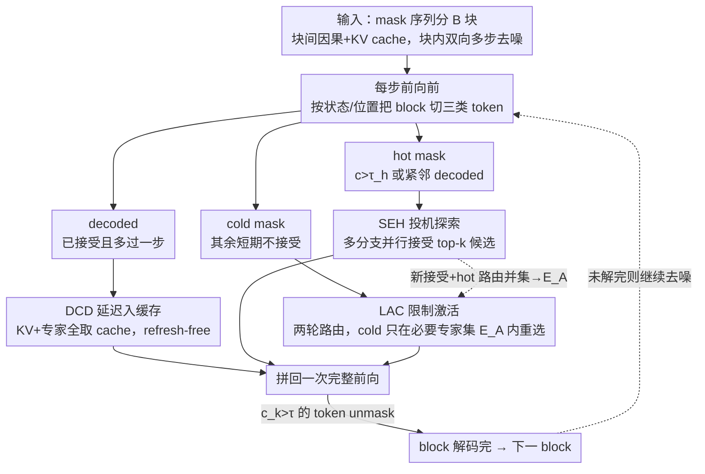

# TEAM: Temporal-Spatial Consistency Guided Expert Activation for MoE Diffusion Language Model Acceleration

**会议**: ICML2026  
**arXiv**: [2602.08404](https://arxiv.org/abs/2602.08404)  
**代码**: https://github.com/PKU-SEC-Lab/TEAM-MoE-dLLM  
**领域**: LLM效率 / 扩散语言模型 / MoE  
**关键词**: 扩散语言模型, MoE, 专家激活, 时空一致性, 推理加速

## 一句话总结
TEAM 针对 MoE 扩散语言模型（dLLM）"激活了大量专家却只接受少量 token"的固有错配，利用 block 内解码的时间一致性与空间一致性，为已解码 / 热 / 冷三类 token 设计差异化的专家激活与解码策略，在 SDAR 30B-A3B 上以近乎零精度损失换得最高 2.2× 加速。

## 研究背景与动机

**领域现状**：扩散语言模型（dLLM）用双向注意力把整段回复一次性"去噪"出来，天然支持并行解码；近期 SDAR、LLaDA 2.0 等工作以自回归模型做 AR initialization，再把 FFN 换成 Mixture-of-Experts，使得 dLLM 在效率和精度上同时逼近主流 AR LLM，被视为继承 AR 先验、又突破 AR 串行瓶颈的下一代范式。

**现有痛点**：把 MoE 直接嫁接到 dLLM 上推理效率会"反向劣化"。在一个 block 的每次去噪迭代里，所有 token（包括已经被接受的）都在双向注意力下并行前向，每个 token 独立路由自己的 top-$k$ 专家；但最后只有少数置信度超阈值 $\tau$ 的 token 会被真正 unmask。结果是"激活的专家数远大于每步被接受的 token 数"——SDAR 每 token 路由 8 个专家，实际单步激活专家数与接受 token 数之比却远高于 8，MoE 的稀疏激活优势被吃掉，等效退化成 dense 模型。

**核心矛盾**：dLLM 的 block 并行 + MoE 的稀疏激活之间存在结构错配。block 内并行意味着算力很可能跑不到 GPU 的 compute–bandwidth 平衡点，整个解码 memory-bound；可此时每多激活一个专家就多一次 expert 参数搬运，激活专家越多越慢。所以"少激活专家 + 多接受 token"才是真正的优化方向，但 vanilla 路由完全没利用 dLLM block 内的结构。

**本文目标**：在不重训 MoE dLLM 的前提下，让每次前向**激活更少专家**的同时**接受更多 token**，把推理 latency 打下去。问题分解成三类 token：(a) 已经被接受的 decoded tokens 仍参与前向；(b) 即将被接受的 hot tokens；(c) 短期不会被接受的 cold tokens。

**切入角度**：作者在 SDAR 30B-A3B 的实测中发现 block-wise 解码具有两层一致性。**时间一致性**：已接受 token 的隐状态在下一次前向后即趋于稳定（与 dKV-Cache 的发现一致），但 vanilla 仍每步触发它们的专家激活。**空间一致性**：mask token 的路由高度集中——少数专家承担几乎所有 mask token 的解码；而且接受顺序近似自回归，新接受的 token 在空间上聚集在已解码 token 附近。这两点合起来意味着不同位置的 token 完全可以用差异化策略处理。

**核心 idea**：把"已解码 / 热 / 冷"三类 token 拆开各自治理——decoded 走 KV cache 不再激活专家，hot 主动做 speculative exploration 一步多接受，cold 强制复用 hot/decoded 已激活的专家集合，既挤掉冗余激活，又把"省下的算力"花在更可能成功的位置上。

## 方法详解

### 整体框架
TEAM 要解决的是"MoE 嫁接到扩散语言模型后激活的专家数远多于被接受的 token 数"这个错配。它的做法是在每一步前向之前，按 token 当前的状态和位置把整个 block 拆成三拨人区别对待，再拼回一次完整前向——不改一行权重、不需重训。具体地，输入是被划分成 $B$ 块、每块 $L$ 个 token 的 mask 序列，block 间走因果注意力 + KV cache，block 内走双向注意力多步去噪，每步把置信度 $c_k > \tau$ 的 token unmask。每次前向前，TEAM 把 block 内 token 分成三类：已经 unmask 且至少又过了一次前向的 **decoded**、即将被接受的 **hot mask**（满足 $c_k > \tau_h$ 或距任一 decoded 位置 $< L_h$，即 $y_i^{k\text{-}hot}=\{y_i^k \mid (c_k > \tau_h)\ \text{or}\ (\forall j,\ |k-j|<L_h)\}$）、以及短期不会被接受的其余 **cold mask**。三类分别交给 DCD、SEH、LAC 三条路径处理，处理后拼回一次完整前向，循环直到该 block 解码完再进入下一 block。

### 关键设计

**1. DCD — 已解码 token 延迟入缓存：把"重算 decoded"这笔最大的激活浪费砍掉**

激活数膨胀的头号元凶，是那些早已被接受的 decoded token 在 vanilla 下仍每步陪着重算一遍前向——它们路由出的专家集合和 mask token 几乎不相交，等于白白多激活一大批专家。DCD 的处理是让 decoded token 在被接受、再多前向一次之后就彻底退出后续计算，其 KV pair 和专家激活全部从 cache 取。这里"延迟一步"不是随手定的：作者实测发现 hidden state 要在 accept 之后的下一步才真正稳定，提前缓存会缓存到还在漂移的表征。更关键的是，dLLM 进入 block-diffusion 范式后（block 间因果、block 内双向 + 原生 KV cache），block 内并行规模本就不大、远到不了 compute-bound，叠加 AR 初始化带来的近自回归接受顺序，使得这份缓存**完全不需要周期性 refresh** 就能保持精度——这正是和 dKV-Cache 必须 global refresh 的根本区别，Table 3 里 Refresh-free 比 Refresh-4/8 又快又准坐实了这一点。

**2. SEH — 热 token 投机探索：把省下的算力反向投资到最可能成功的位置**

DCD 省下了带宽，但 MoE 推理本就 memory-bound、算力闲着，单纯省下来并不划算。SEH 针对那些"下一步大概率被接受"的 hot token——判据就是整体框架里 $c_k > \tau_h$ 或紧邻 decoded（公式 4），即置信度已贴近门槛或空间上挨着已解码区——主动接受它们的 top-$k$ 置信候选，构造多条解码分支在同一次前向里并行验证，从而把每步接受的 token 数顶上去。妙处在于多分支之间 token 高度相似，几乎不会新增激活专家：在 dense 模型上多分支会立刻把每条分支顶成 compute-bound、非多卡不可，但 MoE 的算力天然摊在多个专家上，单卡下"加分支不加专家"近乎免费，正好把闲置算力对应的 arithmetic intensity 榨满。这步把 DCD 腾出的预算投到"提升接受率"上，是 TEAM 把 TPF（accepted tokens per forward）拉到 1.5–1.7× 的主力。

**3. LAC — 冷 token 限制激活：不取消、只复用必要专家集合**

cold token 短期不会被接受，为它们单独路由、单独激活专家纯属浪费；但又不能直接跳过，否则它们晚些真被接受时拿不到正确表征。LAC 的解法是"限制而非取消激活"，用两轮路由实现：第一轮对新接受 token $D_a$ 和 hot token $H$ 做常规 top-$k$ 路由得到权重 $W_1$，把它们并起来形成必要专家集合 $E_A = \text{top-}k(W_1)$；第二轮让 cold token $C$ 只能在 $E_A$ 内重选，$W_2 = Router(C, E_A)$，最终路由权重 $W = Concat(W_1, W_2)$。这之所以几乎无害，靠的是空间一致性这个先验——mask token 的路由本就高度集中在少数专家上，强制 cold token 复用这批专家既不改变它们大概率会落到的去向，又彻底掐掉了"cold token 独有的专家激活"。

### 损失函数 / 训练策略
TEAM 完全免训练，无任何梯度更新；仅引入三个推理期超参——hot 置信度阈值 $\tau_h$、hot 空间距离 $L_h$、以及 speculative 分支的 top-$k$。论文取 $\tau_h \in [0.4, 0.8]$、$L_h \in [2,6]$（敏感性实验在 Table 2）。

## 实验关键数据

### 主实验
backbone 用 SDAR 30B-A3B（每 token 8 个专家），评估 HumanEval / MBPP / GSM8K / Math-500 四个 0-shot benchmark。指标除任务 score 外还报告 **APF**（每次前向激活的专家数）、**TPF**（每次前向接受的 token 数）、**APT = APF / TPF**（每个解码 token 平均激活专家数）。

| Benchmark | 方法 | Score | APF↓ | TPF↑ | APT↓ | Speedup |
|---|---|---|---|---|---|---|
| HumanEval | Vanilla | 79.27 | 53.34 | 2.91 | 18.33 | 1× |
| HumanEval | TEAM | 79.88 (+0.61) | 34.48 (-35%) | 5.07 (1.74×) | 6.80 (-63%) | **2.20×** |
| MBPP | Vanilla | 65.76 | 49.59 | 2.74 | 18.10 | 1× |
| MBPP | TEAM | 65.76 (+0.00) | 30.92 (-38%) | 4.56 (1.66×) | 6.78 (-63%) | **2.08×** |
| GSM8K | Vanilla | 90.60 | 59.11 | 3.16 | 18.71 | 1× |
| GSM8K | TEAM | 90.30 (-0.30) | 36.20 (-39%) | 4.79 (1.52×) | 7.56 (-60%) | **1.83×** |
| Math-500 | Vanilla | 76.00 | 57.90 | 3.74 | 15.48 | 1× |
| Math-500 | TEAM | 75.40 (-0.60) | 36.31 (-37%) | 5.57 (1.49×) | 6.52 (-58%) | **1.64×** |
| **Avg** | TEAM | 77.84 (-0.07) | 34.48 (-37%) | 5.00 (1.59×) | 6.92 (-61%) | **1.94×** |

精度平均仅掉 0.07，APT 砍掉 61%，端到端 1.94× 加速；HumanEval 上甚至涨了 0.61 分。

### 消融实验
| 配置 | Avg Score | Avg APF | 说明 |
|---|---|---|---|
| Full TEAM (DCD+SEH+LAC) | 77.84 | 34.48 | 完整模型，1.94× |
| Refresh-free DCD only | ≈ Vanilla | ↓ 至 ~26.5 (HumanEval) | 仅 DCD 单独 1.58× (HumanEval)，1.32–1.55× 跨任务 |
| Refresh-8 DCD | -1.22 (HumanEval) | 29.61 | 周期性 refresh 反而精度更低 |
| Refresh-4 DCD | -0 / -1.20 | 32.67 | refresh 太频繁，加速从 1.58× 退到 1.38× |
| hot 超参 $(\tau_h, L_h)$ 扫描 | 70.05 → 73.68 | 21.33 → 23.35 | $\tau_h=0.6, L_h=4$ 是最佳折中 |

### 关键发现
- **DCD 单独就能拿 1.3–1.6× 加速**，且 Refresh-free 反而比 Refresh-4/8 又快又准，说明 block-diffusion + AR-init 已经让"延迟缓存且永不刷新"成为安全策略，这是与 dKV-Cache 最关键的差异。
- **hot 超参对精度敏感、对 APF 不敏感**：把 $\tau_h$ 从 0.4 升到 0.8 时 APF 仅从 23.35 降到 21.33，但精度先升后降；说明 SEH 的收益主要来自"是否触发投机"，分支多少对激活成本几乎免费——正好坐实"MoE 多分支几乎不增激活专家"的论断。
- **加速幅度与任务长度成反比**：HumanEval/MBPP（短代码生成）加速最高 2.2×，GSM8K/Math-500（长推理链）退到 1.6–1.8×；长输出 block 多、每 block 内的接受率天然更高，TEAM 的相对收益被稀释。

## 亮点与洞察
- **"MoE × dLLM 反而效率劣化"是一个被忽视的真问题**：作者第一次把 APF/TPF/APT 这套度量摆到台前，揭示稀疏激活在 block 并行下会被吃掉，提供了清晰的 motivation 图（Fig 1）。这种"反直觉劣化分析"本身就是高价值贡献。
- **三类 token 差异化处理的范式**很值得迁移。把"位置 / 状态"作为路由调度变量，而不是单纯依赖 router 学出来的权重，这一思路可以延伸到任何"同一前向里 token 重要性不均"的场景，例如 long-context AR 推理、视觉 MoE、speculative decoding 的多分支调度。
- **"省下的激活预算反向投资到投机分支"**是 SEH 的精髓。多数加速工作只做减法（cache / 剪枝），TEAM 用减法（DCD/LAC）腾出 memory bandwidth，再用加法（SEH）把它转成 TPF——这种"先省后投"的耦合设计值得在其他 memory-bound 推理优化里复用。
- **LAC 的两轮路由几乎是免费午餐**：利用 mask token 路由集中性，把 cold token 强行塞进必要专家集，精度几乎不动；本质上是把空间一致性当先验显式写进算法。

## 局限与展望
- 仅在 SDAR 30B-A3B 一个 backbone 上验证，是否在 LLaDA 2.0、未来 100B+ MoE dLLM 上同样保持 ~2× 还需更多实证；超参 $\tau_h, L_h$ 对不同模型可能要重新搜索。
- 加速主要落在 HumanEval/MBPP 等短生成任务，长推理（Math-500）只剩 1.64×，且 GSM8K/Math 还有 0.3–0.6 分掉点——说明"hot/cold 划分"在推理链很长时不够精细，可考虑结合 token 难度估计或 router 学习信号。
- DCD 完全免 refresh 的论断依赖 block-diffusion 的 AR 初始化先验；如果未来 dLLM 采用更"非自回归"的训练方式（如全 global 注意力 + 无 KV cache），延迟缓存的安全边界可能要重新评估。
- speculative exploration 的多分支验证在 batched serving 下会与其他请求争抢专家容量，云端高并发场景下的收益可能远不如 single-stream，这部分论文未触及。

## 相关工作与启发
- **vs dKV-Cache (Ma et al., 2025a)**：dKV-Cache 面向 global bidirectional dLLM，必须周期 global refresh 来抵消 KV drift；TEAM 在 block-diffusion + AR-init 设置下证明 refresh 完全可省，且首次把"decoded token cache"和"MoE 专家激活"联立分析，揭示在 MoE 下 caching 的收益主要来自抑制专家激活而非省 attention。
- **vs dInfer (Ma et al., 2025b)**：dInfer 关注 cloud-scale MoE dLLM 的 expert-parallel 部署；TEAM 反过来面向 single-GPU / 低延迟场景，关注的是"如何让单次前向里少激活几个专家"。两者互补：dInfer 优化吞吐，TEAM 优化 latency。
- **vs speculative decoding (Chen 2023 / Leviathan 2023)**：传统 AR speculative 需要 draft model；SEH 把投机搬到 dLLM block 内，不需要额外模型，靠 MoE 算力可分散性把投机变成"几乎免费"。这是 dLLM-MoE 协同的独特优势。
- **vs MoE 路由稀疏化 (Chen 2025 / Song 2025)**：那些方法靠学习/剪枝去掉冗余专家；LAC 不动 router，只在推理期约束激活集合，零训练成本，更适合作为部署侧补丁。

## 评分
- 新颖性: ⭐⭐⭐⭐ 首次系统刻画 MoE dLLM 的激活失配，并以"三类 token 差异化策略"组合解决；单项设计（cache / 投机 / 路由约束）非首创但拼装巧妙。
- 实验充分度: ⭐⭐⭐⭐ 4 个 benchmark + APF/TPF/APT 三套量化指标 + DCD/SEH/LAC 单项消融与超参敏感性都有；缺多 backbone 与 batch 维度评估。
- 写作质量: ⭐⭐⭐⭐ motivation 图清晰（Fig 1/2），方法分三类讲述层次分明；公式与算法块给得克制。
- 价值: ⭐⭐⭐⭐ 直接给出 ~2× 加速且 plug-and-play，对 MoE dLLM 部署有立竿见影的工程意义。

<!-- RELATED:START -->

## 相关论文

- [\[ACL 2026\] Alloc-MoE: Budget-Aware Expert Activation Allocation for Efficient Mixture-of-Experts Inference](../../ACL2026/llm_efficiency/alloc-moe_budget-aware_expert_activation_allocation_for_efficient_mixture-of-exp.md)
- [\[ICML 2026\] OServe: Accelerating LLM Serving via Spatial-Temporal Workload Orchestration](oserve_accelerating_llm_serving_via_spatial-temporal_workload_orchestration.md)
- [\[ICML 2026\] dLLM-Cache: Accelerating Diffusion Large Language Models with Adaptive Caching](dllm-cache_accelerating_diffusion_large_language_models_with_adaptive_caching.md)
- [\[ICLR 2026\] Expert Divergence Learning for MoE-based Language Models](../../ICLR2026/llm_efficiency/expert_divergence_learning_for_moe-based_language_models.md)
- [\[ACL 2026\] CreditDecoding: Accelerating Parallel Decoding in Diffusion Large Language Models with Trace Credit](../../ACL2026/llm_efficiency/creditdecoding_accelerating_parallel_decoding_in_diffusion_large_language_models.md)

<!-- RELATED:END -->
