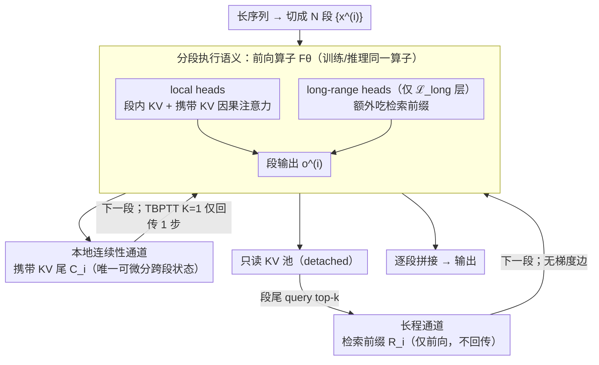

# Training-Inference Consistent Segmented Execution for Long-Context LLMs

**会议**: ICML 2026  
**arXiv**: [2605.11744](https://arxiv.org/abs/2605.11744)  
**代码**: 论文中提到「Our code is available at: link」，未给出明确仓库地址  
**领域**: LLM 效率 / 长上下文建模  
**关键词**: 长上下文、分段执行、训练-推理一致、TBPTT、KV 缓存

## 一句话总结
本文提出一套训练与推理共享完全相同的分段前向执行语义的长上下文 LLM 框架：跨段只保留固定长度的可微分 KV 尾部 + 一条仅前向的检索旁路，在 LLaMA2-7B 32K/80K 上以约 $6\times$ 更低的 prefill 峰值显存达到与全注意力可比甚至更好的 LongBench/RULER 表现。

## 研究背景与动机
**领域现状**：Transformer 长上下文生成受制于全注意力的 $O(T^2)$ 计算与显存开销，工业界普遍在推理阶段引入受限执行——窗口/sink 注意力（StreamingLLM）、稀疏 prefill（MInference）、压缩 KV（ChunkKV）、按 head 分流（DuoAttention）等。FlashAttention/vLLM 这类语义保持的系统级优化只能压常数因子，到 128K 这种长度依旧顶不住。

**现有痛点**：绝大多数方法只在推理时强加限制，训练仍用完整注意力。结果模型在训练时"看得到"的依赖在推理时根本访问不到，行为对不上，长上下文上稳定性和泛化都掉。即便像 Longformer/CCA 这类做了训练-推理对齐的方法，也往往依赖固定稀疏 pattern 或上下文压缩，没有显式把"分段递归"作为统一假设。

**核心矛盾**：训练用全局梯度、推理用局部状态——只要训练时梯度能穿过推理时根本不存在的依赖路径，就会出现"训练目标 ≠ 推理目标"。Transformer-XL 这类带 memory 的方案虽然引入段间状态，但持久 memory 的更新动力学并不天然等价于推理时的执行语义。

**本文目标**：把"分段执行"从推理 trick 升格为训练与推理共享的建模假设。要求 (i) 跨段状态接口固定且差分可控；(ii) 训练目标恰好等于推理时执行展开的目标；(iii) 仍能捕获超出段内的长程依赖。

**切入角度**：观察到 (a) 长程注意力只集中在少数 head（DuoAttention 等机制研究结论），(b) 注意力层间存在结构冗余（少数层删除影响小）。因此可以让大多数 head/层走"本地 + 携带 KV 尾"，只在少数 head/层上挂一条"前向-only 检索"通路。

**核心 idea**：把跨段差分接口压成单一固定大小的 KV 尾 $C_i$，加一条不参与梯度的检索前缀 $R_i$；训练用 TBPTT 只往前回传 $K$ 步，并证明这恰好是与推理一致目标的精确梯度，而不是近似。

## 方法详解

### 整体框架
这套框架的核心主张是：训练和推理必须跑在**完全相同的前向算子**上，否则模型在训练时学到的依赖在推理时根本访问不到。具体做法是把序列切成 $N$ 段 $\{x^{(i)}\}_{i=1}^N$（每段长度 $S$），无论训练还是推理都按 $(C_i, o^{(i)}) = F_\theta(x^{(i)}, C_{i-1}, R_{i-1})$ 逐段处理。跨段只靠两条窄通路传递信息：$C_{i-1}$ 是从上一段携带过来的固定长度 KV 尾（唯一带梯度的差分状态），$R_{i-1}$ 是从只读历史 KV 池里 top-$k$ 检索出的长度 $R$ 前缀（仅前向、不进梯度图）。解码器内部按 head 分两组——local heads 始终只看段内 + 携带 KV，long-range heads 仅在选定的少数层 $\mathcal{L}_{\text{long}}$ 里额外吃检索前缀，其余层退化为纯段内因果注意力；RoPE 则通过给前缀重排位置 $\{0,\dots,P-1\}$、当前段整体右移 $P$ 来保证拼接后的位置一致。

### 关键设计

**1. 训练-推理一致的分段执行语义 + TBPTT 精确梯度：堵死"训练可见、推理不可见"的依赖路径**

以前的方法几乎都只在推理时强加分段限制，训练仍用全注意力，于是训练时梯度能穿过的依赖路径在推理时根本不存在，行为对不上。本文用同一个前向算子同时定义训练与推理，并在训练时用 stop-gradient 把跨段梯度截断到最近 $K$ 段以内：定义截断状态链 $\tilde{C}_{b_i}^{(K)} = \mathrm{sg}(C_{b_i})$、$\tilde{C}_j^{(K)} = \Phi_\theta(x^{(j)}, \tilde{C}_{j-1}^{(K)}, R_{j-1})$，把训练目标定为 $L_K(\theta) = \sum_i \ell_i(\theta; \tilde{C}_{i-1}^{(K)}, R_{i-1})$。这里前向图本身不变，截断只缩短梯度路径的"长度"。关键的理论保证是 Theorem 3.3：TBPTT 在这张截断图上反传得到的恰好是 $\nabla_\theta L_K(\theta)$ 的**精确值而非近似**，Corollary 3.4 进一步给出训练-推理对齐的形式化保证。正因为唯一的差分跨段状态被压成了固定大小的 KV 尾，消融里 $K=1$ 反而最优——这和经典 RNN"深 TBPTT 更好"的经验相反：更深回传只会引入梯度方差，却带不来任何新信息。

**2. 本地连续性通道：固定长度 KV 尾接口 $\{C_i\}$，把跨段差分接口收成定大小定语义**

要让推理和训练在同一张图上跑，跨段状态的接口必须先固定下来——这正是 $\{C_i\}$ 承担的角色，它是唯一携带梯度的跨段状态，负责"近期上下文"的连续性。每层对 local head 集合 $\mathcal{H}_{\text{local}}$ 缓存最近 $M$ 个 key/value 作为 $C_i$ 暴露给下一段，下一段处理时 local heads 对"携带 KV + 段内 KV"做因果注意力，序列长度上界因此被钉死在 $S+M$。把接口收成定大小、定语义，既避免了 Transformer-XL 那种"训练时一路回传到很久以前"的训-推不一致，也省掉了 RMT 那种额外的 persistent memory token 训练负担。

**3. 长程通道：head/层稀疏的仅前向检索前缀 $\{R_i\}$，在不加梯度边的前提下补长程证据**

光有固定 KV 尾会丢掉超出尾部视野的长程依赖，所以还需要一条专门补长程证据、却又不污染梯度图的通路。本文维护一个 detached 的只读 KV 池，仅对默认 4 层的 $\mathcal{L}_{\text{long}}$ 中的 long-range head 集合 $\mathcal{H}_{\text{long}}$ 存入历史；每段开始前用段尾 query 做 top-$k$ 取出 $R$ 个 KV 拼成前缀，这些 KV 既不再更新也不反传梯度，Lemma B.1 形式化保证了检索通路不会引入任何额外的跨段 credit assignment 路径。head 与 layer 的双重稀疏把每个 token 的有效上下文压到 $S + \alpha M + \beta(1-\alpha) R$（$\alpha$、$\beta$ 分别是 local-head、long-range-layer 的比例），从而把活跃显存控制成常数；而"只让少数 head 承担检索"也正好契合机制可解释性里"少数 head 做长程检索"的观察。

### 损失函数 / 训练策略
训练目标就是标准 next-token NLL，但作用在截断状态链定义的 $L_K(\theta)$ 上；实际实现取 $K=1$，即只让梯度穿过"从段 $i-1$ 产生 $C_{i-1}$ 的那一次更新"。优化在 LLaMA2-7B 32K/80K 上做 fine-tuning，使执行语义对齐分段框架；做公平比较的对齐基线（CCA）用同样的 fine-tuning 配置，其它推理-only 基线则沿用各自的 pretrained 权重。

## 实验关键数据

### 主实验

| 数据集 / 指标 | 本文 | Vanilla 全注意力 | StreamingLLM | DuoAttention | MInference | CCA |
|---|---|---|---|---|---|---|
| LongBench-E 32K Avg | **23.24** | 23.13 | 21.90 | 23.00 | 23.08 | 21.12 |
| LongBench-E 80K Avg | **24.17** | 23.38 | 21.56 | 22.94 | 23.35 | 21.98 |
| 32K Prefill 显存 (GB) | **18.56** | 23.61 | 22.19 | 18.15 | 22.19 | 28.08 |
| 80K Prefill 显存 (GB) | **19.06** | 34.67 | 31.77 | 23.66 | 31.77 | 43.64 |
| 80K TTFT (s) | **3.49** | 4.13 | 3.07 | 3.79 | 4.13 | 3.88 |

在 RULER 长度泛化测试中（CWE/FWE，4K→64K），本文在 4K-32K 训练范围内 Avg* 取得 CWE 46.39 / FWE 43.88，显著高于所有基线；外推到训练长度之外的 64K 时，所有现有方法都坍塌到 0，而本文仍保留 CWE 2.00 / FWE 34.17。

### 消融实验

| 配置 | LongBench-E Avg | 说明 |
|---|---|---|
| Aligned (TBPTT $K=1$) | **24.17** | 完整方法，训练-推理对齐 |
| Misaligned | 11.91 | 训练用全注意力、推理用分段；落差超过 12 分 |
| Aligned (TBPTT $K=2$) | 25.41 (avg≈) / 部分 cat 略降 | 加深 TBPTT 没有显著增益，部分类别反而轻微退化 |

### 关键发现
- 训练-推理是否对齐是性能差距最大的开关：Misaligned 配置直接掉到 11.91，说明仅在推理时强加分段会让模型完全无法发挥；这从经验上回答了"为什么以前的 inference-only 方法在严格分段下不稳"
- TBPTT 深度并非越深越好：$K=1$ 最优、$K=2$ 持平甚至小退，反映出"唯一差分跨段状态"假设下，更深回传徒增梯度方差，验证了 Section 3 的理论
- 显存随长度近似常数：128K prefill 报告约 $6\times$ 低于 FlashAttention 全注意力，关键来自 head/layer 稀疏让活跃 KV 不随 $T$ 增长

## 亮点与洞察
- "把分段当成建模假设而非推理优化"是个朴素却没人做透的视角：之前要么搞 persistent memory（Transformer-XL/RMT），要么训推不同。本文证明只要把跨段差分接口收成单一 KV 尾，TBPTT 给出的不再是近似而是精确梯度——这一步把工程小 trick 提升成有理论保证的训练目标
- 把"差分通路"和"长程通路"完全解耦：前者承担状态连续性，后者承担长程检索且不进梯度图。这种"梯度=本地、长程=只读"的分流哲学很优雅，未来可以迁移到 SSM、Mamba 与 retrieval-augmented LLM 的训练对齐设计
- $K=1$ 最优的反直觉结论暗示：在精心设计的差分接口下，"长 BPTT"不是优势而是噪声源；这对所有 segment-level recurrent Transformer 都是有用的实操指南

## 局限与展望
- 检索池采用无淘汰策略，长序列下 pool 内存按 $T$ 线性增长（虽被 $\beta(1-\alpha)$ 稀疏因子压低）；真正落到极端长上下文仍需 eviction 或量化
- 长程 head 与层集合用了 prior-based 固定选择 $\mathcal{L}_{\text{long}} = \{6,8,11,18\}$，依赖前期机制研究的经验先验，不够"自适应"——能否在线学到 head 分组是开放问题
- 评测主要在 LLaMA2 32K/80K + LongBench/RULER 上做，LongBench v2 + LLaMA 3.1 结果仅放在附录；对最新长上下文 benchmark（如 RULER-128K、∞Bench、LV-Eval）覆盖较少
- 文章未与 GLA、Mamba、RWKV 这种 native recurrent baseline 做长程性能对比，理论上前者也有"训练-推理一致"的天然属性

## 相关工作与启发
- **vs Transformer-XL**：都用"段间携带 + TBPTT"；TXL 把这当效率技巧，本文升格为有理论保证的对齐目标，并显式把长程检索与状态递归分离，避免持久 memory 的训-推不一致
- **vs StreamingLLM / MInference**：它们只在推理时改注意力 pattern，训练侧不变；本文证明这种 mismatch 是性能上限——Misaligned 配置直接掉 12 分
- **vs CCA / Sliding-Window Training**：都尝试训-推对齐，但对齐方式是"匹配 attention pattern"；本文对齐的是"前向算子整体"，更彻底，并提供 TBPTT 精确梯度结论
- **vs DuoAttention**：都用 head 分流；本文进一步加上 layer 稀疏 + 训练侧的对齐目标，把"少数 head 做长程"从经验观察变成可训练的架构

## 评分
- 新颖性: ⭐⭐⭐⭐ 把推理 trick 升格为带 TBPTT 精确梯度保证的训练目标，是该方向少见的"理论-工程闭环"
- 实验充分度: ⭐⭐⭐⭐ 覆盖 PPL、LongBench-E、RULER 长度泛化 + 多 backbone；但 128K 大规模评测放在附录略可惜
- 写作质量: ⭐⭐⭐⭐ 定义/定理结构清晰，图 2/3 直观传达"差分通路 vs 仅前向通路"
- 价值: ⭐⭐⭐⭐ 提供一套即插即用的长上下文训练-推理对齐方案，对工业部署很有参考价值

<!-- RELATED:START -->

## 相关论文

- [\[ICML 2026\] Optimal Bayesian Stopping for Efficient Inference of Consistent LLM Answers](optimal_bayesian_stopping_for_efficient_inference_of_consistent_llm_answers.md)
- [\[ACL 2025\] LADM: Long-context Training Data Selection with Attention-based Dependency Measurement for LLMs](../../ACL2025/llm_efficiency/ladm_long_context_data.md)
- [\[ICML 2026\] OBCache: Optimal Brain KV Cache Pruning for Efficient Long-Context LLM Inference](obcache_optimal_brain_kv_cache_pruning_for_efficient_long-context_llm_inference.md)
- [\[ACL 2026\] StructKV: Preserving the Structural Skeleton for Scalable Long-Context Inference](../../ACL2026/llm_efficiency/structkv_preserving_the_structural_skeleton_for_scalable_long-context_inference.md)
- [\[ICML 2025\] Long-Short Alignment for Effective Long-Context Modeling in LLMs](../../ICML2025/llm_efficiency/long-short_alignment_for_effective_long-context_modeling_in_llms.md)

<!-- RELATED:END -->
