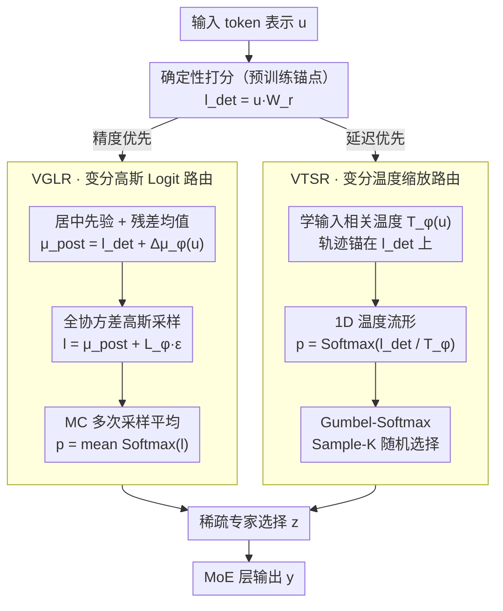

# Variational Routing: 校准 MoE Transformer 的可扩展贝叶斯框架

**会议**: ICML 2026  
**arXiv**: [2603.09453](https://arxiv.org/abs/2603.09453)  
**代码**: 待确认  
**领域**: 模型压缩 / LLM 效率 / AI 安全  
**关键词**: 混合专家网络, 贝叶斯推断, 校准, 不确定性量化, 稀疏路由

## 一句话总结
提出变分路由框架 VMoER——通过对 MoE 层的路由决策进行变分推断而非权重推断，实现高效贝叶斯不确定性建模，在保持 <1% FLOPs 额外开销的同时将校准误差降低 94%、路由稳定性提升 38%。

## 研究背景与动机

**领域现状**：基础模型规模达到万亿参数，通过 MoE 稀疏专家路由实现高效扩展。然而当前路由机制采用确定性 Top-K 策略，在输入扰动下容易出现错误专家选择。

**现有痛点**：（1）确定性路由对输入噪声敏感，出现脆性失败；（2）预测高度过置信，校准误差大；（3）现有贝叶斯方法针对权重不确定性，计算开销大，不适用于万亿参数规模。

**核心矛盾**：在确保模型可靠部署的前提下，如何以最小计算成本为 MoE 模型注入不确定性感知能力。

**本文目标**：设计轻量级贝叶斯框架，直接对路由决策（而非权重）进行概率建模。

**切入角度**：将 MoE 路由重新表述为潜变量模型，观察到——（1）确定性路由隐含忽视了 logits→概率→选择的不确定性链条；（2）Top-K 操作本质上是多标签问题。

**核心 idea**：从权重空间转向决策空间进行变分推断——通过 amortised 推断直接对路由 logits 或温度参数进行概率建模，绕过高维权重后验的复杂性。

## 方法详解

### 整体框架
VMoER 把"给 MoE 注入不确定性"这件事从权重空间挪到了决策空间：不再对万亿参数的权重后验做近似，而是只对每个 token 进入 MoE 层时的**路由决策**做变分推断。所有路径都共享同一个起点——确定性路由先算出打分 $\mathbf{l}_{det}=\mathbf{u}\mathbf{W}_r$，变分推断只在这个预训练锚点上叠一层不确定性。在此之上它给出两条互补路径——一条在 logit 空间对路由打分 $\mathbf{l}$ 套一个变分高斯分布 $q_\phi(\mathbf{l}|\mathbf{u})$，显式建模专家之间的相关性；另一条在选择空间只学一个输入相关的温度 $T_\phi(\mathbf{u})$，靠它动态调节 softmax 锐度并用 Sample-K 替代 Top-K 做随机化选择。前者校准最好但要多次采样，后者几乎零额外开销，两条路径覆盖了"精度优先"和"延迟优先"两种部署诉求。

### 关键设计

**1. 变分高斯 Logit 路由（VGLR）：给路由打分套一个带相关性的高斯后验**

确定性 Top-K 的脆性根源在于它把 logits→概率→选择这条链当成了无噪声的，输入稍有扰动专家选择就翻车。VGLR 直接对路由 logits 做 amortised 变分推断：先验取居中高斯 $p(\mathbf{l}|\mathbf{u})=\mathcal{N}(\mathbf{l}_{det}, \mathbf{I})$，其中 $\mathbf{l}_{det}=\mathbf{u}\mathbf{W}_r$ 就是原本的确定性打分；后验均值写成残差形式 $\boldsymbol{\mu}_{post}(\mathbf{u})=\mathbf{l}_{det}+\Delta\boldsymbol{\mu}_\phi(\mathbf{u})$，推断网络只学一个校正项 $\Delta\boldsymbol{\mu}_\phi(\mathbf{u})$ 而非从零重学路由。协方差用 Cholesky 因子化 $\boldsymbol{\Sigma}_{post}=\mathbf{LL}^\top$ 参数化，复杂度 $O(N^2)$，因为专家数 $N\le 64$ 所以完全可接受；推断时对 $q_\phi$ 做 MC 采样再平均。它之所以比权重空间方法（MCDropout/SWAG）有效，是因为后者得把参数噪声经线性投影间接传到决策上、绕了一大圈，而 VGLR 直接在决策变量上建模；同时**全协方差**突破了 mean-field 的对角假设，能捕捉"选了专家 A 就倾向避开专家 B"这类专家间相关性——消融里全协方差正是把 ECE 从 0.252 压到 0.015 的关键。

**2. 变分温度缩放路由（VTSR）：把变分族压到一维温度流形上**

VGLR 校准虽好，但多次采样会拖慢推理延迟。VTSR 干脆把整个变分族约束到一条 1D 流形上——所有后验都沿着"确定性 logits 除以输入相关温度"这条轨迹移动：$q_\phi(\mathbf{p}|\mathbf{u})=\text{Softmax}(\mathbf{l}_{det}/T_\phi(\mathbf{u}))$，唯一要学的就是标量温度网络 $T_\phi(\mathbf{u})$，温度高则分布更平、专家选择更保守，温度低则更锐。采样用 Gumbel-Softmax 做 Sample-K，KL 正则项在这条流形上恰好退化成 Shannon 熵，形式干净。代价是只在标度参数空间动，计算开销仅 $O(D_H)$、不到 0.67% FLOPs，单次前向就能给出校准好的选择，无需像 VGLR 那样反复采样——这正是它牺牲一点精度换来的零额外采样成本。

**3. 居中先验与残差学习：让微调不丢预训练路由**

VGLR 与 VTSR 能稳住，靠的是同一个共享前提：变分解不从零学，而是锚在确定性打分 $\mathbf{l}_{det}$ 上。VGLR 把高斯先验居中在确定性解 $p(\mathbf{l}|\mathbf{u})=\mathcal{N}(\mathbf{l}_{det},\mathbf{I})$、后验只学一个加在原 logits 上的残差均值 $\Delta\boldsymbol{\mu}_\phi(\mathbf{u})$，于是 KL 项天然退化成"残差对零"的距离、以零残差为中心做 regularization；VTSR 则把整条变分轨迹约束在过 $\mathbf{l}_{det}$ 的 1D 温度流形上（温度 $T\to0$ 时直接退回确定性 Top-K）。微调阶段路由本来很容易陷入 selection drift、把预训练学到的专家分工搅乱，而这个"锚在确定性解上"的设计等于给优化一个稳定支点：不确定性是在已经很好的确定性路由上叠的一层修正，而不是推倒重来。

### 训练策略
**VGLR** 直接最大化 ELBO：$\mathcal{L}_{ELBO}=\mathbb{E}_{q_\phi(\mathbf{l}|\mathbf{u})}[\log p(\mathbf{y}|\mathbf{l},\mathbf{u})]-\beta D_{KL}(q_\phi(\mathbf{l}|\mathbf{u})\|\mathcal{N}(\mathbf{0},\mathbf{I}))$，第一项管重构、第二项把后验拉回居中先验，$\beta$ 调两者权衡。**VTSR** 以重构为主，再加一个代理损失 $\mathcal{L}_{reg}=-\log T_\phi(\mathbf{u})$ 隐式把温度推向先验。

## 实验关键数据

### 主实验

| 数据集 | 模型 | 指标 | MAP 基线 | VGLR-MF | VGLR-FC | VTSR |
|--------|------|------|--------|---------|---------|------|
| OpenBookQA | Granite-3B | ECE ↓ | 0.252 | 0.026 | **0.015** | 0.052 |
| OpenBookQA | Qwen-2.7B | ECE ↓ | 0.127 | 0.028 | **0.014** | 0.022 |
| OpenBookQA | DeepSeek-16B | ECE ↓ | 0.168 | 0.067 | **0.054** | 0.060 |

### 消融

| 实验项 | Granite ECE | Qwen ECE | 发现 |
|--------|------------|----------|------|
| 确定性 Top-K | 0.252 | 0.127 | 基线过置信 |
| 固定温度缩放 | 0.107 | 0.102 | 跨模型不稳定（精度掉 3%） |
| VGLR-FC 全协方差 | 0.015 | 0.014 | 校准误差降 94% |
| 噪声鲁棒性（σ=0.01） | Jaccard=0.532 | Jaccard>0.612 | VGLR 稳定性提升 38% |
| OoD 检测 AUROC | 0.659（基线） | 0.749（VGLR） | 内部 logit 方差信号优于 gating 熵 |

### 关键发现
- 全协方差关键——显式建模相关性使校准显著改善。
- VTSR 在准确率稳定性上优于全局固定温度。
- 内部推理不确定性为 OoD 检测提供比预测熵更强的信号。

## 亮点与洞察
- **概率生成模型视角**：将 MoE 路由形式化为潜变量模型，将启发式负载均衡和辅助损失解释为隐含贝叶斯先验。
- **从权重空间转向决策空间**：直接对路由 logits 或温度参数推断既捕捉必要不确定性又规避维数灾难。
- **双路径灵活设计**：VGLR 最佳校准但推断延迟略高；VTSR 牺牲一点精度换取单过推理零额外采样成本。
- **可迁移构件**：居中先验+残差学习、温度缩放 1D 流形简化可推广。

## 局限与展望
- VTSR 训练不稳定——温度参数易陷入 collapse，需精心初始化。
- 评估仅限 MCQA next-token 预测任务，未涵盖长序列生成中的错误累积。
- 未评估更大规模——最大 DeepSeek-16B。
- 改进：稳定 VTSR 的变分目标；扩展到序列级不确定性；与权重空间贝叶斯方法混合。

## 相关工作与启发
- **vs 权重空间方法（MCDropout/SWAG）**：后者对整个参数空间建模 2.6% FLOPs；本文仅对路由决策建模 <1%。
- **vs 启发式稳定化**：现有方法（固定温度、负载均衡正则化）缺乏概率解释；本文学习输入相关的不确定性。
- **vs 输出空间不确定性（语义熵）**：后者事后式聚合输出分布；本文直接从内部路由决策提取 epistemic 不确定性。

## 评分
- 新颖性: ⭐⭐⭐⭐⭐  首次系统将变分推断应用于 MoE 路由决策而非权重。
- 实验充分度: ⭐⭐⭐⭐  3 SOTA 架构 + 多维评估；仅 MCQA 任务最大 16B。
- 写作质量: ⭐⭐⭐⭐⭐  理论清晰、概率生成过程推导严谨。
- 价值: ⭐⭐⭐⭐⭐  为万亿参数基础模型可靠部署指出高效路径。

<!-- RELATED:START -->

## 相关论文

- [\[ICML 2026\] DOT-MoE: 用可微 optimal transport 把 dense LLM 转成 MoE](dot-moe_differentiable_optimal_transport_for_moefication.md)
- [\[ICML 2026\] ProbMoE: Differentiable Probabilistic Routing for Mixture-of-Experts](probmoe_differentiable_probabilistic_routing_for_mixture-of-experts.md)
- [\[CVPR 2025\] Associative Transformer](../../CVPR2025/llm_efficiency/associative_transformer.md)
- [\[ICML 2026\] Skill-Based Mixture-of-Experts: Adaptive Routing for Heterogeneous Reasoning via Inferred Skills](skill-based_mixture-of-experts_adaptive_routing_for_heterogeneous_reasoning_via_.md)
- [\[ACL 2026\] CoMeT: Collaborative Memory Transformer for Efficient Long Context Modeling](../../ACL2026/llm_efficiency/comet_collaborative_memory_transformer_for_efficient_long_context_modeling.md)

<!-- RELATED:END -->
