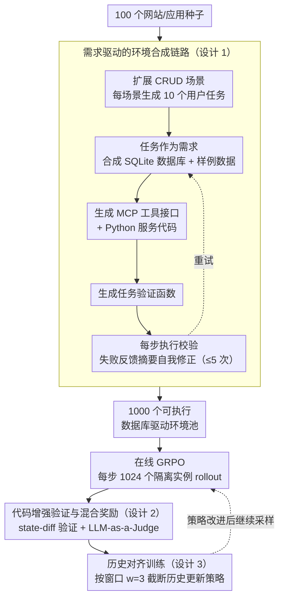

# Agent World Model: Infinity Synthetic Environments for Agentic Reinforcement Learning

**会议**: ICML2026  
**arXiv**: [2602.10090](https://arxiv.org/abs/2602.10090)  
**代码**: https://github.com/Snowflake-Labs/agent-world-model  
**领域**: LLM Agent / 强化学习  
**关键词**: Agent 环境合成, 工具调用, MCP, 强化学习, 可执行世界模型  

## 一句话总结
本文提出 Agent World Model，一条从场景、任务、数据库、MCP 工具接口到验证器的全合成流水线，生成 1000 个可执行数据库驱动环境，并用它们训练工具调用 Agent，在 BFCLv3、$\tau^2$-bench 和 MCP-Universe 上取得更强的域外泛化。

## 研究背景与动机

**领域现状**：LLM Agent 已经能进行多轮工具调用、网页操作和复杂任务规划，但训练这些 Agent 的瓶颈越来越从“模型不会调用工具”转向“缺少足够多、可重置、可并行、可验证的交互环境”。现有 benchmark 往往规模小，真实 API 难以稳定复现，而 LLM 模拟环境虽然容易生成，却会产生幻觉式状态转移。

**现有痛点**：Agentic RL 需要成千上万次交互，环境必须支持并发实例、可靠重置、状态一致和自动奖励。真实服务通常不开放训练所需 API，也不能承受大规模试错；人工环境如 $\tau^2$-bench 或 TheMCPCompany 只有少量场景；LLM 模拟器每一步都要调用模型，既贵又容易在状态更新上自相矛盾。

**核心矛盾**：工具调用 Agent 需要真实可执行的环境来学习长期交互，但真实世界环境无法规模化，纯 LLM 模拟又不够可靠。训练数据合成已经很多，真正缺的是“环境本身”的合成。

**本文目标**：作者希望构建一套开放的环境合成 pipeline，能从少量场景种子自动生成大量有数据库状态、有工具接口、有任务验证器的可执行环境，并证明这些环境可以直接用于大规模在线 RL。

**切入角度**：论文把 Agent 环境看成软件系统，而不是把它交给 LLM 逐步模拟。一个可执行应用通常由需求、数据库、接口、后端代码和测试/验证组成；如果逐步合成这些组件，就能得到状态转移由代码和 SQL 约束决定的“程序化世界模型”。

**核心 idea**：用软件工程式流水线合成数据库驱动的 MCP 环境，把世界模型从神经预测器改造成可执行代码沙盒，再在这些沙盒中进行大规模 agentic RL。

## 方法详解

### 整体框架

Agent World Model 将每个环境形式化为一个 POMDP。数据库定义状态空间 $\mathcal{S}_{E_i}$，MCP 工具接口定义动作空间 $\mathcal{A}_{E_i}$、观察空间 $\mathcal{O}_{E_i}$ 和转移函数 $T_{E_i}$，每个用户任务 $\tau$ 对应一个奖励函数 $R_\tau$。Agent 只能通过统一的 MCP 工具交互，不能直接修改数据库。

流水线从 100 个热门网站/应用种子出发，先扩展出适合 CRUD 操作的场景，再为每个场景生成 10 个用户任务。任务不是附属产物，而是后续数据库 schema、样例数据、工具接口和验证器的功能需求。之后，LLM 依次合成 SQLite 数据库、样例数据、接口规范、Python MCP 服务代码和任务验证函数。每一步都执行生成结果；如果代码或 SQL 失败，就把错误摘要反馈给 LLM 自我修正，最多重试 5 次。

生成好的环境被用于在线 GRPO 训练。训练时每一步启动 1024 个隔离环境实例，每个实例都有独立 SQLite 数据库副本，rollout 后通过“代码验证信号 + LLM-as-a-Judge”给出 Completed、Partially Completed、Agent Error 或 Environment Error，并映射为奖励。

### 关键设计

**1. 需求驱动的环境合成链路：用软件工程顺序对齐各组件**

如果直接让 LLM 一次性写出整个环境，schema、工具接口和任务三者很容易对不上——工具很多但任务用不到、任务提到的实体数据库里却没有。本文把环境当软件系统来造：先从种子里筛出有状态、适合 CRUD 操作的场景，每个场景先生成 10 个具体用户任务，再让这些任务充当功能需求，反向约束后续组件该长什么样——数据库需要哪些表、接口需要哪些端点、样例数据要满足哪些前置条件。于是按“任务 → SQLite 数据库 + 样例数据 → MCP 工具接口 → Python 服务代码 → 任务验证器”的顺序逐件合成，每一步都用需求把组件对齐，状态转移完全由代码和 SQL 约束决定，而不是交给 LLM 逐步想象。

**2. 代码增强验证与混合奖励：给合成环境一个可靠的 RL 奖励信号**

合成环境的验证器不可能零 bug：纯代码验证太脆，遇到自动生成代码的边界瑕疵就误判；纯 LLM 判断又缺少状态 grounding，容易凭轨迹臆断。本文让两者互补——每个任务配一个验证函数，比较任务执行前后的数据库状态，抽出 changed records、预期结果和诊断信号；最终判定再交给 LLM-as-a-Judge，结合这些结构化验证信号和 Agent 轨迹给出结论。奖励据此映射：Completed 得 1.0、Partially Completed 得 0.1、其他为 0，格式错误直接提前终止并给 -1。这样既保持全自动，又用数据库 diff 把 Judge 拉回到真实状态上，明显降低奖励噪声。

**3. 面向工具调用 RL 的历史对齐训练：消除训练与推理的历史分布错配**

多轮 Agent 轨迹很长，推理部署时通常用滑动窗口只保留最近若干轮历史；但训练若每步都看完整轨迹，模型会学到部署时根本拿不到的信息，造成分布错配。本文在 GRPO 优化时也按同样的窗口 $w=3$ 拆分轨迹，让每个动作 $a_t$ 的损失只条件于截断历史 $h_t^{trunc}$，而不是把整条长轨迹一次性前向。把历史管理这件“推理小技巧”纳入训练目标后，策略看到的信息分布和部署时一致，稳定性和域外泛化都更好。

### 损失函数 / 训练策略

训练采用 GRPO。对每个任务采样一组 rollout，按组内奖励计算 advantage $A^{(k)}=(R^{(k)}-\bar{R})/\sigma_R$，再优化截断历史下每一步动作的对数概率。实现上选择 Qwen3 thinking 4B、8B、14B 作为 Agent，训练子集包含 526 个 AWM 环境和 3315 个任务，最多 96 个优化步，学习率 $7\times10^{-7}$，batch size 64，每个任务 16 条 rollout，因此每步共 1024 个并行环境实例。

为了统一不同环境，Agent 只看到两个元工具：`list_tools` 用于列出当前 MCP 环境的工具，`call_tool` 用于按名称和 JSON 参数调用具体工具。训练时加入格式校验：必须先调用一次 `list_tools`，工具名和参数必须合法，推理消息需要符合 Qwen3 的工具调用格式。格式错误会立即终止，避免无效轨迹浪费环境步。

## 实验关键数据

### 主实验

| Benchmark | 模型 | Base | Simulator | EnvScaler | AWM | 主要结论 |
|-----------|------|------|-----------|-----------|-----|----------|
| BFCLv3 Overall | Qwen3-4B | 54.92 | 55.52 | 54.06 | 64.50 | AWM 大幅提升函数调用综合能力 |
| BFCLv3 Overall | Qwen3-8B | 53.83 | 52.53 | 36.83 | 65.94 | 8B 上相对 Base 提升 12.11 点 |
| BFCLv3 Overall | Qwen3-14B | 61.25 | 67.68 | - | 70.18 | 大模型上仍超过 LLM 模拟训练 |
| $\tau^2$-bench Pass@1 | Qwen3-8B | 26.44 | 31.30 | 39.39 | 33.45 | AWM 不针对对话任务，仍超过 Base 和 Simulator |
| MCP-Universe Overall | Qwen3-14B | 8.38 | 10.62 | - | 12.29 | 在真实 MCP 服务器类任务上泛化最好 |

### 消融实验

| 分析项 | 设置 | 关键指标 | 说明 |
|------|------|---------|------|
| 合成规模 | 1000 环境、10000 任务 | 平均 35.1 个工具、1984.7 行环境代码、18.5 张数据库表 | 环境复杂度远高于玩具任务，适合多轮工具训练 |
| 合成流水线成功率 | GPT-5 生成 | 数据库 88.3%、样例数据 88.2%、环境代码 86.8%；平均修正 1.13 次 | 执行反馈能修复大多数浅层生成错误 |
| 复杂度分桶 | BFCLv3 / $\tau^2$ 8B | BFCLv3 简单任务 Base 53.6 → AWM 80.3；中等 60.0 → 75.3；困难 43.9 → 45.0 | AWM 对简单和中等多工具任务收益最大，困难任务仍受模型基础能力限制 |
| 验证策略 | LLM-only / Code-only / Augmented | 8B 上 BFCLv3: 55.46 / 60.00 / 65.94；$\tau^2$ P@1: 26.44 / 29.59 / 33.45 | 代码增强 Judge 同时优于纯 LLM 和纯代码验证 |
| 历史对齐 | 4B w/ HL vs w/o HL | Aligned 下 BFCLv3 64.50 vs 55.35，$\tau^2$ P@1 22.57 vs 15.92 | 训练阶段使用同样的历史截断显著更好 |

### 关键发现
- AWM 在 BFCLv3 上提升最稳定，说明代码驱动、多工具、多状态的合成环境确实能迁移到函数调用 benchmark。
- 在 $\tau^2$-bench 上，AWM 不如 EnvScaler 的 8B Pass@1，但它同时在 BFCLv3 和 MCP-Universe 上不退化；作者认为 EnvScaler 依赖现有任务集，可能更贴近 $\tau^2$ 的分布。
- MCP-Universe 的总体分数仍低，说明真实 MCP 任务很难；但 AWM 在金融、Location 和 Browser 等子类上带来可见提升，证明它没有只学会合成环境内部的格式。
- 环境质量分析显示 AWM 的 Task Feasibility、Data Alignment 和 Toolset Completeness 均高于 EnvScaler，但仍有不少自动生成代码 bug。关键不是零 bug，而是 blocked tasks 比例明显更低，RL 不会被大量不可执行任务污染。

## 亮点与洞察
- 论文最有价值的地方是把“世界模型”落到了可执行软件环境，而不是让神经网络或 LLM 逐步想象状态转移。对工具 Agent 来说，数据库和后端代码本来就是世界动力学，这个建模角度非常自然。
- 需求驱动合成很重要。先有任务再有 schema 和工具，能避免很多合成环境常见问题：工具很多但任务用不上、任务提到实体但数据库不存在、接口返回与验证器不一致。
- 代码增强 Judge 是务实折中。合成环境的验证器不可能完美，尤其自动生成代码会有边界 bug；让 LLM 参考数据库 diff 和轨迹做最终判断，比单独依赖某一方更适合 RL 奖励。
- 历史对齐训练提醒了一个容易被忽视的问题：Agent 框架里的上下文管理不是推理小技巧，而会改变策略看到的信息分布，应该进入训练闭环。

## 局限与展望
- AWM 主要覆盖 CRUD 型、数据库驱动的应用，不适合强 UI 依赖、实时数据、复杂视觉交互或需要真实外部服务状态的任务。
- 合成环境仍有代码 bug，100 个 sampled environments 中存在 bug 的比例不低。虽然 blocked task 比 EnvScaler 少，但长期 RL 仍可能学到由环境瑕疵造成的偏差。
- 训练成本和生成成本较高。论文使用 GPT-5 生成流水线与 Judge，虽然评估了 Claude 和 Qwen3.5 生成器，但开放模型完全替代闭源强模型还需要更多验证。
- 任务验证依赖 LLM-as-a-Judge，奖励仍可能受到 Judge 偏差影响。后续可以探索更可证明的 state-diff specification、自动测试生成，以及 human audit 的小样本校准。
- AWM 环境与真实网页/企业系统仍有语义差距。未来可把真实 API 文档、开源应用后端或合成 UI 结合起来，形成从数据库工具到可视化操作的多模态 Agent 训练环境。

## 相关工作与启发
- **vs LLM 模拟环境**: LLM simulator 每一步都生成状态转移，容易幻觉且昂贵；AWM 用 Python 代码和 SQLite 执行转移，更稳定也更适合大规模 RL。
- **vs EnvScaler**: EnvScaler 也生成编程环境，但依赖已有任务集且规模为 191 个环境；AWM 从场景名出发合成 1000 个环境、35062 个工具，并有 SQL-backed state consistency。
- **vs $\tau^2$-bench / TheMCPCompany**: 这些 benchmark 更像评测环境，数量有限且多依赖人工设计；AWM 目标是训练环境池，强调并行实例、自动重置和可扩展生成。
- **vs ToolLLM / Gorilla 等工具学习数据**: 这些方法主要合成 API 文档、调用轨迹或监督数据；AWM 合成的是能让 Agent 试错并获得奖励的完整环境。
- **vs 传统 model-based RL 世界模型**: 传统世界模型学习环境动力学；AWM 不学习神经动力学，而是自动生成程序化动力学，牺牲部分真实感换来可控性和可扩展性。

## 评分
- 新颖性: ⭐⭐⭐⭐☆ 环境合成方向已有并行工作，但把任务、SQL、MCP、验证器和 agentic RL 串成开放流水线很完整。
- 实验充分度: ⭐⭐⭐⭐⭐ 包含三大 OOD benchmark、三种模型规模、合成质量、复杂度、验证策略、历史截断和规模曲线，证据非常足。
- 写作质量: ⭐⭐⭐⭐☆ 方法结构清晰，工程细节充足；缺点是部分核心质量问题分散在附录，读者需要来回拼接。
- 价值: ⭐⭐⭐⭐⭐ 对 Agent RL 训练基础设施很有价值，尤其适合需要大量可重置工具环境的研究和开源复现。

<!-- RELATED:START -->

## 相关论文

- [\[ICML 2026\] Beyond Trajectory-Level Attribution: Graph-Based Credit Assignment for Agentic Reinforcement Learning](beyond_trajectory-level_attribution_graph-based_credit_assignment_for_agentic_re.md)
- [\[ICML 2026\] HiPER: Hierarchical Reinforcement Learning with Explicit Credit Assignment for Large Language Model Agents](hiper_hierarchical_reinforcement_learning_with_explicit_credit_assignment_for_la.md)
- [\[ICML 2026\] Multi$^2$: Hierarchical Multi-Agent Decision-Making with LLM-Based Agents in Interactive Environments](multi2_hierarchical_multi-agent_decision-making_with_llm-based_agents_in_interac.md)
- [\[ICML 2026\] On Effectiveness and Efficiency of Agentic Tool-calling and RL Training](on_effectiveness_and_efficiency_of_agentic_tool-calling_and_rl_training.md)
- [\[ACL 2026\] Multi-Task Reinforcement Learning for Enhanced Multimodal LLM-as-a-Judge](../../ACL2026/llm_evaluation/multi-task_reinforcement_learning_for_enhanced_multimodal_llm-as-a-judge.md)

<!-- RELATED:END -->
