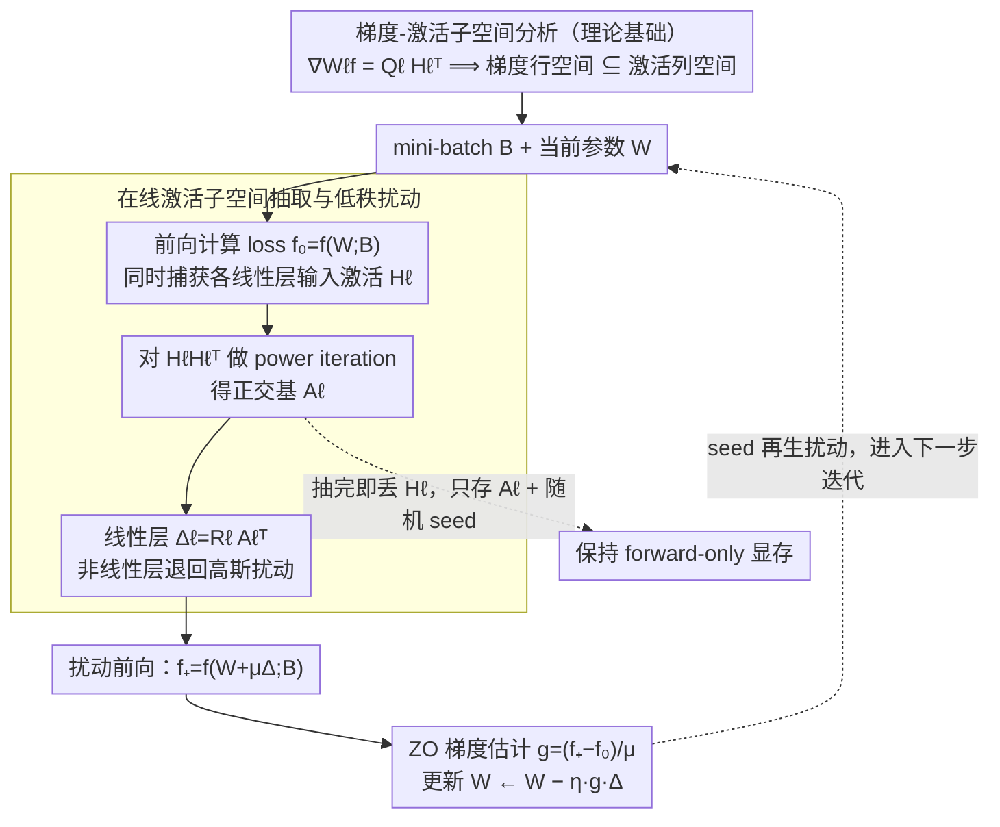

# AGZO: Activation-Guided Zeroth-Order Optimization for LLM Fine-Tuning

**会议**: ICML2026  
**arXiv**: [2601.17261](https://arxiv.org/abs/2601.17261)  
**代码**: 无  
**领域**: LLM效率 / 零阶优化  
**关键词**: 零阶微调, 激活子空间, 低秩扰动, 内存高效训练, LLM 优化  

## 一句话总结
AGZO 发现线性层梯度行空间受前向激活子空间约束，并据此在零阶微调中只沿激活引导的低秩方向扰动参数，从而在几乎保持 MeZO 级别显存占用的同时提升梯度对齐和下游任务性能。

## 研究背景与动机

**领域现状**：LLM 下游适配通常依赖反向传播微调，但反传需要保存前向激活，长序列和大 batch 下显存会迅速成为瓶颈。零阶优化提供了另一条路线：只通过前向函数值差分估计更新方向，不保存反传激活，因此显存接近推理，适合资源受限设备或消费级 GPU。

**现有痛点**：代表性方法 MeZO 用全参数空间的随机高斯扰动估计梯度，LOZO 虽然引入低秩扰动，但低秩因子仍是数据无关随机采样。这类方法把模型当黑盒处理，忽略了前向过程中已经产生的大量结构信息，导致很多 query budget 花在与真实梯度几乎无关的方向上。

**核心矛盾**：ZO 微调想省掉反向传播的显存，但如果完全随机扰动，高维参数空间里的单次差分方向极难对齐真实梯度。问题不是能不能做低秩，而是低秩子空间是否和当前 batch 的真实梯度结构相关。

**本文目标**：作者希望利用前向激活构造更有信息量的零阶扰动方向，让 ZO 方法在不显著增加显存的前提下更接近一阶梯度更新。

**切入角度**：论文从线性层梯度公式出发：对权重 $W_\ell$，真实梯度可写为上游梯度矩阵和输入激活矩阵的乘积 $\nabla_{W_\ell} f = Q_\ell H_\ell^\top$。这说明梯度的行空间包含在激活张成的子空间内，激活不是无关中间量，而是决定梯度方向的几何约束。

**核心 idea**：在每次前向时即时抽取激活矩阵的主方向，并把零阶扰动限制在这个激活引导的低秩子空间中，用“有方向感的随机扰动”替代全空间盲采样。

## 方法详解

### 整体框架

AGZO 面向全参数零阶微调。与 MeZO 一样，它先计算当前参数 $W$ 上的 loss $f_0=f(W;B)$，再对参数做一个小扰动 $W+\mu\Delta$，计算扰动后的 loss $f_+=f(W+\mu\Delta;B)$，最后用 $(f_+-f_0)/\mu$ 乘以扰动方向作为更新估计。区别在于扰动 $\Delta$ 的构造方式。

对每个线性层，AGZO 在正常前向过程中捕获当前 mini-batch 的输入激活矩阵 $H_\ell$。它用轻量 power iteration 近似 $H_\ell H_\ell^\top$ 的前 $r$ 个主方向，得到正交基 $A_\ell\in\mathbb{R}^{d_{in}\times r}$。随后只在该子空间中采样扰动：对线性层令 $\Delta_\ell=R_\ell A_\ell^\top$，其中 $R_\ell$ 是高斯随机左因子；对非线性参数则回退到普通高斯扰动。主实验中作者设 $r=1$，尽量把单次 ZO 采样集中到最强激活方向。

AGZO 不保存完整激活用于反传。子空间抽取在激活可用时立即完成，提取出小矩阵 $A_\ell$ 后释放 $H_\ell$；扰动仍然通过随机 seed 再生。因此它比 MeZO 只多存每层 $d_{in}\times r$ 的 basis，远小于权重矩阵 $d_{out}\times d_{in}$。

### 关键设计

**1. 梯度-激活子空间分析：为什么前向激活能指导零阶扰动**

线性层权重梯度满足 $\nabla_{W_\ell} f(W;B)=Q_\ell H_\ell^\top$，其中 $H_\ell$ 是该层的输入激活、$Q_\ell$ 是上游信号。这意味着梯度矩阵是 $H_\ell$ 各列的线性组合，梯度的行空间被严格约束在激活张成的子空间内。作者在 GPT-2/SST-2 上把真实梯度正交投影到激活主子空间来验证：rank 取到 10 左右，投影前后梯度的余弦相似度就接近 1；梯度和激活的奇异值谱也都快速衰减。换句话说，真实梯度的能量几乎全部落在激活的少数主方向上。这条结论直接否定了 MeZO/LOZO 的黑盒假设——既然前向过程已经暴露了梯度方向的几何约束，零阶扰动就不该在全参数空间里盲目随机采样，而应顺着激活主方向走。这是后面两个设计的全部出发点。

**2. 在线激活子空间抽取与低秩扰动：把扰动钉在激活主子空间**

基于上面的结论，AGZO 在每次正常前向时即时捕获各线性层的输入激活矩阵 $H_\ell$，并用轻量 power iteration 近似 $H_\ell H_\ell^\top$ 的前 $r$ 个主方向：采样测试矩阵 $\Omega$、算 $Y=H_\ell\Omega$，再反复做 QR 正交化与 $H_\ell(H_\ell^\top Q)$ 迭代，得到正交基 $A_\ell\in\mathbb{R}^{d_{in}\times r}$。扰动随即写成 $\Delta_\ell=R_\ell A_\ell^\top$（$R_\ell$ 为高斯随机左因子），其行空间被钉在激活主子空间里；对没有这种激活结构的非线性参数，则退回普通高斯扰动以保持通用性。之所以用 power iteration 而非直接 SVD，是因为 SVD 成本高、还会额外占显存，而 power iteration 只需几次矩阵乘——论文中 $K=3$ 步的方向对齐就已接近 exact SVD。主实验固定 $r=1$，把单次零阶采样尽量压到最强的那一个激活方向上。

**3. 保持 forward-only 显存轮廓：在不反传的前提下用掉激活信息**

AGZO 的价值前提是不能破坏零阶优化“显存接近推理”的核心优势，因此它绝不为了更准的方向去保存反传激活。激活子空间抽取在 $H_\ell$ 可用时立即完成，提取出小矩阵 $A_\ell$ 后马上释放 $H_\ell$；扰动本身不显式存储，只记随机 seed，更新时再生。于是相比 MeZO，AGZO 每层只多存一个 $d_{in}\times r$ 的 basis（$r=1$ 时极小），远小于权重矩阵 $d_{out}\times d_{in}$。更新阶段同样靠 seed 复现扰动：先恢复 $W_\ell-\mu\Delta_\ell$，再执行 $W_\ell\leftarrow W_\ell-\eta g\Delta_\ell$。正是这套“即用即丢 + seed 再生”让 AGZO 的显存曲线与 MeZO/LOZO 基本重合，把前向中短暂出现的激活结构压缩成了极小的子空间描述。

### 损失函数 / 训练策略

理论上，AGZO 可视为在激活子空间内优化 subspace-smoothed objective。作者证明其估计量的期望等于该平滑目标梯度投影到 $A_\ell A_\ell^\top$ 后的结果，并且当真实梯度行空间由 $A_\ell$ 支撑时，偏差随 $\mu$ 线性消失。进一步，在 noiseless setting 中，AGZO 与真实梯度的期望余弦相似度包含项 $\|GA\|_F/\|G\|_F$，代表子空间捕获的梯度能量；只要上游梯度能量不反常地集中在激活小奇异值方向，AGZO 的期望对齐严格优于 MeZO。

实验中所有 ZO 方法训练 20000 steps，Qwen3 模型使用扰动尺度 $\mu=10^{-7}$，Pangu-1B 使用 BF16，因此使用 $\mu=10^{-4}$ 抵抗数值噪声。AGZO、MeZO、LOZO 使用相同代码框架、数据处理和评估流程；一阶 FO baseline 在显存允许时训练 1000 steps。

## 实验关键数据

### 主实验

| 模型 / 任务 | FO | AGZO | MeZO | LOZO | Zero | ICL | 结论 |
|------------|----|------|------|------|------|-----|------|
| Qwen3-0.6B SST-2 | 0.904 | 0.877 | 0.858 | 0.870 | 0.540 | 0.510 | AGZO 最接近 FO |
| Qwen3-0.6B CB | 0.946 | 0.892 | 0.803 | 0.760 | 0.410 | 0.570 | 对低资源 NLI 提升明显 |
| Qwen3-0.6B RTE | 0.808 | 0.772 | 0.732 | 0.743 | 0.599 | 0.722 | 优于两种 ZO baseline |
| Qwen3-4B SST-2 | OOM | 0.892 | 0.875 | 0.866 | 0.649 | 0.887 | FO 不可行时 AGZO 保持可训 |
| Qwen3-4B SQuAD | OOM | 0.876 | 0.870 | 0.869 | 0.583 | 0.555 | QA 上小幅但稳定领先 |
| Pangu-1B BoolQ | 0.751 | 0.730 | 0.699 | 0.696 | 0.695 | 0.735 | BF16/边缘模型上仍有效 |

### 消融实验

| 分析项 | 设置 | 关键指标 | 说明 |
|------|------|---------|------|
| 梯度对齐 | Qwen3-0.6B / SST-2 | AGZO 在训练过程中持续高于 MeZO | 实证支持理论中的方向对齐优势 |
| 跨平台验证 | Pangu-1B GPU 训练、NPU 评估 | NPU Avg: AGZO 0.709，MeZO 0.703，LOZO 0.667，Zero 0.593，ICL 0.636 | 激活引导 ZO 可迁移到 Ascend NPU 评估环境 |
| LoRA 对比 | Qwen3-0.6B | AGZO 在 SST-2/CB/BoolQ 强于 LoRA，COPA 持平，MultiRC 弱于 LoRA | AGZO 是 forward-only 替代，不是 PEFT 的完全替代 |
| 吞吐 | Qwen3-0.6B steps/s | AGZO 与 MeZO/LOZO 同一量级，但 power iteration 带来额外计算 | 以中等速度损失换更好方向质量 |
| rank 消融 | Qwen3-0.6B / SST-2 | rank 1: 0.877，rank 4: 0.870，rank 16: 0.863 | 单 query 场景下更高 rank 会稀释瞬时扰动质量 |

### 关键发现
- AGZO 在多数任务上是 ZO 方法中最强，尤其 Qwen3-0.6B 的 CB 从 MeZO 0.803 提升到 0.892，说明激活子空间对小数据推理任务帮助明显。
- 在 Qwen3-4B 上，FO 因显存限制不可运行，而 AGZO 仍能训练并普遍超过 MeZO/LOZO，体现了 forward-only 微调的实用价值。
- 显存曲线显示 AGZO 与 MeZO/LOZO 基本重合，远低于 FO；Pangu-1B 上 FO 在长上下文和大 batch 下 OOM，而 AGZO 可跑到 2048 长度、batch 64。
- exact SVD 与 power iteration 诊断显示 $K=3$ 的 cosine similarity 0.0123，接近 exact SVD 的 0.0124，明显高于 MeZO 0.0015 和 LOZO 0.0014。

## 亮点与洞察
- 论文的关键洞察很干净：零阶优化不等于完全黑盒。即使不用反传，前向激活仍然透露了梯度行空间，这个结构可以被低成本利用。
- AGZO 对 LOZO 的区别很重要。二者都低秩，但 LOZO 的低秩方向是数据无关随机方向，AGZO 的低秩方向来自当前 batch 激活，因此“低秩”不是收益来源的全部，激活对齐才是核心。
- rank 1 反而最好这个结果很有意思。它说明单次有限差分的瓶颈不是子空间覆盖越大越好，而是在有限 query 下要让随机方向尽量集中到高能方向。
- 这类方法和 LoRA 并不是替代关系。LoRA 用反传训练少量 adapter，AGZO 用 forward-only 更新原模型参数；未来完全可以研究 activation-guided ZO 训练 adapter 或选择性层更新。

## 局限与展望
- AGZO 的主要收益建立在线性层梯度受激活子空间约束的结构上；对非线性参数仍回退到普通高斯扰动，尚未充分利用这些参数的结构信息。
- 虽然显存接近 MeZO，但 power iteration 和 QR 会增加计算开销。吞吐表明它仍在可用范围内，但对极端低算力设备可能需要更轻量的近似。
- 主实验 rank 固定为 1，说明当前策略适合单 query；但不同层、不同任务可能需要自适应 rank 或多方向估计，论文还没有系统探索。
- 实验模型最大扩展到 Qwen3-8B 的附加结果，距离几十B或更大规模 LLM 仍有距离。超大模型上激活谱、数值扰动尺度和通信开销可能改变结论。
- ZO 方法训练 20000 steps 才取得结果，优化效率仍不如一阶方法。未来可以结合更好的差分估计、控制变量、PEFT 和混合 FO/ZO 训练。

## 相关工作与启发
- **vs MeZO**: MeZO 通过全空间高斯扰动实现极低显存，但方向盲目；AGZO 保留 forward-only 形式，同时用激活主子空间提升扰动质量。
- **vs LOZO**: LOZO 使用随机低秩扰动，利用了梯度低秩先验；AGZO 进一步让低秩方向与当前 batch 的激活对齐，因此对真实梯度的余弦相似度更高。
- **vs 一阶微调 FO**: FO 通常效果最好，但反传激活显存成本高，Qwen3-4B 在实验硬件上直接 OOM；AGZO 牺牲部分性能换取可运行性。
- **vs LoRA**: LoRA 降低可训练参数并保留反传，AGZO 省掉反传并更新原参数。二者解决的是不同内存瓶颈，未来可以组合。
- **vs 低维微调理论**: 论文延续了 fine-tuning 低维内在结构的观察，但把低维子空间从静态随机子空间改成每个 batch 动态提取的激活子空间。

## 评分
- 新颖性: ⭐⭐⭐⭐☆ 从激活-梯度几何关系改造 ZO 扰动方向，思路简洁且比随机低秩更有结构。
- 实验充分度: ⭐⭐⭐⭐☆ 覆盖 Qwen3、Pangu、GPU/NPU、显存、吞吐、LoRA、rank 和 power iteration 消融；更大规模模型验证仍偏少。
- 写作质量: ⭐⭐⭐⭐☆ 理论和算法解释清楚，公式链完整；实验表较多但主结论容易把握。
- 价值: ⭐⭐⭐⭐☆ 对显存受限 LLM 微调很实用，尤其适合探索 forward-only 全参数适配，但训练步数和计算开销仍需优化。

<!-- RELATED:START -->

## 相关论文

- [\[AAAI 2026\] Low-Rank Curvature for Zeroth-Order Optimization in LLM Fine-Tuning](../../AAAI2026/llm_evaluation/low-rank_curvature_for_zeroth-order_optimization_in_llm_fine-tuning.md)
- [\[ICML 2026\] Beyond Log Likelihood: Probability-Based Objectives for Supervised Fine-Tuning across the Model Capability Continuum](beyond_log_likelihood_probability-based_objectives_for_supervised_fine-tuning_ac.md)
- [\[ICML 2026\] Spherical Steering: Geometry-Aware Activation Rotation for Language Models](spherical_steering_geometry-aware_activation_rotation_for_language_models.md)
- [\[ICML 2026\] Whose Alignment? Comparing LLM Process Alignment Across Diverse Organizational Decision Contexts](whose_alignment_comparing_llm_process_alignment_across_diverse_organizational_de.md)
- [\[ICCV 2025\] On the Robustness Tradeoff in Fine-Tuning](../../ICCV2025/llm_evaluation/on_the_robustness_tradeoff_in_fine-tuning.md)

<!-- RELATED:END -->
