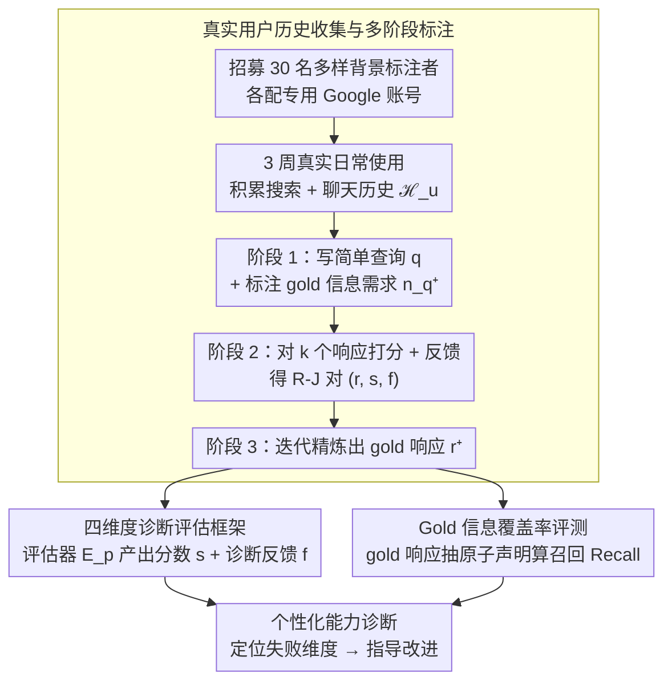

# BESPOKE: Benchmark for Search-Augmented Large Language Model Personalization via Diagnostic Feedback

**会议**: ICML2026  
**arXiv**: [2509.21106](https://arxiv.org/abs/2509.21106)  
**代码**: https://github.com/augustinLib/BESPOKE  
**领域**: LLM评估  
**关键词**: 个性化评估, 搜索增强LLM, 用户偏好, 诊断反馈, Benchmark  

## 一句话总结
提出 Bespoke 基准，通过 30 名标注者 3 周的真实聊天+搜索历史收集 2,870 个会话，构建包含细粒度偏好评分与诊断反馈的评测框架，系统评估搜索增强 LLM 的个性化能力，发现当前模型在所有配置下平均得分均不超过 60，个性化瓶颈在于历史推理而非生成。

## 研究背景与动机

**领域现状**：搜索增强 LLM（如 ChatGPT、Gemini）通过 RAG 整合检索信息来回答用户查询，显著降低了用户的认知负担。近期系统已开始利用用户的聊天和搜索历史来个性化响应。

**现有痛点**：尽管个性化能力持续增强，但对这些系统的系统性评估仍然严重不足。现有基准如 LaMP-QA 局限于 StackExchange 等特定领域的 QA 交互，无法覆盖真实的开放网页场景；RAG-QA Arena 和 Search Arena 仅提供二元偏好判断，缺乏对个性化质量的细粒度诊断。

**核心矛盾**：同一查询在不同用户背景下可能对应完全不同的信息需求和呈现偏好（如一个用户关注环保影响、偏好叙事解释，另一个关注性能指标、偏好简洁列表），但缺乏一个同时具备"真实用户历史"和"诊断性反馈"的评测基准来全面评估这种个性化能力。

**本文目标**：构建一个兼具 realistic（真实用户历史）和 diagnostic（细粒度偏好评分+反馈）的个性化搜索增强 LLM 评测基准。

**切入角度**：作者认为有效的个性化评估需要两个关键要素——真实的用户交互历史来表征偏好，以及对历史进行推理来推断信息需求。通过长期、深度参与的人工标注来同时满足这两个要素。

**核心 idea**：招募 30 名多样背景的标注者，用专用 Google 账号进行 3 周的真实日常搜索和聊天，收集完整用户历史后，让标注者自行编写查询并对模型响应提供四维度评分+诊断反馈，形成可训练个性化评估器的完整闭环。

## 方法详解

### 整体框架
Bespoke 想要解决的是"怎么真实又细粒度地评估搜索增强 LLM 的个性化能力"。对用户 $u$ 的查询 $q$，把用户历史定义为 $\mathcal{H}_u = \{\mathcal{S}_u, \mathcal{C}_u\}$（搜索历史 + 聊天历史），模型需要先从历史中推断信息需求 $n_q$，据此检索并生成个性化响应 $r$。整套基准沿三个阶段搭起来：先用真实账号收集长期用户历史，再让标注者分阶段写查询、打分、产出 gold 响应，最后把这些标注落成一个四维度 + 信息召回的诊断式评估框架。

### 关键设计

**1. 真实用户历史收集与多阶段标注：用长期日常使用换来有真实偏好的数据**

现有基准要么靠合成 persona，要么限定在 StackExchange 这类特定领域的 QA，反映不了真实用户行为的复杂度和多样性。Bespoke 改为招募 30 名不同背景的标注者（背景分布的 Shannon 均匀度达 0.91），每人配一个专用 Google 账号做 3 周真实日常搜索和聊天，最终攒下 2,870 个会话（2,153 搜索 + 717 聊天，人均 95.67 个）。拿到完整历史后，标注分三个阶段递进：(1) 标注者基于自己的历史写一个简单查询 $q$ 并标注其 gold 信息需求 $n_q^+$；(2) 对 $k$ 个采样响应按四维度逐一打分并写诊断反馈，形成 Response-Judgment（R-J）对；(3) 通过迭代精炼产出该查询的 gold 响应 $r^+$。因为查询、评分、gold 响应都出自同一个"真正拥有这段历史的人"，偏好信号才是真实而非外部猜测的。

**2. 四维度诊断评估框架：不只判好坏，还指出错在哪一维**

二元偏好判断（chosen/reject）只能说哪个响应更好，定位不了个性化具体失败在哪。Bespoke 把个性化质量拆成四个维度——Need Alignment（信息需求匹配度）、Content Depth（内容深度）、Tone（语调匹配）、Explanation Style（解释风格），让评估变成可诊断的。评估器 $\mathcal{E}_p$ 基于 GPT-5 的 few-shot 设置：先从该查询的 R-J 对集合 $\mathcal{D}_q$ 生成一份查询特定的 gold rubric $\mathcal{R}_q^+$，再结合示例和 gold 信息需求给新响应同时产出分数和反馈，即 $(s, f) = \mathcal{E}(\mathcal{D}_q, \mathcal{R}_q^+, n_q^+, q, \hat{r})$。这里的反馈 $f$ 不止用于评测，它指明了改进方向，可以直接当作后续个性化系统优化的监督信号，把"评测"延伸成"评测→诊断→改进"的闭环。

**3. Gold 信息覆盖率评测：用原子声明召回率精确衡量信息传达**

开放网页场景里响应常常冗余或夹带无关内容，整体打分难以反映"关键信息到底传没传到"。为此先用 GPT-5 从 gold 响应 $r^+$ 中提取原子声明，再人工筛掉不可验证的，留下 gold 信息集 $\mathcal{I}_q^+ = \{i_{q,1}^+, \dots, i_{q,n}^+\}$。评测时对模型响应 $\hat{r}$ 逐条判断每个原子声明是否被正确表达，算召回率 $\text{Recall}(\hat{r}) = |\mathcal{I}_{\hat{r}}| / |\mathcal{I}_q^+|$。把信息覆盖落到声明粒度，比整段比对更精确地刻画了响应是否真的把该说的都说到了。

## 实验关键数据

### 主实验：搜索增强 LLM 个性化评估

评估 6 个模型在不同用户上下文构建配置下的表现（最佳配置：query-aware + history selection + profile）：

| 模型 | Need Align. | Content Depth | Tone | Style | Recall | Avg. |
|------|------------|---------------|------|-------|--------|------|
| o3-search (最佳配置) | 59.07 | 63.73 | 85.20 | 73.87 | 30.53 | **62.48** |
| Gemini-2.5-Pro | 56.40 | 60.27 | 84.40 | 72.40 | 25.32 | 59.76 |
| Gemini-2.5-Flash | 55.73 | 61.03 | 82.83 | 71.73 | 28.09 | 59.88 |
| pplx-sonar | 55.80 | 59.90 | 85.13 | 72.37 | 25.50 | 59.74 |
| pplx-sonar-reasoning | 54.27 | 57.47 | 83.33 | 70.67 | 23.93 | 57.93 |
| GPT-4o-search | 53.80 | 57.20 | 84.83 | 69.93 | 19.23 | 57.00 |
| o3-search (无个性化) | 51.60 | 57.47 | 78.53 | 70.00 | 22.05 | 55.93 |

### 元评估：评估器与人类判断的一致性

| 评估器配置 | Pearson Corr. (Avg.) | Spearman Corr. (Avg.) | Feedback Acc. (Avg.) |
|-----------|---------------------|----------------------|---------------------|
| w/o Personalization | 0.470 | 0.477 | 0.360 |
| w/o Feedback | 0.809 | 0.814 | 0.801 |
| **w/ Feedback (Bespoke)** | **0.847** | **0.853** | **0.881** |

### 关键发现

- **用户上下文显著提升个性化**：所有模型在引入用户历史后各指标均有提升，但 Recall 始终最低（最高仅 30.53%），表明精确传达信息仍极具挑战
- **Query-aware profile > 静态 profile > raw 历史**：动态构建查询相关的用户画像比全量历史或固定画像更有效
- **瓶颈在推理而非生成**：Oracle 实验中直接提供 gold 信息需求后，o3-search 的 Need Alignment 飙升至 83.47、Tone 达 88.13，说明模型具备生成个性化响应的能力，但从历史中推断偏好仍是主要瓶颈
- **推理模型对搜索质量更敏感**：注入 70% 噪声后，Sonar-Reasoning 平均性能下降 23.13%，远超 Sonar 的 16.78%

## 亮点与洞察
- 首个同时具备真实用户历史和诊断反馈的个性化搜索 LLM 基准，数据收集历时 3 周、30 名标注者、2,870 个真实会话
- 诊断反馈不仅用于评估，还可作为个性化系统改进的监督信号，形成"评测→诊断→改进"闭环
- Query expansion（CoT/Pseudo-history）可将历史检索 nDCG@10 从 0.082 提升至 0.38+，为高效检索用户历史提供了实用方案
- 开源评估器可用开源模型（GPT-oss-120B、Qwen3-235B）替代 GPT-5，保持高度一致性

## 局限性 / 可改进方向
- 标注者仅 30 人，多样性虽高但规模有限，可能无法覆盖所有真实用户类型
- 评估框架依赖 LLM-as-judge，尽管元评估显示高一致性，但仍存在固有偏差风险
- 历史收集限于 3 周，长期偏好漂移尚未被考虑
- Recall 指标的原子声明提取和判断均依赖 GPT-5，可能引入级联误差

## 相关工作与启发
- **LaMP 系列** (Salemi et al.)：早期基于合成 persona 的个性化基准，限于 StackExchange 等特定领域
- **Search Arena** (Miroyan et al.)：开放网页设置下的搜索 LLM 评估，但仅提供二元偏好判断
- **RAG-QA Arena** (Han et al.)：长文本 QA 评估，但限于专业领域且无个性化维度
- Bespoke 的"查询扩展 + 历史检索"范式可启发未来个性化 RAG 系统的设计

## 评分
- 新颖性: 9/10 — 首个结合真实用户历史与四维度诊断反馈的个性化搜索 LLM 基准
- 实验充分度: 9/10 — 6 个模型、多种配置消融、元评估、Oracle 实验、噪声鲁棒性分析
- 写作质量: 8/10 — 结构清晰，但部分数学符号和表格密度较高
- 价值: 8/10 — 填补了个性化搜索 LLM 评估的重要空白，诊断反馈设计具有实用价值

<!-- RELATED:START -->

## 相关论文

- [\[ICML 2026\] HiPER: Hierarchical Reinforcement Learning with Explicit Credit Assignment for Large Language Model Agents](hiper_hierarchical_reinforcement_learning_with_explicit_credit_assignment_for_la.md)
- [\[NeurIPS 2025\] Bayesian Evaluation of Large Language Model Behavior](../../NeurIPS2025/llm_evaluation/bayesian_evaluation_of_large_language_model_behavior.md)
- [\[AAAI 2026\] Lost in Benchmarks? Rethinking Large Language Model Benchmarking with Item Response Theory](../../AAAI2026/llm_evaluation/lost_in_benchmarks_rethinking_large_language_model_benchmarking_with_item_respon.md)
- [\[ACL 2026\] ReCoQA: A Benchmark for Tool-Augmented and Multi-Step Reasoning in Real Estate Question and Answering](../../ACL2026/llm_evaluation/recoqa_a_benchmark_for_tool-augmented_and_multi-step_reasoning_in_real_estate_qu.md)
- [\[ICML 2026\] DEI: Diversity in Evolutionary Inference for Quality-Diversity Search](dei_diversity_in_evolutionary_inference_for_quality-diversity_search.md)

<!-- RELATED:END -->
