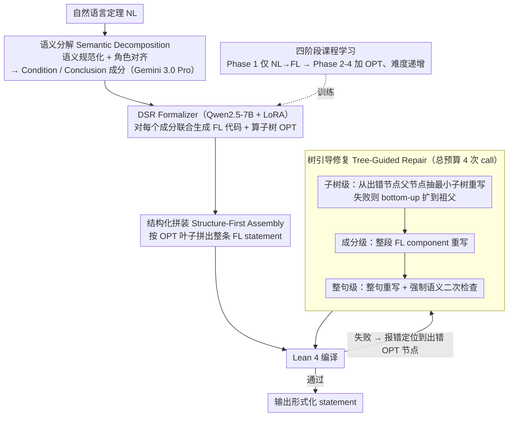

# Decompose, Structure, and Repair: A Neuro-Symbolic Framework for Autoformalization via Operator Trees

**会议**: ICML 2026  
**arXiv**: [2604.19000](https://arxiv.org/abs/2604.19000)  
**代码**: https://github.com/XiaoyangLiu-sjtu/DSR  
**领域**: LLM推理 / 形式化数学 / 神经符号  
**关键词**: 自动形式化, Lean 4, 算子树, 课程学习, 树引导修复  

## 一句话总结
本文提出 DSR（Decompose-Structure-Repair）神经符号框架，把自然语言定理形式化拆解为「分解 NL 成分 → 联合生成 FL 成分与算子树（OPT） → 基于子树定位的层级化修复」三阶段，在 ProverBench / ProofNet / PRIME 上以 7B 模型刷新 SOTA，并配套发布 156 题的研究生级 Lean 4 基准 PRIME。

## 研究背景与动机

**领域现状**：Statement autoformalization 旨在把自然语言（NL）数学陈述自动翻译为 Isabelle / Coq / Lean 等交互式定理证明器（ITP）可验证的形式语言（FL）。近年的主流路线已经从神经机器翻译演化为 LLM-driven 范式：few-shot prompting、在形式语料上做 SFT、辅以 RL / RAG / 工具反馈，最近还出现了 ARIA（graph-of-thought）和 SITA（structure-to-instance）这类系统级迭代架构。

**现有痛点**：尽管路线在变，几乎所有方法都把形式化当成一次性、端到端的「flat string」生成任务，把 Lean 代码当线性 token 序列预测。这带来两个后果：
1. 模型无法显式捕捉数学陈述天然的嵌套结构（量词、算子优先级、条件-结论拆分），常常生成局部出错但整体貌似合理的代码；
2. 一旦编译失败，主流的修复策略是把整条 statement 重新生成（statement-level repair），既浪费算力，又容易把原本写对的部分改坏 —— 出现「语法通过但语义漂移」的退化。

**核心矛盾**：形式化代码的正确性是**结构化**的（一个算子树节点错就整树挂掉），但生成与修复都是**线性**的；缺乏一个可寻址、可局部干预的中间表示，导致「能改对」和「不破坏全局逻辑」鱼与熊掌不可兼得。

**本文目标**：给自动形式化引入一个显式的**层级中间表示**，使得 (a) 训练阶段模型被迫学会数学陈述的拓扑骨架；(b) 修复阶段可以像「外科手术」一样精确定位到出错子树，只重写最小子结构。

**切入角度**：作者注意到 Lean Language Server 本身就能把 FL 代码解析成 Operator Tree（OPT，算子作为内部节点、参数作为有序子节点）。如果让模型在生成线性 Lean 代码的同时**联合生成对应的 OPT**，OPT 既是「结构先验」（训练时正则化），又是「修复蓝图」（推理时可寻址）。

**核心 idea**：把 autoformalization 重构为 *Decompose → Structure → Repair* 的模块化流水线 —— 先把 NL 陈述拆成条件/结论成分，再联合预测每个成分的 FL 代码 + OPT，最后用 OPT 把编译错误定位到子树并做 bottom-up 的层级修复。

## 方法详解

### 整体框架
DSR 要解决的是「把自然语言定理翻成能过 Lean 4 编译、又不跑偏原意的形式化陈述」。它不把这件事当成端到端的一次性字符串生成，而是拆成三段流水线：先用 Gemini 3.0 Pro 把原文做语义规范化并切成若干被标注为 *Condition* / *Conclusion* 的 NL 成分（Semantic Decomposition）；再让 DSR Formalizer（LoRA 微调的 Qwen2.5-7B-Instruct）对每个成分同时吐出一段线性 FL 代码和一棵算子树 OPT（Structured Translation）；最后用 OPT 的叶子节点 Structure-First Assembly 拼出整条 statement 交 Lean 编译，编译失败就把报错位置定位到 OPT 节点、按子树→成分→整句三级逐层修复（Tree-Guided Repair）。贯穿全程的核心载体是 OPT——它既是训练时的结构先验，又是推理时的修复地址簿。其中 Formalizer 联合生成 FL+OPT 的能力，由一套四阶段课程学习训练而来（推理时不出现，故在下图中以虚线「训练」标注）。

### 关键设计

**1. 算子树作为联合生成目标：让线性代码自带一张可寻址的结构地图**

单纯线性生成 Lean 代码常因括号失配、scope 未闭合而语法失败，更隐蔽的是「局部出错但整体看着合理」——线性 token 序列里根本没法定位到底哪截逻辑错了。DSR 的做法是让模型在产出 FL 代码的同时输出它对应的算子树，形式上是要模型学到表达式的递归拓扑 $T=(V,E,\ell)$，算子作父节点、参数作有序子节点。它复用了 ASSESS 的 OPT 表示但做了两处改造：一是把建树粒度从 statement 下沉到 component，呼应前面的分解策略；二是**显式保留括号节点**，使线性代码与树维持 token 级一致，这样当 OPT 解析失败时可以 fallback 到 FL component 作为 Inference Failsafe。这一招的收益是双份的：同时输出 OPT 等于在 loss 里加了一项结构正则，逼模型内化嵌套优先级；而 OPT 把线性代码切成可寻址的逻辑子结构，没有它后面那套精准修复根本无从下手。

**2. 基于 OPT 复杂度的四阶段课程学习：把「学逻辑」和「学拓扑」分开喂**

让 7B 小模型同时学复杂数学逻辑和层级拓扑会直接练崩——消融里只加 OPT 不加课程时，PRIME 上 Pass@1 SC 反而从 22.44% 掉到 19.87%，出现明显的优化壁垒。对策是把训练难度铺成梯度。作者从 NuminaMath-LEAN + ATLAS-Synthetic 共 120k FL 陈述出发，用 Qwen3-Max 反向生成 NL，构建 283,958 条 ⟨NL component, FL component, FL OPT⟩ 三元组，按 OPT 的 *tree depth / width / 节点数* 分层、丢掉 top 1% 极端样本后划成 simple (143k) / moderate (110k) / complex (28k) 三档。训练走四相：Phase 1 只学 NL→FL component（atomic 数据，$\text{lr}=2\times10^{-4}$），Phase 2-4 才加上 OPT 联合预测、难度从 simple 推到 complex（lr 阶梯衰减到 $1\times10^{-5}$），每相用 replay 机制混入前一档 10–30% 数据防遗忘。铺开梯度后 PRIME 的 Pass@1 SC 回升到 23.08%，说明 OPT 监督本身有效、只是不易优化，必须靠 curriculum 才能稳住收敛。

**3. 三级粒度的树引导修复：把 LLM 当子树替换器而非整段重写器**

主流的 statement-level 修复一旦编译失败就把整条重写，既费算力又容易把原本对的部分改坏，出现「语法过了但语义漂移」的退化。DSR 借助 OPT 的可寻址性做外科手术式修复：Lean 编译器报错给出 (row, col)，先映射到 OPT 上最小的出错节点 $v$，再 bottom-up 逐层扩大范围——Subcomponent-Level 从 $v$ 的父节点抽出最小子树喂给修复模型重写，失败就退到祖父，循环到 component 边界；不行再升到 Component-Level 整段重写；最后才是 Statement-Level 整句重写兜底，并强制在此做一次语义二次检查。每个粒度限一次推理 call、总预算 4 calls，与 baseline 公平对齐。消融对比 DSR vs DSR-Global（只用 statement-level 修复）暴露了关键 trade-off：global 重写常拿到更高的 Syntax Check（ProverBench 96.00 vs 95.38），却换来更低的 Consistency Check——它能蒙过编译器但破坏语义；树引导修复牺牲一点 SC 换来稳定更高的 CC（ProverBench 84.00 vs 82.77、ProofNet 79.51 vs 76.01），证明把随机性局限在最小可疑子树才是语义保真的关键。

### 损失函数 / 训练策略
LoRA 微调 Qwen2.5-7B-Instruct，目标是标准的 next-token 交叉熵，target 序列为 `FL component <SEP> FL OPT` 的拼接。课程四相 batch size = 128（最后一相 64），1 epoch / 相，warmup ratio 0.03–0.10。推理阶段总 budget = 4 次 LLM call。

## 实验关键数据

### 主实验

| 数据集 | 指标 | DSR (7B) | 最强基线 | 相对提升 |
|--------|------|----------|----------|----------|
| ProverBench | CC | **84.00** | Goedel-V2-32B 83.38 | +0.62 |
| ProofNet | CC | **79.51** | Goedel-V2-32B 70.89 | **+8.62** |
| PRIME (graduate) | CC | **67.95** | Goedel-V2-32B 66.67 | +1.28 |
| ProofNet | SC | **87.33** | Goedel-V2-32B 77.63 | +9.70 |

注：所有方法统一 4 次推理 call 预算；baselines 区分 Pass@4 与 Global Repair (N=4) 两种 setting，表中报最强者。DSR 7B 持续优于 32B 级的 Goedel-V2 与 ATF-32B。

### 消融实验

| 配置 | ProverBench Pass@4 CC | ProofNet Pass@4 CC | PRIME Pass@4 CC | 说明 |
|------|-----------------------|--------------------|-----------------|------|
| Baseline（仅线性 Lean） | 30.46 | 16.71 | 25.00 | NL→FL component 朴素 seq2seq |
| + Operator Tree | 32.31 (+1.85) | 18.06 (+1.35) | 21.15 (−3.85) | PRIME 反而掉 → 优化壁垒 |
| + Curriculum Learning | **33.54 (+3.08)** | **19.41 (+2.70)** | **26.28 (+1.28)** | OPT + 课程才稳定增益 |

修复策略消融（Table 2 Ours 区）：DSR vs DSR-Global（同 formalizer，只换修复策略）—— ProofNet CC 79.51 vs 76.01（+3.50），证明树引导胜在语义保真。

### 关键发现
- **OPT 必须搭配课程学习才能 work**：单加 OPT 监督会在高难度基准（PRIME）上让 Pass@1 SC 从 22.44% 掉到 19.87%，说明「学逻辑 + 学拓扑」同时上手对 7B 模型是负担；课程化把难度梯度铺开才能拿到正收益。
- **SC↔CC 鸿沟暴露 baseline 的语义漂移**：Kimina-Autoformalizer-7B 在 ProofNet 拿到 83.02% SC 但 CC 只有 56.87%（gap 26.15%），而 DSR 只差 7.82%。说明 OPT 监督有效约束了模型生成语义一致而非「碰巧能编译」的代码。
- **复杂度越高，DSR 优势越大**：在简单的 ProverBench 上 DSR 仅领先 0.62%，到 PRIME 这种研究生级题目领先 1.28%；7B 模型完胜 32B baseline 也主要发生在 ProofNet / PRIME。结构化先验在面对深嵌套定理时才真正发挥价值。

## 亮点与洞察
- **「联合生成代码 + 树」是个被忽视但极廉价的结构正则**：模型只多输出一段 token 序列（OPT 的线性序列化），训练目标无变化，却同时获得了语义锚点（训练）+ 修复地址簿（推理）两个好处，是一个 ROI 极高的设计。
- **修复阶段把 LLM 当成「子树替换器」而非「整段重写器」**，让 LLM 的随机性被局限在最小可疑区域；这个思路可以推广到任何「整体结构已基本正确、只有局部出错」的代码生成任务（如 SQL、可微规则、配置 DSL）。
- **PRIME 基准本身有独立价值**：156 题研究生级 Lean 4 题，专家手工标注，且同时给出 informal proof，能直接拿来做 ATP（自动定理证明）研究，不只是 autoformalization 评测。

## 局限与展望
- 作者承认 OPT 的构建依赖 ASSESS / Lean Language Server，强绑 Lean 4，迁移到 Coq / Isabelle 需要重写 OPT 提取工具链。
- 分解阶段直接调 Gemini 3.0 Pro，pipeline 含闭源 API 依赖；实际部署成本与可复现性受影响（虽然 formalizer 本体是 7B 开源模型）。
- 修复阶段强制最后做一次 statement-level「语义兜底 check」，意味着即使局部修复成功也要再花一次推理 call，预算被吃掉一格；budget 紧时可能影响子树修复的迭代深度。
- 消融只对比了 DSR-Global，没有报告 *不做任何修复* 的 DSR Formalizer 本体；难以单独评估 formalizer 训练改进 vs 修复策略改进的边际贡献。
- 与 DRIFT 的检索分解互为正交，论文已点出整合方向，但未做实验验证。

## 相关工作与启发
- **vs ARIA / SITA（系统级迭代）**：ARIA 用 graph-of-thought 做 planning，SITA 做 structure-to-instance 实例化；它们关心「外部如何组织调用」，DSR 关心「内部如何表示中间产物」，且 OPT 本身就是 Lean 编译器可直接验证的对象，比 ad-hoc 的 plan 更具机器可读性。
- **vs DRIFT（Zhang et al. 2026）**：DRIFT 的分解服务于外部概念检索，DSR 的分解服务于降维 + OPT 生成；两者正交，论文明确指出整合是未来方向。
- **vs ASSESS（Liu et al. 2026）**：DSR 复用了 ASSESS 的 OPT 表示，但把建树粒度从 statement 下沉到 component，并显式保留括号 —— 这两个改动是为了配合 §3.3 的子树修复，单看 ASSESS 不需要这种 token-level 对齐。
- **vs Goedel-V2-Formalizer-32B**：纯靠规模刷 SOTA 的代表；DSR 用 7B + 结构化先验在 ProofNet CC 上反超 8.62%，是「结构 > 规模」的一个有力证据。

## 评分
- 新颖性: ⭐⭐⭐⭐ OPT 不是新概念（MIR 领域用了二十年），但「联合生成 FL+OPT 用于修复」的组合是首次。
- 实验充分度: ⭐⭐⭐⭐ 三基准 + 两种 baseline setting + 训练消融 + 修复策略消融，结构清晰；PRIME 是额外贡献。
- 写作质量: ⭐⭐⭐⭐ Theoretical / Practical 两小节把 OPT 的双重作用讲得很清楚，repair trajectory 图示直观。
- 价值: ⭐⭐⭐⭐ 神经符号 + 结构化中间表示对形式化数学社区是有用的方法论；7B 打 32B 也提示了「结构先验」的成本收益。

<!-- RELATED:START -->

## 相关论文

- [\[AAAI 2026\] Towards a Common Framework for Autoformalization](../../AAAI2026/llm_evaluation/towards_a_common_framework_for_autoformalization.md)
- [\[ACL 2025\] StrucText-Eval: Evaluating LLM's Reasoning on Structure-Rich Text](../../ACL2025/llm_evaluation/structext_eval.md)
- [\[ICML 2026\] Margin-Adaptive Confidence Ranking for Reliable LLM Judgement](margin-adaptive_confidence_ranking_for_reliable_llm_judgement.md)
- [\[ICML 2026\] CapBencher: Give Your LLM Benchmark a Built-in Alarm for Test-Set Overfitting](capbencher_give_your_llm_benchmark_a_built-in_alarm_for_test-set_overfitting.md)
- [\[ICML 2026\] Toward Training Superintelligent Software Agents through Self-Play SWE-RL](toward_training_superintelligent_software_agents_through_self-play_swe-rl.md)

<!-- RELATED:END -->
