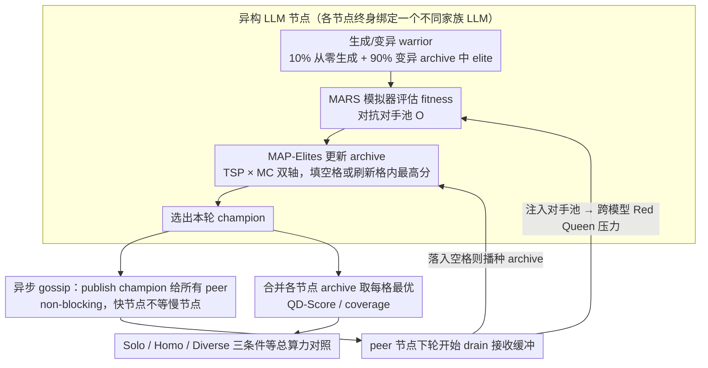

# DEI: Diversity in Evolutionary Inference for Quality-Diversity Search

**会议**: ICML 2026  
**arXiv**: [2605.27130](https://arxiv.org/abs/2605.27130)  
**代码**: 基于 SakanaAI/drq 开源实现扩展，论文承诺随论文发布  
**领域**: 优化 / 演化算法 / Quality-Diversity / LLM 作为算子  
**关键词**: Quality-Diversity, MAP-Elites, 异构 LLM 集成, 异步 gossip, 程序合成  

## 一句话总结
本文提出 DEI，把多个**不同家族的 LLM**当作 Quality-Diversity 搜索里的异构变异算子分布到不同节点，用全异步 gossip 互相广播每轮 champion 形成跨模型对抗压力，在 Core War 程序合成任务上以等总算力换来比单节点 +124% 的 QD-Score 与 +28% 的 archive coverage。

## 研究背景与动机

**领域现状**：用 LLM 替代手工遗传算子已成主流。FunSearch、Evolution through Large Models、OPRO 等都让 LLM 直接做"变异"——读入旧解 + 提示词，输出更优变体；MAP-Elites/QD 框架则在此之上维护一个按"行为特征 (BC)"网格化的 archive，目标是找到一群既高质又多样的解。Digital Red Queen (DRQ, kumar2026) 进一步把每轮 champion 留作下轮对手，制造 Red Queen 协同进化压力。

**现有痛点**：当前所有"分布式 LLM 搜索"只是把同一个模型复制到 N 个 worker，靠采样温度刷多样性。这等同于把同一个生成分布并行 N 次——任何被该模型系统性回避的解 (比如 GPT 系不爱写的某类 Redcode 模板) 在 archive 里永远是空洞。FunSearch、AlphaEvolve 都没解决这个问题；AlphaEvolve 虽然用了两个模型，但只是同家族大小搭配，目的是省算力而非求多样性。

**核心矛盾**：QD 想要"覆盖整个行为空间"，但每个 LLM 都有自己根深蒂固的归纳偏置 (训练语料、对齐方式带来的"写作偏好")。**单一分布的样本永远填不满多分布的并集**——并行只能放大算力，放大不了 prior 的覆盖面。

**本文目标**：在固定**总 LLM 调用预算**的条件下，证明"用异构模型集合做 QD 搜索"严格优于"用同一模型并行做 QD 搜索"，且优于单节点；同时给出能容忍模型间延迟差异的工程实现 (本地 35B Qwen 可能比云端 frontier 慢 10×)。

**切入角度**：把"模型身份"本身当成 QD 的一种多样性源——每个节点跑一个不同家族的 LLM，让它们各自抢占行为空间里自己最擅长的 niche，再通过 gossip 把对方的 champion 注入自己的 opponent pool 与 archive，形成"跨模型 Red Queen"。

**核心 idea**：把同质并行 (parallel computation) 升级成**异质并行 (parallel cognition)**——多样性不来自温度采样，而来自不同模型的 prior 差异。

## 方法详解

### 整体框架
DEI 把 DRQ 的单节点 pipeline 原样保留 (代码一行没改)，外面套一层异步通讯层，让 $N$ 个跑着不同 LLM 的节点互相喂 champion。每个节点是一个二元体：本地一个 MAP-Elites 优化器在跑 Quality-Diversity 搜索，外加一层全异步通讯层负责把本轮 champion 广播出去、再把收到的 peer champion 注入自己的对手池和 archive。本地优化器维护一个 2D archive，行为坐标轴是 **TSP** (warrior 代码长度 × 平均存活时间) 与 **MC** (战斗中触碰核内地址的比例)，每个格子存当前 fitness 最高的 warrior；每轮 $T$ 次 LLM 调用中 10% 从零生成 warrior、90% 从 archive 采样一个 elite 让 LLM 做变异，fitness 由 $f(w_i,\mathcal{O})=\sum_{\tau\in\mathcal{T}}\frac{N}{|\mathcal{T}|}\frac{A^i_\tau}{\sum_{o\in\mathcal{O}}A^o_\tau}$ 在 MARS 模拟器里与对手集合 $\mathcal{O}$ 对战得到，新解只要填空格或刷新格内最高分就替换 archive。三种实验条件——Solo (1 节点)、Homo Ensemble (4 节点同模型)、Diverse Ensemble (4 节点异模型 GPT-5.4-mini / Claude Sonnet 4.6 / GPT-5.2 / Claude Haiku 4.5)——共用同一 **总** 调用预算 (每节点配额按 $1/N$ 缩放) 以保证公平对比。

### 关键设计

**1. 异构 LLM 作为变异算子 + 跨模型 Red Queen：让模型身份本身成为多样性源**

传统并行 EA 假设变异算子是固定的，worker 之间只能靠采样温度刷多样性——这等于把同一个生成分布并行 $N$ 次，任何被该模型系统性回避的解 (比如 GPT 系不爱写的某类 Redcode 模板) 在 archive 里永远是空洞。DEI 的做法是给每个节点固定绑定一个不同家族的 LLM 当 MAP-Elites 的变异/生成算子，再让每轮 champion 通过 gossip 进入对方的对手池 $\mathcal{O}_i \leftarrow \mathcal{O}_i \cup \mathcal{R}$。关键在于 fitness 公式 $f(w_i,\mathcal{O})$ 显式依赖对手集合 $\mathcal{O}$：当 GPT 节点的 archive 里突然冒出一个 Claude 写的、利用 Claude 偏爱模式的 fortress warrior 当对手，GPT 必须进化出能克制它的解才能拿高分——这正是单节点自博弈永远拿不到的"多分布对抗压力"。为了量化这种互补，论文定义 niche novelty $\eta=\mathbb{E}[\mathbf{1}[\mathbf{bc}(w)\notin \mathcal{A}_i^{(r-1)}]]$，即收到的 peer champion 有多大比例落在自己 archive 的空格里；实验中 diverse 条件 $\eta\approx 0.45$ 远高于 homo 的 $0.09$~$0.35$，直接坐实了异构模型确实在"互相补盲区"。这一步把"用哪个 LLM"提升为 QD 的一阶多样性源，是 AlphaEvolve 的同家族大小搭配和 FunSearch 的同模型多 worker 都没做到的核心区别。

**2. 全异步 gossip champion 共享：让快慢悬殊的节点共存于一个 ensemble**

异构最大的工程障碍是延迟悬殊——本地 MLX Qwen-35B 约 10s/call，云端 frontier 约 2s/call，差 10×。如果沿用"轮末同步 barrier"，frontier 模型会在等本地 35B 时空转掉大半算力，使"加一个慢节点"反而拖低吞吐，工程上只能被迫用同质硬件，和"democratize 异构协作"的目标直接矛盾。DEI 改用 non-blocking all-gather：每个节点一选出本轮 champion 就立刻 publish 给所有 peer，下轮开始时 drain 自己的接收缓冲，快节点不等慢节点。慢节点收到的可能是若干轮前的旧 champion，但因为 QD archive 本质上是"积累式"的，迟到的 champion 仍能填空格或刷新 elite，不会过期作废。底层用 Yggdrasil overlay 给每个节点分配稳定 IPv6 地址做 NAT 穿透。这样设计后,"加一个慢笔记本节点"严格只增不减,成为异构方案能真正 scale out 的前提。

**3. 算力等额的三条件对照协议：把"算力增益"和"多样性增益"彻底拆开**

QD 文献最容易被质疑的就是"你不过是多花了算力"。为了把"是不是多样性带来的增益"做成可证伪的实验，DEI 让 Solo / Homo / Diverse 三种条件共享同一 **总** LLM 调用预算——单节点 250 iters/round 对 4 节点 × 62 iters/round ≈ 248 calls，每节点配额按 $1/N$ 严格缩放。同时报告两套分层指标：个体层看每个节点本地 archive 的 champion generality (对人写 warrior 集合 $\mathcal{H}$ 的胜率) 与 niche novelty，合并层看跨节点取每格最优后合并 archive 的 QD-Score 与 coverage，并把"merged at equal compute"作为最关键的对比图。结果一拆就清楚：Homo merged 的 QD-Score 比 Solo 高 (29.85 vs 20.46) 说明并行+对抗本身有用，但只有 Diverse merged 在 coverage 上 (80.6% vs 63.0%) 显著领先——覆盖面的增益**只能**归于异构 prior，这正是论文反复强调的 first empirical evidence。

### 损失函数 / 训练策略
全程无梯度训练，LLM 调用都发生在 inference 阶段，archive 更新规则就是 MAP-Elites 的标准替换逻辑。每节点每轮 $T$ 次调用 (4 节点条件下 $T\approx 62$，solo 条件下 $T=250$)；MARS 配置为 core 8000 指令、单场最多 80000 cycles、每对 warrior 跑 20 场；新建 / 变异两个提示词模板直接复用 DRQ 原仓库。

## 实验关键数据

### 主实验
所有条件共享总 LLM 调用预算；fitness 评估在 MARS 模拟器上对抗 round champion 池；最终 generality 报告对一组人工编写 warrior 集合 $\mathcal{H}$ 的胜率。

| 模型 / 条件 | Peak Generality | Niche Novelty η | 备注 |
|------------|----------------|-----------------|------|
| Diverse Ensemble (Claude Sonnet 4.6) | **0.850 ± 0.087** | 0.483 ± 0.120 | 全场最佳，η 也最高 |
| Homo Ensemble (Claude Sonnet 4.6) | 0.825 ± 0.106 | 0.348 ± 0.039 | 同模型并行已经强于 solo |
| Solo DRQ (Claude Sonnet 4.6) | 0.775 ± 0.035 | — | 单节点基线 |
| Diverse Ensemble (GPT-5.4-mini) | 0.767 ± 0.076 | 0.422 ± 0.072 | Diverse > Homo > Solo |
| Homo Ensemble (GPT-5.4-mini) | 0.725 ± 0.029 | 0.119 ± 0.013 | η 远低于 diverse |
| Diverse Ensemble (Claude Haiku 4.5) | **0.700 ± 0.050** | 0.443 ± 0.132 | Solo 0.650，Homo 仅 0.538 |

合并 archive (等总算力对比，最后一轮)：

| 条件 | Coverage | QD-Score | 相对 Solo |
|------|----------|----------|-----------|
| Solo | 63.0% | 20.46 | 基线 |
| Homo merged | 59.0% | 29.85 | coverage -4pt, QD +46% |
| **Diverse merged** | **80.6%** | **45.90** | **coverage +28%, QD +124%** |

### 消融实验
论文的"消融"等价于"把 diverse 退化成 homo 或 solo"——已包含在主表里。补充观察：

| 比较 | 关键指标 | 说明 |
|------|---------|------|
| Diverse vs Homo (4 模型 × 4 节点) | Generality 全部 4/4 模型上 Diverse 赢 | 异构带来的增益对模型家族无偏 |
| Diverse vs Homo (merged QD-Score) | 45.90 vs 29.85 (+54%) | 算力相同下，多样性是增益主因 |
| Diverse vs Homo (merged Coverage) | 80.6% vs 59.0% (+22pt) | 覆盖率增益**只**在异构条件下出现 |
| Niche novelty η (Homo → Diverse) | 0.09–0.35 → 0.42–0.48 | 收到的 champion 落入空格的比例显著上升 |

### 关键发现
- **同质并行只能拉 QD-Score、拉不动 coverage**：Homo merged 的 coverage (59%) 甚至比 Solo (63%) 还低，说明 4 个同模型节点在行为空间里高度冗余地撞同一批 niche；只有引入异质 prior，coverage 才跨过 80%。
- **小模型从 diverse 中受益最大**：Claude Haiku 4.5 在 solo 下只有 0.650，diverse 拉到 0.700；GPT-5.2 从 0.650 拉到 0.767——弱模型靠"蹭"强模型的 champion 拿到了自己生成不出的 niche，这给"democratize" (本地小模型 + 云端大模型混搭) 提供了直接证据。
- **异步 gossip 让慢节点变成纯增益**：因为没有 barrier，"加一个本地 MLX 节点"严格只增加 coverage 不拖累 frontier 节点吞吐——这是异构方案能在真实硬件混合环境里 scale 的工程前提。

## 亮点与洞察
- **"模型身份"作为一阶 QD 多样性源**：以往多样性来源是温度/采样噪声/BC 维度设计，本文第一次把"用哪个 LLM"提升到和 BC 同等的多样性维度——这是个非常通用的视角，理论上任何 LLM 驱动的搜索 (FunSearch、AlphaEvolve、自动定理证明) 都能受益。
- **算力等额对照协议干净利落**：把"$N$ 倍并行就 $1/N$ 配额"做成硬约束 + 同时报告 individual 和 merged 两套指标，把"算力增益"和"多样性增益"的归因彻底拆开——这套对照设计本身就是个可复用的 trick，值得被任何"多 agent / 多模型"工作借鉴。
- **niche novelty 指标直接量化"互补程度"**：$\eta=\Pr[\mathbf{bc}(w_{\text{peer}})\notin \mathcal{A}_i]$ 这个简单的度量，把"模型 A 收到模型 B 的 champion 时有多惊讶"做成可观测信号，是判断"两个生成器是否真的互补"的便宜诊断——可以直接拿去做 ensemble 选型 (挑 η 高的组合)。
- **Async gossip 配 Yggdrasil overlay**：给"本地开放权重模型 + 云端 frontier 模型混搭"做了一个生产可用的 NAT 穿透方案，是把研究 idea 落地到"草根 GPU 协作搜索"的关键工程贡献。

## 局限与展望
- 仅在 Core War 一个领域验证。Redcode 是结构高度规整的低层汇编，行为空间天然就有清晰的 TSP / MC 两个 BC 轴；在 BC 不易定义或 fitness 评估昂贵 (如端到端机器人控制) 的任务上能不能复现尚未验证，作者自己也明确承认这一点。
- 模型分配是**静态**的：每个节点终身绑定一个 LLM，没有"哪个模型最近贡献多就给它更多算力"的动态调度——这恰恰是 future work 里提到的 adaptive topology / 异构 BC 轴的空间。
- 只对比 4 个模型 × 4 节点的固定组合，缺少"几个模型够用"、"模型组合怎么挑最优"的系统性消融——niche novelty η 在不同 pair 下数值能差 4×，说明组合选择本身是个独立优化问题，但论文没探索。
- 没把 diversity 和别的多样性手段叠加比较：比如温度调高的 Homo / Quality-Diversity through AI Feedback / DARLING 这种 RL 阶段就引多样性的方法——异构 ensemble 是否对所有这些手段都正交、能否叠加，还是开放问题。
- "champion 共享"是单一通讯协议，没探索更细粒度的迁移 (整段 archive 子集？带 BC 注释的 mini-archive？)——这些可能让异构增益更进一步放大。

## 相关工作与启发
- **vs FunSearch (Romera-Paredes 2023)**: 同样是大规模并行 LLM 演化，但 FunSearch 整池都是同一模型，所有多样性靠采样温度；DEI 直接换模型家族，理论上覆盖更广的程序分布，实验也把 coverage 从 63% 拉到 80.6%。
- **vs AlphaEvolve (Novikov 2025)**: 也用 LLM 集成，但只搭配同家族的大/小模型，目的是省算力 (大模型贵小模型便宜)；DEI 跨家族搭配 (Claude + GPT)，目的是抢不同 prior 的覆盖——优化目标完全不同。
- **vs DRQ (Kumar 2026)**: 本文是 DRQ 的直接上位扩展——单节点 → 多节点 + 跨模型对抗，DRQ 代码原样复用，Red Queen pressure 从"intra-model self-play"升级到"inter-model adversarial"。
- **vs Island-model EA (Cantu-Paz 2001)**: 经典 island 模型是同算子、不同子种群定期迁移；DEI 等价于"每个 island 跑一个不同的算子"+"publish-subscribe 异步迁移"+"对手池而非种群直接迁移"。
- **vs Multi-agent debate (Liang 2024) / DARLING (Li 2025) / DIVER (Hu 2025)**: 这些工作在 RL post-training 或推理阶段引多样性以提升 reasoning；DEI 把同一直觉搬到 QD 搜索阶段——殊途同归，互相印证"显式制造生成多样性 > 单分布暴力采样"是个跨任务规律。

## 评分
- 新颖性: ⭐⭐⭐⭐ 第一篇把"异构 LLM 家族"作为 QD 一阶多样性源做严格 controlled 对比，思路简单但定位准确。
- 实验充分度: ⭐⭐⭐ 算力等额三条件 + 4 模型对照已经做得干净，但只在 Core War 一个 domain、固定组合，覆盖面有限。
- 写作质量: ⭐⭐⭐⭐ 动机—假设—等额对照—指标分层 (individual / merged) 的论证链非常清晰，niche novelty 这个度量也用得漂亮。
- 价值: ⭐⭐⭐⭐ 给"本地开源模型 + 云端 frontier 模型混搭做协作搜索"提供了可复现的工程范式，对算力受限研究者尤其有用。

<!-- RELATED:START -->

## 相关论文

- [\[ICML 2025\] The Best of Both Worlds: Bridging Quality and Diversity in Data Selection with Bipartite Graph](../../ICML2025/llm_evaluation/the_best_of_both_worlds_bridging_quality_and_diversity_in_data_selection_with_bi.md)
- [\[NeurIPS 2025\] Efficient Semantic Uncertainty Quantification in Language Models via Diversity-Steered Sampling](../../NeurIPS2025/llm_evaluation/efficient_semantic_uncertainty_quantification_in_language_models_via_diversity-s.md)
- [\[ICML 2026\] BESPOKE: Benchmark for Search-Augmented Large Language Model Personalization via Diagnostic Feedback](bespoke_benchmark_for_search-augmented_large_language_model_personalization_via_.md)
- [\[AAAI 2026\] OptScale: Probabilistic Optimality for Inference-time Scaling](../../AAAI2026/llm_evaluation/optscale_probabilistic_optimality_for_inference-time_scaling.md)
- [\[ICML 2026\] REAL：把回归感知奖励塞进 RL，让 LLM-as-a-Judge 学会"差一分也是差"](real_regression-aware_reinforcement_learning_for_llm-as-a-judge.md)

<!-- RELATED:END -->
