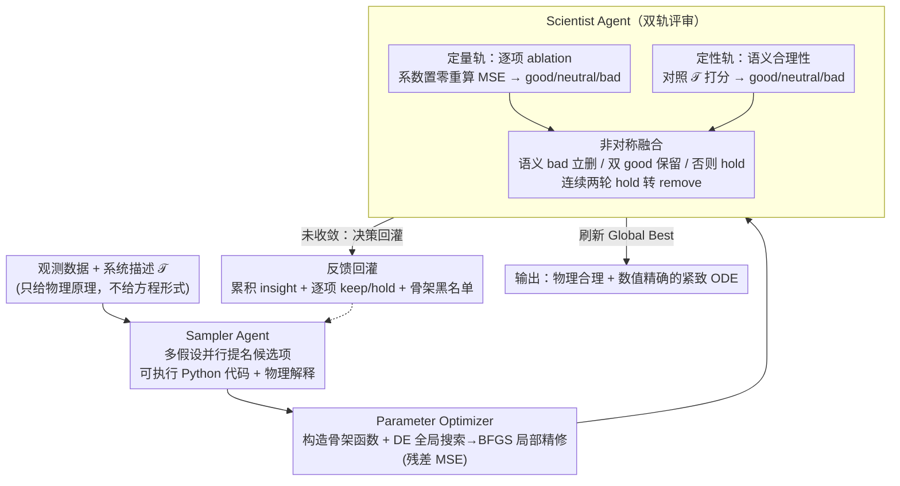

# Discovering Ordinary Differential Equations with LLM-Based Qualitative and Quantitative Evaluation

**会议**: ICML 2026  
**arXiv**: [2605.07323](https://arxiv.org/abs/2605.07323)  
**代码**: https://github.com/Bon99yun/DoLQ  
**领域**: 科学发现 / 符号回归 / LLM 多智能体  
**关键词**: 符号回归, 常微分方程, LLM Agent, 物理可解释性, 假设搜索

## 一句话总结
DoLQ 在 LLM 符号回归的搜索循环里插入一个 "Scientist Agent"，对候选项同时做定性（物理合理性）+ 定量（消融式 MSE 贡献）评估，把 LLM-SR 那种 "低误差但项数臃肿、物理上荒谬" 的方程逼到既数值精确又结构紧凑。

## 研究背景与动机
**领域现状**：从观测数据反推常微分方程（ODE）是科学机器学习的核心问题。早期 SINDy 靠预设基函数库 + 稀疏回归；后续符号回归（SR）用进化算法或 Transformer（ODEformer）自动搜索；最新一代换成 LLM-SR、LASR 这类用 LLM 做候选生成器的方法，靠 LLM 的科学先验大幅压缩搜索空间。

**现有痛点**：所有现存方法对候选方程的评估都只看数值指标——MSE、复杂度。但论文 Figure 1 给了一个关键反例：两个 MSE 几乎相同的方程，在外推区间和物理含义上可能完全不同；LLM-SR 经常输出 10 几项的 "垃圾袋" 方程，其中真值项被一堆物理上无意义的项稀释，参数优化时彼此干扰。

**核心矛盾**：纯数值评价只能告诉你 "现在拟合得多好"，告诉不了你 "这个项是否对应一个真实的物理机制"；而后者恰恰决定能不能在 ID-Ext / OOD 区间稳定外推。

**本文目标**：(1) 把物理合理性显式注入搜索循环；(2) 主动剪掉那些 "看似有贡献其实是过拟合" 的项；(3) 在多维 ODE（甚至 4D Glider）上稳定地复原结构。

**切入角度**：LLM 同时具备数值推理能力和领域知识，与其只用它当 "提名者"，不如再请一个独立的 LLM 当 "评审"，从语义和数值两个正交维度打分，把评审反馈回灌到提名者的下一轮 prompt 里。

**核心 idea**：定性 + 定量双轨评审 → 双重否决：语义不合理立刻删，数值无贡献延迟删，从而把搜索引导到 "既物理合理又数值最优" 的紧致方程上。

## 方法详解

### 整体框架
DoLQ 是一个免训练的三智能体迭代闭环，围绕 "提名 → 优化 → 评审" 转圈：**Sampler Agent** 吃系统描述 $\mathcal{T}$ + Scientist 反馈，吐出若干候选项的可执行 Python 代码片段（如 `params[0] * np.sin(x[1])`）以及每个项的自然语言物理解释；**Parameter Optimizer** 把符号项实例化为可微骨架函数 $f_j(t, \boldsymbol{x}; \boldsymbol{\theta})$ 并拟合参数；**Scientist Agent** 对优化后的方程同时做定量与定性评审，产出 keep/hold/remove 决策和一段累积 insight 回灌给 Sampler。外循环跑 100 轮，每轮 Sampler 同时提多份候选 hypothesis 并行评估，全局最优 "Global Best" 持续刷新。下面三个关键设计依次对应闭环里的「提名 → 优化 → 评审」三段，其中 Scientist Agent 的双轨评审是全文真正的核心创新。

### 关键设计

**1. Sampler Agent 的结构化 prompt + 多假设并行：让 LLM 提出 "可执行 + 可解释" 的候选，而不是只给符号**

闭环的第一段「提名」。Sampler 的 prompt 分三块——(a) 任务定义 + 系统描述 $\mathcal{T}$；(b) Scientist 反馈，含累积 insight、term-by-term 评审结果、已 remove 的骨架黑名单；(c) 输出格式约束，强制每个项写成形如 `params[0] * np.cos(x[0])` 的 Python 代码 + 一段物理 justification。可执行格式让 Parameter Optimizer 不必再做符号解析，强制 justification 又把 LLM 的内隐物理知识显式化、方便 Scientist 评审。每轮同时生成多个 hypothesis，每个 hypothesis 为每个维度配一套独立的项，既能并行评估、ablation 互不污染，又靠黑名单避免陷在单条搜索路径上。

**2. DE + BFGS 混合参数优化：给结构正确的骨架兜底，防止 "参数没找到" 被误判成 "结构不对"**

闭环的第二段「优化」。参数拟合的优化目标用残差 MSE $\sum_i (\dot{x}_j(t_i) - f_j(t_i, \boldsymbol{x}; \boldsymbol{\theta}))^2$ 而非积分 MSE——后者在多维系统里会被某一维的早期误差污染所有维度。优化时先用差分进化（Differential Evolution）在参数空间做全局搜索、锁定一片可行区域，再用 BFGS 在该区域局部精修；实际同时跑 BFGS only / DE only / 混合三种策略，取 MSE 最低者。这样做是因为 BFGS 对初始化极敏感，结构正确的骨架常因初值不好被错判 "不行" 而 reject，进而让 Scientist 误以为该结构不该 keep、造成灾难性误删；差分进化兜底就是为了消除这种 "骨架正确但参数没找到" 的假阴性（Figure 8：BFGS 单独跑失败，混合策略成功）。

**3. Scientist Agent 的双轨评审：用语义与数值两个正交维度同时判每个项的生死**

闭环的第三段「评审」，也是全文真正的核心，针对 "纯 MSE 评价分不清真实机制与过拟合项" 这个痛点。定量轨道对每个项做一次 ablation——把系数置零、重算残差 MSE：误差显著上升判 good，几乎不变判 neutral，反而下降判 bad（说明该项只在 "刷分"、引入了过拟合）。Figure 2 的例子里 `np.sin(x1)` 删后 MSE 涨 78.2% 故判 good，`x1**4` 删后 MSE 反降故判 bad。定性轨道则让 LLM 读系统描述 $\mathcal{T}$ + 项的符号形式 + Sampler 给的物理解释，按 good/neutral/bad 三档打分，标准是 "是否对应描述里提到的物理机制"，比如 "空气阻力" 对应 $-cx^2$ 就 good。

两轨用一条**非对称融合规则**收口：语义 bad 直接 remove（没有第二次机会值得探索），两轨都 good 才 keep，其余一律 hold，连续两轮 hold 自动转 remove。被 remove 的骨架（参数替换为占位符）入黑名单防再生成，但带概率遗忘机制定期清空黑名单，避免误杀好项。最终决策连同累积 insight 回灌给 Sampler，构成闭环的反馈信号。之所以两轨都要、且必要时彼此一票否决：单看 MSE 会留下大量 "刚好拟合噪声" 的虚假项，单看语义又会漏掉 "形式陌生但确实必要" 的项——这正是 DoLQ 区别于 LLM-SR 的地方。

### 损失函数 / 训练策略
本文是免训练框架，不存在反传梯度。真正的 "训练信号" 是 Scientist Agent 的逐项 keep/hold/remove 决策，它通过重写 prompt 改变下一轮 Sampler 的采样分布。参数优化目标是残差 MSE（公式 2），最终性能用归一化 MSE（NMSE）和成功率衡量；每个系统跑 3 次取最优，搜索预算固定为 100 轮以与基线公平对比。

## 实验关键数据

### 主实验
用 Gemini 2.5 Flash Lite 当 backbone，在 ODEbench 的 8 个系统上评估。维度平均 NMSE（Residual / Integral）对比：

| 系统 | 指标 | ICSR | LASR | LLM-SR | EDL | **DoLQ** |
|------|------|------|------|--------|-----|----------|
| SIR(2D) ID | Residual | 2.8e-8 | 1.8e-8 | 1.7e-8 | 18.6 | **1.7e-8** |
| CDIMA(2D) ID | Integral | 3.8e-4 | 2.9e-1 | 3.1e-3 | 1.3e5 | **2.4e-8** |
| Glider(4D) ID | Residual | 2.6e-2 | 2.5e-2 | 9.95e-7 | 1.5e4 | **1.2e-6** |
| CDIMA(2D) ID-Ext | Integral | 2.6e-4 | 4.9e1 | 9.4e-3 | NaN | **1.2e-7** |

CDIMA 是 nonlinear saturation 系统，所有基线在 ID-Ext 上都崩了（LASR 涨到 48.5），只有 DoLQ 稳定在 1e-7 量级，差距 5～6 个数量级——说明结构对了才能稳定外推。SIR 因为方程形式可从描述直接推出，所有方法都打得很低，区分不开。

8 系统综合成功率（Figure 4）：NMSE test（integral NMSE < 1e-3）和 Term test（结构和真值一致），DoLQ 都是 SOTA。

### 消融实验

| 配置 | Glider(2D) 收敛迭代 | 说明 |
|------|---------------------|------|
| Full DoLQ | 第 27 轮 | Scientist Agent 完整反馈 |
| w/o Scientist | 第 62 轮 | 直接把 MSE 喂回 Sampler，无定性 |
| BFGS only | 失败 | 结构对了也找不到参数 |
| DE only | 不稳定 | 全局搜索但精修不到位 |
| **DE + BFGS** | 稳定收敛 | Figure 8 的混合策略 |

Figure 7 显示 ground truth 项被 Scientist 评为 keep 的频率远高于其他项；即使偶尔被误判 remove，也会因概率遗忘机制在后续轮次复活，最终收敛。

### 关键发现
- **定性评审 = 加速器**：去掉 Scientist 后收敛慢一倍以上，原因是 Sampler 没了 "应该往哪个物理方向探索" 的指南，会反复试错明显不合理的项。
- **token 效率反向胜出**：Figure 5 显示 LLM-SR 在 Glider(4D) 上消耗的 token 数比 DoLQ 多得多，因为它的方程冗余项把 prompt 越拉越长，DoLQ 反而更省。
- **CDIMA 是分水岭**：含有形如 $\frac{4 x_0 x_1}{x_0^2 + 1}$ 的非多项式饱和项时，纯进化（LASR）和纯 LLM-SR 都失败；只有 DoLQ 因为 Scientist 能识别 "应该有饱和" 这类语义线索而稳定复原。
- **混合优化器避免假阴性**：BFGS 单独跑时即便骨架对了也常陷入 local minima，这会让 Scientist 错把好骨架判 remove；DE 兜底是结构发现的隐性 backbone。

## 亮点与洞察
- **"评审 Agent" 是 LLM4Science 的通用模式**：把 LLM 既当生成器又当评审器，但两个角色用独立 prompt + 独立 context 隔离，这种 "自我对抗式" 设计能减少 LLM 的盲目自信。可直接迁移到方程发现以外的科学搜索（如蛋白质设计、化学反应路径）。
- **定性 = 一票否决，定量 = 延迟决策**：这种非对称融合规则很巧妙——语义错的项 "立刻杀" 是因为它没有第二次机会值得探索；数值无贡献只是 "现在可能没用"，给两轮 hold 再决定，避免把潜在好项误删。
- **概率遗忘黑名单**：把删过的骨架定期复活是 SR 领域少见的设计，对抗 LLM 的 "早期偏见" 很有用。
- **执行式符号表达**：让 LLM 直接输出 `params[0] * np.sin(x[0])` 而不是 LaTeX，免去解析器误差，是工程上很实用的 trick。

## 局限与展望
- **数值求导噪声敏感**：用有限差分估 $\dot{x}$，观测有噪时 Residual MSE 会被严重污染；作者也提到未来要用积分式估计替代。
- **推理 fixation**：Scientist 偶尔会过早锚定一种物理解释（如某些动力学一直坚持是阻力主导），导致搜索过早收敛到次优结构。
- **依赖底层 LLM 的物理先验**：在描述模糊或系统罕见（如新材料体系）时，Scientist 的定性评审可信度下降，方法会退化为 "只看 MSE"。
- **PDE 推广困难**：作者承认 ODE 有成熟数值求解器是该方法成立的关键前提，PDE 缺少通用求解器是直接障碍。
- **搜索预算固定为 100 轮**：对极简系统（SIR）浪费，对复杂系统（更高维）可能不够，自适应预算是自然延伸。

## 相关工作与启发
- **vs LLM-SR (Shojaee 2025)**: 都用 LLM 当 Sampler，但 LLM-SR 只看 MSE，倾向于堆项；DoLQ 加 Scientist 后能压住项数，且对外推区间稳定（CDIMA 上差 5 个数量级）。
- **vs LASR (Grayeli 2024)**: 进化算法 + 概念库，多项式系统打得不错，但缺乏对非多项式形式（sin/cos/rational）的探索能力，结构上不可能复原 CDIMA。
- **vs ODEformer (d'Ascoli 2024)**: 纯 Transformer 端到端生成，不利用语义描述，对带物理意义的项不可控；DoLQ 显式利用 $\mathcal{T}$。
- **启发**："用第二个 LLM 做评审" 这一框架可以推广到 (1) 数学定理证明的中间步骤检验；(2) 程序合成中的语义级 lint；(3) 综述自动写作的逐段事实核查。

## 评分
- 新颖性: ⭐⭐⭐⭐ 在 LLM-SR 框架上加 "定性 + 定量双轨评审" 是清晰且关键的增量创新，但 "双 agent 评审" 模式在 LLM4Science 里已开始流行。
- 实验充分度: ⭐⭐⭐⭐ 8 个 ODE 系统、4 个 SOTA baseline、ID + ID-Ext 双区间、消融到位，唯一缺憾是缺 OOD 评估和大量真实噪声实验。
- 写作质量: ⭐⭐⭐⭐ Figure 1 的反例和 Figure 2 的 pipeline 配合得当，方法细节交代清楚，公式与例子穿插。
- 价值: ⭐⭐⭐⭐ 给 LLM-driven 科学发现提供了 "评审 agent" 这一可复用模板，CDIMA 上 5 数量级的差距对真实科学应用价值很高。

<!-- RELATED:START -->

## 相关论文

- [\[ICML 2026\] Resolution Diagnostics for Paired LLM Evaluation](resolution_diagnostics_for_paired_llm_evaluation.md)
- [\[AAAI 2026\] LLM-as-a-Judge for Scalable Test Coverage Evaluation](../../AAAI2026/llm_evaluation/llm-as-a-judge_for_scalable_test_coverage_evaluation_accuracy_operational_reliab.md)
- [\[ICLR 2026\] BiasScope: Towards Automated Detection of Bias in LLM-as-a-Judge Evaluation](../../ICLR2026/llm_evaluation/biasscope_towards_automated_detection_of_bias_in_llm-as-a-judge_evaluation.md)
- [\[ACL 2026\] Statistically Reliable LLM-Based Ranking Evaluation via Prediction-Powered Inference](../../ACL2026/llm_evaluation/statistically_reliable_llm-based_ranking_evaluation_via_prediction-powered_infer.md)
- [\[ACL 2026\] IF-Critic: Towards a Fine-Grained LLM Critic for Instruction-Following Evaluation](../../ACL2026/llm_evaluation/if-critic_towards_a_fine-grained_llm_critic_for_instruction-following_evaluation.md)

<!-- RELATED:END -->
