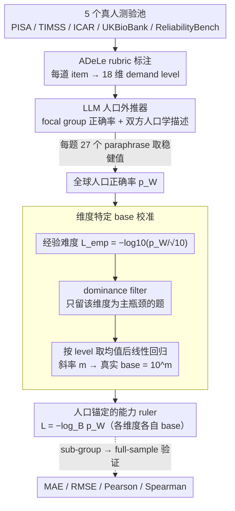

# From Human-Level AI Tales to AI Leveling Human Scales

**会议**: ICML 2026  
**arXiv**: [2602.18911](https://arxiv.org/abs/2602.18911)  
**代码**: 无  
**领域**: AI 评测 / 心理测量  
**关键词**: AI evaluation, psychometrics, ADeLe, world population calibration, LLM as annotator

## 一句话总结
本文用 LLM 当人口外推器，把 18 个能力维度按"全世界人口正确率"对数刻度 $L=-\log_B p_W$ 校准，并发现 Volume / Attention 维度真实 base $B \gg 10$、Comprehension 维度 $B \approx 1$，揭示现行 AI 与人类的比较其实严重失调。

## 研究背景与动机

**领域现状**：AI 评测主流是 benchmarking——用单一 benchmark 平均分对比"人类水平"。这种做法把不同任务难度、不同样本人群、不同维度能力压成一个数字，于是矛盾结论遍地：LLM 在 MMLU 90% 但在真实软件工程任务 50-70%；GPQA Diamond 上 PhD 70%、模型 88%。

**现有痛点**：（1）benchmark 之间不可比，"人类水平"完全依赖采样的 reference 人群（多为 WEIRD：Western / Educated / Industrialized / Rich / Democratic）；（2）现有 ADeLe 等 criterion-referenced 框架虽给了维度级 rubric 但 base 取 $B=10$ 是约定不是校准，跨维度仍不可比；（3）大规模真人测量极贵、不可能在新出现的 benchmark 上现做。

**核心矛盾**：要"以人类为参照"必须用人类样本，但能拿到的人类样本永远是有偏小子集；若不校准就直接比较，"超越人类"或"不及人类"的结论完全是 sample-dependent 的。

**本文目标**：（1）把 benchmark item 标到 ADeLe 18 维 demand level；（2）把任意小样本人类成绩外推到全球人口（WWP）；（3）按 WWP 正确率反推每个维度真实的 logarithmic base；（4）验证整套外推可靠。

**切入角度**：心理测量学早有 equating / post-stratification 处理小样本到大样本的外推；现代 LLM 训练数据里压缩了海量人口与人口学知识，可以当一个廉价、可重复的人口外推器。

**核心 idea**：用 LLM 把"focal-group 成功率 + 该组人口学描述 + 目标群体人口学描述"翻译为"目标群体成功率"，然后对每个能力维度做线性回归得到真实 base $B = 10^m$，建立人口学锚定的能力 ruler。

## 方法详解

### 整体框架
这套方法想回答一个被 benchmark 掩盖的问题：当我们说"AI 达到人类水平"，到底是哪批人类、哪个维度上的水平。它把一道题的成绩沿两条轴重新锚定——先用 ADeLe rubric 把每道 item 拆成 18 个能力维度的 demand level，再用 LLM 把题目在某个小样本人群上的实测正确率外推到"全世界人口"的正确率，最后按维度各自校准的对数刻度把正确率翻译成可比的难度值。整条 pipeline 从五个真人测验池（PISA 2009 / TIMSS 2003+2011 G4&G8 / ICAR / UKBioBank / ReliabilityBench）取 item，标 demand level $d_{i,c}\in\{0,1,2,3,4,5+\}$，外推得到全球人口正确率 $p_i^W$，按 $L_i=-\log_B p_i^W$ 转成对数难度，再用 sub-group → full-sample 的预测做验证。

### 关键设计

**1. LLM 当人口外推器：把小样本正确率翻译成全球人口基准**

经典心理测量要拿到"全人类"的难度锚点，得做大规模真人施测，新出现的 benchmark 根本等不起，更别说人能拿到的样本永远是有偏小子集（多为 WEIRD：Western/Educated/Industrialized/Rich/Democratic）。本文的赌注是：LLM 训练数据里压缩了海量人口学统计，可以当一个便宜、可重复、还能审计的人口外推器。具体做法是给 LLM 喂一个含 6 块信息的 prompt——数据集与测试 domain 简介、focal group 的人口学描述（如"2009 PISA 的 15 岁 OECD 学生"）、题干加选项加正确答案、focal group 实测正确率 $p_i^g$、reference group（全世界人口）的人口学描述，最后请它输出 reference group 的预测正确率 $\hat p_i^W$ 并附 rationale。prompt 里显式点名 7 类要它考虑的调整因素：全球年龄分布、教育可达性与质量、毕业后遗忘、流体/晶体能力的寿命曲线、专业化与暴露、健康与认知衰退、语言因素。为了防止结论被措辞带偏，每道题再跑 27 个 paraphrase 版本做 robustness。

**2. 维度特定的 base 校准：每个能力维度有自己的难度陡度**

ADeLe 这类 criterion-referenced 框架给了维度级 rubric，但对数刻度的 base 一律取 $B=10$，这是约定而非校准——它默认所有维度从 level 1 到 level 2 难度都涨同样的倍数，结果"AI 在知识维度超人类"和"AI 在推理维度不及人类"这两句话压根没在同一把尺子上，无法横向比。本文改成让数据自己说话：先算每道题的经验难度 $L_{\text{emp},i}=-\log_{10}(p_i^W/\sqrt{10})$，再按 level $l\in\{1,\dots,5\}$ 取均值 $\bar y_l$，对 $(l,\bar y_l)$ 做线性回归，斜率 $m$ 反推出该维度真实的 $B=10^m$。校准出来的 base 自然分成三类：高 base（Volume $B\approx 32$、Attention $B\approx 17$，难度随 level 涨得比标注预期陡得多）、标准（Metacognition $B\approx 6.7$、Knowledge $B\approx 5.1$，和 $B=10$ 接近）、不变（Comprehension/Spatial $B\approx 1$，level 升高几乎不改变难度）。把各维度校到各自的真实陡度，才算把不同 ruler 折算到同一单位。

**3. Dominance filter 加 means-based 回归：从多瓶颈题里抠出纯维度信号**

一道题往往同时压几个维度，直接拿它回归某个维度会被别的瓶颈污染；而且数据里 level 1 的题几乎挤满、高 level 的题寥寥，raw 点回归会被低 level 的海量样本把斜率压平。本文用两步对冲：dominance filter 只保留 $d_{i,c}\ge\max_k d_{i,k}$ 的 item——即维度 $c$ 正好是这道题主要瓶颈的那些题——用来回归该维度，排除其它瓶颈的干扰；再把这些题按 level 取均值后才回归，用 5 个均值点拟合一条直线，斜率即 $\log_{10}B$，避免低 level 的数量优势绑架斜率。这是在"高 level 样本稀少"和"想要无偏斜率"之间的一个 fair-weight 妥协。

### 验证设置
全程无训练。外推器用 GPT-5 Chat、GPT-4.1、Llama-4、DeepSeek-v3.1、GROK-3 共 5 个商用模型，低温度、不调工具，每题跑 27 个 paraphrase。可靠性靠 ICAR、TIMSS、UKBioBank 的 sub-group → full-sample 设计验证：先让 LLM 从某个 sub-group 的成绩外推到 full sample，再拿外推值和 full sample 真实成绩比 MAE / RMSE / Pearson / Spearman。

## 实验关键数据

### 主实验（验证 LLM 外推质量）

| 模型 | ICAR MAE ↓ | ICAR RMSE ↓ | ICAR Pearson ↑ | ICAR Spearman ↑ |
|------|------------|--------------|----------------|------------------|
| gpt-5-chat | **0.030** | **0.044** | **0.976** | **0.968** |
| llama-4 | 0.033 | 0.052 | 0.971 | 0.963 |
| gpt-4.1 | 0.040 | 0.058 | 0.958 | 0.944 |
| deepseek-v3.1 | 0.043 | 0.085 | 0.922 | 0.914 |
| grok-3 | 0.043 | 0.068 | 0.939 | 0.920 |

TIMSS 上 MAE 升到 $0.12$-$0.16$、Pearson 跌到 $0.5$-$0.7$，体现跨国异质性更大时外推更困难。

### 消融实验（维度特定 base 校准）

| 维度组 | 校准后 $B$ | 解读 |
|--------|------------|------|
| Volume | $\approx 32$ | 远比 $B=10$ 陡；高 level 需被上推 |
| Attention | $\approx 17$ | 同上 |
| Metacognition | $\approx 6.7$ | 与 $B=10$ 接近，标定良好 |
| Knowledge | $\approx 5.1$ | 同上 |
| Comprehension & Expression | $\approx 1$ | 难度近乎不增，应下推 level |
| Spatial Reasoning & Navigation | $\approx 1$ | 同上 |

### 关键发现
- 单一 $B=10$ 跨维度不成立——Volume 和 Comprehension 的真实 base 相差约 $30\times$，意味着"AI 在 Knowledge 维度领先人类"和"AI 在 Volume 维度仍远不如人类"的程度，若不校准就完全没法比。
- LLM 外推在结构均质的 ICAR 上 MAE 仅 $0.030$（Pearson 0.976），证明 LLM 确实压缩了相当多人口学先验；但在 TIMSS 这类跨 60 国异质数据上误差陡升，说明 LLM 仍带 Western 偏置。
- 当对各维度采用各自校准 base 后，现行 LLM 的 capability profile 出现明显"Knowledge 强、Volume / Attention 弱"的形状，给政策制定者更可解释的对比。

## 亮点与洞察
- 把"AI 比人类"这件常被滥用的事，从"benchmark 分数对比"重新定义为"人口分布对数刻度上的位置"，是评测哲学层面的提案。
- 用 LLM 当人口外推器是巧妙的"以 AI 校准 AI 比较人类"的循环，作者用 sub-group → full-sample 验证证明它确实学到了 demographic 调整能力。
- 维度特定 base 校准结果（Volume $\approx 32$、Comprehension $\approx 1$）直接动摇了过去几年所有"AI 达到人类水平 X%"的标量结论，是有冲击力的负面发现。

## 局限与展望
- 仅 5 个数据源，且全为 text-only；多模态、agentic 任务都未覆盖。
- LLM 外推器在 TIMSS 上 MAE 偏大、Western / Anglosphere 偏置明显；非西方文化的人口估计可能系统偏差。
- 假设 dominance filter 足以"纯化"维度信号，但实际 item 可能多瓶颈共存，过滤掉的样本可能本身有价值。
- 校准 base 用 5 个 mean 点做线性回归，统计显著性较弱，对一些维度（如 Mind Modeling）甚至给出负斜率。

## 相关工作与启发
- **vs ADeLe (Zhou 2025)**：ADeLe 给 demand rubric 但 $B=10$ 是约定；本文做实证校准。
- **vs METR time-horizon (Kwa 2025)**：单维度人类小时数 anchor；本文给多维度人口分布 anchor。
- **vs IRT psychometrics**：经典 IRT 要密集真实回答数据；本文用 LLM 跳过这一步。
- **vs MMLU / GPQA**：标量准确率 + 单一 reference 人群；本文给可分解可比较的 profile。

## 评分
- 新颖性: ⭐⭐⭐⭐⭐ "LLM 当人口外推器 + 维度特定 base 校准"是少见的方法学创新。
- 实验充分度: ⭐⭐⭐ 数据源仅 5 个且 text-only，TIMSS 上误差偏大，cross-cultural 验证不充分。
- 写作质量: ⭐⭐⭐⭐ Motivation 写得很有冲击力，技术叙述清晰。
- 价值: ⭐⭐⭐⭐⭐ 对 AI 评测社区是范式级反思，policy-maker 和研究者都应该读。

<!-- RELATED:START -->

## 相关论文

- [\[ACL 2025\] ChatBench: From Static Benchmarks to Human-AI Evaluation](../../ACL2025/llm_evaluation/chatbench_from_static_benchmarks_to_human-ai_evaluation.md)
- [\[ACL 2025\] CulturalBench: A Robust, Diverse, and Challenging Cultural Benchmark by Human-AI CulturalTeaming](../../ACL2025/llm_evaluation/culturalbench_a_robust_diverse_and_challenging_cultural_benchmark_by_human-ai_cu.md)
- [\[ICML 2026\] When AI Benchmarks Plateau: A Systematic Study of Benchmark Saturation](when_ai_benchmarks_plateau_a_systematic_study_of_benchmark_saturation.md)
- [\[ACL 2026\] HoWToBench: Holistic Evaluation for LLM's Capability in Human-level Writing using Tree of Writing](../../ACL2026/llm_evaluation/howtobench_holistic_evaluation_for_llms_capability_in_human-level_writing_using_.md)
- [\[ICLR 2026\] AstaBench: Rigorous Benchmarking of AI Agents with a Scientific Research Suite](../../ICLR2026/llm_evaluation/astabench_benchmarking_ai_agents.md)

<!-- RELATED:END -->
