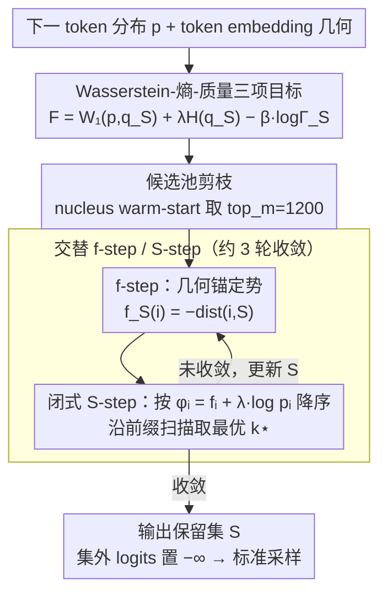

# Top-W: Geometry-Aware Decoding with Wasserstein-Regularized Truncation and Mass Penalties for LLMs

**会议**: ICML 2026  
**arXiv**: [2602.10346](https://arxiv.org/abs/2602.10346)  
**代码**: https://github.com/arashgholami/top-w-decoding (有)  
**领域**: LLM 解码 / 评测 / 推理时控制  
**关键词**: 截断解码, Wasserstein 距离, token embedding 几何, 熵约束, 高温稳健性

## 一句话总结
Top-W 把 next-token 截断写成"考虑 token embedding 几何的 Wasserstein-熵-质量"三项最小化问题，理论证明最优解要么是单 token、要么是按 $f(i)+\lambda\log p_i$ 排序的前缀，工程实现只是 $O(n\log n)$ 的扫描；在 GSM8K、GPQA、AlpacaEval、MT-Bench 上 15 个 (T, model) 组合多数胜出，高温下 GSM8K 比 Top-H 最多再提 33.7%。

## 研究背景与动机

**领域现状**：LLM 解码的截断采样早已成为基础设施——Top-$k$、Top-$p$ (nucleus)、Min-$p$、locally typical sampling 都从"概率排序"角度裁掉低概率尾部；近期 Top-$H$ 把"裁出来子分布的熵不超过阈值"显式作为约束，是首批从"分布塑造"视角入手的工作。

**现有痛点**：所有这些规则都把 token 当作无结构类别——只看概率，看不到 token 在 embedding 空间里的语义距离。结果：(i) 高温度时（$T\geq 1.5$）Top-$p$ / Min-$p$ 频繁拉到几乎整词表，输出崩坏；(ii) 即便加了熵控制（Top-$H$），仍可能把概率集中在同义/近义的近邻 token 上，"伪多样性"而失去真创造力。

**核心矛盾**：解码器要平衡 (i) faithfulness（不能太远离原分布），(ii) creativity（要够 diverse），(iii) coherence（不能裁太多质量）。前两者本质上要在 token 几何空间里衡量，但所有现成 sampler 都跳过了几何信息。

**本文目标**：把 token embedding 几何"显式"塞进截断目标，给出一个既有理论闭式、又能用 logits-processor 接口部署、对温度稳健的几何感知 sampler。

**切入角度**：作者从最优传输 (OT) 视角看截断——把"截断 + 重归一"看作把原分布 $p$ 运输到一个支撑在 $S$ 上的 $q_S$，自然引入 Wasserstein-$1$ 距离 $W_1(p,q_S)$ 作为 faithfulness 项，且 $W_1$ 可用 token embedding 上的 Mahalanobis 距离做地面成本。

**核心 idea**：用"$W_1$（几何） + $\lambda H(q_S)$（创造力） − $\beta\log\Gamma_S$（质量）"三项的最优化定义最佳截断集，并证明这个问题有"前缀 / 单 token"的结构性解。

## 方法详解

### 整体框架
Top-W 是一个推理时的截断采样器：每生成一个 token，它不再像 Top-$k$/Top-$p$ 那样只按概率裁尾，而是把"保留哪些候选 token"写成一个带 token embedding 几何的最优化问题，求出最优保留集 $S$ 后再把集合外的 logits 置 $-\infty$ 走标准采样。整个流程是：拿到下一 token 分布 $p\in\Delta^{|V|}$ 和 token embedding 几何后，对候选集 $S$ 定义目标 $F_{\lambda,\beta}(S)=W_1(p,q_S)+\lambda H(q_S)-\beta\log\Gamma_S$（几何忠诚 + 创造力 + 质量三项）；由于 $W_1$ 在词表规模上直接优化不可解，作者用 Kantorovich-Rubinstein 对偶把它换成距离查询，再交替更新势函数 $f$ 与保留集 $S$，3-4 轮收敛即得 $S$。

### 关键设计

**1. Wasserstein-熵-质量三项目标：把语义几何塞进截断**

传统截断（Top-$k$/$p$/Min-$p$）把 token 当无结构类别，只看概率排序，于是"近义同义词聚团"和"语义孤岛 outlier"被一视同仁——高温下要么把概率堆在同义近邻上变成伪多样，要么拉到几乎整词表导致崩坏。Top-W 的做法是给截断目标显式加一个几何项：$F_{\lambda,\beta}(S)=W_1(p,q_S)+\lambda H(q_S)-\beta\log\Gamma_S$，其中 $W_1(p,q_S)$ 是把原分布 $p$ 运输到支撑在 $S$ 上的截断重归一分布 $q_S$ 所需的 Wasserstein-$1$ 距离（地面成本取 token embedding 上的 Mahalanobis 距离），$H(q_S)$ 控创造力，$\Gamma_S=\sum_{i\in S}p_i$ 是保留质量。关键是论文证明了一个精确分解 $W_1(p,q_S)=(1-\Gamma_S)\,W_1(p(\cdot|S^c),p(\cdot|S))$，把"删掉了多少质量"和"删掉的那部分离保留集有多远"两件事分离开。这样一来，一个高概率但与保留集语义很远的 token 会被强烈惩罚（避免裁掉同义近邻反而留下噪声），而一个低概率但贴近保留集的 token 反倒可能被纳入 $S$——几何忠诚而非纯概率忠诚，这正是高温稳健的来源。

**2. 几何锚定势 + 闭式 S-step：把不可解的 OT 换成一次排序加扫描**

$W_1$ 在 $|V|\sim 10^5$ 的词表上做线性规划完全不现实，必须找替身。作者用 KR 对偶 $W_1=\sup_{f\in\mathcal{F}}(\mathbb{E}_p[f]-\mathbb{E}_{q_S}[f])$，并把势固定成 anchored potential $f_S(i)=-\mathrm{dist}(i,S)$——它是所有 anchored 1-Lipschitz 函数里"最吸引"的那个，等价于给"离当前保留集越远的 token"打越负的分，从而既满足可行性又最大化攻击性。固定 $f$ 后，截断子问题就有了闭式解：$\arg\min_S F$ 等价于 $\arg\max_S G_f(S)=\frac{1}{\Gamma_S}\sum_{i\in S}p_i\phi_i(f)+(\beta-\lambda)\log\Gamma_S$，其中混合分数 $\phi_i(f)=f_i+\lambda\log p_i=-\mathrm{dist}(i,S)+\lambda\log p_i$ 把"几何距离"和"对数概率"线性合在一起。论文进一步证明（定理 3.4）这个 $G_f$ 的最优解只有两种结构：若 $\beta\geq\lambda$，最优 $S$ 必是按 $\phi_i$ 降序排序后的某个**前缀**；若 $\beta\leq\lambda$，最优 $S$ 退化为**单 token**。这把原本 $2^{|V|}$ 的组合搜索一举降到 1D 前缀扫描，整个采样器的额外成本只是一次排序加一次扫描。

**3. 交替 f-step / S-step + 候选池剪枝：不显式解 OT 也能逼近联合最优**

势 $f$ 依赖当前的 $S$，$S$ 又依赖 $f$，所以要交替迭代逼近联合最优。每一轮 alt 循环做三步：(i) 用当前 $S^{(t)}$ 算势 $f^{(t)}_i=-\mathrm{dist}(i,S^{(t)})$；(ii) 按 $\phi_i^{(t)}$ 降序排序，沿前缀扫描目标 $J_k=\Phi_k/\Gamma_k+(\beta-\lambda)\log\Gamma_k$ 取使其最大的 $k^\star$ 作为新的 $S^{(t+1)}$；(iii) 收敛即停，实测 3 轮足够。为了不在全词表上算 Mahalanobis 距离，先用 nucleus warm-start 把候选限制到 top_m$=1200$ 的候选池，论文附录给出"剪枝后仍保持精确"的充分条件。这样每个 token 只需毫秒级开销，整体比 Top-$H$/Top-$p$/Min-$p$ 平均只慢 5.4%，几何感知没有变成吞吐杀手。

### 损失函数 / 训练策略
本文是推理时方法，无训练；唯一超参 $(\lambda,\beta)$ 默认 $(2.2,2.8)$。当 $\beta>\lambda$ 时进入前缀区间，可通过升降 $\beta$ 在 sharpness（更准）↔ creativity（更多样）之间连续滑动。

## 实验关键数据

### 主实验
3 个 LLM（Qwen2.5-3B、LLaMA-3.1-8B-Inst、Phi-3-Mini）× 5 个温度 $T\in\{0.5,0.7,1.0,1.5,2.0\}$，共 15 组合：

| Benchmark | Top-W 胜场 | 最大相对提升 vs Top-H | 备注 |
|-----------|-----------:|----------------------:|------|
| GSM8K     | 13/15 | **+33.7%**（$T=2.0$） | 高温下 baselines 几乎崩 |
| GPQA      | 12/15 | 普遍 1-3 点 | 全 3 模型 $T\in\{1.5,2.0\}$ 都赢 |
| AlpacaEval| 12/15 | judge 评分稳赢 | length-controlled win-rate |
| MT-Bench  | 8/15  | 多轮一致性更好 | 高温保不漂移 |

GSM8K 在 $T=2.0$ 上：Top-W 75.13% / 73.09% / 84.63%，而 Top-$p$ 跌到 9.10% / 2.65% / 7.73%。

### 消融实验

| 配置 | GSM8K@T=2.0 (LLaMA) | 说明 |
|------|--------------------:|------|
| $\beta>\lambda$（前缀区间） | 73.09 | 默认设置 |
| $\beta\leq\lambda$（singleton） | 显著下降 | 退化为单 token |
| $\beta$ 过大 | 创造力 ↑ 但 GSM8K ↓ | 留太多 mass |
| Top-W (creative rubric $\beta=2.8$) | 27 设置赢 12 | 比 Top-$p$/Top-$H$/Min-$p$ 平均高 |

### 关键发现
- **几何 + 熵 + 质量三项缺一不可**：仅有质量项 → Top-$k$；仅有熵 → Top-$H$；加入几何后高温稳健性质变。
- **$\beta$ 是"创造力 ↔ 准确率"调节器**：rubric 评测（Diversity/Originality/Narrative/Emotion/Imagery 5 维）显示提高 $\beta$ 创造力升、严格答案分降；为不同任务可分别调。
- **统一视角**：论文证明在 0-1 uniform metric 下 Top-W 退化成 Top-$k$（加 $\lambda=\beta=0$）或 Top-$H$（$\beta=0$ 的 Lagrangian 松弛），把现有 sampler 纳入同一框架。
- **运行开销可控**：3 轮 alt × top_m=1200，每 token 约 ms 级，比 Top-$p$ 慢 5.4%——几何感知不是吞吐杀手。

## 亮点与洞察
- **结构性最优解的发现**：Theorem 3.4 把组合搜索 $2^{|V|}$ 降到 1D 扫描，对任何"加权平均 + 凹凸 mass 项"的截断目标都可复用，是个一般性技巧。
- **OT 视角统一截断 sampler**：把 Top-$k$/$p$/$H$ 都看成 $W_1$+熵+mass 不同特例，给后续解码研究一个统一坐标系。
- **anchored potential 的"白名单"思路**：用 1-Lipschitz 包络做替身，避开 LP 求解，是把 OT 落地工程的关键妙手；这种"用 distance-to-set 当势"的招式对其他 OT-on-discrete 问题也有借鉴价值。
- **以"温度稳健性"作为新评测维度**：以前 sampler 论文很少在 $T=2.0$ 报告，本文系统地展示了几何感知截断的高温抗崩盘能力，是评测范式上的进步。

## 局限与展望
- $W_1$ 用 token embedding Mahalanobis 距离作 ground cost，但 LLM 的 embedding 实际并不严格反映"语义距离"——多义词、复合 token、罕用 token 可能误导几何。
- 候选池 top_m=1200 是经验值，对超大词表（>200k）或代码 token 仍可能漏掉远但合理的 token。
- $(\lambda,\beta)$ 需要事先按任务调；论文给了 sensitivity 但没自动化方案，工业部署仍需调参。
- 实验集中在 instruction-tuned 模型 + QA / chat 场景，对 code generation、long-context summarization 等任务的效果未验证。

## 相关工作与启发
- **vs Top-$k$ / nucleus / Min-$p$**: 都只看概率排序；Top-W 在概率排序外加几何修正，理论上含前者为特例，性能上高温下显著更稳。
- **vs Top-$H$ (bounded-entropy)**: 也是"分布塑造"视角，但 Top-$H$ 不看几何；Top-W 用 $W_1$ 把同义近邻视为冗余，避免"伪多样"。
- **vs Contrastive decoding / DoLa**: 后者通过对比不同模型/层调节分布；Top-W 不需要参考模型，只用单模型 + embedding 几何，开销更低。
- **可迁移启发**：把"截断"看成"分布到分布的运输"是个跨界思路，对约束生成（COMET-based MT、RAG re-ranking）和 safety filtering 都能套用；闭式前缀解的证明也启发更多组合采样问题尝试"按混合 score 排序后扫描"的简单结构。

## 评分
- 新颖性: ⭐⭐⭐⭐⭐ 首次把 token embedding 几何 + OT 视角带进截断 sampler，并证明结构性最优解。
- 实验充分度: ⭐⭐⭐⭐ 4 个 benchmark × 3 模型 × 5 温度共 60 组合 + rubric 创作评测 + 运行开销分析，覆盖充分；但缺代码生成等场景。
- 写作质量: ⭐⭐⭐⭐ 证明排版清晰、算法伪代码完整；少数符号（$\phi,c,\beta-\lambda$）来回切换略费脑。
- 价值: ⭐⭐⭐⭐⭐ 解码侧免训练即插即用且对高温稳健，是直接可用的 deployment 级别提升。

<!-- RELATED:START -->

## 相关论文

- [\[ICML 2026\] Spherical Steering: Geometry-Aware Activation Rotation for Language Models](spherical_steering_geometry-aware_activation_rotation_for_language_models.md)
- [\[ACL 2026\] Pressure-Testing Deception Probes in LLMs: Scaling, Robustness, and the Geometry of Deceptive Representations](../../ACL2026/llm_evaluation/pressure-testing_deception_probes_in_llms_scaling_robustness_and_the_geometry_of.md)
- [\[ICLR 2026\] Unpacking Human Preference for LLMs: Demographically Aware Evaluation with the HUMAINE Framework](../../ICLR2026/llm_evaluation/unpacking_human_preference_for_llms_demographically_aware_evaluation_of_long-fo.md)
- [\[ACL 2026\] Contrastive Decoding Mitigates Score Range Bias in LLM-as-a-Judge](../../ACL2026/llm_evaluation/contrastive_decoding_mitigates_score_range_bias_in_llm-as-a-judge.md)
- [\[ECCV 2024\] Gradient-Regularized Out-of-Distribution Detection](../../ECCV2024/llm_evaluation/gradient-regularized_out-of-distribution_detection.md)

<!-- RELATED:END -->
