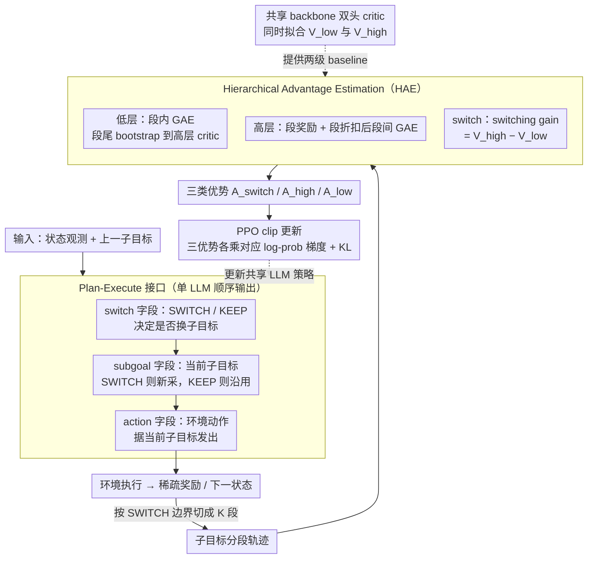

# HiPER: Hierarchical Reinforcement Learning with Explicit Credit Assignment for Large Language Model Agents

**会议**: ICML 2026  
**arXiv**: [2602.16165](https://arxiv.org/abs/2602.16165)  
**代码**: 论文提供 Project Page 与 Code 链接（具体仓库地址见原文）  
**领域**: 强化学习 / LLM Agent / 分层 RL  
**关键词**: 分层强化学习, Plan-Execute, Credit Assignment, Long-horizon Agent, GAE

## 一句话总结
HiPER 把 LLM agent 的扁平 RL 改造成"高层规划子目标 + 低层执行原子动作"的两级 Plan-Execute 结构，并配套提出 Hierarchical Advantage Estimation (HAE) 把 GAE 沿子目标段切开做有界差分耦合的优势估计，在 ALFWorld / WebShop 上分别拿到 97.4% / 83.3% 成功率（Qwen2.5-7B），相对最强基线 GiGPO 提 +6.6% 与 +8.3%。

## 研究背景与动机
**领域现状**：把 LLM 训成交互式 agent 现在主流走 on-policy RL（PPO / GRPO / RLOO / GiGPO 这一类），policy 一律建模成 *flat policy*——单一时间尺度，每个 turn 看观测吐一个动作 token 序列。

**现有痛点**：在 long-horizon、sparse-reward 任务上扁平策略很吃亏。一条轨迹可能要走几十 turn、几万 token 才拿到一个稀疏的成功奖励，扁平 RL 必须靠这个末端信号一路反向传播去给每个 turn 分功劳，credit assignment 噪声极大、训练抖、最终性能离 ceiling 还差一截。ALFWorld 里 Pick2 / Look 这类必须按序完成多个子任务的 task 上，PPO/GRPO/GiGPO 都明显比单子任务 (Pick) 掉点。

**核心矛盾**：作者观察到成功轨迹其实**隐含**了一种分层结构——动作天然成段、每段对应一个子目标（先找杯子、再洗杯子、再放进柜子），但扁平 RL **既不显式表达也不显式优化**这种结构，于是子目标组织永远停留在轨迹的隐式纹理里，agent 就经常出现"洗到一半跑去开柜子"这种半途而废的脆性行为。

**本文目标**：(1) 把这种隐式分层结构显式化，让 agent 在 prompt 层面就分出"规划"和"执行"两类决策；(2) 设计能配得上这种分层结构的 credit assignment，让稀疏奖励能在两级之间有效传播。

**切入角度**：经典 HRL 的 options framework（Sutton 1999）天然就是 "高层选 option + 低层执行" 的两级 semi-MDP，但 Option-Critic 那一脉是给固定离散 option 集设计的，没法直接照搬到 LLM 这种开放词汇子目标场景；而且经典 HRL 通常把两级当**平行的**两套 target 训练，没处理两级之间的耦合。

**核心 idea**：让一个共享 LLM 同时承担 switch / subgoal / action 三种决策（靠 auto-regressive 自动条件化），然后用一套**沿子目标段切片、边界处互相 bootstrap** 的 GAE 变体（HAE）把两级优势耦合起来训练。

## 方法详解
### 整体框架
HiPER 把一个共享 LLM 同时当成"高层规划器"和"低层执行器"：每个 turn 它先决定要不要换子目标、当前子目标是什么，再据此发出环境动作；训练时把整条轨迹按"换子目标"的时刻切成若干段，给低层动作、高层子目标、二元 switch 决策各算一份优势，三类优势分别乘对应的 log-prob 梯度一起更新。整套东西落在两个组件上——一个把"分层"写进 prompt 的 Plan-Execute 接口，一个把"稀疏奖励沿两级传播"做对的 HAE 优势估计——前者负责让结构显式存在、后者负责让它被有效优化。

形式化的策略梯度（Theorem 4.1）把这三件事写成一行：

$$\nabla_\theta J = \mathbb{E}\Big[\sum_t \nabla\log\pi(q_t|s_t,o_{t-1})\,A^{\mathrm{switch}}_t + q_t\,\nabla\log\pi(o_t|s_t)\,A^{\mathrm{high}}_t + \nabla\log\pi(a_t|s_t,o_t)\,A^{\mathrm{low}}_t\Big]$$

注意 subgoal 那一项前面乘了 $q_t$（SWITCH 时为 1、KEEP 时为 0），保证只有真正"决定换 subgoal"的 turn 才回传 high-level 梯度——这是整个 Plan-Execute 因子化能成立的关键。

### 关键设计

**1. Plan-Execute 接口：把"分层"从隐式纹理变成可学的 token 模式**

扁平 RL 的痛点是成功轨迹里那种"先找杯子、再洗杯子、再放柜子"的分段结构只活在轨迹的隐式纹理里，agent 既不表达也不优化它，于是经常半途而废。HiPER 的做法直接而便宜：复用 ReAct 模板再加两个字段，把单个 LLM 每个 turn 的输出强制拆成 `<switch>SWITCH/KEEP</switch>` + `<subgoal>...</subgoal>` + `<action>...</action>` 三段 XML 块，让 agent 自己决定何时换 subgoal、当前 subgoal 是什么、要发什么动作。靠 LLM 的 auto-regressive 顺序，switch / subgoal / action 三个分布天然按 $\pi_\theta(q_t|s_t,o_{t-1})\,\pi_\theta(o_t|s_t)\,\pi_\theta(a_t|s_t,o_t)$ 因子化——SWITCH 时新采 $o_t \sim \pi_\theta(\cdot|s_t)$，KEEP 时直接令 $o_t = o_{t-1}$；子目标和动作全程**动态决定**，没有"事先排好一整串 subgoal 再死板执行"那一套。这样一来"开放词汇子目标"就能被一个 LLM 表达和优化，绕开了 options framework 必须预先定义离散 option 集的限制，同时顺手给下一步的分层 credit assignment 标好了段边界，**不需要再单独训两个网络**。

**2. Hierarchical Advantage Estimation：两级 GAE + 边界 bootstrap 把稀疏奖励切片传播**

光有分层结构还不够——消融里 GRPO 套上 Plan-Execute prompt 几乎不涨，说明分层必须配上分层的 credit assignment 才释放红利，HAE 就是为此而生。它在 SWITCH 边界 $0=b_0<b_1<\dots<b_K=T$ 把轨迹切成 $K$ 段，然后同时算三份优势。低层在每段 $[b_k,b_{k+1}-1]$ 内做 GAE，TD 残差 $\delta^{\mathrm{low}}_t = r_t + \gamma V^{\mathrm{next}}_t - V^{\mathrm{low}}(s_t,o_k)$；关键 trick 在段尾——最后一个 turn 的 bootstrap 目标不接自己下一步，而是切到高层 critic $V^{\mathrm{next}}_{b_{k+1}-1}=V^{\mathrm{high}}(s_{b_{k+1}})$，这条 boundary-aware bootstrapping 就是把两级 value 粘成一条信号链的胶水。高层则把每段压成一个 macro-step——段奖励 $\tilde r_k=\sum_{t=b_k}^{b_{k+1}-1}\gamma^{t-b_k}r_t$、段折扣 $\tilde\gamma_k=\gamma^{b_{k+1}-b_k}$——再在段间做 GAE。Switch 决策则用一个状态级 switching gain $\delta^{\mathrm{switch}}_t = V^{\mathrm{high}}(s_t)-V^{\mathrm{low}}(s_t,o_{t-1})$ 衡量"换 subgoal 比继续用 $o_{t-1}$ 好多少"，配上中心化估计 $\hat A^{\mathrm{switch}}_t = (q_t-\beta_t)\,\delta^{\mathrm{switch}}_t$ 给这个稀有的二元决策反传一个可解释的梯度方向。这套切片设计同时拿到三个好处：段内 GAE 让 fine-grained credit 不跨子任务互相污染、边界处 low→high 的 bootstrap 解决了经典 option-critic 把两级当独立 target 训练的耦合缺失、switching gain 直接用两个 critic 的差当 advantage 避免了 binary policy 的退化。作者还证明了 HAE 在 $\lambda=1$ 且 critic 精确时**无偏**，且当 subgoal/boundary 携带超过 state 的额外信息时**方差严格小于** flat GAE。

**3. 共享 backbone 双头 critic + PPO clip 更新：理论上要两个 baseline，实现上只多一个 head**

HAE 名义上需要 $V^{\mathrm{low}}(s,o)$ 和 $V^{\mathrm{high}}(s)$ 两个 value baseline，但 HiPER 不为此开两个独立 critic，而是用一个共享 backbone 加两个输出 head 同时拟合两级 value：高层 head 对 $y^{\mathrm{high}}_k = \tilde r_k + \tilde\gamma_k\,\mathrm{sg}(V^{\mathrm{high}}_\phi(s_{b_{k+1}}))$、低层 head 对 $y^{\mathrm{low}}_t = r_t + \gamma\,\mathrm{sg}(\hat V^{\mathrm{next}}_t)$ 做 MSE 回归，其中 $\hat V^{\mathrm{next}}$ 在段末同样切换成 $V^{\mathrm{high}}$——也就是说低层 critic 的训练 target 在段末 bootstrap 到高层 critic，和优势估计里的耦合方式严格一致，两级 value 不会自相矛盾。actor 走标准 PPO clip 目标，三类优势各乘对应 log-prob 梯度，外加 KL 正则控制 policy drift。相对标准 PPO，这套做法只多一个 head、显存开销几乎可忽略。

### 损失函数 / 训练策略
- 策略：PPO-style clipped surrogate，三类决策（switch / subgoal / action）共享同一个 ratio，但各自乘对应优势 $A^{\mathrm{switch}}, A^{\mathrm{high}}, A^{\mathrm{low}}$；带 KL 正则。
- Critic：单 backbone 双 head，对低/高两个 head 分别做 bootstrap MSE，损失见 (12)(15)。
- 训练循环：rollout → 计算 HAE → 算 actor/critic loss → PPO 更新（详见 Algorithm 1）。
- 评测：Qwen2.5-1.5B / 7B Instruct，总 150 epoch，与 GiGPO 对齐。

## 实验关键数据

### 主实验（ALFWorld 6 类任务 + WebShop，3 seed 平均）

| 模型 / 方法 | ALFWorld All ↑ | WebShop Score ↑ | WebShop Succ. ↑ |
|---|---|---|---|
| Qwen2.5-1.5B Base | 8.3 | 25.1 | 5.5 |
| 1.5B +PPO | 68.2 | 73.8 | 51.5 |
| 1.5B +GRPO | 71.1 | 75.8 | 56.8 |
| 1.5B +GiGPO（最强基线） | 86.7 | 83.5 | 67.4 |
| **1.5B +HiPER** | **95.3** (+8.6) | **85.7** (+2.2) | **71.4** (+4.0) |
| Qwen2.5-7B Base | 14.1 | 46.2 | 19.5 |
| 7B +PPO | 82.8 | 81.4 | 68.7 |
| 7B +GRPO | 85.4 | 79.3 | 66.1 |
| 7B +GiGPO（最强基线） | 90.8 | 86.2 | 75.2 |
| **7B +HiPER** | **97.4** (+6.6) | **92.2** (+6.0) | **83.3** (+8.1) |

特别值得看的是 ALFWorld 子类拆解：在最难、必须串联多个子任务的 Pick2 上 7B HiPER 拿到 95.5（GiGPO 79.2），Look 84.8（GiGPO 82.7），Cool 100.0（GiGPO 89.3）——HiPER 把扁平基线掉点最严重的几类拉得最高。

### 消融实验：Plan-Execute prompt 与 HAE 各自贡献多少？（ALFWorld, Qwen2.5-1.5B）

| 配置 | ALFWorld All | 说明 |
|---|---|---|
| Base Model (ReAct) | 8.3 | 扁平 prompt 起点 |
| PPO (ReAct) | 68.2 | 扁平 baseline |
| GRPO (ReAct) | 71.1 | 扁平 baseline |
| GiGPO (ReAct) | 86.7 | 扁平最强基线 |
| Base Model (Plan-Execute prompt) | 2.9 | 直接套 PE 模板 zero-shot 反而更差 |
| PPO + Plan-Execute prompt | 81.3 (+13.1) | PE prompt 给 PPO 已经能大涨 |
| GRPO + Plan-Execute prompt | 69.8 (−1.3) | PE prompt 对 GRPO 几乎无收益 |
| GiGPO + Plan-Execute prompt | ~92 (部分类目) | 仍不及完整 HiPER |
| **HiPER (PE + HAE)** | **95.3** | 完整方法 |

### 关键发现
- **PE prompt 单独已经有用，但远不够**：把 PPO 换成 PE prompt 涨 13 个点，说明显式 subgoal 字段本身就在帮 LLM 组织行为；但对 GRPO 几乎没用——证明分层结构必须配上分层 credit assignment 才能完整释放红利，这就是 HAE 存在的意义。
- **样本效率 2.5–2.8× 加速**：7B 模型上 PPO/GRPO 要 140 步才到 80% 成功率，HiPER 50 步就过 80%；训练曲线波动也明显小于 critic-free 的 GRPO，说明 HAE 的方差缩减不只是理论上的。
- **越长的任务收益越大**：HiPER 的提升集中在 Pick2 / Look 这种必须串多个子任务的 category，验证了"显式分层是为 long-horizon 服务"的设计动机。
- **subgoal 行为可解释**：训练过程呈现先高频探索性 switch、后稳定 commit 的两阶段曲线，agent 在没有任何 subgoal 监督的情况下自发学会了合理的分段，没有退化成"每步都 switch"或"永不 switch"。

## 亮点与洞察
- **单 LLM 完成两级策略的 trick 漂亮**：通过 prompt 顺序 `<switch>→<subgoal>→<action>` 让 auto-regressive 自然实现 $q_t \to o_t \to a_t$ 的条件因子化，省掉了 Option-Critic 那一脉必须的两套独立 controller，工程上几乎零成本就把 LLM 改造成了 HRL agent。这思路完全可以迁移到任何需要"meta-decision + 具体动作"的 LLM 系统（如 tool-use 的 router/executor、code agent 的 planner/coder）。
- **boundary-aware bootstrap 是 HAE 的精髓**：段末 low-level critic 不 bootstrap 自己的下一步，而是 bootstrap **高层** $V^{\mathrm{high}}(s_{b_{k+1}})$——这一行代码级的改动把两级 value 强制接到一条信号链上，解决了经典 HRL "两级独立训练" 的痛点。这种"低层在边界处吃高层的 value"的耦合模式很有启发性，可以视作分层 TD 的一种通用范式。
- **switching gain 公式有几何感**：$\delta^{\mathrm{switch}} = V^{\mathrm{high}}(s) - V^{\mathrm{low}}(s,o_{t-1})$ 直接把"换不换 subgoal"问题转成两个 value 的差，再配上 $(q_t-\beta_t)$ 中心化，二元决策也能拿到正常的 policy gradient——这避免了用 advantage 直接驱动 binary policy 时常见的退化。

## 局限与展望
- 子目标完全是 free-text，长度、粒度、是否有效都得靠 LLM 自己学，没有显式约束；如果任务子目标空间巨大或语义模糊（开放世界、长程对话），可能需要额外结构化约束或 subgoal 词表。
- 实验只覆盖 ALFWorld + WebShop 两个相对结构化的文本环境，对真正复杂的浏览器/IDE/操作系统级 agent 任务（如 OSWorld, SWE-bench）尚未验证；这些任务的 horizon 更长、奖励更稀疏，HAE 的方差缩减效果有多大值得追问。
- 共享 critic 双头省了显存但也带来一个隐患：两级 value 的量纲、收敛速度可能不一致，文里没讨论 head 间的 loss 加权策略，实际复现时这是个调参点。
- 论文未与"显式 planner + executor 双模型"（如 multi-agent / 蒸馏小模型当 executor）做对比，单 LLM vs 双 LLM 在 HRL 设置下哪种更优是一个开放问题。

## 相关工作与启发
- **vs Option-Critic / PPOC / DAC / h-DQN**：经典 HRL 假设固定离散 option 集，HiPER 用开放词汇 subgoal，并通过 HAE 显式跨段耦合两级 credit，而经典 HRL 通常两级独立训练。HiPER 不是把 options 直接搬过来，而是借 LLM 的能力把"option 学习"换成了"prompt 模板 + 文本子目标"。
- **vs GiGPO（最强扁平基线）**：GiGPO 通过 state-wise grouping 给扁平 token policy 算 step-level 相对优势，本质还是扁平 RL；HiPER 在结构层就拆出两级，credit 沿段切片传播，长 horizon 任务上明显更稳。
- **vs PPO / GRPO / RLOO**：都是单时间尺度的扁平 RL，HiPER 是它们的 hierarchical 升级版，PPO/GRPO 都能直接套上 Plan-Execute prompt（消融已经验证 PPO+PE 单独能涨 13 点），把扁平 baseline 升级到 HiPER 的边际成本不高。
- **启发**：任何"高层决策慢、低层动作快"的 LLM agent 场景（如 tool-use 的工具选择 vs 参数填写、code agent 的策略 vs 编码、对话 agent 的话题切换 vs 具体回复）都可以套这一套 prompt 因子化 + 段切片 HAE 的范式。

## 评分
- 新颖性: ⭐⭐⭐⭐ 思路（HRL options for LLM agents）不算横空出世，但 single-LLM 因子化 + boundary-aware HAE 的具体实现很清爽，足以构成有辨识度的贡献
- 实验充分度: ⭐⭐⭐⭐ 两个标准 agent benchmark + 1.5B/7B 两档模型 + 与四类主流 RL baseline 横比 + Plan-Execute 单独消融 + 训练曲线 + switching 行为分析，论证链完整
- 写作质量: ⭐⭐⭐⭐ 动机—框架—理论—实验—消融逻辑清晰，Theorem 4.1 把策略梯度分解写得很干净，HAE 公式逐项给出，可读性高
- 价值: ⭐⭐⭐⭐⭐ 在 LLM agent 长程稀疏奖励这个公认的 RL 难点上拿到了 SOTA 且数字差距明显，方法工程友好（单 LLM 单 critic）几乎可以直接套到现有 RL 训练栈，复用价值高

<!-- RELATED:START -->

## 相关论文

- [\[ICML 2026\] Beyond Trajectory-Level Attribution: Graph-Based Credit Assignment for Agentic Reinforcement Learning](beyond_trajectory-level_attribution_graph-based_credit_assignment_for_agentic_re.md)
- [\[ICML 2026\] Agent World Model: Infinity Synthetic Environments for Agentic Reinforcement Learning](agent_world_model_infinity_synthetic_environments_for_agentic_reinforcement_lear.md)
- [\[ICML 2026\] Multi$^2$: Hierarchical Multi-Agent Decision-Making with LLM-Based Agents in Interactive Environments](multi2_hierarchical_multi-agent_decision-making_with_llm-based_agents_in_interac.md)
- [\[ICML 2026\] BESPOKE: Benchmark for Search-Augmented Large Language Model Personalization via Diagnostic Feedback](bespoke_benchmark_for_search-augmented_large_language_model_personalization_via_.md)
- [\[ICML 2026\] Toward Training Superintelligent Software Agents through Self-Play SWE-RL](toward_training_superintelligent_software_agents_through_self-play_swe-rl.md)

<!-- RELATED:END -->
