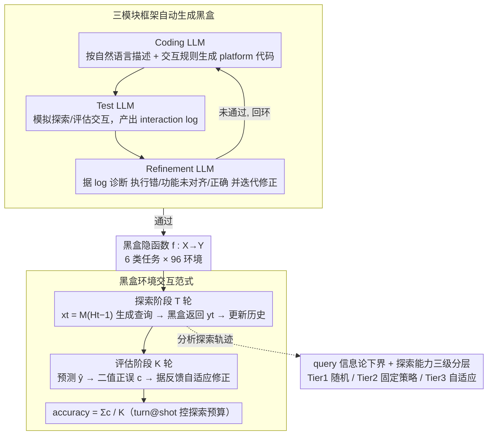

# Investigating Advanced Reasoning of Large Language Models via Black-Box Environment Interaction

**会议**: ICML 2026  
**arXiv**: [2508.19035](https://arxiv.org/abs/2508.19035)  
**代码**: https://github.com/lemonsis/Oracle_Benchmark (有)  
**领域**: LLM 评估 / 推理基准  
**关键词**: 推理评估, 黑盒交互, 探索策略, 演绎归纳溯因, ORACLE 基准

## 一句话总结
本文提出「黑盒环境交互」作为评估 LLM 集成式推理（演绎+归纳+溯因）的新范式，构建含 6 类任务 96 个环境的 ORACLE 基准，benchmark 19 个 LLM 后发现：即便最强的 o3 也只能在简单环境拿 70% 准确率、难环境跌到 40%，且所有 LLM 都缺乏「根据反馈自适应优化探索策略」的高层规划能力。

## 研究背景与动机

**领域现状**：LLM 在 GSM8k、MATH 等推理 benchmark 上分数飙升，long CoT 和 test-time scaling 让模型看起来「会推理」。

**现有痛点**：(1) 现有数据集大多孤立地测演绎、归纳、溯因，没把它们当成统一过程；(2) 用游戏（Minecraft / 24 点）模拟交互环境又会卷入空间理解、长上下文等无关能力，且训练数据可能已经污染；(3) 静态数据集容易被 memorize，benchmark 失效。

**核心矛盾**：人类发现未知环境的过程是「溯因（从观察猜假设）→ 演绎（推出新观察）→ 归纳（用新观察修正假设）」的动态闭环（Peirce 框架）；而当前 LLM 评估几乎只测单步演绎或单条静态 CoT，无法测「假设-验证-修正」的整体推理 cycle。

**本文目标**：(1) 设计能强迫 LLM 走完整推理 cycle 的交互范式；(2) 范式要纯净——只测推理、不掺杂其它能力；(3) 范式要抗污染、可扩展到任意难度。

**切入角度**：把「未知环境」抽象为隐函数 $f:X\to Y$ 的黑盒，LLM 在有限 $T$ 轮探索内通过查询输入 - 观察输出来揭示 $f$，再在测试集上预测新输入的输出。这种范式天然要求假设生成（溯因）、生成查询（演绎）、根据反馈修正（归纳）。

**核心 idea**：用「黑盒环境交互」做评估范式，强迫 LLM 把演绎 + 归纳 + 溯因当作一个不可分解的整体推理 cycle 来跑。

## 方法详解

### 整体框架
ORACLE 把「未知环境」抽象成一个黑盒隐函数 $f:X\to Y$，让 LLM 在有限轮交互里揭示它。每个评估实例分两阶段：先是探索阶段 $T$ 轮，模型 $M$ 在第 $t$ 轮根据历史 $H_{t-1}=(x_1,y_1,\ldots,x_{t-1},y_{t-1})$ 自适应生成查询 $x_t=M(H_{t-1})$，黑盒返回 $y_t=f(x_t)$；再是评估阶段 $K$ 轮，模型对与探索查询不相交的测试集 $X_{\rm test}$ 逐个预测 $\hat{y}^k$，黑盒返回 binary correctness $c^k=\mathbb{1}(\hat{y}^k=f(x^k_{\rm test}))$，模型可据正误信号继续修正后续预测。最终用 accuracy $=\sum c^k / K$ 衡量，配合 turn@shot 记号（如 20@2 表示 20 轮探索 + 每个测试样本 2 次机会）控制探索预算。这套两阶段闭环天然强迫模型走完「溯因猜假设 → 演绎生成查询 → 归纳修正假设」的整体推理 cycle。图里的黑盒并非人工编写，而是由一条三模块 LLM 流水线（Coding → Test → Refinement）自动生成；模型走完闭环后，其探索轨迹还会对照信息论 query 下界、按三级分层评判探索能力。

### 关键设计

**1. 黑盒环境交互范式 + 6 类任务：把异构推理任务统一成隐函数黑盒，且抗污染**

现有数据集要么孤立测演绎/归纳/溯因，要么用游戏环境混入空间理解、长上下文等无关能力，还容易被 memorize。ORACLE 的解法是把所有任务都归约成「输入空间 $X$ → 输出空间 $Y$」的隐函数黑盒，再设计 6 类语义各异的任务覆盖广谱推理：CII（Code Intent Inference，黑盒是某段算法代码，查某 checkpoint 处变量取值）、CRI（Circuit Rule Inference，黑盒是布尔电路，查 input wire → 各 gate 输出）、PSI（Physics System Inference，黑盒是经典力学系统，查时刻 → 物体坐标）、ERI（Encryption Rule Inference，黑盒是加密映射，查明文 → 密文）、IPI（Interactive Puzzle Inference，黑盒是猜数等交互游戏）、GSI（Game Strategy Inference，黑盒是对手玩家的固定策略，须打赢它）。每类含易/难两档，合计 96 个环境。用合成黑盒的好处是双重的：即便 LLM 训过类似任务，每个具体黑盒规则都是全新的，从根上挡住数据污染；而纯函数空间又把视觉、长上下文、常识知识全剔除了，留下的只剩推理能力本身。

**2. 三模块 LLM agentic 框架自动生成黑盒：让基准能任意 scale 又不引入 bias**

人工写黑盒昂贵且难规模化，本文用一条 LLM 闭环流水线全自动从自然语言描述生成黑盒代码 + 交互接口。三个模块协同：Coding LLM 接收自然语言任务描述 + 交互规则，产出 platform 代码；Test LLM 扮演 player 与黑盒交互、模拟真实场景产出 interaction log；Refinement LLM 再结合 log 和 task rule 自动把错误诊断为「执行错 / 功能未对齐 / 正确」三类并迭代修正。这种「跑起来看反馈再调试」的闭环比静态分析鲁棒得多，因此能稳定批量造环境。关键是用 LLM 当 generator 不会泄题：被评估的模型只看得到交互接口、看不到底层代码实现，所以生成器和被测者之间没有信息捷径。

**3. 理论 query 下界 + 自适应探索三级分层：给评估一把绝对刻度尺**

只在 baseline 之间互比说明不了「黑盒到底有多难、模型离最优还差多少」。作者从 exact identification from membership queries 的角度给出信息论下界：要识别假设空间 $\mathcal{H}$ 至少需要 $T_{\rm info}\geq \lceil\log_2|\mathcal{H}|/\log_2|Y|\rceil$ 次查询，这就是「最少要问几次」的绝对参考线。在此之上再把 LLM 的探索能力分三级——Tier 1 是随机探索（无策略），Tier 2 有固定策略但不会根据反馈优化，Tier 3 能依据 instant feedback 自适应调整策略逼近最优。Tier 3 对应人类水平，目前没有 LLM 触及。这套下界 + 分层让分析有结构：既能算出 o3 离最优查询效率差多少，又能精确指出模型的缺陷究竟卡在哪一层。

### 损失函数 / 训练策略
本文是评估范式 + benchmark，不涉及训练。所有模型用各家 API 默认参数（temperature=0）、reasoning effort=medium（GPT 系列）、thinking budget=20000 tokens（Claude/Qwen 系列）。

## 实验关键数据

### 主实验
19 个 qualified LLM（包括 o1/o3/o3-mini/o4-mini、Claude-3.5/3.7/4-sonnet、Gemini-2.5-flash/pro、DeepSeek-v3/r1、Qwen3 系列等）在 10@1 和 20@2 两个设置下评测。下表是 10@1 下 6 类任务的 SOTA 表现（o3 一致领跑 5/6）：

| 任务 | 第一名 | 第二名 | 易 acc (SOTA) | 难 acc (SOTA) |
|--------|------|------|------|------|
| CII | o3 | o4-mini | ~85% | ~50% |
| CRI | o3 | gemini-2.5-pro | ~80% | ~40% |
| PSI | o3 | gemini-2.5-pro | ~75% | ~35% |
| ERI | o4-mini | o3-mini | ~80% | ~30% |
| IPI | o3 | o4-mini | ~85% | ~45% |
| GSI | o3 | gemini-2.5-pro | ~70% | ~40% |

### 消融实验
核心消融是 setting (i)「探索期间不给反馈，最后一轮一次性公布所有查询答案」vs setting (ii)「每轮给即时反馈」，在 CRI 和 ERI 上对比 gemini-2.5-pro / o3-mini / o4-mini：

| 模型 | 任务 | Setting (i) acc | Setting (ii) acc | 差值 |
|------|------|------|------|------|
| gemini-2.5-pro | CRI | ≈ | ≈ | ~0 |
| o3-mini | CRI | ≈ | ≈ | ~0 |
| o4-mini | CRI | ≈ | ≈ | ~0 |
| gemini-2.5-pro | ERI | ≈ | ≈ | ~0 |
| o3-mini | ERI | ≈ | ≈ | ~0 |
| o4-mini | ERI | ≈ | ≈ | ~0 |

两种设置表现几乎完全一致——这是「LLM 不会利用即时反馈优化策略」最直接的证据。

### 关键发现
- 推理模型 > chat 模型：claude-4-sonnet_thinking 一致胜过 claude-4-sonnet 非思考版；新模型 > 旧模型（gemini-2.5-flash > 2.0-flash）。
- 探索预算翻倍（10→20 轮、1→2 次回答）对 CII/CRI/IPI 任务可提升 >10%，但对 PSI（数值计算瓶颈）/ ERI / GSI 几乎无改善——后者瓶颈在「不会设计高效探索策略」。
- Setting (i) vs (ii) 等价：SOTA 模型在「有即时反馈」和「无即时反馈」下表现一致，意味着即便给了反馈模型也不会改变探索行为。Figure 9 案例显示 o4-mini 在 CRI 里穷举 one-hot input、gemini-2.5-pro 在 ERI 里反复查单字母，两种设置都用同样的死板策略。
- 探索能力三分层：作者把 LLM 分成 Tier 1（随机探索）/ Tier 2（有固定策略但不优化）/ Tier 3（自适应）。当前最强模型只能偶尔达 Tier 2，没有 LLM 达 Tier 3——Tier 3 是人类领地。
- 难度落差大：易档准确率多在 70-85%，难档跌到 30-50%，难度梯度合理。

## 亮点与洞察
- 把 Peirce 的「abduction-deduction-induction」三联推理框架显式化为 benchmark 的设计哲学，给评估社区提供了完整推理 cycle 的测量手段。
- 「黑盒生成器是 LLM、但被评估的 LLM 看不到代码」这种结构天然防数据污染，又能让基准任意扩展，非常巧妙。
- Setting (i)/(ii) 等价实验是个反直觉但极具诊断价值的结果——直接证伪「LLM 会用反馈」这一常见假设。
- Tier 1/2/3 探索能力分层可以反过来指导 RL post-training 设计：要奖励的不是 final correctness，而是策略优化的动态质量。
- 信息论下界给「黑盒到底有多难」提供绝对刻度，可以直接算出「o3 离最优查询效率还差多少」。

## 局限与展望
- 96 个环境数量仍小，且部分类别（如 GSI）规则较固定，长期来看模型可能学到 meta-pattern 减弱挑战性。
- 黑盒任务偏 toy 性质，离真实科研发现还远；测出的「不会自适应探索」结论虽强，但和真实任务（如代码 debug）的相关度未实证。
- 评估依赖商用 API，复现实验成本高（19 个 SOTA 模型 × 96 环境 × 多 turn@shot 设置）。
- 部分任务（PSI）瓶颈实际是 LLM 数值计算能力差，并非纯推理问题，评估信号被混入。
- 没有针对「让 LLM 学会自适应探索」的 training-time 方法，benchmark 提出了问题但留给后续工作解决。

## 相关工作与启发
- **vs WebArena / GameBench / GameArena**：那些用真实 web 或游戏环境，混入空间理解、长上下文、常识知识；ORACLE 用纯函数黑盒 isolate 推理能力。
- **vs InductionBench / DEER / Mirage**：那些只测归纳推理；ORACLE 通过交互范式同时测演绎、归纳、溯因。
- **vs LiveBench / LiveCodeBench**：那些靠 timestamp 抗污染；ORACLE 用合成黑盒抗污染，原理更彻底。
- **vs DyVal / DARG**：动态生成评估题；ORACLE 不仅动态生成，还引入交互闭环。
- **vs PlanBench (Valmeekam et al. 2023)**：PlanBench 也测规划能力，但限于已知规则的静态任务；ORACLE 强调对未知环境的探索性规划。

## 评分
- 新颖性: ⭐⭐⭐⭐⭐ 把 Peirce 推理框架精确映射到黑盒交互评估范式，Setting (i)/(ii) 等价实验是真正原创的诊断设计
- 实验充分度: ⭐⭐⭐⭐⭐ 19 个 SOTA LLM × 6 任务 × 96 环境 × 多 turn@shot 设置，加 baseline test 和深度行为分析
- 写作质量: ⭐⭐⭐⭐ 案例图非常直观，但部分章节（如理论分析下界）放 appendix 略弱；Tier 1/2/3 分类原可放到正文更早
- 价值: ⭐⭐⭐⭐⭐ 抗污染 + 可扩展 + 直接揭示当前 LLM 推理瓶颈，benchmark 已开源，可被广泛使用

<!-- RELATED:START -->

## 相关论文

- [\[ICLR 2026\] Enabling Fine-Grained Operating Points for Black-Box LLMs](../../ICLR2026/llm_evaluation/enabling_fine-grained_operating_points_for_black-box_llms.md)
- [\[ICML 2025\] Hyperband-based Bayesian Optimization for Black-box Prompt Selection](../../ICML2025/llm_evaluation/hyperband-based_bayesian_optimization_for_black-box_prompt_selection.md)
- [\[ICML 2026\] PoliticsBench: Benchmarking Political Values in Large Language Models with Multi-Stage Roleplay](politicsbench_benchmarking_political_values_in_large_language_models_with_multi-.md)
- [\[NeurIPS 2025\] Predicting the Performance of Black-Box LLMs through Follow-Up Queries](../../NeurIPS2025/llm_evaluation/predicting_the_performance_of_black-box_llms_through_follow-up_queries.md)
- [\[ACL 2026\] Challenging the Boundaries of Reasoning: An Olympiad-Level Math Benchmark for Large Language Models](../../ACL2026/llm_evaluation/challenging_the_boundaries_of_reasoning_an_olympiad-level_math_benchmark_for_lar.md)

<!-- RELATED:END -->
