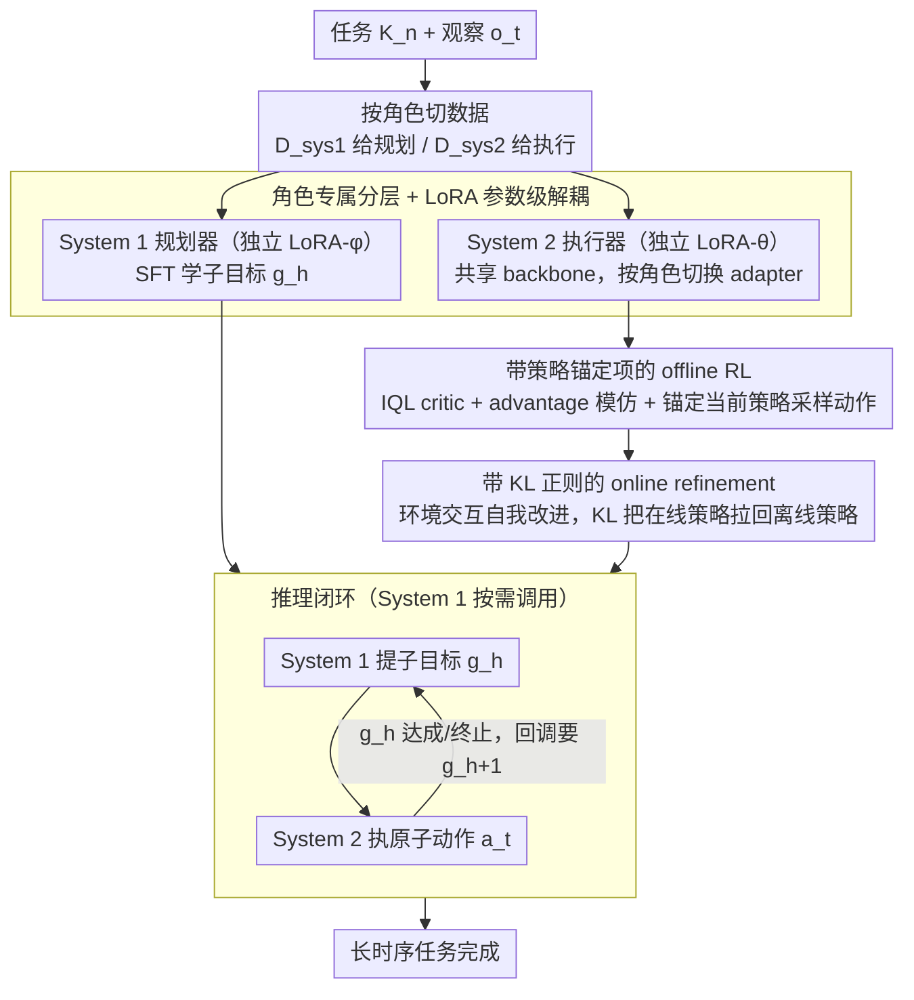

# Multi$^2$: Hierarchical Multi-Agent Decision-Making with LLM-Based Agents in Interactive Environments

**会议**: ICML 2026  
**arXiv**: [2606.03698](https://arxiv.org/abs/2606.03698)  
**代码**: https://park-sangeun.github.io/Multi-Square/ (项目主页)  
**领域**: LLM Agent / 多智能体 / 离线-在线 RL  
**关键词**: 分层智能体, 目标漂移, 子目标规划, 离线到在线 RL, 长时序交互

## 一句话总结
本文提出 Multi$^2$ 框架，把 LLM agent 的"规划"与"执行"显式拆成 System 1（SFT 训练的子目标规划器）和 System 2（offline-to-online RL 训练的原子动作执行器），通过角色专属 LoRA 适配器和带策略锚定/KL 正则的训练目标，在 ScienceWorld、ALFWorld、TextCraft 三个长时序交互环境中显著缓解了 objective drift 并提升了 token 效率。

## 研究背景与动机

**领域现状**：让 LLM agent 在动态环境中完成"多轮交互-观察-决策"的长时序任务（embodied、文本游戏、工具调用等）是当前 agentic AI 的核心目标。主流路线一类是 prompt-based（ReAct、Reflexion、ADaPT），另一类是 fine-tuning-based（GRPO 单 agent RL、Glider 分层 RL）。

**现有痛点**：长时序交互极其脆弱。作者在 ScienceWorld 上观察到两个具体问题：(1) **objective drift**——任务展开过程中，初始意图会随着上下文累积、小的执行错误叠加而被"漂移"掉，agent 越走越偏；(2) **token 浪费**——agent 靠不断加长的交互历史维持意图，导致推理 token 急剧膨胀。ReAct 在长 horizon 上掉得最快，Glider 即使引入分层仍然随 horizon 长度持续下降。

**核心矛盾**：现有分层方法只解决了"规划侧"的问题（把任务拆成子目标降低规划失败），但**执行侧没有被显式训练去纠正复合误差**——Glider 等方法在线适配时主要更新高层 planner，低层 executor 几乎不动，且 planner/executor 共享同一个 LoRA 适配器、只靠 prompt 区分角色，角色边界随上下文累积而模糊。这导致执行器在面对约束密集的动作空间时容易陷入 invalid action 循环。

**本文目标**：构建可靠又高效的交互式 LLM agent，要同时满足 (1) 显式任务分解以保留意图，(2) 通过与环境交互而改进的鲁棒动作执行，(3) token 高效的调用方式。

**切入角度**：作者把"规划"与"执行"看作两种本质不同的优化问题——规划需要稳定的语义监督信号（适合 SFT），执行需要在动态环境中通过反馈纠错（适合 RL）。两者应当使用**不同的训练范式 + 不同的参数（LoRA 适配器）**，而不是共享一套权重靠 prompt 切换。

**核心 idea**：用"System 1（SFT 子目标规划）+ System 2（offline-to-online RL 原子动作执行）"的角色专属分层架构替换共享适配器的分层 prompting，并为 System 2 设计带策略锚定项的 offline 损失与带 KL 正则的 online 损失，保证从离线数据稳定初始化后还能持续自我改进而不模式塌缩。

## 方法详解

### 整体框架
Multi$^2$ 要解决的是 LLM agent 在长时序交互里"越走越偏、token 越烧越多"的毛病，做法是把决策显式拆成"先规划、后执行"两个角色，并让它们用各自适配的训练范式分别训练。整个过程建模为部分可观 MDP $\langle\mathcal{S},\mathcal{A},\mathcal{O},\mathcal{T},\Omega,\mathcal{R},\gamma\rangle$：给定任务描述 $K_n$ 与当前观察 $\mathbf{o}_t$，**System 1**（参数 $\phi$）先产出一个子目标 $g_h \sim \pi_\phi(\cdot \mid \mathbf{o}_t; K_n)$；**System 2**（参数 $\theta$）再条件于 $\mathbf{o}_t$ 和 $g_h$ 选原子动作 $\mathbf{a}_t \sim \pi_\theta(\cdot \mid \mathbf{o}_t; g_h)$。一旦当前子目标完成或终止，System 2 回调 System 1 要下一个子目标 $g_{h+1}$，构成一个分层闭环。两个 system 共用同一个预训练 backbone（Qwen-2.5 3B / Mistral 7B / Llama-3.1 8B），但各挂一个独立的 LoRA 适配器，推理时只激活当前角色对应的那个。

训练数据相应切成两份喂给两个角色：$\mathcal{D}_{sys1} = \{(K_n, \{(\mathbf{o}_h, g_h)\}_{h=1}^H)\}$ 是"任务-观察-子目标"序列，给 System 1 做监督；$\mathcal{D}_{sys2} = \{(g^{(i)}, (\xi_t^{(i)})_{t=1}^{M^{(i)}})\}$ 是子目标条件下的低层 transition 序列（$\xi_t = (\mathbf{o}_t, \mathbf{a}_t, r_t, \mathbf{o}_{t+1})$），给 System 2 做 RL。数据集构造管道在 Glider 基础上改进，加了基于代码规则的子目标抽取和 prompt 模板化以提高可复现性。

### 关键设计

**1. 角色专属分层 + LoRA 参数级解耦：让"规划"和"执行"互不污染**

长时序失败的结构性根源之一，是分层方法虽然分了角色却共享同一套参数、只靠 prompt 区分——上下文一长，"我现在是 planner 还是 executor"的边界就被稀释。Multi$^2$ 干脆在同一个 backbone 上挂两个独立 LoRA：System 1 只吃"任务+观察"吐"子目标"，System 2 只吃"观察+子目标"吐"动作"，推理时按阶段切换激活哪个 adapter。这样角色专长被钉在参数层面而非提示层面，不会随历史累积漂移；而且 System 1 是"按需"调用的——只在子目标达成时才被唤起，不必每步都跑一遍规划，天然省 token。消融（Figure 6c）显示 shared adapter 的中位数和 IQR 都明显低于 role-specific，参数级解耦比 prompt 级解耦更能稳住角色专长，这正是缓解 objective drift 的结构基础。

**2. 带策略锚定项的 offline RL 目标：稳定初始化 System 2 又不被模板带跑偏**

System 2 要先从静态数据集学起，但纯 IQL 这类离线 RL 只对数据集里出现过的动作做加权模仿，很容易把策略困死在 offline 分布里、产出过度模板化的行为。Multi$^2$ 用 IQL 风格的 critic 打底：Q 函数最小化 TD-error $\mathcal{L}_\omega = \mathbb{E}[(r_t + \gamma V_\psi(\mathbf{o}_{t+1}; g_h) - Q_\omega(\mathbf{o}_t, \mathbf{a}_t; g_h))^2]$，V 函数用 expectile regression $\mathcal{L}_\psi = \mathbb{E}[L^\tau(A(\mathbf{o}_t, \mathbf{a}_t))]$（其中 $L^\tau(u) = |\tau - \mathbb{1}\{u<0\}|\,u^2$）。关键改动在 actor 损失：除了标准的 advantage-weighted 模仿项 $\exp(\beta A(\mathbf{o}_t, \mathbf{a}_t; g_h)) \log \pi_\theta^{off}(\mathbf{a}_t \mid \mathbf{o}_t; g_h)$，额外加了一个 **policy-anchored 项** $\lambda A(\mathbf{o}_t, \pi_\theta^{off}(\mathbf{a}_t \mid \mathbf{o}_t; g_h); g_h)$，让 critic 直接对"当前策略自己采样出的动作"打分作为信号。这样 critic 偏好的高优势动作也能参与更新，而不仅仅是数据集里那些，从而提升对 offline 轨迹之外的泛化。Figure 7a 验证：去掉锚定项后中位数下降、低分尾部明显变长。

**3. 带 KL 正则的 online refinement：在线持续改进但不塌缩成单一套路**

离线初始化完成后，System 2 接力去环境里在线交互、自我纠错。这一步用混合 replay buffer $\mathcal{B}_{sys2}$（offline 数据 + 在线新采样的 transition），损失为 $\mathcal{L}_\theta^{online} = -\mathbb{E}[w_t \log \pi_\theta^{on}(\mathbf{a}_t \mid \mathbf{o}_t; g_h)] + \eta\, \mathbb{E}[D_{KL}(\pi_\theta^{on} \,\|\, \pi_\theta^{off})(\mathbf{o}_t; g_h)]$，其中 $w_t = \exp(\frac{1}{\alpha} A(\mathbf{o}_t, \mathbf{a}_t; g_h))$ 用 advantage 把高回报动作加权强化。痛点在于纯 online AWAC 用在 LLM agent 上方差大、容易塌缩到单一行为模式，所以加的 KL 项把 online policy 往 offline 策略上拉，相当于一个"信赖域"，把"探索-改进"框在安全范围内。Figure 7b 显示 Vanilla-AWAC 偶尔能拿高分但低端失败明显，加 KL 正则后分布更紧、更可靠。

### 损失函数 / 训练策略
整体训练分三阶段（Algorithm 1），全程用 LoRA：(1) System 1 用 SFT 损失 $\mathcal{L}_\phi = -\mathbb{E}[\log \pi_\phi(g_h \mid \mathbf{o}_t; K_n)]$ 训 $EP_1$ 轮；(2) System 2 用上面的 $\mathcal{L}_\omega, \mathcal{L}_\psi$ 加 offline actor 损失联合训 $EP_2$ 轮得到 $\pi_\theta^{off}$；(3) 令 $\pi_\theta^{on} \leftarrow \pi_\theta^{off}$，在环境中 rollout 收集新 transition 入 buffer，用 $\mathcal{L}_\theta^{online}$ 训 $EP_3$ 轮。System 1 在阶段 3 冻结，只负责采样子目标。

## 实验关键数据

### 主实验
在 ScienceWorld（curriculum 长时序）、ALFWorld（家居操作，稀疏奖励）、TextCraft（recipe 符号合成）三个环境上，跨 Qwen-2.5 3B / Mistral 7B / Llama-3.1 8B 三个 backbone，用严格的 pass@1 评测：

| 设置 (Llama-3.1 8B) | ScienceWorld ID | ScienceWorld OOD | ALFWorld ID | ALFWorld OOD | TextCraft |
|---|---|---|---|---|---|
| ReAct | 23.23 | 10.30 | 6.72 | 7.46 | 9.00 |
| Reflexion (pass@6) | 23.20 | 6.97 | 35.71 | 29.29 | 11.00 |
| ADaPT | 26.20 | 12.27 | 11.54 | 6.41 | 5.00 |
| GRPO | 25.79 | 4.61 | 8.57 | 7.50 | 5.50 |
| Glider | 60.48 | 34.36 | 43.57 | 37.86 | 9.50 |
| **Multi$^2$** | **67.61** | 30.68 | **57.86** | **56.43** | **35.60** |

Mistral 7B 上 Multi$^2$ 在 ScienceWorld ID 上拿到 69.97（vs Glider 58.33）、TextCraft 44.50（vs Glider 28.50）。整体在多数 backbone × split 组合中 Multi$^2$ 是最佳。

### 消融实验
在 ScienceWorld ID + Llama-3.1 8B 上：

| 配置 | 关键观察 |
|------|------|
| 完整 Multi$^2$ | 最高中位数 + 最窄 IQR |
| (1) RL-SFT 角色互换 | 表现最差，明确的角色不匹配 |
| (2) Only RL（两个 system 都 RL） | 中位数低 + 方差大，RL 对高层规划不稳 |
| (3) Only SFT（两个都 SFT） | 中位数尚可但失败频繁，缺乏执行鲁棒性 |
| Single model（无分层） | 中位数明显低于分层版 |
| Shared adapter（分层但共享 LoRA） | 中位数与 IQR 均低于 role-specific |
| Vanilla-IQL（去 policy-anchored） | 中位数下降 + 低分尾部变长 |
| Vanilla-AWAC（去 KL 正则） | 方差大、低端失败明显 |

### 关键发现
- **角色与训练范式必须匹配**：SFT 训练 System 1 + RL 训练 System 2 是唯一稳定的组合，互换或同质化都会显著掉点，说明语义规划与原子执行确实是两种本质不同的优化问题。
- **objective drift 在难任务上最严重**：Figure 5 按 Easy/Medium/Hard 分层，prompt-based 方法随难度急剧下降，fine-tuning-based 方法在 Medium→Hard 仍有明显跌幅，只有 Multi$^2$ 在 Hard 上仍保持高位，分层 + RL 执行器的协同效应在长 horizon 上最显著。
- **token 效率不靠压缩 prompt 而靠结构**：Multi$^2$ 的高 token 效率来自 hierarchical on-demand 调用（System 1 只在子目标完成时被唤起）+ RL 微调出的紧凑动作格式，不需要长上下文示例。
- **OOD 上 online RL 收益更大**：Figure 9 显示在线 RL 在 OOD 上带来更明显的提升，因为分布漂移时 sub-goal 与环境动态的不匹配更频繁，在线交互正好能纠正这类执行级错误。

## 亮点与洞察
- **把 Kahneman 的 System 1/2 隐喻反过来用**：在心理学里 System 1 是快/直觉、System 2 是慢/审慎；本文 System 1 是"慢的规划"、System 2 是"快的执行"，名称只是借用但拆解逻辑很清晰，是 LLM agent 设计里少见的把"训练范式 = 角色定义"贯彻到底的工作。
- **policy-anchored advantage 项是个可复用 trick**：在所有"offline RL 模仿 + 担心模板化"的场景都可以尝试，让 critic 对 current-policy 采样动作打分作为正则，比单纯加噪/dropout 更有信号。
- **role-specific LoRA 适配器**比 prompt-based role separation 更鲁棒——这个发现对 multi-agent LLM 系统设计有普适意义，提示我们"prompt 切角色"在长上下文下会失效，应该用参数级隔离。

## 局限与展望
- 作者承认的局限：方法在更大模型（>8B）和真实物理 embodied 环境上的扩展性未验证；hierarchical dataset 构造依赖 Glider 的代码规则管道，迁移到新环境需要重新设计 sub-goal 抽取规则。
- 自己发现的局限：实验只在三个 text-based 交互环境上验证，没有覆盖工具调用（function calling）、多 agent 协作等更复杂场景；System 1 一旦训完就冻结，无法在线适应新任务分布，意味着 OOD 子目标质量受限于 offline 数据；KL 正则的 $\eta$ 超参对稳定性影响应该不小但 paper 没给敏感性分析。
- 改进思路：让 System 1 也支持轻量级在线更新（比如 prompt-based meta-update）；探索 System 1/2 之间的 latent 通信通道而非显式自然语言子目标，可能进一步省 token；扩展到 3+ 层级（任务-子任务-子目标-动作）处理更长 horizon。

## 相关工作与启发
- **vs Glider (Hu et al., ICML 2025)**：Glider 也分层但只用 prompt 区分角色、共享一个 LoRA、在线只更新 planner；Multi$^2$ 用独立 adapter + 在线只更新 executor + 加 policy-anchored / KL 正则，把"执行鲁棒性"补上。Multi$^2$ 在所有 backbone 上稳定高于 Glider，在 TextCraft 上提升尤其明显（Llama-3.1 8B 上 9.5 → 35.6）。
- **vs ADaPT (Prasad et al., NeurIPS 2024)**：ADaPT 用 prompt-based planner-executor 分层但完全不微调；Multi$^2$ 证明仅靠 prompting 的分层在 fine-tuning 时代已经被显著超越，参数更新 + 角色专属是必经之路。
- **vs ReAct / Reflexion**：纯 prompt-based 在长 horizon 上 objective drift 严重；Multi$^2$ 通过显式 sub-goal 锚定 + RL 执行器纠错，把长 horizon 失败模式（invalid action 循环、unproductive loop）大幅压制。
- **vs 标准 offline-to-online RL（DigiRL、Bai et al. 2024）**：这些方法关注通用 policy 改进，没有针对 hierarchical agent 的 executor 角色做定制；Multi$^2$ 的 policy-anchored + KL 正则损失是专门为"在分层结构下稳定 refine executor"设计的。

## 评分
- 新颖性: ⭐⭐⭐⭐ 把"角色 = 训练范式 = LoRA 适配器"三位一体的拆法是新的，policy-anchored advantage 与 KL-regularized online refinement 的组合损失也有原创性，但整体框架（分层 + offline-to-online）属于在 Glider 上的扎实改进而非范式革新。
- 实验充分度: ⭐⭐⭐⭐⭐ 三个环境 × 三个 backbone × ID/OOD split，加上训练配置/结构/adapter/损失/模型规模 5 类消融 + 难度分层 + token 效率 + 在线适配分析，覆盖了所有关键 design choice。
- 写作质量: ⭐⭐⭐⭐ 逻辑清晰，把"objective drift"概念化得很到位，Figure 1 的 horizon robustness + token efficiency 双视角开题非常有说服力；公式排版稍显凌乱（重复字符渲染问题应是 arXiv HTML 抓取造成）。
- 价值: ⭐⭐⭐⭐ 对做 LLM agent 长时序任务的研究者非常实用——hierarchical dataset 已开源，policy-anchored 与 KL 正则两个 trick 可直接迁移到其他 offline-to-online LLM RL 场景；同时给"prompt vs 参数级角色分离"这个长期争论提供了清晰的经验证据。

<!-- RELATED:START -->

## 相关论文

- [\[ICML 2026\] Agent World Model: Infinity Synthetic Environments for Agentic Reinforcement Learning](agent_world_model_infinity_synthetic_environments_for_agentic_reinforcement_lear.md)
- [\[ICML 2026\] HiPER: Hierarchical Reinforcement Learning with Explicit Credit Assignment for Large Language Model Agents](hiper_hierarchical_reinforcement_learning_with_explicit_credit_assignment_for_la.md)
- [\[NeurIPS 2025\] MEMTRACK: Evaluating Long-Term Memory and State Tracking in Multi-Platform Dynamic Agent Environments](../../NeurIPS2025/llm_evaluation/memtrack_evaluating_long-term_memory_and_state_tracking_in_multi-platform_dynami.md)
- [\[ACL 2026\] Fin-Bias: Comprehensive Evaluation for LLM Decision-Making under human bias in Finance Domain](../../ACL2026/llm_evaluation/fin-bias_comprehensive_evaluation_for_llm_decision-making_under_human_bias_in_fi.md)
- [\[ACL 2026\] DiningBench: A Hierarchical Multi-view Benchmark for Perception and Reasoning in the Dietary Domain](../../ACL2026/llm_evaluation/diningbench_a_hierarchical_multi-view_benchmark_for_perception_and_reasoning_in_.md)

<!-- RELATED:END -->
