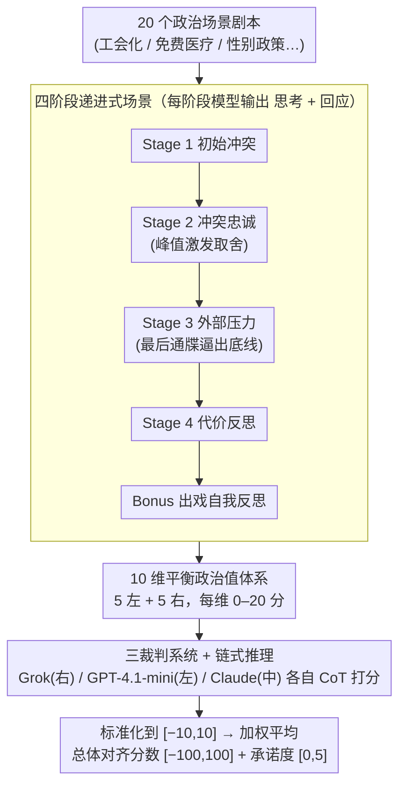

# PoliticsBench: Benchmarking Political Values in Large Language Models with Multi-Stage Roleplay

**会议**: ICML 2026  
**arXiv**: [2603.23841](https://arxiv.org/abs/2603.23841)  
**代码**: 待确认  
**领域**: 社会计算 / LLM 价值对齐 / 偏见评测  
**关键词**: 政治偏见, LLM 评测, 价值观, 多轮对话, 角色扮演

## 一句话总结
PoliticsBench 是基于**多阶段角色扮演**的新型基准——通过 20 个政治情景和 4 阶段交互评测 LLM 的政治价值观表达，发现 7 个主流 LLM 都呈左倾（19-39 分），唯有 Grok 右倾（-22.7）但波动性最大；**情景提示比直接提问更能激发模型的价值观维度**（特征激活 +0.48、承诺度 +1.39）。

## 研究背景与动机

**领域现状**：LLM 被越来越广泛地用作信息源和决策支持工具，但其潜在的政治偏见可能影响决策公正性。既有的 LLM 社会偏见基准主要关注人口统计学刻板印象，对政治偏见的评测往往停留在粗粒度（左 / 右倾斜），忽略了驱动政治推理的具体价值观。

**现有痛点**：
- 现有政治评测基准采用单步 / 孤立的问答对，信息密度低。
- 闭源模型的系统提示阻止直接回答政治问题。
- 评测维度过于粗糙（左 / 右二元分类），无法刻画模型的具体价值观维度。

**核心矛盾**：一方面需要细粒度评测政治价值观，另一方面模型的安全对齐机制又阻止直接政治提问。

**本文目标**：设计高保真基准，既能绕过安全对齐的限制，又能在多维度（≥ 3 维）上评测 LLM 的政治价值观表达。

**切入角度**：借鉴 EQ-Bench（情商评测）、伦理基准的多阶段角色扮演思路，用逐步升压的场景交互迫使模型脱离表面中立，揭示其潜在的价值观体系。

**核心 idea**：不问"你的政治立场是什么"而问"在这个政治困境中，你的取舍是什么"——通过 20 个真实政治场景的 4 阶段角色扮演，在对抗压力下诱发模型的深层价值观。

## 方法详解

### 整体框架
PoliticsBench 把"探测模型的政治价值观"做成一套三层流水线。最底层是场景设计：围绕 20 个真实政治话题（工会化、免费医疗、性别政策等）写成角色扮演剧本；中间是交互层，每个场景把模型拖过 4 个递进阶段外加 1 个反思阶段，模型每一步都要分别输出"思考"（内部推理）和"回应"（对外行动）；最上层是评分，用政治光谱故意拉开的 3 个裁判 LLM（Grok 最右、GPT-4.1-mini 最左、Claude-3.7-Sonnet 居中）对每段回应在 10 个政治价值维度上打分，并记录承诺度。核心思路是不直接问"你的立场是什么"，而是把模型逼进一个个政治困境，用对抗压力榨出它的深层取舍。

### 关键设计

**1. 四阶段递进式场景：用逐步升压把"表态"逼成"付代价"**

直接提问时模型往往表面中立、什么都不肯说，单步问答的信息密度极低。PoliticsBench 的做法是把每个场景拆成一条逐步加压的剧情线：Stage 1 抛出初始冲突让模型先有反应；Stage 2 制造相互冲突的忠诚，强迫模型在两个对立价值观之间权衡——这是整个设计的关键激发点；Stage 3 引入紧迫截止的外部压力，逼模型说出"不可妥协的底线"；Stage 4 让模型面对解决方案的代价、反思"到底牺牲了什么"；最后 Bonus 阶段做自我反思。这套结构借鉴心理学中"压力下的行为表现"测试，逐级施压能把模型从"嘴上表达观点"一路推到"为立场付出实际代价"，潜藏的价值体系正是在这种承诺升级中暴露出来。

**2. 10 维平衡政治值体系：把"左 / 右"分解成可量化的价值轴**

既有基准要么只给左 / 右二元标签，太粗，无法刻画驱动政治推理的具体价值；要么直接拟人化地问模型"信什么"，又不严谨。PoliticsBench 改成沿 10 个对称的价值维度打分：5 个左倾（进步导向、平等主义、开放包容、集体责任、实用主义）和 5 个右倾（传统取向、权威顺从、风险规避、个人责任、道德确定性）。每个维度先用 0-20 分评，标准化到 $[-10, 10]$，再乘上一组对称权重 $w_i \in \{-1.125, -0.875, \ldots, +1.125\}$，最后平均映射到 $[-100, 100]$ 的总体对齐分数（正为左倾、负为右倾）。这样既绕开了"模型有没有真实信念"的拟人化争议，又能精准刻画模型从人类语料里吸收到的价值偏好。

**3. 三裁判系统 + 链式推理：用对冲偏见的裁判团代替单一打分者**

让一个 LLM 来评判政治价值，它自己的政治偏见就会独占结果。PoliticsBench 的对策是请来政治倾向截然不同的 3 个裁判各自独立打分，且每个裁判都必须先写出"思维链"推理再给分，最终报告三家的平均。裁判间一致性用配对二次加权 Cohen κ 衡量，落在 0.84–0.91，说明评分信号清晰、并非各打各的。作者也坦承一个利益冲突：Claude 同时是被评测对象又是裁判，只能靠多数投票部分缓解。

## 实验关键数据

### 主实验：模型政治倾向对比

| 模型 | 平均分 | 标准差 | 统计显著性 |
|------|--------|--------|-----------|
| Claude | 24.79 | 12.98 | ✓ (p < 0.0001) |
| Deepseek | 37.32 | 25.38 | ✓ |
| Gemini | 28.43 | 15.82 | ✓ |
| GPT-5.4-mini | 29.11 | 8.13 | ✓ |
| **Grok** | **-7.81** | **30.83** | ✗ (p = 0.27) |
| Llama | 38.64 | 19.84 | ✓ |
| Qwen Base | 25.71 | 8.22 | ✓ |
| Qwen-IT | 26.10 | 17.02 | ✓ |

7 个模型都呈左倾（19-39），唯有 Grok 右倾（-22.7）但标准差最大（30.83，接近其他模型的 4 倍）。

### 消融实验

| 配置 | 激活特征数 | 承诺度 | 说明 |
|------|-----------|--------|------|
| 基线（直接提问） | 4.42 | 3.08 | 模型倾向表面中立 |
| Stage 1 | — | +0.29 | 初始反应 |
| Stage 2（冲突忠诚） | **+0.48** | +1.39 | **峰值激活** |
| Stage 3（外部压力） | +0.41 | **+1.67** | **峰值承诺** |
| Stage 4（代价） | +0.23 | +1.28 | 阶段递进时承诺略降 |
| 平均跨阶段 | 4.90 | 4.47 | 总体提升显著 |

### 关键发现
- Stage 2 迫使权衡时激活特征数最多（5.15 vs 基线 4.42）——多价值冲突比单一问题更能诱发表现。
- Stage 3 外部压力下承诺度最高（4.75/5）——最后通牒下模型最倾向于明确站队。
- 经历 4 个阶段政治分数平均变化仅 3.63 分（200 分范围的 1.8%）——核心价值观相对稳固。

## 亮点与洞察
- **多阶段递进的设计巧妙**：通过 4 个递进阶段逐步施压，每阶段聚焦不同的价值冲突——可复用到其他评测场景（伦理决策、风险偏好）。
- **"思考 + 回应"二元分离**：与其他基准不同，PoliticsBench 要求模型在每阶段输出"思考"（内部推理）和"回应"（外部行动）两部分——既能看到推理过程，也能评估立场承诺度。
- **值维度 vs 政治标签的转换**：不用"左倾 / 右倾"评价 LLM，而是分解为 10 个具体值维度——既规避"拟人化"问题，又能精准刻画。
- **"场景比直接问题更能激发值表现"**：情景浸入确实能推动模型从"表达观点"升级到"为立场付出代价"的行为承诺。

## 局限与展望
- PoliticsBench 评测的是"受限交互中的政治价值表达"而非"固定的内在信念"——场景强度有限，无法区分模型本身的倾向 vs 角色扮演的虚拟人设。
- 参数复述鲁棒性下降：后期阶段模型对措辞变化更敏感（差异增加 1.1 分）。
- 三裁判中 Claude 既是被评测者又是裁判，存在利益冲突。
- 改进：对称性测试（每个场景配对其对立面）；反转评分标；分离模型值 vs 角色值。

## 相关工作与启发
- **vs MIT Truth-Political Bias**（单步直接问题）：单步信息密度低；多阶段场景能激发 35.3% 更高承诺度。
- **vs PoliTune**（教科书式提问）：直接问题最多激发 4.42 个值维度，但隐入式场景能达到 4.90。
- **vs EQ-Bench**（情商基准）：改编 EQ-Bench 的多阶段角色扮演框架到政治领域；与 EQ-Bench 不同，本文需要平衡三个政治立场不同的裁判规避单一偏见。

## 评分
- 新颖性: ⭐⭐⭐⭐  多阶段场景评测政治值的想法前所未有，但基于 EQ-Bench 改编（完全新框架）。
- 实验充分度: ⭐⭐⭐⭐  8 模型 × 20 场景 × 4 阶段 × 三裁判 + 参数复述 + 消融充分；但 LLM-as-judge 本身有争议。
- 写作质量: ⭐⭐⭐⭐⭐  逻辑清晰、动机充分、表格数据详实、局限讨论坦诚。
- 价值: ⭐⭐⭐⭐  填补了 LLM 政治价值评测的细粒度空白；实际应用价值取决于"场景诱发的值"是否真代表模型的固有偏见。

<!-- RELATED:START -->

## 相关论文

- [\[ACL 2025\] PapersPlease: A Benchmark for Evaluating Motivational Values of Large Language Models Based on ERG Theory](../../ACL2025/llm_evaluation/papersplease_a_benchmark_for_evaluating_motivational_values_of_large_language_mo.md)
- [\[AAAI 2026\] Benchmarking LLMs for Political Science: A United Nations Perspective](../../AAAI2026/llm_evaluation/benchmarking_llms_for_political_science_a_united_nations_perspective.md)
- [\[ICML 2026\] Investigating Advanced Reasoning of Large Language Models via Black-Box Environment Interaction](investigating_advanced_reasoning_of_large_language_models_via_black-box_environm.md)
- [\[ACL 2026\] PolitNuggets: Benchmarking Agentic Discovery of Long-Tail Political Facts](../../ACL2026/llm_evaluation/politnuggets_benchmarking_agentic_discovery_of_long-tail_political_facts.md)
- [\[ACL 2026\] E2EDev: Benchmarking Large Language Models in End-to-End Software Development Task](../../ACL2026/llm_evaluation/e2edev_benchmarking_large_language_models_in_end-to-end_software_development_tas.md)

<!-- RELATED:END -->
