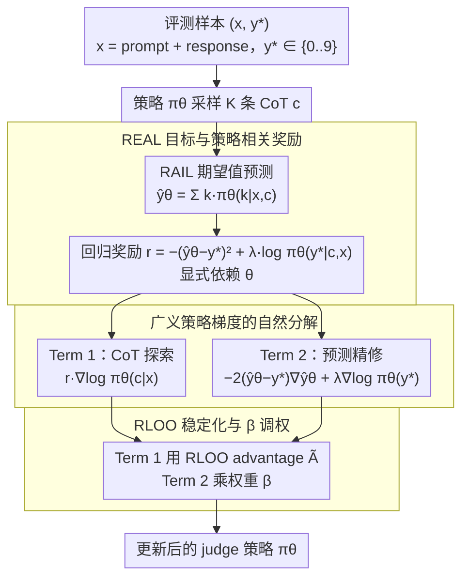

# REAL：把回归感知奖励塞进 RL，让 LLM-as-a-Judge 学会"差一分也是差"

**会议**: ICML 2026  
**arXiv**: [2603.17145](https://arxiv.org/abs/2603.17145)  
**代码**: https://github.com/YasminZhang/REAL (有)  
**领域**: 强化学习 / LLM 后训练 / LLM 评测  
**关键词**: LLM-as-a-Judge、回归感知奖励、广义策略梯度、策略相关奖励、相关系数优化  

## 一句话总结
针对 LLM 充当评分器（LLM-as-a-Judge）时 RL 用 0/1 二值奖励忽视序数结构的本质缺陷，作者把 RAFT 的"期望值预测 + 平方误差"塞进 RL 目标，因为奖励此时显式依赖策略参数，所以改用广义策略梯度——它干净地拆成"CoT 探索项 + 预测精修项"两部分；在 8B–32B 多基座上相对 SFT/标准 RL 全面胜出，Qwen3-32B 上 Pearson/Spearman 相对 SFT 提 8.4/7.2 点。

## 研究背景与动机
**领域现状**：LLM-as-a-Judge 是当前评测、对齐、偏好建模的核心载体——让模型输出一个数值分数代表"质量 / 正确性 / 偏好强度"。主流训练方案有两类：(1) Prometheus 系列代表的 SFT，用 cross-entropy 把分数当离散 token 学；(2) RAFT / TRACT 等 regression-aware SFT，把"期望值预测 $\hat y_\theta(x, c) = \sum_{k \in \mathcal{K}} k \cdot \pi_\theta(k|x,c)$"和平方误差结合起来，恢复了序数结构。

**现有痛点**：把 RAFT/TRACT 这套 regression-aware 思路推到 RL 后训练是自然下一步——RL 才能让模型**主动探索**自己的 CoT 轨迹，而 SFT 只能模仿固定的 ground-truth 推理链。但当下所有 RL 后训练框架（PPO/GRPO/DPO/Guo 2025）都依赖 rule-based verifier 给出 $r = \mathbf{1}(y = y^*)$ 这种 0/1 奖励——这对回归任务是灾难：当 ground truth 是 5 时，模型预测 4 和预测 1 在标准 RL 眼里完全一样烂，但人类显然认为前者更接近。作者的 Fig. 2 实证了这个直觉：标准 RL 从 TRACT 检查点继续训，相关系数指标反而塌陷。

**核心矛盾**：要让 RL 既保留"探索 CoT 推理空间"的优势，又承认"分数差距大小有意义"，必须在 RL 里用回归奖励。但回归奖励的形式 $r = -(\hat y_\theta - y^*)^2$ 里 $\hat y_\theta$ 显式依赖策略参数 $\theta$——这违反了标准 REINFORCE 推导中 $\nabla_\theta r = 0$ 的前提，标准策略梯度公式不再正确。

**本文目标**：(1) 给出一个让回归奖励合法进入 RL 的形式化框架；(2) 在理论上把它和相关系数指标连起来——因为 LLM-as-a-Judge 的下游评测是 Pearson/Spearman 而非样本级 MSE；(3) 在 8B–32B 多规模上验证它对 OOD 泛化的提升。

**切入角度**：使用 Schulman 2015 的**广义策略梯度估计器**显式承接"奖励依赖参数"这一非常规设定。

**核心 idea**：用"广义策略梯度 → 自然分解出 CoT 探索项 + 预测精修项"这一数学事实，把回归感知性优雅地嵌进 RL，并理论证明最小化平方误差等价于优化 Pearson 相关。

## 方法详解
### 整体框架
REAL 要解决的是一件具体的事：让 LLM-as-a-Judge 在 RL 后训练里也能"差一分也算差"。输入是评测样本对 $(x, y^*)$，$x$ 是待评测的"prompt + response"组合，$y^* \in \mathcal{K} = \{0, 1, \dots, 9\}$ 是单字符数值标签；策略 $\pi_\theta$ 先自回归产出一段 CoT $c$，再给出数字。关键转折在于它不直接采样这个数字，而是用 RAIL 期望值预测器 $\hat y_\theta(x, c) = \sum_{k \in \mathcal{K}} k \cdot \pi_\theta(k | x, c)$ 把整个 0–9 分布"塌"成一个连续期望，对它做平方误差。训练时对每条 $x$ 采 $K$ 条 CoT，用 RLOO 估计 advantage，再按一个分解成两项的梯度同时更新策略——一项管 CoT 探索，一项管数值预测精修。

### 关键设计

**1. REAL 目标与隐式的策略相关奖励：让回归 loss 合法进入 RL**

RAFT/TRACT 已经证明"期望值预测 + 平方误差"能恢复分数的序数结构，但它们的 CoT 是固定采样源给的，本质仍是 SFT。REAL 做的第一步就是把这套回归目标整体搬到 RL：目标函数定义为 $\mathcal{L}_{\text{REAL}}(\theta) = \mathbb{E}_{(x, y^*) \sim \mathcal{D},\, c \sim \pi_\theta(\cdot | x)}[(\hat y_\theta(x, c) - y^*)^2 - \lambda \log \pi_\theta(y^* | x, c)]$，前一项是平方误差迫使期望预测器贴近真值，后一项是对 final-answer token 的 NTP 辅助 loss（$\lambda = 0$ 时退化为纯回归）。对应的隐式奖励 $r_{\text{REAL}}(\theta, x, c) = -(\hat y_\theta(x, c) - y^*)^2 + \lambda \log \pi_\theta(y^* | c, x)$ **显式依赖 $\theta$**，这正是它和标准 RL 的分水岭。

它之所以有效，关键在两处替换。一是把 TRACT 固定的 $\pi_{\text{temp}}$ 采样源换成当前在训策略 $\pi_\theta$，CoT 与奖励同步演化，第一次让"回归感知"和"主动探索"在同一目标里结合。二是 RAIL 期望预测器把整个 0–9 分布的形状都带进梯度，而非只看单个 token 概率，信息密度高一个量级——实验里单是把推理换成 RAIL 就有"免费午餐"式提升。

**2. 广义策略梯度的自然分解：把奖励依赖参数这件麻烦事变成优雅结构**

奖励里出现 $\hat y_\theta$ 意味着 $\nabla_\theta r \ne 0$，标准 REINFORCE 推导的前提（奖励对 $\theta$ 求导为零）失效，照搬标准策略梯度是错的。REAL 用 Schulman 2015 的广义策略梯度引理对 $\mathcal{L}(\theta) = \mathbb{E}_{x,\, c \sim \pi_\theta}[r(\theta, x, c)]$ 直接展开链式法则：

$$\nabla_\theta \mathcal{L} = \mathbb{E}\Big[\underbrace{r(\theta, x, c)\, \nabla_\theta \log \pi_\theta(c | x)}_{\text{Term 1: CoT 探索}} + \underbrace{\nabla_\theta r(\theta, x, c)}_{\text{Term 2: 预测精修}}\Big]$$

把 REAL 奖励代入，Term 2 展开为 $-2(\hat y_\theta - y^*)\nabla_\theta \hat y_\theta + \lambda \nabla_\theta \log \pi_\theta(y^* | x, c)$，其中 $\nabla_\theta \hat y_\theta = \sum_k k \cdot \nabla_\theta \pi_\theta(k | x, c)$。这个分解的美感在于它对应了两种本质不同的学习方式：Term 1 把 CoT $c$ 当作"动作"用 REINFORCE 去探索（policy-gradient style），Term 2 把数字 $y$ 当作"已知 ground truth"用反传去精修（backprop style）。GRPO 把 $c$ 和 $y$ 当同质 token 用同一规则更新，REAL 则显式承认它们结构性不同——CoT 是高维 sequence 必须探索，final answer 是低基数离散变量可以直接回归。这也是它和 JEPO（Tang et al., 2025）的本质区别：JEPO 解决"$y^*$ 不可 verify"，REAL 解决"$y^*$ 是有序数值"。

**3. RLOO 稳定化与 $\beta$ 调权：把理论梯度落成可训的工程目标**

理论梯度直接用方差太大，REAL 对每个 $x$ 采 $K$ 条 CoT，用 leave-one-out baseline 算 advantage $A^{(i)} = r^{(i)} - \frac{1}{K-1}\sum_{j \ne i} r^{(j)}$，再用组内 std 归一化并 clip 到 $[-1, 1]$ 得 $\tilde A^{(i)}$，最终稳定化梯度为 $\nabla \mathcal{L} \approx \frac{1}{K} \sum_i [\tilde A^{(i)} \nabla_\theta \log \pi_\theta(c_i | x) + \beta \nabla_\theta r_{\text{REAL}}(\theta, x, c_i)]$。这里 $\beta$ 控制预测精修项相对 CoT 探索项的强度，是论文唯一引入但非必需的超参——理论上 $\beta = 1.0$ 就是数学准确值，实验也显示它已经够好，引入它只为给将来"偏探索"或"偏精修"的工程留接口。选 RLOO 而非 GRPO/PPO 也和"双项分解"哲学自洽：既然预测精修项已经提供了低方差的精修信号，CoT 探索项就不必再上 PPO 那种额外的保险栓。

### 损失函数 / 训练策略
完整目标为 $\mathcal{L}_{\text{REAL}}(\theta) = \mathbb{E}_{(x, y^*),\, c \sim \pi_\theta}[(\hat y_\theta(x, c) - y^*)^2 - \lambda \log \pi_\theta(y^* | x, c)]$，配合 RLOO 估计器和 $\beta = 1.0$。$\lambda$ 沿用 RAFT/TRACT 的默认设置，CoT 组规模 $K$ 跟 GRPO 风格保持中等（具体值见附录）。

## 实验关键数据

### 主实验（Table 2 节选，Mistral2-7B 和 Qwen3-32B；指标 ×100）

| 模型 | 方法 | 范式 | 推理 | FB Bench (r/ρ) | FLASK (r/ρ) | Vic. Bench (r/ρ) | MT Bench (r/ρ) | 平均 r | 平均 ρ |
|------|------|------|------|----------------|--------------|------------------|-----------------|--------|--------|
| Mistral2-7B | Base+warmup | – | Standard | 83.1 / 83.3 | 41.5 / 41.9 | 49.2 / 42.4 | 30.9 / 31.8 | 51.2 | 49.8 |
| Mistral2-7B | RAFT | SFT | RAIL | 87.9 / 88.0 | 41.8 / 41.9 | 52.8 / 51.3 | 39.9 / 41.8 | 55.6 | 55.8 |
| Mistral2-7B | TRACT | SFT | RAIL | 93.9 / 93.7 | 50.7 / 50.0 | 56.2 / 54.8 | 52.1 / 50.1 | 63.2 | 62.2 |
| Mistral2-7B | Standard RL | RL | RAIL | 93.7 / 93.7 | 51.6 / 50.5 | 58.0 / 56.0 | 52.9 / 50.7 | 64.1 | 62.7 |
| Mistral2-7B | **REAL** | RL | RAIL | 93.2 / 93.4 | **56.0 / 54.1** | **63.3 / 60.2** | **59.3 / 56.9** | **67.9** | **66.2** |
| Qwen3-32B | Base | – | RAIL | 63.4 / 70.8 | 54.3 / 60.4 | 50.8 / 57.4 | 42.5 / 46.8 | 52.7 | 58.8 |
| Qwen3-32B | RAFT | SFT | RAIL | 85.4 / 86.5 | 52.1 / 52.9 | 51.9 / 52.0 | 61.1 / 59.6 | 62.6 | 62.8 |
| Qwen3-32B | **REAL** | RL | RAIL | **91.1 / 91.7** | **58.9 / 58.6** | **65.1 / 60.7** | **68.9 / 69.1** | **71.0** | **70.0** |

注意 in-domain 的 FB Bench 上 REAL 仅与标准 RL 持平甚至略低 0.5 点，但在 OOD 的 FLASK / Vic. Bench / MT Bench 上 REAL 全面胜出 4–8 点——回归感知奖励的优势主要体现在泛化而非过拟训练分布。Qwen3-32B 上 REAL 相对 SFT 平均涨 8.4 Pearson / 7.2 Spearman，相对 base 涨 18.3 / 11.2。

### 消融实验（Table 4.4 节选 + Tab 14）

| 配置 | 关键变化 | 现象 |
|------|---------|------|
| REAL 完整 | RL + 回归奖励 + 双项梯度 | OOD 全面 SOTA |
| 去 Term 1（≈ TRACT） | 退化为 SFT 静态精修 | 失去 CoT 探索，OOD 掉 3–5 点 |
| 去 Term 2（≈ 标准 RL with $r = -(\hat y - y^*)^2$ 但不算预测梯度） | CoT 探索保留但抹掉"分布塌缩信号" | 相关系数训练中崩塌（论文 Fig. 2） |
| $\lambda = 0$ | 去掉 NTP 辅助 | 表现接近 $\lambda > 0$，验证回归项才是主驱动 |
| $\beta = 1.0$ | 理论准确权 | 已经最优，无需扫描 |
| vs JEPO（Tab. 14） | 替换为 marginal log-likelihood | REAL 全部回归指标均胜出 |

### 关键发现
- **OOD > in-domain** 是 REAL 最有说服力的论据：FB Bench in-domain 上和标准 RL 几乎打平，OOD 的 FLASK / Vic / MT 上拉开 4–8 个相关系数点。说明二值奖励能"记住"训练分布的对错模式，但学不到"分数距离"这一普适结构。
- 标准 RL 在相关系数上**主动塌陷**：从 TRACT 检查点续训，Pearson/Spearman 不升反降（Fig. 2），暴露二值奖励对回归任务的反优化效应——这是论文论证"必须换奖励形式"最干净的实证之一。
- 双项分解里 Term 2（预测精修）做了 80% 的工作：去 Term 2 是直接训不动；去 Term 1 还能保持还行（≈ TRACT），但失去对 OOD 的探索能力。
- **Lemma 3.1**（平方误差最小化等价于 Pearson 最优）把"工程上方便的样本级 MSE"和"评测上关心的群体级相关系数"用数学桥连起来——这是少见的"理论指标 ≠ 训练指标 → 证它们一致"的干净结果。
- RAIL 期望预测器本身就是 "free lunch"（base+RAIL > base+Standard），但只用 RAIL 不上 RL 远不够，REAL 在 RAIL 之上再加 6–8 分。

## 亮点与洞察
- **"奖励依赖策略参数"这个看似禁区的设定，被广义策略梯度优雅化解**——这条路其实开了一扇门：未来一切"用模型自己的输出分布算的可微指标"（不只回归，可以是熵、可校准性、置信度）都能塞进 RL 奖励，REAL 是范式样本。
- 拆解定理把 RL 与 SFT 的关系第一次说清楚：TRACT 是 REAL 的 Term 2-only 版本，Standard RL 是 REAL 的 Term 1 用二值 $r$ 版本，REAL 是两者的统一化。这种"$X$ = $A$ + $B$"式的分解定理在论文写作上极具说服力，值得借鉴。
- 把数值预测当成 backprop 直接监督，而不是当成 RL action 去采样——这一动作本身就是对"评测任务结构"的尊重：$y^*$ 完全可观察，没必要把它放到高方差的策略梯度里硬学。这条 trick 可以迁到任何"final answer 是低基数离散变量"的 RL 后训练（数学题答案 [0-100]、分类标签、打分类任务）。
- $\beta = 1.0$ 直接 work 是论文质量的隐性指标——一个不需要扫超参的方法说明其形式化对了。

## 局限与展望
- 任务范围仅限**单一标量输出** $y^* \in \{0, ..., 9\}$ 的评测任务；多维评分（如 Prometheus 的 5 维 rubric）、自由文本判定等需要扩展 RAIL 形式。
- 回归奖励的"语义校准"未涉及：模型可能学到"输出更接近真值但理由更糟"，REAL 没监督 CoT 内容质量，纯回归驱动下 CoT 是否会退化成 placeholder 是开放问题。
- 与 verifier 友好任务（数学/代码）正交：REAL 处理不能用 0/1 rule check 的回归任务，但没和"两类奖励融合"——未来 multi-task RL 训综合 judge/verifier 时该如何加权 REAL 的回归项和数学的二值项？
- 理论假设条件独立 $c \perp y^* | x$（Lemma 3.1），现实里 CoT 内容可能轻微泄漏标签，结论的精确性还有空间。
- $K$ 条 CoT × $\nabla_\theta \hat y_\theta$ 计算（要对每个 digit token 反传）开销显著，论文没给 throughput 数字；在 32B 规模上训练成本相对 Standard RL 倍数有多大值得透明化。

## 相关工作与启发
- **vs TRACT (Chiang et al., 2025)**：TRACT 把 self-generated CoT 当 ground truth 用 SFT 训，没法评估中间质量；REAL 让 CoT 由当前策略采样并用回归奖励排序——数学上 TRACT 等价于 REAL 的 Term 2-only，论文用一张 Table 1 把这种"特例 / 一般化"关系亮出来非常清晰。
- **vs 标准 RL（PPO/GRPO/DPO with $r = \mathbf{1}(y = y^*)$）**：标准 RL 把所有"不完全对"塌缩成 0 奖励，REAL 用 $\hat y_\theta$ 的连续期望保留序数信息——这是把"分类范式 → 回归范式"系统化迁移到 RL 后训练的样板。
- **vs JEPO (Tang et al., 2025)**：JEPO 用 Jensen bound 处理 marginal log-likelihood 解决"$y^*$ 不可 verify"问题，但仍是非有序的；REAL 专攻有序数值评分，论文 Table 14 实测对比 REAL 全面胜出。
- **vs RAFT/RAIL**：RAFT 是 SFT 版本的回归感知，RAIL 是推理时的期望预测；REAL 把这两件工具一起拉到 RL 阶段并给出梯度的合法性证明，是这一系列工作的自然完成点。
- 启发：广义策略梯度 + "奖励依赖策略"的范式可推广到一切"可微评价指标"的 RL 优化，如校准性 ECE、覆盖率、对抗鲁棒性指标等。

## 评分
- 新颖性: ⭐⭐⭐⭐⭐ 把回归感知奖励合法塞进 RL 是第一例，广义策略梯度的应用很巧。
- 实验充分度: ⭐⭐⭐⭐ 覆盖 8B–32B 三规模 × 4 benchmark，OOD 与 in-domain 对比清晰；但 throughput / 训练成本透明度有限。
- 写作质量: ⭐⭐⭐⭐⭐ Lemma 3.1 + Table 1 conceptual comparison + 双项分解三件事衔接得非常顺，是 ICML 风格论文范本。
- 价值: ⭐⭐⭐⭐⭐ 在 LLM-as-a-Judge 已成 RLHF/评测主路径的当下，给"评分类 RL"建立了正确范式，影响面会持续扩大。

<!-- RELATED:START -->

## 相关论文

- [\[ICML 2026\] Reasoning Is Not Free: Robust Adaptive Cost-Efficient Routing for LLM-as-a-Judge](reasoning_is_not_free_robust_adaptive_cost-efficient_routing_for_llm-as-a-judge.md)
- [\[ICML 2026\] On Effectiveness and Efficiency of Agentic Tool-calling and RL Training](on_effectiveness_and_efficiency_of_agentic_tool-calling_and_rl_training.md)
- [\[ICLR 2026\] Preference Leakage: A Contamination Problem in LLM-as-a-judge](../../ICLR2026/llm_evaluation/preference_leakage_a_contamination_problem_in_llm-as-a-judge.md)
- [\[ICML 2026\] Toward Training Superintelligent Software Agents through Self-Play SWE-RL](toward_training_superintelligent_software_agents_through_self-play_swe-rl.md)
- [\[ICLR 2026\] BiasScope: Towards Automated Detection of Bias in LLM-as-a-Judge Evaluation](../../ICLR2026/llm_evaluation/biasscope_towards_automated_detection_of_bias_in_llm-as-a-judge_evaluation.md)

<!-- RELATED:END -->
