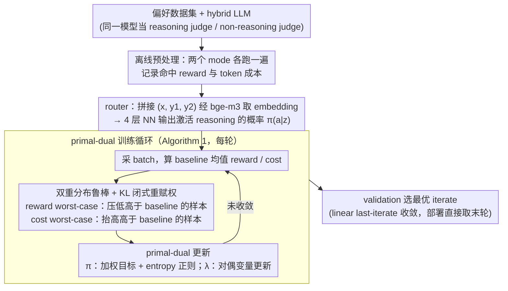

# Reasoning Is Not Free: Robust Adaptive Cost-Efficient Routing for LLM-as-a-Judge

**会议**: ICML 2026  
**arXiv**: [2605.10805](https://arxiv.org/abs/2605.10805)  
**代码**: 无  
**领域**: LLM 评估 / 模型路由 / 分布鲁棒优化  
**关键词**: LLM-as-a-Judge, 推理模型路由, KL 不确定集, primal-dual, OOD 鲁棒

## 一句话总结
RACER 把"对每个 query 决定要不要调用 reasoning 模式做 judge"建模为带 KL 不确定集的分布鲁棒约束优化问题，用 primal-dual 算法解出 OOD 下仍满足 cost 预算的最优路由策略，并首次给出 LLM 路由器策略的 linear convergence 理论保证。

## 研究背景与动机

**领域现状**：LLM-as-a-Judge 越来越多用 reasoning model（o1、DeepSeek-R1、Qwen3 thinking 等）做评估。这些模型靠 RL on verifiable tasks 学到 reasoning，但 judgment 任务本身没显式优化过，所以"reasoning 是否真的让 judge 变准"是个开放问题。一个自然的中间方案是 routing——按 query 难度动态选 reasoning 或 instruct 模式。

**现有痛点**：现有 LLM 路由工作（FrugalGPT、P2L、RouteLLM、ThinkSwitcher）有三个共同短板。一是几乎全聚焦在 QA 任务上，没看 judge 场景；二是只优化"训练分布下的 cost-accuracy 折中"，部署时 query 分布一旦漂移（用户群体变、领域比例变），cost 约束就被违反、性能就崩；三是经验性、heuristic 居多，没有理论收敛保证。论文还实证：reasoning judge 在 math/coding 上能显著提升准确率，但在 safety/knowledge 上提升甚至为负，且 token 成本平均涨数倍——错误地无差别用 reasoning 既贵又可能更差。

**核心矛盾**：reasoning 模式既贵又非普遍有益（overthinking 会害事），但训练数据是静态的，OOD 部署下的 reward 估计和 cost 预算双双失真。

**本文目标**：在固定 cost budget $C$ 下学一个路由策略 $\pi(a | z)$（$a \in \{0, 1\}$ 表示是否激活 reasoning），使得（i）期望 judge reward 最大；（ii）对 query 分布漂移鲁棒；（iii）有理论收敛保证。

**切入角度**：分布鲁棒优化（DRO）的 KL 不确定集 + 拉格朗日 primal-dual。reward 和 cost 都用 worst-case 度量，把"reward 上的鲁棒"和"cost 上的鲁棒"分开处理（前者防 OOD 时高估好处，后者防 OOD 时超预算）。

**核心 idea**：把 LLM-as-a-Judge 路由 reformulate 成 $\max_\pi \min_{\tilde{\rho} \in \mathcal{U}(\rho_n, \delta)} \mathbb{E}_{\tilde{\rho}}[r] \text{ s.t. } \max_{\tilde{\rho} \in \mathcal{U}} \mathbb{E}_{\tilde{\rho}}[c] \leq C$，并证明 KL 不确定集下 worst-case 分布有闭式 reweighting，从而可用 primal-dual 高效求解。

## 方法详解

### 整体框架

RACER 要回答的是"这条 query 值不值得花 reasoning 的钱来 judge"，并且要在部署时 query 分布漂移的情况下依然守住 cost 预算。它的输入是带 ground-truth 偏好标签的 preference dataset $\{(x_i, y_{i,1}, y_{i,2}, l_i)\}$，外加一个 hybrid LLM——同一个模型既能当 reasoning judge $\Phi_1$、又能当 non-reasoning judge $\Phi_0$。训练前先对每个 instance 把两个 mode 都跑一遍，记下命中标签的 reward $r_i = \mathbb{I}(\Phi_{a_i}(z_i) = l_i)$ 和 token 成本 $c_i$，作为后续优化的离线信号。真正学的 router 是个 4 层小 NN，吃 prompt+response 拼接后用 bge-m3 取的 embedding，吐出"激活 reasoning"的概率 $\pi(a|z)$。整个训练就是把"在 cost 预算下最大化鲁棒 reward"写成约束 min-max，再用 primal-dual 交替更新策略 $\pi$ 和对偶变量 $\lambda$，最后在 validation 上挑最好的一轮 iterate。

### 关键设计

**1. 双重分布鲁棒：reward 和 cost 各自取 worst-case**

部署时 query 分布一漂移，训练分布上估的 reward 和 cost 双双失真，naive router 要么超预算要么性能崩。RACER 把 router 学习写成在 KL 不确定集上的约束优化 $\max_\pi R_{\mathcal{U}(\rho_n, \delta)}(\pi)$ s.t. $C_{\mathcal{U}(\rho_n, \delta)}(\pi) \leq C$，其中 $\mathcal{U}(\rho_n, \delta)$ 是以经验分布 $\rho_n$ 为圆心、半径 $\delta$ 的 KL ball，$R$ 取 ball 内的 worst-case reward、$C$ 取 worst-case cost。和传统 DRO 只对单个 objective 取鲁棒不同，这里的关键观察是 reward 与 cost 在 OOD 下的失真方向是独立的：OOD query 可能 token 更便宜（这时 cost 不用怕、反而该 robustify reward 把预算用得更激进），也可能更贵（这时 cost 鲁棒才是命根、得防超预算）。两边各取各的 worst-case，算法才能在"变贵"和"变便宜"两种漂移下都安全。消融（Figure 3）正说明这个 split 必不可少——只 robustify reward 的 RACER-R 在变贵场景超预算，只 robustify cost 的 RACER-C 在变便宜场景浪费预算，唯有双 robust 两头都稳。

**2. KL 不确定集的闭式 worst-case 重赋权（Theorem 3.1）**

难点在于不确定集里大多数分布我们根本没有样本，直接对参数化分布跑 alternating gradient 没法做。Theorem 3.1 给出一个干净的等价：在 KL ball 下，worst-case 分布对样本只是一次闭式 reweighting。记 $f_i = \mathbb{E}_{a \sim \pi(\cdot|z_i)}[f(z_i, a)]$ 为某个量（reward 或 cost）在样本 $i$ 上的策略期望，则取 min 的 worst-case 分布是 $\underline{\rho}(i) \propto \rho_n(i)\exp\!\big(\tfrac{\underline{s} - f_i}{\tau}\big)$、取 max 的是 $\bar{\rho}(i) \propto \rho_n(i)\exp\!\big(\tfrac{f_i - \bar{s}}{\tau}\big)$。直觉上，reward 视角下 worst-case 会把"reward 高于 baseline 的样本"压低、"低于 baseline 的"抬高（悲观假设好处没那么多）；cost 视角下则把"高 cost 样本"抬高，逼优化聚焦到高风险区。温度 $\tau$ 控制重赋的激烈程度，$\tau$ 越小越偏极端。这样一来"对未知分布求 worst-case"就被等价转成"对已知样本乘个权重"，实现上几乎零额外成本（思路承接 Gadot et al. 2024 / Xu et al. 2025 的 distributionally robust RL）。

**3. Entropy 正则的 primal-dual 算法与 linear last-iterate 收敛（Theorem 4.1/4.2）**

有了闭式 worst-case 分布，约束优化就落到一个带正则的 min-max 拉格朗日 $L_\beta(\pi, \lambda) = R_{\underline{\rho}}(\pi) - \lambda C_{\bar{\rho}}(\pi) + \beta\big(\mathcal{H}(\pi) + \tfrac{1}{2}\lambda^2\big)$ 上。primal-dual 交替求解：$\pi_{t+1} = \arg\max_\pi\{R_{\underline{\rho}}(\pi) - \lambda_t C_{\bar{\rho}}(\pi) + \beta\mathcal{H}(\pi)\}$，$\lambda_{t+1} = \arg\max_{\lambda \geq 0}\{-\lambda C_{\bar{\rho}}(\pi) + \tfrac{1}{2}\beta\lambda^2\}$；其中 $\pi$ 的更新可改写回原分布 $\rho$ 上的加权目标 $\mathbb{E}_{\rho, \pi}\big[\tfrac{p_{\underline{\rho}}}{p_\rho} r - \lambda_t \tfrac{p_{\bar{\rho}}}{p_\rho} c\big] + \beta\mathcal{H}$，直接配合关键设计 2 的重赋权落地。两个正则项各司其职：entropy $\mathcal{H}(\pi)$ 是 RL 老招（Cen et al. 2022, Ding et al. 2023），防策略退化成 deterministic、保留探索；$\tfrac{1}{2}\lambda^2$ 则把对偶变量约束得有界。两者合起来让 saddle point 存在且唯一（Theorem 4.1），并给出 last-iterate 的线性收敛率（Theorem 4.2）：

$$\text{KL}(\pi_t \| \pi^*) \leq \frac{M^2 K^2}{2\beta^2}\left(\frac{M^2 K^2}{M^2 K^2 + 2\beta^2}\right)^{2t}(\lambda_0 - \lambda^*)^2.$$

这是首次给 LLM router 证明 linear last-iterate convergence——意味着部署时直接取最后一个 checkpoint 就有保证，不必走传统 primal-dual 那套 ergodic average。

### 损失函数 / 训练策略

完整训练循环（Algorithm 1）每轮：（a）采一个 batch；（b）对每条样本枚举 $a \in \{0, 1\}$ 拿到 reward $r$ 和 cost $c$；（c）以当前 batch 均值 $\bar{r}, \bar{c}$ 为 baseline，按闭式公式 $\underline{\rho}(i) \propto \exp((\bar{r} - r_i)/\tau)$、$\bar{\rho}(i) \propto \exp((c_i - \bar{c})/\tau)$ 算 worst-case 权重；（d）primal-dual 更新 $\pi$ 和 $\lambda$；（e）在 validation 上选最好的一轮 iterate。两个超参分工明确：$\tau$ 控鲁棒强度，$\beta$ 控 entropy 正则。

## 实验关键数据

### 主实验

数据：Skywork Reward Preference 子集 + Math-Step-DPO-10K + Code-Preference-Pairs（共 40K 训练）；评估在 RewardBench / RewardBench-2 / JudgeBench；judge pair 是 Qwen3-1.7B / 4B / 8B 的 reasoning vs instruct 模式。Budget $C$ 是 cost ratio（reasoning/instruct token 比）。

| 模型规模 | 方法 | Accuracy | Cost ratio |
|----------|------|----------|------------|
| 4B | All-Instruct | ~81.0 | 1.0 |
| 4B | All-Reasoning | ~85.5 | 11.2（贵） |
| 4B | Random | ~83.5 | 3.4 |
| 4B | **RACER (C=3.4)** | **~85.8** | 3.4 |
| 1.7B | RouterBench-KNN | 71.3 | 2.6 |
| 1.7B | RouteLLM-MF | 69.4 | 3.8 |
| 1.7B | M-IRT | 71.6 | 3.4 |
| 1.7B | **RACER (C=4)** | **72.2** | 3.6 |
| 8B | M-IRT | 88.9 | 3.4 |
| 8B | **RACER (C=4)** | **90.0** | 3.9 |

在大约一半 All-Reasoning cost 下，RACER 能匹配甚至超过 All-Reasoning 准确率；对比 SOTA router baselines 在 1.7B/4B/8B 上分别高 0.64、1.10、1.06 个点。

### 消融实验

| 配置 | OOD 场景 | 结论 |
|------|----------|------|
| ACER（非 robust） | OOD 变贵 | 超预算且 reward 掉 |
| RACER-R only | OOD 变便宜 | reward 最高（更激进利用预算） |
| RACER-C only | OOD 变贵 | cost 安全（在预算内）但 reward 偏低 |
| Full RACER | 两种 | 两边都稳，鲁棒性最佳 |

Entropy 正则 $\beta$ 敏感性（Qwen3-4B）：

| $\beta$ | $C=2$ Acc | $C=3$ Acc | $C=4$ Acc |
|---------|-----------|-----------|-----------|
| 0 | 85.2 | 86.7 | 86.8 |
| 0.005 | 85.5 | 86.7 | 86.7 |
| 0.01 | 85.5 | 86.7 | 86.7 |
| 0.05 | 84.8 | 86.0 | 86.2 |

紧预算下 $\beta = 0$ 掉点，$\beta \in [0.005, 0.01]$ 稳，$\beta = 0.05$ 过强反而伤性能。

### 关键发现
- reasoning judge 的 gain 高度领域依赖：math/coding 上大幅提升（+10% 以上）、safety/knowledge 上几乎无 gain 甚至负 gain；reasoning 平均花 $11.2\times$ 的 token
- random routing 在 cost-accuracy 曲线上是 All-Instruct 和 All-Reasoning 的近似线性插值，RACER 的曲线明显凹向左上，证明 instance-level 选择比简单按某个比例随机激活有效得多
- distribution shift 在真实 benchmark 之间确实存在（训练用 Skywork，测试用 RewardBench / JudgeBench），non-robust ACER 在某些设定下违反预算或掉准确率
- 跨 model family transfer：训练用 Qwen3，加上 Llama-3.1-8B（附录）仍然 trend 一致

## 亮点与洞察
- **"reasoning is not free"这个 framing**直击 reasoning model 时代的核心痛点——大家在拼 reasoning，但很少看 cost-accuracy tradeoff 的全貌。论文 Figure 2 把 $\Delta$Accuracy vs cost ratio 跨 benchmark 画在一张图，一眼看出 reasoning 收益高度不均
- **reward 和 cost 双 robust 分开做** 是个干净的设计——之前 DRO 工作多用 single robust，但这里清楚说明两边的 OOD 失真方向独立，分开 robust 才对
- **KL 不确定集闭式 reweighting** 把 DRO 落地成"加权样本梯度"，工程上几乎零额外成本，加速论文方法在实际系统的采用
- **第一个给 LLM router 证明 linear last-iterate convergence** 的工作，对偏理论的读者来说很有价值——deployment 时直接取最后一个 checkpoint 就有保证，不用走 ergodic average
- entropy 正则 + dual 正则的组合让 saddle point 唯一是个干净的理论小亮点

## 局限与展望
- 只做 binary routing（reasoning vs non-reasoning）；扩展到 $K$ 个候选 judge（不同模型 family、不同 scale）还需要把 $\pi: \mathcal{Z} \to \Delta(K)$ 改成多分类，理论上 binary 的结论能推但工程细节没写
- KL ball 在 distribution shift 大时会过保守（worst-case 太悲观）导致 routing 退化到 always-instruct；作者承认 alternative uncertainty set（Wasserstein / $\chi^2$）值得探索
- 假设 cost 有界（Assumption 2）且 density ratio 有界（Assumption 3），后者在 OOD 严重时未必满足
- $\tau$ 没自适应调，全是 grid search
- training 需要枚举两个 mode 的 judge 结果，对每个 instance 都得跑 reasoning judge 一遍，预处理本身 token 成本不低
- judging 任务的 ground-truth label 依赖人工标注的 preference dataset，假设这些 label 本身可靠

## 相关工作与启发
- **vs ThinkSwitcher (Liang 2025)**：同样是 hybrid reasoning model 的 mode 切换，但 ThinkSwitcher 是 heuristic，没 distribution shift 处理也无理论保证；RACER 把它做成 principled DRO
- **vs RouteLLM-MF (Ong 2024) / RouterBench (Hu 2024)**：传统 multi-LLM router，处理 strong vs weak model 选择；RACER 聚焦单模型的 mode 切换，但理论框架可直接 transfer 到 multi-model
- **vs FrugalGPT (Chen 2023)**：cascading 策略，按顺序查模型直到满意；RACER 是 single-shot 选 mode，latency 可控
- **vs DRO 文献 (Namkoong & Duchi 2016, Duchi & Namkoong 2021)**：用 $f$-divergence ball 做 DRO 是经典套路；本文新意在于"分开 robust reward / cost"和"binary policy + entropy regularization + linear convergence"

## 评分
- 新颖性: ⭐⭐⭐⭐ "reasoning is not free for judge" + 双 robust + linear convergence 这套组合在 LLM router 文献里首次，但底层 DRO 套路是经典的
- 实验充分度: ⭐⭐⭐⭐ 3 benchmark、3 model scale、4 baseline + ablation + sensitivity 分析齐全；但只 Qwen3 + Llama，且 budget 范围中规中矩
- 写作质量: ⭐⭐⭐⭐⭐ Section 2 controlled study 把 motivation 立得很牢，3 节方法推导清晰，4 节理论简洁
- 价值: ⭐⭐⭐⭐ reasoning model 部署成本是真痛点，OOD 鲁棒是真问题，对工业界 LLM-as-judge 流水线直接有用

<!-- RELATED:START -->

## 相关论文

- [\[ICML 2026\] REAL：把回归感知奖励塞进 RL，让 LLM-as-a-Judge 学会"差一分也是差"](real_regression-aware_reinforcement_learning_for_llm-as-a-judge.md)
- [\[ICML 2026\] Margin-Adaptive Confidence Ranking for Reliable LLM Judgement](margin-adaptive_confidence_ranking_for_reliable_llm_judgement.md)
- [\[ICLR 2026\] Doubly-Robust LLM-as-a-Judge: Externally Valid Estimation with Imperfect Personas](../../ICLR2026/llm_evaluation/doubly-robust_llm-as-a-judge_externally_valid_estimation_with_imperfect_personas.md)
- [\[ACL 2025\] YESciEval: Robust LLM-as-a-Judge for Scientific Question Answering](../../ACL2025/llm_evaluation/yescieval_llm_judge_science.md)
- [\[ACL 2026\] Reasoning Model Is Superior LLM-Judge, Yet Suffers from Biases](../../ACL2026/llm_evaluation/reasoning_model_is_superior_llm-judge_yet_suffers_from_biases.md)

<!-- RELATED:END -->
