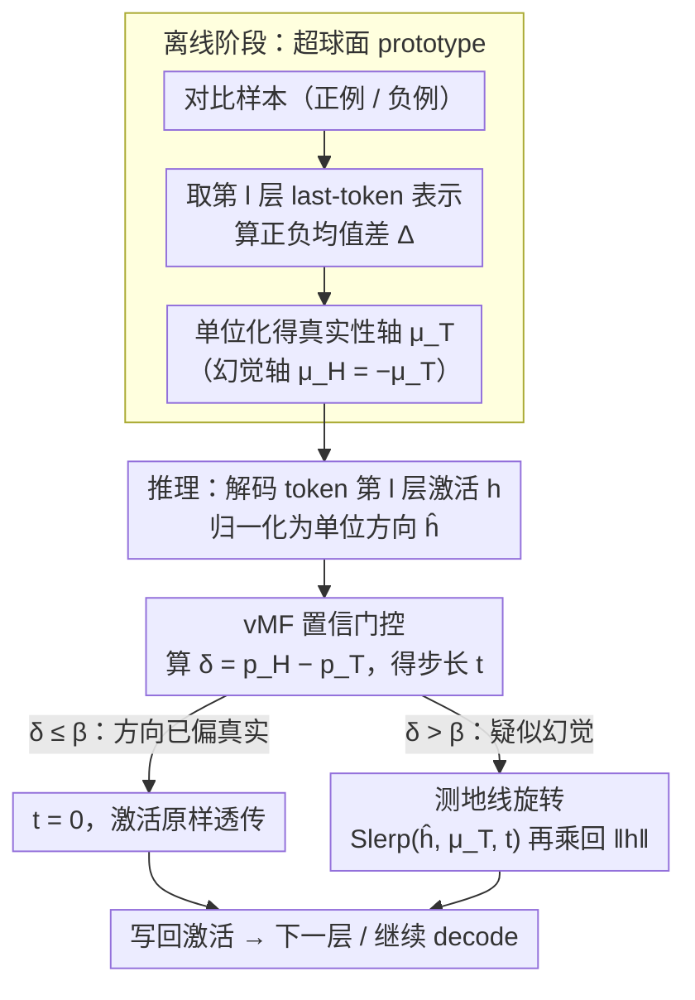

# Spherical Steering: Geometry-Aware Activation Rotation for Language Models

**会议**: ICML 2026  
**arXiv**: [2602.08169](https://arxiv.org/abs/2602.08169)  
**代码**: https://github.com/chili-lab/Spherical-Steering (有)  
**领域**: 可解释性 / 激活编辑 / Inference-time Intervention / LLM 对齐  
**关键词**: 激活转向、超球面几何、Slerp 测地线、vMF 置信门控、范数保持

## 一句话总结
本文提出 Spherical Steering：在 LLM 隐藏状态的单位超球面上，沿测地线把激活向量旋转到由对比样本估计出的"真实性方向"，而不是像传统 activation addition 那样做线性加法，从而在保持激活幅值（norm）的同时显著提升 TruthfulQA / COPA / StoryCloze 等基准的多选准确率（+10% 量级），且不损伤开放式生成质量。

## 研究背景与动机

**领域现状**：在不重训模型的前提下控制 LLM 行为，主流做法是 *activation steering*——从一批 (positive, negative) 对比样本中估计一个"转向向量" $\mu$，然后在某些层把它直接加到 token 激活上：$h' = h + \lambda \mu$。代表方法是 CAA、ITI 等。

**现有痛点**：这种加法操作存在严重的 *尺度敏感性*。$\lambda$ 太小则没效果；$\lambda$ 一大，隐藏状态范数 $\|h\|$ 就被显著扭曲——式 $\|h'\|^2 = \|h\|^2 + 2\lambda\mu^\top h + \lambda^2$ 表明范数变化既依赖于 $\lambda$，也依赖于 $\mu$ 与 $h$ 的对齐程度，完全不受控。结果是：多选准确率确实涨了，但开放式生成质量（TRUE×INFO）反而掉，模型变得"过度保守"甚至 representation collapse。

**核心矛盾**：现代 LLM 普遍用 RMSNorm/LayerNorm 把激活幅值标准化，本质上 *方向才是承载语义的自由度*；而加法 steering 却在自由扰动幅值，与架构的几何先验相冲突。

**本文目标**：设计一个 *几何一致* 的 inference-time 干预原语——既能像加法一样训练免，又能严格保持 $\|h\|$，避免破坏 normalization 层的几何先验。

**切入角度**：作者做了一个关键的经验观察（图 3）——在 TruthfulQA 上，"答对"和"答错"的 last-token 激活在所有 32 层的 $\ell_2$ 范数曲线几乎重合（差异 <1%），但 *方向* 上有明显差别。这直接说明真实性信号编码在方向、不在幅值。

**核心 idea**：把激活归一化到单位超球面 $\mathbb{S}^{d-1}$，沿着测地线（great circle）通过 Slerp 把它旋转到目标方向 $\mu_T$，最后乘回原始范数。这是一个 norm-preserving 的旋转干预，本质上把"加法 in $\mathbb{R}^d$"换成了"旋转 on $\mathbb{S}^{d-1}$"。

## 方法详解

### 整体框架
这篇要解决的是：传统加法式 activation steering 在增强真实性的同时会失控地扭曲隐藏状态的范数，进而损伤生成质量。Spherical Steering 的整条 pipeline 全程 training-free，分两段：离线阶段用一批 (正例, 负例) 对比样本跑一遍模型，在每个待干预层估出一条单位长度的"真实性轴" $\mu_T^{(l)}$；推理阶段对每个解码 token，把它在该层的激活归一化到单位超球面，先用 vMF 门控算出该走多少步、再沿测地线朝 $\mu_T^{(l)}$ 旋转这个步长，最后乘回原始模长。核心的一句话替换是：把"在 $\mathbb{R}^d$ 里做加法 $h+\lambda\mu$"换成"在 $\mathbb{S}^{d-1}$ 上做旋转"，从而严格保住 $\|h\|$。

### 关键设计

**1. 超球面 prototype：从对比样本里一次性蒸出"真实性方向"**

加法 steering 的转向向量本身往往带着尺度和上下文噪声，直接拿来加会污染激活。这里改成只取"方向"：对每个 $(x_i, y_i^+, y_i^-)$，把拼接序列 $x_i \| y_i^\pm$ 喂模型，取第 $l$ 层 last-token 表示 $z_i^{(l)\pm}$，算正负均值差 $\Delta^{(l)} = m_+^{(l)} - m_-^{(l)}$，再单位化得 $\mu^{(l)} = \Delta^{(l)}/\|\Delta^{(l)}\|$。均值差这一步自动抵消掉正负样本共享的上下文，只留下"真假对立"的判别成分；单位化则是因为后续所有操作都在 $\mathbb{S}^{d-1}$ 上做，需要的是纯方向而非带尺度的偏移。整个过程离线、权重不变、每层只算一次——比 ITI 的 per-head 探针更轻，比 CAA 把向量直接当加项更几何自洽。

**2. 测地线旋转：用 Slerp 把激活转到目标方向，再复原模长**

加法之所以会扭曲范数，是因为 $\|h+\lambda\mu\|^2 = \|h\|^2 + 2\lambda\mu^\top h + \lambda^2$ 完全不受控。旋转则天然回避了这一点。具体地，先把激活归一化为 $\hat h^{(l)}$，算它与目标的夹角 $\theta = \arccos(\mu_T^\top \hat h^{(l)})$，再用 Shoemake 1985 的球面线性插值沿大圆插过去：

$$\hat h^{(l)\prime} = \frac{\sin((1-t)\theta)}{\sin\theta}\hat h^{(l)} + \frac{\sin(t\theta)}{\sin\theta}\mu_T,\qquad h^{(l)\prime} = \|h^{(l)}\|\,\hat h^{(l)\prime}$$

其中 $t=0$ 表示不动、$t=1$ 表示完全转到 $\mu_T$，$\theta=0$ 或 $\pi$ 的退化情形单独处理。Slerp 给的是固定步长 $t$ 下角度变化最小的路径，等于"用最少的方向扰动换最大的语义对齐"；而最后乘回 $\|h^{(l)}\|$ 让 $\|h^{(l)\prime}\| \equiv \|h^{(l)}\|$ 严格成立，正好契合 RMSNorm 之后"模长被标准化、方向才承载信息"的架构先验。它与 Angular Steering 先投影到固定 2D 平面再转不同——本文直接在原始 $d$ 维球面上做测地线，不依赖 PCA 近似。

**3. vMF 置信门控：只在模型快要幻觉时才大力旋转**

如果对所有 token 用同一个步长 $t$，要么力度不够、要么把本来正确的答案也转坏了。门控让 $t$ 随 token 自适应。它借 von Mises–Fisher 密度 $f(u;m,\kappa)\propto\exp(\kappa m^\top u)$ 的指数项当作 prototype score，对 $(\mu_T, \mu_H=-\mu_T)$ 做 two-class softmax 得 $p_T, p_H$，定义"偏向幻觉"的置信度 $\delta = p_H - p_T \in [-1,1]$，再经阈值 $\beta$ 截断、缩放 $\alpha$ 限幅得到步长：

$$t = \mathrm{clip}\!\left(\alpha \cdot \frac{\delta-\beta}{1-\beta},\,0,\,1\right),\qquad \delta \le \beta \Rightarrow t=0$$

这里 $\kappa$ 是 vMF 的浓度参数，控制置信曲线的陡峭程度。带门控相比 ungated 有两个实测好处（消融图 5）：MC 准确率峰值更高、可用区间更宽；而且高强度下 TRUE×INFO 也不塌——$\alpha=1.0$ 仍稳定，ungated 在 $\alpha>0.6$ 就开始崩。本质上就是"只在需要救火的地方泼水，省得把好答案一起冲掉"。

### 一个完整示例
跟一个解码 token $j$ 走一遍：模型 forward 到选定的 $K$ 个层 $\mathcal{L}=\{l_1,\dots,l_K\}$，在每一层取出该 token 的激活 $h_j^{(l)}$ 并归一化；用归一化方向分别对 $\mu_T$、$\mu_H$ 算 vMF score $s_T, s_H$，softmax 后得到 $\delta$；门控判断——若此刻 $\delta \le \beta$（方向已经偏"真实"半球），则 $t=0$，激活原样透传；若 $\delta$ 越过阈值（看起来要幻觉），就按上式给出 $t>0$，用 Slerp 把 $h_j^{(l)}$ 沿测地线朝 $\mu_T$ 旋转该步长，再乘回原模长写回。如此逐层处理后继续 decode 下一个 token。每步的额外开销只是几个点积加一次 sin/cos，相对原 forward 几乎可忽略。

## 实验关键数据

### 主实验

TruthfulQA（LLaMA-3.1-8B-Instruct）上，Spherical Steering 在多选三项 (MC1/MC2/MC3) 和开放式生成 (TRUE×INFO) 上同时最优——而 ITI/CAA 等加法 baseline 都是 MC 涨了 TRUE×INFO 掉，呈现典型 trade-off。

| 模型 | 方法 | MC1 | MC2 | MC3 | TRUE×INFO |
|------|------|-----|-----|-----|-----------|
| LLaMA-3.1-8B-Instruct | Baseline | 34.15 | 53.32 | 27.02 | 48.24 |
| LLaMA-3.1-8B-Instruct | ITI | 37.70 | 58.09 | 30.12 | 40.31 ↓ |
| LLaMA-3.1-8B-Instruct | CAA | 35.99 | 56.26 | 29.36 | 49.66 |
| LLaMA-3.1-8B-Instruct | SADI-HEAD | 38.53 | 56.03 | 30.57 | 51.18 |
| LLaMA-3.1-8B-Instruct | **Spherical (本文)** | **49.95** | **68.51** | **41.05** | **54.63** |
| Qwen-2.5-7B-Instruct | Baseline | 35.87 | 54.95 | 26.62 | 74.40 |
| Qwen-2.5-7B-Instruct | ITI | 40.15 | 58.93 | 30.26 | 67.82 ↓ |
| Qwen-2.5-7B-Instruct | **Spherical (本文)** | **48.71** | **66.90** | **39.16** | **77.84** |

跨 6 个 multi-choice 基准的零样本评测（LLaMA-3.1-8B-Instruct）：

| 方法 | TruthfulQA | COPA | StoryCloze | MMLU | Wino. | BoolQ | Avg. |
|------|------------|------|------------|------|-------|-------|------|
| Baseline | 34.15 | 83.00 | 74.72 | 60.60 | 50.81 | 80.12 | 63.90 |
| ITI | 37.70 | 83.00 | 75.12 | 60.90 | 51.85 | 81.53 | 65.02 |
| CAA | 35.99 | 84.00 | 79.02 | 60.70 | 51.93 | 82.42 | 65.68 |
| SADI-HEAD | 38.53 | 84.00 | 75.72 | 60.66 | 51.85 | 80.20 | 65.16 |
| **Spherical (本文)** | **49.95** | **95.00** | **89.08** | **62.05** | **52.72** | **82.94** | **71.96** |

平均 +6.28% 绝对提升，COPA/StoryCloze 上 +10% 以上。

### 消融实验

| 配置 | MC1 (TruthfulQA, LLaMA) | TRUE×INFO | 说明 |
|------|--------------------------|-----------|------|
| K=1 层 | 45.41 | 52.16 | 单层旋转：MC 已经接近顶 |
| K=2 层 | 47.62 | 73.93 | 加层主要救生成质量（INFO 62.9→90.3） |
| K=3 层 | 47.13 | **74.43** | 最佳综合点 |
| K=4 层 | 41.37 | 70.62 | 过多干预反伤 MC |
| K=5 层 | 41.37 | 70.09 | 同上 |
| Ungated rotation (α=1.0) | — | 急剧下降 | 在高 α 下生成质量塌缩 |
| **vMF gated (α=1.0)** | — | 仍稳定 | 门控显著扩展可用 α 区间 |

### 关键发现
- **几何洞察**：图 3 显示 truthful vs hallucinated 的激活范数在所有层都几乎重合（<1% 差），证明真实性信号在方向而非幅值，从经验上验证了 norm-preserving 设计的必要性。
- **Collapse-efficiency 优势**：图 4 在相同 effective rank 下降（Δrank≈50）下，旋转比加法多拿 8–10% MC 准确率；加法在 rank 略降后 TRUE×INFO 就开始崩，旋转却能在大范围 rank drop 下持续涨生成质量。
- **多层干预的非对称效应**：K=1→3 时 MC 几乎不变（+2.2%），但 INFO 从 62.9% 跳到 92.7%。作者解释为：中层主管语义判别（MC 信号），靠后层主管 token-level 生成动力学（INFO 信号）。
- **与 5-shot ICL 正交**：与 ICL 叠加时 ITI 反而把 TRUE×INFO 从 38.9 拉到 37.3；Spherical 则同步把 MC1 拉到 52.4%、TRUE×INFO 拉到 42.8%，说明几何干预与 prompt 工程走的是两条独立机制。
- **样本效率高**：只用 25 条对比样本就能在 LLaMA 上把 MC1 从 36.3% 拉到 51.5% (±2.2)；样本增加方差迅速收缩。

## 亮点与洞察
- **把"加法 in $\mathbb{R}^d$"重写为"旋转 on $\mathbb{S}^{d-1}$"是个非常自然但被忽视的视角**：当架构已经用 RMSNorm 把模长稳住之后，所有"应该自由扰动的维度"其实只剩方向；这篇是把这个观察彻底贯彻到 intervention primitive 一层的工作。
- **Slerp 在 LLM steering 里第一次以 closed-form、training-free 形式出现**：相比 HPR 这种学一个 Householder 反射的方法，Spherical 不需要训练角度预测器，把"几何一致"和"零训练"两件事同时拿下。
- **vMF gate 是一个可以迁移到任何 steering 方法的轻量插件**：它本质上是"用方向的可解释置信度去动态调强度"，理论上可以套到 CAA / ITI / SAE-based 干预上做范数与方向解耦控制。
- **"Pareto improvement"的可视化论据扎实**：图 1(a) 把 MC accuracy 与 TRUE×INFO 摆在二维平面，所有 baseline 都贴在某条 trade-off 曲线上，本文点直接跳到右上角——这种"破除 trade-off"的论证方式很有说服力。
- **collapse-efficiency 的提出**有方法论价值：以前评 steering 都是看终点指标，这篇额外引入"单位 rank 降幅换取多少性能涨幅"作为可比的几何效率指标，未来这类工作可以共用这把尺子。

## 局限与展望
- **prototype 依赖二分对比数据**：只支持 (positive, negative) 这种二元对立的概念（truthful/hallucinated、safe/unsafe…），对"多类细粒度概念"（如多种情感、多种风格）需要扩展为多 prototype 或多轴几何，作者没讨论怎么做。
- **目标方向是单轴 $\mu_T$ 及其对踵 $\mu_H = -\mu_T$ 的强假设**：现实中"真实"未必正好与"幻觉"对踵，对踵假设可能在某些任务（如多答案对错混杂）下失效。
- **多层选择仍靠 grid search**：方法说选层 $\mathcal{L}=\{l_1,\dots,l_K\}$，但哪些层组合最优是经验调出来的（论文用 layer 24 for LLaMA），缺乏一个原则性的层选择准则。
- **只在 7–8B Instruct 模型上验证**：未在 base 模型、更大模型（30B+）或 MoE 上测过，超球面假设在不同规模/架构上的鲁棒性未知。
- **vMF 的 $\kappa, \alpha, \beta$ 三个超参共同决定门控形状**，调参空间不算小；如果能从对比样本本身估出 $\kappa$（vMF MLE）会更自动。
- **改进思路**：(i) 把单轴 $\mu_T$ 扩成低秩多轴几何，做组合概念 steering；(ii) 用 SAE 特征当 prototype 方向源，结合可解释性研究；(iii) 把"测地线"换成 Riemannian gradient flow，做多步迭代旋转。

## 相关工作与启发
- **vs CAA (Rimsky et al., 2024)**：CAA 是逐层加法 $h + \lambda\mu$，本文换成 Slerp 旋转，从原理上保住范数；CAA 在 LLaMA 上 MC1=35.99 / TRUE×INFO=49.66，本文 49.95 / 54.63，几何替换直接换来双向涨点。
- **vs ITI (Li et al., 2023)**：ITI 靠 per-head linear probe 选 "truthful heads" 再做小幅加法，本文不挑 head 而是全层方向旋转；ITI 在 LLaMA 上 TRUE×INFO 反掉到 40.31，本文反涨到 54.63，说明"加法 + 选 head"远不如"旋转"自洽。
- **vs Angular Steering (Vu & Nguyen, 2025)**：同样是"角度类"干预，但 Angular Steering 先把激活投影到固定 2D 平面再转，依赖低维近似；本文直接在原 $d$ 维球面做测地线，无 PCA 假设。
- **vs HPR (Pham & Nguyen, 2024)**：HPR 用 Householder 反射 + 学一个角度预测网络做几何更新，需训练；本文是 closed-form training-free，但放弃了"per-input 学角度"的灵活性，靠 vMF gate 做轻量自适应。
- **vs ReFT / LoFiT (Wu et al., 2024; Yin et al., 2024)**：这两家都属于 representation fine-tuning，要训轻量模块；本文则是把 RFT 的"结构化干预"思想推到极端的 training-free 版本——用纯几何先验代替学习。
- **启发点**：这套"球面 + 测地线 + 置信门"的组合可以迁移到 *任何* 表征是"方向编码语义"的场景——VLM 的 image token、扩散模型的 noise embedding、graph 表示，凡是被 LayerNorm/RMSNorm 之后还要做编辑的地方，都值得检查"加法 vs 旋转"哪一边更几何自洽。

## 评分
- 新颖性: ⭐⭐⭐⭐ 单点 idea（加法换旋转）非革命性，但把超球面几何、Slerp、vMF 门控完整组合并给出严密的几何论证，是干净漂亮的"对的小创新"
- 实验充分度: ⭐⭐⭐⭐ 6 个 MC 基准 + 开放式生成 + collapse-efficiency 分析 + 多层/门控/ICL 兼容性/样本数 4 个消融，覆盖到位；缺更大规模模型验证
- 写作质量: ⭐⭐⭐⭐ 动机—几何洞察—方法—验证的逻辑链非常顺；图 1 那张"右上角"图把"打破 trade-off"讲得一目了然
- 价值: ⭐⭐⭐⭐ 提供一个可以即插即用、零训练、保范数的 steering 原语，且 collapse-efficiency 这把新尺子对未来 intervention 类工作有方法论意义

<!-- RELATED:START -->

## 相关论文

- [\[ICML 2026\] Top-W: Geometry-Aware Decoding with Wasserstein-Regularized Truncation and Mass Penalties for LLMs](geometry-aware_decoding_with_wasserstein-regularized_truncation_and_mass_penalti.md)
- [\[AAAI 2026\] Test-time Diverse Reasoning by Riemannian Activation Steering](../../AAAI2026/llm_evaluation/test-time_diverse_reasoning_by_riemannian_activation_steering.md)
- [\[ICML 2026\] AGZO: Activation-Guided Zeroth-Order Optimization for LLM Fine-Tuning](agzo_activation-guided_zeroth-order_optimization_for_llm_fine-tuning.md)
- [\[ICML 2026\] Investigating Advanced Reasoning of Large Language Models via Black-Box Environment Interaction](investigating_advanced_reasoning_of_large_language_models_via_black-box_environm.md)
- [\[ICML 2026\] PoliticsBench: Benchmarking Political Values in Large Language Models with Multi-Stage Roleplay](politicsbench_benchmarking_political_values_in_large_language_models_with_multi-.md)

<!-- RELATED:END -->
