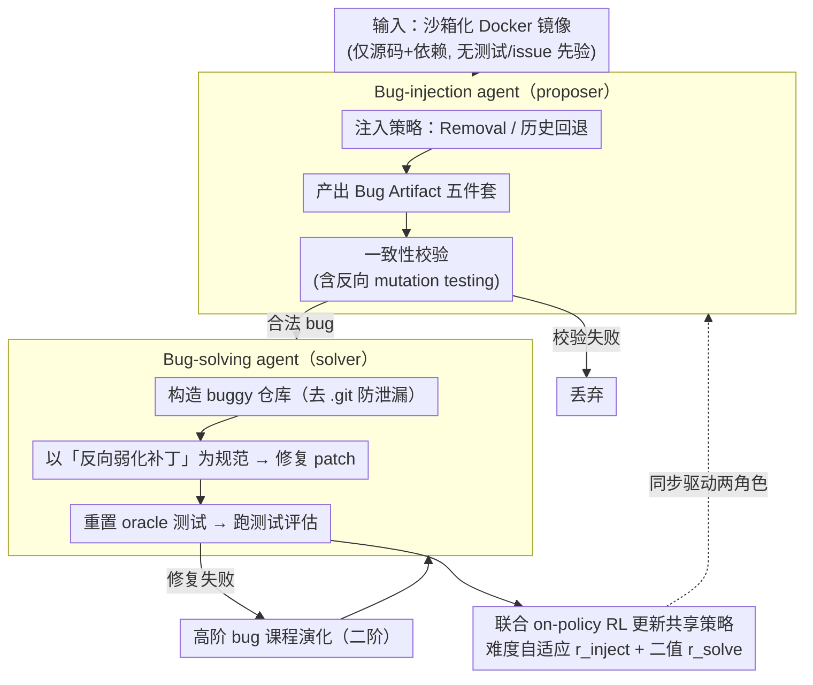

# Toward Training Superintelligent Software Agents through Self-Play SWE-RL

**会议**: ICML 2026  
**arXiv**: [2512.18552](https://arxiv.org/abs/2512.18552)  
**代码**: 无  
**领域**: LLM Agent / 软件工程 Agent / RL  
**关键词**: 自博弈, SWE-RL, Bug 注入, 一致性校验, 课程演化

## 一句话总结
本文提出 Self-play SWE-RL (SSR)，让同一个 LLM 在沙箱化代码仓里既扮演"造 bug 的 proposer"又扮演"修 bug 的 solver"，仅以 Docker 镜像为输入、用一致性校验和 solve-rate 作奖励做联合 RL，在 SWE-bench Verified 与 SWE-Bench Pro 上分别自我提升 +10.4 / +7.8 分，并稳定优于使用人类标注 issue + 测试套件的"human-data"基线。

## 研究背景与动机

**领域现状**：当前主流的软件工程 agent（SWE-agent、CWM、DeepSWE、Kimi-K2 等）都通过 RL with verifiable rewards 来训练，奖励信号来自人类标注的 issue 描述 + pass-to-pass / fail-to-pass 测试集，典型基准是 SWE-bench Verified。

**现有痛点**：一方面，人类标注的 issue + 测试既贵又不可靠（SWE-bench 必须出 Verified 子集靠人工核验），规模化困难；另一方面，即使加了 RL，agent 实质上还是在"复盘人类开发轨迹"，难以发现新的问题类与解法，天花板被人类知识锁死。

**核心矛盾**：要训练"超人类"软件 agent，就必须摆脱对人类标注数据/环境的依赖；但完全"zero-data" 的自博弈（如 Absolute Zero、R-Zero、LSP）只能在 Python 解释器规则内打转，学不到真实仓库中那些无法从语义推出的工程知识。换句话说，自博弈要"接地"（grounded in real codebases）才能突破固有知识边界。

**本文目标**：构建一个**只需要 Docker 镜像**（源码 + 依赖）即可自我进化的软件 agent，做到三件事：(1) 不依赖人写的 issue/测试命令/测试解析器；(2) 提议方和求解方共享同一组 LLM 参数联合训练；(3) 课程难度随当前策略持续演化。

**切入角度**：把代码仓里"运行测试 → 注入 bug → 弱化测试 → 修 bug"这一全套人类开发流程**形式化成一个由 agent 自己产生的 bug 制品（artifact）**——5 个文件就能完整定义一个 bug 与其修复规范。这样 bug 的"对错"完全由测试执行客观可验，奖励信号无需任何自然语言。

**核心 idea**：把代码仓自身当作"游戏规则"，让同一 LLM 在 bug-injection 与 bug-solving 两个角色间自博弈，用 solve-rate 把"造的 bug 难度刚好"作为 proposer 的奖励，把"修对所有测试"作为 solver 的奖励，配合"求解失败 → 升级为高阶 bug"的机制，让训练分布随策略自然演化。

## 方法详解

### 整体框架

SSR 想解决的是"软件 agent 被人类标注数据锁死天花板"的问题，做法是把整个训练分布交给 agent 自己生成：输入只是一组沙箱化 Docker 镜像（仅含源码与依赖，**不假设**已有测试、测试运行命令、测试解析器或语言/框架先验）。同一个 LLM 策略通过不同 prompt 实例化为两个角色并共享参数——**bug-injection agent** 在沙箱里用 Bash + editor 工具探索仓库、自学如何跑测试、最终产出一个经过一致性校验的 bug；**bug-solving agent** 则拿这个 bug 去修。proposer 的奖励来自"一致性校验 + solver 在该 bug 上的 solve-rate"（鼓励造出"难但可解"的 bug），solver 的奖励是测试是否全过的二值信号，两者联合做 on-policy RL。solver 修不掉的失败轨迹还会被回收成"二阶 bug"扩充分布。工具脚手架直接复用 Code World Model (CWM) 的实现，base model 用 CWM-sft（32B，CWM 的 RL 前 checkpoint），以保证和 baseline 公平对比。

### 关键设计

**1. Bug-injection 策略：Removal + 历史回退，且不给 solver 任何自然语言 issue**

作者发现若直接让 agent "随便注入 bug"，它会迅速塌缩到 `var=0 → var=1` 这种一行字面修改，奖励信号几乎为零。于是用两个简单 prompt 随机采样来保证 bug 既多样又非平凡：(a) **Removal-only** 要求 agent 删掉整个文件或代码块、并做必要兼容性修复保证仓库仍可构建，强迫 solver"从无到有"重建缺失功能、学到仓库结构理解；(b) **历史回退**让 agent 读 git log 挑有意义的历史变更反向应用，使 bug 模式贴近真实演化历史。给 solver 的 prompt 里**完全不合成自然语言 issue**，只把"`test_weaken.diff` 的反向"作为唯一的形式化规范——等价于告诉 solver"请实现让这些被弱化的测试重新通过的行为"，从根上回避了"如何自动评估自然语言 issue 质量"这个无解问题。这样一来，下游在 SWE-bench Verified（用真实自然语言 issue）上的提升只可能来自"学会写让测试通过的代码"这一根本能力，而非 in-domain 泄漏。ablation 里 removal 与 history-aware 随机混合取得最优表现。

**2. Bug Artifact 五件套 + 一致性校验：把"什么是合法 bug"从人工判断变成可执行验证**

自然语言 issue 既贵又无法自动判分，SSR 干脆用 5 个文件把"一个 bug 是什么、怎么判定修没修好"彻底形式化：`test_script.sh`（跑测试）、`test_files.txt`（评测前会被重置的 oracle 测试文件白名单）、`test_parser.py`（任意语言写的测试输出 → JSON 解析器）、`bug_inject.diff`（注入 bug 的 patch）、`test_weaken.diff`（弱化或删除现有测试以隐藏 bug）。每个 artifact 必须通过一整套自动校验才算合法——测试文件存在且覆盖弱化补丁触及范围、parser 能可靠输出 pass/fail JSON、原始码上 `test_script.sh` 至少跑出 `min_passing_tests` 个通过、`bug_inject.diff` 至少触及 `min_changed_files` 个文件、注入后至少 `min_failing_tests` 个原本通过的测试转为失败、弱化补丁能让某些失败测试恢复通过。其中最关键的是**反向 mutation testing**：对 bug patch 中每个文件单独回滚到 fixed 版本，若至少一个失败测试恢复通过则判定该文件"贡献于 bug"，否则整套 artifact 直接被拒——这道过滤专门防 proposer 塞一堆无关 diff 来骗过校验。而 `test_files.txt` 保证评测时 oracle 测试永远被重置回原版，堵死 solver"改测试而非改代码"的 hack 路径。正因为合法性完全可执行验证，奖励 $r_{\text{inject}}$ 才能在零人类标注下保持有意义。

**3. 难度自适应奖励 + 高阶 bug 课程演化：让训练分布跟着当前策略一起变难**

静态合成数据集（如 SWE-smith、BugPilot）的难度是固定的，agent 能力涨上去后就提供不了有效梯度。SSR 把"难度调度"内生到奖励里：设 solver 在某 bug 上的 solve-rate 为 $s\in[0,1]$，proposer 奖励为

$$r_{\text{inject}} = \begin{cases} -1.0 & \text{一致性校验失败} \\ -\alpha & \text{合法但 } s=0 \text{ 或 } s=1 \\ 1-(1+\alpha)s & 0<s<1 \end{cases}$$

其中 $\alpha=0.8$。这条曲线在"既非过易也非过难"的区间最大化奖励，同时对极端 solve-rate 只给小负值以保留梯度。solver 端则用极简二值奖励 $r_{\text{solve}}=+1$（全测通过）/ $-1$（其他）。课程演化靠**高阶 bug**实现：从原仓先应用 `bug_inject.diff` + `test_weaken.diff` 得到 buggy 仓库，再叠加 solver 之前失败的 `pred_patch.diff` 形成新的 buggy 状态，去掉 `.git` 重新初始化防泄漏，作为新一轮 solver 的输入；只做到二阶，再深就和已有 bug 重叠率太高。这恰好模拟真实开发里"改 A 又顺手写出 B"的层叠错误，逼 agent 学会 multi-step 编辑。

### 损失函数 / 训练策略

两个角色共享同一组 LLM 参数，奖励 $r_{\text{inject}}$ 与 $r_{\text{solve}}$ 分别作用于各自轨迹，联合做 on-policy RL 更新。评估时 temperature=1.0、top-p=0.95，每题只跑一次（无 best-of-N、无 reranker），以排除 test-time scaling 的干扰。Baseline 与 SSR 用**完全相同**的环境镜像和超参，唯一差异是 baseline 额外能看到人类 issue 描述与 pass-to-pass / fail-to-pass 测试，从而干净地隔离"自博弈"本身的贡献。

## 实验关键数据

### 主实验

| 基准 | 指标 | Base (CWM-sft) | Baseline RL (human-data) | SSR (本文) | 自我提升 |
|------|------|----------------|--------------------------|------------|---------|
| SWE-bench Verified | resolve rate | 起点 | 训练全程低于 SSR | **+10.4 pt 自提升** | +10.4 |
| SWE-Bench Pro (public) | resolve rate | 起点 | 训练全程低于 SSR | **+7.8 pt 自提升** | +7.8 |

> 关键观察：SSR 全程（不是仅最终点）在两个基准上都**稳定超过**使用人类 issue + 测试的 baseline RL，说明自生成任务比人类工程化数据提供了更丰富、更有效的学习信号。

### 消融实验

| 配置 | resolve rate 趋势 | 说明 |
|------|------------------|------|
| Full SSR (自博弈) | 稳定上升、最优 | proposer + solver 联合训练 |
| Injection-only | 下降 / 无收益 | 只训 proposer，没修复信号 |
| Repair-only | 提升但弱于 SSR | 只在过去 SSR 跑出的有效 bug 池上做 RL，缺少课程演化 |
| Direct-injection prompt | 最差 | bug 退化为一行字面修改 |
| Removal-only prompt | 中等 | 强迫重建功能 |
| **Removal + history** | **最优** | 历史回退引入真实复杂模式 |
| 二值 reward (忽略 solver feedback) | 仅略低于 full reward | solve-rate 信号噪声大、对 proposer 增益有限 |

平均 resolve rate 计算覆盖 1231 条任务（500 SWE-bench Verified + 731 SWE-Bench Pro）。

### 关键发现

- **自博弈比"修-only"重要**：repair-only 也用 SSR 产出的 bug 池训练，但缺少"边修边升级课程"的在线性，效果显著弱于 full SSR——说明真正的增益不是 bug 池本身的质量，而是分布跟随当前策略持续演化。
- **造 bug 也是学习**：proposer 必须探索如何跑测试、写 parser、设计弱化补丁，这些活动本身就是高质量训练信号，是 injection-only 失败、自博弈成功的关键差异点。
- **Solver-feedback 奖励边际收益小**：作者承认 $r_{\text{inject}}$ 中加入 solve-rate 项相比"只看一致性"提升微弱，原因是单个 $s$ 数值噪声大、且过易/过难其实并不有害——但即使忽略 solver 反馈，proposer 仍因策略在线更新而产出演化课程，这才是真正的护城河。
- **不写自然语言 issue 反而泛化**：训练时 solver 看到的只是"反向 test-weaken patch"，但在 SWE-bench Verified 上面对真实自然语言 issue 仍稳定提升，证明 SSR 学的是"写让测试通过的代码"这件根本能力。

## 亮点与洞察

- **"形式化 bug"取代"形式化 issue"是最聪明的设计选择**：自然语言 issue 既难自动评估又稀缺，而"bug 是什么"完全可以用 5 个可执行文件 + 一致性校验完整定义，把奖励彻底机器化。这一思路可以迁移到任何"输出难评估但执行结果易评估"的领域（如数学证明、SQL 优化、协议实现）。
- **反向 mutation testing 反 hacking 极妙**：proposer 完全可能塞一堆无关 diff 来骗过校验，作者用"逐文件回滚→看是否失败转通过"判定每个文件是否真正贡献于 bug，这等于给 proposer 加了一道"不许塞水"的过滤，且实现成本只是多跑几次测试。
- **高阶 bug 把失败变资产**：solver 失败的预测 patch 直接被回收成新 bug，既避免数据浪费、又自然模拟真实开发中"叠加错误"的多步编辑场景，这套机制可推广到所有 self-play 框架——"对手的弱点"应该成为下一轮训练的核心。
- **Grounded self-play 是关键差异点**：作者用"只会 Python 解释器的人 vs. 能读真实 GitHub 仓库的人"这个思想实验，清晰刻画了 ungrounded zero-self-play（Absolute Zero / R-Zero）的天花板——真正的超人类能力必须"接地"到外部世界的真实复杂性。

## 局限与展望

- **作者承认的局限**：评估只覆盖 1 次 attempt、无 test-time scaling，单基准结果与顶级闭源系统仍有差距；只测试到二阶 bug，更深层级因与已有 bug 重叠率高被回避，长期是否能继续演化未验证。
- **方法层面**：所有 bug 都通过"破坏现有代码 → 修复"产生，本质上仍在 "已有代码的语义流形" 内打转，agent 不会自发提出"这个仓库还缺一个 feature X"这类创造性任务；要真正"超人类"，下一步必须把任务定义从 bug-fixing 扩展到 feature-adding / refactoring 等正向开发。
- **奖励层面**：solve-rate feedback 经验证收益极弱，说明当前 proposer 几乎只靠一致性校验在学，"造一个对当前 solver 来说难度刚好的 bug"这件事并未真正被显式优化；未来可探索基于"信息增益"或"学习进度"的更密集 proposer 奖励。
- **可改进**：可以引入跨仓泛化测试（在仓库 A 上自博弈训练→评测仓库 B），目前只在单一镜像池内训练评估；另外二阶以上 bug 的去重可以靠语义 hash 而非简单避免。

## 相关工作与启发

- **vs SWE-RL (Wei et al., 2025)**: SWE-RL 是首个开源用 RL + 规则奖励训练 SWE LLM 的工作，但其训练信号来自 GitHub PR 等人类演化数据；SSR 把这套思想推到极致——**完全不需要人类标注**，仅靠沙箱镜像，由 agent 自己产生整个训练分布。
- **vs SWE-smith / BugPilot (Yang 2026a / Sonwane 2025)**: 这些工作同样用 LLM 合成 bug 与环境，但 (a) 依赖测试套件、parser、teacher model 蒸馏等更强的人类先验；(b) 是**静态**生成 pipeline，不随 agent 能力演化；SSR 既最小化先验又把 bug 生成在线耦合到 RL 训练。
- **vs Absolute Zero / R-Zero / LSP (Zhao 2025 / Huang 2025 / Kuba 2025)**: 这些 ungrounded 自博弈只能在固定规则空间（Python 解释器、推理任务）内打转，无法获取规则外的世界知识；SSR 通过"grounded in real repositories"突破这层天花板。
- **vs SPICE (Liu 2025)**: SPICE 也强调 corpus-grounded self-play 以获取外部世界反馈来提升通用推理，SSR 可视为该思想在软件工程域的具体落地，且把"corpus"具象化为可执行 Docker 镜像，奖励完全可由执行决定。
- **vs CWM (FAIR CodeGen 2025)**: CWM 是 32B 开源 SOTA 编码 agent，SSR 直接以 CWM-sft 为底座，证明在不再增加人类数据的前提下，仅靠自博弈就能继续把 CWM 系列往前推。

## 评分
- 新颖性: ⭐⭐⭐⭐⭐ 首次把 grounded self-play 在软件工程 agent 上跑通，"bug artifact 五件套 + 反向 mutation testing + 高阶 bug" 整套形式化是真正的方法学贡献。
- 实验充分度: ⭐⭐⭐⭐ 双基准 + 三组关键 ablation（自博弈组件 / 注入策略 / 奖励项）涵盖到位，但缺跨仓泛化与 scale-up 曲线，整体属于"first step"定位下的合格证明。
- 写作质量: ⭐⭐⭐⭐⭐ 动机推导极清晰（"只会 Python 解释器的人"思想实验出彩），方法各环节图示充分、奖励/校验定义严谨，读完一遍即可复现概念框架。
- 价值: ⭐⭐⭐⭐⭐ 给"如何让软件 agent 突破人类标注数据天花板"提供了完整、可执行、可扩展的范式，且 base model 选用开源 CWM-sft，为社区后续 scale-up 自博弈奠定了基础。

<!-- RELATED:START -->

## 相关论文

- [\[ICML 2026\] On Effectiveness and Efficiency of Agentic Tool-calling and RL Training](on_effectiveness_and_efficiency_of_agentic_tool-calling_and_rl_training.md)
- [\[ICML 2026\] REAL：把回归感知奖励塞进 RL，让 LLM-as-a-Judge 学会"差一分也是差"](real_regression-aware_reinforcement_learning_for_llm-as-a-judge.md)
- [\[ACL 2025\] AndroidLab: Training and Systematic Benchmarking of Android Autonomous Agents](../../ACL2025/llm_evaluation/androidlab_autonomous_agent.md)
- [\[NeurIPS 2025\] AdaSTaR: Adaptive Data Sampling for Training Self-Taught Reasoners](../../NeurIPS2025/llm_evaluation/adastar_adaptive_data_sampling_for_training_self-taught_reasoners.md)
- [\[ACL 2026\] Enhancing Linguistic Competence of Language Models through Pre-training with Language Learning Tasks](../../ACL2026/llm_evaluation/enhancing_linguistic_competence_of_language_models_through_pre-training_with_lan.md)

<!-- RELATED:END -->
