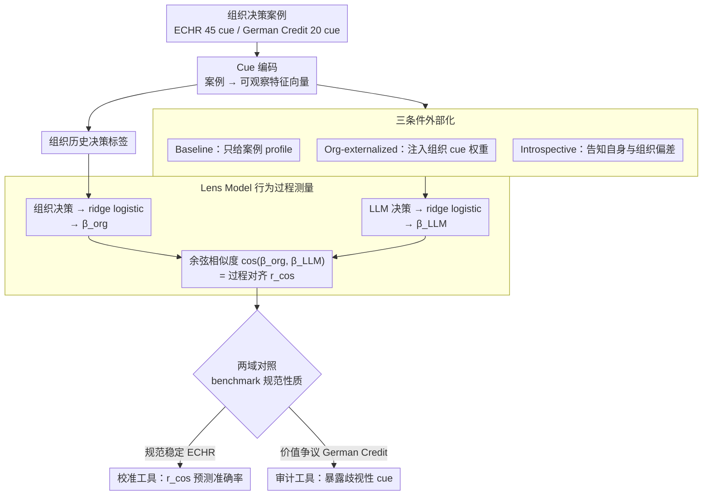

# Whose Alignment? Comparing LLM Process Alignment Across Diverse Organizational Decision Contexts

**会议**: ICML2026  
**arXiv**: [2605.25256](https://arxiv.org/abs/2605.25256)  
**代码**: 未见公开代码  
**领域**: LLM评测 / 对齐评估 / 组织决策  
**关键词**: pluralistic alignment, process alignment, Brunswik lens model, 组织决策, 公平性审计  

## 一句话总结
这篇论文提出 CALM 来评估 LLM 是否按组织真实决策过程而不只是输出结果对齐，并通过 ECHR 法律裁判与 German Credit 信贷决策的对比说明：在规范稳定的领域过程对齐能预测准确率，而在价值争议领域，高过程对齐既难实现也未必应该追求。

## 研究背景与动机
**领域现状**：LLM alignment 通常被描述成让模型更符合“人类偏好”或某个目标组织的行为。但现实里组织本身不是单一价值源。法院、银行、医院、公司都沉淀了不同的制度经验、历史惯例和隐性判断方式，这些组织之间的价值差异同样构成 pluralistic alignment 问题。

**现有痛点**：常见评测只看输出是否正确，比如判决是否和法院一致、信贷批准是否和历史标签一致。问题是，模型可能用错误理由得到正确答案，也可能在当前分布上碰巧准确，却在未见案例上按完全不同的 cue weighting 决策。输出准确率无法告诉我们模型到底是否学到了组织的决策政策。

**核心矛盾**：组织对齐不只是“像组织一样输出”，而是“像组织一样权衡信息”。但组织决策政策有时是合法、稳定且公开可说明的，有时又是历史形成、带有歧视性或道德争议的。于是过程对齐本身变成一个规范问题：模型应该对齐哪个组织、哪个时期、哪套价值标准。

**本文目标**：论文希望构建一种 process-level measurement，直接估计组织和 LLM 各自如何使用可观察 cues，并比较它们的 cue-weighting policy 是否一致。作者还想证明这个指标在不同组织决策场景下有不同用途：在合法规范明确的场景中可用于校准，在争议场景中更适合作为审计工具。

**切入角度**：作者借用 Brunswik Lens Model，把决策看作 observable cues 的线性组合。对组织历史决策和 LLM 输出分别拟合 ridge logistic regression，得到 policy coefficient vector，再用 cosine similarity 衡量过程对齐。

**核心 idea**：用模型实际输入输出反推出 cue-utilization policy，比较 LLM 和组织在“如何做决定”上的相似度，而不是只比较最终 decision label。

## 方法详解
论文提出的 CALM（Contextualized Alignment Lens Model）本质上是一个行为审计框架。它不需要访问模型权重，也不依赖 chain-of-thought 是否诚实；只需要同一批 case、同一套可解释 cues、组织 benchmark 决策和 LLM 决策。

### 整体框架
第一步，给每个组织决策案例编码一组 cues。ECHR Article 6 案例里是 45 个二值特征，覆盖 Delay、Counsel、EvidenceAndArms、TribunalIntegrity 等法理相关 cue families；German Credit 里是 20 个信贷特征，如贷款期限、金额、年龄、就业、住房、性别/婚姻状态、foreign_worker 等。

第二步，基于组织 benchmark 决策拟合 ridge logistic regression，得到组织政策向量 $\beta_{org}$。同样地，对某个 LLM 在某个 prompting condition 下的所有决策拟合 ridge logistic regression，得到 $\beta_{LLM}$。第三步，用 $\cos(\theta)=\frac{\beta_{org}\cdot\beta_{LLM}}{\|\beta_{org}\|\|\beta_{LLM}\|}$ 作为过程对齐分数。

论文测试三种条件：Baseline 只给 structured case profile；Org-externalized 把组织 cue weighting policy 明确写入 prompt；Introspective-externalized 则告诉模型它自己的 baseline policy 与组织 policy 的偏差，并要求自我修正。随后比较 cosine alignment、output accuracy、AUC、Cohen's kappa、propensity correlation 等指标。整条流水线可视化如下：

### 关键设计

**1. Lens Model 行为过程测量：从行为反推 policy，不信解释文本**

CALM 要解决的第一个难题是「怎么知道模型到底在按什么权衡信息」。直接问模型、读它的 chain-of-thought 都不可靠——CoT 可以不忠实，人工解释也常是事后合理化。论文转而走纯行为路线：把每个案例编码成同一套可观察 cues，再对组织历史标签和某个 LLM 在某条件下的全部决策分别拟合同一套 ridge logistic regression，得到两个系数向量 $\beta_{org}$ 与 $\beta_{LLM}$，每个系数代表对应 cue 的使用方向与强度。两条政策是否同向，用余弦相似度 $\cos(\theta)=\frac{\beta_{org}\cdot\beta_{LLM}}{\|\beta_{org}\|\|\beta_{LLM}\|}$ 度量，落在 $[-1,1]$，1 表示完全对齐、0 正交、负值相反。这样估出来的是模型在整批案例上的「行为基准真值」，不依赖任何单条 reasoning trace，也不需要模型权重，天然适合做黑盒过程审计。

**2. 三条件外部化：检验组织知识能否被 faithful steering**

光测出对齐分数还不够，论文想知道「如果明确把组织政策告诉模型，它能不能真的朝那套决策过程移动」——这正是 pluralistic alignment 里 steerable pluralism 的核心。于是设计三种递进的 prompting 条件：Baseline 只给结构化案例 profile，暴露模型预训练带来的隐式 policy；Org-externalized 把组织回归得到的 cue 权重按 strong/moderate/weak 分档、连同方向写进 prompt，测「把隐性知识显性化」能否补上 knowledge gap；Introspective-externalized 则告诉模型它自己 baseline policy 与组织的整体偏差，要求自我修正。每种条件都重新拟合 $\beta_{LLM}$、重算 $r_{cos}$，并用 bootstrap permutation（1,000 次 shuffle）做显著性检验，看对齐是否真的提升。关键在于这给「faithful steering」提供了可测量标准：steering 不是表面模仿输出，而是 cue-weighting policy 真的向目标组织靠拢。

**3. 两个规范性质迥异的领域对照：过程对齐不是单一好目标**

如果只在一个「干净」领域上测，很容易把「高对齐 = 好」当成普遍结论。论文刻意选两个规范性质相反的组织域做对照：ECHR Article 6 是相对稳定、公开可说明的法律领域，cue 权重沉淀的是累积法理；German Credit 来自 1990 年代某德国银行的历史信贷决策，20 个 cue 里含 age、personal_status_sex、foreign_worker 等受保护属性，可能编码了已被反歧视法部分推翻的歧视性实践。两域分别检验 process alignment 与 accuracy 的关系、以及 externalization 是否有效，从而暴露出 CALM 的双重角色——在规范合法的领域它是「校准工具」（对齐越高、输出越准，可指导外部化补差距），在争议领域它退化为「审计工具」（能让模型/组织在敏感属性上的权衡变得可见、可质询，但不替你裁决该不该忠实复制这套政策）。这个对照本身就是论文最核心的 pluralistic 发现：能被测量、能被 steering，不等于应该被对齐。

### 损失函数 / 训练策略
CALM 本身不是训练方法，而是评估/审计方法。核心估计器是 ridge-regularized logistic regression；显著性通过 bootstrap permutation（1,000 次 shuffle）检验。ECHR 研究测试 10 个模型、3 个 prompting 条件、1,000 个 Article 6 cases；German Credit 研究测试 5 个模型、2-3 个条件、balanced subset 600 cases，并以规范 logistic regression 的 75.1% accuracy / 0.751 AUC 作为历史 benchmark 上限。

## 实验关键数据

### 主实验
两组实验的对比是论文最关键的结果。ECHR 中，过程对齐和输出准确率强相关；German Credit 中，这个关系几乎消失。

| 领域 | 数据与模型 | 过程对齐-准确率关系 | 组织benchmark性质 | 主要结论 |
|------|------------|---------------------|-------------------|----------|
| ECHR Article 6 | 1,000 案例，10 个 LLM，3 条件 | $r=0.85$, $p<.001$ | 稳定、公开、法理化的法院标准 | 过程对齐越高，输出准确率越高；外部化能帮助低对齐模型 |
| German Credit | 600 balanced cases，5 个 LLM，2-3 条件 | $r=0.15$, $p=.60$ | 历史银行决策，含潜在歧视 cue | 过程对齐与准确率正交；高对齐不一定是正当目标 |

ECHR baseline 中，不同模型的 $r_{cos}$ 差异很大：GPT-5.4-mini 为 0.844，Grok 4.1 Fast 为 0.842，GPT-5.4 为 0.824；而 Mistral Large 为 0.083，DeepSeek-v3.2 为 0.062，Claude Haiku 4.5 为 -0.057，GPT-5.4-nano 为 -0.211。组织外部化对低对齐模型帮助最大，例如 GPT-5.4-nano 提升 +0.906，Claude Haiku 4.5 提升 +0.682，Minimax M2.7 提升 +0.176。

German Credit baseline 则呈现完全不同模式。五个模型准确率都只有 44-54%，远低于 75.1% 的规范 logistic ceiling，但 cue policy 差异很大。

| 模型 | Baseline $r_{cos}$ | Acc | AUC | Good% | 观察 |
|------|--------------------|-----|-----|-------|------|
| Claude Haiku 4.5 | +0.503 | 53.5 | 0.930 | 9.2 | 几乎都判 Bad，AUC 高但阈值/政策异常 |
| GPT-5.4-mini | +0.060 | 48.3 | 0.961 | 68.0 | 最接近历史 70% Good base rate |
| GPT-5.4-nano | +0.499 | 44.2 | 0.936 | 50.5 | 对齐高但准确率低 |
| Grok 4.1 Fast | -0.229 | 48.8 | 0.882 | 37.5 | 负对齐但准确率与其他模型接近 |
| DeepSeek-v3.2 | +0.264 | 52.5 | 0.925 | 5.5 | 极端保守，几乎都判 Bad |

### 消融实验
| 干预 | ECHR效果 | German Credit效果 | 说明 |
|------|----------|-------------------|------|
| Org-externalized | 8/10 模型向组织 policy 移动，低对齐模型显著提升 | 2 个模型提升，3 个下降，平均不稳定 | 稳定规范可被 prompt 外部化，争议规范不一定 |
| Introspective externalized | 6/10 模型点估计提升，但 Grok 4.1 Fast 退化 -0.346 | 4 个可评模型中 3 个下降 | 自我修正反馈可能扰乱原本好的隐式 policy |
| German Credit Grok introspective | 不适用 | 99.5% cases 被判 Good | 模型把 base-rate feedback 当硬规则，出现退化过校正 |
| Protected attribute analysis | 法律 cue 与法理相对一致 | foreign_worker、age、sex 等 cue 与公平规范冲突 | CALM 暴露了模型/组织在敏感属性上的权衡差异 |

### 关键发现
- 在 ECHR 这种规范相对明确的领域，过程对齐可作为 calibration target：模型越像法院一样使用 cues，越容易得到正确输出。
- 在 German Credit 这种历史/公平性有争议的领域，过程对齐更像 audit signal：它告诉我们模型是否复刻历史银行政策，但不告诉我们这是否应该被优化。
- 输出准确率掩盖了 policy 差异。German Credit 中，Good% 从 5.5% 到 68.0% 不等，但准确率都在 44-54% 附近，说明相似 output metric 下可能有完全不同的组织价值实现方式。
- 模型可能主动抵抗受保护属性的组织政策信号。Claude 在 baseline 中把 foreign_worker 高权重使用得很多，却又经常不提 age/sex；干预后也不稳定，反映训练期安全/公平规范与历史组织政策之间的冲突。

## 亮点与洞察
- 论文最有价值的不是提出一个新的 alignment 分数，而是明确提出“whose alignment”的问题。组织不是天然正确的价值目标，历史政策、公开规范和当代法规可能彼此冲突。
- CALM 的黑盒行为测量很实用。它不依赖 CoT，也不需要模型内部表示，只要能批量查询模型并有 cue 编码，就能估计 process policy。
- 两域对照设计很强。ECHR 证明 process alignment 有校准价值，German Credit 则防止读者把高对齐误解成普遍善。
- 对监管很有启发。EU AI Act 等高风险 AI 要求透明和人类监督，但很多评估仍停留在准确率/公平差异；CALM 提供了“决策是否以正确方式达成”的第三类审计维度。

## 局限与展望
- Lens model 使用线性 cue weighting 作为过程代理，适合解释审计，但可能漏掉 LLM 或组织决策中的非线性交互、上下文依赖和例外规则。
- cue 编码质量很关键。ECHR cues 由 GPT-5.4-mini 按 codebook 编码，若 cue extraction 有系统偏差，后续 alignment 估计也会受影响。
- German Credit 只测试了 5 个模型，且部分条件缺失；作者也承认完整复制应覆盖 ECHR 中全部模型。
- CALM 能暴露历史政策可能歧视，但不能自动判定应该对齐哪个规范目标。真正部署时仍需法律、伦理和组织治理共同决定 benchmark。
- 论文提出 future work 要比较 behavioral cue weights 和 explicit reasoning cue mentions。这个方向很重要，因为模型可能行为上权重某些 cue，却在解释中引用另一套 cue。

## 相关工作与启发
- **vs RLHF/偏好对齐**: RLHF 常学习聚合偏好，容易走向单一 consensus；CALM 关注组织级 steerable pluralism，即指定某个组织政策时模型是否真的按该政策权衡信息。
- **vs 输出准确率评测**: accuracy/AUC 只看结果，CALM 估计过程。German Credit 的结果说明相似准确率可以掩盖完全不同的隐式政策。
- **vs fairness metrics**: demographic parity 等指标看群体结果差异，CALM 看受保护属性是否在决策过程中被加权，为公平审计补充过程层证据。
- **vs chain-of-thought审计**: CoT 可能不忠实；CALM 直接从批量行为反推 cue policy，可作为更稳健的黑盒过程审计工具。

## 评分
- 新颖性: ⭐⭐⭐⭐☆ 把 Brunswik Lens Model 引入组织级 LLM process alignment 很有辨识度，问题 framing 尤其好。
- 实验充分度: ⭐⭐⭐⭐☆ 两个领域对照清晰，模型和条件覆盖合理；German Credit 复制规模仍可扩大。
- 写作质量: ⭐⭐⭐⭐☆ 论证逻辑清楚，社会技术含义写得充分；部分模型命名和数据设定较密集。
- 价值: ⭐⭐⭐⭐⭐ 对 LLM 高风险决策部署、组织对齐和公平审计都有直接启发，尤其提醒“对齐谁”本身就是治理问题。

<!-- RELATED:START -->

## 相关论文

- [\[NeurIPS 2025\] On Evaluating LLM Alignment by Evaluating LLMs as Judges](../../NeurIPS2025/llm_evaluation/on_evaluating_llm_alignment_by_evaluating_llms_as_judges.md)
- [\[NeurIPS 2025\] Leveraging Robust Optimization for LLM Alignment under Distribution Shifts](../../NeurIPS2025/llm_evaluation/leveraging_robust_optimization_for_llm_alignment_under_distribution_shifts.md)
- [\[NeurIPS 2025\] ComPO: Preference Alignment via Comparison Oracles](../../NeurIPS2025/llm_evaluation/compo_preference_alignment_via_comparison_oracles.md)
- [\[NeurIPS 2025\] Beyond the Surface: Enhancing LLM-as-a-Judge Alignment with Human via Internal Representations](../../NeurIPS2025/llm_evaluation/beyond_the_surface_enhancing_llm-as-a-judge_alignment_with_human_via_internal_re.md)
- [\[ICML 2026\] Multi$^2$: Hierarchical Multi-Agent Decision-Making with LLM-Based Agents in Interactive Environments](multi2_hierarchical_multi-agent_decision-making_with_llm-based_agents_in_interac.md)

<!-- RELATED:END -->
