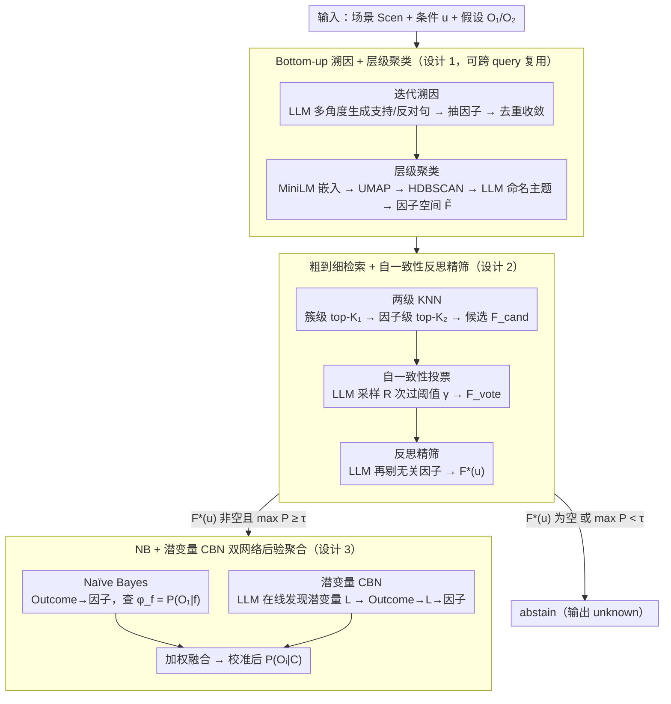

# ANCHOR: Abductive Network Construction with Hierarchical Orchestration for Reliable Probability Inference in Large Language Models

**会议**: ICML 2026  
**arXiv**: [2605.10328](https://arxiv.org/abs/2605.10328)  
**代码**: 未公开  
**领域**: LLM 推理 / 概率推断 / 因果贝叶斯网络  
**关键词**: abductive reasoning, Bayesian inference, LLM uncertainty, causal Bayesian network, hierarchical factor space

## 一句话总结
ANCHOR 用"自底向上溯因 + 层级聚类" 构造稠密因子空间，对下游条件做粗到细检索得到稀疏相关因子集，再联合 Naïve Bayes 与一个 LLM 现场构造的潜变量因果贝叶斯网络做后验聚合，在 LLM 高风险决策场景中显著减少 "unknown" 预测并提升概率校准。

## 研究背景与动机

**领域现状**：在应急响应、基础设施规划等高风险决策中，需要从 LLM 拿到可靠的条件概率 $P(O_i|C)$ 估计。主流方案 (如 BIRD) 采取"溯因 + 贝叶斯" 两阶段——LLM 先从场景 Scen 生成离散因子集 $F=\{F_1,\dots,F_N\}$ 与其取值，再用 Naïve Bayes 边际化 $P(O_i|C)=\sum_f P(O_i|f)\prod_j P(f_j|C)$。

**现有痛点**：两难——(a) 前向溯因易生成稀疏因子空间，导致下游条件 $u$ 映射到 0 个因子，模型输出 "unknown"；(b) 强行扩大因子集会引入噪声、产生伪相关 (e.g. "天气冷" 与 "穿厚衣" 高度相关)，破坏 Naïve Bayes 的条件独立性假设。

**核心矛盾**：因子空间的覆盖度 (避免 unknown) 与独立性 (避免伪相关) 此消彼长；同时 LLM 本身给出的数值置信度往往过自信且不可解释，无法直接当概率使用。

**本文目标**：(1) 构造一个既稠密又结构化的因子空间，能在覆盖与噪声之间取得平衡；(2) 设计一个可靠的"条件→相关因子" 检索机制；(3) 在概率推断阶段显式建模因子间隐变量依赖，缓解 Naïve Bayes 独立性假设的失真。

**切入角度**：反转传统"从上而下溯因"为**自底向上溯因**——先大量自由生成支持/反对句子再抽因子，最后用聚类 + LLM 主题命名把因子组织成两级层次；并用 LLM 在线推断潜变量结构来打造一个 query 级的因果贝叶斯网络 (CBN)，专门为本次条件 $u$ 服务。

**核心 idea**：把"溯因 → 因子提取 → 检索 → 概率聚合" 做成端到端的四阶段流水线，每一阶段都让 LLM 干它最擅长的事 (生成 / 抽取 / 命名 / 因果发现 / 弹性先验)，而把概率运算交给 NB + CBN 两个轻量模型并最终加权融合。

## 方法详解

### 整体框架
ANCHOR 接收一个场景描述 Scen、一个下游条件 $u$ 和两个候选假设 $O_1, O_2$，目标是吐出一个校准过的 $P(O_i|C)$。它把整件事拆成四步流水：先一次性 bottom-up 溯因建一个稠密又分层的因子空间 $\tilde{F}$（这步可在多个 query 间复用），来了条件 $u$ 后在 $\tilde{F}$ 上做粗到细检索 + LLM 精筛，得到一个稀疏的相关因子集 $F^*(u)$；再让 LLM 弹性给出因子级后验和潜变量参数，同时搭一个 Naïve Bayes 网络和一个带潜变量的因果贝叶斯网络（CBN）；最后把两个网络的后验加权融合。当 $F^*(u)$ 为空或 $\max_i P(O_i|C)<\tau$ 时，它不硬答，直接 abstain。

### 关键设计

**1. Bottom-up 溯因 + 层级聚类：先海量产因子，再归并出结构**

BIRD 那一类前向溯因从场景直接想因子，受 prompt 视野限制只能想到少数几个，下游条件经常映射到 0 个因子、被迫输出 "unknown"。ANCHOR 把顺序反过来：从空集 $F^{(0)}=\emptyset$ 起迭代最多 $T_{max}$ 轮，每轮先用 few-shot 提示让 LLM 从多个角度生成 $b$ 条支持/反对句子，再从句子里抽因子并入 $F$，去掉语义重复后判收敛；理论上每轮回收因子集合的错误率在多次自一致性投票下被 $\exp(-2m(q-0.5)^2)$ 上界（$q$ 为单次正确率、$m$ 为投票数），保证几何级收敛。攒够因子后再后置结构化：MiniLM 嵌入 → UMAP 降维 → HDBSCAN 聚类（无须预设簇数 $K$）→ 让 LLM 给每簇取主题名（如 "Economic Feasibility"）并裁掉冗余，最后把每个因子标成 supports $O_1$ / supports $O_2$ / neutral，得到两级层次 $\tilde{F}$。这样把"想全"（自由生成）和"放好"（事后聚类）解耦，既补上了覆盖度、又给出可复用的结构。

**2. 粗到细分层检索 + 自一致性反思精筛：把条件 $u$ 映射到高精度因子子集**

因子空间一旦做稠密，对每个 $u$ 暴力比对所有因子计算量就爆了，而且检索召回的因子里混着大量伪相关。ANCHOR 先给每个簇算一个原型嵌入 $\tilde{C}_j=\alpha\cdot e_{theme}+(1-\alpha)\cdot \frac{1}{|F_j|}\sum_{f\in F_j} e_f$，把主题语义和成员均值按 $\alpha$ 混合；然后两级 KNN——先在 cluster 级取 top-$K_1$ 个簇，再在每个选中簇内的 factor 级取 top-$K_2$ 个因子，并集作为高召回候选 $F_{cand}(u)$，把复杂度压到 $O(K_1 K_2)$。接着是两段互补的 LLM 精筛：第一段调 LLM $R$ 次让它从候选里挑"被 $u$ 直接支持"的因子，统计票数 $v_f(u)=\sum_r \mathbf{1}[f\in m^{(r)}(u)]$，过阈值 $\gamma$ 的留下成 $F_{vote}(u)$，用重复采样压偶发噪声；第二段换一个反思 prompt，让 LLM 显式把仍不直接相关的因子再剔一遍，得到最终 $F^*(u)$。"投票"治随机噪声、"反思"治系统性召回偏差，两种 prompt 形态各打一类错误，比单纯加大 $R$ 更省也更准。

**3. NB + 潜变量 CBN 双网络弹性参数 + 后验聚合：在简洁与相关性之间两头都要**

纯 Naïve Bayes 假设因子条件独立，可现实里"经济因素"内部一堆因子高度相关（天气冷 ↔ 穿厚衣），独立假设一失效概率就有偏。ANCHOR 同时搭两个网络再融合。NB 这边结构最简单：根节点 Outcome（$O_1/O_2$）直连每个因子 $f_j$，向 LLM 查 $\phi_f=P(O_1|f)$，用对称先验近似 $P(f|O_1)\approx\phi_f$、$P(f|O_2)\approx 1-\phi_f$。CBN 这边让 LLM 当一次因果发现引擎：给定因子列表后输出一组潜变量 $L=\{L_1,\dots,L_k\}$ 及各自下辖的因子分组，图结构变成 Outcome $\to L_i \to f_j$，再让 LLM 弹性填 $P(L_i=1|O_k)$、$P(f_j|L_i,O_k)$ 等条件表——潜变量充当一组因子的共同父节点，把类内相关性吸收掉，而且全靠 LLM 先验、不需要任何训练数据。两个网络各自推出 $P^{NB}(O_i|C)$ 和 $P^{CBN}(O_i|C)$ 后加权融合：NB 偏向简洁但忽略相关、CBN 抓相关但易过参数化，两者偏差方向不同，融合相当于互补降噪。值得注意的是潜变量是每个 query 现场推断的，所以每次都有一张定制 CBN，避开了"跨场景共享潜变量结构错配"的坑。

### 损失函数 / 训练策略
ANCHOR 不训练任何神经网络，所有概率参数都靠 LLM 弹性获取，因此只有一组超参需要设：因子聚类的 $K_1, K_2$、cluster 原型加权系数 $\alpha$、自一致性查询次数 $R$、投票阈值 $\gamma$、abstain 阈值 $\tau$、迭代轮上限 $T_{max}$、目标因子数 $N_{target}$、以及 NB-CBN 融合权重。实验用 GPT-4 系列 / Qwen 等模型，所有 prompt 模板见附录。

## 实验关键数据

### 主实验
作者声称在与 BIRD 一致的 preference-based pairwise 评测基准 (multiple LLM-driven decision tasks) 上 ANCHOR 取得 SOTA。代表性指标 (基于摘要与正文表述整理；具体数值在附录 D)：

| 方法 | "unknown" 预测率↓ | 与人类偏好对齐率↑ | 推断时间↓ | Token 用量↓ |
|------|-------------------|--------------------|----------|--------------|
| 直接 LLM 估计 | 较低 | 偏低 (过自信) | 低 | 低 |
| BIRD (前向溯因 + NB) | 高 (因子稀疏) | 中等 | 中 | 中 |
| BIRD + 扩大因子集 | 中等 | 中等偏低 (噪声) | 高 | 高 |
| **ANCHOR (完整)** | **显著降低** | **SOTA** | **显著降低** | **显著降低** |

### 消融实验

| 配置 | 现象 | 解读 |
|------|------|------|
| 仅 bottom-up 因子空间 + NB | unknown 率较 BIRD 大幅降低，但概率有偏 | 稠密因子覆盖解决稀疏问题 |
| 加分层检索 (无投票/反思) | 因子集召回高但精度差 | 仅 retrieval 不足，需精筛 |
| 加自一致性投票 | 精度回升 | 投票剔除偶发噪声因子 |
| 加反思 prompt | 进一步剔残余无关因子 | 两阶段精筛互补 |
| 用纯 NB 推断 | 在相关性强的因子上有偏 | 独立假设失效 |
| 用纯 CBN 推断 | 结构不稳易过参数化 | 单网络对潜变量错配敏感 |
| **NB + CBN 加权** | 校准最好 | 互补降噪 |

### 关键发现
- 同时减少 unknown 与减少推断成本是 ANCHOR 最重要的工程贡献——构造一次结构化因子空间后可在多个下游 query 间复用，单 query 检索 + 推断仅需 $O(K_1 K_2)$ 次 LLM 调用，相比 BIRD 大幅降低 token 用量。
- 自一致性投票次数 $R$ 与召回-精度权衡敏感；反思 prompt 的引入相比单纯增加 $R$ 更有效，说明 LLM "结构化批评" 比"重复采样" 信息量更大。
- 潜变量是 LLM 在线推断而非全局学得，每个 query 拥有自定义 CBN 结构，规避了"跨场景共享潜变量结构错配" 的问题。

## 亮点与洞察
- **角色分工干净**：把生成、抽取、命名、因果发现、参数弹性这些"LLM 擅长" 的任务交给 LLM；把概率运算交给 NB+CBN 的图模型。这种"概率引擎 + LLM 知识库" 的分工对所有"用 LLM 替代专家知识" 场景都是好范式。
- **可复用结构 vs 一次性推理**：因子层次 $\tilde{F}$ 只需构造一次，下游 query 反复检索——把"昂贵的 LLM 推理" 摊薄到"廉价的向量检索"，工程角度极其友好。
- **abstain 当一等公民**：明确把 "unknown" 设为正常输出 (而非错误)；高风险场景下"宁可不答也别乱答" 比强行给数字更负责任。
- **潜变量 query 级现场构造**：传统因果推断要求结构稳定，本文允许 CBN 因 query 而变，相当于做"按需因果推断"。这思路可推广到对话系统、医学决策。

## 局限与展望
- 所有参数依赖 LLM 弹性，若 LLM 给的条件概率 $\phi_f$ 系统性偏差 (过自信 / 反映训练语料偏见)，整个框架也会偏；缺少对 $\phi_f$ 校准的独立验证。
- CBN 由 LLM 在线生成的结构没有形式化的合理性检查，存在"幻觉潜变量" 风险；论文未给出当 LLM 给出错乱因果图时的兜底机制。
- 自底向上溯因的收敛由 $T_{max}$ 与目标因子数 $N_{target}$ 控制，作者证明几何级收敛但实际质量随 LLM 多样性而变；冷门场景可能仍稀疏。
- 评测基准依赖 preference-based pairwise，无 ground-truth 概率，难以判断 ANCHOR 输出的数值本身是否真实校准 (只有"和人类偏好一致" 的代理指标)。
- NB+CBN 融合权重需要手工指定，缺乏自适应方案。

## 相关工作与启发
- **vs BIRD (Feng et al. 2025)**：BIRD 用前向溯因 + 单一 NB，易稀疏 + 易违反独立；ANCHOR 翻转溯因方向 + 加层级 + 加 CBN，两个症结都对症下药。
- **vs CoT / ToT / Belief Graph**：思维链/树/信念图是反应式分解，每个 query 重新做；ANCHOR 是主动式分解，把可复用的因子空间预先建好，效率与稳定性更高。
- **vs Graph RAG / 层级 RAG**：传统结构化 RAG 索引已有文档，ANCHOR 从零生成知识源 (因子) 再组织，更适合"领域文档不存在"的决策场景。
- **vs LLM 内部不确定性方法 (verbalized confidence / sampling)**：直接问 LLM "你多自信" 不可靠；ANCHOR 通过显式概率图把不确定性"外化" 出来，更可解释。

## 评分
- 新颖性: ⭐⭐⭐⭐ Bottom-up 溯因 + 现场构造 CBN + NB-CBN 融合三件套是一个有机组合，单点都有先例但组合方式新颖。
- 实验充分度: ⭐⭐⭐ 主表与消融在附录较完整；但缺少与 ground-truth 概率的校准对比，且没有大规模跨域泛化测试。
- 写作质量: ⭐⭐⭐⭐ 动机 → 痛点 → 流水线推导链条清晰，公式与流程图配合得当。
- 价值: ⭐⭐⭐⭐ 在 LLM 高风险决策这条线上，把"减少 unknown + 校准 + 降本" 同时拿下，工程可落地性强。

<!-- RELATED:START -->

## 相关论文

- [\[ACL 2026\] From Static Inference to Dynamic Interaction: A Survey of Streaming Large Language Models](../../ACL2026/llm_nlp/from_static_inference_to_dynamic_interaction_a_survey_of_streaming_large_languag.md)
- [\[ICML 2026\] Scheduling LLM Inference with Uncertainty-Aware Output Length Predictions](scheduling_llm_inference_with_uncertainty-aware_output_length_predictions.md)
- [\[ICML 2026\] Compute as Teacher: Turning Inference Compute Into Reference-Free Supervision](compute_as_teacher_turning_inference_compute_into_reference-free_supervision.md)
- [\[ACL 2025\] Turning Trash into Treasure: Accelerating Inference of Large Language Models with Token Recycling](../../ACL2025/llm_nlp/token_recycling.md)
- [\[ICML 2026\] Resting Neurons, Active Insights: Robustify Activation Sparsity for Large Language Models](resting_neurons_active_insights_robustify_activation_sparsity_for_large_language.md)

<!-- RELATED:END -->
