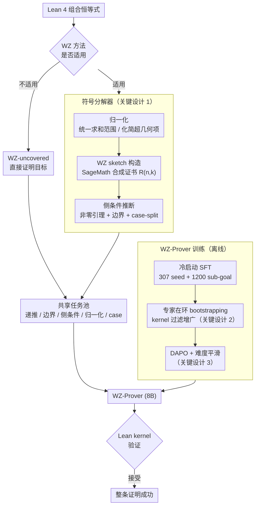

# Automated Formal Proofs of Combinatorial Identities via Wilf–Zeilberger Guidance and LLMs

**会议**: ICML 2026  
**arXiv**: [2605.04472](https://arxiv.org/abs/2605.04472)  
**代码**: 暂未公开  
**领域**: LLM 推理 / 自动定理证明 / 神经-符号  
**关键词**: Lean 4, 组合恒等式, Wilf-Zeilberger, 神经符号, DAPO

## 一句话总结
WZ-LLM 把经典的 Wilf–Zeilberger 符号证明流程编译成 Lean 4 中可执行的证明骨架（递推 + 边界条件 + 侧条件），交给专门用 SFT + expert-iteration + DAPO 训练出的 WZ-Prover 逐项 discharge，在 100 个经典组合恒等式上把 pass@32 从 Goedel-Prover-V2 的 9% 提升到 34%。

## 研究背景与动机

**领域现状**：基于 LLM 的自动定理证明（ATP）在 Lean / Isabelle 等交互式证明助手上已经能达到比赛级表现（DeepSeek-Prover-V2、Kimina、Goedel-Prover-V2 等），但组合学被普遍认为是 ATP 最难的领域之一，其中"组合恒等式"是一类基础且无处不在的命题。

**现有痛点**：1) 证明组合恒等式需要长程规划——没有全局路线图时 LLM 会陷入无限制搜索，组合爆炸；2) Lean 中组合学的训练数据极稀缺；3) 纯符号方法（WZ、creative telescoping）在 CAS 里效率很高，但输出无法直接翻译进证明助手——需要重新构造 telescoping 论证、边界条件、归一化步骤、各种非零侧条件，"形式化成本"反而压过原始证明成本；4) 现有 whole-proof LLM 缺乏中间 verifier 信号，逐 tactic 模型又分支爆炸。

**核心矛盾**：长程证明需要明确规划，而 LLM 缺规划；符号方法天生有规划，但产物不可形式化。两条路线各擅其长却又彼此不通。

**本文目标**：把 WZ 的"规划能力"和 LLM 的"形式化能力"焊接起来，让一类原本符号方法搞不定 + LLM 也搞不定的恒等式被两路同时覆盖。

**切入角度**：作者注意到 WZ 方法本身就提供了一个天然的"sketch"——构造 WZ 对 $G(n,k)=R(n,k)F(n,k)$ 后，恒等式自动分解为「递推引理 + 边界条件 + 侧条件 + 归一化 + case-split」一组可机器验证的 sub-goal。这恰好是 Lean 4 喜欢的结构，把它当成 LLM 的中间脚手架既减少搜索空间又给出 verifier 信号。

**核心 idea**：用 **「WZ 符号分解（外部 CAS 出 sketch）+ 专门训练的 WZ-Prover（discharge sketch 子目标 + 兜底 WZ-不覆盖恒等式）」** 的双路径神经-符号系统替代纯 LLM 或纯符号方法。

## 方法详解

### 整体框架
WZ-LLM 想解决的是「一类组合恒等式，纯符号方法和纯 LLM 各自都搞不定」的难题，办法是把两者焊在一起跑两条路径。给定一条 Lean 4 形式化的恒等式，**Symbolic Decomposition** 先做归一化、再调 SageMath 的 WZ 算法尝试合成证书：成功的话就把整道题拆成 $\mathcal{T}=\mathcal{T}_{\text{rec}}\cup\mathcal{T}_{\text{bd}}\cup\mathcal{T}_{\text{side}}\cup\mathcal{T}_{\text{norm}}\cup\mathcal{T}_{\text{case}}$（递推/边界/侧条件/归一化/case-split）一组结构化 Lean 子目标，失败的话整题进入"直接证明池"。两类任务都交给 **WZ-Prover**——一个从 Goedel-Prover-V2 起步、经三阶段训练的专用 8B Lean 4 prover——逐个 discharge。最后由 Lean kernel 一锤定音：只有内核接受，整条证明才算成功。

### 关键设计

**1. WZ 符号分解器：把符号证书翻译成 LLM 能逐项闭环的 Lean 义务**

Lean 形式化组合恒等式最卡的地方不是主干的 telescoping，而是边界、侧条件这些隐含义务——CAS 给的"证书"数学上对，却没法机械塞进证明助手。分解器干三件事把这些义务全部 explicit 化。先是**归一化**：把 `Icc/Ico` 统一转成 `Finset.range`、shift 索引从 0 起、抹平阶乘/二项/幂的语法变体，遇到 parity 这种 piecewise 谓词就结构化 case-split，让后续 tactic 有干净的语法面。再是 **sketch 构造**：用 SageMath 的 `F.WZ_certificate(n,k)` 合成有理函数 $R(n,k)$，使 $G(n,k)=R(n,k)F(n,k)$ 满足 WZ 方程 $F(n+1,k)-F(n,k)=G(n,k+1)-G(n,k)$，原恒等式于是被归约成「递推 lemma + 边界 obligation」。最后是**侧条件推断**：用符号化简提前找出会让 `field_simp` 等 tactic 卡死的零分母、负阶乘参数，自动生成 `∀n,k, A(n,k)≠0` 这类 non-vanishing lemma 和边界子目标。把这些原本藏在证书里的小目标全部拆成可被 LLM 单独 discharge 的形式，正是让 sketch 从"数学正确"变成"机器可执行"的关键。

**2. 专家在环 bootstrapping：靠 kernel 过滤实现"免费"的高保真数据增广**

组合学的 Lean 训练数据极稀缺，纯靠人工标注无法 scale，可 LLM 自生成又会带 hallucination。这里用 kernel 当过滤器把两难化解：第一阶段拿 307 道手工形式化恒等式（带完整 Lean 证明）+ 它们经 sketch 拆出的 1200 个 sub-goal 做 cold-start SFT；第二阶段对 1020 道无标注候选恒等式跑 WZ-LLM 两路尝试，**只有通过 Lean kernel 严格验证的证明**才进训练池——Round 1 收到 5139 个 lemma 证明 + 32 道整题，Round 2 再得 532 + 79，共增 5671 lemma + 111 整题，去重后形成约 5418 样本的扩展 SFT 语料。因为有 kernel 这道硬关卡，噪声样本被天然滤掉，相当于训练分布始终不会被模型自身的错误污染，可以一轮轮接近能力天花板。

**3. DAPO with Difficulty-Smoothing：把算力集中在"非琐碎但有救"的题上**

在二值且稀疏的 kernel 奖励下，naive RL 极易在易题上过拟合、在难题上崩塌，所以 SFT 之后这步专门提升硬题和长链 lemma 的鲁棒性。先做**难度平滑**：SFT 语料里 sketch lemma 多数短而重复、整题长而稀少，于是用 rollout 估计每题在当前策略下的 pass-rate，把极易（去重）和近零通过率（梯度全是噪声）两端都裁掉，留下中-难分布平滑的 RL 集。再做 **DAPO 优化**，奖励为

$$R(\pi;G)=R_{\text{out}}(\pi;G)+\lambda_{\text{len}}R_{\text{len}}(\pi)$$

其中 $R_{\text{out}}\in\{+1,-1\}$ 直接取 Lean kernel 的验证信号，$R_{\text{len}}$ 是接近 token 预算时的渐进惩罚，避免长证明被硬截断而吃到虚假负奖励；DAPO 自带的动态采样还能缓解 entropy collapse。两者合起来让 RL 不在易题上多挤几分，而是把预算花在长尾难题上。

### 损失函数 / 训练策略
三阶段串起来：(i) SFT on 307 seed + 1200 lemmas；(ii) expert-iteration 扩到 ~5418 验证样本；(iii) DAPO RL with rule-based outcome reward + soft overlong punishment。整套训练 16 GPU-days、推理评测 9 GPU-days，全程在 4× L40s-48GB 上完成，模型规模仅 8B。

## 实验关键数据

### 主实验
LCI-Test（100 道经典组合恒等式，Lean 4 形式化）pass@32 端到端证明成功率：

| 方法 | 模型 | LCI-Test pass@32 |
|------|------|------|
| DeepSeek-V3 | 685B | 1/100 |
| Gemini-3.1-Pro-Preview | — | 16/100 |
| Kimina-Prover-Distill | 7B | 6/100 |
| DeepSeek-Prover-V2 | 7B | 6/100 |
| Goedel-Prover-V2 (baseline) | 8B | 9/100 |
| WZ-Sketch + Goedel-Prover-V2 | 8B | 9/100 |
| WZ-Prover（only direct） | 8B | 12/100 |
| WZ-Sketch + WZ-Prover | 8B | 29/100 |
| **WZ-LLM（两路合并）** | **8B** | **34/100** |

跨数据集泛化：CombiBench 上 12→16/100，PutnamBench-Comb 上 0→3/36，均高于 baselines。

### 消融实验

| 训练阶段 | pass@1 | pass@8 | pass@32 |
|----------|--------|--------|---------|
| SFT (seed only) | 1/100 | 3/100 | 9/100 |
| + expert-iteration | 3/100 | 6/100 | 10/100 |
| + DAPO refinement | 4/100 | 6/100 | 12/100 |

Lemma 级诊断（sketch 拆出的 1178 个子目标）：

| 模型 | #Proved / 1178 | Acc | 端到端 #Solved / 46 |
|------|-----|-----|------|
| Goedel-Prover-V2 | 564 | 47.88% | 0 |
| WZ-Prover | 864 | 73.34% | 29 |

### 关键发现
- **Sketch alone 不够**：在没有专门训练的 Goedel-V2 上叠 sketch 反而无收益（9→9）；因为整道题需要把**所有** sketch lemma 全部 discharge，47.88% 的 lemma acc 直接导致 0 整题闭环。提到 73.34% 才解锁 29 题，说明"专 prover + 专 sketch"必须同时具备。
- **Direct + sketch 互补**：5 道 WZ 不适用的硬题被 WZ-Prover 直接证下来（symbolic-only 永远做不到），29 道 WZ-适用的题被 sketch 路径接力完成，二者合并到 34 题。
- **DAPO 的收益集中在 pass@32**：pass@1 仅 +1，pass@32 +2，说明 RL 主要让"长尾难题"在更大采样预算下被捕到，而非在易题上多挤几分。

## 亮点与洞察
- 把经典符号方法当成"可执行 sketch generator"是非常清爽的复合方式：既绕开了 LLM 长程规划弱、又绕开了 CAS 输出不能直接进证明助手的痼疾，把双方的非交集变成可加和。
- "verifier-filtered bootstrapping"在 Lean 这种 kernel-checked 环境里几乎是无脑能用的数据增广：训练池由原模型自己生、verifier 当过滤器，理论上能持续 scale 直到接近能力天花板。
- DAPO + 难度平滑的组合给出了 sparse binary reward 场景下一个可复用的菜谱：先用 rollout 把题库按当前策略难度分桶，再裁掉两端噪声，再 RL；不依赖人工分级。

## 局限与展望
- 8B 模型 + 16 GPU-days 训练对学界友好，但 LCI-Test 上还有 66 题没解决，说明长程组合证明的能力天花板仍远未触及，特别是 PutnamBench-Comb 上只解了 3/36。
- 整套流水线对 Lean 4 mathlib 的 API 演化敏感，sketch 部分高度耦合到当前 Finset/Nat.factorial 接口；若 mathlib 重构需要重新对齐 normalization 规则。
- WZ 方法只覆盖超几何/holonomic 类恒等式，对真正"非超几何"组合恒等式（如 q-级数、对合论证）需要寻找新的符号 sketch 引擎。

## 相关工作与启发
- **vs Goedel-Prover-V2 / DeepSeek-Prover-V2 等 whole-proof LLM**：它们靠端到端生成，没有显式规划机制；WZ-LLM 通过外部 CAS 提供 sketch，把"长程规划"外包给已经成熟几十年的符号算法。
- **vs InternLM-2.5-StepProver / MA-LoT 这类 tactic-level + search**：它们靠 BFS/MCTS 在 tactic 空间里搜，分支爆炸；WZ-LLM 不在 tactic 维度做搜索，而是在更高层的 sketch 维度做规划，再用 whole-proof prover 处理每个子目标。
- **vs Harrison 在 HOL Light 上证 hypergeometric sums**：思路同源（CAS 出证书 + 形式化），但 Harrison 全手工嵌入；WZ-LLM 把"形式化"这一最耗人力的步骤交给 LLM-Prover，是这一思路的现代化升级。

## 评分
- 新颖性: ⭐⭐⭐⭐ "把符号方法 sketch 编译成 LLM 可证明的 Lean 子目标"这个 framing 在 ATP 圈很清新
- 实验充分度: ⭐⭐⭐⭐ 三个 benchmark、组件 + 训练阶段双重消融、lemma 级诊断都做到位
- 写作质量: ⭐⭐⭐⭐ 神经符号架构与训练流水线讲得清晰，WZ 数学背景前置完整
- 价值: ⭐⭐⭐⭐ 给 Lean 数学形式化提供一条"符号引导 + LLM discharge"的可复用 recipe，可类推到其它有 CAS 的领域（积分、求和、ODE 等）

<!-- RELATED:START -->

## 相关论文

- [\[ICLR 2026\] Rethinking Code Similarity for Automated Algorithm Design with LLMs](../../ICLR2026/llm_nlp/rethinking_code_similarity_for_automated_algorithm_design_with_llms.md)
- [\[ACL 2025\] Can LLMs Reason About Program Semantics? A Comprehensive Evaluation of LLMs on Formal Specification Inference](../../ACL2025/llm_nlp/can_llms_reason_about_program_semantics_a_comprehensive_evaluation_of_llms_on_fo.md)
- [\[ACL 2025\] Hierarchical Attention Generates Better Proofs](../../ACL2025/llm_nlp/hierarchical_attention_generates_better_proofs.md)
- [\[ICML 2025\] RULEBREAKERS: Challenging LLMs at the Crossroads between Formal Logic and Human-like Reasoning](../../ICML2025/llm_nlp/rulebreakers_challenging_llms_at_the_crossroads_between_formal_logic_and_human-l.md)
- [\[ACL 2026\] Solver-Independent Automated Problem Formulation via LLMs for High-Cost Simulation-Driven Design](../../ACL2026/llm_nlp/solver-independent_automated_problem_formulation_via_llms_for_high-cost_simulati.md)

<!-- RELATED:END -->
