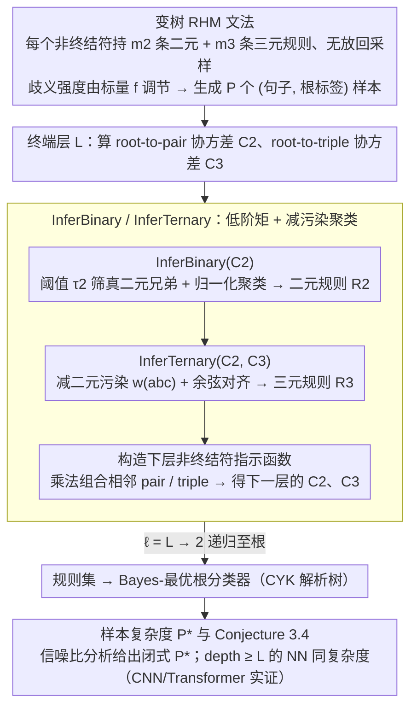

# Deep Networks Learn to Parse Uniform-Depth Context-Free Languages from Local Statistics

**会议**: ICML 2026  
**arXiv**: [2602.06065](https://arxiv.org/abs/2602.06065)  
**代码**: https://github.com/jackparley/learn_to_parse  
**领域**: NLP理论 / 可解释性 / 语言模型学习机制  
**关键词**: PCFG, 句法解析, 样本复杂度, 层次表示, 局部统计

## 一句话总结
作者提出一个可控歧义的"变树 RHM"概率上下文无关文法，并证明只用 root-to-pair / root-to-triple 这两个低阶矩 + 逐层聚类，就能恢复语法规则、进行 CYK 式解析，对应样本复杂度 $P^\star \asymp v\, m_3\, m_2^{L-1} (p_2^2/2)^{1-L}$，CNN 与 Transformer 实验完全符合该幂律。

## 研究背景与动机

**领域现状**：LLM 能在没有显式句法监督的情况下学到树状解析行为，已经被 probing 实验反复确认；理论侧主流用 PCFG 作 toy model，已知 transformer 能近似 inside 算法、且固定树结构的 Random Hierarchy Model (RHM) 下深度网络的样本复杂度有清晰刻画。

**现有痛点**：现有理论只研究"树结构固定"的简化场景（每条句子的解析树形状提前知道），此时根本不需要"解析"——只需要做层级聚类。这绕开了真实语言学习中两个最关键的难题：(A) 学习者不知道哪个 span 对应哪个 latent 非终结符；(B) 同一段子串可能由多个不同的非终结符产出（局部歧义），低阶相关性被歧义"污染"。

**核心矛盾**：要让样本复杂度保持多项式级，必须依赖低阶统计；但 PCFG 的歧义恰恰让低阶统计变得不可靠——同一个 (a,b) 对可能既是二元兄弟，也可能是三元兄弟 (a,b,c) 的前缀，还可能跨越两个 span 的边界。

**本文目标**：(i) 构造一族"歧义可调"的合成 PCFG，使得歧义程度能被一个标量 $f$ 控制；(ii) 给出一套只用低阶矩 + 聚类的规则推断算法，并证明其正确性与样本复杂度；(iii) 实证深度网络 (CNN/Transformer) 的样本复杂度严格遵循该理论预言。

**切入角度**：作者观察到，即便存在歧义，在 vocab size $v \to \infty$ 的极限下，二元兄弟对 (a,b) 贡献的 root-to-pair 协方差仍然主导其它"假兄弟"贡献；三元情形下虽然三元兄弟与"二元兄弟+1"贡献量级相当，但后者可以用 $C_2$ 显式减掉。

**核心 idea**：把"深度网络学解析"等价为"用低阶 root-to-substring 协方差做带去噪的层级聚类"，并通过 signal-to-noise 论证给出闭式样本复杂度。

## 方法详解

### 整体框架
这篇论文想回答的核心问题是：深度网络在没有句法监督时，到底是怎样从 $P$ 个 (句子, 根标签) 样本里学会解析一个带歧义的上下文无关文法的？作者把它拆成一条可证明的链路——先造一个歧义可调的合成文法 Varying-tree RHM，让"span 边界未知"和"局部歧义"成为数据的内禀属性；再给出一套只用低阶矩 + 聚类的规则推断算法（Algorithm 1），自顶向下逐层把规则集恢复出来，从而构造出 Bayes-optimal 的根分类器（并顺带得到一棵解析树）；最后给出这套算法的闭式样本复杂度 $P^\star$，并断言深度 $\geq L$ 的标准 NN 走的是同一条机制，用 CNN/Transformer 实验把学习曲线按 $P^\star$ rescale 后塌缩到一条主曲线来验证。算法侧的中间产物是逐层规则集 $\{\mathcal{R}_2^{(\ell)}, \mathcal{R}_3^{(\ell)}\}_{\ell=1}^L$，最终输出是根分类器。

### 关键设计

**1. Varying-tree RHM：把"局部歧义"做成可调的合成文法**

旧的固定树 RHM 把每条句子的解析树形状提前给定，学习者根本不需要 parsing，只需做层级聚类——这绕开了真实语言学习里最难的两件事：不知道哪个 span 对应哪个 latent 非终结符，以及同一段子串可能由多个非终结符产出。作者让每个非终结符 $z$ 同时持有 $m_2 = f_2 v$ 条二元规则和 $m_3 = f_3 v^2$ 条三元规则，规则右端从所有可能的 pair/triple 中*无放回均匀采样*。无放回保证单条规则本身无歧义，但两条规则的组合仍会制造"局部歧义"——例如三元串 $(a,b,c)$ 既可能来自 $z \to abc$，也可能是 $z' \to ab$ 再接其它派生的拼接。歧义强度被一个标量 $f$ 控制，全局歧义随 $f$ 出现一个相变（图 2 底），自然分成低歧义 / 中等局部歧义 / 高全局歧义三档。这样一来，句长可变、解析树拓扑指数级多、歧义还能旋钮式调节，就成了一个能真正逼问"NN 需不需要学解析"的可解 testbed。

**2. InferBinary / InferTernary：用低阶矩 + 减污染做层级聚类**

有了带歧义的文法，难点变成：在完全不知规则的前提下，仅凭 root-conditioned 的低阶统计把规则恢复出来，且不能依赖高阶矩（否则样本复杂度就不再是多项式）。作者的做法是逐层做带去噪的聚类。二元这一支，对每对终结符 $(a,b)$ 取 root-to-pair 协方差张量的切片 $u_{ab} = C_2^{(\ell)}((a,b), :) \in \mathbb{R}^v$；关键观察是，真二元兄弟对的范数 $\|u_{ab}\|$ 在 $v \to \infty$ 时显著压过那些"假兄弟"贡献，于是用阈值 $\tau_2 = \gamma v^{-1}(\sum \|u_{ab}\|^2)^{1/2}$ 筛出真兄弟对，再把归一化后的 $\hat u_{ab}$ 聚成 $v$ 类，每一类对应一个父亲非终结符（Prop. 3.1 证明渐近正确）。三元这一支更棘手，因为 $(a,b,c)$ 的协方差里"真三元兄弟"和"二元兄弟 + 1"两类贡献量级相当、混在一起；作者的巧招是显式扣掉二元污染：

$$w_{abc} = C_3((a,b,c), :) - \tfrac{1}{v} C_2((a,b),:) - \tfrac{1}{v} C_2((b,c),:)$$

这正好按 law of total covariance 把"二元兄弟 + 1"那一支减掉，剩下的信号就能复用与二元同样的聚类思路——用 InferBinary 得到的类中心 $c_z$ 算余弦对齐分数 $A_z(a,b,c)$，过阈值即归入对应父亲（Prop. 3.2）。规则到手后，构造候选非终结符指示函数 $N_{i,\lambda}^{(\ell-1)}(a)$，再乘法组合出下一层的 pair/triple 指示函数，递归直到根。整套算法把"学解析"显式分解成"识别 span 边界 + 聚类规则"，靠减污染既消掉局部歧义、又把统计阶数压在二/三阶，因此复杂度保持多项式。

**3. 样本复杂度公式与 Conjecture 3.4：把算法的复杂度迁移到 NN**

算法清楚了，还差一步：凭什么说真实训练出来的深度网络也是这个复杂度？作者先量化算法侧的信号-噪声。用 vector Bernstein 不等式得到协方差估计误差 $E_s \leq \gamma_s\big(\sqrt{\log(2/\delta)/(v m_s P)} + \log(2/\delta)/P\big)$，再结合 row norm 的渐近表达 $\|u_{ab}\| \to \frac{1}{m_2 v}\sqrt{(p_2^2/2)^{\ell-1} / m_2^{\ell-1}}$，得到第 $\ell$ 层要把信号顶过噪声所需的样本数 $P_{\ell, s} \asymp (p_2^2/2)^{1-\ell} v m_s m_2^{\ell-1}$。Conjecture 3.4 进一步断言 NN 的样本复杂度由所有层里最难那一层决定，$P_{\mathrm{NN}}^\star \asymp \max_{\ell, s} P_{\ell, s}$；在 $m_3 \gg m_2$ 的渐近极限下化简为

$$P_{\mathrm{NN}}^\star \asymp (p_2^2/2)^{1-L}\, v\, m_3\, m_2^{L-1}.$$

这个表达背后是一个很直觉的物理图像：最先被检测到的是"最容易的分支"——前 $L-1$ 层全走 binary（概率 $p_2/m_2$ 远大于 ternary 的 $p_3/m_3$）、只在最后一层吃一次 ternary，所以整条样本曲线被这条最易路径主导。公式还顺带预测了 depth $< L$ 的网络无法多项式收敛，给"为什么深度是必要的"一个定量回答。

### 损失函数 / 训练策略
NN 端就是标准 cross-entropy + SGD；算法侧只需 $O(P)$ 时间统计低阶矩 + 谱聚类。实验里 CNN 用 filter size 4、stride 2 的层级架构（同时覆盖 binary 和 ternary 两种 children），Transformer 用带 sinusoidal PE 的标准 encoder。所有架构都要求 depth $\geq L$——这是定理成立的硬性条件。

## 实验关键数据

### 主实验

| 实验设置 | 预言 $P^\star$ scaling | 观察现象 | 结论 |
|----------|------------------------|----------|------|
| CNN, low ambig $f = 1/v$, $L=2$ | $\sim v^2$ | rescale 后学习曲线完美塌缩 | scaling 正确 |
| CNN, low ambig $f = 1/v$, 变化 $L$ | $(p_2^2/2)^{1-L} v^2$ | $P^\star(v, L)$ 与理论 + 实测 SNR 同时吻合 | depth 因子 $(p_2^2/2)^{1-L}$ 正确 |
| CNN, intermediate $f=1/4$, $L=3$ | $\sim v^5$ | 学习曲线塌缩 | 中等歧义下公式仍成立 |
| CNN, high $f=0.6, 0.8$, $L=2$ | $\sim v^2$ scaling | loss 饱和到解析预测的 Bayes-optimal 下界 | 高全局歧义下 NN 仍达到信息论极限 |
| INN / CNN / Transformer 对比 ($L=2, 3$) | 三者同一 $P^\star \sim v^2$ | 三种架构曲线均与 $v^2$ rescale 后塌缩 | 公式不依赖具体架构 |

### 消融实验

| 配置 | 关键现象 | 说明 |
|------|---------|------|
| 全模型 (depth $= L$) | 曲线塌缩到 $P^\star$ | 完整理论成立 |
| depth $< L$ 网络 | 无法多项式收敛 | 深度是必要条件 |
| 去掉三元修正 $\tfrac{1}{v}C_2$ | 三元规则混入"假兄弟" | 修正项必须 |
| 用 token frequency 而非 root-conditioned 协方差 | 完全失败 | label 信息必须 |

### 关键发现
- 三种架构（INN / CNN / Transformer）的学习曲线在 rescale 后塌缩到同一条主曲线，强力支持"NN 与 Algorithm 1 走的是同一条机制"这一 conjecture。
- 在高全局歧义区，NN 的 cross-entropy 收敛到由 PCFG 内在熵决定的 Bayes-optimal 下界，说明 NN 不仅 scaling 正确、绝对值也对。
- depth 因子 $(p_2^2/2)^{1-L}$ 说明随 $L$ 增长所需样本数指数膨胀，但仍是 $v$ 的多项式，呼应了"层级表示是 PCFG 学习的可行路径"的命题。

## 亮点与洞察
- **"局部歧义"被显式拆解成可控参数**：以往 RHM 把树结构固定，回避了 parsing；本文用 binary + ternary 并存 + 无放回采样，让局部歧义出现得自然且可调，是把"语言学问题"翻译成"统计学习问题"的关键一步。
- **三元协方差的"减污染"trick**：$w_{abc} = C_3 - \tfrac{1}{v}(C_2((a,b), :) + C_2((b,c), :))$ 是一个简洁却深刻的设计——它直接把 law of total covariance 的"二元兄弟+1"分支去掉，使得三元规则能用与二元同样的聚类思路恢复，可以迁移到其它需要分解 mixed-order 信号的场景（如 mixture-of-experts 的混合统计）。
- **NN 样本复杂度 = "最易分支"的复杂度**：$P_{\mathrm{NN}}^\star$ 由"全 binary + 末层 ternary"主导，给出了一个非常直觉的物理图像——网络先用最容易被信号支配的路径学起，这种"easiest path dominates"的洞察对解释 LLM 数据效率有普适意义。

## 局限与展望
- 任务局限在 root classification，作者承认 next-token prediction 还需要 future work（虽然在结论里给了启发式讨论）。
- 渐近分析在 $v \to \infty$ 极限下严谨，但实际语言 vocab 虽大但有限，常数项是否仍可忽略需要更多实验。
- 假设规则均匀概率 $p_2 = p_3 = 1/2$ 且 $f_2 = f_3 = f$；真实语言的规则概率重尾分布是否破坏 SNR 论证未讨论。
- 没有比较"NN 学到的 internal representation"和"算法显式恢复的规则集"之间的对应——直接比对可以让 conjecture 从"sample complexity 一致"升级到"机制一致"。
- Transformer 实验只在小 $v, L$ 上做；scaling 到接近 LLM 的尺寸（含位置编码、layer norm、attention head）是否仍然成立未知。

## 相关工作与启发
- **vs Cagnetta et al. 2024 (Fixed-tree RHM)**: 他们假设树结构已知，只研究"层级聚类如何工作"；本文允许树形随机变化、引入局部歧义，是 RHM 从"learnable hierarchies"到"learnable parsing"的扩展。
- **vs Allen-Zhu & Li 2025 (Transformer 近似 inside)**: 他们 post-hoc 解释训好的 transformer 在做 inside 算法；本文给出"为什么训练能达到这一点 + 需要多少样本"的前向理论。
- **vs Malach & Shalev-Shwartz 2018 (clustering-based learnability)**: 他们用 clustering 思路证明深度网络对某类层级数据可学；本文把这条思路定量化为 closed-form sample complexity，并把它和 NN 的真实学习曲线对齐。
- **vs Belief Propagation / 信仰传播视角 (Sclocchi et al. 2025)**: BP 是 Bayes-optimal 在固定树下的算法；本文的 Algorithm 1 可视为"在树结构未知时的近似 BP"，桥接了 BP 文献与 PCFG learnability 文献。

## 评分
- 新颖性: ⭐⭐⭐⭐⭐ 首次把"NN 学解析"还原为可证明的低阶矩聚类算法，并给出精确样本复杂度
- 实验充分度: ⭐⭐⭐⭐ 三架构 + 三歧义区都验证，但 Transformer 规模偏小
- 写作质量: ⭐⭐⭐⭐⭐ 结构清晰、theorem-experiment 闭环、记号统一
- 价值: ⭐⭐⭐⭐⭐ 为"LLM 数据效率为何足够"提供了第一个端到端、有公式有实验的理论解释

<!-- RELATED:START -->

## 相关论文

- [\[NeurIPS 2025\] SubSpec: Speculate Deep and Accurate — Lossless and Training-Free Acceleration for Offloaded LLMs](../../NeurIPS2025/llm_nlp/speculate_deep_and_accurate_lossless_and_training-free_acceleration_for_offloade.md)
- [\[NeurIPS 2025\] In-Context Learning of Linear Dynamical Systems with Transformers: Approximation Bounds and Depth-Separation](../../NeurIPS2025/llm_nlp/in-context_learning_of_linear_dynamical_systems_with_transformers_approximation_.md)
- [\[ICML 2026\] Compute as Teacher: Turning Inference Compute Into Reference-Free Supervision](compute_as_teacher_turning_inference_compute_into_reference-free_supervision.md)
- [\[ICML 2026\] In-Context Routing (ICR): 一次训练、处处可用的 attention-level 隐式 ICL](train_once_reuse_everywhere_generalizable_implicit_in-context_learning_by_routin.md)
- [\[ACL 2026\] Characterizing the Expressivity of Local Attention in Transformers](../../ACL2026/llm_nlp/characterizing_the_expressivity_of_local_attention_in_transformers.md)

<!-- RELATED:END -->
