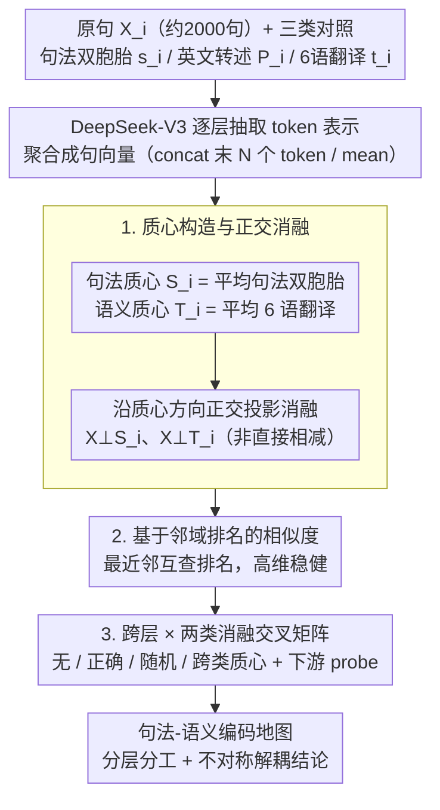

# Differential Syntactic and Semantic Encoding in LLMs

**会议**: ICML 2026  
**arXiv**: [2601.04765](https://arxiv.org/abs/2601.04765)  
**代码**: https://github.com/acevedo-s/syn-sem  
**领域**: LLM 可解释性 / 表示学习 / 计算语言学  
**关键词**: 句法-语义解耦, 线性编码, 质心消融, DeepSeek-V3, 表示几何

## 一句话总结
通过对共享句法结构或共享含义的句子做隐层表示平均得到"句法质心"和"语义质心"，作者证明 DeepSeek-V3 等大模型的句子向量中相当一部分句法/语义信息是被**线性叠加**编码的，并且这两类信息在层间分布和正交消融上都呈现明显的可分离性——支持"句法相对自治"的语言学假说。

## 研究背景与动机

**领域现状**：LLM 内部表示如何承载语言学信息是当前可解释性研究的核心问题。已有工作基本形成共识：深层"对齐现象"提示中间层在做某种共享的抽象处理（Huh et al. 2024 的 platonic 表示假说；Cheng et al. 2025 的高维抽象相），而 Hewitt & Manning 的 structural probe、Tenney 的 BERT pipeline 等探针类工作显示模型大致复现了"先句法、后语义"的经典 NLP 流水线。另一条线 Mikolov→Park 系列则反复表明 LLM 倾向以**线性**方式编码概念。

**现有痛点**：现有探针多依赖训练出的分类器/回归器（结构化探针、polar coordinate probe），其结论容易被探针自身的容量混淆——你无法分清"模型里就这么编码"还是"探针学出来的"。而几何方法（如 Caucheteux 2021）虽然用过 GPT-2 的句法平均向量去解释 fMRI 信号，但还没有人在真正大规模 LLM（百亿~千亿参数级）上系统验证句法和语义是否可以**只用线性手段同时刻画并解耦**。

**核心矛盾**：要回答"句法是否自治"这种语言学层面的争论，必须有一个无需训练任何下游模型、且对句法和语义对称的工具。简单地"减句法向量看语义变化"在高维空间里非常容易引入伪信号（直接减质心会顺带带走相邻样本成分，见原文 Appendix D）。

**本文目标**：用纯线性、无监督的方式同时回答两个子问题——(i) LLM 隐层中的句法和语义信息有多大比例可以被一个方向向量解释；(ii) 这两类信息在哪些层、以何种程度彼此独立。

**切入角度**：如果一组句子共享 POS 模板（句法相同、含义无关），把它们的隐层表示平均，**语义部分相互抵消、句法部分保留**——平均向量天然就是"句法质心"。同理，把一句话翻译到 6 种语言再平均，**表层形式被洗掉、含义保留**——这就是"语义质心"。再用沿质心方向的正交投影做消融，就能得到几乎不带探针偏差的因果证据。

**核心 idea**：用"共享结构的平均"显式构造句法/语义两个线性子空间，通过正交投影消融在 DeepSeek-V3 全部层上交叉测量相似度，从而读出"句法-语义编码地图"。

## 方法详解

### 整体框架

输入是一组英文原句 $\mathbf{X}_i$（约 2,000 句，长度 ≤ 10 词）。围绕每条 $\mathbf{X}_i$ 配套三类对照：
- **句法双胞胎** $\mathbf{s}_i^{\alpha}$：与 $\mathbf{X}_i$ 共享 Penn Treebank POS 序列但含义不相关的句子（由 Gemini/ChatGPT 生成）。
- **英文转述** $\mathbf{P}_i$：含义相同但表达不同的英文 paraphrase。
- **多语翻译** $\mathbf{t}_i^{\gamma}$：$\gamma\in\{$中、西、意、土、德、阿$\}$ 共 6 种语言的翻译。

整条 pipeline 分四步：(1) 用 DeepSeek-V3 抽取每句话每层的 token 序列；(2) 把 token 聚合成单一句向量（concat 后 N 个 token 或 mean）；(3) 用"共享集合的均值"构造句法质心 $\mathbf{S}_i$ 与语义质心 $\mathbf{T}_i$；(4) 在每一层做正交投影消融，并用基于排名的相似度衡量配对句子的几何接近度。注意 $\mathbf{S}_i$ 不包含 $\mathbf{X}_i$ 自身，$\mathbf{T}_i$ 也不包含 $\mathbf{X}_i$ 或 $\mathbf{P}_i$，避免"自消"伪信号。

### 关键设计

**1. 质心构造与正交消融：用纯线性手段把句法成分和语义成分从句向量里显式抠出来**

探针类方法的硬伤在于结论会被探针自身的容量污染，本文要的是一个不训练任何模型、对句法和语义对称的工具。做法是利用"共享集合的平均"：句法质心 $\mathbf{S}_i = \frac{1}{N_{\text{twins}}}\sum_{\alpha=0}^{N_{\text{twins}}} \mathbf{s}_i^{\alpha}$ 是同 POS 模板句子的平均，含义在 $\alpha$ 维度上互相抵消、只剩共享的句法方向；语义质心 $\mathbf{T}_i = \frac{1}{N_{\text{lang}}}\sum_{\gamma} \mathbf{t}_i^{\gamma}$ 是多语翻译的平均，表层形式被洗掉、只剩共享的含义方向。消融时不能直接减去质心，因为质心里夹带了其他句子的成分，相减会把它们一起带走、虚高消融强度（原文 Appendix D 专门论证了这点）；本文改用沿质心方向的一次正交投影 $\mathbf{X}_i^{\perp \mathbf{S}_i} = \mathbf{X}_i - \frac{\mathbf{X}_i\cdot \mathbf{S}_i}{|\mathbf{S}_i|^2}\mathbf{S}_i$，保证只把 $\mathbf{X}_i$ 中与 $\mathbf{S}_i$ 共线的那一份清零，再配一个"打乱的质心"对照实验，证明掉的相似度是定向的、而非随便挪一个方向都会有的平凡效应。

**2. 基于邻域排名的相似度：绕开 CKA 在高维下信号偏弱的问题**

要把"消融多少 → 相似度掉多少"讲成因果叙事，就需要一个在高维下依然稳健的相似度量；CKA 这类线性对齐量在高维空间信号偏弱，容易被各种 normalization 拉变形。本文换成纯几何的邻域排名量：对两套表示 $A,B$，先在 $A$ 里找点 $i$ 的最近邻 $j$，记下 $j$ 在 $B$ 里相对 $i$ 的距离排名 $r_{ij}^{B}$，反向再来一遍，最后取归一化平均

$$\text{Similarity}=1-\frac{1}{N_s^2}\Big(\sum_{i,j:r_{ij}^{A}=1} r_{ij}^{B} + \sum_{i,j:r_{ij}^{B}=1} r_{ij}^{A}\Big)$$

值为 1 表示最近邻完全一致、0 表示两套表示彼此独立。它与 Information Imbalance（Glielmo 2022）、Neighborhood Overlap（Huh 2024）同源，只依赖最近邻关系而非线性映射，因此即便表示空间被平移/旋转/缩放或 normalization 拉变形，读出的结论依然成立。

**3. 跨层 × 两类消融的交叉实验矩阵：把"句法/语义编码地图"做成可直接读取可分离性的二维结果**

单方向消融只能说明"质心确实抓到了相关信息"，要定量回答"句法和语义到底是否解耦"，必须做交叉消融。本文固定一种相似度（句法双胞胎相似度 or paraphrase 相似度），系统地改变被消融的方向——无消融 / 正确质心 / 随机打乱质心 / 跨类质心，于是得到一张 layer × (target, ablated) 的二维表：例如同时画出"句法相似度被语义质心消融"和"语义相似度被句法质心消融"两条跨层曲线，再叠上 token 聚合方式（concat vs. mean）的对照，最后用两个下游 probe（线性 POS 分类 + paraphrase recall@3）做行为级佐证。引入随机质心和跨类质心两个 control 的意义在于排除"线性维度随便挪一下就会掉"的平凡解释，留下真正有方向性的因果证据。

### 训练策略
本工作完全是**无训练**的几何分析——不微调 LLM、不训探针。所有"消融"都是闭式的正交投影；唯一的可学习成分是验证用的线性 POS 分类器（scikit-learn 默认 logistic regression）和 paraphrase recall 的余弦排序。主模型 DeepSeek-V3 (671B) 全程权重冻结，附录用 Qwen2-7B / Gemma3-12B / Pythia-6.9B 做规模与训练阶段的鲁棒性复刻。

## 实验关键数据

### 主实验

| 配置 | 任务 | DeepSeek-V3 表现 | 解读 |
|------|------|------------------|------|
| Baseline（无消融） | POS 模板分类（线性 probe） | 0.85 | 句法信息在表示里非常显著 |
| Baseline（无消融） | Paraphrase recall@3 | 0.85 | 语义信息同样显著 |
| 句法相似度 vs. 层（concat） | 整网 | > 0.7 | 句法在所有层都很强 |
| 语义相似度 vs. 层（mean） | 整网 | 早层低、中层峰值、末层小回落 | 中央层是"语义核心" |

### 消融实验

| 消融方向 | POS 分类 acc | Paraphrase recall@3 | 说明 |
|----------|--------------|----------------------|------|
| 无消融 | 0.85 | 0.85 | 上限 |
| 减语义质心 $\mathbf{T}_i$ | **0.85** | 0.66 | 不掉句法，但语义掉 19 个点 |
| 减句法质心 $\mathbf{S}_i$ | **0.10** | **0.90**（略升约 5%） | 句法几乎被打掉，语义反而微升 |
| 减随机语义质心 | 0.85 | 0.83 | 几乎无影响（控制） |
| 减随机句法质心 | 0.81 | 0.85 | 几乎无影响（控制） |

### 关键发现
- **不对称解耦**：减语义质心**不**伤句法（0.85 → 0.85），减句法质心却让语义略升（0.85 → 0.90），说明句法子空间相对独立于语义，而语义会被句法骨架"夹带"一些信号。这与生成语法学派"句法自治"的立场惊人吻合。
- **层间分工**：句法信号在全网都强（concat 表示下 > 0.7），语义信号集中在中间层（mean 表示更适合捕捉，paraphrase 相似度在中央层达到峰值），且末层仍保留——意味着 LLM 在最后一刻才把语义转回输出形式。
- **范数分解**：质心方向只解释了句向量中央层约 40% 的平方范数，剩余成分对应论文留待未来工作的"非严格语言学知识"；Pythia 训练曲线显示**句法质心很早就长出来、语义质心则在后期才逐步积累**，符合"先学结构、后学含义"的直觉。
- **聚合方式 × 信号类型**：concat 偏好句法（保留位置信息），mean 偏好语义（位置被平均掉，含义留下），这一对照本身就是支持"句法/语义在频率上可能分布在不同时间尺度"的实验依据。

## 亮点与洞察
- **"共享集合平均"作为无监督探针**：把"句法/语义"这种抽象概念约简成"哪些样本共享它"，再用平均向量代表共享方向，这一套范式几乎不引入任何超参，又能对称地适用于任意可被"共享集合"定义的属性（情感、风格、领域…），极具迁移性。
- **正交投影 vs. 直接相减**：作者明确论证并展示了直接减质心会带来伪强消融（Appendix D），坚持用沿方向的投影。这是高维消融实验里非常容易被忽视但至关重要的工程细节，可以直接复用到线性 steering、概念擦除等任务。
- **跨语种翻译当语义代表**：用 6 种类型学差异极大的语言（含中阿土）的翻译均值当语义质心，比 paraphrase 更狠地洗掉了表层形式，这条 trick 直接来自 Acevedo et al. 2025，但本文是第一次把它和 POS 平均放到对称的框架里。
- **"句法 → 几乎打死，语义 → 反升"**：这条反直觉的结果暗示句法骨架在表示中起"干扰"作用，把它擦掉反而让语义聚类更紧——对 RAG / 检索向量的设计有实操启示：可以用句法质心做去噪。

## 局限与展望
- **质心解释力有限**：中央层最多解释约 40% 的平方范数，剩下大半信息既不在句法子空间也不在语义子空间。作者承认这可能是线性方法的天花板，未来需要 Wild et al. 2025 一类非线性特征提取手段。
- **数据规模与长度**：~2,000 对样本、每句 ≤ 10 词。短句几乎屏蔽了长程依存这类核心句法现象，结论能否外推到段落级文本未知。
- **只有英语原句**：虽然语义质心用了 6 种语言的翻译，但被消融的句子始终是英文。"句法自治"在更复杂的形态学语言（土耳其语、芬兰语）里是否成立需要重做。
- **无干预实验**：所有结论都基于表示相似度，没有真正在 forward pass 中改写激活去看生成行为如何变化。如果未来证实可以用质心做 steering（如把含义引到目标方向同时保句法不变），这一框架将从分析工具升级为控制工具。
- **可改进点**：把质心从"算术平均"升级为"沿训练动态的低频成分"——作者在结论里已经暗示句法对应高频、语义对应低频，结合 Tamkin 2020 的时间尺度分解，可能拿到比线性投影更干净的解耦。

## 相关工作与启发
- **vs. Hewitt & Manning (structural probe, 2019)**：他们用训练出的 probe 在词向量里"画"依存树；本文不训任何 probe，直接用表示几何回答"句法在哪里"，结论一致但论据更干净，可以避免 probe 自身学到信息的争议。
- **vs. Park et al. (linear representation hypothesis, 2024/2025)**：他们关注单个概念（性别、真假等）的线性方向；本文把线性编码假说扩展到"整句句法"和"整句语义"这种结构性属性，极大拓展了线性编码假说的适用范围。
- **vs. Cheng et al. (2025) / Acevedo et al. (2025)**：作者群是同一系列，前作发现中央层存在"高维抽象相"，本文进一步把这个相位定性为"语义相"。可以视作同一研究计划的"显微镜升级"。
- **vs. Caucheteux et al. (2021)**：同样用 POS 模板均值当句法代理，但前者把它喂给 fMRI 编码模型，本文则在 LLM 自身内部做交叉消融。两者结合可能推动"机-脑统一句法地图"的研究。

## 评分
- 新颖性: ⭐⭐⭐⭐ 思想（共享集合 → 质心）并不全新，但首次在 670B 级 LLM 上做对称的句法×语义交叉消融，且对"句法自治"给出可测量的几何证据。
- 实验充分度: ⭐⭐⭐⭐ 4 个模型 × 2 种聚合 × 多种 control，附录扎实；只是数据规模偏小、英文中心。
- 写作质量: ⭐⭐⭐⭐⭐ 论证链条干净，方法细节（正交投影 vs. 相减）等坑都讲清楚，可读性极佳。
- 价值: ⭐⭐⭐⭐⭐ 同时贡献给 LLM 可解释性社区和语言学社区，方法本身可直接复用为表示分析模板。

<!-- RELATED:START -->

## 相关论文

- [\[ICML 2026\] SAC-Opt: Semantic Anchors for Iterative Correction in Optimization Modeling](sac-opt_semantic_anchors_for_iterative_correction_in_optimization_modeling.md)
- [\[ACL 2025\] A Systematic Study of Compositional Syntactic Transformer Language Models](../../ACL2025/llm_nlp/a_systematic_study_of_compositional_syntactic_transformer_language_models.md)
- [\[ACL 2025\] Quantifying Semantic Emergence in Language Models](../../ACL2025/llm_nlp/quantifying_semantic_emergence_in_language_models.md)
- [\[AAAI 2026\] VSPO: Validating Semantic Pitfalls in Ontology via LLM-Based CQ Generation](../../AAAI2026/llm_nlp/vspo_validating_semantic_pitfalls_in_ontology_via_llm-based_cq_generation.md)
- [\[ICML 2025\] On Expressive Power of Looped Transformers: Theoretical Analysis and Enhancement via Timestep Encoding](../../ICML2025/llm_nlp/on_expressive_power_of_looped_transformers_theoretical_analysis_and_enhancement_.md)

<!-- RELATED:END -->
