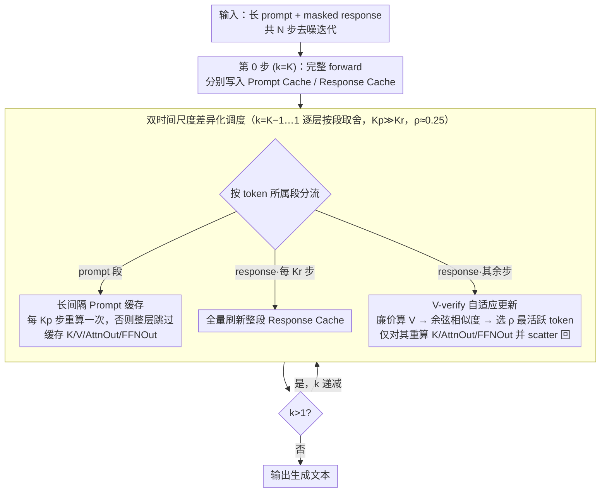

# dLLM-Cache: Accelerating Diffusion Large Language Models with Adaptive Caching

**会议**: ICML 2026  
**arXiv**: [2506.06295](https://arxiv.org/abs/2506.06295)  
**代码**: https://github.com/maomaocun/dLLM-cache (有)  
**领域**: LLM效率  
**关键词**: 扩散语言模型, 推理加速, 自适应缓存, V-verify, LLaDA / Dream

## 一句话总结
针对扩散式大语言模型 (dLLM) 因双向注意力无法复用 KV cache 而推理极慢的问题，本文提出训练无关的 dLLM-Cache，对静态 prompt 用长间隔缓存、对动态 response 用短间隔刷新+按 Value 余弦相似度选 25% 最"变化"的 token 做局部重算，在 LLaDA 8B / Dream 7B 上获得最高 9.1× FLOPs 加速且分数基本不掉。

## 研究背景与动机

**领域现状**：自回归 LLM (ARM) 长期主导文本生成，靠因果注意力天然支持 Key-Value 缓存，把生成复杂度从 $O(N^3)$ 降到 $O(N^2)$。最近 LLaDA、Dream 等扩散语言模型 (dLLM) 用 mask + 双向注意力 + 多步去噪范式生成文本，避开了 reversal curse，效果可与同尺寸 Llama 3 8B 抗衡。

**现有痛点**：dLLM 实际推理慢得令人发指——生成长度 $N$ 的序列需要 $N$ 步迭代去噪，每一步都要在所有 token 上重新算一遍双向注意力，复杂度高达 $O(N^3)$，而且因为双向掩码不再单调，**传统 KV cache 直接不能用**。哪怕 LLaDA 8B 在 RTX 4090 上 GSM8K 也只能跑到 7.3 TPS，远低于同尺寸 Llama 3 8B 的 47.7 TPS。

**核心矛盾**：双向注意力既是 dLLM 性能上的优势 (能看到完整上下文)，也是效率上的死穴 (前后都依赖，没法因果裁剪)；而朴素地"每 K 步刷一次缓存"这种均匀策略要么掉点严重，要么节省有限。

**本文目标**：在不重训的前提下，找到一个能精确刻画 dLLM 计算冗余结构的缓存策略，让 dLLM 推理速度逼近 ARM。

**切入角度**：作者实测了相邻去噪步之间 Key/Value/AttnOut/FFNOut 的余弦相似度热力图，看到了两条强信号：(1) **prompt 区域** 在所有步上几乎全亮 (相似度接近 1)，因为输入根本没变；(2) **response 区域** 总体相似度高，但**只有少数 token 在某步突然"变脸"**，且这些 token 的 Value 变化与下游 AttnOut/FFNOut 变化高度相关。也就是说，prompt 和 response 应当被区别对待，response 内部还要进一步区分"稳定 token"和"活跃 token"。

**核心 idea**：用 prompt 长间隔缓存 + response 短间隔全刷 + Value 相似度引导的局部更新，三段式自适应缓存吃掉 dLLM 的两种冗余。

## 方法详解

### 整体框架
dLLM-Cache 是一个挂在 dLLM 推理 forward 上的训练无关插件，思路是把"每步都对所有 token 重算双向注意力"这件浪费拆成两类冗余分别处置：prompt 段跨步几乎不变，response 段跨步只有少数 token 真正活跃。具体地，它对每一层 Transformer $l$ 各维护一个 Prompt Cache $\mathcal{C}_p$ 和 Response Cache $\mathcal{C}_r$，两者都存放该段的 $\mathbf{K}^{(l)}, \mathbf{V}^{(l)}, \mathbf{AttnOut}^{(l)}, \mathbf{FFNOut}^{(l)}$ 四组特征，由三个超参控制刷新节奏：prompt 刷新间隔 $K_p$、response 全量刷新间隔 $K_r$、自适应更新比例 $\rho$。

第 0 步 ($k=K$) 先完整 forward 一遍，把 prompt/response 特征分别写进两个 cache；此后 $k$ 从 $K-1$ 递减到 1，每一步每一层只做取舍：prompt 段除非 $k \equiv 0 \pmod{K_p}$ 否则直接读缓存，response 段除非 $k \equiv 0 \pmod{K_r}$ 触发全量刷新、否则走下面的 V-verify 局部更新，剩下的 token 一律复用上一步缓存继续往后算。

### 关键设计

**1. Long-Interval Prompt Cache：让静态 prompt 整段绕过 Transformer**

dLLM 经常是长 prompt + 短 response，而 prompt 段恰恰是"步步重算却步步几乎不变"的最大计算浪费源——因为 dLLM 训练用 per-token 独立随机掩码，prompt token 在所有去噪步上输入恒定，作者实测相邻步 prompt 段的 K/V/AttnOut/FFNOut 余弦相似度都接近 1。于是对每层把 $\mathbf{K}_p^{(l)}, \mathbf{V}_p^{(l)}, \mathbf{AttnOut}_p^{(l)}, \mathbf{FFNOut}_p^{(l)}$ 一次算好缓存，只在 $k \equiv 0 \pmod{K_p}$ 时重算一次，$K_p$ 典型取 50–100。关键在于它缓存的不只是 KV，还包括 Attention 输出和 FFN 输出，等于让 prompt 那部分整段跳过整层 Transformer——这也是它和 dKV-Cache / Fast-dLLM 等并发工作的根本差异，后者只缓存 KV，FFN 仍要逐步重算。

**2. V-verify-guided Adaptive Response Update：用便宜的 Value 预测昂贵特征要不要重算**

response 段总体相似度也高，但总有少数 token 在某步突然"变脸"，朴素地每 $K_r$ 步整段刷新要么省得有限要么掉点。难点在于：判断一个 token 要不要更新，本来得先把它的全套特征算出来对比，这就陷入"为了省算而先全算"的悖论。作者在 Figure 2 发现 response token 的 $\mathbf{V}$ (以及 $\mathbf{K}$) 跨步相似度变化与下游 AttnOut/FFNOut 的变化强相关，于是用前置且廉价的 $\mathbf{V}$ 当代理信号：在两次全量刷新之间，先用轻量投影算出当前层所有 response token 的新 $\mathbf{V}_r^{\text{new}}$，对每个 token $j$ 计算它与缓存值 $\tilde{\mathbf{v}}_{r,j}^{(l)}$ 的余弦相似度

$$s_j = \frac{(\mathbf{v}_{r,j}^{(l)})^\top \tilde{\mathbf{v}}_{r,j}^{(l)}}{\|\mathbf{v}_{r,j}^{(l)}\|\, \|\tilde{\mathbf{v}}_{r,j}^{(l)}\|},$$

取 $s_j$ 最低的 $\lfloor \rho\,|\mathbf{y}^{(k)}| \rfloor$ 个 token 判为"活跃"，只对它们完整重算 $\mathbf{K}, \mathbf{AttnOut}, \mathbf{FFNOut}$ 再 scatter 回 cache；$\mathbf{V}_r$ 反正已整段算出，索性全量覆盖更新。这样昂贵的注意力/FFN 重算被压缩到只发生在真正变化的少数 token 上。

**3. 双时间尺度差异化调度（$K_p \gg K_r$，$\rho \approx 0.25$）：两种冗余两套频率分而治之**

把上面两件事合起来，就是用两套截然不同的刷新频率匹配两种冗余结构：prompt 几乎不变就极稀疏刷 ($K_p = 50\text{–}100$)，response 缓慢但非均匀演化就高频但局部刷 ($K_r = 5\text{–}10$，每次只动 $\rho = 0.25$ 即 1/4 token)。整个调度只引入这三个超参，跨任务/跨模型几乎不用重调；代价是每层多缓存四类特征、总量 $T \times d \times 4 \times L$，在 LLaDA 8B 上实测仅 +1 GB (约 5%) 显存。Ablation 证实这种差异化是必需的：均匀缓存 ($K_p=1,\rho=0$ 或纯增大 $K_r$) 要么节省有限要么掉点严重，只有区分两类 token 后才能在 GSM8K 上拿到 5×–9× 加速且分数不掉甚至涨点。

### 损失函数 / 训练策略
完全 training-free，不动模型权重，也不需要 cache-aware fine-tune，直接挂到 LLaDA / Dream 的推理 forward 上即可。

## 实验关键数据

### 主实验
在 LLaDA 8B Base/Instruct 与 Dream 7B Base/Instruct 上跑 8 个 benchmark (GSM8K / GPQA / Math / MMLU-pro / MMLU / BBH / MBPP / HumanEval)，全部单卡 RTX 4090，$\rho = 0.25$。

| 模型 | 任务 | TPS (baseline → +Cache) | FLOPs 加速 | 分数变化 |
|--------|------|------|----------|------|
| LLaDA Base | GSM8K | 7.32 → 23.19 | 5.02× | 69.06 → 70.66 (+1.60) |
| LLaDA Instruct | GPQA | 5.33 → 28.01 | **8.08×** | 29.01 → 29.01 (0) |
| LLaDA Instruct | BBH | 6.18 → 27.55 | 6.16× | 51.49 → 51.98 (+0.49) |
| Dream Base | GSM8K | 6.36 → 32.44 | 6.90× | 76.95 → 76.95 (0) |
| Dream Base | GPQA | 5.80 → 30.95 | 7.15× | 33.92 → 34.15 (+0.23) |
| Dream Instruct | MMLU | 8.45 → 38.01 | 6.10× | 73.40 → 73.42 (+0.02) |

与 Llama 3 8B 同台对比 GSM8K：LLaDA Base 256 步原本 7.37 TPS / 69.06%，加 dLLM-Cache 后 20.64 TPS / 70.66% (5%×0.5 内存代价)；再叠加 SlowFast Sampling 可冲到 49.86 TPS / 67.17%，吞吐已接近 Llama 3 8B 的 47.73 TPS，但准确率高出 18.12 个百分点。

与两个并发工作对比 (LLaDA Instruct + Dream Base 同基准)：

| 任务 | dKV-Cache | Fast-dLLM | **dLLM-Cache** |
|------|-----------|-----------|----------------|
| GPQA (Dream Base) | 1.74× / 32.83 | 3.83× / 31.31 | **5.33× / 34.15** |
| MMLU (LLaDA Inst) | 1.42× / 60.87 | 2.03× / 61.43 | **2.10× / 62.82** |
| HumanEval (LLaDA Inst) | 1.36× / 37.20 | 2.03× / 36.59 | **4.24× / 39.02** |

### 消融实验

| 配置 | 关键观察 |
|------|---------|
| 选 token 策略：V-verify vs K-verify vs random ($\rho$ 扫) | 两个相似度策略全面优于 random；V-verify 在 $\rho \approx 0.25$ 取得最佳分数/FLOPs 折中 |
| $K_p$ 扫 ($K_r=1, \rho=0$) | $K_p$ 从 1 加到 100，FLOPs 大幅下降，准确率几乎纹丝不动 → prompt 确实可以极稀疏刷 |
| $K_r$ 扫，$K_p=1, \rho=0$ (均匀) vs $K_p=50, \rho=0.25$ (本文) | 均匀缓存随 $K_r$ 增大准确率断崖式下降；本文配置在更低 FLOPs 下仍保持高分 |
| 256-step baseline 直接降到 32 step | TPS 53.55 但 GSM8K 暴跌到 22.25%；dLLM-Cache 256 步反而 20.64 TPS / 70.66%，说明加速不能靠简单减步数 |
| $\rho$ 对 TPS 的曲线 | $\rho$ 从 0 一抬到 >0 时 TPS 先掉一阶 (kernel launch / scatter 固定开销)，再随 $\rho$ 上升缓慢下降 |
| 存储开销 | 每层缓存 4 类特征，总量 $T \cdot d \cdot 4 \cdot L$；LLaDA 8B 实测仅 +1 GB (5%) |

### 关键发现
- 最大贡献来自"prompt 长间隔 + response 短间隔局部更新"这套差异化调度，单独砍掉 prompt 缓存或单独用均匀 response 缓存都会出现明显掉点或加速不足。
- V-verify 的有效性建立在一个非平凡的实证观察上：response token 的 V 余弦相似度与其下游 AttnOut/FFNOut 相似度强相关，这让"用便宜的 V 决定贵的全套特征要不要算"成立，是整个局部更新的根基。
- $\rho \approx 0.25$ 是一个普适甜点：太小时 GPU kernel 启动等固定开销吃掉收益、太大时算得太多 → 与 Figure 6 中 TPS 曲线和 Figure 4 中精度曲线交叉位置完全一致。
- dLLM-Cache 与 SlowFast Sampling 等"减步数/并行解码"方法**正交**，二者叠加可以把 LLaDA 推到 Llama 3 8B 量级吞吐而准确率反超。

## 亮点与洞察
- **找到 dLLM 推理冗余的正确分解维度**：prompt 跨步几乎全冗余 vs response 跨步少量 token 高度动态——这套二分比 ARM 的 KV cache 更精细，也更贴合 dLLM 的双向掩码本质，是文章最干净的洞察。
- **用 V 当下游变化的代理**：避免了"判断要不要更新本身就要先全算一遍"的死循环，思路可迁移到任何"迭代式 refine"的模型 (例如多步图像扩散、迭代 refine 检测器)，只要能找到一个早期且廉价、与晚期特征强相关的信号即可。
- **缓存层级超越 KV**：把 AttnOut、FFNOut 也纳入缓存，本质上是把"整层 Transformer 跳过去"，这是它显著拉开与只缓存 KV 的 dKV-Cache / Fast-dLLM 的根本原因；启示：在 dLLM 这种重 FFN 的双向模型里，**FFN 才是真正值得跳过的大头**，不是注意力。

## 局限与展望
- 实验仅覆盖 LLaDA 8B 与 Dream 7B 两个家族，对其它 dLLM 变体 (例如多模态 MaskedDiff) 的泛化性未验证；同时 $K_p$/$K_r$ 虽对调参不敏感，但跨模型/跨任务的最优值仍需轻量扫描。
- $\rho$ 较小时 TPS 反而下降——说明 V-verify + scatter 的实现还受 GPU kernel launch / 内存搬运等固定开销牵制，未来可在算子层面做 fused selective-recomputation 来打平这段固定成本，让 $\rho \to 0$ 平滑过渡到"全缓存"。
- 缓存中 prompt-response 边界静态划定，对动态长度、流式 prompt 修改、链式思考等场景需要扩展；以及 V-verify 选 token 是 layer-local 的，不同层选出的活跃 token 集合可能不一致，是否能跨层一致化以进一步省算量，值得继续探究。

## 相关工作与启发
- **vs dKV-Cache (Ma et al., 2026)**: 都给 dLLM 加缓存，但 dKV-Cache 只在 decode 后延迟复用 KV、缓存对象局限于 K/V；本文做 prompt/response 二分 + V-verify 局部更新 + 缓存到 FFN 输出层级，所以在 GPQA/Dream Base 上 5.33× vs 1.74×。
- **vs Fast-dLLM (Wu et al., 2026)**: Fast-dLLM 用 block 级 approximate KV cache + confidence-aware 并行解码，是"减步 + 粗粒度缓存"路线；本文是"保步数 + 细粒度自适应缓存"路线，结果质量更稳，且二者正交可叠加。
- **vs SlowFast Sampling (Wei et al., 2026)**: 减步数路线 (sampling) 与本文缓存路线正交，论文实测组合后 LLaDA 8B 在 GSM8K 上 49.86 TPS / 67.17%，逼近 Llama 3 8B 吞吐——这一组合可能是目前公开的 dLLM 加速 Pareto 最优解。
- **vs ARM KV-Cache (Pope et al., 2023)**: ARM 因为因果掩码可以无损缓存 K/V，本文相当于把这套"复用已计算特征"的思想搬到双向注意力下，关键转译是从"复用历史 token"变成"复用前一去噪步的相同 token"。

## 评分
- 新颖性: ⭐⭐⭐⭐ 第一个针对 dLLM 双向注意力提出训练无关、细粒度自适应缓存，V-verify 用早期特征预测晚期特征的思路简洁有力。
- 实验充分度: ⭐⭐⭐⭐ 覆盖两个 dLLM 家族 × 8 benchmark × 与 2 个并发工作正面比拼 + 与 Llama 3 8B 跨范式对照，ablation 把每个超参 ($\rho, K_p, K_r$) 都扫了。
- 写作质量: ⭐⭐⭐⭐ Figure 1/2 的冗余分析是全文骨架，叙述紧凑；公式与方法节奏适中，唯一缺憾是部分关键图 (4/5/6) 描述过于依赖原图。
- 价值: ⭐⭐⭐⭐⭐ 把 dLLM 实际推理速度第一次拉到接近同尺寸 ARM 的量级，直接打通 dLLM 走向产线部署的最大瓶颈，且与并行解码方法可叠加，工程价值极高。

<!-- RELATED:START -->

## 相关论文

- [\[ICML 2026\] SPA-Cache: Singular Proxies for Adaptive Caching in Diffusion Language Models](spa-cache_singular_proxies_for_adaptive_caching_in_diffusion_language_models.md)
- [\[ICLR 2026\] d²Cache: Accelerating Diffusion-Based LLMs via Dual Adaptive Caching](../../ICLR2026/llm_nlp/d2cache_accelerating_diffusion-based_llms_via_dual_adaptive_caching.md)
- [\[ICML 2026\] Reasoning on the Manifold: Bidirectional Consistency for Self-Verification in Diffusion Language Models](reasoning_on_the_manifold_bidirectional_consistency_for_self-verification_in_dif.md)
- [\[ICML 2026\] Fast-dLLM++: Fréchet Profile Decoding for Faster Diffusion LLM Inference](fast-dllm_fréchet_profile_decoding_for_faster_diffusion_llm_inference.md)
- [\[ICML 2026\] Margin-Adaptive Confidence Ranking for Reliable LLM Judgement](margin-adaptive_confidence_ranking_for_reliable_llm_judgement.md)

<!-- RELATED:END -->
