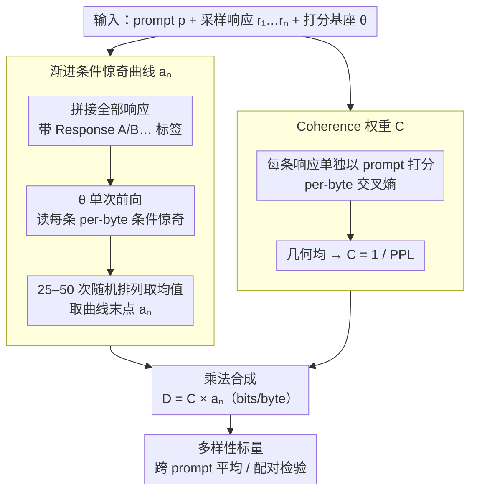

# "I've Seen How This Goes"：用渐进条件惊奇度刻画 LLM 与人类写作的多样性

**会议**: ICML 2026  
**arXiv**: [2606.01811](https://arxiv.org/abs/2606.01811)  
**代码**: https://github.com/AMindToThink/icl-diversity (有)  
**领域**: LLM 评估 / 多样性度量 / 信息论  
**关键词**: 多样性度量, 条件惊奇度, 上下文学习, 模式坍缩, RLHF 评估

## 一句话总结
本文提出 $D_{Ca_n}=C\cdot a_n$ 这一无需 embedding、无需参考语料、无需人工标签的多样性度量：用一个基座模型 $\theta$ 在单次前向里读完所有响应，把"最后一条响应在已见过 $n-1$ 条之后还剩多少 per-byte 条件惊奇"乘上"响应整体的可读性"，在 McDiv 人评基准上逼近 SentBERT，并在 OLMo-2-7B 的 base→SFT→DPO→RLVR 上单调下降，准确捕捉后训练带来的模式坍缩。

## 研究背景与动机

**领域现状**：评估生成模型多样性目前主流走两条路——表层 $n$-gram/self-BLEU（Li 2016, Zhu 2018），或 embedding 距离/聚类（Du & Black 2019, SentBERT）。前者只看字面，后者依赖一个额外的句向量模型。Tevet & Berant 2021 的 McDiv 基准把这套范式标准化（人评二分类 + OCA/Spearman 评分），成为多样性度量的事实标准。

**现有痛点**：$n$-gram 抓不住"换皮同质"——同义改写或风格雷同的响应可以词面分布很散但语义高度冗余；embedding 度量则把多样性"外包"给了句向量模型，引入了一个独立训练的黑箱，多样性高低实际取决于这个 embedding 模型的偏好，并且当 embedding 没见过的模式（角色风格、隐喻结构）出现时它就识别不出。两条路都缺乏"像人一样识别任意潜在共性"的能力。

**核心矛盾**：多样性本质上是"看完前面几条之后，后一条还能给我多少新信息"——这是一个信息论量。但已有信息论工作（MMI 解码、AIM）把互信息当训练或解码目标用，没人把它当 *评估期* 诊断工具用，因为大家默认基座模型本身不具备"边读边学"的能力。

**本文目标**：(1) 构造一个不依赖 embedding/参考语料/人工标签的多样性标量；(2) 在 Tevet & Berant 人评基准上达到接近 SentBERT 的相关性；(3) 在真实后训练流水线（OLMo-2-7B 的 base→SFT→DPO→RLVR）上能检测出业界普遍报告的"RLHF 引发模式坍缩"。

**切入角度**：Brown et al. 2020 的 ICL 现象告诉我们 base 模型在拼接上下文时会"边看边学"，那么把多样性测度直接定义在"基座模型读完前 $k-1$ 条响应后对第 $k$ 条还剩多少惊奇"上是最自然不过的——如果策略 $\pi$ 真的多样，$\theta$ 的 ICL 永远学不到模式，条件惊奇就掉不下来；如果 $\pi$ 在几个 mode 里转，$\theta$ 几条之后就识破了，条件惊奇会陡降到接近零。

**核心 idea**：用 base 模型的 ICL 能力当"多样性显微镜"——定义渐进条件惊奇曲线 $a_k=-\log_2\theta(r_k\mid r_{<k},p)/\|r_k\|$，取末点 $a_n$ 度量"已读完其余响应后第 $n$ 条还剩多少 per-byte 惊奇"，再乘以一个可读性权重 $C=1/\mathrm{PPL}_\theta(\pi,p)$ 防止纯噪声因为永远不可压缩而误判为高多样性。

## 方法详解

### 整体框架
给定 prompt $p$、从策略 $\pi$ 采到的 $n$ 条响应 $r_1,\dots,r_n$，以及一个固定的"打分基座模型" $\theta$（实验用 Qwen2.5-3B），度量分两条平行轨道跑一遍前向：条件轨把所有响应拼成一段带"Response A/B…"标签的长 context 喂给 $\theta$，读出每条响应在"已见前面若干条"之后还剩多少 per-byte 惊奇，取末点得到残余多样性 $a_n$；无条件轨把每条响应单独打分得到一个可读性权重 $C$。最终多样性就是两者相乘 $D_{Ca_n}=C\times a_n$（单位 bits/byte），可读作"$\theta$ 用 ICL 学完其余响应能学的之后，每字节还剩多少合理惊奇"。整条管线无 embedding、无参考语料、无人工标签、无辅助分类器，只吃 $\theta$ 本就会输出的逐 token 概率。

### 关键设计

**1. 渐进条件惊奇曲线 $a_k$：把多样性变成"读完前面后还剩多少惊奇"**

现有度量的尴尬在于：$n$-gram 只看字面、抓不住换皮同质，embedding 又得训一个独立黑箱、看不见它没见过的模式，而互信息这类信息论量一直被当训练/解码目标、没人拿来做评估期诊断。本文换了个角度——既然 base 模型在拼接上下文时天然会"边读边学"（ICL），那就直接把它当多样性显微镜。具体定义渐进条件惊奇 $a_k=-\log_2\theta(r_k\mid r_{<k},p)/\|r_k\|$，即"读完前 $k-1$ 条之后第 $k$ 条每字节还剩多少惊奇"，取末点 $a_n$ 度量残余多样性。它可改写成 $a_n=H_\theta(r_n\mid p)-I_\theta(r_n;r_1,\dots,r_{n-1}\mid p)$，也就是"响应自身惊奇度"减去"被其它响应预言走的部分"——要拿高分，响应必须既单独惊奇、又互不互推。如果 $\pi$ 真多样，$\theta$ 永远学不到 mode，曲线缓降并收敛到正值平台；如果 $\pi$ 只在几个 mode 里转，$\theta$ 几条就识破，曲线陡降到接近零。两个工程细节让它跨模型可用：归一化用 UTF-8 字节数而非 token 数，使不同分词器的基座模型之间可比；对响应顺序做 25–50 次均匀随机排列再取均值，消掉"谁恰好排在 $k$ 位"的偶然性。好处是零标注、能识别 embedding/$n$-gram 看不见的高阶共性（任务模板、叙事弧、角色风格），且度量灵敏度随 base 模型变强自动抬升。

**2. Coherence 权重 $C$：用几何均 perplexity 把噪声踢出局**

光看 $a_n$ 会被纯噪声打败——随机串永远不可被 ICL 学走，$a_n$ 会一直停在很高的无条件惊奇水平，于是垃圾反而"最多样"。本文加一个可读性权重把多样性强制锚在"可读性流形"上：$C=2^{-\frac{1}{n}\sum_i h_\theta(r_i\mid p)}=1/\mathrm{PPL}_\theta(\pi,p)$，其中 $h_\theta(r_i\mid p)$ 是每条响应单独以 prompt 为 context 打出的 per-byte 交叉熵，$C$ 正好等于响应集合的几何平均 per-byte perplexity 的倒数。用几何均而非算术均是关键——只要集合里出现哪怕一条 per-byte 困惑度爆表的响应，$C$ 就被拽到接近零，单条流畅响应无法"救场"，从而避免一堆烂响应被均值"洗白"。这样只有"既互不预测、又每条都流畅"才算高多样性。

**3. 乘法合成 $D_{Ca_n}=C\times a_n$：多样性是 (responses, prompt, scoring model) 三元组**

两个分量相乘得到单一标量"每字节有多少 bits 的合理惊奇剩余"，便于跨 prompt 平均或做配对检验。论文用 5 种合成场景校准其行为：纯噪声被 $C$ 压（GPT-2 上 0.04），one-mode 被 $a_n$ 压（0.10），multi-mode coherent 在 $\theta=$GPT-2 时排第二（0.26），mixed 排第一（0.52）——两个分量缺一不可。更关键的是定义把多样性显式写成 (responses, prompt, scoring model) 三元组：同一响应集换更强的 $\theta$ 会得到不同分数，这是 *设计目的* 而非 bug，因为"多样性"本就是"什么样的差异 $\theta$ 能感知到"。这一招把"度量随基座模型升级自动锐化"写进定义，避开了"固定一个旧 embedding 当裁判、天花板被锁死"的老问题。

### 训练策略
本文无任何训练——$\theta$ 直接拿已发布的 base 模型（Qwen2.5-3B base、GPT-2 124M、OLMo-2-7B-base），度量只是一次前向读出 per-token 对数概率再做字节归一化和排列平均。唯一的"超参"是排列数（25–50）和每 prompt 采样的响应数 $K$（实验 $K=10$）。OLMo 后训练实验里为消除"per-byte 交叉熵随 context 增长自然下降"的工件，把每个 (stage, prompt) 的所有响应在 UTF-8 字节级截断到该 prompt 下各 stage 的最短长度，截不到 50 字节的 prompt 直接丢弃（AlpacaEval 保留 150/200、NoveltyBench-curated 保留 39/100）。

## 实验关键数据

### 主实验
在 Tevet & Berant 的 McDiv / ConTest 人评基准上跑 Qwen2.5-3B + 50 排列，按 OCA（最优一维阈值分类准确率）和 Spearman $\rho$ 对齐 SentBERT、BERTsts、distinct-$n$ baseline（表中 ours 列从 Section 5 / 表 2 摘）。

| 数据集 / 子任务 | 指标 | $D_{Ca_n}$ (ours) | SentBERT (SOTA) | distinct-$n$ |
|---|---|---|---|---|
| McDiv prompt_gen (full, ~2K) | OCA | **0.846** | 0.897 | 0.746 |
| McDiv prompt_gen (full, ~2K) | $\rho$ | +0.729 | +0.796 | +0.476 |
| McDiv_nuggets prompt_gen (~1K) | OCA | 0.785 | 0.850 | 0.675 |
| ConTest prompt_gen (200) | OCA | 0.785 | 0.815 | 0.675 |
| ConTest story_gen (200) | OCA | 0.828 | 0.896 | 0.772 |

OLMo-2-7B 后训练流水线（base / SFT / DPO / Instruct(RLVR)），同一打分模型 $\theta=$ Qwen2.5-3B，25 排列，长度对齐：

| Stage | AlpacaEval $D_{Ca_n}$ mean (n=150) | NoveltyBench-curated mean (n=39) |
|---|---|---|
| Base | 0.481 | 0.481 |
| SFT | 0.329 | 0.369 |
| DPO | 0.286 | 0.312 |
| Instruct (RLVR) | 0.281 | 0.303 |

三条预注册单侧配对 Wilcoxon 对比（Bonferroni $\times 3$）在两份 prompt 集上全部显著：AlpacaEval 上 Base>SFT 的 $p_\text{Bonf}=3.4\times 10^{-24}$、SFT>DPO 为 $1.7\times 10^{-13}$、Base>Instruct 为 $5.2\times 10^{-26}$；NoveltyBench 上对应 $p$ 值分别为 $4.1\times 10^{-8}$、$2.8\times 10^{-6}$、$2.3\times 10^{-10}$。

### 消融实验
论文里没有传统"去模块"消融，但表 2 自带一个等价消融（把 $D_{Ca_n}$ 拆成 $a_n$ 和 $C$ 单独看），可读作分量贡献：

| 配置 | McDiv prompt_gen OCA | ConTest story_gen OCA | 说明 |
|---|---|---|---|
| $D_{Ca_n}=C\times a_n$（full） | 0.846 | 0.828 | 完整度量 |
| 只用 $a_n$（去掉 coherence 权重） | 0.781 | 0.684 | 在 McDiv 上掉 6.5pp，story_gen 上掉 14.4pp |
| 只用 $C$（即 $1/\mathrm{PPL}$） | 0.565 | 0.632 | 单独看几乎只比 chance 强 |

合成场景表（表 1）作为另一组"行为消融"佐证 $C$ 必要性：纯噪声集 $a_n$ 接近最大却被 $C$ 拉到 0.04（GPT-2）/0.05（Qwen），multi-mode incoherent 同样从高 $a_n$ 被 $C$ 拉到 0.19/0.29，one-mode 则被低 $a_n$ 自动压到 0.10/0.09——两个分量缺一不可。

### 关键发现
- **Coherence 权重不是装饰**：去掉 $C$ 后 ConTest story_gen 直接掉 14.4pp，说明现实人写多样响应里"有几条质量差"会拖累 $a_n$ 的判别力，$C$ 的几何均设计在这里救场最显著。
- **打分模型越强、度量越细**：Qwen2.5-3B 在 multi-mode incoherent 场景上 $a_n$ 反而下降（0.29 > 0.19 multi-mode coherent），说明它的 ICL 识破了"同模板被打乱"的共性；GPT-2 没这个能力，因而排序符合预期。这印证了"度量天花板随 base 模型升级自动抬升"的设计意图。
- **温度 ≠ 创造性**：在 DecTest（label 是采样温度而非人评）上 $a_n$ 反而以 $\rho=+0.932$ 击败所有 baseline，但作者明确指出这只是 sanity check——温度直接缩放策略熵，$a_n$ 是条件熵量，二者机械相关，不应被误读为"度量对创造性的灵敏"。
- **McDiv_nuggets 有构造性混淆**：低多样集是高戏剧性结局的改写，本身就比典型高多样续写更让 base 模型 surprised，所以 $a_1$ 就已经有 gap；$C$ 在这个 benchmark 上"成功"部分得益于这个混淆，在没有此类混淆的设置上作者预期 $a_n$ 单独就能扛住主信号。

## 亮点与洞察
- **把 ICL 当评估期显微镜而非训练期工具**：以往 MMI、AIM 把互信息当解码/训练目标，本文反过来把"基座模型边读边学"这一现象做成 *只在评估时* 起作用的探针，理念干净到几乎不像方法论——只用 $\theta$ 已经会输出的 logit，零额外训练。
- **per-byte 归一化 + 几何均 coherence 的组合拳**：per-byte 而非 per-token 让度量跨分词器可比；几何均让单条烂响应直接 veto 整个集合的"合理性"权重。这两个看似工程的小决定，是让度量在跨模型横评和现实噪声下不崩的关键，可以直接复用到任何"需要单数+集合质量+集合多样性"的复合度量任务（如多答案 QA 评估、code generation 多样性）。
- **把多样性显式定义为三元组 (responses, prompt, scoring model)**：直接承认"多样性不是策略的绝对属性"，避开了"固定旧 embedding 当裁判"的陷阱，并给出了一个干净的可升级路径：换更强 $\theta$ 即可让度量持续锐化。
- **预注册 + Bonferroni 校正的后训练验证**：把"RLHF 引发模式坍缩"这一定性观察变成 6 条带 $p$ 值的方向性结论（base→SFT→DPO→RLVR 在两个 prompt 集上全部 $p_\text{Bonf}<10^{-6}$），实验范式可以直接抄给做 RLHF/DPO 多样性评估的论文。
- **$\bar a_k$ 曲线本身就有诊断价值**：曲线形状能区分"陡降到地板"的 one-mode 坍缩与"缓降到正平台"的真多样，比单点 $a_n$ 信息量大，是个天然的可视化工具。

## 局限与展望
- **多样性 ≠ 任务效用**：作者自己点明 $a_k$ 框架与下游任务脱钩——响应可以同时"按 $a_k$ 测得很多样"和"对任务全部失败"（Wang et al. 2025 的 Echo Trap 即此例反面：reward std 当 proxy 是 task-aware 的而 $a_n$ 不是），所以这个度量适合做"健康检查 / 模式坍缩告警"，不适合直接当 reward 或主要质量指标。
- **依赖打分模型 $\theta$ 的能力上限**：$\theta$ 看不出的差异度量就看不出，这意味着"小基座 + 极复杂模式"会被低估；论文用 Qwen2.5-3B 已是务实折中，但要在更复杂的 long-form creative writing 上做评估，$\theta$ 可能要换 7B+。计算成本也随 $n^2$（拼接长度）+ 排列数线性增长。
- **截断到最短字节长度的代价**：OLMo 实验里 AlpacaEval 丢了 1/4 prompt、NoveltyBench-curated 丢了 6/10，对短响应模型/任务不太友好；per-byte 归一化在数学上漂亮但在"模型 A 短 B 长"的对比里仍有偏置——本文用对齐截断硬扛过去，未来值得做无截断的修正项。
- **McDiv_nuggets 构造性混淆未根除**：低多样集是"自选戏剧性结局的改写"，$a_1$ 就已带 gap，$C$ 的"成功"部分来自此混淆。作者承认这点并把无混淆设置留给未来；建议读者跑该度量时优先看 prompt_gen 子集，对 nuggets 类构造保持警惕。
- **排列平均成本**：25–50 个排列对 $n=10$ 已可承受，但响应数上百时纯排列法不再可行；论文用了均匀随机替代全排列，但缺少对 permutation variance 的正式分析。

## 相关工作与启发
- **vs $n$-gram / self-BLEU (Li 2016, Zhu 2018)**：他们做表层串重叠，本文做基座模型的分布级条件惊奇；优势是能识别"换皮同质"，劣势是计算成本和对 $\theta$ 的依赖。
- **vs Du & Black 2019 / SentBERT 嵌入聚类**：他们用句向量距离/聚类惯量，本文用基座模型 ICL；二者互补——嵌入抓"学到的语义距离"，本文抓"统计独立性"，并且本文把 embedding 模型这一独立黑箱替换为"可随基座升级自动锐化"的探针。McDiv 上 OCA 差 5pp 是当前 ICL 探针 vs 专用 SentBERT 的代价。
- **vs NoveltyBench (Zhang 2025c)**：他们训了一个 DeBERTa 当功能等价分类器再算 Distinct-$k$，与 mode count 概念近似；但其 ground truth 本身就是 79% 准的训练模型，"correlation with their labels"到底是验证度量还是两个模型互相打分作者难以判断。本文走"和人评直接比"，干净许多。
- **vs Kirk 2023 / Padmakumar & He 2023（RLHF 减少多样性）**：他们用 EAD / distinct-$n$ / SentBERT 等已有度量做定性观察，本文给出预注册 + Bonferroni 校正的强统计证据 + 跨度量交叉确认（Appendix H：$D_{Ca_n}$ 与 EAD、SentBERT 在长度对齐子集上信号一致）。
- **vs Tevet & Berant 2021 (McDiv)**：本文沿用其评估方法学（Spearman $\rho$ + OCA），并指出 McDiv_nuggets 的构造性混淆——本身就是对该基准生态的有用补充。

## 评分
- 新颖性: ⭐⭐⭐⭐ 把 ICL 当评估期多样性显微镜的想法干净且抓住了本质；分量本身（条件 PPL、coherence）是经典工具的小重组，主要贡献在 framing 与三元组定义。
- 实验充分度: ⭐⭐⭐⭐ McDiv/ConTest 人评 + OLMo 后训练真实场景 + 合成场景行为表 + 跨基座对比 + 预注册检验 + 长度对齐控制，覆盖面到位；缺扩大 $\theta$ 规模的系统 ablation。
- 写作质量: ⭐⭐⭐⭐⭐ 公式/记号干净自洽，主张审慎（自报与 SOTA 的 gap、明确说 DecTest 不算证据、自曝 McDiv_nuggets 混淆），还把 5 个边界场景的预期与实测列在同一张表里——评估论文该有的样子。
- 价值: ⭐⭐⭐⭐ 立刻可作 RLHF / decoding strategy / prompting 干预的开源诊断工具（仓库 icl-diversity 已放出），并为"零标注、可随基座升级"的评估范式提供了模板；当下做 LLM 后训练或创造性生成的团队都能直接用。

<!-- RELATED:START -->

## 相关论文

- [\[ICLR 2026\] How Catastrophic is Your LLM? Certifying Risk in Conversation](../../ICLR2026/llm_nlp/how_catastrophic_is_your_llm_certifying_risk_in_conversation.md)
- [\[ICML 2026\] How Many Different Outputs Can a Transformer Generate?](how_many_different_outputs_can_a_transformer_generate.md)
- [\[ACL 2025\] A Survey of LLM-based Agents in Medicine: How Far Are We from Baymax?](../../ACL2025/llm_nlp/a_survey_of_llm-based_agents_in_medicine_how_far_are_we_from_baymax.md)
- [\[ACL 2026\] One Persona, Many Cues, Different Results: How Sociodemographic Cues Impact LLM Personalization](../../ACL2026/llm_nlp/one_persona_many_cues_different_results_how_sociodemographic_cues_impact_llm_per.md)
- [\[ICML 2026\] Universal Reasoner: 冻结 LLM 的可组合即插即用推理器](universal_reasoner_a_single_composable_plug-and-play_reasoner_for_frozen_llms.md)

<!-- RELATED:END -->
