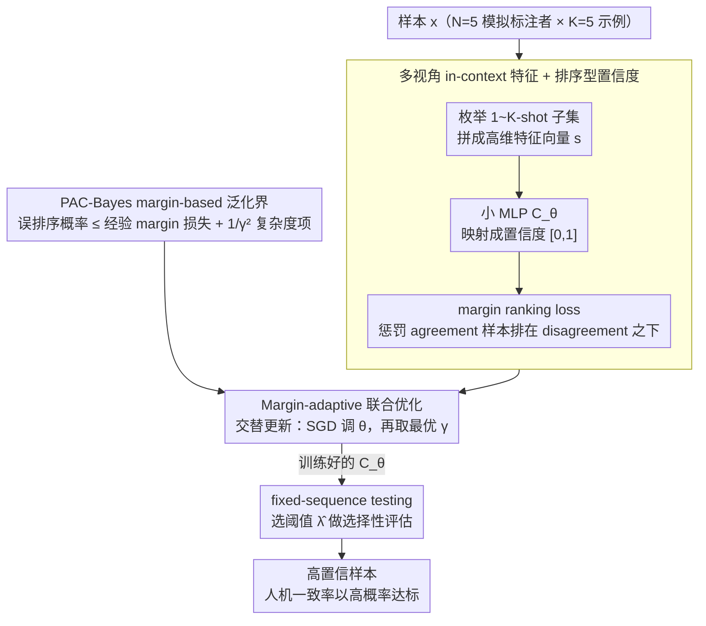

# Margin-Adaptive Confidence Ranking for Reliable LLM Judgement

**会议**: ICML 2026  
**arXiv**: [2605.15416](https://arxiv.org/abs/2605.15416)  
**代码**: 暂无公开  
**领域**: LLM 评估 / 选择性预测 / PAC-Bayes 泛化  
**关键词**: LLM-as-a-judge, 置信度估计, margin ranking, PAC-Bayesian bound, 选择性评估

## 一句话总结
本文针对 LLM-as-a-judge 中"置信度高就一定靠谱"这一常被违反的单调性假设，提出用一个小 MLP 把多组 in-context 预测概率映射成置信度，并通过 margin-based ranking loss + PAC-Bayes 泛化界推导出一个 margin 自适应训练策略，使学到的置信度在四个数据集与六个 judge 模型上都获得更低的 ranking loss、更高的 AUROC，并显著提升 fixed-sequence 测试的目标一致性达成率。

## 研究背景与动机

**领域现状**：LLM-as-a-judge 是当前评估开放式生成任务的主流方式（AlpacaEval、Chatbot Arena 等），其可靠性通常依赖一种"选择性评估"流程：先估计每个样本的置信度 $C_{LM}(x)$，再用 fixed-sequence testing 找到一个阈值 $\widehat{\lambda}$，使得高置信样本的人机一致率以高概率达到目标 $1-\alpha$。Jung et al. (2025) 在此框架下给出了形式化的 PAC 风险上界。

**现有痛点**：所有这类方法都建立在一个隐式的"单调性假设"上——置信度越高，与人类判断的 disagreement risk 越低。本文的 Figure 1/3 实证显示，无论是 predictive probability 还是 simulated annotators，置信度与人机一致率之间的关系都常常非单调（在 AlpacaEval、Chatbot Arena 上尤其明显）。此外，已有理论只对**校准集条件下**的风险给出保证，对置信度估计器本身的**out-of-sample 泛化**没有任何分析。

**核心矛盾**：把启发式信号（predictive probability、verbalized confidence）当作可靠的置信度，本质上是把"分类正确性"和"排序一致性"混为一谈。前者只要求阈值附近的判别正确，后者要求**全局序关系**与人机一致率单调对齐，这是两个完全不同的学习目标。

**本文目标**：把置信度建模为一个可学习的排序函数 $C_\theta$，并对它的"误排序概率"建立 PAC-Bayes 泛化界，从而在理论上控制选择性风险的单调性。

**切入角度**：作者把每个样本 $x$ 表示成一个高维特征向量 $s = (\mathbb{P}_{LM}(r_1\mid x; t_1),\dots,\mathbb{P}_{LM}(r_1\mid x; t_{|\mathcal{T}|}))$，其中每个 $t_i$ 是一组不同的 in-context 注释示例。这样 simulated annotators 不再被人为聚合为一个 max-mean 标量，而是作为多视角原始特征喂给一个小 MLP。

**核心 idea**：用 margin-based pairwise ranking loss 训练 $C_\theta$，并通过 PAC-Bayes 推出"margin 越大 → 经验损失越难压低，但泛化复杂度越小"的 trade-off，再据此**联合优化** $\theta$ 和 margin $\gamma$。

## 方法详解

### 整体框架
方法要解决的是"如何让置信度真正与人机一致率单调对齐"。给定 judge 模型 $f_{LM}$ 和一个有人类偏好标注的小校准集 $S_{\mathrm{cal}}$，整条 pipeline 是：先把每条样本在多组 in-context 示例下的预测概率拼成一个高维特征向量，再用一个小 MLP $C_\theta$ 把这个向量映射成 $[0,1]$ 的置信度，训练目标是用 margin ranking loss 强制"人机一致的样本排在不一致样本之上"；最后把训练好的 $C_\theta$ 直接嵌进 Jung et al. (2025) 的 fixed-sequence testing，照旧选阈值做带高概率保证的选择性评估。具体而言，对每条样本 $x$ 用 $N=5$ 个 simulated annotator、各 $K=5$ 个示例枚举所有 $1\sim K$-shot 子集 $\mathcal{T}$，得到特征 $s\in\mathbb{R}^{|\mathcal{T}|}$；从 $S_{\mathrm{cal}}$ 中按 $f_{LM}(x)$ 是否等于人类标签 $y$ 切出 agreement / disagreement 两组，随机抽 5000 对构造 ranking 训练对；MLP 训练完后按 $\widehat{\lambda} = \inf\{\lambda: \widehat{R}^+(\lambda') \le \alpha,\ \forall \lambda' \ge \lambda\}$ 选阈值。

### 关键设计

**1. 多视角 in-context 特征 + 排序型置信度：把"分类正确"和"排序一致"分开**

痛点在于以前的置信度要么直接取 softmax 概率，要么把 simulated annotators 人为聚合成一个 max-mean 标量，再当成可信信号——这等于把"阈值附近判别正确"和"全局序关系与人机一致率单调对齐"两个不同的目标混为一谈。本文不再聚合：保留所有 $|\mathcal{T}|$ 维原始概率，交给 MLP 自主学怎么聚合。对样本 $(x,y)$ 定义 agreement 指示 $a(x) = \mathbb{1}\{f_{LM}(x) = y\}$，然后只在满足 $a(x_i) > a(x_j)$ 的有序对上定义 margin ranking loss $\ell_\gamma(\theta; x_i, x_j) = \mathbb{1}(C_\theta(s_i) < C_\theta(s_j) + \gamma)$，训练时用 softplus 代理 $\log(1+e^{-(C_\theta(s_i)-C_\theta(s_j)-\gamma)/0.1})$ 让它可导。因为单调性本质是个**序关系**性质，所以损失必须直接惩罚"agreement 样本排得比 disagreement 样本低"，而不是绕道分类正确率——这正是它比启发式置信度更可靠的根源。

**2. PAC-Bayes margin-based 泛化界：把"凭什么可信"变成可定量的保证**

已有理论只对校准集条件下的风险给保证，对置信度估计器本身的 out-of-sample 泛化只字未提。本文用 PAC-Bayes 框架（McAllester, 1999；Neyshabur et al., 2017）补上这一块：先得到随机化估计器 $C_{\theta+\mathbf{u}}$ 的期望 ranking risk 上界，再通过 sharpness 约束 $\mathbb{P}_{\mathbf{u}}(\max_s |C_{\theta+\mathbf{u}}(s) - C_\theta(s)| < \gamma/4) \ge 1/2$ 把界转回确定性估计器，最终得到

$$\mathcal{RK}(\theta) \le \widehat{\mathcal{RK}}_\gamma(\theta) + \mathcal{O}\!\left(\sqrt{\frac{\Phi(C_\theta) + \ln(3m_p/\delta')}{\gamma^2 (m_p - 1)}}\right),\quad \Phi(C_\theta) = n^2 h \ln(nh) \prod_l \|W_l\|_2^2 \sum_l \frac{\|W_l\|_F^2}{\|W_l\|_2^2}.$$

它把"误排序概率"显式拆成经验 margin 损失加一个 margin 依赖的复杂度项。关键是复杂度项里 $1/\gamma^2$ 的依赖——它直接点明 margin $\gamma$ 才是控制泛化的那个旋钮，从而为下一个设计提供了理论入口：不再把"为什么可信"留作启发式说辞，而是落成一条可优化的不等式。

**3. Margin-adaptive 联合优化：让 $\gamma$ 跟着数据噪声自动校准**

上面的界还隐含一个张力：$\gamma$ 越大复杂度越小，但经验 margin 损失越难压低；干净数据可以追求更大分离度，嘈杂数据则必须妥协，**不存在通用最优 margin**。固定 margin 因此两头不讨好。本文把界中的复杂度项简化成可导代理 $\mathcal{C}_\gamma(\theta) = \sqrt{\sum_l \|W_l\|_F^2}/\gamma$（用 Frobenius 范数替谱范数），把 $\gamma$ 提升为可学习量，联合优化 $\min_{\theta,\gamma}\widehat{\mathcal{RK}^s_\gamma}(\theta) + \beta\,\mathcal{C}_\gamma(\theta)$。由于 ranking loss 对 $\gamma$ 非光滑、直接联合更新不稳，作者用解耦的交替更新：固定 $\gamma$ 用 SGD 更新 $\theta$，固定 $\theta$ 取使目标最小的 $\gamma$。这一步是整篇的点睛——它把 PAC-Bayes 界从一个"事后分析工具"真正变成了"训练目标"，让 margin 不再是经验玄学超参。

### 损失函数 / 训练策略
经验目标为 $\min_{\theta} \min_{\gamma}\, \widehat{\mathcal{RK}^s_\gamma}(\theta) + \beta\,\mathcal{C}_\gamma(\theta)$，权衡系数 $\beta = 10^{-4}$。网络是 3 层 MLP（64→32→16，ReLU，末层 sigmoid），训 30 epoch，学习率 $10^{-3}$、weight decay $10^{-4}$；每个数据集生成约 3000 个训练样本、随机抽 5000 对构造 ranking 训练对。推理时把训练好的 $C_\theta$ 代替原始 $C_{LM}$ 喂入 Jung 等人的 fixed-sequence testing，按二项分布精确 $(1-\delta)$ 上界 $\widehat{R}^+(\lambda)$ 找最小可接受阈值。

## 实验关键数据

### 主实验：Ranking Loss & AUROC（节选 3 个 judge × 4 个数据集）

| Judge | 数据集 | 指标 | Predictive Prob. | Simulated Annot. | Learning (Vanilla) | **本文** |
|-------|--------|------|------------------|------------------|--------------------|----------|
| Mistral-7B | AlpacaEval | $\mathcal{RK}\downarrow$ / AUROC$\uparrow$ | 0.421 / 0.580 | 0.418 / 0.582 | 0.387 / 0.618 | **0.339 / 0.667** |
| Mistral-7B | Chatbot Arena | $\mathcal{RK}\downarrow$ / AUROC$\uparrow$ | 0.332 / 0.665 | 0.323 / 0.677 | 0.282 / 0.703 | **0.274 / 0.713** |
| Llama3-70B | AlpacaEval | $\mathcal{RK}\downarrow$ / AUROC$\uparrow$ | 0.402 / 0.599 | 0.384 / 0.616 | 0.324 / 0.673 | **0.278 / 0.705** |
| Llama3-70B | Chatbot Arena | $\mathcal{RK}\downarrow$ / AUROC$\uparrow$ | 0.255 / 0.746 | 0.265 / 0.735 | 0.249 / 0.752 | **0.217 / 0.787** |
| Qwen2.5-72B | HH-RLHF | $\mathcal{RK}\downarrow$ / AUROC$\uparrow$ | 0.441 / 0.554 | 0.368 / 0.647 | 0.348 / 0.658 | **0.281 / 0.713** |
| Qwen2.5-72B | TL;DR | $\mathcal{RK}\downarrow$ / AUROC$\uparrow$ | 0.372 / 0.627 | 0.361 / 0.631 | 0.338 / 0.658 | **0.279 / 0.702** |

在全部 4 个数据集 × 6 个 judge 模型组合中，本文方法均取得最低 ranking loss 与最高 AUROC。

### 消融实验：Vanilla（仅标准 ranking loss）vs. 本文（margin-adaptive）

| 配置 | AlpacaEval $\mathcal{RK}\downarrow$ | HH-RLHF $\mathcal{RK}\downarrow$ | Chatbot Arena $\mathcal{RK}\downarrow$ | TL;DR $\mathcal{RK}\downarrow$ | 说明 |
|------|-------------------------------------|----------------------------------|----------------------------------------|--------------------------------|------|
| Predictive Probability | 0.402 | 0.448 | 0.255 | 0.416 | 启发式 baseline |
| Simulated Annotators | 0.384 | 0.357 | 0.265 | 0.392 | Jung 等人手工聚合 |
| Learning Confidence (Vanilla) | 0.324 | 0.360 | 0.249 | 0.358 | 同样的 MLP + 固定 margin ranking loss |
| **Learning Confidence (Ours)** | **0.278** | **0.309** | **0.217** | **0.314** | + margin-adaptive 联合优化 |

（Llama3-70B judge 上的对比）从 Vanilla 到 Ours 的提升幅度（约 0.03–0.05 ranking loss）专门归因于 margin-adaptive 训练；说明 PAC-Bayes 推出的 margin 自适应策略并非装饰。

### 关键发现
- **单调性恢复**：Figure 3 显示在 Llama3-8B + Chatbot Arena 上，Simulated Annotators 的置信度-一致率曲线显著非单调，而本文方法把曲线扳回单调，从而让 fixed-sequence testing 真正可用。
- **Bernoulli 模拟（Figure 2）**：在 10000 次合成实验中，ranking loss 与 monotonicity violation rate 同步上升，从经验上佐证"压低 ranking loss 就能减少单调性违反"这一推论。
- **下游收益**：在 cascaded selective evaluation（L→Q→O，M→L→O）下、目标一致率 $1-\alpha = 0.85$ 时，传统启发式选择的 guarantee success rate 几乎为 0%，而本文学到的置信度能把成功率显著拉升，是文章把"理论改进 → 真实部署效果"打通的最关键一环。

## 亮点与洞察
- **把 LLM-as-a-judge 从"启发式置信度"推到"可学习排序函数"**：以前的 confidence 估计要么直接取 softmax 概率，要么手工聚合 simulated annotator，本文第一次明确把它建模为一个**排序学习**问题，并允许小 MLP 学到 judge 与数据集特定的聚合方式。
- **PAC-Bayes 推论真正"反哺"了训练目标**：复杂度项 $\sqrt{\sum_l \|W_l\|_F^2}/\gamma$ 直接出现在损失里，margin 不再是经验玄学超参，而是从泛化界中导出的可优化量，这种"理论→实操"的闭环在 LLM 评估领域非常稀缺。
- **可迁移 trick**：把"多套 in-context 示例下的预测概率"打包成特征向量喂给小模型，这种"sub-prompt ensemble as features"的思路对一切需要从 LLM 抽取可靠信号的下游任务（calibration、selective abstention、reward modeling）都直接适用。

## 局限与展望
- 仍依赖一个**有人类偏好标签的小校准集**（每数据集约 3000 例）；零标注场景下本文方法无法训练 $C_\theta$。
- 复杂度项里把谱范数替换为 Frobenius 范数虽然可导，但放大了上界、可能不够紧；理论与训练目标之间还存在一道"代理 gap"。
- $\gamma$ 的交替更新在实践中能稳定收敛，但对学习率、$\beta$ 的选择仍敏感；论文未充分讨论联合优化失败时的 fallback。
- 实验全部基于"两候选偏好判断"任务格式；多候选、开放式打分等更复杂的 judge 场景未覆盖。
- 训练特征向量维度 $|\mathcal{T}|$ 随 $K, N$ 指数膨胀（$\sum_{k=1}^K \binom{K}{k} \cdot N$），扩大 in-context 示例数会迅速带来推理开销。

## 相关工作与启发
- **vs Jung et al. (2025) Simulated Annotators**：Jung 用固定的 max-mean 聚合 + 启发式置信度，本文把同样的 in-context 信号当成原始特征喂给可学习 MLP，并在 ranking objective 下训练；两者的 fixed-sequence testing 框架完全兼容，本文是其中"置信度模块"的可替换升级。
- **vs Mohri & Hashimoto (2024) Conformal Prediction**：Conformal 方法给出 marginal correctness 保证但默认置信度可信；本文反过来直接保证置信度的**排序一致性**，与 conformal 是正交且互补的视角。
- **vs Neyshabur et al. (2017) PAC-Bayes for Classification**：Neyshabur 等人的分析针对离散分类损失，本文把它扩展到 $[0,1]$ 连续输出 + ranking 误差，并用 sharpness 约束推出 margin 依赖复杂度，给"continuous-output + ranking"组合提供了一个清晰模板。
- **vs Verbalized Confidence**：让 LLM 自报置信度是最便宜的方案，但论文表 1 显示其 ranking loss 和 AUROC 都垫底，验证了"prompt 出来的置信度"几乎不可直接信赖。

## 评分
- 新颖性: ⭐⭐⭐⭐ 把 LLM-judge 置信度首次形式化为 PAC-Bayes 下的 margin ranking 问题，且 margin 自适应优化是从理论里"反推"出来的。
- 实验充分度: ⭐⭐⭐⭐ 覆盖 4 数据集 × 6 judge 模型 + cascaded evaluation 下游验证；可惜未公开代码、缺少更复杂的多候选/开放式打分场景。
- 写作质量: ⭐⭐⭐⭐ 动机—理论—方法—实验链条清晰，PAC-Bayes 推导虽然密集但每一步都有 remark 解释。
- 价值: ⭐⭐⭐⭐ 给所有依赖 LLM-as-a-judge + selective evaluation 的工作（评测平台、RLHF reward 模型挑选）提供了一个可直接复用的"置信度升级件"。

<!-- RELATED:START -->

## 相关论文

- [\[ICML 2026\] ANCHOR: Abductive Network Construction with Hierarchical Orchestration for Reliable Probability Inference in Large Language Models](anchor_abductive_network_construction_with_hierarchical_orchestration_for_reliab.md)
- [\[ACL 2025\] Direct Confidence Alignment: Aligning Verbalized Confidence with Internal Confidence In Large Language Models](../../ACL2025/llm_nlp/direct_confidence_alignment_aligning_verbalized_confidence_with_internal_confide.md)
- [\[ICML 2026\] dLLM-Cache: Accelerating Diffusion Large Language Models with Adaptive Caching](dllm-cache_accelerating_diffusion_large_language_models_with_adaptive_caching.md)
- [\[ICML 2026\] SPA-Cache: Singular Proxies for Adaptive Caching in Diffusion Language Models](spa-cache_singular_proxies_for_adaptive_caching_in_diffusion_language_models.md)
- [\[ACL 2025\] Ranking Unraveled: Recipes for LLM Rankings in Head-to-Head AI Combat](../../ACL2025/llm_nlp/ranking_unraveled_recipes_for_llm_rankings_in_head-to-head_ai_combat.md)

<!-- RELATED:END -->
