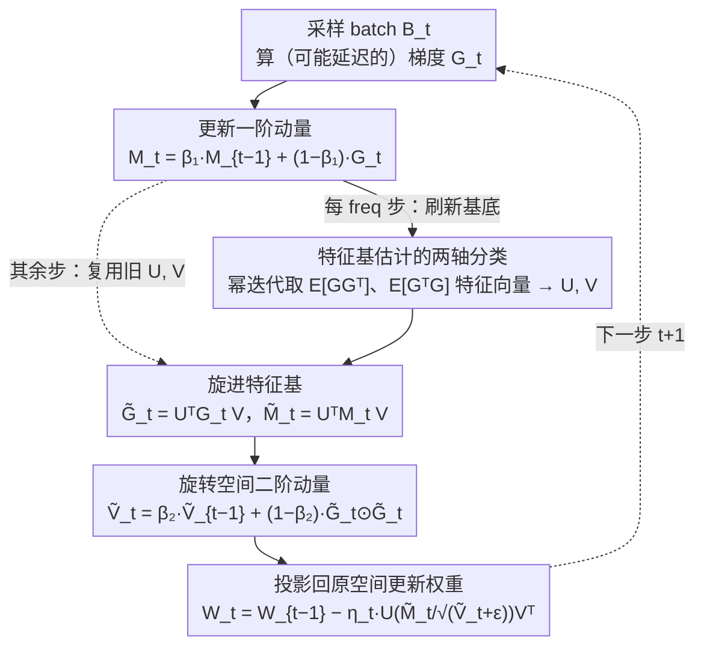

# Mitigating Staleness in Asynchronous Pipeline Parallelism via Basis Rotation

**会议**: ICML 2026  
**arXiv**: [2602.03515](https://arxiv.org/abs/2602.03515)  
**代码**: https://github.com/LOG-postech/basis-rotation (有)  
**领域**: LLM效率 / 分布式训练 / 优化器  
**关键词**: 异步流水线并行, 梯度延迟, 基底旋转, Adam, Hessian 特征基

## 一句话总结
作者把异步流水线并行训练 LLM 时延迟梯度导致收敛崩塌的"罪魁祸首"归结为 Adam 的基底失配（Hessian 特征基与坐标轴不对齐），并提出在 Hessian 特征基下做基底旋转再走 Adam 更新，3B 模型上比最强异步基线少 81.7% 迭代就能达到同样 loss。

## 研究背景与动机

**领域现状**：训百亿参数级 LLM 必须把模型按层切到多张卡上做流水线并行；同步流水线（GPipe 系列）要等所有 stage 的反向都做完才更新参数，会产生大量"流水线气泡"（pipeline bubbles），硬件利用率被拉低。异步流水线（PipeDream 等）让每个 stage 一拿到反向就立即更新，消掉气泡换吞吐。

**现有痛点**：异步执行的代价是梯度延迟（gradient staleness）——当前更新用的是若干步之前权重上算出的梯度。已知的补救方法包括 stage-wise 学习率调度（PipeDream-LR）、Nesterov 动量（Ajanthan 2025）、未来权重预测（PipeMare）等，但作者实测发现：固定模型只增加 stage 数 $P$，从 $P=1$ 到 $P=32$ 收敛速度直接掉到 1/5.81，所有现有 baseline 在大 $P$ 下都崩；更糟的是同时扩模型 + 扩 stage 时，baseline 出现"模型越大 loss 越高"的反 scaling-law 现象。

**核心矛盾**：延迟本身的 $\mathcal{O}(\sqrt{\tau/T})$ 减速理论上是温和的，但实际下游崩塌远超此预测。作者发现真正放大延迟伤害的，是优化器与 loss landscape 几何的相互作用——具体说是 Adam 的坐标级自适应在 Hessian 特征基与标准坐标轴不对齐时会沿主特征方向发生剧烈振荡。

**本文目标**：(i) 解释为什么延迟在大流水线下不是温和退化而是灾难性退化；(ii) 给出一个可在百亿规模上部署、不依赖 weight stashing 也能 work 的延迟缓解方案。

**切入角度**：在二次目标 $\min_w \tfrac12 w^\top H w$ 这个最简模型里观察 Adam 的轨迹形状——当 $H$ 对角（基底对齐）时 Adam 轨迹平直，延迟梯度仍指向几乎相同方向；当 $H$ 旋转一个角度（基底失配）时 Adam 沿主特征方向反复横跳，此时延迟梯度可能指向当前迭代点的反方向。轨迹是否"局部一致"决定了延迟伤害的大小。

**核心 idea**：既然 Adam 在对齐基底下抗延迟，那就把整个优化空间旋转到 Hessian 特征基下再让 Adam 跑——用经验 Fisher $\mathbb{E}[GG^\top]$、$\mathbb{E}[G^\top G]$ 的特征向量在线估计旋转矩阵 $U,V$，对梯度做双侧旋转 $\tilde G = U^\top G V$ 后再 Adam 更新，最后旋转回原空间。

## 方法详解

### 整体框架
方法围绕一件事：让 Adam 在 Hessian 的特征基下、而不是在标准坐标轴下跑，从而对异步流水线带来的延迟梯度免疫。中心对象是单个权重矩阵 $W\in\mathbb{R}^{m\times n}$ 上的 "Adam-with-basis-rotation" 更新——每步拿到梯度 $G_t=\nabla f_W(W_{t-1};B_t)$ 后，先更新一阶动量 $M_t$，每隔 freq 步用幂迭代刷新一次左右旋转矩阵 $U\in\mathbb R^{m\times m}$、$V\in\mathbb R^{n\times n}$（它们的列分别是 $\mathbb E[GG^\top]$ 和 $\mathbb E[G^\top G]$ 的特征向量），然后把梯度和动量旋进特征基算 $\tilde G_t=U^\top G_t V$、$\tilde M_t=U^\top M_t V$，在旋转空间维护二阶动量 $\tilde V_t$，最后把更新方向投影回原空间走 $W_t=W_{t-1}-\eta_t\,U(\tilde M_t/\sqrt{\tilde V_t+\epsilon})V^\top$。这整套换算之所以在 LLM 规模上还 tractable，靠的是论文两条结构假设：Hessian 分块对角（每个权重矩阵是独立块）+ 每块 Hessian 可 Kronecker 分解为左右两个小矩阵的张量积，于是本该是 $mn\times mn$ 的旋转矩阵被压成 $m\times m$ 和 $n\times n$ 两个小矩阵。

下图是单个权重矩阵 $W$ 上每一步的更新流程（关键设计 1 是支撑这一切的诊断/动机，不在流程图里）：

### 关键设计

**1. 基底失配是延迟伤害的放大器：先诊断清楚再对症下药**

异步流水线的延迟 $\tau$ 在理论上只带来 $\mathcal O(\sqrt{\tau/T})$ 的温和减速，可实测却是灾难性崩塌——这之间的鸿沟必须先解释清楚，算法才能精准发力。作者的答案是：真正放大延迟伤害的是 Adam 的坐标级自适应与 loss landscape 几何的错配。为了把这个直觉变成能纳入收敛界的量，他们用 Hessian 的 $(1,1)$-范数 $\|\nabla^2 f(w)\|_{1,1}=\sum_{i,j}|H_{ij}|$ 当作"基底失配"的代理量：给定特征谱不变，$H$ 越接近对角（基底越对齐坐标轴）该范数越小，旋转得越偏越大。在坐标级有界噪声 + 坐标级 $\ell_\infty$ 光滑两条假设下，他们证出 asynchronous Adam（$\beta_1=0$）的收敛界

$$\min_t \mathbb E\|\nabla f(w_t)\|_1 = \mathcal O\Bigl(\sqrt{(1+d\tau)\Delta_0 C/T} + \sqrt{\textstyle\sum_i\sigma_i}\,\bigl((1+d\tau)\Delta_0 C/T\bigr)^{1/4} + \dots\Bigr),$$

其中 $C$ 正是失配代理量。关键在于延迟 $\tau$ 和失配 $C$ 是**乘性**耦合的——对齐基底（$C$ 小）下 $\tau$ 几乎无害，失配基底（$C$ 大）下 $\tau$ 被狠狠放大，这正好解释了为什么大流水线下延迟不是温和退化而是崩塌。把分析推广到各 stage 延迟不同的情形，还能得到等效延迟 $\tau'=\sqrt{\sum_i C_i^2\tau_i^2/\sum_i C_i^2}$，揭示出延迟最大的靠前 stage 对收敛的拖累也最重——这条公式后面直接变成 stage-aware 调度的依据。

**2. 基底旋转 Adam（Algorithm 1）：把整个优化空间搬到特征基下，让失配 $C$ 自己变小**

既然 $\mathcal O(\tau\cdot C)$ 项由失配主导，那就构造一个变换把 $C$ 压到它的下界。做法是在旋转空间 $\tilde w=\mathcal U^\top w$ 里走标准 Adam，等价于在原空间执行 $\mathcal U\cdot\text{Adam}(\mathcal U^\top\nabla f)$ 这条更新；矩阵权重情形借 Kronecker 假设把 $\mathcal U$ 拆成左右两个小矩阵 $U,V$，于是旋进去算 $\tilde G_t=U^\top G_t V$、在旋转空间累加平方梯度得二阶动量 $\tilde V_t$，最终 $W_t\leftarrow W_{t-1}-\eta_t\,U(\tilde M_t/\sqrt{\tilde V_t+\epsilon})V^\top$。这样做之所以有效，是因为理论上 $\|H_{U,V}\|_{(1,1)}\le\|H_U\|_{(1,1)}\le\|H\|_{(1,1)}$——双侧旋转在所有旋转里达到 $(1,1)$-范数的全局最小，实测把归一化 Hessian $(1,1)$-范数从 0.5436 压到 0.1228，等于直接掐住了放大延迟的那个因子。代价上 $U,V$ 不必每步刷新，默认 freq=10 几乎不掉点，拉到 freq=100 仍显著领先 baseline，开销可控。

**3. 特征基估计的两轴分类（Algorithm 2）：在精度和显存之间给出可选档位**

百亿模型上多存两个矩阵、多算一次特征分解都不是小事，所以怎么估 $U,V$ 必须可调。作者用两个正交的轴把方案铺成一个谱系：第一个轴是 approximation source $\mathcal S$——$\mathcal S=2^\text{nd}$ 维护 $L=\mathbb E[GG^\top]$、$R=\mathbb E[G^\top G]$ 两个 EMA 矩阵当经验 Fisher 用，精度高但要存两个矩阵；$\mathcal S=1^\text{st}$ 退一步只用一阶动量近似 $\mathbb E[GG^\top]\approx\mathbb E[G]\mathbb E[G]^\top$，省掉 $L,R$ 的存储。第二个轴是 rotation geometry $\mathcal G$——bilateral 同时旋转左右两侧、捕捉完整 Kronecker 结构，unilateral 只旋转较小那一维以省算力。有意思的是这套分类把现成方法都装了进来：SOAP 恰是 ($\mathcal S=2^\text{nd}$, bilateral)、full-rank GaLore 恰是 ($\mathcal S=1^\text{st}$, unilateral)，统一到同一框架后就能把 Hessian geometry 的贡献从各家实现差异里干净地隔离出来。

### 损失函数 / 训练策略
训练目标就是标准语言模型的 next-token prediction，没有额外正则项。优化器超参沿用 Adam，新增的只有基底刷新频率 freq 和 $L/R$ 的 EMA 衰减（复用 $\beta_2$）。所有方法默认配 weight stashing（前向反向用同一份权重）以保证梯度计算正确，但论文也专门做了去掉 stashing 的鲁棒性实验。stage-aware 变种则按各 stage 延迟 $K-k$ 的大小不均匀分配基底刷新预算——延迟越大的早期 stage 刷得越勤，直接对应关键设计 1 里 $\tau'$ 揭示的"早期 stage 失配主导"。

## 实验关键数据

### 主实验
模型规模 95M ~ 3B 的 decoder-only Transformer，在 OpenWebText 上训 1B token。Baseline 是 PipeDream、PipeDream-LR、Nesterov 三种主流异步方案，默认 $\mathcal S=2^\text{nd}$ + bilateral，freq=10。

| 设置 | 指标 | 本文 (Basis Rotation) | 最佳基线 | 提升 |
|------|------|------------------------|----------|------|
| 95M, $P=32$ | 达同样训练 loss 所需迭代数 | — | — | 减少 71.6% |
| 1B, $P=24$ | 达同样训练 loss 所需迭代数 | — | — | 减少 76.8% |
| 3B, $P$ 大 | 达同样训练 loss 所需迭代数 | — | — | 减少 81.7% |
| 95M, $P=32$ | 相对 $P=1$ 的 slowdown ratio | 1.27× | 4.24× (PipeDream-LR) | 收窄 ~3× |
| 95M, $P=32$ | GPU 小时数（达同 loss）  | — | — | 减少 54.3% |

scaling 实验：把 Transformer block 数和 $P$ 同步增大，baseline 出现"模型越大 loss 越高"违反 scaling law 的退化，basis rotation 则继续保持"模型越大 loss 越低"。

### 消融实验

| 配置 | $P=32$ slowdown | 说明 |
|------|------|------|
| PipeDream-LR (baseline) | 4.24× | 不做基底旋转 |
| Basis Rotation, $\mathcal S=1^\text{st}$ / Unilateral | 2.55× | 最便宜档，仍远超 baseline |
| Basis Rotation, $\mathcal S=1^\text{st}$ / Bilateral | 1.77× | 加双侧旋转 |
| Basis Rotation, $\mathcal S=2^\text{nd}$ / Unilateral | 1.66× | 加二阶 source |
| Basis Rotation, $\mathcal S=2^\text{nd}$ / Bilateral | 1.27× | 全档，最接近 $P=1$ |

stage-aware 变种：相同总刷新预算下相比 uniform freq 还能再加 29.2% 收敛速度；反向分配（给延迟小的后期 stage 多刷）则比 uniform 还差，反向验证理论里"早期 stage 的失配是 $\tau'$ 主导项"的洞察。

### 关键发现
- $\mathcal S=2^\text{nd}$ > $\mathcal S=1^\text{st}$、bilateral > unilateral，与"近似越接近真 Hessian 特征基则 $(1,1)$-范数压得越小"的理论排序完全一致——这是把基底失配作为唯一 root cause 的强有力证据
- 即便最便宜的 ($\mathcal S=1^\text{st}$, unilateral) 也大幅胜过最强 baseline，意味着方法在显存紧张的训练设置里同样可用
- 去掉 weight stashing（让前向反向权重不一致引入额外梯度噪声）后所有 baseline 严重退化，basis rotation 几乎不掉点；意味着方法对"梯度本身不准"也有鲁棒性，不只是对"梯度延迟到了"鲁棒
- 直接测中训练时主特征方向上的参数更新轨迹：不开 basis rotation 时主方向上剧烈横跳、非主方向平稳；开了之后主方向横跳被压下来、非主方向不受影响——与 Section 2 的"oscillation 是延迟伤害放大器"假说在实战中吻合
- 归一化 Hessian $(1,1)$-范数从 0.5436 降到 0.1228，从代理量层面证明基底确实被对齐了

## 亮点与洞察
- 把"延迟收敛崩塌"这个看起来纯系统/工程的问题，归结到优化器与 loss landscape 几何的相互作用上，并提供了一条干净的诊断链：延迟 → 主方向振荡 → 延迟梯度方向失效，整条链条都有理论 + 可视化 + 数值三重证据，论证非常工整
- 用 Hessian $(1,1)$-范数作为基底失配代理量是个很巧的设计：既在收敛界里自然出现，又能在实验里通过 trace estimation + 随机 Cauchy 向量便宜地测出来，理论和实验之间没有断层
- ($\mathcal S, \mathcal G$) 的二维分类把 SOAP / GaLore / 本文统一进同一族算法，再用消融逐档拉开差距，相当于做了一次"为什么 SOAP-类方法在异步流水线下意外好用"的归因分析——把别人的成功也吸收成自己叙事的一部分
- stage-aware 调度直接由理论里的 $\tau' = \sqrt{\sum_i C_i^2 \tau_i^2 / \sum_i C_i^2}$ 推出来，不是拍脑袋的工程 trick；反向分配做 sanity check 进一步固定因果——值得迁移到其他"按 stage 分配预算"的场景
- 即便不要 weight stashing 也 work 这一点，让方法在显存紧张的真大模型上特别实用，weight stashing 的显存开销随 $P$ 线性增长是个真实痛点

## 局限与展望
- 全部理论分析基于 $\beta_1=0$ 的 Adam（虽然附录扩展到 $\beta_1>0$），收敛界里仍有不少与坐标级假设耦合的项，对真实 transformer landscape 的覆盖性需谨慎对待
- Kronecker + 块对角的 Hessian 假设是已有 K-FAC / SOAP 文献的标配，但在 MoE、超长上下文这种结构上是否仍然成立没有详细讨论；附录里给了 MoE 的初步验证但样本量小
- 基底旋转引入两个额外矩阵 $L,R$（$\mathcal S=2^\text{nd}$）以及每步两次 $m\times m$、$n\times n$ matmul，绝对开销在 3B 仍小，但到 70B+ 是否还能维持 freq=10 没回答
- 与 SOAP / Muon 这些近期 preconditioned optimizer 的对比只放在附录里，主文叙事偏向"异步流水线 baseline"，没有完全说清楚"basis rotation 之于 SOAP 是不是一个 strict superset"

## 相关工作与启发
- **vs PipeDream-LR (Yang 2021)**：他们认为延迟伤害可以通过给延迟大的 stage 用更小学习率来缓解，但本质是把所有方向同等压低；本文证明延迟伤害集中在 Hessian 主方向，按方向（而不是按 stage 全局）调步长才是正解，所以即便加上学习率调度也压不住 $P=32$ 下的振荡
- **vs Nesterov for async (Ajanthan 2025)**：用 Nesterov 动量做"超前一步"来抵消延迟，相当于在标准坐标系里改优化器；本文论点是坐标系本身就是错的，单改优化器仍受基底失配制约，所以 Nesterov 在 $P=32$ 上 slowdown 仍接近 4×
- **vs SOAP (Vyas 2025) / Full-rank GaLore (Zhao 2024)**：这俩本质上分别等价于 ($\mathcal S=2^\text{nd}$, bilateral) 和 ($\mathcal S=1^\text{st}$, unilateral) 的 basis rotation，原本被当成"性能更好的同步训练优化器"卖；本文重新解读为"它们恰好提供了缓解延迟所需的基底对齐"，把它们的实证收益和异步训练做了概念上的连接，是个不错的视角迁移
- **vs Weight prediction (PipeMare / Chen 2018)**：通过预测未来权重来"伪造"非延迟梯度，但需要额外计算且预测误差自身会噪声化；basis rotation 不预测、不改梯度数值，只改优化几何，正交且可叠加，附录里也验证了二者结合仍优

## 评分
- 新颖性: ⭐⭐⭐⭐ 用 Hessian 几何重新解释延迟伤害是新角度，算法本身与 SOAP / GaLore 有相当大重叠
- 实验充分度: ⭐⭐⭐⭐⭐ 95M→3B 全尺寸 + 多 baseline + 多消融 + 不要 stashing + stage-aware + Hessian 范数实测，闭环非常完整
- 写作质量: ⭐⭐⭐⭐⭐ Section 2 的"现象→直觉→实验→理论"四步走极其清晰，把工程问题讲成理论文章
- 价值: ⭐⭐⭐⭐⭐ 异步流水线一直被认为是"理论上香、实践上崩"，本文给出一条可解释、可上 3B、还兼容现有 baseline 的方案

<!-- RELATED:START -->

## 相关论文

- [\[ACL 2025\] MDCure: A Scalable Pipeline for Multi-Document Instruction-Following](../../ACL2025/llm_nlp/mdcure_a_scalable_pipeline_for_multi-document_instruction-following.md)
- [\[ACL 2025\] Attention Speaks Volumes: Localizing and Mitigating Bias in Language Models](../../ACL2025/llm_nlp/attention_speaks_volumes_localizing_and_mitigating_bias_in_language_models.md)
- [\[ACL 2025\] Analyzing and Mitigating Inconsistency in Discrete Speech Tokens for Neural Codec Language Models](../../ACL2025/llm_nlp/analyzing_and_mitigating_inconsistency_in_discrete_speech_tokens_for_neural_code.md)
- [\[ACL 2025\] LlamaDuo: LLMOps Pipeline for Seamless Migration from Service LLMs to Small-Scale Local LLMs](../../ACL2025/llm_nlp/llamaduo_llmops_pipeline_for_seamless_migration_from_service_llms_to_small-scale.md)
- [\[ACL 2025\] Beware of Your Po! Measuring and Mitigating AI Safety Risks in Role-Play Fine-Tuning of LLMs](../../ACL2025/llm_nlp/sarft_roleplay_safety.md)

<!-- RELATED:END -->
