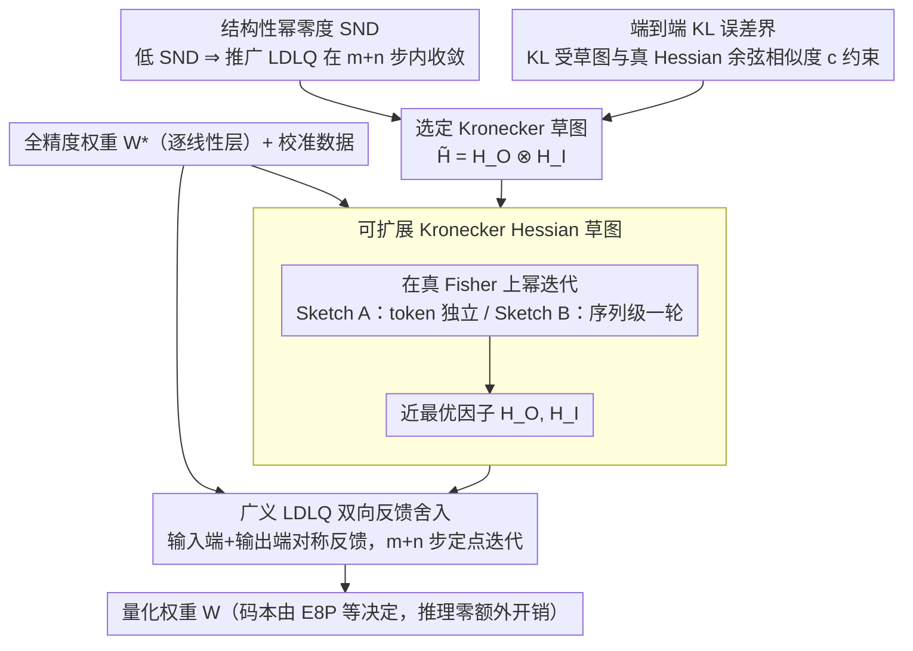

# YAQA: 端到端 KL 最小化的 LLM 自适应权重量化

**会议**: ICML 2026  
**arXiv**: [2505.22988](https://arxiv.org/abs/2505.22988)  
**代码**: 暂未公布  
**领域**: 模型压缩 / LLM 量化  
**关键词**: 量化, 自适应舍入, 端到端 KL, Hessian 草图, Kronecker 分解

## 一句话总结
YAQA 把 LLM 权重量化的代理目标从「逐层激活误差」换成「端到端模型输出 KL 散度」，用 Kronecker 分解的 Hessian 草图给出第一个端到端误差界，相对 GPTQ/LDLQ 把 KL 再降约 30%，甚至比量化感知训练（QAT）更准，且推理速度不变。

## 研究背景与动机

**领域现状**：LLM 量化分两条路线——QAT 通过修改训练流程学习低精度表示，质量好但成本巨大；PTQ 通过事后舍入把全精度权重映射到一组离散码本，代表方法是 GPTQ/LDLQ，因便宜而流行。GPTQ 用「当前层激活误差」的 Hessian $H_1 = \mathbb{E}[x^\top x]$ 当作端到端误差的代理。

**现有痛点**：$H_1$ 只看当前层的输入分布，完全忽略后续层会如何放大或抵消这层的舍入误差。结果是「逐层最优」不等于「全模型最优」，KL 散度往往被无谓地拉高。GuidedQuant/SqueezeLLM 改用经验 Fisher 的块对角近似，但它来自交叉熵任务损失，而非真正的 KL Hessian，且块结构是临时拼凑，没有理论保证——经验上加大块数效果反而不一致。

**核心矛盾**：要直接对 $\nabla^2 L(W^*) \in \mathbb{R}^{mn \times mn}$（KL 关于一层权重的真 Hessian）做自适应舍入，规模就爆炸；要保留 tractable 结构，又得有可证的逼近质量。已有结构化近似要么没有界，要么近似得不好。

**本文目标**：找一个结构化 Hessian 草图，既能在 $O(m+n)$ 步内完成 LDLQ 风格的迭代舍入，又能用「与真 Hessian 的余弦相似度」严格控制端到端 KL。

**切入角度**：作者引入「结构性幂零度」（SND）这个组合量来刻画 LDLQ 收敛步数。证明对 Kronecker 积 $L_O \otimes L_I$ 有 $\mathrm{snd}(L_O \otimes L_I) = \mathrm{snd}(L_O) + \mathrm{snd}(L_I) \le m+n-1$，这就把「可 tractable 计算」直接落到 Kronecker 分解上。

**核心 idea**：用 Kronecker 分解 $\tilde{H} = H_O \otimes H_I$ 作为 $\nabla^2 L(W^*)$ 的近似，通过在真 Fisher 上做幂迭代得到「近最优」的 $H_O, H_I$；舍入算法在 LDLQ 上加一个对称的输出端反馈分量，整体 $\approx 2\times$ LDLQ 时间却把 KL 显著拉低。

## 方法详解

### 整体框架

YAQA 把一层权重的量化看成「在真 Hessian 定义的椭球里找一个最优整点」：最优目标是端到端 KL（Eq 1），二阶近似后由真 Hessian $\nabla^2 L(W^*) \in \mathbb{R}^{mn \times mn}$ 定义椭球，但它太大没法直接用，于是用 Kronecker 草图 $\tilde{H} = H_O \otimes H_I$ 逼近。为什么偏偏选 Kronecker？两条理论给了答案——结构性幂零度（SND）保证这种结构下推广的 LDLQ 仍能在 $m+n$ 步内快速收敛，端到端 KL 误差界则证明只要草图在方向上贴近真 Hessian（余弦相似度 $c$ 越高），输出分布的 KL 就被压得越紧。据此算法落成两步：先在真 Fisher 上幂迭代把近最优的 $H_O, H_I$ 算出来（Sketch A / B 两档），再用带输入端 + 输出端双向反馈的广义 LDLQ 定点迭代把权重逐个吸附到码本。每个线性层独立做一次，不改推理结构，量化模型的速度只由码本（如 E8P）决定，跟 YAQA 无关。

### 关键设计

**1. 结构性幂零度 SND：把「能高效跑 LDLQ」的 Hessian 结构挑出来**

过去 PTQ 只能在两个极端里选——要么用逐层的 $H_1 = \mathbb{E}[x^\top x]$（便宜但只看当前层输入、没有输出端反馈），要么上 QAT（全局最优但训练成本巨大）。YAQA 想找一个中间结构：既允许端到端反馈，又能快速舍入。作者为此定义「结构性幂零度」$\mathrm{snd}(L)$——与 $L-I$ 同支撑的二元幂零矩阵的幂零度，并证明 LDLQ 定点迭代在 $\le \mathrm{snd}(L)$ 步内就收敛。关键性质是：对 Kronecker 积有 $\mathrm{snd}(L_O \otimes L_I) = \mathrm{snd}(L_O) + \mathrm{snd}(L_I) \le m+n-1$，于是 $\tilde{H} = H_O \otimes H_I$ 同时允许「输入端 $L_I$ + 输出端 $L_O$」对称反馈，又只需 $O(m+n)$ 步小矩阵乘法。这也顺手解释了 GuidedQuant 为何在同框架下等价于「块对角近似上跑 LDLQ、缺输出端反馈」，所以块数超过 4 就饱和。

**2. 端到端 KL 误差界：用余弦相似度把草图选择变成可优化目标**

有了可高效计算的结构还不够，得知道哪种 $H_O, H_I$ 真能压住模型输出的 KL。定理 3.4 把端到端误差上界写成草图与真 Hessian 的几何关系：$\mathrm{vec}(\Delta)\, H\, \mathrm{vec}(\Delta)^\top \le \|H\|_F\,(\|\Delta\|_F^2 \sqrt{2-2c} + \text{incoherence/trace 项})$，其中 $c = \langle H,\, H_O \otimes H_I\rangle / (\|H\|_F \|H_O\|_F \|H_I\|_F)$ 正是草图与真 Hessian 的余弦相似度，$\Delta = W^* - W$ 是舍入误差。读出来的信息很直接——草图在方向上越贴合真 Hessian（$c$ 越接近 1），KL 上界越紧，外加 $H_O, H_I$ 要低 incoherence、低秩。这是量化算法第一次拿到端到端误差界，把「Hessian 草图怎么选」从经验拼凑升级成「最大化余弦相似度」的明确数学问题，也直接指向用幂迭代去逼近。

**3. 可扩展 Kronecker Hessian 草图：在 LLM 规模上把 $H_O, H_I$ 算出来（Sketch A / B 两档幂迭代）**

有了「最大化余弦相似度」这个目标，剩下的问题是怎么在 LLM 规模上把它解出来。Kronecker 积本质是 reshape 后的秩-1 乘积，所以最优的 $H_O, H_I$ 可以对真 Hessian 做幂迭代得到；但真 Hessian 不能直接 Monte-Carlo 估（$mn \times mn$ 维度方差爆炸），于是作者给两档可扩展方案，对应「便宜」和「最优」两种取舍。Sketch A 假设序列内 token 独立，把 $H \approx \mathbb{E}[x^\top x \otimes (\nabla_y \ell)^\top (\nabla_y \ell)]$，从 $(H_I)_0 = H_1,\ (H_O)_0 = I$ 起步幂迭代 3 步左右就收敛，用 bias 换 variance、数据少时稳，10B 模型约 20 GPU-hour。Sketch B 直接在真 Fisher 上跑一轮幂迭代（从 $I, I$ 起步），按 sequence 算梯度但只过一遍数据，方差容忍度更高、数据多时质量更好，10B 模型约 30 GPU-hour。两者都借 modified backward pass 做分布式幂迭代，思路类似 Shampoo 的预条件，但关键差别是用真 Fisher（Monte-Carlo 采 logits）而非经验 Fisher——对 KL 目标这一步不能省，否则草图方向会偏。

**4. 广义 LDLQ 双向反馈舍入：把端到端目标真正落到逐元素舍入上**

草图算准了，还得有一套舍入算法把它用起来——这是 YAQA 的算法核心（论文的第一项贡献）。原始 LDLQ 只沿输入通道做线性反馈（Eq 3，用 $H_1$ 的 LDL 三角因子），逐列把权重吸附到码本，因而看不到输出端误差。YAQA 把舍入推广到任意 Kronecker 草图 $\tilde{H} = H_O \otimes H_I$ 上的定点迭代（Eq 4），再借 Kronecker 的 LDL 分解 $L = L_O \otimes L_I$ 把更新展开成 Eq 5/6：$W = Q(W^* + L_O'^{\top}\Delta L_I' + L_O'^{\top}\Delta + \Delta L_I')$，其中 $\Delta = W^* - W$、$L_O' = L_O - I$、$L_I' = L_I - I$。相比 LDLQ，这里多出 $L_O'^{\top}\Delta$ 与 $L_O'^{\top}\Delta L_I'$ 两个「输出端」反馈项，使反馈在输入 / 输出通道上对称——这正是它能优化端到端（而非逐层）误差的关键。由前面的 SND 结论，迭代在 $\mathrm{snd}(L) = \mathrm{snd}(L_O)+\mathrm{snd}(L_I) \le m+n-1$ 步内收敛，每步都是可高度并行的小矩阵乘，因此整体 $\approx 2\times$ LDLQ 耗时（仍可忽略），标量或向量量化器都适用。

### 损失函数 / 训练策略

YAQA 是纯 PTQ，没有显式训练损失，量化后权重一次成形、不再更新。它隐式优化的是 Kronecker 草图下的二次型代理目标 $\mathrm{tr}(\Delta^\top H_O \Delta H_I)$，即上面广义 LDLQ 定点迭代所最小化的量。该流程与 QuIP# 的 randomized Hadamard 变换互补——后者让 $W$ 近高斯、降 incoherence，YAQA 负责把 Hessian 方向算准，两者叠加进一步压低 KL。

## 实验关键数据

### 主实验：LLM 量化质量

| 模型 / 设定 | 方法 | KL ↓ (vs 全精度) | 下游基准 (acc%) ↑ |
|------------|------|-------|-----------------|
| Llama 3.1 8B Inst, W2 | LDLQ (GPTQ) | 基线 | 基线 |
| Llama 3.1 8B Inst, W2 | GuidedQuant | 略优于 LDLQ | 略优 |
| Llama 3.1 8B Inst, W2 | **YAQA Sketch A** | $\approx -30\%$ vs LDLQ | 显著领先 |
| Llama 3.1 8B Inst, W2 | **YAQA Sketch B** | 最低 | 最高 |
| Llama 3.1 8B Inst, W2 | QAT | 高于 YAQA | 低于 YAQA |

（数字按论文摘要与图表汇总；Sketch B 在多个 chat/reasoning 任务上都建立了新的 PTQ SOTA。）

### 消融实验

| 设定 | KL ↓ | 说明 |
|------|------|------|
| LDLQ ($H_O = I, H_I = H_1$) | 基线 | YAQA 退化情形 |
| Sketch A，1 步幂迭代 | 中等 | 初始就用 $H_1$ 起步 |
| Sketch A，3 步幂迭代 | 优秀 | 经验收敛步数 |
| Sketch B，2K 序列 | 优秀 | 1 GPU-hour 也能 SOTA |
| Sketch B，64K 序列 | 最佳 | 30 GPU-hour |
| GuidedQuant，>4 块 | 不再改进 | 缺输出端反馈 |

### 关键发现

- 经验上 $H_O$ 近似低秩（图 1），刚好对应理论里「low rank 时 YAQA 界严格优于 LDLQ」的条件，解释了为什么 Kronecker 草图能赢。
- Sketch B 只跑一轮幂迭代就比 Sketch A 好，说明真 Fisher 的方差与 sequence 级估计能压住——「真的不是」需要严格收敛幂迭代。
- YAQA 用极少数据（2K 序列、1 GPU-hour）就能拿到 SOTA，对 PTQ 的实用性是重要 selling point。
- KL 比 QAT 还低这一结果反直觉但符合理论：QAT 是首阶下降，可能局部最优；YAQA 是「在 Hessian 球内一次性最优舍入」，避开了 QAT 的优化困难。

## 亮点与洞察

- **第一个端到端 KL 上界**：把「Hessian 草图选择」变成「最大化余弦相似度 + 控制 incoherence/rank」的明确数学问题，避免了过往经验式拼凑结构。
- **SND 框架统一了已有方法**：GPTQ、LDLQ、GuidedQuant 都能装进同一个 SND/Kronecker 视角，立刻看清楚谁有输出端反馈、谁没有，理论指导工程选型。
- **Kronecker + 幂迭代恰好兼顾 tractable 与最优**：低 SND 决定速度，余弦相似度决定质量，幂迭代是 Frobenius 范数下最优 Kronecker 逼近的经典工具，三者天然契合。
- **真 Fisher vs 经验 Fisher 的差异**：先前 GuidedQuant/SqueezeLLM 用经验 Fisher（任务损失），YAQA 指出对 KL 目标必须用真 Fisher，用 Monte-Carlo 采 logits，否则方向就偏。

## 局限与展望

- 仅讨论 weight-only PTQ，对 activation 量化和 KV-cache 量化的迁移没展开。
- Sketch B 的 30 GPU-hour 对 70B+ 模型仍偏重；如何用更激进的稀疏化或低秩近似把成本再降一档值得探索。
- 余弦相似度上界中还有 incoherence/trace 项，rank 完全不可控，未来若能控制 $H_O, H_I$ 的有效秩，理论界会更紧。
- 对非线性层（注意力 softmax 等）的全局 Hessian 行为还没单独分析，端到端 KL 在跨层耦合下的更细颗粒结构未深挖。

## 相关工作与启发

- **vs GPTQ / LDLQ**：等价于 YAQA 在 $H_O = I, H_I = H_1$ 的退化情形，被严格包含；理论上 $H_O$ 低秩时 YAQA 上界更紧。
- **vs GuidedQuant / SqueezeLLM**：同样想超越 $H_1$，但用经验 Fisher + 块对角近似，缺输出端反馈、无端到端界；本文用真 Fisher + Kronecker，理论+实验双胜。
- **vs QAT / DiscQuant / PV-Tuning**：QAT 路线要长时间训练，本文证明只用一次幂迭代就能比 QAT 还准，对 PTQ 路线信心很大。
- **vs Shampoo / KFAC**：Hessian 草图思想类似（Kronecker + 幂迭代），但目的是预条件优化器；YAQA 用同款工具做 PTQ 的舍入方向。

## 评分

- 新颖性: ⭐⭐⭐⭐⭐ 第一个把端到端 KL 上界落到量化算法里，并用 SND/Kronecker 给出可证的算法-理论闭环。
- 实验充分度: ⭐⭐⭐⭐⭐ 横扫多个 Llama/Gemma 规模 + 多 bit 配置，跟 LDLQ、GuidedQuant、QAT 都正面交锋，并附 ablation 量化数据需求。
- 写作质量: ⭐⭐⭐⭐ 理论部分推导清晰，但 SND/Kronecker 论证密集，初读门槛偏高；附录补丁较多。
- 价值: ⭐⭐⭐⭐⭐ 对实际 LLM 部署直接有用：几乎零推理成本下把质量推到甚至超过 QAT，是 PTQ 路线的明显进步。

<!-- RELATED:START -->

## 相关论文

- [\[ICML 2026\] Universal Reasoner: 冻结 LLM 的可组合即插即用推理器](universal_reasoner_a_single_composable_plug-and-play_reasoner_for_frozen_llms.md)
- [\[ICML 2026\] "I've Seen How This Goes"：用渐进条件惊奇度刻画 LLM 与人类写作的多样性](ive_seen_how_this_goes_characterizing_diversity_via_progressive_conditional_surp.md)
- [\[ACL 2026\] 当梯度相撞：多目标提示优化对 LLM 评判员的失效模式](../../ACL2026/llm_nlp/when_gradients_collide_failure_modes_of_multi-objective_prompt_optimization_for_.md)
- [\[ICML 2026\] Rethinking LLM Ensembling from the Perspective of Mixture Models](rethinking_llm_ensembling_from_the_perspective_of_mixture_models.md)
- [\[ICML 2026\] Token-Efficient Change Detection in LLM APIs](token-efficient_change_detection_in_llm_apis.md)

<!-- RELATED:END -->
